[English](./README.en.md) | 简体中文

[更新说明](./RELEASE.md) 更新说明

## 总览

这是一个基于 [vue-typescript-admin-template](http://armour.github.io/vue-typescript-admin-template) 的Abp框架后台管理界面

## 前端文档

[文档](https://armour.github.io/vue-typescript-admin-docs/zh)

## 截图

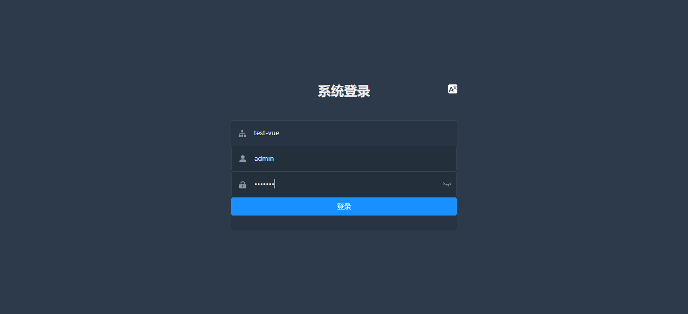

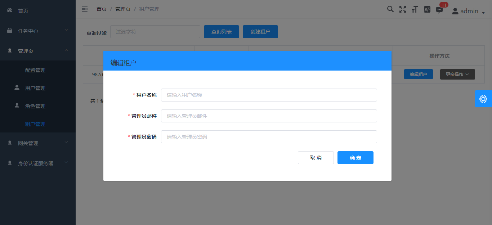

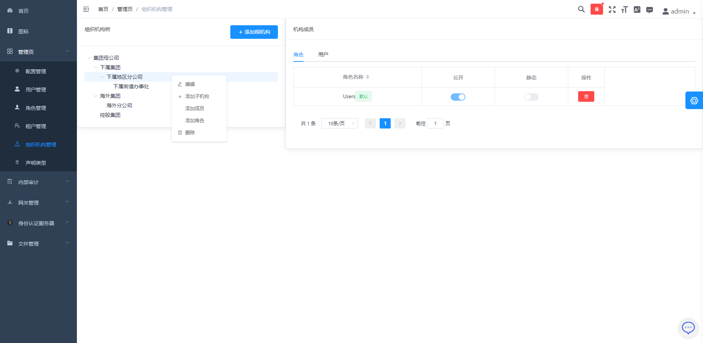

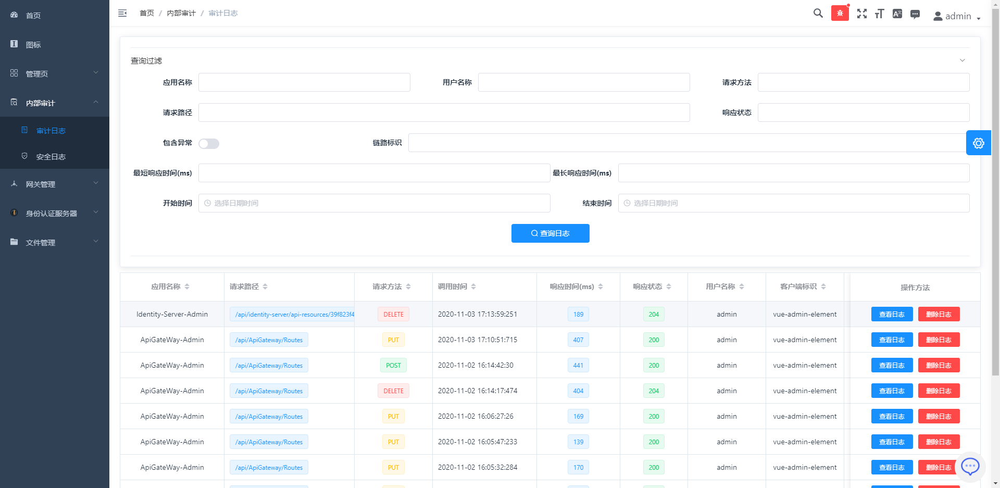

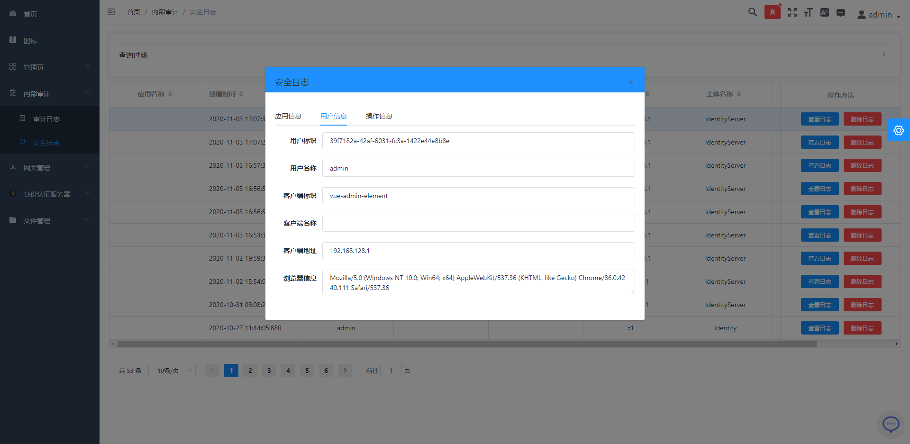

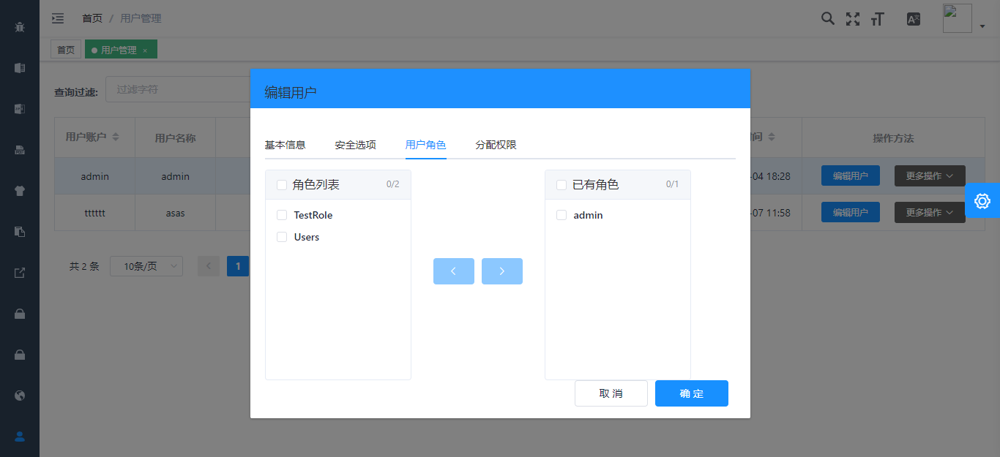

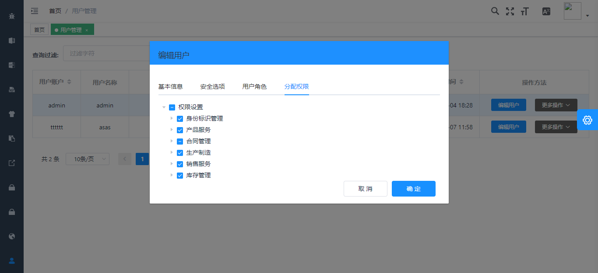

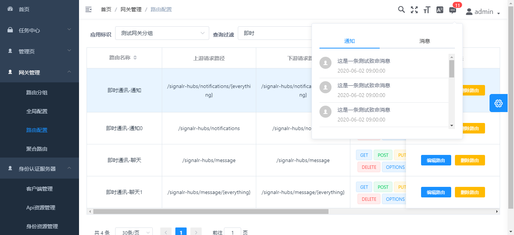

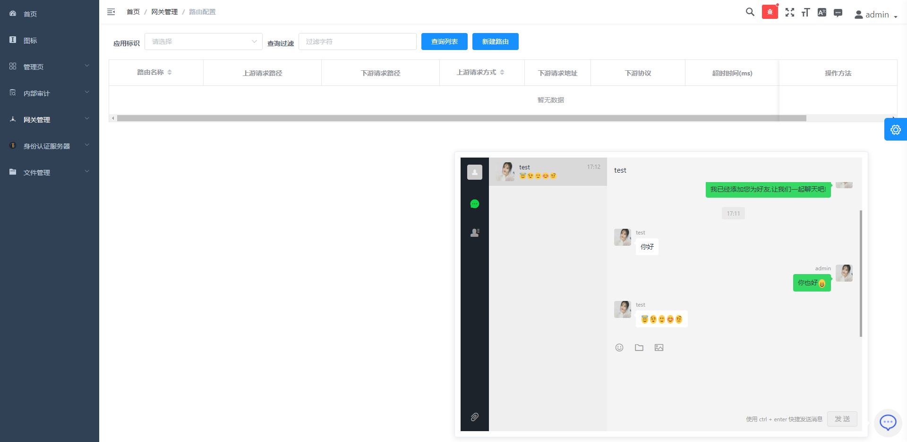

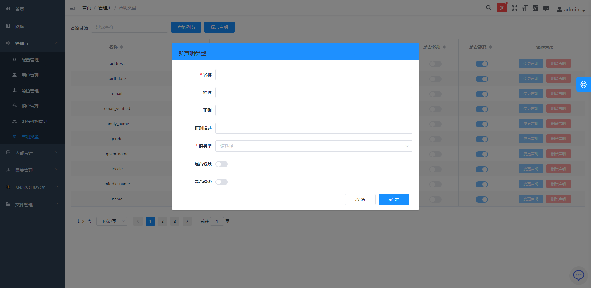

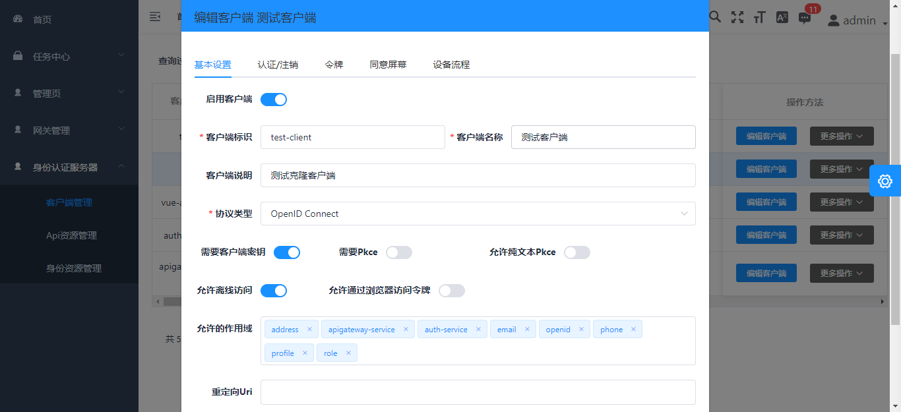

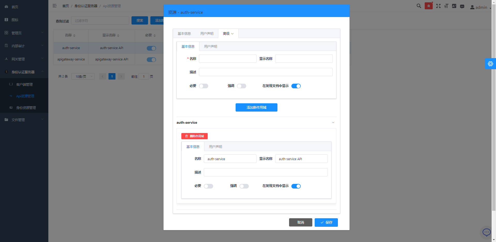

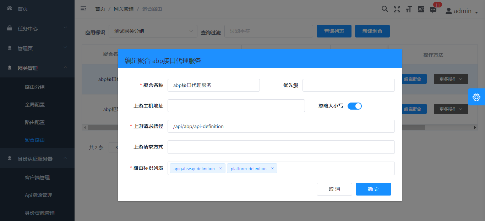

## 相关项目

后端项目

[abpframework/abp](https://github.com/abpframework/abp) (abp vNext)

[EasyAbp/Cap](https://github.com/EasyAbp/Abp.EventBus.CAP) (EasyAbp)

Typescript 版本:

[Armour/vue-typescript-admin-mock-server](https://github.com/armour/vue-typescript-admin-mock-server) (mock server for this project)

[Armour/vue-typescript-admin-docs](https://github.com/armour/vue-typescript-admin-docs) (documentation source for this project)

Javascript 版本:

[PanJiaChen/vue-admin-template](https://github.com/PanJiaChen/vue-admin-template) (a vue2.0 minimal admin template)

[PanJiaChen/vue-element-admin](https://github.com/PanJiaChen/vue-element-admin) (full features supported vue admin)

[PanJiaChen/electron-vue-admin](https://github.com/PanJiaChen/electron-vue-admin) (a vue electron admin project)

## 功能

```txt
- 登录 / 注销

- 权限验证
  - 页面权限
  - 指令权限
  - 权限配置
  - 二步登录

- 多环境发布
  - Dev / Stage / Prod

- 全局功能
  - 国际化多语言
  - 动态换肤
  - 动态侧边栏（支持多级路由嵌套）
  - 动态面包屑
  - 快捷导航(支持右键操作)
  - 粘贴板
  - Svg 图标
  - 搜索
  - 全屏
  - 设置
  - Mock 数据 / Mock 服务器
  - 支持 PWA

- 组件
  - 编辑器
    - 富文本编辑器
    - Markdown 编辑器
    - JSON 编辑器
  - 头像上传
  - 返回顶部
  - CountTo
  - 拖放区
  - 拖拽弹窗
  - 拖拽看板
  - 拖拽列表
  - 拖拽选择
  - ECharts 图表
  - Mixin
  - 拆分窗格
  - 黏性组件

- 表格
  - 动态表格
  - 拖拽表格
  - 内联编辑表格
  - 复杂表格

- Excel
  - 导出excel
  - 导入excel
  - 前端可视化excel

- Zip
  - 导出zip

- PDF
  - 下载 pdf

- 控制台
- 引导页
- 综合实例
- 错误日志
- 错误页面
  - 401
  - 404
```

## 前序准备

你需要在本地安装 [node](http://nodejs.org/) 和 [git](https://git-scm.com/)。本项目技术栈基于 [typescript](https://www.typescriptlang.org/)、[vue](https://cn.vuejs.org/index.html)、[vuex](https://vuex.vuejs.org/zh-cn/)、[vue-router](https://router.vuejs.org/zh-cn/) 、[vue-cli](https://github.com/vuejs/vue-cli) 、[axios](https://github.com/axios/axios) 和 [element-ui](https://github.com/ElemeFE/element)，提前了解和学习这些知识会对使用本项目有很大的帮助。

## 目录结构

本项目已经为你生成了一个完整的开发框架，提供了涵盖后台开发的各类功能和坑位，下面是整个项目的目录结构。

```bash
├── mock                       # mock 服务器 与 模拟数据
├── public                     # 静态资源 (会被直接复制)
│   │── favicon.ico            # favicon图标
│   │── manifest.json          # PWA 配置文件
│   └── index.html             # html模板
├── src                        # 源代码
│   ├── api                    # 所有请求
│   ├── assets                 # 主题 字体等静态资源 (由 webpack 处理加载)
│   ├── components             # 全局组件
│   ├── directive              # 全局指令
│   ├── filters                # 全局过滤函数
│   ├── icons                  # svg 图标
│   ├── lang                   # 国际化
│   ├── layout                 # 全局布局
│   ├── pwa                    # PWA service worker 相关的文件
│   ├── router                 # 路由
│   ├── store                  # 全局 vuex store
│   ├── styles                 # 全局样式
│   ├── utils                  # 全局方法
│   ├── views                  # 所有页面
│   ├── App.vue                # 入口页面
│   ├── main.js                # 入口文件 加载组件 初始化等
│   ├── permission.ts          # 权限管理
│   ├── settings.ts            # 设置文件
│   └── shims.d.ts             # 模块注入
├── tests                      # 测试
├── .circleci/                 # 自动化 CI 配置
├── .browserslistrc            # browserslistrc 配置文件 (用于支持 Autoprefixer)
├── .editorconfig              # 编辑相关配置
├── .env.xxx                   # 环境变量配置
├── .eslintrc.js               # eslint 配置
├── babel.config.js            # babel-loader 配置
├── cypress.json               # e2e 测试配置
├── jest.config.js             # jest 单元测试配置
├── package.json               # package.json 依赖
├── postcss.config.js          # postcss 配置
├── tsconfig.json              # typescript 配置
└── vue.config.js              # vue-cli 配置
```

## 如何设置以及启动项目

### 安装依赖

```bash
yarn install
```

### 更改配置文件


修改开发环境用于代理的服务器地址,以下提供了三个分别为IdentityServer、SignalT、ApiService地址
如果自己变更了端口，需要改成自己的地址

```bash

    proxy: {
      // change xxx-api/login => /mock-api/v1/login
      // detail: https://cli.vuejs.org/config/#devserver-proxy
      [process.env.VUE_APP_BASE_IDENTITY_SERVER]: {
        // IdentityServer4服务器地址，用于身份认证
        target: 'http://localhost:44385',
        changeOrigin: true,
        pathRewrite: {
          ['^' + process.env.VUE_APP_BASE_IDENTITY_SERVER]: ''
        }
      },
      [process.env.VUE_APP_SIGNALR_SERVER]: {
        // 消息服务SignalR地址，SignalR使用WebSocket通讯，因此需要单独一个代理地址
        target: 'ws://localhost:30000',
        changeOrigin: true,
        pathRewrite: {
          ['^' + process.env.VUE_APP_SIGNALR_SERVER]: ''
        },
        logLevel: 'debug'
      },
      [process.env.VUE_APP_BASE_API]: {
        // 其他所有业务都是通过网关代理，直接填写网关地址即可
        target: 'http://localhost:30000',
        changeOrigin: true,
        pathRewrite: {
          ['^' + process.env.VUE_APP_BASE_API]: ''
        },
        logLevel: 'debug'
      }
    }

```

修改生产环境真实地址,如上

```bash

# Base api
# Remeber to change this to your production server address
# Here I used my mock server for this project
# VUE_APP_BASE_API = 'https://vue-typescript-admin-mock-server.armour.now.sh/mock-api/v1/'

# 所有第一级请求路径为 /api 的为业务服务
VUE_APP_BASE_API = '/api'
# 所有第一级请求路径为 /signalr-hubs 的请求为SignalR请求
VUE_APP_SIGNALR_SERVER = '/signalr-hubs'
# 所有第一级请求路径为 /connect 的为 IdentityServer4 的请求
VUE_APP_BASE_IDENTITY_SERVER = '/connect'

# 默认的租户名称
VUE_APP_TENANT_NAME = ''
# 客户端标识
VUE_APP_CLIENT_ID = 'vue-admin-element'
# 客户端密钥
VUE_APP_CLIENT_SECRET = '1q2w3e*'

```

### 初始化 appsettings.json

当前所有启动项目配置存储在 **./aspnet-core/configuration** 目录,请按照给定的项目名称复制到自己的项目目录(仅在您第一次克隆此仓库是这样做)

确保配置文件与您的开发环境中间件的连接配置相同,例如RabbitMQ、MySql、Redis等

### EntityFramework 迁移

请切换到服务项目启动目录, 执行 **dotnet ef** 命令进行数据库迁移

例如：
``` shell

cd aspnet-core/services/admin/LINGYUN.BackendAdminApp.Host

dotnet ef database update

```

- 也可以使用快速迁移脚本文件: **./build/build-aspnetcore-ef-update.ps1**


### 初始化网关数据库

在 **2020-08-05 16:25:00** 的提交中, 已经将**apigateway-init.sql**文件内容读取并写入**DataSeeder**类型, 启动网关管理项目会自动初始化网关数据, 
请确保**aspnet-core/database/apigateway-init.sql**文件存在

### 配置RabbitMQ

因此项目设计为微服务架构，服务间通讯采用分布式事件的方式，项目采用的是[DotNetCore/CAP](https://github.com/dotnetcore/CAP)
通讯方式为**RabbitMQ Server**，所以您需要事先安装**RabbitMQ**，具体安装方式请查阅官网

然后您需要更改配置文件中的**CAP:RabbitMQ**配置项,设置为您自己定义的配置,推荐使用**rabbitmq_management**插件便于快速管理**RabbitMQ**


### 启动后台服务

```shell
cd aspnet-core/services

start-all-service.bat

```

### 启动本地开发环境（自带热启动）

```shell

cd vueJs

start-vue-admin.bat

```

### 构建生产环境 (自带压缩)

```bash
yarn build:prod
```

### 关于docker容器部署

**第一步**: 构建后台服务, powershell脚本:**./build/build-aspnetcore-release.ps1**, **注意:发布后的服务需要 appsettings.Production.json 文件**

**第二步**: 构建前端, **./build/build-vue-element-admin.ps1**

**第三步**: 构建后的发布地址默认在**cd ./aspnet-core/services/Publish** ,变更nginx代理服务器地址: **./client/docker/nginx/default.conf**

**第四步**: 运行此命令 **sudo docker-compose down && sudo docker-compose -f docker-compose.yml -f docker-compose.override.yml up --build -d**

**推荐使用 jenkins 之类的ci工具,可以将此简化为一个步骤**


### 代码格式检查以及自动修复

```bash
yarn lint
```

### 运行单元测试

```bash
yarn test:unit
```

### 运行端对端测试

```bash
yarn test:e2e
```

### 自动生成 svg 组件

```bash
yarn run svg
```

### 自定义 Vue 配置

请看 [Configuration Reference](https://cli.vuejs.org/config/).

## 浏览器支持

Modern browsers and Internet Explorer 10+.

| [](http://godban.github.io/browsers-support-badges/)</br>IE / Edge | [](http://godban.github.io/browsers-support-badges/)</br>Firefox | [](http://godban.github.io/browsers-support-badges/)</br>Chrome | [](http://godban.github.io/browsers-support-badges/)</br>Safari |
| --------- | --------- | --------- | --------- |
| IE10, IE11, Edge| last 2 versions| last 2 versions| last 2 versions

## 参与贡献

请看 [CONTRIBUTING.md](https://github.com/Armour/vue-typescript-admin-template/blob/master/.github/CONTRIBUTING.md)

## License

[MIT License](https://github.com/Armour/vue-typescript-admin-template/blob/master/LICENSE)
