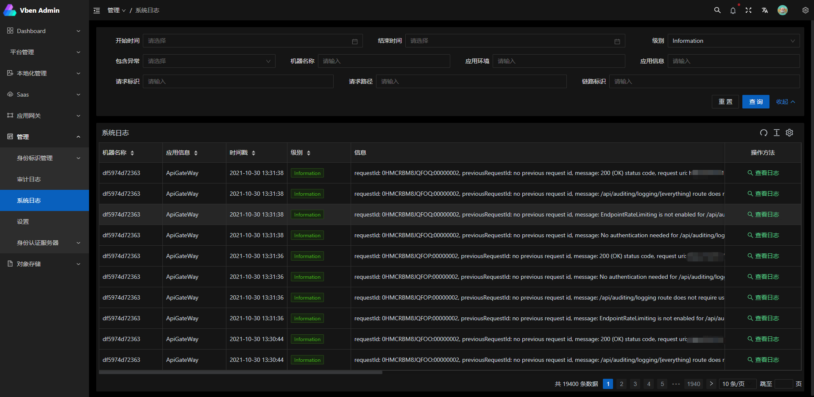
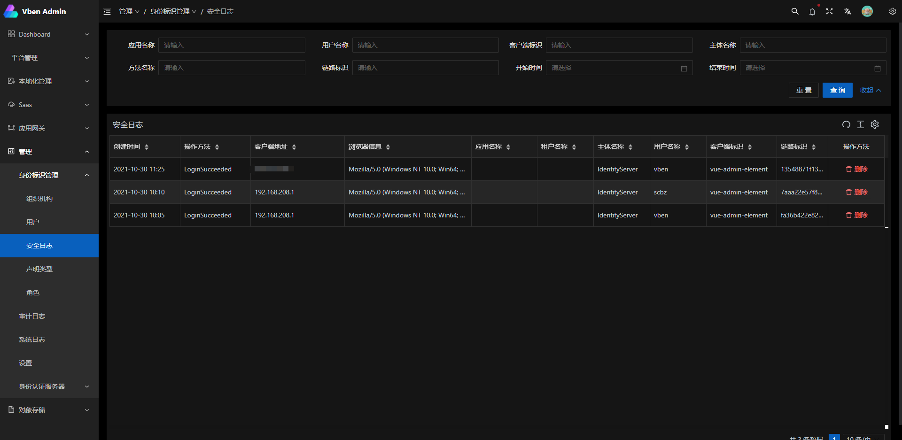
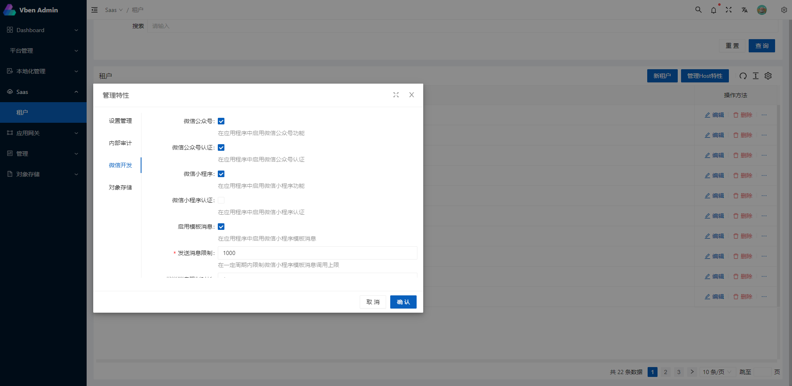

[English](./README.en.md) | 简体中文

[更新说明](./RELEASE.md) 更新说明

## 总览

这是一个基于 [vue-vben-admin](https://github.com/anncwb/vue-vben-admin) 的Abp框架后台管理界面


## 快速搭建微服务启动项目

### 1、安装dotnet工具

```shell
  dotnet tool install --global LINGYUN.Abp.Cli --version 5.0.0
```

### 2、安装.NET模板

```shell
  dotnet new --install LINGYUN.Abp.MicroService.Templates::5.0.0
```

### 3、使用cli创建一个项目

```shell
  # 使用 sqlserver 连接字符串初始化一个项目
  # MyCompanyName 公司名称
  # MyProjectName 项目名称
  # MyPackageName 包名
  # -o  输出到指定目录,见abp cli
  # --dbms  指定数据库驱动,见abp cli
  # --cs    指定数据库连接字符串
  # --no-random-port 不使用随机端口（默认应用端口5000、dapr监听端口3500）
  labp create MyCompanyName.MyProjectName -pk MyPackageName -o "D:\Project" --dbms sqlserver --cs "Server=127.0.0.1;Database=MyProject;User Id=sa;Password=123456" --no-random-port

  cd D:\Project\host\MyPackageName.MyCompanyName.MyProjectName.HttpApi.Host

  dotnet restore

  dotnet run

  start http://127.0.0.1:5000/

```

## 截图










## 相关项目

后端项目

[abpframework/abp](https://github.com/abpframework/abp) (abp vNext)

[EasyAbp/Cap](https://github.com/EasyAbp/Abp.EventBus.CAP) (EasyAbp)

前端项目

[vue-vben-admin](https://github.com/anncwb/vue-vben-admin.git) (vue-vben-admin)

## 准备

- [node](http://nodejs.org/) 和 [git](https://git-scm.com/) -项目开发环境
- [Vite](https://vitejs.dev/) - 熟悉 vite 特性
- [Vue3](https://v3.vuejs.org/) - 熟悉 Vue 基础语法
- [TypeScript](https://www.typescriptlang.org/) - 熟悉`TypeScript`基本语法
- [Es6+](http://es6.ruanyifeng.com/) - 熟悉 es6 基本语法
- [Vue-Router-Next](https://next.router.vuejs.org/) - 熟悉 vue-router 基本使用
- [Ant-Design-Vue](https://2x.antdv.com/docs/vue/introduce-cn/) - ui 基本使用
- [Mock.js](https://github.com/nuysoft/Mock) - mockjs 基本语法

## 目录结构

本项目已经为你生成了一个完整的开发框架，提供了涵盖后台开发的各类功能和坑位，下面是整个项目的目录结构。

```bash
├── mock                       # mock 服务器 与 模拟数据
├── public                     # 静态资源 (会被直接复制)
│   │── favicon.ico            # favicon图标
│   │── manifest.json          # PWA 配置文件
│   └── index.html             # html模板
├── src                        # 源代码
│   ├── api                    # 所有请求
│   ├── assets                 # 主题 字体等静态资源 (由 webpack 处理加载)
│   ├── components             # 全局组件
│   ├── directive              # 全局指令
│   ├── enums                  # 全局枚举
│   ├── hooks                  # 全局hooks
│   ├── locales                # 国际化
│   ├── layout                 # 全局布局
│   ├── router                 # 路由
│   ├── settings               # 全局 配置
│   ├── store                  # 全局 vuex store
│   ├── utils                  # 全局方法
│   ├── views                  # 所有页面
│   ├── App.vue                # 入口页面
│   └── main.js                # 入口文件 加载组件 初始化等
├── types                      # ts类型
├── tests                      # 测试
├── .env.xxx                   # 环境变量配置
├── .eslintrc.js               # eslint 配置
├── jest.config.js             # jest 单元测试配置
├── package.json               # package.json 依赖
├── postcss.config.js          # postcss 配置
├── tsconfig.json              # typescript 配置
└── vite.config.js             # vue vite 配置
```

## 如何设置以及启动项目

### 安装依赖

```bash
yarn install
```

### 更改配置文件


修改开发环境用于代理的服务器地址,以下提供了三个分别为IdentityServer、SignalT、ApiService地址
如果自己变更了端口，需要改成自己的地址

```bash

VITE_PROXY = [["/connect","http://127.0.0.1:44385"],["/api","http://127.0.0.1:30000"],["/signalr-hubs","ws://127.0.0.1:30000"]]

```

修改生产环境真实地址,如上

```bash

# STS Connect
# token签发地址
VITE_GLOB_AUTHORITY='http://127.0.0.1:44385'
# 客户端标识
VITE_GLOB_CLIENT_ID='vue-admin-element'
# 客户端密钥
VITE_GLOB_CLIENT_SECRET='1q2w3e*'


```

### EntityFramework 迁移

请切换到服务项目启动目录, 执行 **dotnet ef** 命令进行数据库迁移

例如：
``` shell

cd aspnet-core/services/admin/LINGYUN.BackendAdminApp.Host

dotnet ef database update

```

- 也可以使用快速迁移脚本文件: **./build/build-aspnetcore-ef-update.ps1**


### 配置RabbitMQ

因此项目设计为微服务架构，服务间通讯采用分布式事件的方式，项目采用的是[DotNetCore/CAP](https://github.com/dotnetcore/CAP)
通讯方式为**RabbitMQ Server**，所以您需要事先安装**RabbitMQ**，具体安装方式请查阅官网

然后您需要更改配置文件中的**CAP:RabbitMQ**配置项,设置为您自己定义的配置,推荐使用**rabbitmq_management**插件便于快速管理**RabbitMQ**


### 启动后台服务

```shell
cd aspnet-core/services

start-all-service.bat

```

### 启动本地开发环境

```shell

cd apps/vue

yarn dev

```

### 构建生产环境

```bash
yarn build
```

### 关于docker容器部署

**第一步**: 构建后台服务, powershell脚本:**./build/build-aspnetcore-release.ps1**, **注意:发布后的服务需要 appsettings.Production.json 文件**

**第二步**: 构建前端, **./build/build-vue-apps.ps1**

**第三步**: 构建后的发布地址默认在**cd ./aspnet-core/services/Publish** ,变更nginx代理服务器地址: **./client/docker/nginx/default.conf**

**第四步**: 运行此命令 **sudo docker-compose down && sudo docker-compose -f docker-compose.yml -f docker-compose.override.yml up --build -d**

**推荐使用 jenkins 之类的ci工具,可以将此简化为一个步骤**


### 代码格式检查以及自动修复

```bash
yarn lint:eslint
```

### 运行单元测试

```bash
yarn test:unit
```

## 如何贡献

非常欢迎你的加入！提一个 Issue 或者提交一个 Pull Request。

**Pull Request:**

1. Fork 代码!
2. 创建自己的分支: `git checkout -b feat/xxxx`
3. 提交你的修改: `git commit -am 'feat(function): add xxxxx'`
4. 推送您的分支: `git push origin feat/xxxx`
5. 提交`pull request`

## Git 贡献提交规范

- 参考 [vue](./apps/vue/.github/COMMIT_CONVENTION.md) 规范 ([Angular](https://github.com/conventional-changelog/conventional-changelog/tree/master/packages/conventional-changelog-angular))

  - `feat` 增加新功能
  - `fix` 修复问题/BUG
  - `style` 代码风格相关无影响运行结果的
  - `perf` 优化/性能提升
  - `refactor` 重构
  - `revert` 撤销修改
  - `test` 测试相关
  - `docs` 文档/注释
  - `chore` 依赖更新/脚手架配置修改等
  - `workflow` 工作流改进
  - `ci` 持续集成
  - `types` 类型定义文件更改
  - `wip` 开发中

## 浏览器支持

本地开发推荐使用`Chrome 80+` 浏览器

支持现代浏览器, 不支持 IE

| [](http://godban.github.io/browsers-support-badges/)</br>IE | [](http://godban.github.io/browsers-support-badges/)</br>Edge | [](http://godban.github.io/browsers-support-badges/)</br>Firefox | [](http://godban.github.io/browsers-support-badges/)</br>Chrome | [](http://godban.github.io/browsers-support-badges/)</br>Safari |
| :-: | :-: | :-: | :-: | :-: |
| not support | last 2 versions | last 2 versions | last 2 versions | last 2 versions |


## License

[MIT License](./LICENSE)
