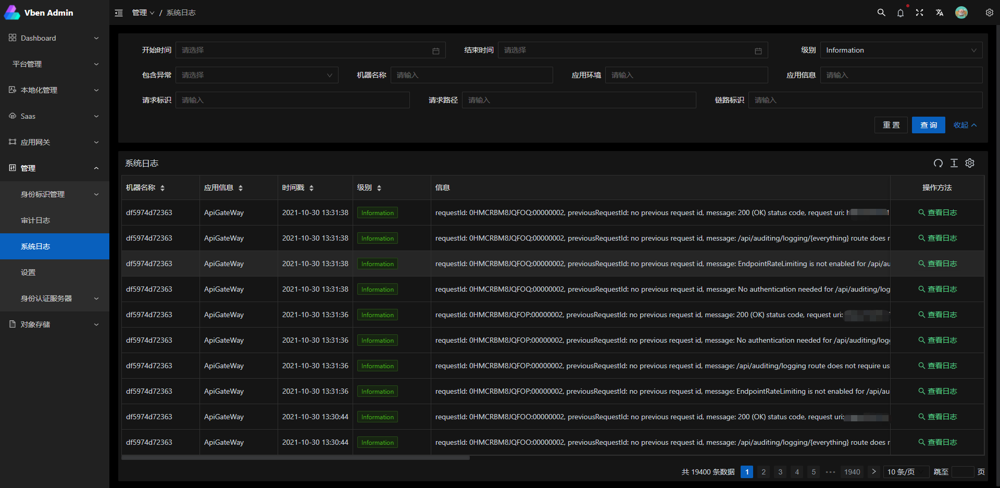
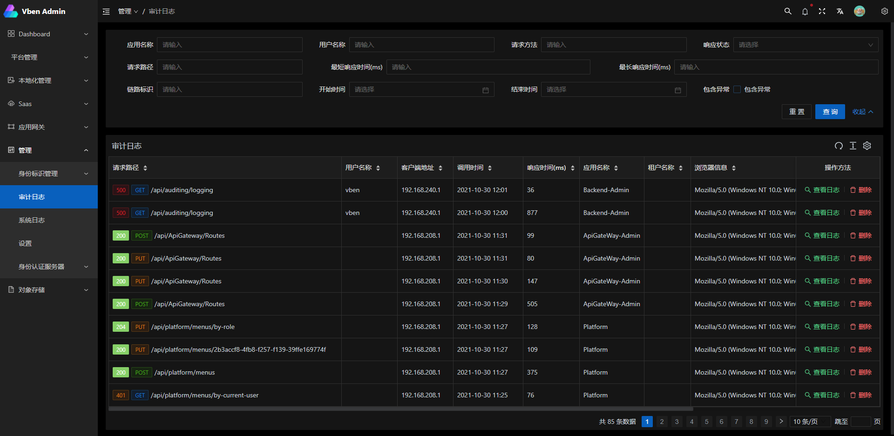
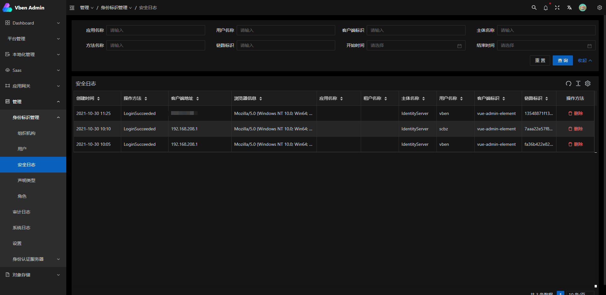
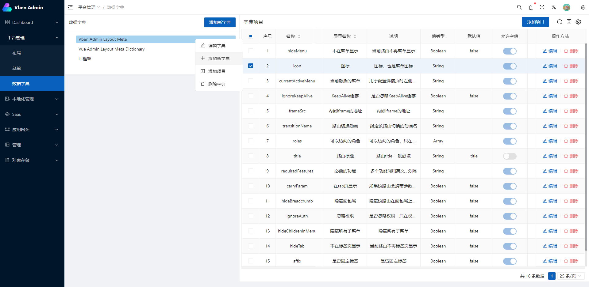
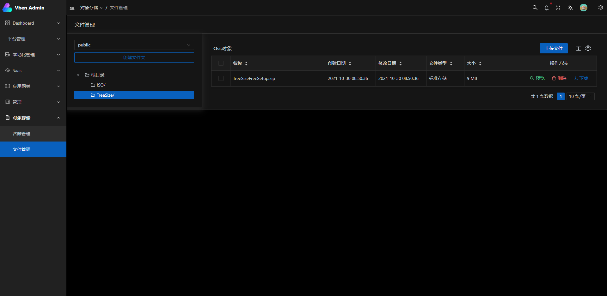
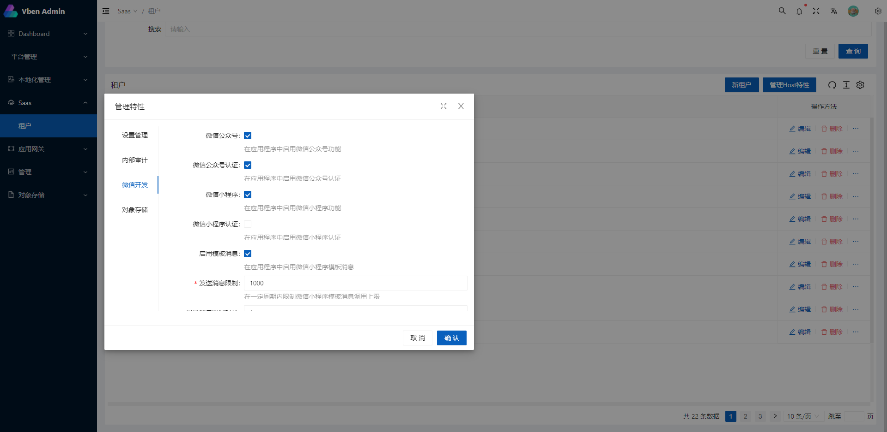
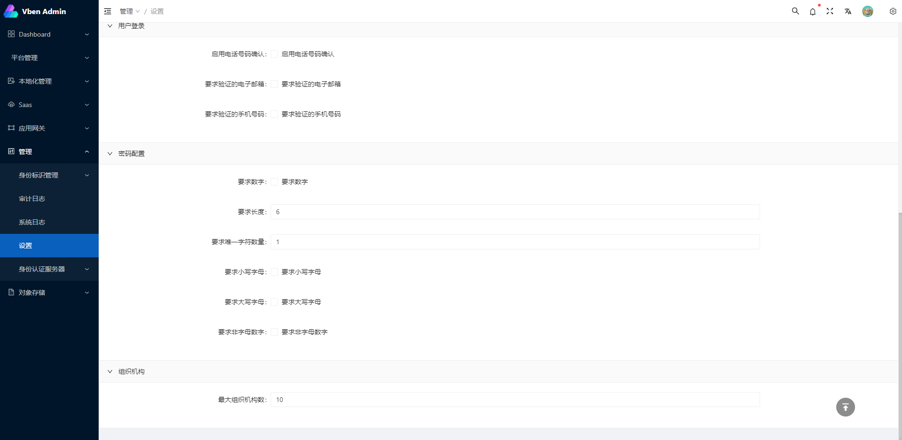
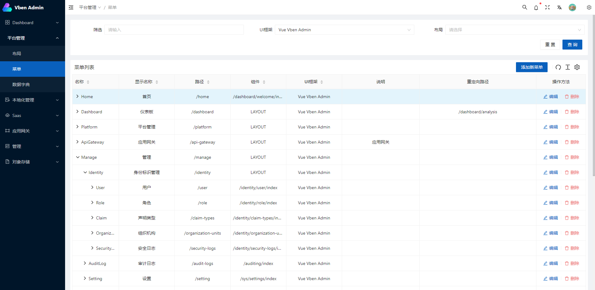
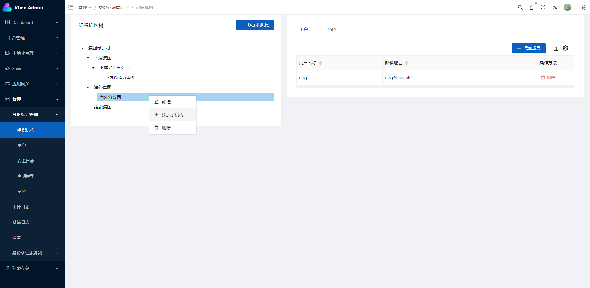
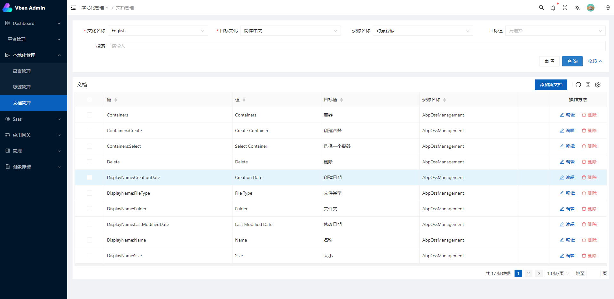

[English](./README.en.md) | 简体中文

[更新说明](./RELEASE.md) 更新说明

## 总览

这是一个基于 [vue-vben-admin](https://github.com/anncwb/vue-vben-admin) 的Abp框架后台管理界面

## Build

[](https://github.com/colinin/abp-next-admin/actions/workflows/build.yml)  [](https://www.nuget.org/packages/LINGYUN.Abp.Core)

## 部署方案

### 单体服务部署

如果您不需要微服务架构，可以选择单体服务部署方案。单体服务具有部署简单、维护方便的特点。

- [单体服务启动说明](./docs/startup-aio-readme.md)
- [Monolithic Service Startup Guide](./docs/startup-aio-readme.en.md)

### 微服务部署

如果您需要更高的可扩展性和更灵活的服务架构，可以选择微服务部署方案。

## 快速搭建微服务启动项目

### 0、设置hosts文件
windows下，修改 C:\Windows\System32\drivers\etc\hosts 文件；
linux下，修改 /etc/hosts；
增加如下配置：
```
	127.0.0.1 host.docker.internal
```
linux下，修改完hosts后需要重启网络，在shell中执行：
```shell
	/etc/init.d/network restart
```

### 1、安装dotnet工具

```shell
  dotnet tool install --global LINGYUN.Abp.Cli
```

### 2、安装.NET模板

```shell
  dotnet new --install LINGYUN.Abp.MicroService.Templates
```

### 3、使用cli创建一个项目

```shell
  # 使用 sqlserver 连接字符串初始化一个项目
  # MyCompanyName 公司名称
  # MyProjectName 项目名称
  # MyPackageName 包名
  # -o  输出到指定目录,见abp cli
  # --dbms  指定数据库驱动,见abp cli
  # --cs    指定数据库连接字符串
  # --no-random-port 不使用随机端口（默认应用端口5000、dapr监听端口3500）
  labp create MyCompanyName.MyProjectName -pk MyPackageName -o "D:\Project" --dbms sqlserver --cs "Server=127.0.0.1;Database=MyProject;User Id=sa;Password=123456" --no-random-port

  cd D:\Project\host\MyPackageName.MyCompanyName.MyProjectName.HttpApi.Host

  dotnet restore

  dotnet run

  start http://127.0.0.1:5000/

```

### 问题反馈

* 作者不是自由职业者，并没有那么多时间维护项目，如果出现问题，可以邮件联系 **colin.in@foxmail.com**，也可以加入QQ群聊: 795966922  

## 截图





















## 相关项目

后端项目

[abpframework/abp](https://github.com/abpframework/abp) (abp vNext)

[EasyAbp/Cap](https://github.com/EasyAbp/Abp.EventBus.CAP) (EasyAbp)

[DotNetCore/CAP](https://github.com/dotnetcore/CAP) (CAP)

前端项目

[vue-vben-admin](https://github.com/anncwb/vue-vben-admin.git) (vue-vben-admin)

## 准备

- [node](http://nodejs.org/) 和 [git](https://git-scm.com/) -项目开发环境
- [Vite](https://vitejs.dev/) - 熟悉 vite 特性
- [Vue3](https://v3.vuejs.org/) - 熟悉 Vue 基础语法
- [TypeScript](https://www.typescriptlang.org/) - 熟悉`TypeScript`基本语法
- [Es6+](http://es6.ruanyifeng.com/) - 熟悉 es6 基本语法
- [Vue-Router-Next](https://next.router.vuejs.org/) - 熟悉 vue-router 基本使用
- [Ant-Design-Vue](https://2x.antdv.com/docs/vue/introduce-cn/) - ui 基本使用
- [Mock.js](https://github.com/nuysoft/Mock) - mockjs 基本语法

## 目录结构

### 前端：apps/vben5（pnpm workspace + turbo 的 monorepo）

```bash
apps/vben5/
├── apps/                        # 可独立运行的 UI 应用
│   ├── app-antd/                # ABP 业务前端（当前使用：pnpm dev:app / pnpm build:app）
│   ├── web-antd/                # vben 官方 antd 示例应用
│   ├── web-antdv-next/          # antdv-next 示例应用
│   ├── web-ele/                 # Element Plus 示例应用
│   ├── web-naive/               # Naive UI 示例应用
│   └── web-tdesign/             # TDesign 示例应用
├── packages/
│   ├── @abp/                    # ABP 业务模块包（27 个）
│   │   ├── account/             # 账户、外部登录（第三方账号绑定）
│   │   ├── ai-management/       # AI 管理（工作区、工具、智能体）
│   │   ├── auditing/            # 审计日志、安全日志
│   │   ├── blob-management/     # 对象存储（容器、文件）
│   │   ├── cache-management/    # 缓存管理
│   │   ├── components/          # ABP 前端通用业务组件
│   │   ├── core/                # ABP 前端核心（请求、权限、菜单等基础能力）
│   │   ├── data-protection/     # 数据保护（实体/字段级访问控制）
│   │   ├── demo/                # 示例模块
│   │   ├── features/            # 特性（Feature）管理
│   │   ├── gdpr/                # GDPR 数据导出与删除
│   │   ├── identity/            # 用户、角色、组织机构、会话、登录日志
│   │   ├── localization/        # 本地化（语言、资源、文本）
│   │   ├── notifications/       # 通知（通知定义、我的通知、发送记录）
│   │   ├── openiddict/          # OpenIddict（应用、作用域、授权、令牌）
│   │   ├── oss/                 # OSS/Blob 文件列表
│   │   ├── permissions/         # 权限定义与授权
│   │   ├── platform/            # 平台（布局、菜单、数据字典、邮件/短信）
│   │   ├── request/             # HTTP 请求封装（令牌、错误处理、租户头）
│   │   ├── saas/                # 租户与版本（Edition）
│   │   ├── settings/            # 设置定义与设置值
│   │   ├── signalr/             # SignalR 实时通信
│   │   ├── tasks/               # 后台任务（作业管理）
│   │   ├── text-templating/     # 文本模板
│   │   ├── ui/                  # ABP 前端 UI 组件库
│   │   ├── webhooks/            # Webhook 定义、订阅与发送记录
│   │   └── wechat/              # 微信（公众号、企业微信等）
│   ├── @core/                   # 内核：base / ui-kit / forward
│   ├── effects/                 # 通用能力：plugins / hooks / common-ui 等
│   ├── icons/  types/           # 图标、类型定义
│   └── ...                      # 其余公共包（见 pnpm-workspace.yaml）
├── internal/                    # 工程化配置：vite-config / lint-configs / tailwind-config / tsconfig / node-utils
├── docs/                        # VitePress 文档
├── playground/                  # 组件与示例演练场
├── scripts/                     # 清理、构建、部署等脚本
├── package.json                 # 根脚本：dev / dev:app / build:app / lint / format / test:unit / check:type
├── pnpm-workspace.yaml          # workspace 划分与依赖 catalog
├── turbo.json                   # turbo 流水线配置
└── vitest.config.ts             # 单元测试（vitest）配置
```

### 后端：aspnet-core 与配套目录

```bash
.
├── aspnet-core/
│   ├── services/                # 各服务宿主（含 Dockerfile）
│   │   ├── LINGYUN.Abp.MicroService.AuthServer/        # 认证服务（STS，44385）
│   │   ├── LINGYUN.Abp.MicroService.IdentityService/   # 身份服务（30015）
│   │   ├── LINGYUN.Abp.MicroService.AdminService/      # 管理服务（30010）
│   │   ├── LINGYUN.Abp.MicroService.LocalizationService/# 本地化服务（30030）
│   │   ├── LINGYUN.Abp.MicroService.PlatformService/   # 平台服务（30025）
│   │   ├── LINGYUN.Abp.MicroService.MessageService/    # 消息服务（30020）
│   │   ├── LINGYUN.Abp.MicroService.TaskService/       # 任务服务（30040）
│   │   ├── LINGYUN.Abp.MicroService.WebhookService/    # Webhook 服务（30045）
│   │   ├── LINGYUN.Abp.MicroService.WorkflowService/   # 工作流服务（30050）
│   │   ├── LINGYUN.Abp.MicroService.WeChatService/     # 微信服务（30060）
│   │   ├── LINGYUN.Abp.MicroService.AIService/         # AI 服务（30070）
│   │   ├── LY.MicroService.Applications.Single/        # 单体应用（30000，合并网关与全部模块）
│   │   ├── LY.MicroService.IdentityServer/             # IdentityServer 版本服务与宿主
│   │   ├── LINGYUN.Abp.Applications/  LY.AIO.Applications.Single/  # 其它宿主
│   │   └── Publish/             # 发布输出目录（容器镜像构建使用）
│   ├── modules/                 # 业务模块，每个模块按 DDD 分层（Domain / Application / EntityFrameworkCore / HttpApi ...）
│   │   ├── account/             # 账户与登录（含 OpenIddict/IdentityServer 的 Web 集成、验证码）
│   │   ├── identity/            # 用户、角色、组织机构、会话、登录日志
│   │   ├── identityServer/      # IdentityServer4 相关实现
│   │   ├── openIddict/          # OpenIddict 服务端（应用、作用域、令牌、Portal、二维码、短信、微信登录）
│   │   ├── permissions-management/  # 权限管理与授权
│   │   ├── saas/                # 多租户与版本
│   │   ├── settings/  feature-management/  # 设置、特性管理
│   │   ├── localization-management/  text-templating/  # 本地化、文本模板
│   │   ├── auditing/  data-protection/  gdpr/  captcha/  # 审计、数据保护、GDPR、验证码
│   │   ├── blob-management/  caching-management/  # 对象存储、缓存管理
│   │   ├── platform/  project/  system-info/  demo/  # 平台、项目、系统信息、示例
│   │   ├── realtime-message/  realtime-notifications/  # 即时消息、实时通知
│   │   ├── task-management/  rules-management/  webhooks/  # 后台任务、规则引擎、Webhook
│   │   ├── ai/  elsa/           # AI 能力、工作流（Elsa）
│   ├── framework/               # 基础框架包（33 个分组），常用分组：
│   │   ├── common/  core 相关基础包（LINGYUN.Abp.Core、CAP、Hangfire、BlobStoring、SignalR ...）
│   │   ├── security/  authentication/  authorization/   # 安全、登录方式、授权
│   │   ├── auditing/  logging/  telemetry/              # 审计、日志、链路追踪（OpenTelemetry/SkyWalking）
│   │   ├── multi-tenancy 相关：tenants/                 # 多租户与版本
│   │   ├── wechat/  wx-pusher/  pushplus/  tui-juhe/    # 微信、消息推送
│   │   ├── cloud-aliyun/  cloud-tencent/                # 阿里云、腾讯云集成
│   │   ├── dapr/  elasticsearch/  efcore/  data-protection/  # Dapr、ES、EF Core、数据保护
│   │   ├── dynamic-queryable/  dynamic-definition/  exporter/  # 动态查询、动态定义、导入导出
│   │   ├── localization/  settings/  features/  mvc/  open-api/  cli/  ...  # 其它基础包
│   ├── migrations/              # 各服务的 DbMigrator 与 EntityFrameworkCore 迁移项目（deploy.ps1 会依次执行）
│   ├── aspire/                  # .NET Aspire：LINGYUN.Abp.MicroService.AppHost 及各服务的 Aspire 宿主
│   ├── templates/               # dotnet new 项目模板（micro 微服务 / aio 单体）
│   ├── tests/                   # 单元测试项目
│   ├── LINGYUN.MicroService.All.slnx            # 全量解决方案
│   ├── LINGYUN.MicroService.Aspire.slnx         # Aspire 解决方案
│   └── LINGYUN.MicroService.SingleProject.slnx  # 单体解决方案
├── gateways/
│   ├── internal/                # 内部网关（YARP）：Internal.Gateway / OpenApi.Gateway + yarp*.json 路由
│   └── web/                     # Web 网关：LY.MicroService.ApiGateway
├── apps/                        # 前端：vben5（当前）/ vue（旧版）
├── build/                       # 构建与迁移脚本：build-aspnetcore-ef-update.ps1、build-aspnetcore-docker-build.ps1 ...
├── deploy/                      # 一键部署脚本（deploy.ps1）、中间件数据与各服务日志目录
├── docs/                        # 文档（单体服务启动指南等）
├── docker-compose.yml                        # 后端服务编排
├── docker-compose.override.yml               # 镜像标签、卷映射与启动顺序
├── docker-compose.override.configuration.yml # 各服务环境变量（连接串、CAP、Redis、Elasticsearch 等）
├── docker-compose.middleware.yml             # 中间件：MySQL/Redis/RabbitMQ/Elasticsearch/Kibana/Logstash/OpenObserve
├── docker-compose.override.agile.yml         # AgileConfig 配置中心（可选）
├── Directory.Build.props  Directory.Packages.props  NuGet.Config  common.props  # 统一构建与包版本管理
└── README.md  README.en.md  RELEASE.md  LICENSE  # 文档与许可
```

## 启动项目

本项目提供三种启动方式，按需选择：

| 方式 | 说明 | 中间件 | 前端 |
| --- | --- | --- | --- |
| 方式一：微服务 | 完整微服务架构，后端全部以容器运行 | 需**先启动** `docker-compose.middleware.yml` | 单独启动 vben5 |
| 方式二：Aspire | AppHost 编排本地微服务开发环境 | AppHost 自动创建容器（PostgreSQL/Redis/RabbitMQ/Elasticsearch/Kibana） | AppHost 自动启动 |
| 方式三：单体 | 网关、认证与业务模块合并为一个进程 | 需**先启动** `docker-compose.middleware.yml` | 单独启动 vben5 |

### 通用前提

- **.NET SDK 10**（`dotnet --version`）
- **Docker / Docker Compose**（方式一、三的中间件；方式二的中间件容器同样由 Docker 提供）
- **Node.js 20+ 与 pnpm**（前端位于 `apps/vben5`，为 pnpm monorepo，`preinstall` 会执行 `only-allow pnpm`）
- **hosts**：Windows 修改 `C:\Windows\System32\drivers\etc\hosts`，Linux 修改 `/etc/hosts`，增加如下配置
  ```
  127.0.0.1 host.docker.internal
  ```
  （容器内通过 `extra_hosts: host.docker.internal:host-gateway` 访问宿主机上的中间件）

---

### 方式一：微服务启动

#### 1) 一键启动：deploy/deploy.ps1

```powershell
cd ./deploy
powershell -ExecutionPolicy Bypass -File .\deploy.ps1
```

脚本依次完成（见 `deploy/deploy.ps1`）：

1. 启动中间件：`docker-compose -f .\docker-compose.middleware.yml -p labp up -d --build`（MySQL、Redis、RabbitMQ、Elasticsearch、Kibana、Logstash、OpenObserve）
2. 等待 30 秒，等 MySQL 初始化完成
3. 依次执行 8 个数据库迁移项目（`dotnet run --no-build`，**因此执行脚本前必须先构建过后端**）
4. 构建 12 个后端镜像（`labp-*-service:10.6.0`）
5. 启动后端：`docker-compose -f .\docker-compose.yml -f .\docker-compose.override.yml -f .\docker-compose.override.configuration.yml -p labp up -d`
6. 在 `apps/vben5` 下执行 `pnpm dev:app` 启动前端

注意：

- 必须在 **deploy 目录**下执行脚本（脚本内部使用相对路径）。
- 脚本调用的是 `docker-compose`（Compose V1 命令）；本机只安装 Compose V2 插件时，请把脚本中的 `docker-compose` 改为 `docker compose`。
- 脚本不包含 AgileConfig（`docker-compose.override.agile.yml`），配置均来自 `docker-compose.override.configuration.yml`。

#### 2) 手动启动（与脚本等价，务必先启动中间件）

```powershell
# ① 启动中间件（务必先启动）
docker-compose -f .\docker-compose.middleware.yml -p labp up -d
# 首次启动请等待 30 秒以上，让 MySQL 执行 deploy/mysql/docker-entrypoint-initdb.d 下的初始化脚本

# ② 数据库迁移：使用迁移脚本（内部对 aspnet-core/migrations 下的 8 个 *.DbMigrator 依次执行 dotnet run，会自动构建）
cd .\build
.\build-aspnetcore-ef-update.ps1

# ③ 构建后端镜像：生成 12 个 labp-*-service:10.6.0（标签必须与 docker-compose.override.yml 中的 image 一致）
.\build-aspnetcore-docker-build.ps1

# ④ 启动后端（三个 compose 文件缺一不可）
docker-compose -f .\docker-compose.yml -f .\docker-compose.override.yml -f .\docker-compose.override.configuration.yml -p labp up -d

# ⑤ 启动前端
cd .\apps\vben5
pnpm install
pnpm dev:app
```

手动步骤说明：

- ②③ 两个脚本都必须在 **build 目录**下执行（脚本内部相对引用 `./build-aspnetcore-common.ps1`）。
- `build-aspnetcore-ef-update.ps1` 内部使用 `dotnet run`（会先构建再运行），因此手动流程**不需要**预先构建后端；而一键脚本 `deploy.ps1` 使用 `dotnet run --no-build`，所以走一键脚本前必须先构建过后端。
- 只想迁移某个服务时，可直接进入对应目录执行，例如：

  ```powershell
  cd .\aspnet-core\migrations\LINGYUN.Abp.MicroService.AuthServer.DbMigrator
  dotnet run
  ```

#### 3) 访问地址

| 组件 | 地址 |
| --- | --- |
| 前端（vben5，`@abp/app-antd`） | http://localhost:5666 |
| API 网关 | http://localhost:30000 |
| 认证服务（STS） | http://localhost:44385 |
| 身份 / 管理 / 平台 / 消息 / 本地化 | 30015 / 30010 / 30025 / 30020 / 30030 |
| 任务 / Webhook / 工作流 / 微信 / AI | 30040 / 30045 / 30050 / 30060 / 30070 |
| Kibana | http://localhost:5601 |
| RabbitMQ 管理台 | http://localhost:15672 （admin / 123456） |
| MySQL | localhost:3306 （root / 123456，数据库 `abp`） |
| Redis | localhost:6379 |
| OpenObserve 管理台 | http://localhost:5080 （admin@abp.io / ww1Z5L%6） |

### 方式二：Aspire 启动

AppHost 会自动拉起它自己的中间件容器（PostgreSQL、Redis、RabbitMQ、Elasticsearch、Kibana），在 Development 环境下自动执行各服务的数据库迁移项目，并自动以 `pnpm dev:app` 启动 vben5 前端，**不需要**再启动 `docker-compose.middleware.yml`。

```powershell
cd ./aspnet-core/aspire/LINGYUN.Abp.MicroService.AppHost
aspire run
```

- 需要安装 Aspire CLI（版本需与 AppHost 的 `Aspire.AppHost.Sdk` 13.x 匹配）：`dotnet tool install --global Aspire.Cli`；不使用 CLI 时也可以直接 `dotnet run --project .\LINGYUN.Abp.MicroService.AppHost.csproj`。
- 需要 Docker 处于运行状态，且 `apps/vben5` 已经执行过 `pnpm install`（AppHost 会运行 `pnpm dev:app`，前端端口固定 5666）。
- 启动后终端会输出 Aspire Dashboard 地址，可在面板中查看资源状态、日志与链路。
- AppHost 占用的宿主机端口与方式一的中间件完全重叠（6379/9200/5601/5672/15672/5432 等），**请勿与方式一的中间件同时运行**。

### 方式三：单体服务启动

单体服务把网关、认证与各业务模块合并到一个进程，但**仍然依赖中间件，必须先启动中间件**：

```powershell
# ① 启动中间件
docker-compose -f .\docker-compose.middleware.yml -p labp up -d
# 首次启动请等待 30 秒以上

# ② 启动单体服务
cd .\aspnet-core\services\LY.MicroService.Applications.Single
dotnet run --launch-profile Single.MySql.Dev

# ③ 启动前端
cd .\apps\vben5
pnpm install
pnpm dev:app
```

- 默认地址 **http://localhost:30000**：`App:SelfUrl` 与 `AuthServer:Authority` 均指向它，认证端点与 API 同端口。
- **建议显式指定 Profile**：不指定时 `dotnet run` 使用 `launchSettings.json` 中的第一个 Profile（当前为 `Single.PostgreSql.Dev`）。使用默认数据库（MySQL）请用 `Single.MySql.Dev`，其它可选 `Single.PostgreSql.Dev`、`Single.SqlServer.Dev`。
- 各数据库连接串见 `appsettings.Development.MySql.json` / `appsettings.Development.PostgreSql.json` / `appsettings.Development.SqlServer.json`。

### 常见问题

- **`docker-compose` 命令不存在**：脚本使用的是 Compose V1 命令；仅安装 Compose V2 时请改用 `docker compose`。
- **提示找不到镜像 `labp-*-service:10.6.0`**：`docker-compose.override.yml` 通过 `image:` 引用预构建镜像，请先执行 `build/build-aspnetcore-docker-build.ps1`（方式一·手动启动 步骤 ③）。
- **一键脚本迁移报错（`dotnet run --no-build`）**：`deploy.ps1` 内部使用 `--no-build`，执行脚本前需先构建后端（`dotnet build .\aspnet-core\LINGYUN.MicroService.All.slnx`）；手动迁移请改用 **build/build-aspnetcore-ef-update.ps1**（内部 `dotnet run`，会自动构建）。
- **前端依赖安装失败**：`apps/vben5` 强制使用 pnpm（`preinstall` 会执行 `only-allow pnpm`），请使用 `pnpm install` / `pnpm dev:app`。
- **容器内连不上宿主机中间件**：确认 hosts 文件包含 `127.0.0.1 host.docker.internal`。

---

### 代码格式检查以及自动修复

在 `apps/vben5` 下执行（vben5 强制使用 pnpm）：

```bash
cd apps/vben5

# 代码检查
pnpm lint

# 自动修复
pnpm format

# 类型检查
pnpm check:type
```

### 运行单元测试

```bash
cd apps/vben5

pnpm test:unit
```

## 如何贡献

非常欢迎你的加入！提一个 Issue 或者提交一个 Pull Request。

**Pull Request:**

1. Fork 代码!
2. 创建自己的分支: `git checkout -b feat/xxxx`
3. 提交你的修改: `git commit -am 'feat(function): add xxxxx'`
4. 推送您的分支: `git push origin feat/xxxx`
5. 提交`pull request`

## Git 贡献提交规范

- 参考 [vue](./apps/vue/.github/COMMIT_CONVENTION.md) 规范 ([Angular](https://github.com/conventional-changelog/conventional-changelog/tree/master/packages/conventional-changelog-angular))

  - `feat` 增加新功能
  - `fix` 修复问题/BUG
  - `style` 代码风格相关无影响运行结果的
  - `perf` 优化/性能提升
  - `refactor` 重构
  - `revert` 撤销修改
  - `test` 测试相关
  - `docs` 文档/注释
  - `chore` 依赖更新/脚手架配置修改等
  - `workflow` 工作流改进
  - `ci` 持续集成
  - `types` 类型定义文件更改
  - `wip` 开发中

## 浏览器支持

本地开发推荐使用`Chrome 80+` 浏览器

支持现代浏览器, 不支持 IE

| [](http://godban.github.io/browsers-support-badges/)</br>IE | [](http://godban.github.io/browsers-support-badges/)</br>Edge | [](http://godban.github.io/browsers-support-badges/)</br>Firefox | [](http://godban.github.io/browsers-support-badges/)</br>Chrome | [](http://godban.github.io/browsers-support-badges/)</br>Safari |
| :-: | :-: | :-: | :-: | :-: |
| not support | last 2 versions | last 2 versions | last 2 versions | last 2 versions |


## License

[MIT License](./LICENSE)

## Thanks


