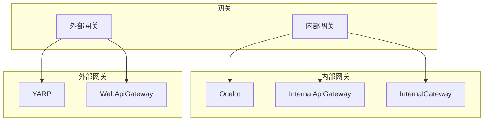
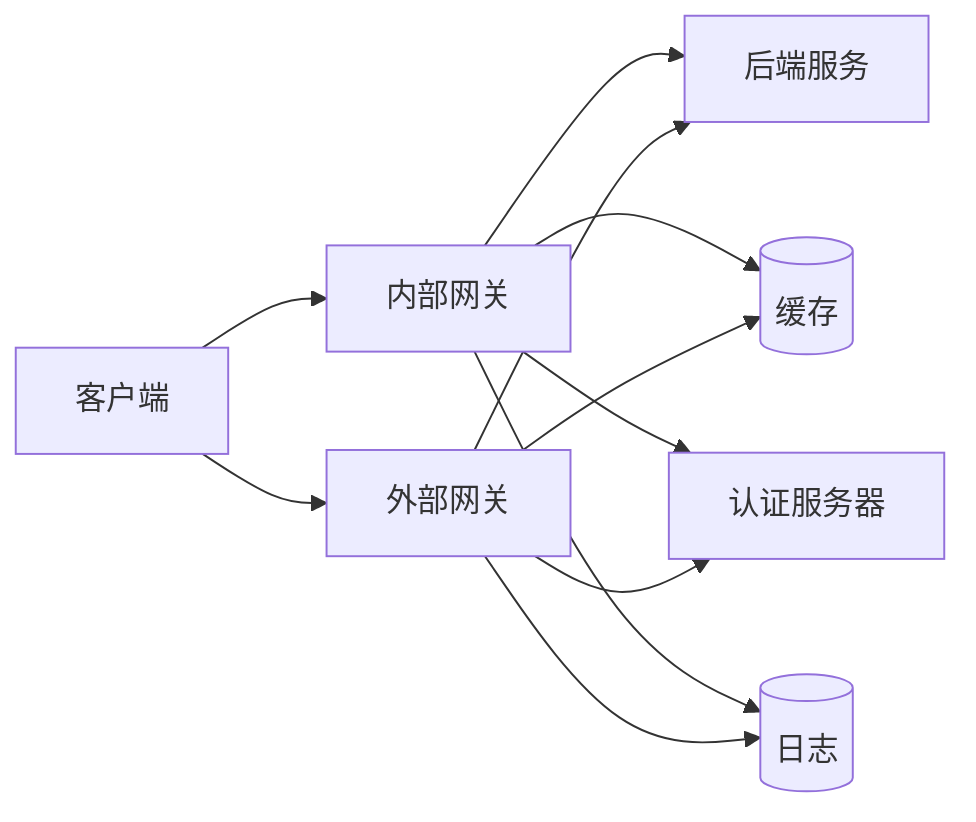
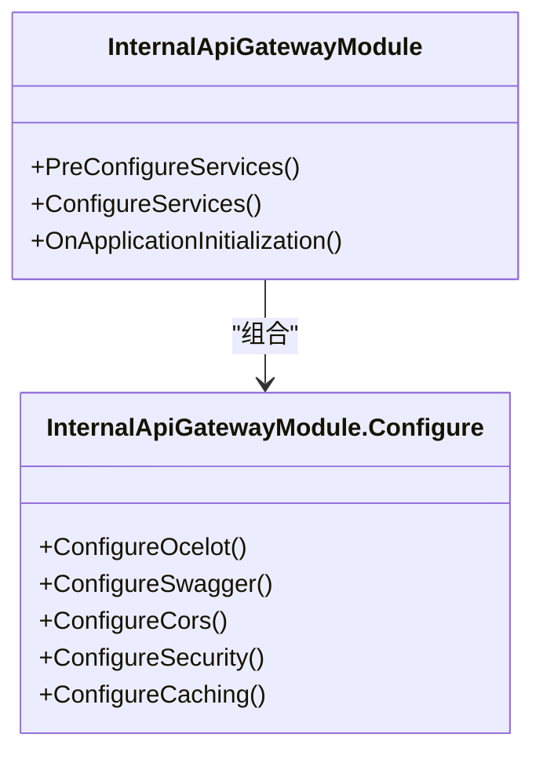
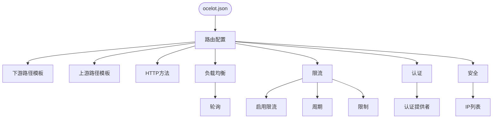
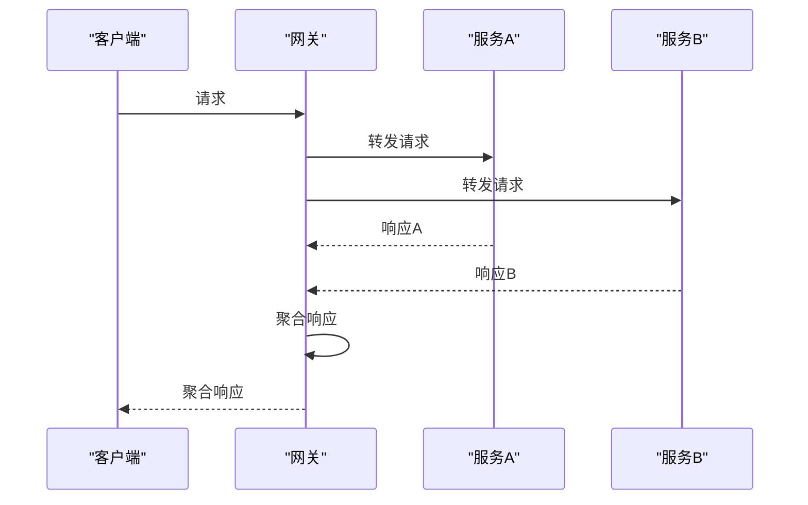
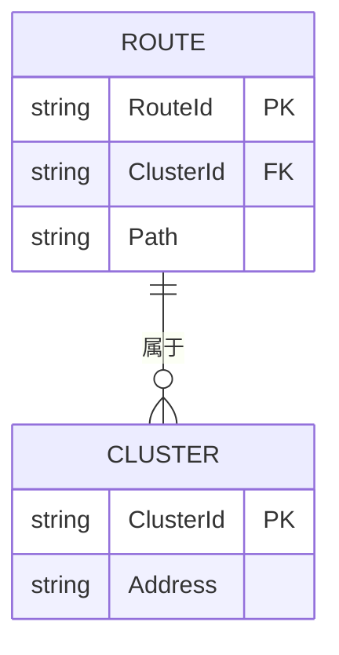
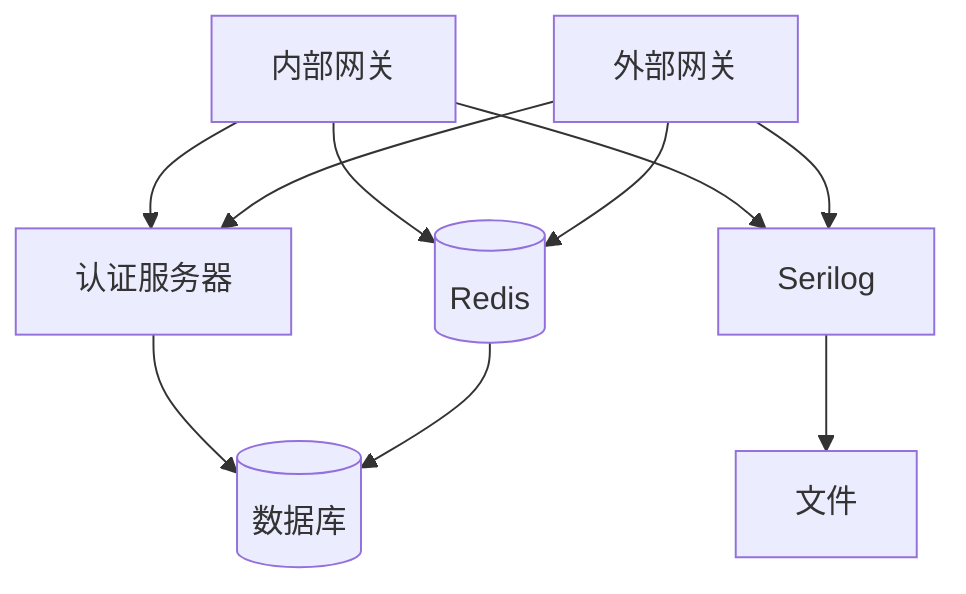

# API网关

<cite>
**本文档引用的文件**
- [ocelot.json](file://gateways/internal/LINGYUN.MicroService.Internal.ApiGateway/src/LINGYUN.MicroService.Internal.ApiGateway/ocelot.json)
- [yarp.json](file://gateways/web/LY.MicroService.ApiGateway/yarp.json)
- [InternalApiGatewayModule.cs](file://gateways/internal/LINGYUN.MicroService.Internal.ApiGateway/src/LINGYUN.MicroService.Internal.ApiGateway/InternalApiGatewayModule.cs)
- [InternalApiGatewayModule.Configure.cs](file://gateways/internal/LINGYUN.MicroService.Internal.ApiGateway/src/LINGYUN.MicroService.Internal.ApiGateway/InternalApiGatewayModule.Configure.cs)
- [InternalApiGatewayOptions.cs](file://gateways/internal/LINGYUN.MicroService.Internal.ApiGateway/src/LINGYUN.MicroService.Internal.ApiGateway/InternalApiGatewayOptions.cs)
- [Program.cs](file://gateways/internal/LINGYUN.MicroService.Internal.ApiGateway/src/LINGYUN.MicroService.Internal.ApiGateway/Program.cs)
- [ApiGatewayController.cs](file://gateways/internal/LINGYUN.MicroService.Internal.ApiGateway/src/LINGYUN.MicroService.Internal.ApiGateway/Controllers/ApiGatewayController.cs)
- [AbpResponseMergeAggregator.cs](file://gateways/internal/LINGYUN.MicroService.Internal.ApiGateway/src/LINGYUN.MicroService.Internal.ApiGateway/Ocelot/Multiplexer/AbpResponseMergeAggregator.cs)
- [InternalGatewayModule.cs](file://gateways/internal/LINGYUN.MicroService.Internal.ApiGateway/src/LINGYUN.MicroService.Internal.Gateway/InternalGatewayModule.cs)
- [appsettings.json](file://gateways/internal/LINGYUN.MicroService.Internal.ApiGateway/src/LINGYUN.MicroService.Internal.ApiGateway/appsettings.json)
- [appsettings.json](file://gateways/web/LY.MicroService.ApiGateway/appsettings.json)
</cite>

## 目录
1. [引言](#引言)
2. [项目结构](#项目结构)
3. [核心组件](#核心组件)
4. [架构概述](#架构概述)
5. [详细组件分析](#详细组件分析)
6. [依赖分析](#依赖分析)
7. [性能考虑](#性能考虑)
8. [故障排查指南](#故障排查指南)
9. [结论](#结论)

## 引言
本文档详细介绍了基于Ocelot和YARP的API网关系统，深入解释了网关在系统架构中的作用，包括请求路由、认证集成、负载均衡和安全防护。文档详细说明了内部网关和外部网关的区别和使用场景，描述了网关配置文件的结构和各项参数的含义，并为运维人员提供了网关监控和故障排查的指导。

## 项目结构
项目中的API网关分为内部网关和外部网关两种类型，分别位于不同的目录中。内部网关使用Ocelot实现，外部网关使用YARP实现。

**Diagram sources**
- [ocelot.json](file://gateways/internal/LINGYUN.MicroService.Internal.ApiGateway/src/LINGYUN.MicroService.Internal.ApiGateway/ocelot.json)
- [yarp.json](file://gateways/web/LY.MicroService.ApiGateway/yarp.json)

**Section sources**
- [ocelot.json](file://gateways/internal/LINGYUN.MicroService.Internal.ApiGateway/src/LINGYUN.MicroService.Internal.ApiGateway/ocelot.json)
- [yarp.json](file://gateways/web/LY.MicroService.ApiGateway/yarp.json)

## 核心组件
API网关的核心组件包括路由配置、认证集成、负载均衡、安全防护和聚合器。内部网关使用Ocelot作为网关框架，外部网关使用YARP作为网关框架。

**Section sources**
- [InternalApiGatewayModule.cs](file://gateways/internal/LINGYUN.MicroService.Internal.ApiGateway/src/LINGYUN.MicroService.Internal.ApiGateway/InternalApiGatewayModule.cs)
- [InternalGatewayModule.cs](file://gateways/internal/LINGYUN.MicroService.Internal.ApiGateway/src/LINGYUN.MicroService.Internal.Gateway/InternalGatewayModule.cs)

## 架构概述
API网关在系统架构中扮演着重要角色，它作为系统的入口，负责请求的路由、认证、负载均衡和安全防护。

**Diagram sources**
- [InternalApiGatewayModule.cs](file://gateways/internal/LINGYUN.MicroService.Internal.ApiGateway/src/LINGYUN.MicroService.Internal.ApiGateway/InternalApiGatewayModule.cs)
- [InternalGatewayModule.cs](file://gateways/internal/LINGYUN.MicroService.Internal.ApiGateway/src/LINGYUN.MicroService.Internal.Gateway/InternalGatewayModule.cs)

## 详细组件分析

### 内部网关分析
内部网关使用Ocelot实现，负责内部服务之间的请求路由和聚合。

#### 内部网关模块
内部网关模块配置了Ocelot、Swagger、CORS、认证和缓存等组件。

**Diagram sources**
- [InternalApiGatewayModule.cs](file://gateways/internal/LINGYUN.MicroService.Internal.ApiGateway/src/LINGYUN.MicroService.Internal.ApiGateway/InternalApiGatewayModule.cs)
- [InternalApiGatewayModule.Configure.cs](file://gateways/internal/LINGYUN.MicroService.Internal.ApiGateway/src/LINGYUN.MicroService.Internal.ApiGateway/InternalApiGatewayModule.Configure.cs)

**Section sources**
- [InternalApiGatewayModule.cs](file://gateways/internal/LINGYUN.MicroService.Internal.ApiGateway/src/LINGYUN.MicroService.Internal.ApiGateway/InternalApiGatewayModule.cs)
- [InternalApiGatewayModule.Configure.cs](file://gateways/internal/LINGYUN.MicroService.Internal.ApiGateway/src/LINGYUN.MicroService.Internal.ApiGateway/InternalApiGatewayModule.Configure.cs)

#### 内部网关配置
内部网关的配置文件ocelot.json定义了路由规则、负载均衡、限流和认证等配置。

**Diagram sources**
- [ocelot.json](file://gateways/internal/LINGYUN.MicroService.Internal.ApiGateway/src/LINGYUN.MicroService.Internal.ApiGateway/ocelot.json)

**Section sources**
- [ocelot.json](file://gateways/internal/LINGYUN.MicroService.Internal.ApiGateway/src/LINGYUN.MicroService.Internal.ApiGateway/ocelot.json)

#### 内部网关聚合器
内部网关的聚合器AbpResponseMergeAggregator负责将多个下游服务的响应聚合为一个响应。

**Diagram sources**
- [AbpResponseMergeAggregator.cs](file://gateways/internal/LINGYUN.MicroService.Internal.ApiGateway/src/LINGYUN.MicroService.Internal.ApiGateway/Ocelot/Multiplexer/AbpResponseMergeAggregator.cs)

**Section sources**
- [AbpResponseMergeAggregator.cs](file://gateways/internal/LINGYUN.MicroService.Internal.ApiGateway/src/LINGYUN.MicroService.Internal.ApiGateway/Ocelot/Multiplexer/AbpResponseMergeAggregator.cs)

### 外部网关分析
外部网关使用YARP实现，负责外部客户端与内部服务之间的请求路由。

#### 外部网关配置
外部网关的配置文件yarp.json定义了路由和集群配置。

**Diagram sources**
- [yarp.json](file://gateways/web/LY.MicroService.ApiGateway/yarp.json)

**Section sources**
- [yarp.json](file://gateways/web/LY.MicroService.ApiGateway/yarp.json)

## 依赖分析
API网关依赖于多个组件和服务，包括认证服务器、缓存服务和日志服务。

**Diagram sources**
- [appsettings.json](file://gateways/internal/LINGYUN.MicroService.Internal.ApiGateway/src/LINGYUN.MicroService.Internal.ApiGateway/appsettings.json)
- [appsettings.json](file://gateways/web/LY.MicroService.ApiGateway/appsettings.json)

**Section sources**
- [appsettings.json](file://gateways/internal/LINGYUN.MicroService.Internal.ApiGateway/src/LINGYUN.MicroService.Internal.ApiGateway/appsettings.json)
- [appsettings.json](file://gateways/web/LY.MicroService.ApiGateway/appsettings.json)

## 性能考虑
API网关的性能主要受路由配置、负载均衡和缓存策略的影响。建议使用高效的路由匹配算法，合理配置负载均衡策略，并充分利用缓存来提高性能。

## 故障排查指南
当API网关出现问题时，可以按照以下步骤进行排查：

1. 检查网关日志，查看是否有错误信息
2. 检查路由配置，确保路径和方法匹配正确
3. 检查认证配置，确保认证提供者和范围正确
4. 检查负载均衡配置，确保服务实例正常
5. 检查限流配置，确保没有达到限制

**Section sources**
- [InternalApiGatewayModule.Configure.cs](file://gateways/internal/LINGYUN.MicroService.Internal.ApiGateway/src/LINGYUN.MicroService.Internal.ApiGateway/InternalApiGatewayModule.Configure.cs)
- [InternalApiGatewayModule.cs](file://gateways/internal/LINGYUN.MicroService.Internal.ApiGateway/src/LINGYUN.MicroService.Internal.ApiGateway/InternalApiGatewayModule.cs)

## 结论
API网关是微服务架构中的重要组件，它提供了统一的入口，简化了客户端与后端服务的交互。通过合理配置路由、认证、负载均衡和安全策略，可以构建一个高效、安全的API网关系统。