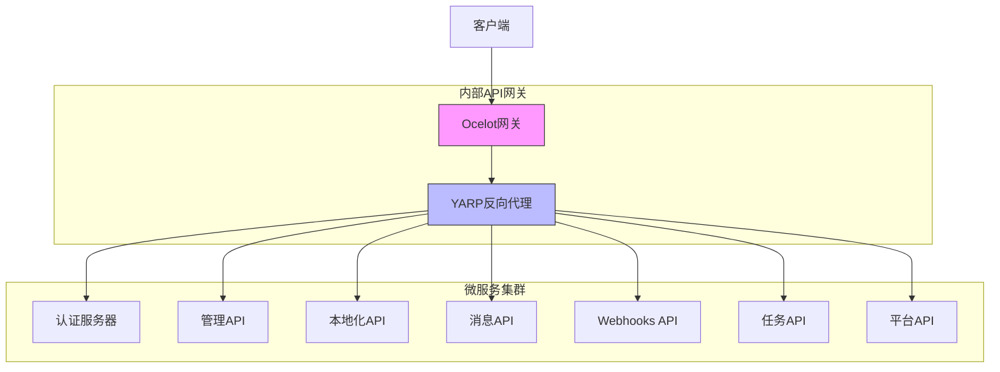
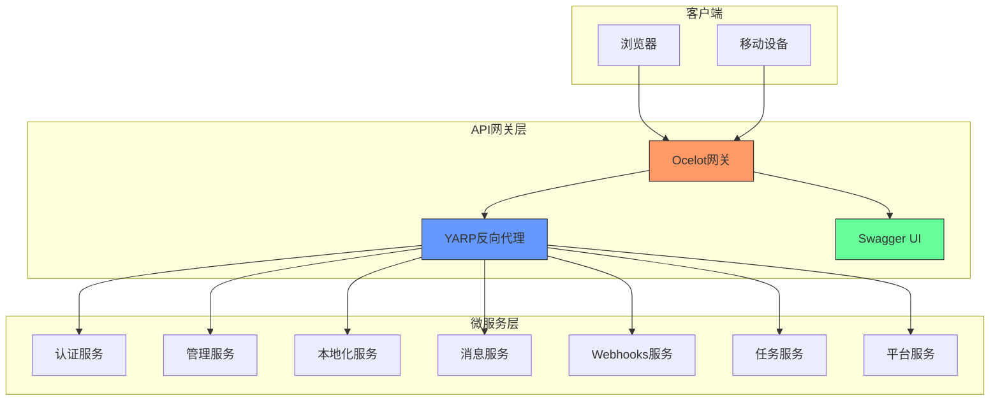
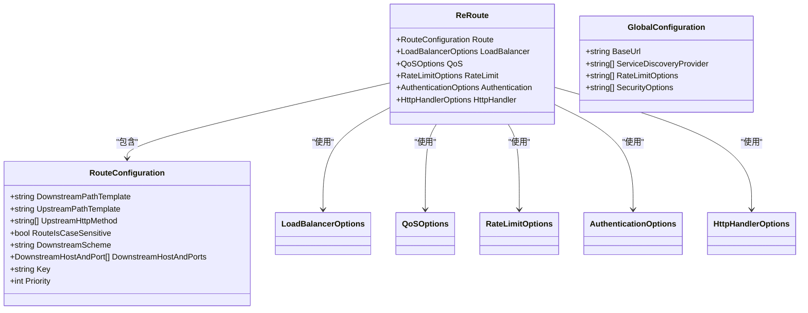
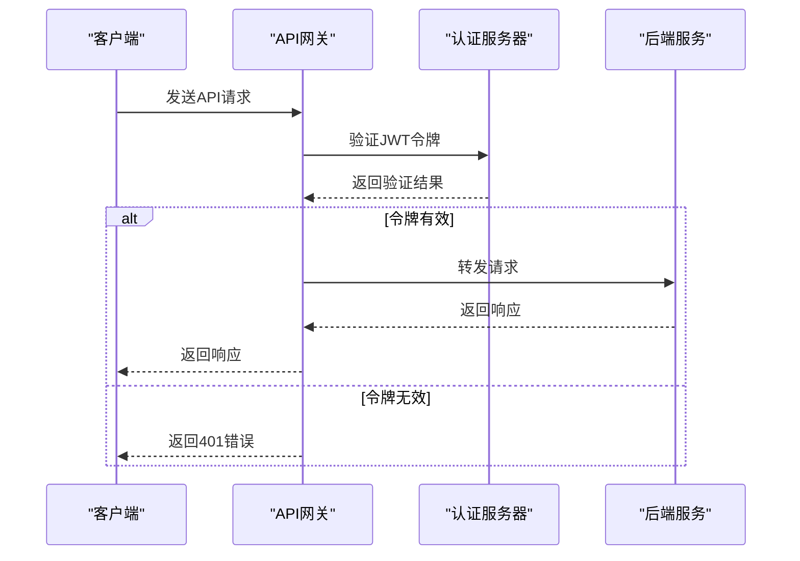
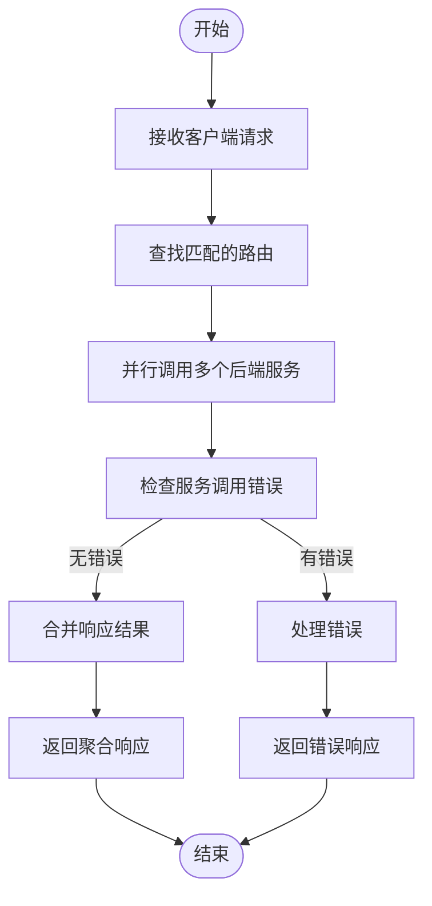
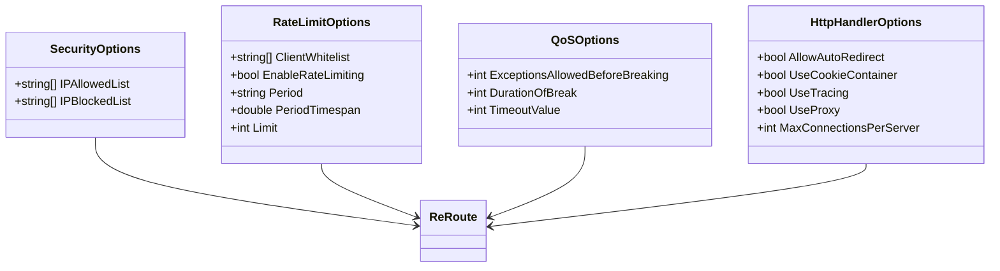
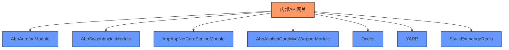
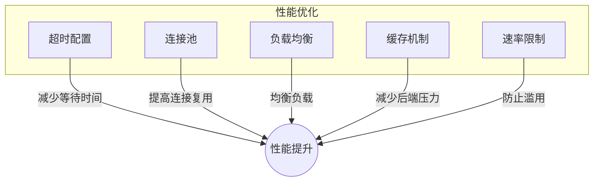
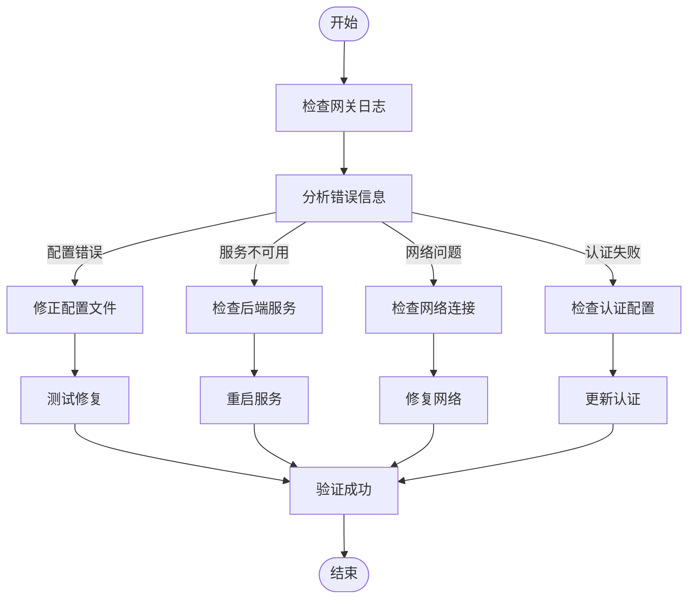

# 内部API网关

<cite>
**本文档中引用的文件**  
- [InternalApiGatewayModule.cs](file://gateways/web/LY.MicroService.ApiGateway/InternalApiGatewayModule.cs)
- [InternalApiGatewayOptions.cs](file://gateways/web/LY.MicroService.ApiGateway/InternalApiGatewayOptions.cs)
- [ocelot.json](file://gateways/internal/LINGYUN.MicroService.Internal.ApiGateway/src/LINGYUN.MicroService.Internal.ApiGateway/ocelot.json)
- [yarp.json](file://gateways/internal/LINGYUN.MicroService.Internal.ApiGateway/src/LINGYUN.MicroService.Internal.Gateway/yarp.json)
- [AbpResponseMergeAggregator.cs](file://gateways/internal/LINGYUN.MicroService.Internal.ApiGateway/src/LINGYUN.MicroService.Internal.ApiGateway/Ocelot/Multiplexer/AbpResponseMergeAggregator.cs)
- [ApiGatewayController.cs](file://gateways/internal/LINGYUN.MicroService.Internal.ApiGateway/src/LINGYUN.MicroService.Internal.ApiGateway/Controllers/ApiGatewayController.cs)
- [LoadBalancerFinder.cs](file://gateways/internal/LINGYUN.MicroService.Internal.ApiGateway/src/LINGYUN.MicroService.Internal.ApiGateway/Utils/LoadBalancerFinder.cs)
- [appsettings.json](file://gateways/web/LY.MicroService.ApiGateway/appsettings.json)
</cite>

## 目录
1. [简介](#简介)
2. [项目结构](#项目结构)
3. [核心组件](#核心组件)
4. [架构概述](#架构概述)
5. [详细组件分析](#详细组件分析)
6. [依赖分析](#依赖分析)
7. [性能考虑](#性能考虑)
8. [故障排查指南](#故障排查指南)
9. [结论](#结论)

## 简介
内部API网关是微服务架构中的核心组件，负责服务间通信的路由配置、认证集成、请求聚合和安全防护。本文档详细解释了内部网关在微服务架构中的核心作用，包括路由配置、认证机制、请求聚合模式和安全策略。文档还详细说明了ocelot.json配置文件的结构，包括ReRoutes、GlobalConfiguration、AuthenticationOptions等关键配置项的含义和使用方法。同时描述了InternalApiGatewayModule的初始化流程和依赖注入配置，并为开发人员提供了监控指标、日志记录和故障排查指南。

## 项目结构
内部API网关位于`gateways/internal`目录下，主要由两个核心项目组成：`LINGYUN.MicroService.Internal.ApiGateway`和`LINGYUN.MicroService.Internal.Gateway`。前者基于Ocelot实现API网关功能，后者基于YARP实现反向代理功能。网关通过ocelot.json和yarp.json配置文件定义路由规则和集群配置，将外部请求转发到相应的微服务。

**图源**  
- [ocelot.json](file://gateways/internal/LINGYUN.MicroService.Internal.ApiGateway/src/LINGYUN.MicroService.Internal.ApiGateway/ocelot.json)
- [yarp.json](file://gateways/internal/LINGYUN.MicroService.Internal.ApiGateway/src/LINGYUN.MicroService.Internal.Gateway/yarp.json)

**节源**  
- [ocelot.json](file://gateways/internal/LINGYUN.MicroService.Internal.ApiGateway/src/LINGYUN.MicroService.Internal.ApiGateway/ocelot.json)
- [yarp.json](file://gateways/internal/LINGYUN.MicroService.Internal.ApiGateway/src/LINGYUN.MicroService.Internal.Gateway/yarp.json)

## 核心组件
内部API网关的核心组件包括路由配置、聚合器、负载均衡器和安全防护机制。网关使用Ocelot作为主要的API网关框架，通过ocelot.json文件配置路由规则，将请求转发到后端微服务。同时，网关集成了YARP反向代理，通过yarp.json文件配置更复杂的路由和集群管理。`InternalApiGatewayModule`负责网关的初始化和依赖注入配置，`AbpResponseMergeAggregator`实现了响应聚合功能，`LoadBalancerFinder`提供了负载均衡器发现机制。

**节源**  
- [InternalApiGatewayModule.cs](file://gateways/web/LY.MicroService.ApiGateway/InternalApiGatewayModule.cs)
- [AbpResponseMergeAggregator.cs](file://gateways/internal/LINGYUN.MicroService.Internal.ApiGateway/src/LINGYUN.MicroService.Internal.ApiGateway/Ocelot/Multiplexer/AbpResponseMergeAggregator.cs)
- [LoadBalancerFinder.cs](file://gateways/internal/LINGYUN.MicroService.Internal.ApiGateway/src/LINGYUN.MicroService.Internal.ApiGateway/Utils/LoadBalancerFinder.cs)

## 架构概述
内部API网关采用分层架构设计，前端使用Ocelot处理API路由和聚合，后端使用YARP进行反向代理和负载均衡。网关通过ocelot.json配置文件定义路由规则，包括路径匹配、HTTP方法限制、请求头转换等。YARP通过yarp.json文件配置集群和路由，实现更灵活的流量管理。网关还集成了Swagger UI，提供统一的API文档访问入口。

**图源**  
- [InternalApiGatewayModule.cs](file://gateways/web/LY.MicroService.ApiGateway/InternalApiGatewayModule.cs)
- [ocelot.json](file://gateways/internal/LINGYUN.MicroService.Internal.ApiGateway/src/LINGYUN.MicroService.Internal.ApiGateway/ocelot.json)
- [yarp.json](file://gateways/internal/LINGYUN.MicroService.Internal.ApiGateway/src/LINGYUN.MicroService.Internal.Gateway/yarp.json)

## 详细组件分析

### 路由配置分析
内部API网关使用ocelot.json文件配置路由规则，每个路由定义了上游路径模板、下游路径模板、HTTP方法等属性。路由配置支持路径参数、请求头转换、查询参数添加等功能。网关还支持基于服务名的路由发现，可以动态获取服务实例。

**图源**  
- [ocelot.json](file://gateways/internal/LINGYUN.MicroService.Internal.ApiGateway/src/LINGYUN.MicroService.Internal.ApiGateway/ocelot.json)

**节源**  
- [ocelot.json](file://gateways/internal/LINGYUN.MicroService.Internal.ApiGateway/src/LINGYUN.MicroService.Internal.ApiGateway/ocelot.json)

### 认证集成机制
内部API网关通过AuthenticationOptions配置项集成认证机制，支持OAuth2、JWT等认证方式。网关在转发请求前验证用户身份，确保只有经过认证的请求才能访问后端服务。认证配置包括认证提供者键、允许的作用域等属性。

**图源**  
- [InternalApiGatewayModule.cs](file://gateways/web/LY.MicroService.ApiGateway/InternalApiGatewayModule.cs)

**节源**  
- [InternalApiGatewayModule.cs](file://gateways/web/LY.MicroService.ApiGateway/InternalApiGatewayModule.cs)

### 请求聚合模式
内部API网关通过自定义聚合器`AbpResponseMergeAggregator`实现请求聚合功能。当多个微服务需要同时响应时，网关将各个服务的响应结果合并为一个统一的响应。聚合器支持JSON对象合并，可以处理数组的并集操作。

**图源**  
- [AbpResponseMergeAggregator.cs](file://gateways/internal/LINGYUN.MicroService.Internal.ApiGateway/src/LINGYUN.MicroService.Internal.ApiGateway/Ocelot/Multiplexer/AbpResponseMergeAggregator.cs)

**节源**  
- [AbpResponseMergeAggregator.cs](file://gateways/internal/LINGYUN.MicroService.Internal.ApiGateway/src/LINGYUN.MicroService.Internal.ApiGateway/Ocelot/Multiplexer/AbpResponseMergeAggregator.cs)

### 安全防护策略
内部API网关实现了多层次的安全防护策略，包括IP白名单/黑名单、速率限制、QoS熔断等。通过SecurityOptions配置IP访问控制，RateLimitOptions配置请求频率限制，QoSOptions配置服务质量保障。

**图源**  
- [ocelot.json](file://gateways/internal/LINGYUN.MicroService.Internal.ApiGateway/src/LINGYUN.MicroService.Internal.ApiGateway/ocelot.json)

**节源**  
- [ocelot.json](file://gateways/internal/LINGYUN.MicroService.Internal.ApiGateway/src/LINGYUN.MicroService.Internal.ApiGateway/ocelot.json)

## 依赖分析
内部API网关依赖于多个ABP框架模块和第三方库。核心依赖包括AbpAutofacModule（依赖注入）、AbpSwashbuckleModule（Swagger集成）、AbpAspNetCoreSerilogModule（日志记录）等。网关还依赖Ocelot框架进行API路由和YARP进行反向代理。

**图源**  
- [InternalApiGatewayModule.cs](file://gateways/web/LY.MicroService.ApiGateway/InternalApiGatewayModule.cs)

**节源**  
- [InternalApiGatewayModule.cs](file://gateways/web/LY.MicroService.ApiGateway/InternalApiGatewayModule.cs)

## 性能考虑
内部API网关在性能方面进行了多项优化。通过配置合理的超时值、连接池大小和负载均衡策略，确保网关在高并发场景下的稳定性。网关还支持缓存机制，可以缓存频繁访问的API响应，减少后端服务的压力。

**图源**  
- [ocelot.json](file://gateways/internal/LINGYUN.MicroService.Internal.ApiGateway/src/LINGYUN.MicroService.Internal.ApiGateway/ocelot.json)
- [yarp.json](file://gateways/internal/LINGYUN.MicroService.Internal.ApiGateway/src/LINGYUN.MicroService.Internal.Gateway/yarp.json)

## 故障排查指南
当遇到内部API网关问题时，可以按照以下步骤进行排查：

1. **检查日志**：查看网关的日志文件，定位错误信息
2. **验证路由配置**：确认ocelot.json中的路由配置是否正确
3. **测试后端服务**：直接访问后端服务，确认服务是否正常运行
4. **检查网络连接**：确保网关与后端服务之间的网络连接正常
5. **验证认证配置**：确认认证提供者和作用域配置是否正确

**图源**  
- [appsettings.json](file://gateways/web/LY.MicroService.ApiGateway/appsettings.json)

**节源**  
- [appsettings.json](file://gateways/web/LY.MicroService.ApiGateway/appsettings.json)

## 结论
内部API网关作为微服务架构的核心组件，提供了路由、认证、聚合和安全等关键功能。通过ocelot.json和yarp.json配置文件，可以灵活地定义路由规则和集群配置。`InternalApiGatewayModule`负责网关的初始化和依赖注入，确保各个组件正确加载。网关还提供了丰富的监控和日志功能，便于开发人员进行故障排查和性能优化。建议在生产环境中启用速率限制和QoS熔断机制，确保系统的稳定性和可靠性。