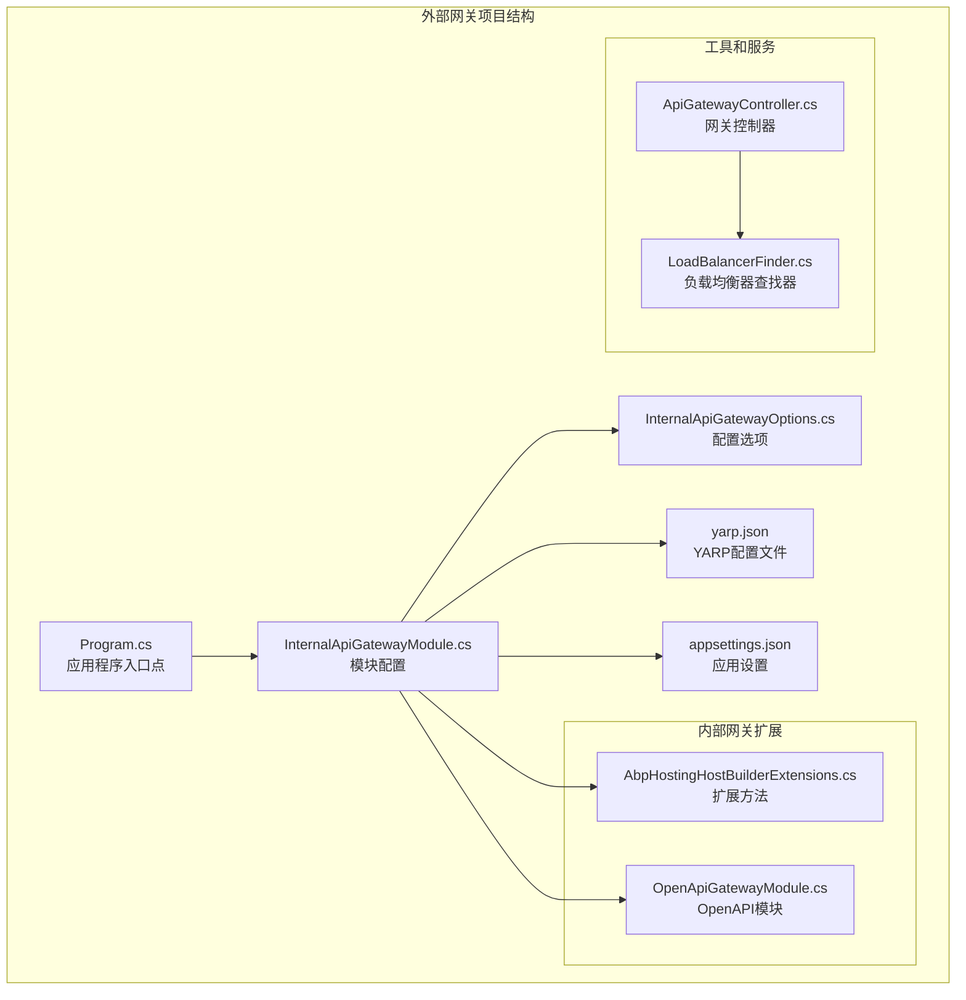
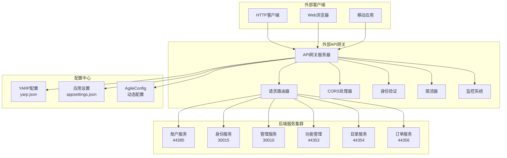
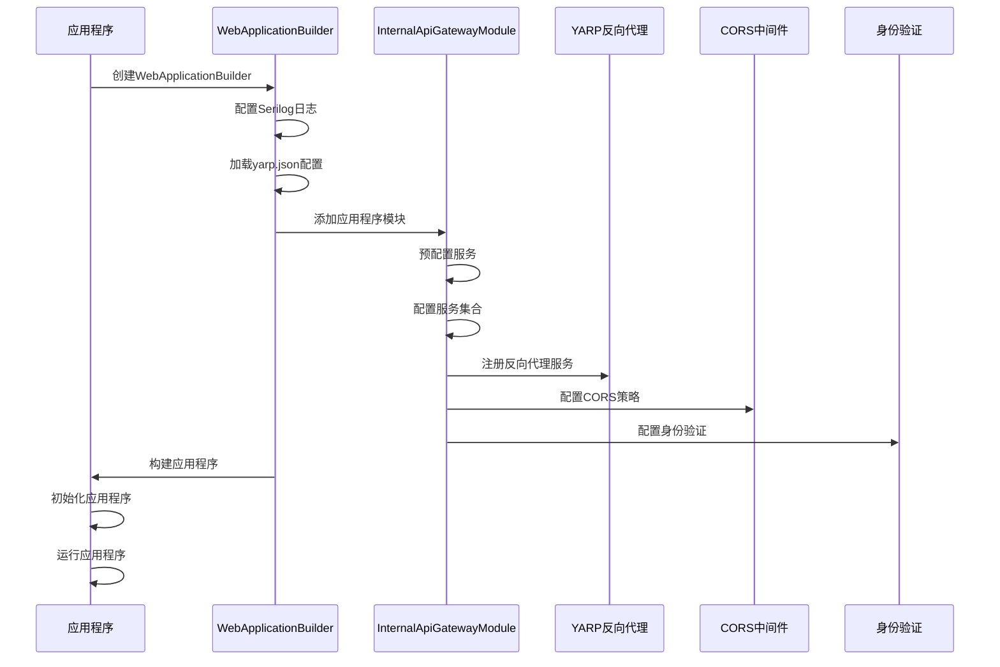
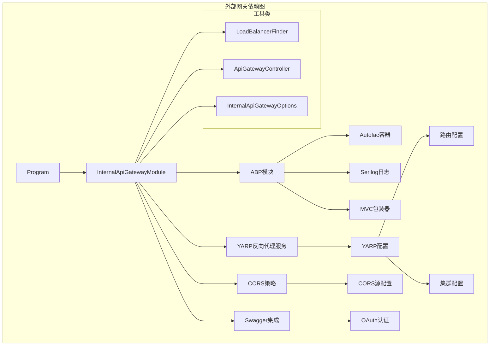

# 外部API网关

<cite>
**本文档中引用的文件**
- [Program.cs](file://gateways/web/LY.MicroService.ApiGateway/Program.cs)
- [InternalApiGatewayModule.cs](file://gateways/web/LY.MicroService.ApiGateway/InternalApiGatewayModule.cs)
- [InternalApiGatewayOptions.cs](file://gateways/web/LY.MicroService.ApiGateway/InternalApiGatewayOptions.cs)
- [yarp.json](file://gateways/web/LY.MicroService.ApiGateway/yarp.json)
- [appsettings.json](file://gateways/web/LY.MicroService.ApiGateway/appsettings.json)
- [AbpHostingHostBuilderExtensions.cs](file://gateways/internal/LINGYUN.MicroService.Internal.ApiGateway/src/LINGYUN.MicroService.Internal.Gateway/AbpHostingHostBuilderExtensions.cs)
- [OpenApiGatewayModule.cs](file://gateways/internal/LINGYUN.MicroService.Internal.ApiGateway/src/LINGYUN.MicroService.OpenApi.Gateway/OpenApiGatewayModule.cs)
- [ApiGatewayController.cs](file://gateways/internal/LINGYUN.MicroService.Internal.ApiGateway/src/LINGYUN.MicroService.Internal.ApiGateway/Controllers/ApiGatewayController.cs)
- [LoadBalancerFinder.cs](file://gateways/internal/LINGYUN.MicroService.Internal.ApiGateway/src/LINGYUN.MicroService.Internal.ApiGateway/Utils/LoadBalancerFinder.cs)
</cite>

## 目录
1. [简介](#简介)
2. [项目结构](#项目结构)
3. [核心组件](#核心组件)
4. [架构概览](#架构概览)
5. [详细组件分析](#详细组件分析)
6. [依赖关系分析](#依赖关系分析)
7. [性能考虑](#性能考虑)
8. [故障排除指南](#故障排除指南)
9. [结论](#结论)

## 简介

外部API网关是ABP Next Admin微服务架构中的关键组件，作为系统边界负责对外部客户端的请求路由、跨域配置、限流策略和安全防护。该网关基于YARP（Yet Another Reverse Proxy）技术构建，提供了强大的反向代理功能，支持动态配置、负载均衡和多种安全机制。

外部网关的主要职责包括：
- **请求路由**：根据URL路径将外部请求转发到相应的后端服务
- **跨域处理**：配置CORS策略，允许或限制跨域请求
- **安全防护**：实现身份验证、授权和API密钥管理
- **性能优化**：提供负载均衡、缓存和限流功能
- **监控审计**：记录访问日志和安全事件

## 项目结构

外部API网关项目采用清晰的分层架构，主要包含以下核心文件：



**图表来源**
- [Program.cs](file://gateways/web/LY.MicroService.ApiGateway/Program.cs#L1-L55)
- [InternalApiGatewayModule.cs](file://gateways/web/LY.MicroService.ApiGateway/InternalApiGatewayModule.cs#L1-L171)

**章节来源**
- [Program.cs](file://gateways/web/LY.MicroService.ApiGateway/Program.cs#L1-L55)
- [InternalApiGatewayModule.cs](file://gateways/web/LY.MicroService.ApiGateway/InternalApiGatewayModule.cs#L1-L171)

## 核心组件

### 应用程序入口点

外部网关的启动过程通过Program.cs类实现，该类负责初始化应用程序并加载必要的配置：

```csharp
public static async Task<int> Main(string[] args)
{
    try
    {
        Log.Information("Starting Internal ApiGateway.");
        var builder = WebApplication.CreateBuilder(args);
        builder.Host.AddAppSettingsSecretsJson()
            .UseAutofac()
            .ConfigureAppConfiguration((context, config) =>
            {
                var configuration = config.Build();
                if (configuration.GetSection("AgileConfig").Exists())
                {
                    config.AddAgileConfig(new AgileConfig.Client.ConfigClient(configuration));
                }
                config.AddJsonFile("yarp.json", true, true).AddEnvironmentVariables();
            })
            .UseSerilog((context, provider, config) =>
            {
                config.ReadFrom.Configuration(context.Configuration);
            });

        await builder.AddApplicationAsync<InternalApiGatewayModule>();
        var app = builder.Build();
        await app.InitializeApplicationAsync();
        await app.RunAsync();

        return 0;
    }
    catch (Exception ex)
    {
        Log.Fatal(ex, "Starting Internal ApiGateway terminated unexpectedly!");
        return 1;
    }
    finally
    {
        Log.CloseAndFlush();
    }
}
```

### 模块配置系统

InternalApiGatewayModule类是整个网关的核心配置模块，它继承自AbpModule并集成了多个关键功能：

```csharp
[DependsOn(
    typeof(AbpAutofacModule),
    typeof(AbpDataModule),
    typeof(AbpSwashbuckleModule),
    typeof(AbpAspNetCoreSerilogModule),
    typeof(AbpAspNetCoreMvcWrapperModule)
)]
public class InternalApiGatewayModule : AbpModule
{
    protected const string ApplicationName = "Services.ApiGateWay";
    
    public override void ConfigureServices(ServiceConfigurationContext context)
    {
        var configuration = context.Services.GetConfiguration();
        var hostingEnvironment = context.Services.GetHostingEnvironment();

        // 配置反向代理
        context.Services
            .AddReverseProxy()
            .LoadFromConfig(configuration.GetSection("ReverseProxy"));
            
        // 配置CORS策略
        context.Services.AddCors(options =>
        {
            options.AddDefaultPolicy(builder =>
            {
                builder
                    .WithOrigins(
                        configuration["App:CorsOrigins"]
                            .Split(",", StringSplitOptions.RemoveEmptyEntries)
                            .Select(o => o.Trim().RemovePostFix("/"))
                            .ToArray()
                    )
                    .WithAbpExposedHeaders()
                    .WithAbpWrapExposedHeaders()
                    .SetIsOriginAllowedToAllowWildcardSubdomains()
                    .AllowAnyHeader()
                    .AllowAnyMethod()
                    .AllowCredentials();
            });
        });
    }
}
```

**章节来源**
- [Program.cs](file://gateways/web/LY.MicroService.ApiGateway/Program.cs#L13-L55)
- [InternalApiGatewayModule.cs](file://gateways/web/LY.MicroService.ApiGateway/InternalApiGatewayModule.cs#L25-L171)

## 架构概览

外部API网关采用基于YARP的反向代理架构，通过动态配置实现灵活的服务路由：



**图表来源**
- [yarp.json](file://gateways/web/LY.MicroService.ApiGateway/yarp.json#L1-L124)
- [InternalApiGatewayModule.cs](file://gateways/web/LY.MicroService.ApiGateway/InternalApiGatewayModule.cs#L80-L120)

## 详细组件分析

### YARP配置文件分析

yarp.json是外部网关的核心配置文件，定义了路由规则和集群配置：

```json
{
  "ReverseProxy": {
    "Routes": {
      "Account": {
        "ClusterId": "accountCluster",
        "Match": {
          "Path": "/api/account/{**everything}"
        }
      },
      "Identity": {
        "ClusterId": "identityCluster",
        "Match": {
          "Path": "/api/identity/{**everything}"
        }
      },
      "Catalog Service": {
        "ClusterId": "catalogCluster",
        "Match": {
          "Path": "/api/catalog/{**everything}"
        }
      }
    },
    "Clusters": {
      "accountCluster": {
        "Destinations": {
          "destination1": {
            "Address": "http://10.21.15.28:44385"
          }
        }
      },
      "identityCluster": {
        "Destinations": {
          "destination1": {
            "Address": "http://10.21.15.28:30015"
          }
        }
      },
      "catalogCluster": {
        "Destinations": {
          "destination1": {
            "Address": "https://localhost:44354"
          }
        }
      }
    }
  }
}
```

#### 关键配置项说明

1. **Routes（路由配置）**
   - 每个路由定义了匹配规则和目标集群
   - Path参数使用ASP.NET Core的路由模板语法
   - 支持通配符匹配（{**everything}）

2. **Clusters（集群配置）**
   - 定义了后端服务的地址和负载均衡策略
   - 支持多目标地址配置
   - 可配置健康检查和故障转移

3. **Transforms（转换配置）**
   - 用于修改请求和响应头
   - 支持添加、删除和修改HTTP头
   - 实现了X-Forwarded-*头的自动添加

### 内部网关模块初始化流程



**图表来源**
- [Program.cs](file://gateways/web/LY.MicroService.ApiGateway/Program.cs#L13-L55)
- [InternalApiGatewayModule.cs](file://gateways/web/LY.MicroService.ApiGateway/InternalApiGatewayModule.cs#L25-L171)

### 负载均衡器发现机制

外部网关实现了动态负载均衡器发现功能，通过LoadBalancerFinder类获取可用的负载均衡算法：

```csharp
public class LoadBalancerFinder : ILoadBalancerFinder, ISingletonDependency
{
    private Lazy<List<LoadBalancerDescriptor>> lazyLoadBalancers;
    protected List<LoadBalancerDescriptor> LoadBalancers => lazyLoadBalancers.Value;
    protected IServiceProvider ServiceProvider { get; }
    protected IStringLocalizer Localizer { get; }
    
    public LoadBalancerFinder(
        IServiceProvider serviceProvider,
        IStringLocalizer<ApiGatewayResource> localizer)
    {
        Localizer = localizer;
        ServiceProvider = serviceProvider;
        lazyLoadBalancers = new Lazy<List<LoadBalancerDescriptor>>(() => FindLocalLoadBalancers());
    }
    
    public Task<List<LoadBalancerDescriptor>> GetLoadBalancersAsync()
    {
        return Task.FromResult(LoadBalancers);
    }
}
```

**章节来源**
- [yarp.json](file://gateways/web/LY.MicroService.ApiGateway/yarp.json#L1-L124)
- [LoadBalancerFinder.cs](file://gateways/internal/LINGYUN.MicroService.Internal.ApiGateway/src/LINGYUN.MicroService.Internal.ApiGateway/Utils/LoadBalancerFinder.cs#L1-L31)

## 依赖关系分析

外部API网关的依赖关系体现了清晰的分层架构设计：



**图表来源**
- [InternalApiGatewayModule.cs](file://gateways/web/LY.MicroService.ApiGateway/InternalApiGatewayModule.cs#L25-L35)
- [LoadBalancerFinder.cs](file://gateways/internal/LINGYUN.MicroService.Internal.ApiGateway/src/LINGYUN.MicroService.Internal.ApiGateway/Utils/LoadBalancerFinder.cs#L1-L31)

**章节来源**
- [InternalApiGatewayModule.cs](file://gateways/web/LY.MicroService.ApiGateway/InternalApiGatewayModule.cs#L25-L35)

## 性能考虑

### 负载均衡策略

外部网关支持多种负载均衡算法，包括轮询、最少连接数和哈希一致性等。通过LoadBalancerFinder类可以动态获取可用的负载均衡器：

```csharp
// 支持的负载均衡算法类型
public enum LoadBalancerType
{
    LeastConnection,    // 最少连接数
    PowerOfTwoChoices,  // 二选一算法
    Random,             // 随机选择
    RoundRobin,         // 轮询算法
    ConsistentHashing   // 一致性哈希
}
```

### 缓存和性能优化

1. **请求缓存**：支持对静态资源和API响应进行缓存
2. **连接池优化**：配置合理的连接池大小和超时时间
3. **压缩传输**：启用GZIP压缩减少网络传输量
4. **并发控制**：限制同时处理的请求数量

### 监控指标

外部网关集成了全面的监控体系：

```json
{
  "Serilog": {
    "MinimumLevel": {
      "Default": "Information",
      "Override": {
        "System": "Warning",
        "Microsoft": "Warning",
        "DotNetCore": "Information"
      }
    },
    "WriteTo": [
      {
        "Name": "Console",
        "Args": {
          "restrictedToMinimumLevel": "Debug",
          "outputTemplate": "{Timestamp:yyyy-MM-dd HH:mm:ss} [{Level:u3}] [{SourceContext}] [{ProcessId}] [{ThreadId}] - {Message:lj}{NewLine}{Exception}"
        }
      },
      {
        "Name": "File",
        "Args": {
          "path": "Logs/Debug-.log",
          "restrictedToMinimumLevel": "Debug",
          "rollingInterval": "Day"
        }
      }
    ]
  }
}
```

## 故障排除指南

### 常见问题诊断

1. **路由不匹配**
   - 检查yarp.json中的Path模式是否正确
   - 验证URL路径格式和大小写敏感性
   - 确认ClusterId是否指向正确的后端服务

2. **CORS错误**
   - 检查App:CorsOrigins配置
   - 验证预检请求的OPTIONS方法处理
   - 确认Access-Control-Allow-Origin头设置

3. **身份验证失败**
   - 验证JWT令牌的有效性和过期时间
   - 检查OAuth客户端配置
   - 确认作用域权限设置

4. **性能问题**
   - 监控连接池使用情况
   - 分析请求延迟分布
   - 检查内存和CPU使用率

### 日志分析

外部网关提供了详细的日志记录功能，支持按级别分类的日志输出：

```csharp
// 日志级别配置
Log.Information("Starting Internal ApiGateway.");
Log.Warning("Couldn't find route configuration for {clusterId}...");
Log.Error(ex, "Unexpected error occurred");
```

### 监控仪表板

通过ApiGatewayController可以获取网关状态信息：

```csharp
[HttpGet]
[Route("LoadBalancers")]
public async Task<JsonResult> GetLoadBalancersAsync()
{
    var loadBalancers = await LoadBalancerFinder.GetLoadBalancersAsync();
    var loadBalancerDtos = new ListResultDto<LoadBalancerDescriptor>(loadBalancers);
    return Json(loadBalancerDtos);
}
```

**章节来源**
- [appsettings.json](file://gateways/web/LY.MicroService.ApiGateway/appsettings.json#L1-L73)
- [ApiGatewayController.cs](file://gateways/internal/LINGYUN.MicroService.Internal.ApiGateway/src/LINGYUN.MicroService.Internal.ApiGateway/Controllers/ApiGatewayController.cs#L30-L47)

## 结论

外部API网关作为ABP Next Admin微服务架构的重要组成部分，提供了完整的请求路由、安全防护和性能优化功能。通过YARP技术栈的深度集成，实现了灵活可配置的反向代理服务。

### 主要优势

1. **灵活性**：基于JSON配置的动态路由规则
2. **安全性**：完善的CORS、身份验证和授权机制
3. **高性能**：支持多种负载均衡算法和缓存策略
4. **可观测性**：全面的日志记录和监控指标
5. **易维护**：模块化的架构设计和清晰的依赖关系

### 最佳实践建议

1. **配置管理**：使用AgileConfig实现配置的动态更新
2. **安全加固**：定期审查CORS策略和身份验证配置
3. **性能调优**：根据实际负载调整连接池和超时设置
4. **监控告警**：建立完善的监控和告警机制
5. **备份恢复**：定期备份配置文件和日志数据

外部API网关为微服务架构提供了可靠的基础设施支撑，确保了系统的高可用性和安全性。通过持续的优化和改进，能够满足不断增长的业务需求和技术挑战。