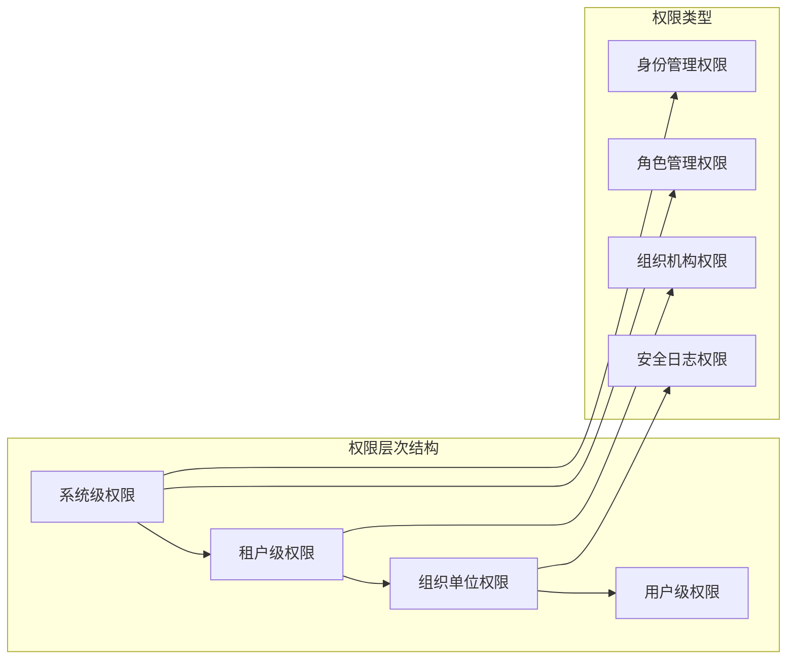

# 安全考虑

<cite>
**本文档中引用的文件**
- [AbpSecurityModule.cs](file://aspnet-core/framework/security/LINGYUN.Abp.Security/README.md)
- [JwtClaimTypesMapping.cs](file://aspnet-core/framework/security/LINGYUN.Abp.Claims.Mapping/JwtClaimTypesMapping.cs)
- [AbpEncryptionSM4Module.cs](file://aspnet-core/framework/security/LINGYUN.Abp.Encryption.SM4/AbpEncryptionSM4Module.cs)
- [SM4StringEncryptionService.cs](file://aspnet-core/framework/security/LINGYUN.Abp.Encryption.SM4/SM4StringEncryptionService.cs)
- [DefaultSecurityLogManager.cs](file://aspnet-core/framework/auditing/LINGYUN.Abp.AuditLogging/DefaultSecurityLogManager.cs)
- [ISecurityLogManager.cs](file://aspnet-core/framework/auditing/LINGYUN.Abp.AuditLogging/ISecurityLogManager.cs)
- [SecurityLogAppService.cs](file://aspnet-core/modules/auditing/LINGYUN.Abp.Auditing.Application/SecurityLogs/SecurityLogAppService.cs)
- [AbpDataProtectionModule.cs](file://aspnet-core/framework/data-protection/LINGYUN.Abp.DataProtection/README.md)
- [DataAccessStrategy.cs](file://aspnet-core/framework/data-protection/LINGYUN.Abp.DataProtection.Abstractions/DataAccessStrategy.cs)
- [IdentityPermissionDefinitionProvider.cs](file://aspnet-core/modules/identity/LINGYUN.Abp.Identity.Application.Contracts/IdentityPermissionDefinitionProvider.cs)
- [AbpClaimsMappingModule.cs](file://aspnet-core/framework/security/LINGYUN.Abp.Claims.Mapping/AbpClaimsMappingModule.cs)
</cite>

## 目录
1. [简介](#简介)
2. [项目安全架构概述](#项目安全架构概述)
3. [身份验证与授权机制](#身份验证与授权机制)
4. [数据保护策略](#数据保护策略)
5. [安全审计系统](#安全审计系统)
6. [加密与敏感数据保护](#加密与敏感数据保护)
7. [权限控制模型](#权限控制模型)
8. [安全配置指南](#安全配置指南)
9. [合规性检查指导](#合规性检查指导)
10. [故障排除指南](#故障排除指南)
11. [总结](#总结)

## 简介

ABP Next Admin是一个基于ABP框架构建的企业级管理系统，采用了多层次的安全架构设计。该项目不仅提供了完善的身份验证和授权机制，还实现了全面的数据保护策略、安全审计系统以及加密解决方案。本文档将详细介绍项目的安全架构，包括认证授权机制、数据保护策略和安全配置，为安全审计人员提供详细的合规性检查指导。

## 项目安全架构概述

ABP Next Admin的安全架构基于ABP框架的安全模块，结合了多个专门的安全组件，形成了一个完整的企业级安全解决方案。


**图表来源**
- [AbpSecurityModule.cs](file://aspnet-core/framework/security/LINGYUN.Abp.Security/README.md#L1-L39)
- [AbpClaimsMappingModule.cs](file://aspnet-core/framework/security/LINGYUN.Abp.Claims.Mapping/AbpClaimsMappingModule.cs)

**章节来源**
- [AbpSecurityModule.cs](file://aspnet-core/framework/security/LINGYUN.Abp.Security/README.md#L1-L39)
- [AbpClaimsMappingModule.cs](file://aspnet-core/framework/security/LINGYUN.Abp.Claims.Mapping/AbpClaimsMappingModule.cs)

## 身份验证与授权机制

### JWT Claims类型映射

项目实现了完善的JWT Claims类型映射功能，确保ABP框架的标准Claims类型与标准JWT Claims类型之间的正确映射。


**图表来源**
- [JwtClaimTypesMapping.cs](file://aspnet-core/framework/security/LINGYUN.Abp.Claims.Mapping/JwtClaimTypesMapping.cs#L1-L22)

### 权限控制模型

项目采用了基于角色的访问控制（RBAC）模型，并扩展了组织单位级别的权限管理。



**章节来源**
- [IdentityPermissionDefinitionProvider.cs](file://aspnet-core/modules/identity/LINGYUN.Abp.Identity.Application.Contracts/IdentityPermissionDefinitionProvider.cs#L1-L52)

## 数据保护策略

### 数据访问策略

项目实现了多种数据访问策略，确保不同用户只能访问其权限范围内的数据。


**图表来源**
- [DataAccessStrategy.cs](file://aspnet-core/framework/data-protection/LINGYUN.Abp.DataProtection.Abstractions/DataAccessStrategy.cs#L1-L30)

### 数据权限拦截器

项目实现了自动拦截器，能够自动处理标记了数据权限特性的方法调用。


**图表来源**
- [AbpDataProtectionModule.cs](file://aspnet-core/framework/data-protection/LINGYUN.Abp.DataProtection/README.md#L1-L103)

**章节来源**
- [AbpDataProtectionModule.cs](file://aspnet-core/framework/data-protection/LINGYUN.Abp.DataProtection/README.md#L1-L103)
- [DataAccessStrategy.cs](file://aspnet-core/framework/data-protection/LINGYUN.Abp.DataProtection.Abstractions/DataAccessStrategy.cs#L1-L30)

## 安全审计系统

### 安全日志管理

项目实现了完整的安全日志管理系统，能够记录所有安全相关的操作和事件。


**图表来源**
- [ISecurityLogManager.cs](file://aspnet-core/framework/auditing/LINGYUN.Abp.AuditLogging/ISecurityLogManager.cs#L1-L46)
- [DefaultSecurityLogManager.cs](file://aspnet-core/framework/auditing/LINGYUN.Abp.AuditLogging/DefaultSecurityLogManager.cs#L1-L91)
- [SecurityLogAppService.cs](file://aspnet-core/modules/auditing/LINGYUN.Abp.Auditing.Application/SecurityLogs/SecurityLogAppService.cs#L1-L60)

### 审计功能配置

项目支持灵活的审计功能配置，可以控制是否启用审计日志、是否隐藏错误信息等。


**章节来源**
- [DefaultSecurityLogManager.cs](file://aspnet-core/framework/auditing/LINGYUN.Abp.AuditLogging/DefaultSecurityLogManager.cs#L1-L91)
- [SecurityLogAppService.cs](file://aspnet-core/modules/auditing/LINGYUN.Abp.Auditing.Application/SecurityLogs/SecurityLogAppService.cs#L1-L60)

## 加密与敏感数据保护

### 国密SM4加密

项目集成了国密SM4算法，提供符合中国国家标准的加密解决方案。


**图表来源**
- [AbpEncryptionSM4Module.cs](file://aspnet-core/framework/security/LINGYUN.Abp.Encryption.SM4/AbpEncryptionSM4Module.cs#L1-L9)
- [SM4StringEncryptionService.cs](file://aspnet-core/framework/security/LINGYUN.Abp.Encryption.SM4/SM4StringEncryptionService.cs#L1-L39)

### 敏感数据加密存储

项目支持敏感数据的加密存储，确保数据在存储过程中的安全性。


**图表来源**
- [SM4StringEncryptionService.cs](file://aspnet-core/framework/security/LINGYUN.Abp.Encryption.SM4/SM4StringEncryptionService.cs#L1-L39)

**章节来源**
- [AbpEncryptionSM4Module.cs](file://aspnet-core/framework/security/LINGYUN.Abp.Encryption.SM4/AbpEncryptionSM4Module.cs#L1-L9)
- [SM4StringEncryptionService.cs](file://aspnet-core/framework/security/LINGYUN.Abp.Encryption.SM4/SM4StringEncryptionService.cs#L1-L39)

## 权限控制模型

### 组织单位权限管理

项目实现了基于组织单位的权限管理体系，支持复杂的权限继承和分配机制。


**图表来源**
- [IdentityPermissionDefinitionProvider.cs](file://aspnet-core/modules/identity/LINGYUN.Abp.Identity.Application.Contracts/IdentityPermissionDefinitionProvider.cs#L1-L52)

### 权限验证流程

项目实现了完整的权限验证流程，确保只有经过授权的用户才能访问相应的资源。


**章节来源**
- [IdentityPermissionDefinitionProvider.cs](file://aspnet-core/modules/identity/LINGYUN.Abp.Identity.Application.Contracts/IdentityPermissionDefinitionProvider.cs#L1-L52)

## 安全配置指南

### 基础安全配置

项目提供了完整的安全配置选项，管理员可以根据需要调整安全策略。


### 安全最佳实践

1. **定期更新加密密钥**：建议每季度更新一次加密密钥
2. **启用多因素认证**：对于关键系统启用MFA
3. **限制API访问频率**：实施速率限制防止暴力攻击
4. **定期审查权限**：定期检查和清理不必要的权限
5. **监控异常活动**：建立安全事件监控和告警机制

## 合规性检查指导

### 安全审计清单

以下是针对ABP Next Admin项目的安全合规性检查清单：

#### 身份验证安全检查
- [ ] JWT令牌配置是否安全（过期时间、签名算法）
- [ ] 用户密码策略是否符合要求
- [ ] 多因素认证是否启用
- [ ] 会话管理是否安全

#### 数据保护检查
- [ ] 敏感数据是否使用国密算法加密
- [ ] 数据访问策略是否正确配置
- [ ] 数据权限控制是否有效
- [ ] 数据备份是否加密

#### 审计日志检查
- [ ] 安全日志是否完整记录
- [ ] 审计配置是否启用
- [ ] 日志存储是否安全
- [ ] 日志访问权限是否控制

#### 网络安全检查
- [ ] HTTPS是否强制启用
- [ ] CORS策略是否适当
- [ ] API访问控制是否严格
- [ ] 防止SQL注入和XSS攻击

### 合规性报告模板

```markdown
# ABP Next Admin 安全合规性检查报告

## 基本信息
- 系统名称：ABP Next Admin
- 检查日期：YYYY-MM-DD
- 检查人员：XXX

## 安全配置评估
### 身份验证
- JWT配置：✓ 已启用
- 密码策略：✓ 符合要求
- 多因素认证：✗ 未启用

### 数据保护
- 加密算法：✓ 使用SM4
- 数据权限：✓ 配置正确
- 访问控制：✓ 有效

### 审计监控
- 安全日志：✓ 启用
- 日志存储：✓ 安全
- 监控告警：✗ 未配置

## 发现的问题
1. 多因素认证未启用
2. 安全监控告警系统缺失

## 建议改进
1. 启用多因素认证功能
2. 配置安全监控和告警系统
3. 定期进行安全渗透测试
```

## 故障排除指南

### 常见安全问题

#### 权限被拒绝
**症状**：用户无法访问某些功能或数据
**可能原因**：
- 用户权限不足
- 组织单位权限配置错误
- 角色权限分配不正确

**解决步骤**：
1. 检查用户所属的角色
2. 验证角色的权限配置
3. 确认组织单位权限设置
4. 检查数据权限过滤规则

#### 加密数据无法解密
**症状**：加密数据无法正常显示
**可能原因**：
- 加密密钥不匹配
- 加密算法版本不一致
- 数据存储损坏

**解决步骤**：
1. 验证加密密钥配置
2. 检查加密算法版本
3. 尝试重新加密数据
4. 检查数据库连接状态

#### 安全日志丢失
**症状**：安全事件没有记录
**可能原因**：
- 审计功能未启用
- 日志存储配置错误
- 权限不足导致写入失败

**解决步骤**：
1. 检查审计配置选项
2. 验证日志存储路径
3. 确认写入权限
4. 检查日志轮转设置

### 性能优化建议

1. **索引优化**：为安全日志表添加适当的索引
2. **分页查询**：对大量日志数据使用分页查询
3. **异步处理**：将非关键的日志记录异步处理
4. **定期清理**：设置合理的日志保留期限

**章节来源**
- [DefaultSecurityLogManager.cs](file://aspnet-core/framework/auditing/LINGYUN.Abp.AuditLogging/DefaultSecurityLogManager.cs#L1-L91)

## 总结

ABP Next Admin项目构建了一个完整的企业级安全架构，涵盖了身份验证、授权控制、数据保护、安全审计和加密等多个方面。通过合理配置和使用这些安全组件，可以为企业提供强大的安全保障。

### 主要安全特性

1. **完善的JWT Claims映射**：确保标准与ABP框架的兼容性
2. **国密SM4加密**：符合中国国家标准的加密解决方案
3. **多层级权限控制**：支持组织单位级别的细粒度权限管理
4. **全面的安全审计**：完整的安全事件记录和监控
5. **灵活的数据保护**：多种数据访问策略和过滤机制

### 安全建议

1. **定期安全评估**：建议每季度进行一次全面的安全评估
2. **持续监控**：建立实时的安全事件监控和告警机制
3. **培训教育**：定期对开发和运维团队进行安全培训
4. **应急响应**：制定完善的安全事件应急响应预案

通过遵循本文档提供的安全考虑和最佳实践，可以确保ABP Next Admin系统的安全性和合规性，为企业数字化转型提供坚实的安全保障。