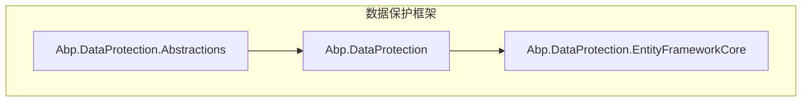
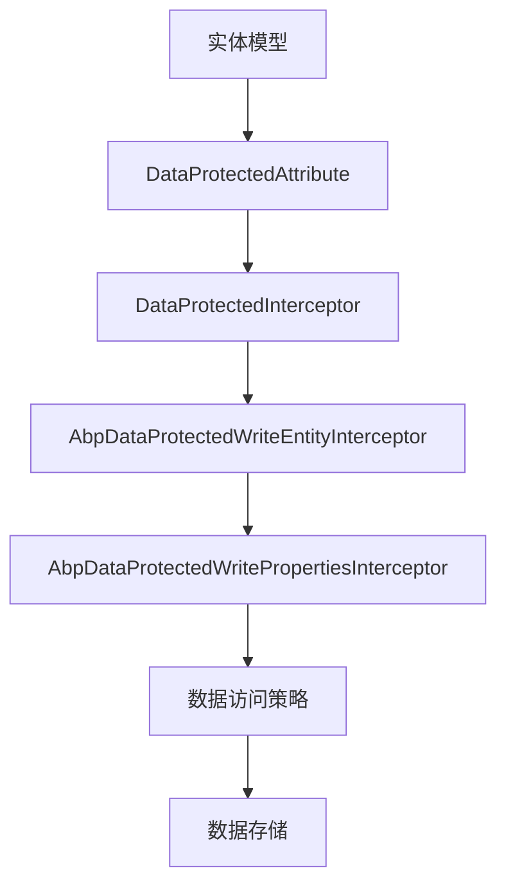
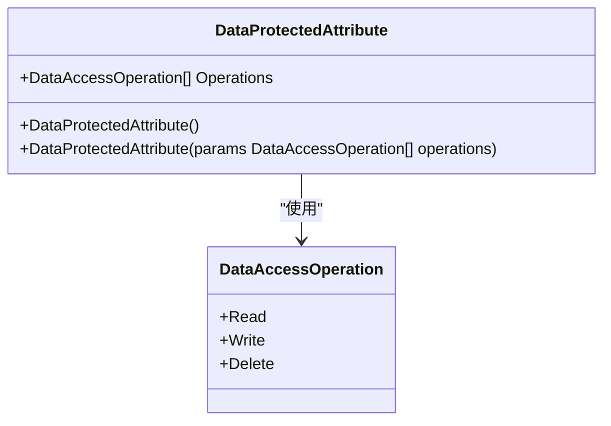
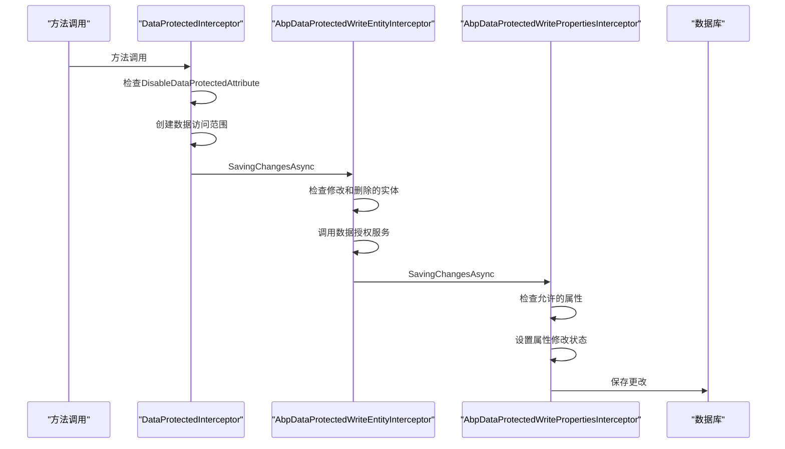
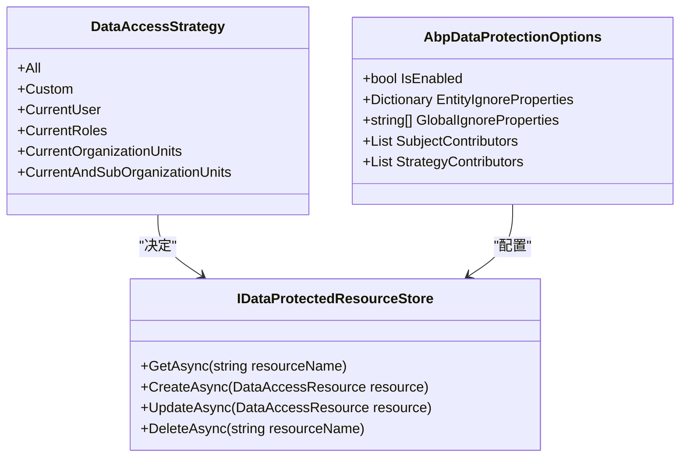
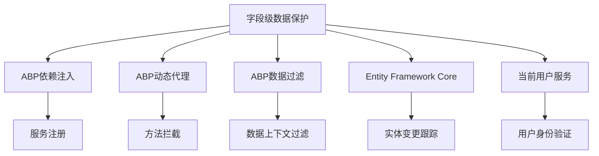

# 字段级保护

<cite>
**本文档中引用的文件**  
- [DataProtectedAttribute.cs](file://aspnet-core/framework/data-protection/LINGYUN.Abp.DataProtection.Abstractions/LINGYUN/Abp/DataProtection/DataProtectedAttribute.cs)
- [DataAccessOperation.cs](file://aspnet-core/framework/data-protection/LINGYUN.Abp.DataProtection.Abstractions/LINGYUN/Abp/DataProtection/DataAccessOperation.cs)
- [DataProtectedInterceptor.cs](file://aspnet-core/framework/data-protection/LINGYUN.Abp.DataProtection/LINGYUN/Abp/DataProtection/DataProtectedInterceptor.cs)
- [AbpDataProtectedWriteEntityInterceptor.cs](file://aspnet-core/framework/data-protection/LINGYUN.Abp.DataProtection.EntityFrameworkCore/LINGYUN/Abp/DataProtection/EntityFrameworkCore/AbpDataProtectedWriteEntityInterceptor.cs)
- [AbpDataProtectedWritePropertiesInterceptor.cs](file://aspnet-core/framework/data-protection/LINGYUN.Abp.DataProtection.EntityFrameworkCore/LINGYUN/Abp/DataProtection/EntityFrameworkCore/AbpDataProtectedWritePropertiesInterceptor.cs)
- [AbpDataProtectionOptions.cs](file://aspnet-core/framework/data-protection/LINGYUN.Abp.DataProtection/LINGYUN/Abp/DataProtection/AbpDataProtectionOptions.cs)
- [DataAccessStrategy.cs](file://aspnet-core/framework/data-protection/LINGYUN.Abp.DataProtection.Abstractions/LINGYUN/Abp/DataProtection/DataAccessStrategy.cs)
- [IDataProtectedResourceStore.cs](file://aspnet-core/framework/data-protection/LINGYUN.Abp.DataProtection/LINGYUN/Abp/DataProtection/Stores/IDataProtectedResourceStore.cs)
- [ProtectionFieldTests.cs](file://aspnet-core/tests/LINGYUN.Abp.DataProtection.Tests/LINGYUN/Abp/DataProtection/ProtectionFieldTests.cs)
</cite>

## 目录
1. [简介](#简介)
2. [项目结构](#项目结构)
3. [核心组件](#核心组件)
4. [架构概述](#架构概述)
5. [详细组件分析](#详细组件分析)
6. [依赖分析](#依赖分析)
7. [性能考虑](#性能考虑)
8. [故障排除指南](#故障排除指南)
9. [结论](#结论)

## 简介
本文件详细介绍了在ABP框架中实现字段级数据保护的机制。该系统通过属性标注、拦截器和策略配置，实现了对实体模型中敏感字段的细粒度访问控制。文档将深入探讨如何标识敏感字段、配置数据保护策略，以及在查询和更新操作中自动处理加密数据的方法。

## 项目结构
字段级数据保护功能主要分布在`aspnet-core/framework/data-protection`目录下，包含三个核心项目：

**图示来源**
- [DataProtectedAttribute.cs](file://aspnet-core/framework/data-protection/LINGYUN.Abp.DataProtection.Abstractions/LINGYUN/Abp/DataProtection/DataProtectedAttribute.cs)
- [DataProtectedInterceptor.cs](file://aspnet-core/framework/data-protection/LINGYUN.Abp.DataProtection/LINGYUN/Abp/DataProtection/DataProtectedInterceptor.cs)
- [AbpDataProtectedWriteEntityInterceptor.cs](file://aspnet-core/framework/data-protection/LINGYUN.Abp.DataProtection.EntityFrameworkCore/LINGYUN/Abp/DataProtection/EntityFrameworkCore/AbpDataProtectedWriteEntityInterceptor.cs)

**本节来源**
- [DataProtectedAttribute.cs](file://aspnet-core/framework/data-protection/LINGYUN.Abp.DataProtection.Abstractions/LINGYUN/Abp/DataProtection/DataProtectedAttribute.cs)
- [DataProtectedInterceptor.cs](file://aspnet-core/framework/data-protection/LINGYUN.Abp.DataProtection/LINGYUN/Abp/DataProtection/DataProtectedInterceptor.cs)

## 核心组件
字段级数据保护的核心组件包括数据保护属性、拦截器、策略配置和资源存储。这些组件协同工作，确保敏感数据在访问和修改时受到适当保护。

**本节来源**
- [DataProtectedAttribute.cs](file://aspnet-core/framework/data-protection/LINGYUN.Abp.DataProtection.Abstractions/LINGYUN/Abp/DataProtection/DataProtectedAttribute.cs)
- [DataProtectedInterceptor.cs](file://aspnet-core/framework/data-protection/LINGYUN.Abp.DataProtection/LINGYUN/Abp/DataProtection/DataProtectedInterceptor.cs)
- [AbpDataProtectionOptions.cs](file://aspnet-core/framework/data-protection/LINGYUN.Abp.DataProtection/LINGYUN/Abp/DataProtection/AbpDataProtectionOptions.cs)

## 架构概述
字段级数据保护系统采用分层架构，从属性标注到拦截器处理，再到策略执行，形成完整的保护链。

**图示来源**
- [DataProtectedAttribute.cs](file://aspnet-core/framework/data-protection/LINGYUN.Abp.DataProtection.Abstractions/LINGYUN/Abp/DataProtection/DataProtectedAttribute.cs)
- [DataProtectedInterceptor.cs](file://aspnet-core/framework/data-protection/LINGYUN.Abp.DataProtection/LINGYUN/Abp/DataProtection/DataProtectedInterceptor.cs)
- [AbpDataProtectedWriteEntityInterceptor.cs](file://aspnet-core/framework/data-protection/LINGYUN.Abp.DataProtection.EntityFrameworkCore/LINGYUN/Abp/DataProtection/EntityFrameworkCore/AbpDataProtectedWriteEntityInterceptor.cs)
- [AbpDataProtectedWritePropertiesInterceptor.cs](file://aspnet-core/framework/data-protection/LINGYUN.Abp.DataProtection.EntityFrameworkCore/LINGYUN/Abp/DataProtection/EntityFrameworkCore/AbpDataProtectedWritePropertiesInterceptor.cs)

## 详细组件分析

### 数据保护属性分析
`DataProtectedAttribute`是实现字段级保护的核心属性，用于标记需要保护的实体、方法或属性。

**图示来源**
- [DataProtectedAttribute.cs](file://aspnet-core/framework/data-protection/LINGYUN.Abp.DataProtection.Abstractions/LINGYUN/Abp/DataProtection/DataProtectedAttribute.cs)
- [DataAccessOperation.cs](file://aspnet-core/framework/data-protection/LINGYUN.Abp.DataProtection.Abstractions/LINGYUN/Abp/DataProtection/DataAccessOperation.cs)

### 拦截器机制分析
数据保护拦截器在方法调用和数据保存时进行权限检查，确保操作符合预定义策略。

**图示来源**
- [DataProtectedInterceptor.cs](file://aspnet-core/framework/data-protection/LINGYUN.Abp.DataProtection/LINGYUN/Abp/DataProtection/DataProtectedInterceptor.cs)
- [AbpDataProtectedWriteEntityInterceptor.cs](file://aspnet-core/framework/data-protection/LINGYUN.Abp.DataProtection.EntityFrameworkCore/LINGYUN/Abp/DataProtection/EntityFrameworkCore/AbpDataProtectedWriteEntityInterceptor.cs)
- [AbpDataProtectedWritePropertiesInterceptor.cs](file://aspnet-core/framework/data-protection/LINGYUN.Abp.DataProtection.EntityFrameworkCore/LINGYUN/Abp/DataProtection/EntityFrameworkCore/AbpDataProtectedWritePropertiesInterceptor.cs)

### 数据访问策略分析
系统提供了多种预定义的数据访问策略，可根据业务需求选择合适的策略。

**图示来源**
- [DataAccessStrategy.cs](file://aspnet-core/framework/data-protection/LINGYUN.Abp.DataProtection.Abstractions/LINGYUN/Abp/DataProtection/DataAccessStrategy.cs)
- [IDataProtectedResourceStore.cs](file://aspnet-core/framework/data-protection/LINGYUN.Abp.DataProtection/LINGYUN/Abp/DataProtection/Stores/IDataProtectedResourceStore.cs)
- [AbpDataProtectionOptions.cs](file://aspnet-core/framework/data-protection/LINGYUN.Abp.DataProtection/LINGYUN/Abp/DataProtection/AbpDataProtectionOptions.cs)

**本节来源**
- [DataProtectedAttribute.cs](file://aspnet-core/framework/data-protection/LINGYUN.Abp.DataProtection.Abstractions/LINGYUN/Abp/DataProtection/DataProtectedAttribute.cs)
- [DataProtectedInterceptor.cs](file://aspnet-core/framework/data-protection/LINGYUN.Abp.DataProtection/LINGYUN/Abp/DataProtection/DataProtectedInterceptor.cs)
- [AbpDataProtectedWriteEntityInterceptor.cs](file://aspnet-core/framework/data-protection/LINGYUN.Abp.DataProtection.EntityFrameworkCore/LINGYUN/Abp/DataProtection/EntityFrameworkCore/AbpDataProtectedWriteEntityInterceptor.cs)

## 依赖分析
字段级数据保护系统依赖于ABP框架的核心组件，包括依赖注入、动态代理和数据过滤。

**图示来源**
- [DataProtectedInterceptor.cs](file://aspnet-core/framework/data-protection/LINGYUN.Abp.DataProtection/LINGYUN/Abp/DataProtection/DataProtectedInterceptor.cs)
- [AbpDataProtectedWriteEntityInterceptor.cs](file://aspnet-core/framework/data-protection/LINGYUN.Abp.DataProtection.EntityFrameworkCore/LINGYUN/Abp/DataProtection/EntityFrameworkCore/AbpDataProtectedWriteEntityInterceptor.cs)
- [AbpDataProtectedWritePropertiesInterceptor.cs](file://aspnet-core/framework/data-protection/LINGYUN.Abp.DataProtection.EntityFrameworkCore/LINGYUN/Abp/DataProtection/EntityFrameworkCore/AbpDataProtectedWritePropertiesInterceptor.cs)

**本节来源**
- [DataProtectedInterceptor.cs](file://aspnet-core/framework/data-protection/LINGYUN.Abp.DataProtection/LINGYUN/Abp/DataProtection/DataProtectedInterceptor.cs)
- [AbpDataProtectedWriteEntityInterceptor.cs](file://aspnet-core/framework/data-protection/LINGYUN.Abp.DataProtection.EntityFrameworkCore/LINGYUN/Abp/DataProtection/EntityFrameworkCore/AbpDataProtectedWriteEntityInterceptor.cs)

## 性能考虑
字段级数据保护在提供安全性的同事，也会带来一定的性能开销。系统通过缓存机制和优化的查询策略来最小化性能影响。

- **缓存策略**：系统使用`DataProtectedResourceCache`和`DataProtectedStrategyStateCache`来缓存资源和策略状态，减少数据库查询次数
- **批量处理**：在实体变更跟踪中，系统批量处理修改和删除的实体，减少授权服务调用次数
- **条件检查**：只有在启用了数据保护且存在保护属性时，才会执行完整的拦截逻辑

## 故障排除指南
### 常见问题及解决方案

1. **数据保护未生效**
   - 检查`AbpDataProtectionOptions`中的`IsEnabled`是否设置为`true`
   - 确认实体或属性已正确标记`DataProtectedAttribute`
   - 检查是否有`DisableDataProtectedAttribute`覆盖了保护设置

2. **性能下降**
   - 检查缓存配置是否正确
   - 优化`SubjectContributors`和`StrategyContributors`的实现，避免复杂计算
   - 考虑将不常变更的策略结果缓存

3. **权限错误**
   - 检查数据授权服务的实现
   - 确认当前用户具有相应的访问权限
   - 验证策略配置是否正确

**本节来源**
- [DataProtectedInterceptor.cs](file://aspnet-core/framework/data-protection/LINGYUN.Abp.DataProtection/LINGYUN/Abp/DataProtection/DataProtectedInterceptor.cs)
- [AbpDataProtectedWriteEntityInterceptor.cs](file://aspnet-core/framework/data-protection/LINGYUN.Abp.DataProtection.EntityFrameworkCore/LINGYUN/Abp/DataProtection/EntityFrameworkCore/AbpDataProtectedWriteEntityInterceptor.cs)
- [ProtectionFieldTests.cs](file://aspnet-core/tests/LINGYUN.Abp.DataProtection.Tests/LINGYUN/Abp/DataProtection/ProtectionFieldTests.cs)

## 结论
字段级数据保护系统为ABP框架提供了强大的数据安全机制。通过属性标注、拦截器和策略配置的组合，系统能够灵活地控制对敏感数据的访问。开发者可以根据业务需求，轻松地在实体模型中应用数据保护特性，而无需修改核心业务逻辑。系统的设计考虑了性能和可扩展性，通过缓存和优化的查询策略，确保在提供安全性的同时，保持良好的系统性能。