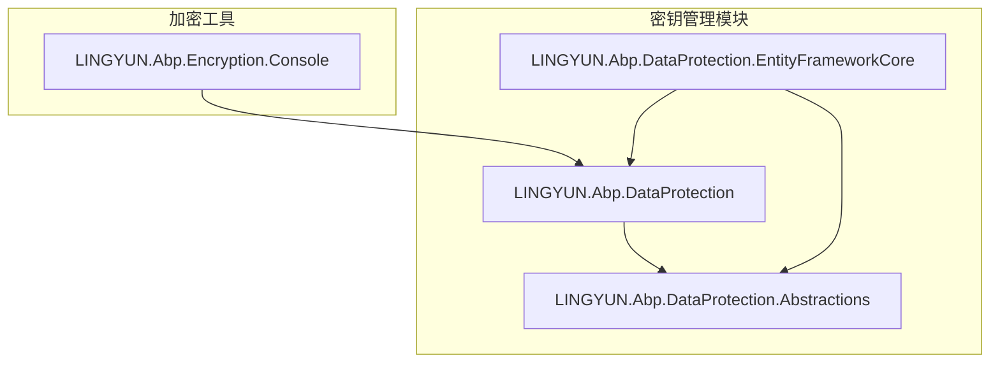
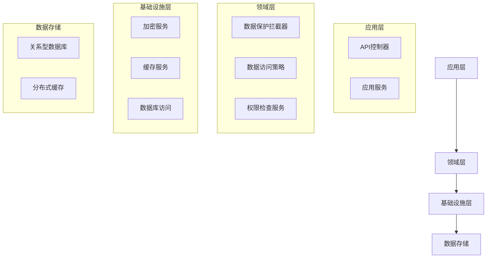
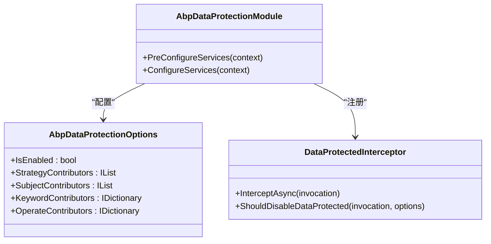
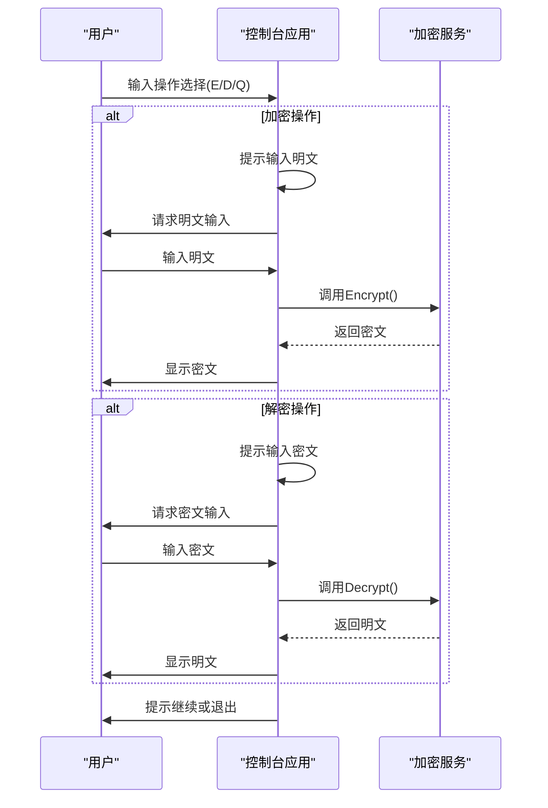
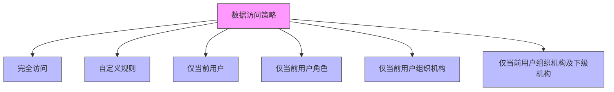

# 密钥管理

<cite>
**本文档中引用的文件**  
- [AbpDataProtectionModule.cs](file://aspnet-core/framework/data-protection/LINGYUN.Abp.DataProtection/LINGYUN/Abp/DataProtection/AbpDataProtectionModule.cs)
- [AbpDataProtectionOptions.cs](file://aspnet-core/framework/data-protection/LINGYUN.Abp.DataProtection/LINGYUN/Abp/DataProtection/AbpDataProtectionOptions.cs)
- [DataProtectedAttribute.cs](file://aspnet-core/framework/data-protection/LINGYUN.Abp.DataProtection.Abstractions/LINGYUN/Abp/DataProtection/DataProtectedAttribute.cs)
- [EfCoreDataProtectionRepository.cs](file://aspnet-core/framework/data-protection/LINGYUN.Abp.DataProtection.EntityFrameworkCore/LINGYUN/Abp/DataProtection/EntityFrameworkCore/EfCoreDataProtectionRepository.cs)
- [DataProtectedInterceptor.cs](file://aspnet-core/framework/data-protection/LINGYUN.Abp.DataProtection/LINGYUN/Abp/DataProtection/DataProtectedInterceptor.cs)
- [DataProtectedResourceCache.cs](file://aspnet-core/framework/data-protection/LINGYUN.Abp.DataProtection/LINGYUN/Abp/DataProtection/Stores/DataProtectedResourceCache.cs)
- [DataAccessStrategy.cs](file://aspnet-core/framework/data-protection/LINGYUN.Abp.DataProtection.Abstractions/LINGYUN/Abp/DataProtection/DataAccessStrategy.cs)
- [DataAccessResource.cs](file://aspnet-core/framework/data-protection/LINGYUN.Abp.DataProtection.Abstractions/LINGYUN/Abp/DataProtection/DataAccessResource.cs)
- [AbpEncryptionConsoleModule.cs](file://aspnet-core/framework/console/LINGYUN.Abp.Encryption.Console/AbpEncryptionConsoleModule.cs)
- [Program.cs](file://aspnet-core/framework/console/LINGYUN.Abp.Encryption.Console/Program.cs)
</cite>

## 目录
1. [简介](#简介)
2. [项目结构](#项目结构)
3. [核心组件](#核心组件)
4. [架构概述](#架构概述)
5. [详细组件分析](#详细组件分析)
6. [依赖分析](#依赖分析)
7. [性能考虑](#性能考虑)
8. [故障排除指南](#故障排除指南)
9. [结论](#结论)

## 简介
本项目实现了一个基于ABP框架的密钥管理系统，专注于数据保护和访问控制。系统通过数据保护模块实现对敏感数据的加密、存储、轮换和销毁机制。密钥管理功能主要通过`LINGYUN.Abp.DataProtection`系列模块实现，支持多种存储后端和灵活的权限策略。系统还提供了加密控制台应用，用于演示和测试加密解密功能。

## 项目结构
项目采用模块化设计，密钥管理相关功能主要分布在`aspnet-core/framework/data-protection`目录下。该目录包含三个核心模块：`LINGYUN.Abp.DataProtection`（主模块）、`LINGYUN.Abp.DataProtection.Abstractions`（抽象定义）和`LINGYUN.Abp.DataProtection.EntityFrameworkCore`（EF Core实现）。此外，`aspnet-core/framework/console/LINGYUN.Abp.Encryption.Console`提供了加密功能的控制台演示应用。

**图示来源**
- [AbpDataProtectionModule.cs](file://aspnet-core/framework/data-protection/LINGYUN.Abp.DataProtection/LINGYUN/Abp/DataProtection/AbpDataProtectionModule.cs)
- [AbpEncryptionConsoleModule.cs](file://aspnet-core/framework/console/LINGYUN.Abp.Encryption.Console/AbpEncryptionConsoleModule.cs)

**本节来源**
- [aspnet-core/framework/data-protection](file://aspnet-core/framework/data-protection)
- [aspnet-core/framework/console/LINGYUN.Abp.Encryption.Console](file://aspnet-core/framework/console/LINGYUN.Abp.Encryption.Console)

## 核心组件
系统的核心组件包括数据保护模块、加密服务、拦截器和缓存机制。`AbpDataProtectionModule`是主模块，负责注册所有数据保护相关的服务和配置。`DataProtectedInterceptor`是一个AOP拦截器，用于在方法调用时自动应用数据保护策略。`EfCoreDataProtectionRepository`扩展了ABP的仓储模式，实现了数据访问的自动过滤和权限检查。

**本节来源**
- [AbpDataProtectionModule.cs](file://aspnet-core/framework/data-protection/LINGYUN.Abp.DataProtection/LINGYUN/Abp/DataProtection/AbpDataProtectionModule.cs)
- [DataProtectedInterceptor.cs](file://aspnet-core/framework/data-protection/LINGYUN.Abp.DataProtection/LINGYUN/Abp/DataProtection/DataProtectedInterceptor.cs)
- [EfCoreDataProtectionRepository.cs](file://aspnet-core/framework/data-protection/LINGYUN.Abp.DataProtection.EntityFrameworkCore/LINGYUN/Abp/DataProtection/EntityFrameworkCore/EfCoreDataProtectionRepository.cs)

## 架构概述
系统采用分层架构，从上到下分为应用层、领域层和基础设施层。数据保护功能主要在领域层实现，通过拦截器和仓储模式与应用层交互。加密服务作为基础设施层的一部分，为上层提供统一的加密解密接口。缓存层用于存储频繁访问的权限策略，提高系统性能。

**图示来源**
- [AbpDataProtectionModule.cs](file://aspnet-core/framework/data-protection/LINGYUN.Abp.DataProtection/LINGYUN/Abp/DataProtection/AbpDataProtectionModule.cs)
- [EfCoreDataProtectionRepository.cs](file://aspnet-core/framework/data-protection/LINGYUN.Abp.DataProtection.EntityFrameworkCore/LINGYUN/Abp/DataProtection/EntityFrameworkCore/EfCoreDataProtectionRepository.cs)

## 详细组件分析

### 数据保护模块分析
数据保护模块是系统的核心，负责管理所有与数据安全相关的功能。模块通过`AbpDataProtectionOptions`类配置各种策略，包括操作贡献者、主体贡献者和关键字贡献者。这些策略在系统启动时通过`PreConfigureServices`和`ConfigureServices`方法注册。

**图示来源**
- [AbpDataProtectionModule.cs](file://aspnet-core/framework/data-protection/LINGYUN.Abp.DataProtection/LINGYUN/Abp/DataProtection/AbpDataProtectionModule.cs)
- [AbpDataProtectionOptions.cs](file://aspnet-core/framework/data-protection/LINGYUN.Abp.DataProtection/LINGYUN/Abp/DataProtection/AbpDataProtectionOptions.cs)
- [DataProtectedInterceptor.cs](file://aspnet-core/framework/data-protection/LINGYUN.Abp.DataProtection/LINGYUN/Abp/DataProtection/DataProtectedInterceptor.cs)

### 加密服务分析
加密服务提供了基础的加密解密功能，基于ABP框架的`IStringEncryptionService`接口实现。控制台应用`LINGYUN.Abp.Encryption.Console`演示了如何使用加密服务进行字符串的加密和解密操作。系统支持SM4等加密算法，并通过配置文件设置默认的密码短语、初始化向量和盐值。

**图示来源**
- [Program.cs](file://aspnet-core/framework/console/LINGYUN.Abp.Encryption.Console/Program.cs)
- [AbpEncryptionConsoleModule.cs](file://aspnet-core/framework/console/LINGYUN.Abp.Encryption.Console/AbpEncryptionConsoleModule.cs)

### 数据访问策略分析
数据访问策略定义了不同主体对数据的访问权限。系统支持多种策略类型，包括完全访问、自定义规则、当前用户、当前角色、当前组织机构等。这些策略通过`DataAccessStrategy`枚举定义，并在运行时由`DataAccessStrategyContributor`实现具体的权限逻辑。

**图示来源**
- [DataAccessStrategy.cs](file://asp