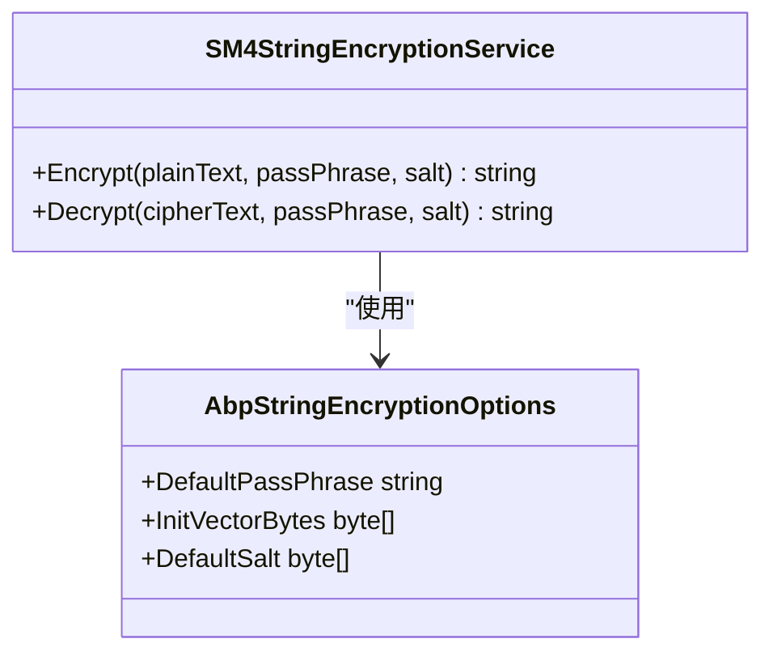
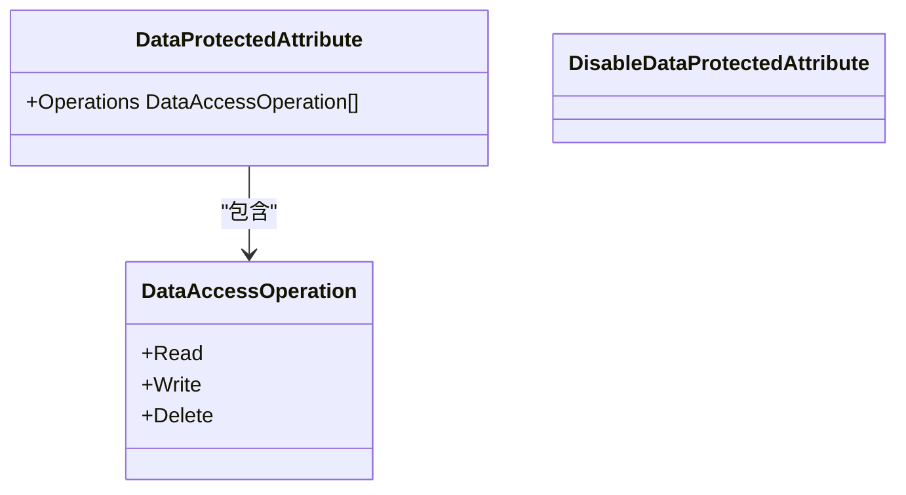
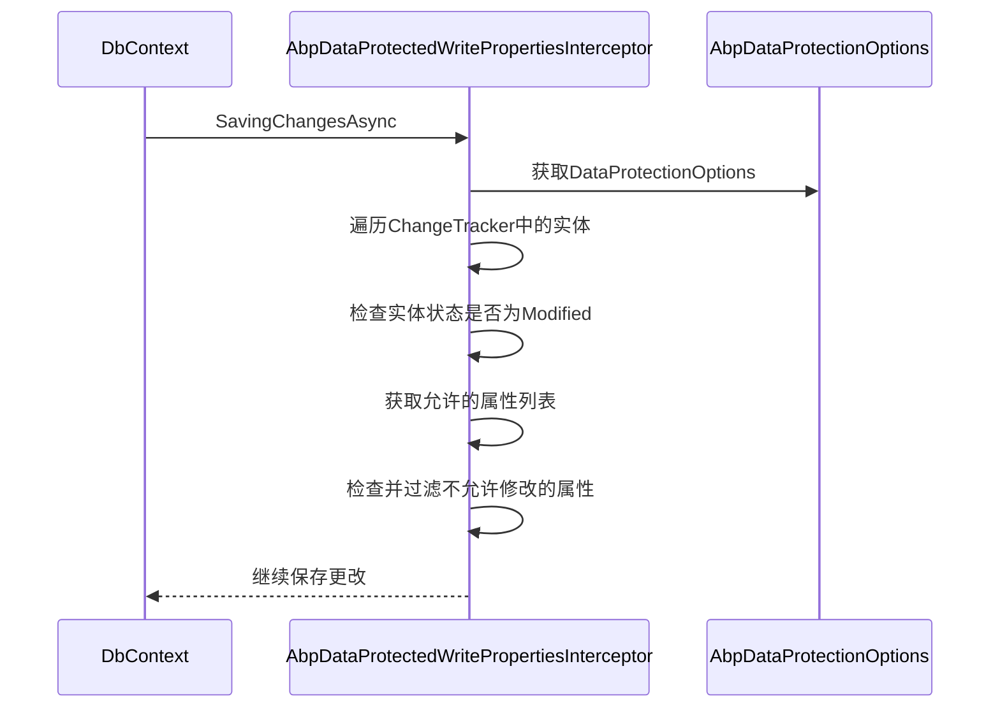
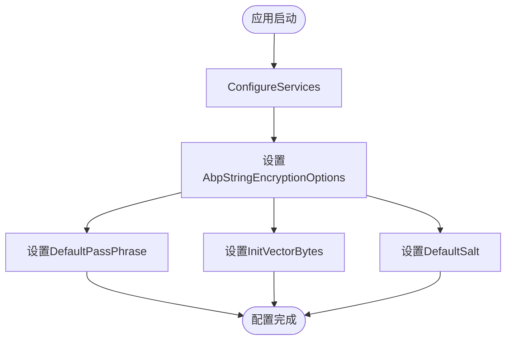
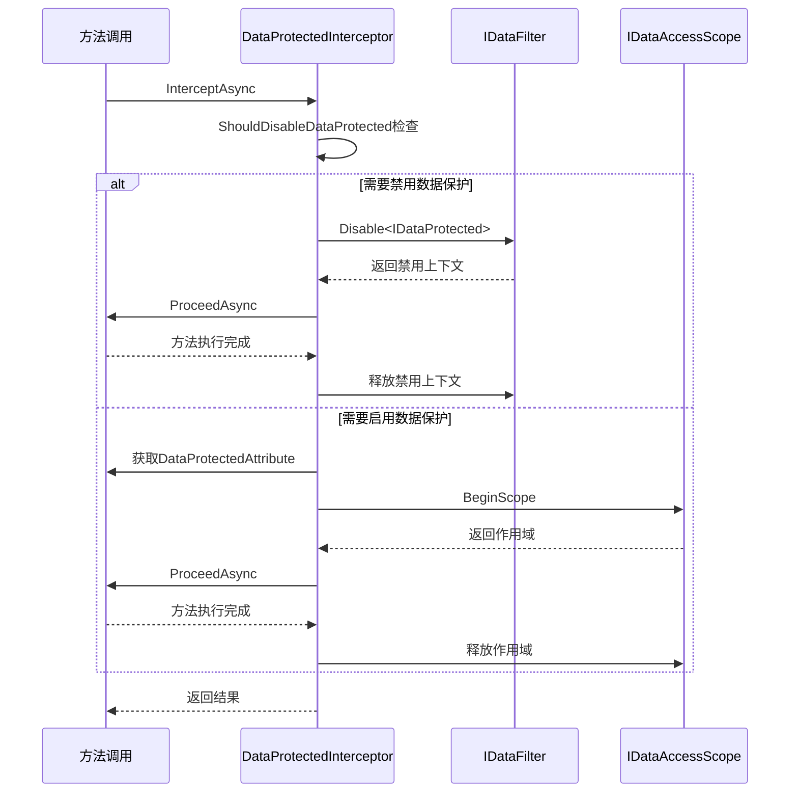
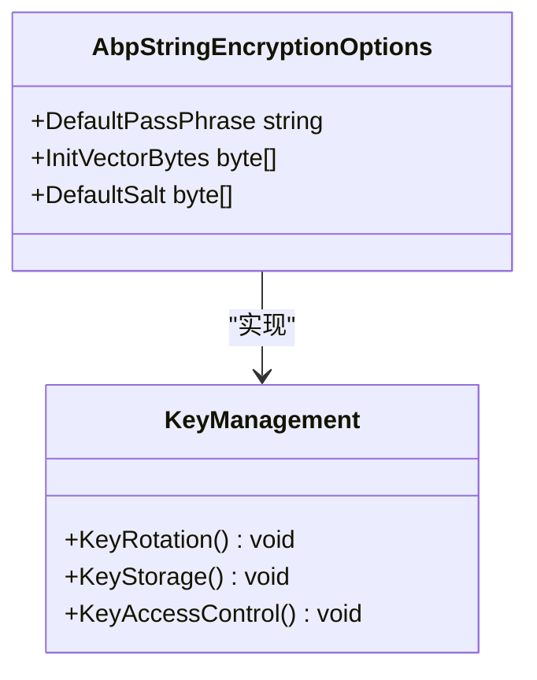
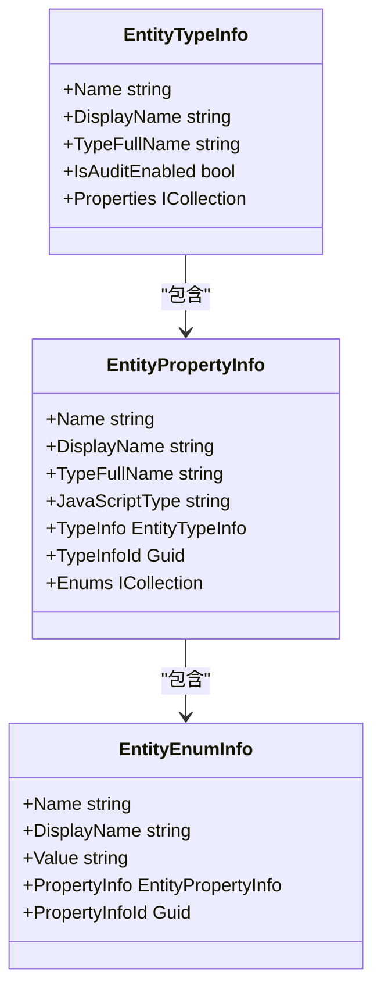
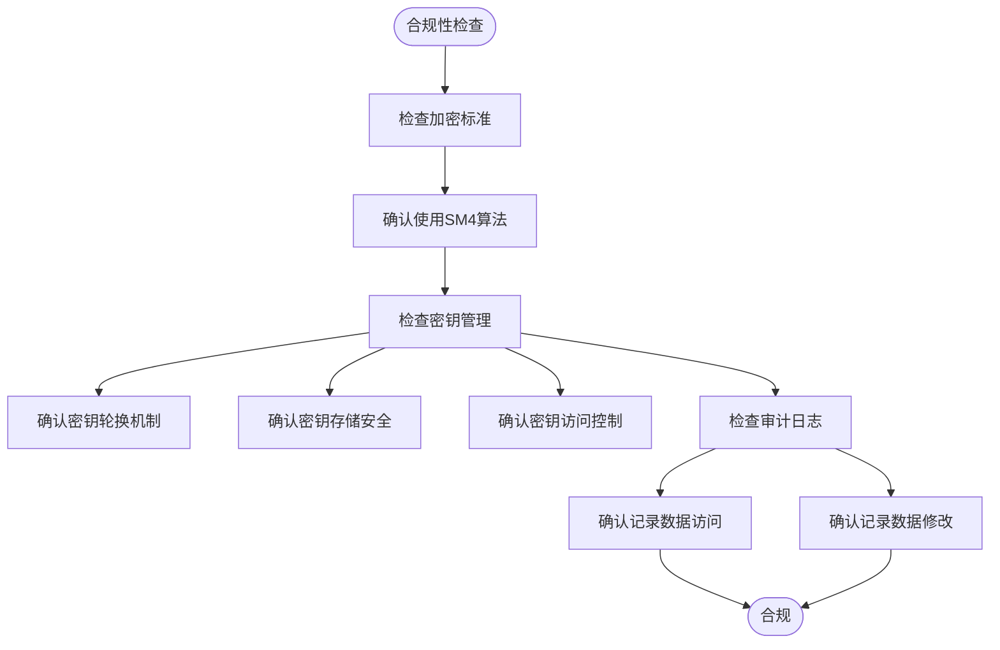

# 数据保护

<cite>
**本文档引用的文件**
- [AbpEncryptionSM4Module.cs](file://aspnet-core/framework/security/LINGYUN.Abp.Encryption.SM4/LINGYUN/Abp/Encryption/SM4/AbpEncryptionSM4Module.cs)
- [SM4StringEncryptionService.cs](file://aspnet-core/framework/security/LINGYUN.Abp.Encryption.SM4/LINGYUN/Abp/Encryption/SM4/SM4StringEncryptionService.cs)
- [AbpEncryptionConsoleModule.cs](file://aspnet-core/framework/console/LINGYUN.Abp.Encryption.Console/AbpEncryptionConsoleModule.cs)
- [AbpDataProtectionOptions.cs](file://aspnet-core/framework/data-protection/LINGYUN.Abp.DataProtection/LINGYUN/Abp/DataProtection/AbpDataProtectionOptions.cs)
- [DataProtectedAttribute.cs](file://aspnet-core/framework/data-protection/LINGYUN.Abp.DataProtection.Abstractions/LINGYUN/Abp/DataProtection/DataProtectedAttribute.cs)
- [DisableDataProtectedAttribute.cs](file://aspnet-core/framework/data-protection/LINGYUN.Abp.DataProtection.Abstractions/LINGYUN/Abp/DataProtection/DisableDataProtectedAttribute.cs)
- [DataAccessStrategy.cs](file://aspnet-core/framework/data-protection/LINGYUN.Abp.DataProtection/LINGYUN/Abp/DataProtection/DataAccessStrategy.cs)
- [DataAccessEntityTypeInfoProvider.cs](file://aspnet-core/framework/data-protection/LINGYUN.Abp.DataProtection/LINGYUN/Abp/DataProtection/DataAccessEntityTypeInfoProvider.cs)
- [EntityTypeInfo.cs](file://aspnet-core/modules/data-protection/LINGYUN.Abp.DataProtectionManagement.Domain/LINGYUN/Abp/DataProtectionManagement/EntityTypeInfo.cs)
- [EntityPropertyInfo.cs](file://aspnet-core/modules/data-protection/LINGYUN.Abp.DataProtectionManagement.Domain/LINGYUN/Abp/DataProtectionManagement/EntityPropertyInfo.cs)
- [DataProtectedInterceptor.cs](file://aspnet-core/framework/data-protection/LINGYUN.Abp.DataProtection/LINGYUN/Abp/DataProtection/DataProtectedInterceptor.cs)
- [DataProtectedInterceptorRegistrar.cs](file://aspnet-core/framework/data-protection/LINGYUN.Abp.DataProtection/LINGYUN/Abp/DataProtection/DataProtectedInterceptorRegistrar.cs)
- [IDataAuthorizationService.cs](file://aspnet-core/framework/data-protection/LINGYUN.Abp.DataProtection/LINGYUN/Abp/DataProtection/IDataAuthorizationService.cs)
- [AbpDataProtectionEntityFrameworkCoreModule.cs](file://aspnet-core/framework/data-protection/LINGYUN.Abp.DataProtection.EntityFrameworkCore/LINGYUN/Abp/DataProtection/EntityFrameworkCore/AbpDataProtectionEntityFrameworkCoreModule.cs)
- [EfCoreDataProtectionRepository.cs](file://aspnet-core/framework/data-protection/LINGYUN.Abp.DataProtection.EntityFrameworkCore/LINGYUN/Abp/DataProtection/EntityFrameworkCore/EfCoreDataProtectionRepository.cs)
- [AbpDataProtectedWriteEntityInterceptor.cs](file://aspnet-core/framework/data-protection/LINGYUN.Abp.DataProtection.EntityFrameworkCore/LINGYUN/Abp/DataProtection/EntityFrameworkCore/AbpDataProtectedWriteEntityInterceptor.cs)
- [AbpDataProtectedWritePropertiesInterceptor.cs](file://aspnet-core/framework/data-protection/LINGYUN.Abp.DataProtection.EntityFrameworkCore/LINGYUN/Abp/DataProtection/EntityFrameworkCore/AbpDataProtectedWritePropertiesInterceptor.cs)
</cite>

## 目录
1. [引言](#引言)
2. [数据加密机制](#数据加密机制)
3. [数据保护API使用方法](#数据保护api使用方法)
4. [数据库字段级加密](#数据库字段级加密)
5. [配置文件敏感信息保护](#配置文件敏感信息保护)
6. [传输过程中的数据安全](#传输过程中的数据安全)
7. [密钥管理策略](#密钥管理策略)
8. [实体模型中的数据保护特性](#实体模型中的数据保护特性)
9. [合规性检查指导](#合规性检查指导)
10. [结论](#结论)

## 引言
本项目提供了一套完整的数据保护解决方案，包括基于国密SM4算法的加密机制、数据保护API、数据库字段级加密、配置文件敏感信息保护以及传输过程中的数据安全。系统通过拦截器和仓储模式实现数据权限控制，支持多种数据访问策略，并提供了完善的密钥管理和轮换机制。该解决方案旨在确保敏感数据在存储、传输和处理过程中的安全性，满足合规性要求。

## 数据加密机制
系统采用国密SM4算法实现数据加密，通过`SM4StringEncryptionService`类提供加密和解密功能。该服务使用CBC模式和PKCS7填充，密钥长度固定为128位以符合算法要求。加密过程使用Rfc2898DeriveBytes从密码和盐值派生密钥，确保加密强度。

**图示来源**
- [SM4StringEncryptionService.cs](file://aspnet-core/framework/security/LINGYUN.Abp.Encryption.SM4/LINGYUN/Abp/Encryption/SM4/SM4StringEncryptionService.cs)
- [AbpEncryptionConsoleModule.cs](file://aspnet-core/framework/console/LINGYUN.Abp.Encryption.Console/AbpEncryptionConsoleModule.cs)

**本节来源**
- [SM4StringEncryptionService.cs](file://aspnet-core/framework/security/LINGYUN.Abp.Encryption.SM4/LINGYUN/Abp/Encryption/SM4/SM4StringEncryptionService.cs)
- [AbpEncryptionConsoleModule.cs](file://aspnet-core/framework/console/LINGYUN.Abp.Encryption.Console/AbpEncryptionConsoleModule.cs)

## 数据保护API使用方法
数据保护API通过`DataProtectedAttribute`和`DisableDataProtectedAttribute`两个特性实现。`DataProtectedAttribute`用于标记需要进行数据权限控制的方法或类，而`DisableDataProtectedAttribute`用于禁用数据权限控制。API支持读取、写入和删除三种数据操作类型。

**图示来源**
- [DataProtectedAttribute.cs](file://aspnet-core/framework/data-protection/LINGYUN.Abp.DataProtection.Abstractions/LINGYUN/Abp/DataProtection/DataProtectedAttribute.cs)

**本节来源**
- [DataProtectedAttribute.cs](file://aspnet-core/framework/data-protection/LINGYUN.Abp.DataProtection.Abstractions/LINGYUN/Abp/DataProtection/DataProtectedAttribute.cs)
- [DisableDataProtectedAttribute.cs](file://aspnet-core/framework/data-protection/LINGYUN.Abp.DataProtection.Abstractions/LINGYUN/Abp/DataProtection/DisableDataProtectedAttribute.cs)

## 数据库字段级加密
数据库字段级加密通过`AbpDataProtectedWritePropertiesInterceptor`拦截器实现。该拦截器在保存更改时检查实体状态，对于修改状态的实体，根据配置的权限主体和允许的属性列表进行字段级控制。只有在允许属性列表中的字段才能被修改。

**图示来源**
- [AbpDataProtectedWritePropertiesInterceptor.cs](file://aspnet-core/framework/data-protection/LINGYUN.Abp.DataProtection.EntityFrameworkCore/LINGYUN/Abp/DataProtection/EntityFrameworkCore/AbpDataProtectedWritePropertiesInterceptor.cs)
- [AbpDataProtectionOptions.cs](file://aspnet-core/framework/data-protection/LINGYUN.Abp.DataProtection/LINGYUN/Abp/DataProtection/AbpDataProtectionOptions.cs)

**本节来源**
- [AbpDataProtectedWritePropertiesInterceptor.cs](file://aspnet-core/framework/data-protection/LINGYUN.Abp.DataProtection.EntityFrameworkCore/LINGYUN/Abp/DataProtection/EntityFrameworkCore/AbpDataProtectedWritePropertiesInterceptor.cs)

## 配置文件敏感信息保护
配置文件中的敏感信息通过`AbpEncryptionConsoleModule`进行保护。该模块在服务配置时设置默认的密码短语、初始化向量和盐值，这些配置用于SM4加密算法。敏感信息在配置文件中以加密形式存储，运行时自动解密。

**图示来源**
- [AbpEncryptionConsoleModule.cs](file://aspnet-core/framework/console/LINGYUN.Abp.Encryption.Console/AbpEncryptionConsoleModule.cs)

**本节来源**
- [AbpEncryptionConsoleModule.cs](file://aspnet-core/framework/console/LINGYUN.Abp.Encryption.Console/AbpEncryptionConsoleModule.cs)

## 传输过程中的数据安全
传输过程中的数据安全通过`DataProtectedInterceptor`实现。该拦截器在方法调用前检查`DataProtectedAttribute`特性，根据配置的数据权限选项决定是否启用数据保护。对于标记了`DisableDataProtectedAttribute`的方法，拦截器会临时禁用数据保护。

**图示来源**
- [DataProtectedInterceptor.cs](file://aspnet-core/framework/data-protection/LINGYUN.Abp.DataProtection/LINGYUN/Abp/DataProtection/DataProtectedInterceptor.cs)
- [DataProtectedInterceptorRegistrar.cs](file://aspnet-core/framework/data-protection/LINGYUN.Abp.DataProtection/LINGYUN/Abp/DataProtection/DataProtectedInterceptorRegistrar.cs)

**本节来源**
- [DataProtectedInterceptor.cs](file://aspnet-core/framework/data-protection/LINGYUN.Abp.DataProtection/LINGYUN/Abp/DataProtection/DataProtectedInterceptor.cs)
- [DataProtectedInterceptorRegistrar.cs](file://aspnet-core/framework/data-protection/LINGYUN.Abp.DataProtection/LINGYUN/Abp/DataProtection/DataProtectedInterceptorRegistrar.cs)

## 密钥管理策略
密钥管理策略通过`AbpStringEncryptionOptions`配置实现。系统使用固定的密码短语、初始化向量和盐值进行加密。密钥轮换可以通过更新这些配置值实现。密钥存储在配置文件中，建议使用环境变量或密钥管理服务来保护这些敏感信息。

**图示来源**
- [AbpStringEncryptionOptions.cs](file://aspnet-core/framework/security/LINGYUN.Abp.Encryption.SM4/LINGYUN/Abp/Encryption/SM4/SM4StringEncryptionService.cs)
- [AbpEncryptionConsoleModule.cs](file://aspnet-core/framework/console/LINGYUN.Abp.Encryption.Console/AbpEncryptionConsoleModule.cs)

**本节来源**
- [AbpStringEncryptionOptions.cs](file://aspnet-core/framework/security/LINGYUN.Abp.Encryption.SM4/LINGYUN/Abp/Encryption/SM4/SM4StringEncryptionService.cs)
- [AbpEncryptionConsoleModule.cs](file://aspnet-core/framework/console/LINGYUN.Abp.Encryption.Console/AbpEncryptionConsoleModule.cs)

## 实体模型中的数据保护特性
实体模型通过`EntityTypeInfo`和`EntityPropertyInfo`类实现数据保护。`EntityTypeInfo`表示实体类型信息，包含名称、显示名称、类型全名和是否启用数据审计等属性。`EntityPropertyInfo`表示实体属性信息，包含名称、显示名称、类型全名、JavaScript类型等属性。

**图示来源**
- [EntityTypeInfo.cs](file://aspnet-core/modules/data-protection/LINGYUN.Abp.DataProtectionManagement.Domain/LINGYUN/Abp/DataProtectionManagement/EntityTypeInfo.cs)
- [EntityPropertyInfo.cs](file://aspnet-core/modules/data-protection/LINGYUN.Abp.DataProtectionManagement.Domain/LINGYUN/Abp/DataProtectionManagement/EntityPropertyInfo.cs)
- [EntityEnumInfo.cs](file://aspnet-core/modules/data-protection/LINGYUN.Abp.DataProtectionManagement.Domain/LINGYUN/Abp/DataProtectionManagement/EntityEnumInfo.cs)

**本节来源**
- [EntityTypeInfo.cs](file://aspnet-core/modules/data-protection/LINGYUN.Abp.DataProtectionManagement.Domain/LINGYUN/Abp/DataProtectionManagement/EntityTypeInfo.cs)
- [EntityPropertyInfo.cs](file://aspnet-core/modules/data-protection/LINGYUN.Abp.DataProtectionManagement.Domain/LINGYUN/Abp/DataProtectionManagement/EntityPropertyInfo.cs)

## 合规性检查指导
合规性检查应重点关注数据加密标准符合性和密钥管理最佳实践。系统使用国密SM4算法，符合中国密码标准。密钥管理方面，建议定期轮换密钥，使用安全的存储方式保护密钥，并限制密钥的访问权限。审计日志应记录所有数据访问和修改操作。

**图示来源**
- [AbpDataProtectionOptions.cs](file://aspnet-core/framework/data-protection/LINGYUN.Abp.DataProtection/LINGYUN/Abp/DataProtection/AbpDataProtectionOptions.cs)
- [DataAccessStrategy.cs](file://aspnet-core/framework/data-protection/LINGYUN.Abp.DataProtection/LINGYUN/Abp/DataProtection/DataAccessStrategy.cs)

**本节来源**
- [AbpDataProtectionOptions.cs](file://aspnet-core/framework/data-protection/LINGYUN.Abp.DataProtection/LINGYUN/Abp/DataProtection/AbpDataProtectionOptions.cs)
- [DataAccessStrategy.cs](file://aspnet-core/framework/data-protection/LINGYUN.Abp.DataProtection/LINGYUN/Abp/DataProtection/DataAccessStrategy.cs)

## 结论
本项目提供了一套完整的数据保护解决方案，涵盖了从数据加密、API使用、数据库字段级加密到密钥管理的各个方面。通过拦截器和仓储模式实现的数据权限控制，结合多种数据访问策略，确保了敏感数据在存储、传输和处理过程中的安全性。系统设计符合中国密码标准，为安全审计人员提供了清晰的合规性检查指导。