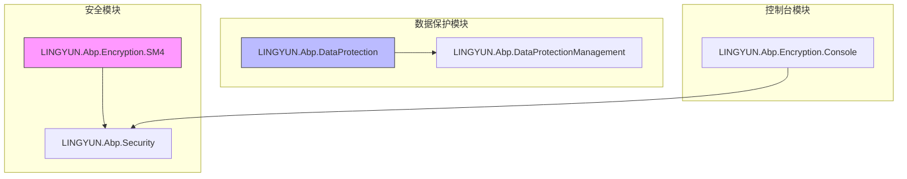
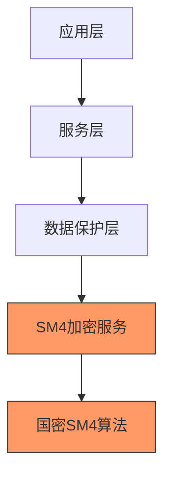
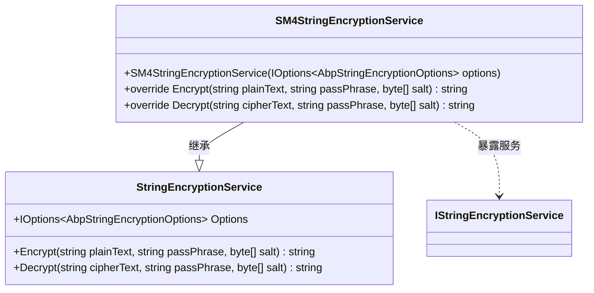
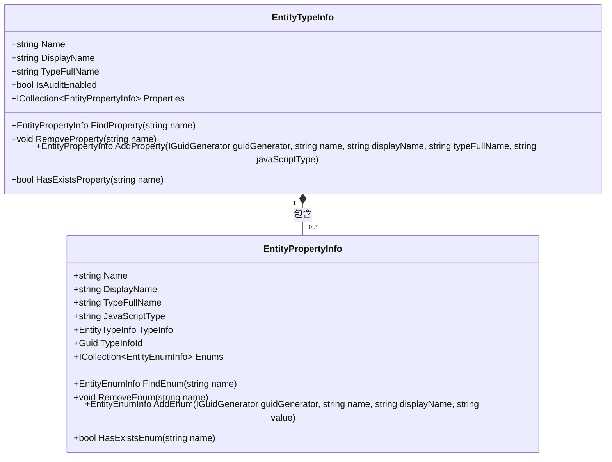
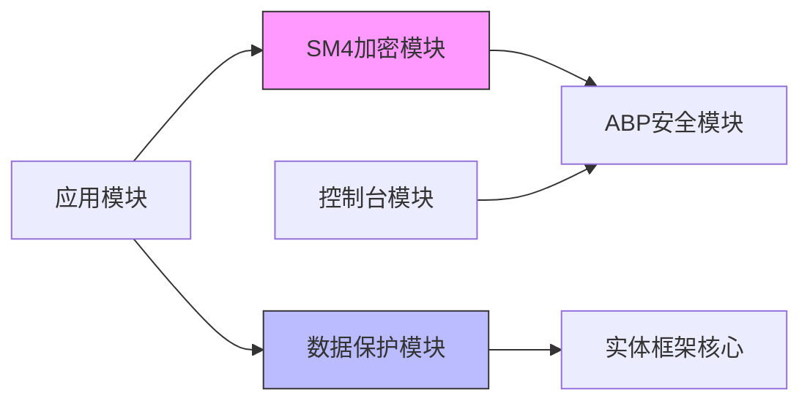

# 数据加密

<cite>
**本文档引用的文件**
- [AbpEncryptionSM4Module.cs](file://aspnet-core/framework/security/LINGYUN.Abp.Encryption.SM4/LINGYUN/Abp/Encryption/SM4/AbpEncryptionSM4Module.cs)
- [SM4StringEncryptionService.cs](file://aspnet-core/framework/security/LINGYUN.Abp.Encryption.SM4/LINGYUN/Abp/Encryption/SM4/SM4StringEncryptionService.cs)
- [StringEncryptionService_Tests.cs](file://aspnet-core/tests/LINGYUN.Abp.Encryption.SM4.Tests/LINGYUN/Abp/Encryption/SM4/StringEncryptionService_Tests.cs)
- [AbpEncryptionConsoleModule.cs](file://aspnet-core/framework/console/LINGYUN.Abp.Encryption.Console/AbpEncryptionConsoleModule.cs)
- [DataProtectionManagementOptions.cs](file://aspnet-core/modules/data-protection/LINGYUN.Abp.DataProtectionManagement.Domain/LINGYUN/Abp/DataProtectionManagement/DataProtectionManagementOptions.cs)
- [EntityTypeInfo.cs](file://aspnet-core/modules/data-protection/LINGYUN.Abp.DataProtectionManagement.Domain/LINGYUN/Abp/DataProtectionManagement/EntityTypeInfo.cs)
- [EntityPropertyInfo.cs](file://aspnet-core/modules/data-protection/LINGYUN.Abp.DataProtectionManagement.Domain/LINGYUN/Abp/DataProtectionManagement/EntityPropertyInfo.cs)
- [DataProtectedAttribute.cs](file://aspnet-core/framework/data-protection/LINGYUN.Abp.DataProtection.Abstractions/LINGYUN/Abp/DataProtection/DataProtectedAttribute.cs)
- [IDataProtected.cs](file://aspnet-core/framework/data-protection/LINGYUN.Abp.DataProtection.Abstractions/LINGYUN/Abp/DataProtection/IDataProtected.cs)
- [AbpDataProtectionManagementDbContextModelCreatingExtensions.cs](file://aspnet-core/modules/data-protection/LINGYUN.Abp.DataProtectionManagement.EntityFrameworkCore/LINGYUN/Abp/DataProtectionManagement/EntityFrameworkCore/AbpDataProtectionManagementDbContextModelCreatingExtensions.cs)
</cite>

## 目录
1. [简介](#简介)
2. [项目结构](#项目结构)
3. [核心组件](#核心组件)
4. [架构概述](#架构概述)
5. [详细组件分析](#详细组件分析)
6. [依赖分析](#依赖分析)
7. [性能考虑](#性能考虑)
8. [故障排除指南](#故障排除指南)
9. [结论](#结论)

## 简介
本文档详细介绍了ABP框架中基于国密SM4算法的数据加密机制。重点阐述了LINGYUN.Abp.Encryption.SM4模块的实现原理，以及如何在实体模型中使用数据保护特性进行字段级加密。文档涵盖了加密配置、依赖注入、自定义算法等关键主题，并为开发者提供了性能优化建议。

## 项目结构
项目中的数据加密功能主要分布在以下几个模块中：



**图示来源**
- [AbpEncryptionSM4Module.cs](file://aspnet-core/framework/security/LINGYUN.Abp.Encryption.SM4/LINGYUN/Abp/Encryption/SM4/AbpEncryptionSM4Module.cs)
- [DataProtectionManagementOptions.cs](file://aspnet-core/modules/data-protection/LINGYUN.Abp.DataProtectionManagement.Domain/LINGYUN/Abp/DataProtectionManagement/DataProtectionManagementOptions.cs)

**本节来源**
- [AbpEncryptionSM4Module.cs](file://aspnet-core/framework/security/LINGYUN.Abp.Encryption.SM4/LINGYUN/Abp/Encryption/SM4/AbpEncryptionSM4Module.cs)
- [DataProtectionManagementOptions.cs](file://aspnet-core/modules/data-protection/LINGYUN.Abp.DataProtectionManagement.Domain/LINGYUN/Abp/DataProtectionManagement/DataProtectionManagementOptions.cs)

## 核心组件
数据加密机制的核心组件包括SM4加密服务、数据保护特性、实体类型信息管理等。SM4StringEncryptionService实现了国密SM4算法的加密解密功能，而DataProtectionManagement模块提供了实体级别的数据保护配置和管理。

**本节来源**
- [SM4StringEncryptionService.cs](file://aspnet-core/framework/security/LINGYUN.Abp.Encryption.SM4/LINGYUN/Abp/Encryption/SM4/SM4StringEncryptionService.cs)
- [DataProtectionManagementOptions.cs](file://aspnet-core/modules/data-protection/LINGYUN.Abp.DataProtectionManagement.Domain/LINGYUN/Abp/DataProtectionManagement/DataProtectionManagementOptions.cs)

## 架构概述
系统采用分层架构设计，将加密算法实现与业务逻辑分离。SM4加密服务作为底层加密引擎，通过依赖注入提供给上层应用。数据保护模块在实体框架层面实现了透明的数据加密，开发者只需通过特性标注即可实现字段级加密。



**图示来源**
- [SM4StringEncryptionService.cs](file://aspnet-core/framework/security/LINGYUN.Abp.Encryption.SM4/LINGYUN/Abp/Encryption/SM4/SM4StringEncryptionService.cs)
- [DataProtectedAttribute.cs](file://aspnet-core/framework/data-protection/LINGYUN.Abp.DataProtection.Abstractions/LINGYUN/Abp/DataProtection/DataProtectedAttribute.cs)

## 详细组件分析

### SM4加密服务分析
SM4StringEncryptionService是国密SM4算法的核心实现类，继承自ABP框架的StringEncryptionService，通过替换服务的方式提供SM4加密功能。



**图示来源**
- [SM4StringEncryptionService.cs](file://aspnet-core/framework/security/LINGYUN.Abp.Encryption.SM4/LINGYUN/Abp/Encryption/SM4/SM4StringEncryptionService.cs)

**本节来源**
- [SM4StringEncryptionService.cs](file://aspnet-core/framework/security/LINGYUN.Abp.Encryption.SM4/LINGYUN/Abp/Encryption/SM4/SM4StringEncryptionService.cs)

### 数据保护特性分析
DataProtectedAttribute特性用于标记需要加密保护的实体或属性，支持配置不同的数据访问操作权限。

```mermaid
classDiagram
class DataProtectedAttribute {
+DataAccessOperation[] Operations
+DataProtectedAttribute()
+DataProtectedAttribute(params DataAccessOperation[] operations)
}
class IDataProtected {
+Guid? CreatorId {get;}
}
class IDataProtectedEnabled {
}
DataProtectedAttribute <|-- Attribute : 继承
IDataProtected <|-- IEntity : 实现
IDataProtectedEnabled <|-- IEntity : 实现
```

**图示来源**
- [DataProtectedAttribute.cs](file://aspnet-core/framework/data-protection/LINGYUN.Abp.DataProtection.Abstractions/LINGYUN/Abp/DataProtection/DataProtectedAttribute.cs)
- [IDataProtected.cs](file://aspnet-core/framework/data-protection/LINGYUN.Abp.DataProtection.Abstractions/LINGYUN/Abp/DataProtection/IDataProtected.cs)

**本节来源**
- [DataProtectedAttribute.cs](file://aspnet-core/framework/data-protection/LINGYUN.Abp.DataProtection.Abstractions/LINGYUN/Abp/DataProtection/DataProtectedAttribute.cs)
- [IDataProtected.cs](file://aspnet-core/framework/data-protection/LINGYUN.Abp.DataProtection.Abstractions/LINGYUN/Abp/DataProtection/IDataProtected.cs)

### 实体类型信息分析
EntityTypeInfo和EntityPropertyInfo类用于管理受保护实体的元数据信息，包括实体名称、显示名称、属性列表等。



**图示来源**
- [EntityTypeInfo.cs](file://aspnet-core/modules/data-protection/LINGYUN.Abp.DataProtectionManagement.Domain/LINGYUN/Abp/DataProtectionManagement/EntityTypeInfo.cs)
- [EntityPropertyInfo.cs](file://aspnet-core/modules/data-protection/LINGYUN.Abp.DataProtectionManagement.Domain/LINGYUN/Abp/DataProtectionManagement/EntityPropertyInfo.cs)

**本节来源**
- [EntityTypeInfo.cs](file://aspnet-core/modules/data-protection/LINGYUN.Abp.DataProtectionManagement.Domain/LINGYUN/Abp/DataProtectionManagement/EntityTypeInfo.cs)
- [EntityPropertyInfo.cs](file://aspnet-core/modules/data-protection/LINGYUN.Abp.DataProtectionManagement.Domain/LINGYUN/Abp/DataProtectionManagement/EntityPropertyInfo.cs)

## 依赖分析
数据加密模块依赖于ABP框架的安全模块，并通过依赖注入提供加密服务。数据保护管理模块依赖于实体框架核心模块，实现了数据库层面的数据保护。



**图示来源**
- [AbpEncryptionSM4Module.cs](file://aspnet-core/framework/security/LINGYUN.Abp.Encryption.SM4/LINGYUN/Abp/Encryption/SM4/AbpEncryptionSM4Module.cs)
- [AbpDataProtectionManagementEntityFrameworkCoreModule.cs](file://aspnet-core/modules/data-protection/LINGYUN.Abp.DataProtectionManagement.EntityFrameworkCore/LINGYUN/Abp/DataProtectionManagement/EntityFrameworkCore/AbpDataProtectionManagementEntityFrameworkCoreModule.cs)

**本节来源**
- [AbpEncryptionSM4Module.cs](file://aspnet-core/framework/security/LINGYUN.Abp.Encryption.SM4/LINGYUN/Abp/Encryption/SM4/AbpEncryptionSM4Module.cs)
- [AbpDataProtectionManagementEntityFrameworkCoreModule.cs](file://aspnet-core/modules/data-protection/LINGYUN.Abp.DataProtectionManagement.EntityFrameworkCore/LINGYUN/Abp/DataProtectionManagement/EntityFrameworkCore/AbpDataProtectionManagementEntityFrameworkCoreModule.cs)

## 性能考虑
在使用数据加密功能时，需要注意以下性能优化建议：

1. **批量加密处理**：对于大量数据的加密操作，建议使用批量处理方式，减少加密服务的调用次数。
2. **缓存策略**：对于频繁访问的加密配置信息，建议使用内存缓存，避免重复读取配置。
3. **连接池优化**：确保数据库连接池配置合理，避免因加密操作增加数据库连接压力。
4. **异步处理**：对于耗时的加密操作，建议使用异步方式处理，避免阻塞主线程。

**本节来源**
- [SM4StringEncryptionService.cs](file://aspnet-core/framework/security/LINGYUN.Abp.Encryption.SM4/LINGYUN/Abp/Encryption/SM4/SM4StringEncryptionService.cs)
- [DataProtectionManagementOptions.cs](file://aspnet-core/modules/data-protection/LINGYUN.Abp.DataProtectionManagement.Domain/LINGYUN/Abp/DataProtectionManagement/DataProtectionManagementOptions.cs)

## 故障排除指南
在使用数据加密功能时，可能会遇到以下常见问题：

1. **加密密钥不匹配**：确保所有服务使用相同的加密密钥和初始化向量。
2. **数据截断**：检查数据库字段长度是否足够存储加密后的数据（Base64编码会增加约33%的长度）。
3. **性能瓶颈**：监控加密操作的响应时间，必要时实施缓存或异步处理。
4. **依赖注入失败**：确保在模块依赖中正确配置了AbpEncryptionSM4Module。

**本节来源**
- [SM4StringEncryptionService.cs](file://aspnet-core/framework/security/LINGYUN.Abp.Encryption.SM4/LINGYUN/Abp/Encryption/SM4/SM4StringEncryptionService.cs)
- [StringEncryptionService_Tests.cs](file://aspnet-core/tests/LINGYUN.Abp.Encryption.SM4.Tests/LINGYUN/Abp/Encryption/SM4/StringEncryptionService_Tests.cs)

## 结论
本文档详细介绍了ABP框架中基于国密SM4算法的数据加密机制。通过SM4StringEncryptionService实现了高效的加密解密功能，并通过数据保护模块提供了灵活的实体级数据保护方案。开发者可以轻松地在项目中集成这些