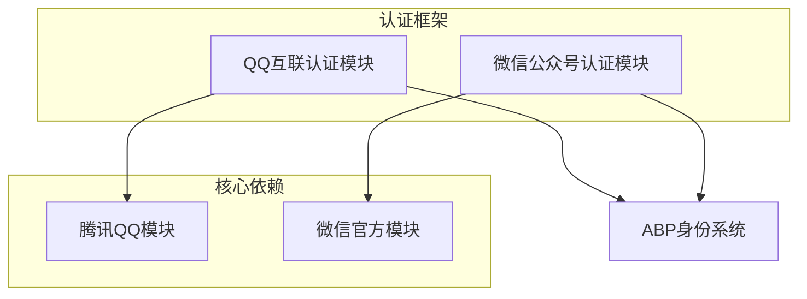
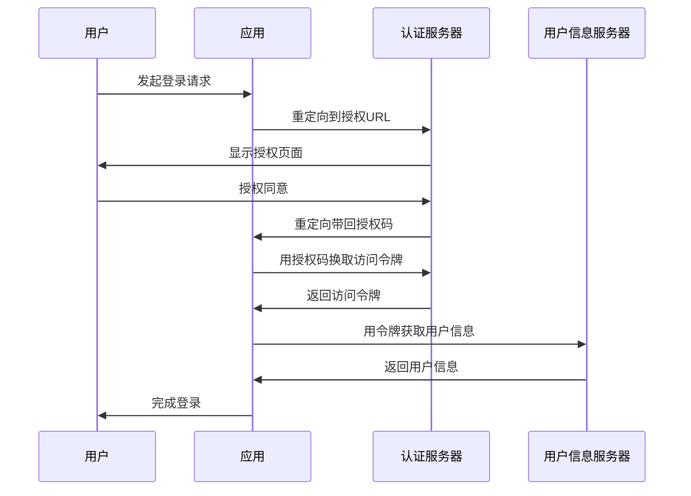
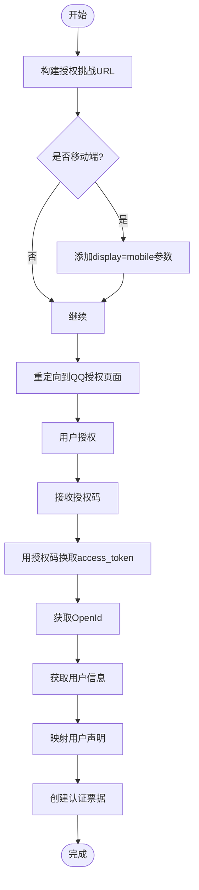
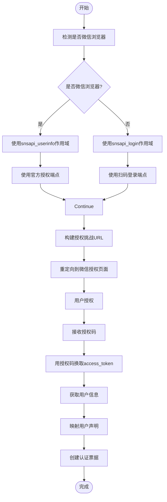
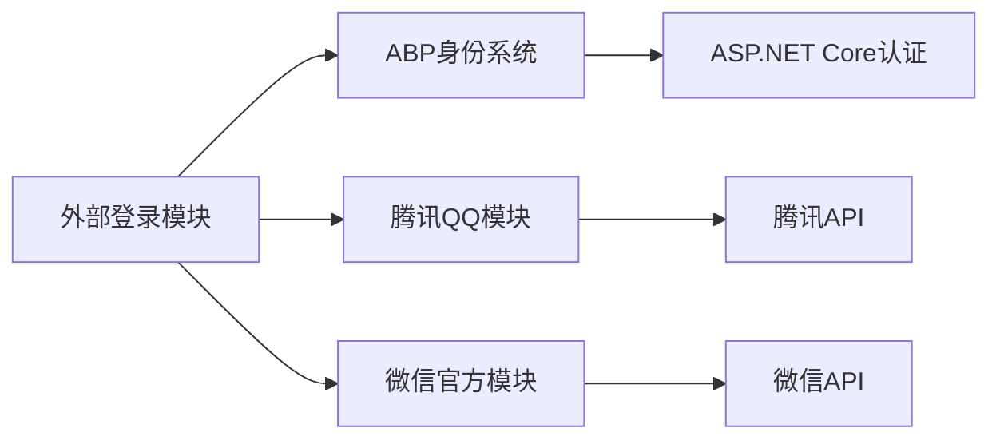

# 外部登录集成

<cite>
**本文档中引用的文件**  
- [AbpAuthenticationQQModule.cs](file://aspnet-core/framework/authentication/LINGYUN.Abp.Authentication.QQ/LINGYUN/Abp/Authentication/QQ/AbpAuthenticationQQModule.cs)
- [AbpAuthenticationWeChatModule.cs](file://aspnet-core/framework/authentication/LINGYUN.Abp.Authentication.WeChat/LINGYUN/Abp/Authentication/WeChat/AbpAuthenticationWeChatModule.cs)
- [QQConnectOAuthHandler.cs](file://aspnet-core/framework/authentication/LINGYUN.Abp.Authentication.QQ/Microsoft/AspNetCore/Authentication/QQ/QQConnectOAuthHandler.cs)
- [WeChatOfficialOAuthHandler.cs](file://aspnet-core/framework/authentication/LINGYUN.Abp.Authentication.WeChat/Microsoft/AspNetCore/Authentication/WeChat/Official/WeChatOfficialOAuthHandler.cs)
- [AbpQQClaimTypes.cs](file://aspnet-core/framework/authentication/LINGYUN.Abp.Authentication.QQ/LINGYUN/Abp/Authentication/QQ/AbpQQClaimTypes.cs)
- [AbpAuthenticationWeChatConsts.cs](file://aspnet-core/framework/authentication/LINGYUN.Abp.Authentication.WeChat/LINGYUN/Abp/Authentication/WeChat/AbpAuthenticationWeChatConsts.cs)
- [README.md](file://aspnet-core/framework/authentication/README.md)
</cite>

## 目录
1. [简介](#简介)
2. [项目结构](#项目结构)
3. [核心组件](#核心组件)
4. [架构概述](#架构概述)
5. [详细组件分析](#详细组件分析)
6. [依赖分析](#依赖分析)
7. [性能考虑](#性能考虑)
8. [故障排除指南](#故障排除指南)
9. [结论](#结论)

## 简介
本文档详细介绍了如何在ABP框架中集成微信和QQ等外部身份提供商进行登录。文档深入解释了OAuth2.0/OpenID Connect协议的集成流程，包括客户端注册、授权码获取和用户信息获取。提供了实际代码示例展示外部登录的配置和实现，说明了如何处理外部登录用户的信息映射和账户关联，并为开发者提供了安全配置建议和常见问题解决方案。

## 项目结构
本项目采用模块化设计，外部登录功能主要集中在`aspnet-core/framework/authentication`目录下，分为QQ和微信两个独立的认证模块。每个模块都实现了标准的OAuth2.0协议，并与ABP的身份系统深度集成。

**图示来源**
- [README.md](file://aspnet-core/framework/authentication/README.md)

**本节来源**
- [README.md](file://aspnet-core/framework/authentication/README.md)

## 核心组件
外部登录系统的核心组件包括QQ互联认证模块和微信公众号认证模块。这两个模块都实现了OAuth2.0协议的标准流程，通过`AddQQConnect()`和`AddWeChat()`扩展方法集成到ASP.NET Core的身份认证系统中。

**本节来源**
- [AbpAuthenticationQQModule.cs](file://aspnet-core/framework/authentication/LINGYUN.Abp.Authentication.QQ/LINGYUN/Abp/Authentication/QQ/AbpAuthenticationQQModule.cs#L1-L17)
- [AbpAuthenticationWeChatModule.cs](file://aspnet-core/framework/authentication/LINGYUN.Abp.Authentication.WeChat/LINGYUN/Abp/Authentication/WeChat/AbpAuthenticationWeChatModule.cs#L1-L17)

## 架构概述
外部登录系统的架构基于OAuth2.0协议，采用标准的三步授权流程：构建授权URL、交换访问令牌和创建用户票据。系统通过模块化设计实现了与ABP框架的无缝集成。

**图示来源**
- [QQConnectOAuthHandler.cs](file://aspnet-core/framework/authentication/LINGYUN.Abp.Authentication.QQ/Microsoft/AspNetCore/Authentication/QQ/QQConnectOAuthHandler.cs#L1-L175)
- [WeChatOfficialOAuthHandler.cs](file://aspnet-core/framework/authentication/LINGYUN.Abp.Authentication.WeChat/Microsoft/AspNetCore/Authentication/WeChat/Official/WeChatOfficialOAuthHandler.cs#L1-L313)

## 详细组件分析

### QQ互联认证分析
QQ互联认证模块实现了完整的OAuth2.0流程，支持获取用户的基本信息，包括昵称、性别和头像。

#### 认证流程

**图示来源**
- [QQConnectOAuthHandler.cs](file://aspnet-core/framework/authentication/LINGYUN.Abp.Authentication.QQ/Microsoft/AspNetCore/Authentication/QQ/QQConnectOAuthHandler.cs#L1-L175)

**本节来源**
- [QQConnectOAuthHandler.cs](file://aspnet-core/framework/authentication/LINGYUN.Abp.Authentication.QQ/Microsoft/AspNetCore/Authentication/QQ/QQConnectOAuthHandler.cs#L1-L175)
- [AbpQQClaimTypes.cs](file://aspnet-core/framework/authentication/LINGYUN.Abp.Authentication.QQ/LINGYUN/Abp/Authentication/QQ/AbpQQClaimTypes.cs#L1-L31)

### 微信公众号认证分析
微信公众号认证模块支持两种登录场景：微信客户端内登录和PC端扫码登录，通过UnionId机制打通公众号与小程序账号体系。

#### 认证流程

**图示来源**
- [WeChatOfficialOAuthHandler.cs](file://aspnet-core/framework/authentication/LINGYUN.Abp.Authentication.WeChat/Microsoft/AspNetCore/Authentication/WeChat/Official/WeChatOfficialOAuthHandler.cs#L1-L313)

**本节来源**
- [WeChatOfficialOAuthHandler.cs](file://aspnet-core/framework/authentication/LINGYUN.Abp.Authentication.WeChat/Microsoft/AspNetCore/Authentication/WeChat/Official/WeChatOfficialOAuthHandler.cs#L1-L313)
- [AbpAuthenticationWeChatConsts.cs](file://aspnet-core/framework/authentication/LINGYUN.Abp.Authentication.WeChat/LINGYUN/Abp/Authentication/WeChat/AbpAuthenticationWeChatConsts.cs#L1-L68)

## 依赖分析
外部登录系统依赖于ABP框架的核心身份认证系统和特定的第三方服务模块。

**图示来源**
- [AbpAuthenticationQQModule.cs](file://aspnet-core/framework/authentication/LINGYUN.Abp.Authentication.QQ/LINGYUN/Abp/Authentication/QQ/AbpAuthenticationQQModule.cs#L1-L17)
- [AbpAuthenticationWeChatModule.cs](file://aspnet-core/framework/authentication/LINGYUN.Abp.Authentication.WeChat/LINGYUN/Abp/Authentication/WeChat/AbpAuthenticationWeChatModule.cs#L1-L17)

**本节来源**
- [AbpAuthenticationQQModule.cs](file://aspnet-core/framework/authentication/LINGYUN.Abp.Authentication.QQ/LINGYUN/Abp/Authentication/QQ/AbpAuthenticationQQModule.cs#L1-L17)
- [AbpAuthenticationWeChatModule.cs](file://aspnet-core/framework/authentication/LINGYUN.Abp.Authentication.WeChat/LINGYUN/Abp/Authentication/WeChat/AbpAuthenticationWeChatModule.cs#L1-L17)

## 性能考虑
外部登录系统的性能主要受网络延迟和第三方API响应时间的影响。建议在生产环境中实施以下优化措施：
- 启用访问令牌缓存以减少API调用次数
- 实现用户信息的本地缓存
- 使用异步操作避免阻塞主线程
- 监控第三方API的响应时间并设置合理的超时

## 故障排除指南
### 常见问题及解决方案

| 问题 | 可能原因 | 解决方案 |
|------|---------|---------|
| 登录失败，返回错误码 | 配置参数错误 | 检查AppId和AppSecret是否正确 |
| 无法获取用户信息 | 作用域权限不足 | 确保配置了正确的scope参数 |
| 回调地址不匹配 | 回调URL配置错误 | 检查CallbackPath配置是否与注册的回调地址一致 |
| 授权页面无法显示 | 网络连接问题 | 检查服务器是否能正常访问第三方认证服务器 |

**本节来源**
- [README.md](file://aspnet-core/framework/authentication/README.md#L1-L100)
- [QQConnectOAuthHandler.cs](file://aspnet-core/framework/authentication/LINGYUN.Abp.Authentication.QQ/Microsoft/AspNetCore/Authentication/QQ/QQConnectOAuthHandler.cs#L1-L175)
- [WeChatOfficialOAuthHandler.cs](file://aspnet-core/framework/authentication/LINGYUN.Abp.Authentication.WeChat/Microsoft/AspNetCore/Authentication/WeChat/Official/WeChatOfficialOAuthHandler.cs#L1-L313)

## 结论
本文档详细介绍了ABP框架中外部登录系统的实现和配置。通过模块化设计，系统能够灵活地集成QQ和微信等外部身份提供商，为用户提供便捷的登录体验。开发者可以根据具体需求配置相应的参数，并利用系统提供的扩展点进行定制化开发。