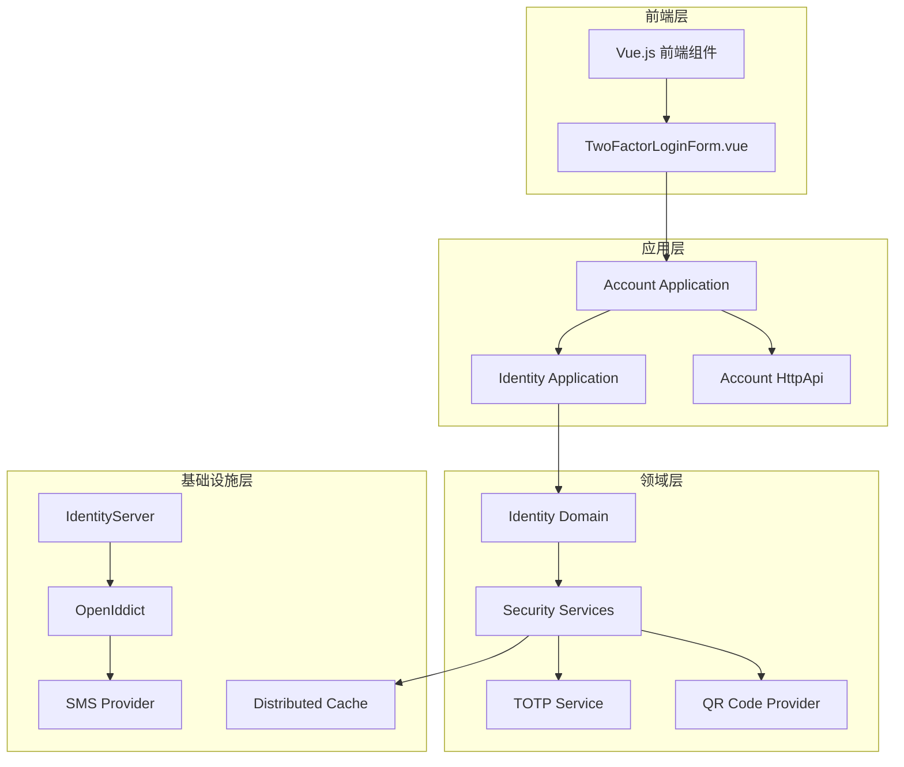
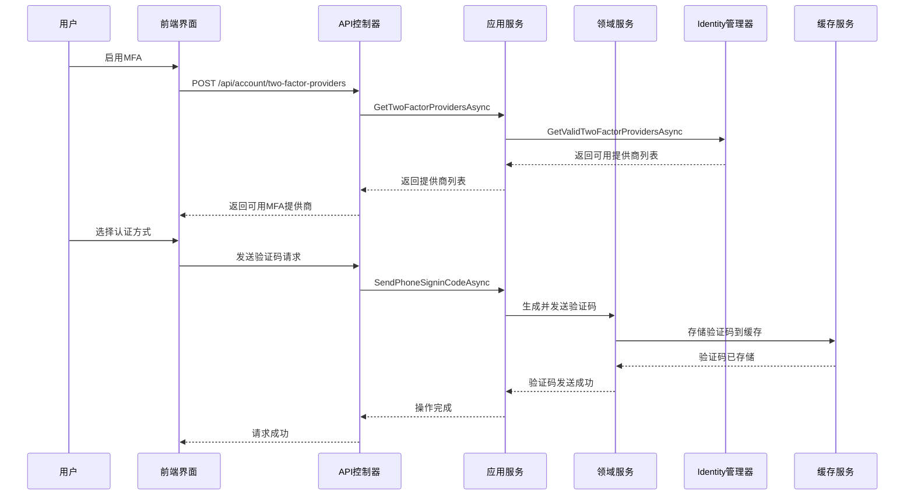
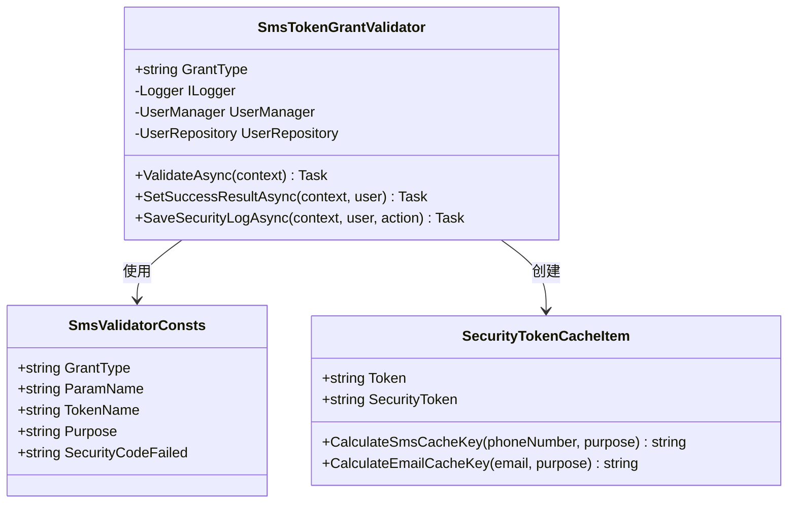
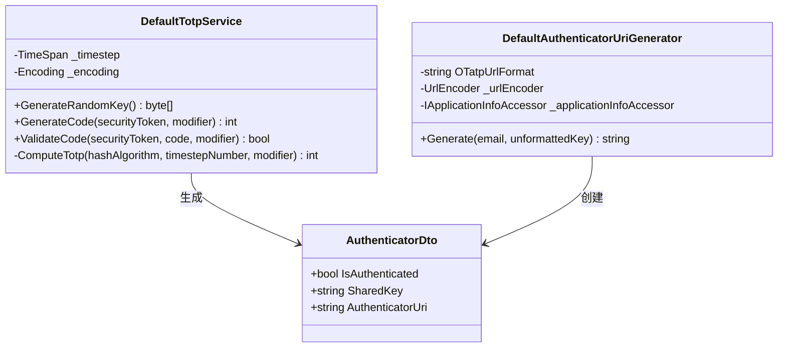
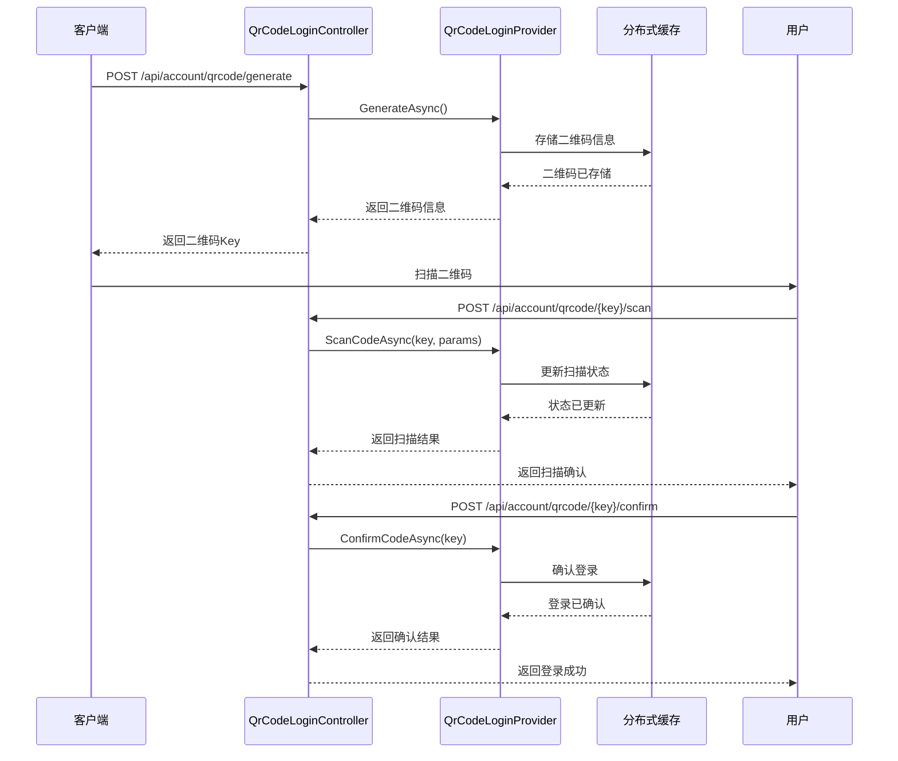
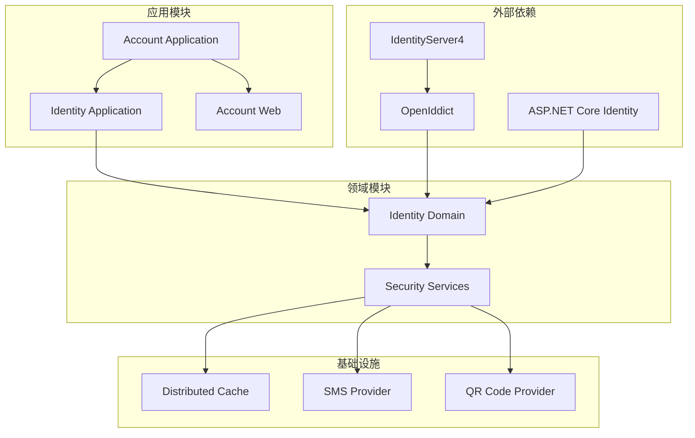

# 多因素认证支持

<cite>
**本文档引用的文件**
- [IdentityUserAppService.cs](file://aspnet-core/modules/identity/LINGYUN.Abp.Identity.Application/LINGYUN/Abp/Identity/IdentityUserAppService.cs)
- [SmsTokenGrantValidator.cs](file://aspnet-core/modules/identityServer/LINGYUN.Abp.IdentityServer.SmsValidator/LINGYUN/Abp/IdentityServer/SmsValidator/SmsTokenGrantValidator.cs)
- [DefaultTotpService.cs](file://aspnet-core/modules/identity/LINGYUN.Abp.Identity.Domain/LINGYUN/Abp/Identity/Security/DefaultTotpService.cs)
- [DefaultAuthenticatorUriGenerator.cs](file://aspnet-core/modules/identity/LINGYUN.Abp.Identity.Domain/LINGYUN/Abp/Identity/Security/DefaultAuthenticatorUriGenerator.cs)
- [ITotpService.cs](file://aspnet-core/modules/identity/LINGYUN.Abp.Identity.Domain/LINGYUN/Abp/Identity/Security/ITotpService.cs)
- [SecurityTokenCacheItem.cs](file://aspnet-core/modules/identity/LINGYUN.Abp.Identity.Domain/LINGYUN/Abp/Identity/SecurityTokenCacheItem.cs)
- [TwoFactorLoginForm.vue](file://apps/vue/src/views/sys/login/TwoFactorLoginForm.vue)
- [QrCodeLoginController.cs](file://aspnet-core/modules/account/LINGYUN.Abp.Account.Web/Areas/Account/Controllers/QrCodeLoginController.cs)
- [IdentityUserManagerExtensions.cs](file://aspnet-core/modules/identity/LINGYUN.Abp.Identity.Domain/Microsoft/AspNetCore/Identity/IdentityUserManagerExtensions.cs)
- [AccountClientProxy.Generated.cs](file://aspnet-core/modules/account/LINGYUN.Abp.Account.HttpApi.Client/ClientProxies/LINGYUN/Abp/Account/AccountClientProxy.Generated.cs)
- [SmsTokenExtensionGrant.cs](file://aspnet-core/modules/openIddict/LINGYUN.Abp.OpenIddict.Sms/LINGYUN/Abp/OpenIddict/Sms/SmsTokenExtensionGrant.cs)
- [PortalTokenExtensionGrant.cs](file://aspnet-core/modules/openIddict/LINGYUN.Abp.OpenIddict.Portal/LINGYUN/Abp/OpenIddict/Portal/PortalTokenExtensionGrant.cs)
</cite>

## 目录
1. [简介](#简介)
2. [项目结构](#项目结构)
3. [核心组件](#核心组件)
4. [架构概览](#架构概览)
5. [详细组件分析](#详细组件分析)
6. [依赖关系分析](#依赖关系分析)
7. [性能考虑](#性能考虑)
8. [故障排除指南](#故障排除指南)
9. [结论](#结论)

## 简介

ABP Next Admin项目提供了完整的多因素认证(MFA)支持，包括基于短信验证码、TOTP(基于时间的一次性密码)和QR码登录等多种认证机制。该系统设计遵循安全最佳实践，提供灵活的配置选项和强大的错误处理机制。

多因素认证通过结合两种或多种不同的认证因素（知识因素、拥有因素、生物特征因素）来增强系统的安全性。本项目实现了以下主要认证方式：
- 基于短信的动态验证码
- 基于TOTP的应用程序认证器
- 基于QR码的设备扫描登录
- 邮件验证码认证

## 项目结构

多因素认证功能分布在多个模块中，形成了清晰的分层架构：



**图表来源**
- [IdentityUserAppService.cs](file://aspnet-core/modules/identity/LINGYUN.Abp.Identity.Application/LINGYUN/Abp/Identity/IdentityUserAppService.cs#L1-L50)
- [TwoFactorLoginForm.vue](file://apps/vue/src/views/sys/login/TwoFactorLoginForm.vue#L1-L50)

## 核心组件

### MFA状态管理

多因素认证的核心是用户级别的状态管理，通过`TwoFactorEnabledDto`类实现：

```csharp
public class TwoFactorEnabledDto
{
    public bool Enabled { get; set; }
}
```

该类负责在用户配置文件中存储和检索MFA启用状态。

### TOTP服务接口

TOTP(Time-based One-Time Password)算法服务通过以下接口定义：

```csharp
public interface ITotpService
{
    int GenerateCode(byte[] securityToken, string modifier = null);
    bool ValidateCode(byte[] securityToken, int code, string modifier = null);
}
```

**章节来源**
- [ITotpService.cs](file://aspnet-core/modules/identity/LINGYUN.Abp.Identity.Domain/LINGYUN/Abp/Identity/Security/ITotpService.cs#L1-L10)
- [TwoFactorEnabledDto.cs](file://aspnet-core/modules/identity/LINGYUN.Abp.Identity.Application.Contracts/LINGYUN/Abp/Identity/Dto/TwoFactorEnabledDto.cs#L1-L5)

## 架构概览

多因素认证系统采用分层架构设计，确保了良好的可维护性和扩展性：



**图表来源**
- [AccountController.cs](file://aspnet-core/modules/account/LINGYUN.Abp.Account.HttpApi/LINGYUN/Abp/Account/AccountController.cs#L49-L76)
- [AccountAppService.cs](file://aspnet-core/modules/account/LINGYUN.Abp.Account.Application/LINGYUN/Abp/Account/AccountAppService.cs#L300-L335)

## 详细组件分析

### SMS验证码认证

SMS验证码认证是最常用的MFA方式之一，通过短信发送一次性验证码：



**图表来源**
- [SmsTokenGrantValidator.cs](file://aspnet-core/modules/identityServer/LINGYUN.Abp.IdentityServer.SmsValidator/LINGYUN/Abp/IdentityServer/SmsValidator/SmsTokenGrantValidator.cs#L25-L50)
- [SecurityTokenCacheItem.cs](file://aspnet-core/modules/identity/LINGYUN.Abp.Identity.Domain/LINGYUN/Abp/Identity/SecurityTokenCacheItem.cs#L1-L48)

#### SMS认证流程

1. **验证凭据类型**：检查请求是否包含正确的授权类型
2. **提取手机号和验证码**：从请求参数中获取手机号和验证码
3. **用户验证**：根据手机号查找用户账户
4. **锁定状态检查**：验证用户是否被锁定
5. **验证码验证**：使用IdentityManager验证验证码
6. **结果处理**：成功时生成访问令牌，失败时记录安全日志

**章节来源**
- [SmsTokenGrantValidator.cs](file://aspnet-core/modules/identityServer/LINGYUN.Abp.IdentityServer.SmsValidator/LINGYUN/Abp/IdentityServer/SmsValidator/SmsTokenGrantValidator.cs#L40-L120)

### TOTP认证器支持

TOTP认证器提供了基于时间的一次性密码功能，支持应用程序认证器：



**图表来源**
- [DefaultTotpService.cs](file://aspnet-core/modules/identity/LINGYUN.Abp.Identity.Domain/LINGYUN/Abp/Identity/Security/DefaultTotpService.cs#L1-L40)
- [DefaultAuthenticatorUriGenerator.cs](file://aspnet-core/modules/identity/LINGYUN.Abp.Identity.Domain/LINGYUN/Abp/Identity/Security/DefaultAuthenticatorUriGenerator.cs#L1-L28)

#### TOTP实现特点

- **时间窗口**：每个验证码的有效时间为3分钟
- **密钥生成**：使用20字节的随机密钥
- **RFC 6238标准**：遵循TOTP算法规范
- **URI格式**：生成符合otpauth://协议的URI

**章节来源**
- [DefaultTotpService.cs](file://aspnet-core/modules/identity/LINGYUN.Abp.Identity.Domain/LINGYUN/Abp/Identity/Security/DefaultTotpService.cs#L15-L40)
- [DefaultAuthenticatorUriGenerator.cs](file://aspnet-core/modules/identity/LINGYUN.Abp.Identity.Domain/LINGYUN/Abp/Identity/Security/DefaultAuthenticatorUriGenerator.cs#L10-L28)

### QR码登录认证

QR码登录提供了便捷的设备间认证方式：



**图表来源**
- [QrCodeLoginController.cs](file://aspnet-core/modules/account/LINGYUN.Abp.Account.Web/Areas/Account/Controllers/QrCodeLoginController.cs#L39-L111)

**章节来源**
- [QrCodeLoginController.cs](file://aspnet-core/modules/account/LINGYUN.Abp.Account.Web/Areas/Account/Controllers/QrCodeLoginController.cs#L25-L111)

### 前端MFA登录组件

前端的TwoFactorLoginForm组件提供了完整的MFA登录界面：

```javascript
// 支持的认证提供商选项
const twoFactorOptions = ref<SelectProps['options']>([]);

// 处理验证码发送
function handleSendCode(field: string, sendCodeApi: (...args) => Promise<void>) {
  return validFormFields([field])
    .then(() => {
      return sendCodeApi({
        [field]: formData[field],
      })
        .then(() => {
          return Promise.resolve(true);
        })
        .catch(() => {
          return Promise.reject(false);
        });
    })
    .catch(() => {
      return Promise.reject(false);
    });
}
```

该组件支持三种认证方式：
- **Email**：通过电子邮件发送验证码
- **Phone**：通过短信发送验证码  
- **Authenticator**：使用应用程序认证器生成的验证码

**章节来源**
- [TwoFactorLoginForm.vue](file://apps/vue/src/views/sys/login/TwoFactorLoginForm.vue#L150-L200)

### MFA状态管理

用户级别的MFA状态管理通过IdentityUserManager扩展方法实现：

```csharp
public static async Task<IdentityResult> SetTwoFactorEnabledWithAccountConfirmedAsync<TUser>(
    [NotNull] this UserManager<TUser> userManager, 
    [NotNull] TUser user, 
    bool enabled)
    where TUser : IdentityUser
{
    if (enabled)
    {
        var hasAuthenticatorEnabled = user.GetProperty(userManager.Options.Tokens.AuthenticatorTokenProvider, false);
        var phoneNumberConfirmed = await userManager.IsPhoneNumberConfirmedAsync(user);
        var emailAddressConfirmed = await userManager.IsEmailConfirmedAsync(user);
        
        // 如果其中一个安全选项未确认,无法启用双因素验证
        if (!hasAuthenticatorEnabled && !phoneNumberConfirmed && !emailAddressConfirmed)
        {
            throw new IdentityException(
                LINGYUN.Abp.Identity.IdentityErrorCodes.ChangeTwoFactorWithMFANotBound,
                details: phoneNumberConfirmed ? "phone number not confirmed" : "email address not confirmed");
        }
    }

    return await userManager.SetTwoFactorEnabledAsync(user, enabled);
}
```

**章节来源**
- [IdentityUserManagerExtensions.cs](file://aspnet-core/modules/identity/LINGYUN.Abp.Identity.Domain/Microsoft/AspNetCore/Identity/IdentityUserManagerExtensions.cs#L15-L41)

## 依赖关系分析

多因素认证系统的依赖关系展现了清晰的分层架构：



**图表来源**
- [IdentityUserAppService.cs](file://aspnet-core/modules/identity/LINGYUN.Abp.Identity.Application/LINGYUN/Abp/Identity/IdentityUserAppService.cs#L1-L30)
- [SmsTokenGrantValidator.cs](file://aspnet-core/modules/identityServer/LINGYUN.Abp.IdentityServer.SmsValidator/LINGYUN/Abp/IdentityServer/SmsValidator/SmsTokenGrantValidator.cs#L1-L30)

**章节来源**
- [IdentityUserAppService.cs](file://aspnet-core/modules/identity/LINGYUN.Abp.Identity.Application/LINGYUN/Abp/Identity/IdentityUserAppService.cs#L1-L172)
- [SmsTokenGrantValidator.cs](file://aspnet-core/modules/identityServer/LINGYUN.Abp.IdentityServer.SmsValidator/LINGYUN/Abp/IdentityServer/SmsValidator/SmsTokenGrantValidator.cs#L1-L183)

## 性能考虑

### 缓存策略

多因素认证系统采用了高效的缓存策略来提升性能：

1. **验证码缓存**：使用分布式缓存存储临时验证码
2. **会话缓存**：缓存用户会话信息以减少数据库查询
3. **令牌缓存**：缓存安全令牌以提高验证速度

### 锁定机制

系统实现了智能的账户锁定机制：

- **失败计数**：记录连续登录失败次数
- **锁定时间**：根据失败次数动态调整锁定时间
- **自动解锁**：锁定时间到期后自动解锁账户

### 并发控制

- **防重放攻击**：每个验证码只能使用一次
- **时间窗口**：验证码具有严格的时间限制
- **并发验证**：支持多个验证码同时验证

## 故障排除指南

### 常见问题及解决方案

#### 1. SMS验证码发送失败

**症状**：用户无法收到短信验证码
**可能原因**：
- SMS服务配置错误
- 手机号码格式不正确
- 账户未确认手机号

**解决方案**：
```csharp
// 检查手机号是否已确认
var phoneNumberConfirmed = await userManager.IsPhoneNumberConfirmedAsync(user);
if (!phoneNumberConfirmed)
{
    throw new UserFriendlyException(L["UserPhoneNumberNotConfirmed"]);
}
```

#### 2. TOTP验证失败

**症状**：TOTP验证码验证总是失败
**可能原因**：
- 系统时间和设备时间不同步
- 密钥生成错误
- 时间窗口计算错误

**解决方案**：
- 确保服务器时间准确
- 检查密钥生成逻辑
- 验证时间窗口设置

#### 3. QR码登录超时

**症状**：QR码扫描后长时间无响应
**可能原因**：
- 缓存服务不可用
- 网络连接问题
- 二维码过期

**解决方案**：
- 检查分布式缓存配置
- 验证网络连接
- 实现二维码刷新机制

**章节来源**
- [SmsTokenGrantValidator.cs](file://aspnet-core/modules/identityServer/LINGYUN.Abp.IdentityServer.SmsValidator/LINGYUN/Abp/IdentityServer/SmsValidator/SmsTokenGrantValidator.cs#L80-L120)
- [DefaultTotpService.cs](file://aspnet-core/modules/identity/LINGYUN.Abp.Identity.Domain/LINGYUN/Abp/Identity/Security/DefaultTotpService.cs#L25-L40)

## 结论

ABP Next Admin项目的多因素认证系统提供了完整、安全且易于使用的MFA解决方案。系统支持多种认证方式，包括SMS验证码、TOTP应用程序认证器和QR码登录，满足了不同场景下的安全需求。

### 主要优势

1. **安全性**：采用行业标准的认证算法和协议
2. **灵活性**：支持多种认证方式和自定义配置
3. **易用性**：提供直观的用户界面和清晰的操作流程
4. **可扩展性**：模块化设计便于添加新的认证方式
5. **高性能**：优化的缓存策略和并发处理能力

### 最佳实践建议

1. **定期更新密钥**：定期更换TOTP密钥以提高安全性
2. **监控异常登录**：实施异常登录检测和告警机制
3. **备份恢复**：提供备用认证方式和账户恢复流程
4. **用户教育**：向用户普及多因素认证的重要性和使用方法
5. **性能监控**：持续监控系统性能和用户体验

通过合理配置和使用这些多因素认证功能，可以显著提升系统的安全性和用户信任度。