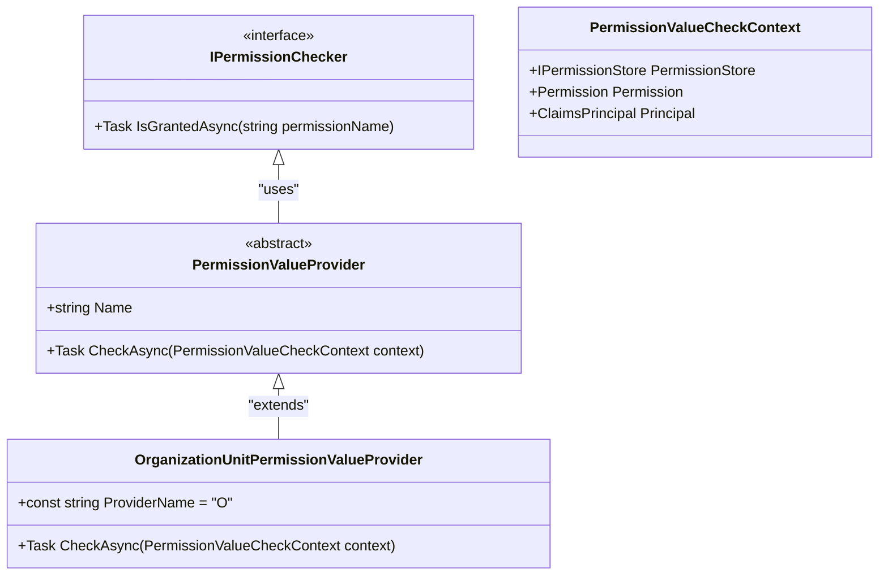
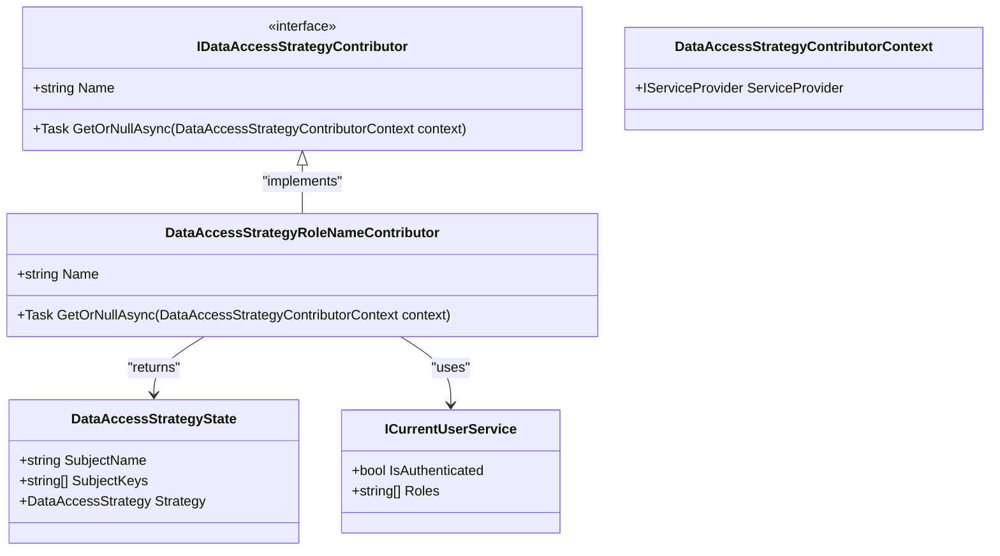
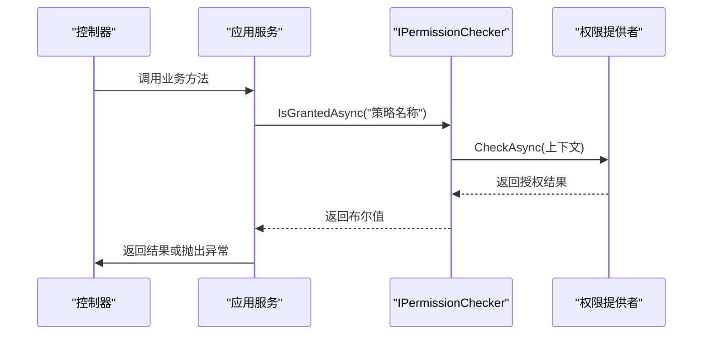

# 基于策略的授权

<cite>
**本文档引用的文件**   
- [OrganizationUnitPermissionValueProvider.cs](file://aspnet-core/framework/authorization/LINGYUN.Abp.Authorization.OrganizationUnits/LINGYUN/Abp/Authorization/Permissions/OrganizationUnitPermissionValueProvider.cs)
- [DataAccessStrategy.cs](file://aspnet-core/framework/data-protection/LINGYUN.Abp.DataProtection.Abstractions/LINGYUN/Abp/DataProtection/DataAccessStrategy.cs)
- [DataAccessStrategyState.cs](file://aspnet-core/framework/data-protection/LINGYUN.Abp.DataProtection.Abstractions/LINGYUN/Abp/DataProtection/DataAccessStrategyState.cs)
- [SubjectStrategyAppService.cs](file://aspnet-core/modules/data-protection/LINGYUN.Abp.DataProtectionManagement.Application/LINGYUN/Abp/DataProtectionManagement/SubjectStrategyAppService.cs)
- [AbpIdentityServerAppServiceBase.cs](file://aspnet-core/modules/identityServer/LINGYUN.Abp.IdentityServer.Application/LINGYUN/Abp/IdentityServer/AbpIdentityServerAppServiceBase.cs)
- [DataAccessStrategyRoleNameContributor.cs](file://aspnet-core/framework/data-protection/LINGYUN.Abp.DataProtection/LINGYUN/Abp/DataProtection/Subjects/DataAccessStrategyRoleNameContributor.cs)
- [DataAccessResourceCacheInvalidator.cs](file://aspnet-core/framework/data-protection/LINGYUN.Abp.DataProtection/LINGYUN/Abp/DataProtection/DataAccessResourceCacheInvalidator.cs)
- [DataAccessStrategyStateCacheItem.cs](file://aspnet-core/framework/data-protection/LINGYUN.Abp.DataProtection/LINGYUN/Abp/DataProtection/Stores/DataAccessStrategyStateCacheItem.cs)
- [OrganizationUnitPermissionManagementProvider.cs](file://aspnet-core/modules/permissions-management/LINGYUN.Abp.PermissionManagement.Domain.OrganizationUnits/LINGYUN/Abp/PermissionManagement/OrganizationUnits/OrganizationUnitPermissionManagementProvider.cs)
</cite>

## 目录
1. [简介](#简介)
2. [策略、需求与处理程序](#策略需求与处理程序)
3. [自定义授权策略实现](#自定义授权策略实现)
4. [IAuthorizationService 策略评估](#iauthorizationservice-策略评估)
5. [策略与身份声明集成](#策略与身份声明集成)
6. [微服务架构下的策略共享](#微服务架构下的策略共享)
7. [设计模式与性能优化](#设计模式与性能优化)
8. [总结](#总结)

## 简介
ABP框架提供了一套强大的基于策略的授权机制，允许开发者根据复杂的业务逻辑定义访问控制规则。该机制超越了简单的角色或权限检查，支持基于资源所有权、时间窗口、IP地址等多种条件的细粒度访问控制。本指南将深入探讨ABP框架中基于策略的授权实现，包括核心组件、自定义策略创建、策略评估以及在微服务环境中的应用。

## 策略、需求与处理程序
在ABP框架中，基于策略的授权由策略（Policy）、需求（Requirement）和处理程序（Handler）三个核心概念构成。策略是授权规则的集合，每个策略可以包含一个或多个需求。需求定义了授权的具体条件，而处理程序则负责评估这些需求是否被满足。

例如，在`OrganizationUnitPermissionValueProvider.cs`中，`OrganizationUnitPermissionValueProvider`类实现了`PermissionValueProvider`，它作为一个处理程序，检查当前用户是否属于某个组织单元，并据此决定权限是否授予。该处理程序通过检查用户声明中的组织单元信息来实现基于组织单元的访问控制。

**图源**
- [OrganizationUnitPermissionValueProvider.cs](file://aspnet-core/framework/authorization/LINGYUN.Abp.Authorization.OrganizationUnits/LINGYUN/Abp/Authorization/Permissions/OrganizationUnitPermissionValueProvider.cs)

**节源**
- [OrganizationUnitPermissionValueProvider.cs](file://aspnet-core/framework/authorization/LINGYUN.Abp.Authorization.OrganizationUnits/LINGYUN/Abp/Authorization/Permissions/OrganizationUnitPermissionValueProvider.cs)

## 自定义授权策略实现
创建自定义授权策略通常涉及定义新的需求和处理程序。在ABP框架中，可以通过实现`IDataAccessStrategyContributor`接口来创建基于数据访问策略的自定义授权逻辑。例如，`DataAccessStrategyRoleNameContributor.cs`中的`DataAccessStrategyRoleNameContributor`类就是一个贡献者，它根据用户的角色来确定数据访问策略。

该类通过检查当前用户的角色，并从存储中获取对应的角色数据权限策略状态，从而决定用户可以访问哪些数据。策略的权重决定了最终生效的策略，确保了在多个角色配置了不同策略时，最严格的策略生效。

**图源**
- [DataAccessStrategyRoleNameContributor.cs](file://aspnet-core/framework/data-protection/LINGYUN.Abp.DataProtection/LINGYUN/Abp/DataProtection/Subjects/DataAccessStrategyRoleNameContributor.cs)
- [DataAccessStrategyState.cs](file://aspnet-core/framework/data-protection/LINGYUN.Abp.DataProtection.Abstractions/LINGYUN/Abp/DataProtection/DataAccessStrategyState.cs)

**节源**
- [DataAccessStrategyRoleNameContributor.cs](file://aspnet-core/framework/data-protection/LINGYUN.Abp.DataProtection/LINGYUN/Abp/DataProtection/Subjects/DataAccessStrategyRoleNameContributor.cs)

## IAuthorizationService 策略评估
在ABP框架中，`IAuthorizationService`用于在控制器和应用服务中评估授权策略。虽然直接的`IAuthorizationService`实现未在搜索结果中找到，但`IPermissionChecker`接口提供了类似的功能。`AbpIdentityServerAppServiceBase.cs`中的`AbpIdentityServerAppServiceBase`类展示了如何使用`IPermissionChecker`来检查策略。

该基类提供了一个`IsGrantAsync`方法，该方法接受一个策略名称作为参数，并调用`IPermissionChecker`的`IsGrantedAsync`方法来评估该策略。这使得应用服务可以轻松地在业务逻辑中执行授权检查。

**图源**
- [AbpIdentityServerAppServiceBase.cs](file://aspnet-core/modules/identityServer/LINGYUN.Abp.IdentityServer.Application/LINGYUN/Abp/IdentityServer/AbpIdentityServerAppServiceBase.cs)

**节源**
- [AbpIdentityServerAppServiceBase.cs](file://aspnet-core/modules/identityServer/LINGYUN.Abp.IdentityServer.Application/LINGYUN/Abp/IdentityServer/AbpIdentityServerAppServiceBase.cs)

## 策略与身份声明集成
基于策略的授权与身份信息（Claims）紧密集成。在ABP框架中，用户的权限和角色信息通常以声明的形式存储在`ClaimsPrincipal`中。授权处理程序通过访问这些声明来评估策略。

例如，`OrganizationUnitPermissionValueProvider`通过`context.Principal?.FindAll(AbpOrganizationUnitClaimTypes.OrganizationUnit)`来获取用户所属的组织单元声明。同样，`DataAccessStrategyRoleNameContributor`通过`ICurrentUser`服务获取用户的角色声明。这种设计使得授权逻辑可以基于用户的身份信息动态地做出决策。

## 微服务架构下的策略共享
在微服务架构中，策略的共享和验证至关重要。ABP框架通过分布式事件和缓存机制来实现这一点。`DataAccessResourceCacheInvalidator.cs`中的`DataAccessResourceCacheInvalidator`类就是一个分布式事件处理器，它监听`DataAccessResourceChangeEvent`事件。

当数据访问资源发生变化时，该处理器会更新缓存中的资源信息，并将相关的