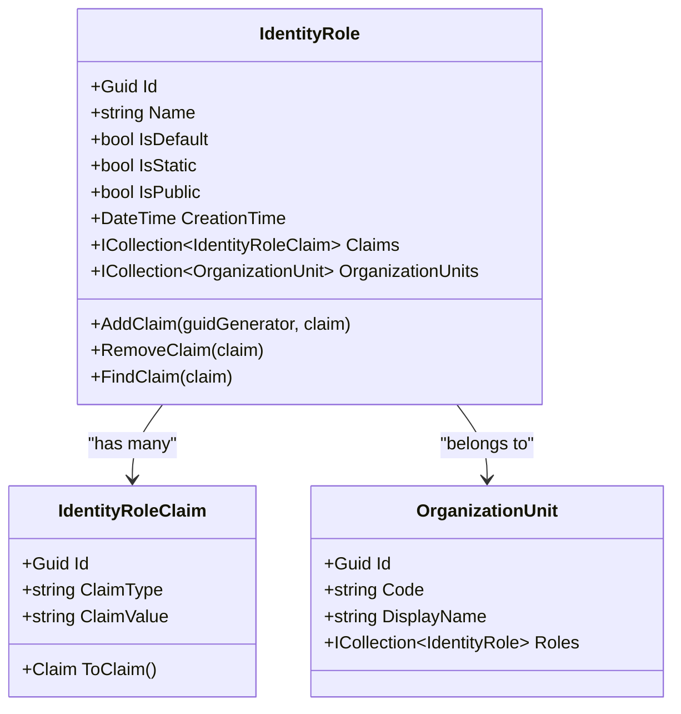
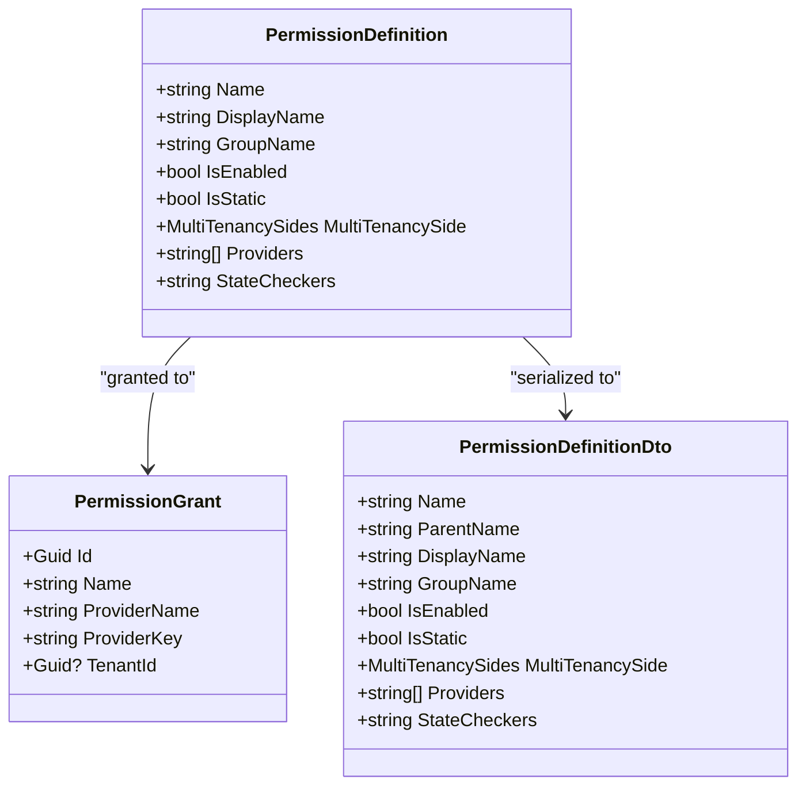
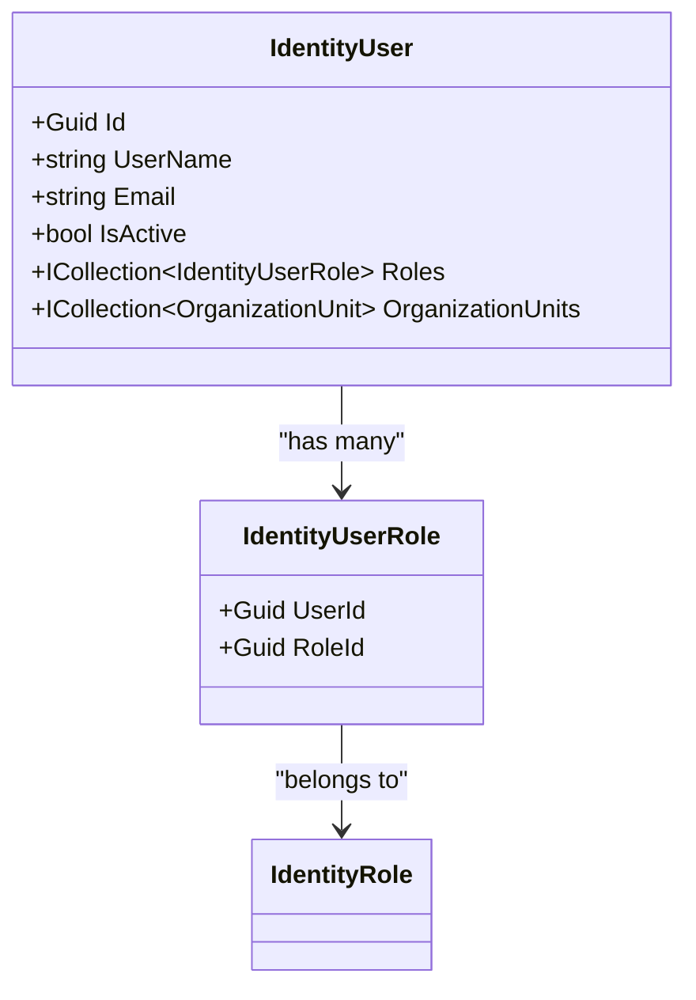
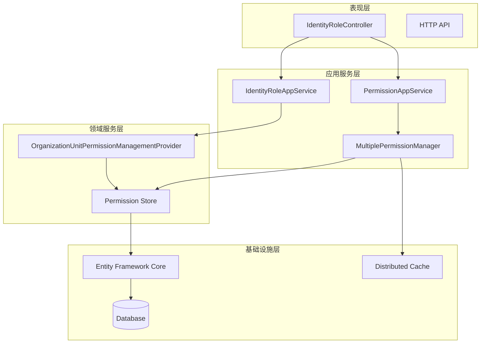
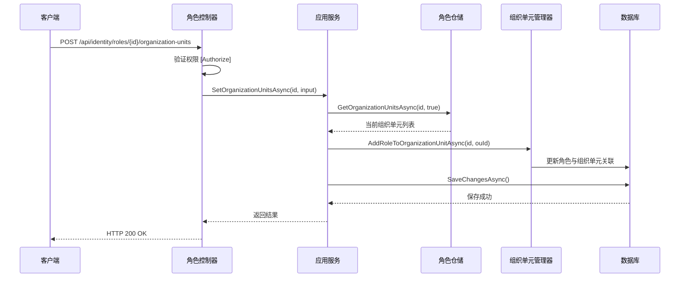
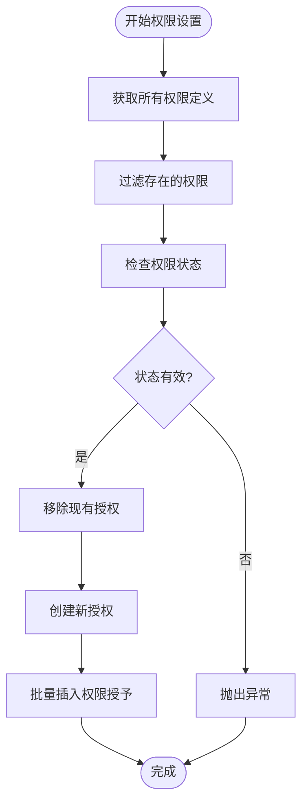
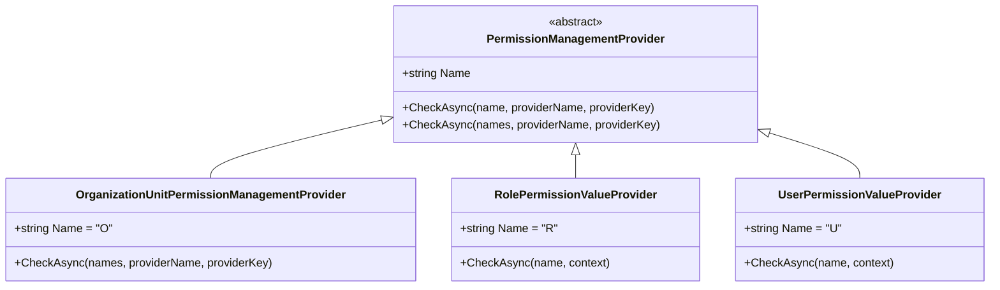
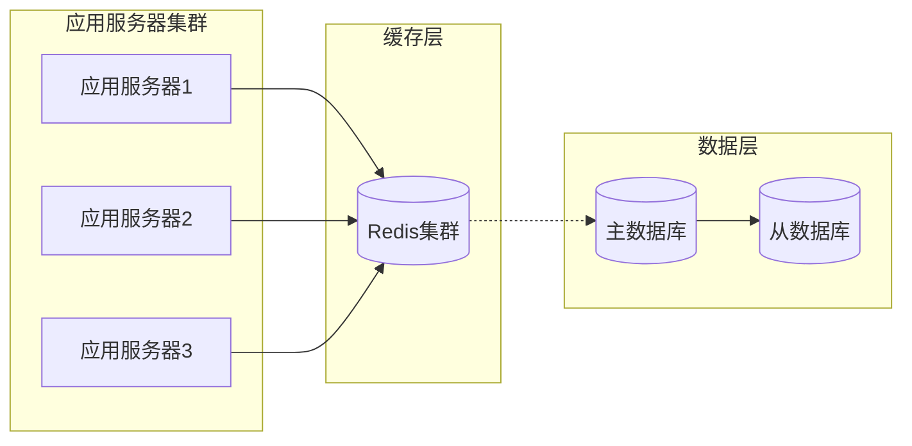
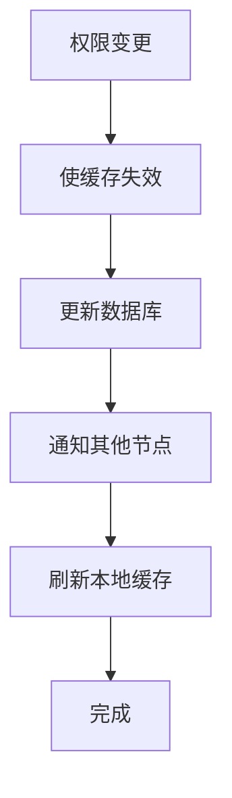
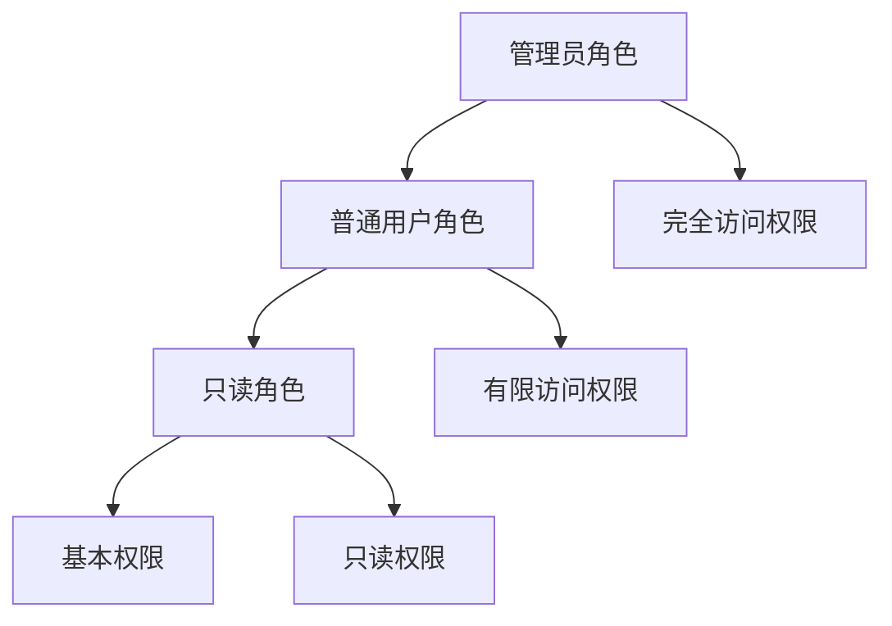

# 基于角色的访问控制（RBAC）

<cite>
**本文档引用的文件**
- [IdentityRoleController.cs](file://aspnet-core/modules/identity/LINGYUN.Abp.Identity.HttpApi/LINGYUN/Abp/Identity/IdentityRoleController.cs)
- [IdentityRoleAppService.cs](file://aspnet-core/modules/identity/LINGYUN.Abp.Identity.Application/LINGYUN/Abp/Identity/IdentityRoleAppService.cs)
- [MultiplePermissionManager.cs](file://aspnet-core/modules/permissions-management/LINGYUN.Abp.PermissionManagement.Application/LINGYUN/Abp/PermissionManagement/MultiplePermissionManager.cs)
- [PermissionAppService.cs](file://aspnet-core/modules/permissions-management/LINGYUN.Abp.PermissionManagement.Application/LINGYUN/Abp/PermissionManagement/PermissionAppService.cs)
- [OrganizationUnitPermissionManagementProvider.cs](file://aspnet-core/modules/permissions-management/LINGYUN.Abp.PermissionManagement.Domain.OrganizationUnits/LINGYUN/Abp/PermissionManagement/OrganizationUnits/OrganizationUnitPermissionManagementProvider.cs)
- [IdentityPermissionDefinitionProvider.cs](file://aspnet-core/modules/identity/LINGYUN.Abp.Identity.Application.Contracts/LINGYUN/Abp/Identity/IdentityPermissionDefinitionProvider.cs)
- [RolePermissionDataSeedContributor.cs](file://aspnet-core/migrations/LY.MicroService.BackendAdmin.EntityFrameworkCore/RolePermissionDataSeedContributor.cs)
- [PermissionDefinitionDto.cs](file://aspnet-core/modules/permissions-management/LINGYUN.Abp.PermissionManagement.Application.Contracts/LINGYUN/Abp/PermissionManagement/Definitions/Dto/PermissionDefinitionDto.cs)
- [PermissionChangeState.cs](file://aspnet-core/modules/permissions-management/LINGYUN.Abp.PermissionManagement.Application/LINGYUN/Abp/PermissionManagement/PermissionChangeState.cs)
</cite>

## 目录
1. [简介](#简介)
2. [RBAC核心概念](#rbac核心概念)
3. [系统架构概览](#系统架构概览)
4. [角色管理组件分析](#角色管理组件分析)
5. [权限管理组件分析](#权限管理组件分析)
6. [权限提供者机制](#权限提供者机制)
7. [数据存储结构](#数据存储结构)
8. [分布式缓存策略](#分布式缓存策略)
9. [实际代码示例](#实际代码示例)
10. [最佳实践指南](#最佳实践指南)
11. [故障排除指南](#故障排除指南)
12. [总结](#总结)

## 简介

ABP框架中的基于角色的访问控制（RBAC）系统是一个高度可扩展且功能完整的权限管理解决方案。该系统通过角色、用户和权限三个核心实体之间的关系模型，提供了细粒度的访问控制能力。本文档将深入解析ABP框架中RBAC系统的实现原理、架构设计和最佳实践。

RBAC系统的核心价值在于：
- **简化权限管理**：通过角色抽象，将复杂的权限分配转化为简单的角色分配
- **提高安全性**：基于最小权限原则，确保用户只能访问其工作所需的资源
- **支持多租户**：在多租户环境中提供灵活的角色和权限管理
- **可扩展性**：支持自定义权限提供者和权限检查逻辑

## RBAC核心概念

### 角色（Role）

角色是权限的集合，代表一组具有相同职责或功能的用户。在ABP框架中，角色通过以下方式管理：



**图表来源**
- [IdentityRoleAppService.cs](file://aspnet-core/modules/identity/LINGYUN.Abp.Identity.Application/LINGYUN/Abp/Identity/IdentityRoleAppService.cs#L1-L50)

### 权限（Permission）

权限定义了系统中可以执行的操作。ABP框架中的权限系统具有以下特点：



**图表来源**
- [PermissionDefinitionDto.cs](file://aspnet-core/modules/permissions-management/LINGYUN.Abp.PermissionManagement.Application.Contracts/LINGYUN/Abp/PermissionManagement/Definitions/Dto/PermissionDefinitionDto.cs#L1-L27)

### 用户（User）

用户是系统中的最终使用者，通过角色关联获得相应的权限。用户与角色的关系通常是多对多的：



**图表来源**
- [IdentityRoleController.cs](file://aspnet-core/modules/identity/LINGYUN.Abp.Identity.HttpApi/LINGYUN/Abp/Identity/IdentityRoleController.cs#L1-L30)

## 系统架构概览

ABP框架的RBAC系统采用分层架构设计，各组件职责明确，相互协作：



**图表来源**
- [IdentityRoleController.cs](file://aspnet-core/modules/identity/LINGYUN.Abp.Identity.HttpApi/LINGYUN/Abp/Identity/IdentityRoleController.cs#L1-L90)
- [MultiplePermissionManager.cs](file://aspnet-core/modules/permissions-management/LINGYUN.Abp.PermissionManagement.Application/LINGYUN/Abp/PermissionManagement/MultiplePermissionManager.cs#L1-L107)

## 角色管理组件分析

### 角色控制器（IdentityRoleController）

角色控制器负责处理所有与角色相关的HTTP请求，提供RESTful API接口：

```csharp
[Authorize(Volo.Abp.Identity.IdentityPermissions.Roles.Default)]
public class IdentityRoleController : AbpControllerBase, IIdentityRoleAppService
{
    protected IIdentityRoleAppService RoleAppService { get; }
    
    [HttpGet]
    [Route("{id}/organization-units")]
    [Authorize(IdentityPermissions.Roles.ManageOrganizationUnits)]
    public async virtual Task<ListResultDto<OrganizationUnitDto>> GetOrganizationUnitsAsync(Guid id)
    {
        return await RoleAppService.GetOrganizationUnitsAsync(id);
    }
}
```

**节来源**
- [IdentityRoleController.cs](file://aspnet-core/modules/identity/LINGYUN.Abp.Identity.HttpApi/LINGYUN/Abp/Identity/IdentityRoleController.cs#L1-L90)

### 角色应用服务（IdentityRoleAppService）

角色应用服务实现了业务逻辑，处理角色的创建、更新、删除和权限管理：

```csharp
[Authorize(Volo.Abp.Identity.IdentityPermissions.Roles.Default)]
public class IdentityRoleAppService : IdentityAppServiceBase, IIdentityRoleAppService
{
    protected IIdentityRoleRepository IdentityRoleRepository { get; }
    protected OrganizationUnitManager OrganizationUnitManager { get; }
    
    [Authorize(IdentityPermissions.Roles.ManageOrganizationUnits)]
    public async virtual Task SetOrganizationUnitsAsync(Guid id, IdentityRoleAddOrRemoveOrganizationUnitDto input)
    {
        var origanizationUnits = await IdentityRoleRepository.GetOrganizationUnitsAsync(id, true);
        
        // 添加新的组织单元
        var notInRoleOuIds = input.OrganizationUnitIds.Where(ouid => !origanizationUnits.Any(ou => ou.Id.Equals(ouid)));
        foreach (var ouId in notInRoleOuIds)
        {
            await OrganizationUnitManager.AddRoleToOrganizationUnitAsync(id, ouId);
        }
        
        // 移除不再关联的组织单元
        var removeRoleOriganzationUnits = origanizationUnits.Where(ou => !input.OrganizationUnitIds.Contains(ou.Id));
        foreach (var origanzationUnit in removeRoleOriganzationUnits)
        {
            origanzationUnit.RemoveRole(id);
        }
        
        await CurrentUnitOfWork.SaveChangesAsync();
    }
}
```

**节来源**
- [IdentityRoleAppService.cs](file://aspnet-core/modules/identity/LINGYUN.Abp.Identity.Application/LINGYUN/Abp/Identity/IdentityRoleAppService.cs#L1-L123)

### 角色权限管理流程



**图表来源**
- [IdentityRoleController.cs](file://aspnet-core/modules/identity/LINGYUN.Abp.Identity.HttpApi/LINGYUN/Abp/Identity/IdentityRoleController.cs#L30-L50)
- [IdentityRoleAppService.cs](file://aspnet-core/modules/identity/LINGYUN.Abp.Identity.Application/LINGYUN/Abp/Identity/IdentityRoleAppService.cs#L30-L60)

## 权限管理组件分析

### 多权限管理器（MultiplePermissionManager）

多权限管理器是RBAC系统的核心组件，负责批量处理权限设置：

```csharp
[Dependency(ReplaceServices = true)]
[ExposeServices(
    typeof(IMultiplePermissionManager),
    typeof(PermissionManager),
    typeof(MultiplePermissionManager))]
public class MultiplePermissionManager : PermissionManager, IMultiplePermissionManager, ISingletonDependency
{
    public async virtual Task SetManyAsync(string providerName, string providerKey, IEnumerable<PermissionChangeState> permissions)
    {
        // 获取所有权限定义
        var permissionDefinitions = await PermissionDefinitionManager.GetPermissionsAsync();
        
        // 过滤存在的权限
        var existsPermissions = permissions
            .Join(permissionDefinitions, p => p.Name, pd => pd.Name, (p, pd) => new { State = p, Definition = pd });
        
        // 检查权限状态
        var existsPermissionDefinitions = existsPermissions.Select(p => p.Definition).ToArray();
        var stateCheckResult = await SimpleStateCheckerManager.IsEnabledAsync(existsPermissionDefinitions);
        var invalidCheckPermissions = stateCheckResult.Where(x => !x.Value).Select(x => x.Key.Name);
        
        // 移除现有授权
        var delPermissionGrants = await PermissionGrantRepository.GetListAsync(providerName, providerKey);
        await PermissionGrantRepository.DeleteManyAsync(delPermissionGrants);
        
        // 重新添加授权
        var newPermissionGrants = existsPermissions
            .Where(p => p.State.IsGranted)
            .Select(p => new PermissionGrant(
                GuidGenerator.Create(),
                p.Definition.Name,
                provider.Name,
                providerKey,
                CurrentTenant.Id));
        await PermissionGrantRepository.InsertManyAsync(newPermissionGrants);
    }
}
```

**节来源**
- [MultiplePermissionManager.cs](file://aspnet-core/modules/permissions-management/LINGYUN.Abp.PermissionManagement.Application/LINGYUN/Abp/PermissionManagement/MultiplePermissionManager.cs#L1-L107)

### 权限应用服务（PermissionAppService）

权限应用服务扩展了基础权限服务，提供批量权限管理功能：

```csharp
[Dependency(ReplaceServices = true)]
[ExposeServices(
    typeof(IPermissionAppService), 
    typeof(VoloPermissionAppService),
    typeof(PermissionAppService))]
public class PermissionAppService : VoloPermissionAppService
{
    public async override Task UpdateAsync(string providerName, string providerKey, UpdatePermissionsDto input)
    {
        if (PermissionManager is IMultiplePermissionManager permissionManager)
        {
            await CheckProviderPolicy(providerName);
            
            await permissionManager.SetManyAsync(
                providerName, 
                providerKey, 
                input.Permissions.Select(p => new PermissionChangeState(p.Name, p.IsGranted)));
        }
        else
        {
            await base.UpdateAsync(providerName, providerKey, input);
        }
    }
}
```

**节来源**
- [PermissionAppService.cs](file://aspnet-core/modules/permissions-management/LINGYUN.Abp.PermissionManagement.Application/LINGYUN/Abp/PermissionManagement/PermissionAppService.cs#L1-L45)

### 权限管理流程



**图表来源**
- [MultiplePermissionManager.cs](file://aspnet-core/modules/permissions-management/LINGYUN.Abp.PermissionManagement.Application/LINGYUN/Abp/PermissionManagement/MultiplePermissionManager.cs#L40-L107)

## 权限提供者机制

### 组织单元权限提供者（OrganizationUnitPermissionManagementProvider）

组织单元权限提供者实现了基于组织单元的权限检查逻辑：

```csharp
public class OrganizationUnitPermissionManagementProvider : PermissionManagementProvider
{
    public override string Name => OrganizationUnitPermissionValueProvider.ProviderName;
    
    public override async Task<MultiplePermissionValueProviderGrantInfo> CheckAsync(string[] names, string providerName, string providerKey)
    {
        var multiplePermissionValueProviderGrantInfo = new MultiplePermissionValueProviderGrantInfo(names);
        var permissionGrants = new List<PermissionGrant>();
        
        // 检查直接授权
        if (providerName == Name)
        {
            permissionGrants.AddRange(await PermissionGrantRepository.GetListAsync(names, providerName, providerKey));
        }
        
        // 检查角色关联的组织单元权限
        if (providerName == RolePermissionValueProvider.ProviderName)
        {
            var role = await IdentityRoleRepository.FindByNormalizedNameAsync(UserManager.NormalizeName(providerKey));
            var organizationUnits = await IdentityRoleRepository.GetOrganizationUnitsAsync(role.Id);
            var roleOrganizationUnits = organizationUnits.Select(x => x.Code.ToString());
            
            var queryable = await PermissionGrantBasicRepository.GetQueryableAsync();
            queryable = queryable.Where(x => x.ProviderName == Name && 
                roleOrganizationUnits.Contains(x.ProviderKey) && names.Contains(x.Name));
            var roleUnitGrants = await AsyncQueryableExecuter.ToListAsync(queryable);
            
            permissionGrants.AddRange(roleUnitGrants);
        }
        
        // 处理权限授予结果...
        return multiplePermissionValueProviderGrantInfo;
    }
}
```

**节来源**
- [OrganizationUnitPermissionManagementProvider.cs](file://aspnet-core/modules/permissions-management/LINGYUN.Abp.PermissionManagement.Domain.OrganizationUnits/LINGYUN/Abp/PermissionManagement/OrganizationUnits/OrganizationUnitPermissionManagementProvider.cs#L1-L108)

### 权限提供者类型

ABP框架支持多种权限提供者类型：



**图表来源**
- [OrganizationUnitPermissionManagementProvider.cs](file://aspnet-core/modules/permissions-management/LINGYUN.Abp.PermissionManagement.Domain.OrganizationUnits/LINGYUN/Abp/PermissionManagement/OrganizationUnits/OrganizationUnitPermissionManagementProvider.cs#L1-L30)

## 数据存储结构

### 数据库表设计

ABP框架的RBAC系统使用以下核心数据库表：

```mermaid
erDiagram
AbpRoles {
Guid Id PK
string Name
bool IsDefault
bool IsStatic
bool IsPublic
datetime CreationTime
Guid? TenantId
}
AbpPermissions {
Guid Id PK
string Name
string ProviderName
string ProviderKey
Guid? TenantId
}
AbpRoleClaims {
Guid Id PK
Guid RoleId FK
string ClaimType
string ClaimValue
}
AbpUserRoles {
Guid UserId FK
Guid RoleId FK
}
AbpOrganizationUnits {
Guid Id PK
string Code
string DisplayName
Guid? ParentId FK
}
AbpOrganizationUnitRoles {
Guid OrganizationUnitId FK
Guid RoleId FK
}
AbpRoles ||--o{ AbpRoleClaims : "has many"
AbpRoles ||--o{ AbpUserRoles : "assigned to"
AbpRoles ||--o{ AbpOrganizationUnitRoles : "belongs to"
AbpOrganizationUnits ||--o{ AbpOrganizationUnitRoles : "contains"
AbpPermissions ||--|| AbpRoles : "granted to"
```

**图表来源**
- [PermissionDefinitionDto.cs](file://aspnet-core/modules/permissions-management/LINGYUN.Abp.PermissionManagement.Application.Contracts/LINGYUN/Abp/PermissionManagement/Definitions/Dto/PermissionDefinitionDto.cs#L1-L27)

### 权限数据初始化

系统启动时会自动初始化角色权限数据：

```csharp
public async virtual Task SeedAsync(DataSeedContext context)
{
    using (CurrentTenant.Change(context.TenantId))
    {
        Logger.LogInformation("Seeding the new tenant admin role permissions...");
        
        var definitionPermissions = await PermissionDefinitionManager.GetPermissionsAsync();
        await PermissionDataSeeder.SeedAsync(
            RolePermissionValueProvider.ProviderName,
            "admin",
            definitionPermissions.Select(x => x.Name),
            context.TenantId);
    }
}
```

**节来源**
- [RolePermissionDataSeedContributor.cs](file://aspnet-core/migrations/LY.MicroService.BackendAdmin.EntityFrameworkCore/RolePermissionDataSeedContributor.cs#L1-L47)

## 分布式缓存策略

### 缓存架构

ABP框架使用分布式缓存来提高权限检查性能：



### 缓存键设计

权限缓存使用以下键格式：
- 格式：`PermissionGrant:{ProviderName}:{ProviderKey}:{PermissionName}`
- 示例：`PermissionGrant:R:admin:view-users`

### 缓存失效策略



## 实际代码示例

### 在应用服务中使用权限验证

```csharp
// 基础权限验证
[Authorize(Volo.Abp.Identity.IdentityPermissions.Roles.Default)]
public class MyApplicationService : ApplicationService
{
    public async Task CreateUserAsync(CreateUserDto input)
    {
        // 需要具有创建用户的权限才能执行此操作
        await _userRepository.InsertAsync(new User
        {
            UserName = input.UserName,
            EmailAddress = input.Email
        });
    }
}

// 特定权限验证
[Authorize(IdentityPermissions.Roles.ManageClaims)]
public async Task AddRoleClaimAsync(Guid roleId, IdentityRoleClaimCreateDto input)
{
    var role = await _roleRepository.GetAsync(roleId);
    var claim = new Claim(input.ClaimType, input.ClaimValue);
    
    if (role.FindClaim(claim) != null)
    {
        throw new UserFriendlyException(L["RoleClaimAlreadyExists"]);
    }
    
    role.AddClaim(GuidGenerator, claim);
    await _roleRepository.UpdateAsync(role);
}
```

### 在控制器中使用权限特性

```csharp
[ApiController]
[Route("api/my-module")]
public class MyModuleController : ControllerBase
{
    [HttpGet]
    [Authorize(MyPermissions.ViewData)]
    public async Task<IActionResult> GetData()
    {
        // 只有具有ViewData权限的用户才能访问
        var data = await _myService.GetDataAsync();
        return Ok(data);
    }
    
    [HttpPost]
    [Authorize(MyPermissions.CreateData)]
    public async Task<IActionResult> CreateData([FromBody] CreateDataDto input)
    {
        // 只有具有CreateData权限的用户才能创建数据
        await _myService.CreateDataAsync(input);
        return Ok();
    }
}
```

### 使用[Authorize]特性的最佳实践

```csharp
// 1. 在类级别应用权限
[Authorize(MyPermissions.ModuleDefault)]
public class MyModuleController : ControllerBase
{
    // 2. 在方法级别细化权限
    [HttpGet]
    [Authorize(MyPermissions.View)]
    public async Task<IActionResult> GetList()
    {
        // ...
    }
    
    [HttpPost]
    [Authorize(MyPermissions.Create)]
    public async Task<IActionResult> Create()
    {
        // ...
    }
    
    // 3. 使用组合权限
    [HttpPut]
    [Authorize($"{MyPermissions.ModuleDefault},{MyPermissions.Edit}")]
    public async Task<IActionResult> Update()
    {
        // ...
    }
}
```

## 最佳实践指南

### 角色粒度控制

1. **遵循最小权限原则**：每个角色只赋予必要的权限
2. **避免过度细分**：保持角色数量适中，避免管理复杂度
3. **使用角色继承**：通过角色层次结构减少重复权限

```csharp
// 推荐：清晰的角色命名和权限分配
public class IdentityPermissionDefinitionProvider : PermissionDefinitionProvider
{
    public override void Define(IPermissionDefinitionContext context)
    {
        var identityGroup = context.GetGroupOrNull(Volo.Abp.Identity.IdentityPermissions.GroupName);
        
        // 管理员角色 - 拥有所有权限
        var adminRole = identityGroup.AddPermission("Identity.Admin", L("Permission:Administrator"));
        
        // 普通用户角色 - 基本权限
        var userRole = identityGroup.AddPermission("Identity.User", L("Permission:User"));
        
        // 只读角色 - 查看权限
        var viewerRole = identityGroup.AddPermission("Identity.Viewer", L("Permission:Viewer"));
        
        // 设置权限层次关系
        viewerRole.AddChild(IdentityPermissions.Users.Default);
        userRole.AddChild(viewerRole);
        adminRole.AddChild(userRole);
    }
}
```

### 权限继承机制



### 多租户环境下的角色管理

```csharp
// 多租户权限配置
public class MultiTenancyPermissionDefinitionProvider : PermissionDefinitionProvider
{
    public override void Define(IPermissionDefinitionContext context)
    {
        var tenantPermission = context.AddPermission(
            "Tenant.Management", 
            L("Permission:TenantManagement"),
            MultiTenancySides.Host); // 主机级别权限
        
        var userPermission = context.AddPermission(
            "User.Management", 
            L("Permission:UserManagement"),
            MultiTenancySides.Tenant); // 租户级别权限
    }
}
```

### 性能优化建议

1. **合理使用缓存**：对频繁访问的权限数据进行缓存
2. **批量权限检查**：使用MultiplePermissionValueProviderGrantInfo进行批量检查
3. **索引优化**：在权限表上建立适当的索引

```csharp
// 性能优化的权限检查
public async Task<MultiplePermissionGrantResult> CheckPermissionsAsync(string[] permissionNames, string providerName, string providerKey)
{
    var context = new PermissionValuesCheckContext(permissionNames, providerName, providerKey);
    
    // 使用批量检查提高性能
    var result = await PermissionStore.CheckAsync(context);
    
    return result;
}
```

## 故障排除指南

### 常见问题及解决方案

#### 1. 权限不生效

**症状**：用户应该有某个权限，但系统拒绝访问

**排查步骤**：
```csharp
// 1. 检查权限是否正确授予
var granted = await PermissionChecker.IsGrantedAsync(userId, permissionName);

// 2. 检查权限提供者
var providers = await PermissionStore.GetGrantedProvidersAsync(permissionName, providerName, providerKey);

// 3. 检查权限状态
var definition = await PermissionDefinitionManager.GetPermissionOrNullAsync(permissionName);
var isEnabled = definition?.IsEnabled ?? false;
```

**解决方案**：
- 确认权限已正确授予给用户或角色
- 检查权限提供者的配置
- 验证权限的状态是否启用

#### 2. 角色分配失败

**症状**：无法将用户分配到角色或组织单元

**排查步骤**：
```csharp
// 1. 检查角色是否存在
var role = await RoleRepository.FindAsync(roleId);
if (role == null)
{
    throw new UserFriendlyException("角色不存在");
}

// 2. 检查用户是否存在
var user = await UserRepository.FindAsync(userId);
if (user == null)
{
    throw new UserFriendlyException("用户不存在");
}

// 3. 检查组织单元权限
var hasPermission = await AuthorizationService.IsGrantedAsync(
    IdentityPermissions.OrganizationUnits.ManageUsers);
```

**解决方案**：
- 确认角色和用户都存在
- 检查用户是否有管理组织单元的权限
- 验证数据库连接和事务配置

#### 3. 缓存一致性问题

**症状**：权限更改后仍然使用旧的权限信息

**排查步骤**：
```csharp
// 1. 检查缓存键
var cacheKey = $"PermissionGrant:{providerName}:{providerKey}:{permissionName}";
var cachedValue = await DistributedCache.GetStringAsync(cacheKey);

// 2. 检查缓存过期时间
var options = new DistributedCacheEntryOptions
{
    AbsoluteExpirationRelativeToNow = TimeSpan.FromMinutes(30)
};
```

**解决方案**：
- 清除相关缓存项
- 调整缓存过期时间
- 实现缓存失效通知机制

### 调试技巧

#### 启用权限调试日志

```csharp
// 在appsettings.json中配置
{
  "Logging": {
    "LogLevel": {
      "Default": "Information",
      "Volo.Abp.Authorization": "Debug",
      "LINGYUN.Abp.PermissionManagement": "Debug"
    }
  }
}
```

#### 权限检查跟踪

```csharp
public class TrackedPermissionChecker : IPermissionChecker
{
    private readonly IPermissionChecker _inner;
    
    public async Task<bool> IsGrantedAsync(string providerName, string providerKey, string permissionName)
    {
        Logger.LogDebug("Checking permission {PermissionName} for {ProviderName}:{ProviderKey}", 
            permissionName, providerName, providerKey);
        
        var result = await _inner.IsGrantedAsync(providerName, providerKey, permissionName);
        
        Logger.LogDebug("Permission check result: {PermissionName} -> {Result}", 
            permissionName, result);
        
        return result;
    }
}
```

## 总结

ABP框架的RBAC系统是一个功能完整、设计精良的权限管理解决方案。通过本文档的深入分析，我们了解了：

1. **核心概念**：角色、权限和用户的三层关系模型
2. **架构设计**：分层架构确保了系统的可维护性和可扩展性
3. **实现细节**：从控制器到数据库的完整权限管理流程
4. **最佳实践**：角色设计、权限继承和多租户支持的最佳实践
5. **故障排除**：常见问题的诊断和解决方法

RBAC系统的关键优势包括：
- **灵活性**：支持多种权限提供者和检查机制
- **性能**：通过分布式缓存和批量操作优化性能
- **安全性**：严格的权限验证和审计机制
- **可扩展性**：模块化设计便于功能扩展

对于开发者而言，理解这些概念和实现细节有助于：
- 设计合理的角色和权限模型
- 正确使用权限验证特性
- 解决权限相关的技术问题
- 优化系统性能和安全性

通过遵循本文档提供的最佳实践和故障排除指南，可以构建出安全、高效且易于维护的权限管理系统。