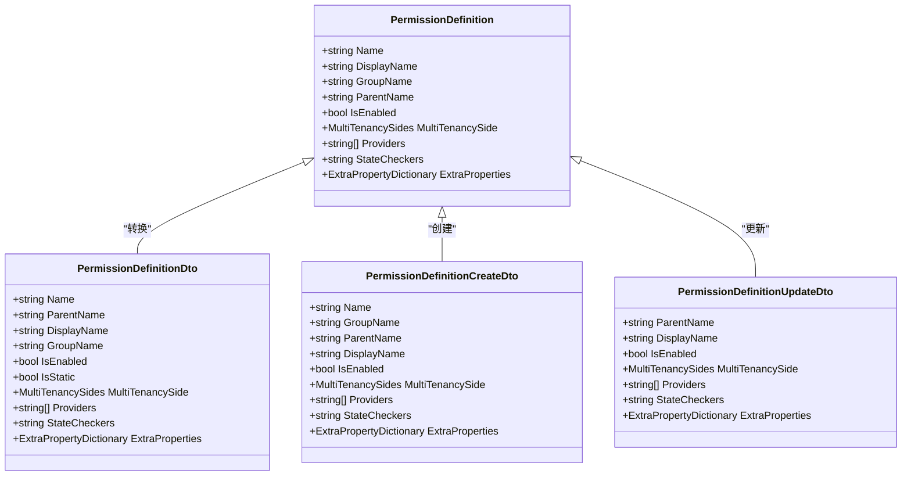
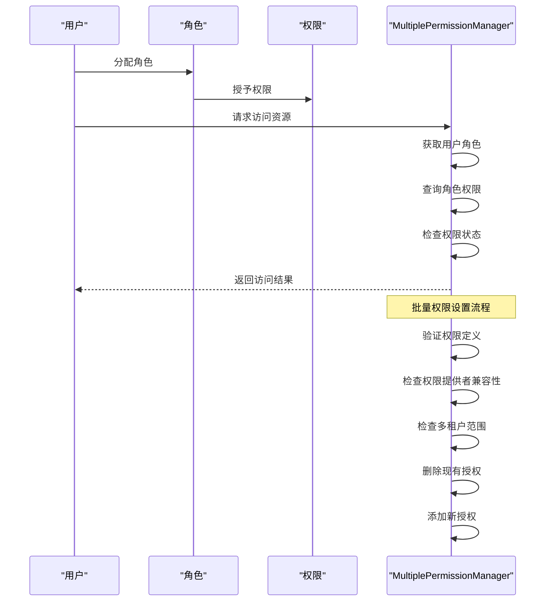
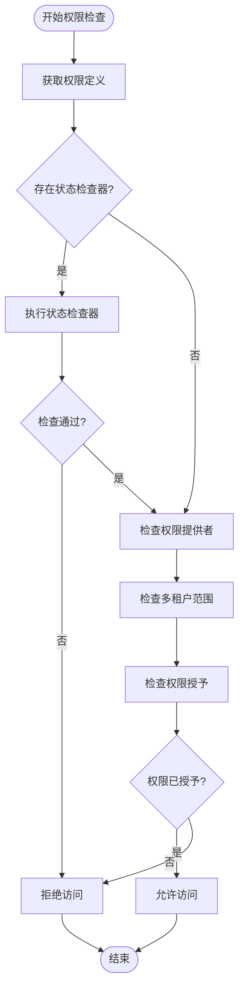
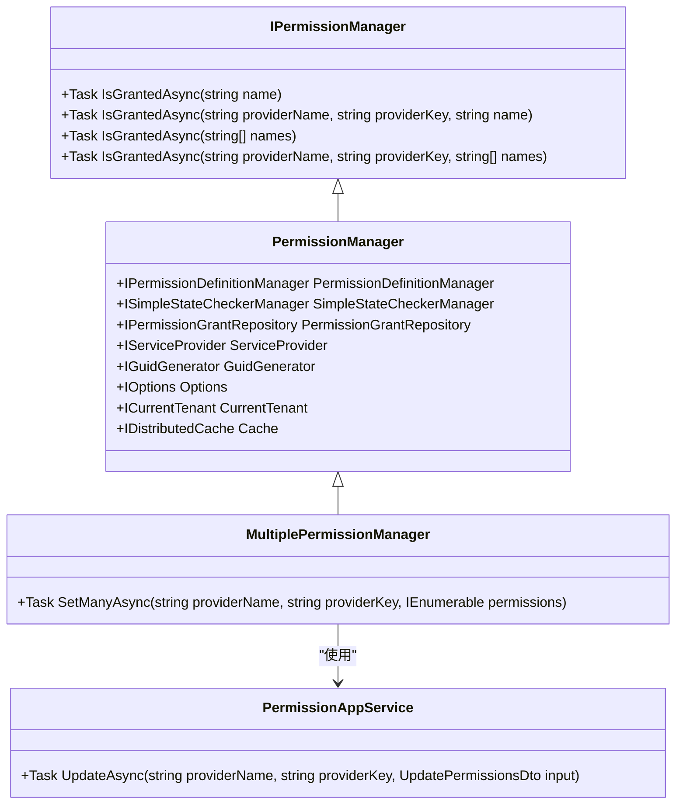

# 权限控制模型

<cite>
**本文档中引用的文件**  
- [MultiplePermissionManager.cs](file://aspnet-core/modules/permissions-management/LINGYUN.Abp.PermissionManagement.Application/LINGYUN/Abp/PermissionManagement/MultiplePermissionManager.cs)
- [PermissionAppService.cs](file://aspnet-core/modules/permissions-management/LINGYUN.Abp.PermissionManagement.Application/LINGYUN/Abp/PermissionManagement/PermissionAppService.cs)
- [PermissionDefinitionAppService.cs](file://aspnet-core/modules/permissions-management/LINGYUN.Abp.PermissionManagement.Application/LINGYUN/Abp/PermissionManagement/Definitions/PermissionDefinitionAppService.cs)
- [PermissionManagementControllerBase.cs](file://aspnet-core/modules/permissions-management/LINGYUN.Abp.PermissionManagement.HttpApi/LINGYUN/Abp/PermissionManagement/HttpApi/PermissionManagementControllerBase.cs)
- [PermissionManagementAppServiceBase.cs](file://aspnet-core/modules/permissions-management/LINGYUN.Abp.PermissionManagement.Application/LINGYUN/Abp/PermissionManagement/PermissionManagementAppServiceBase.cs)
- [AbpPermissionManagementHttpApiModule.cs](file://aspnet-core/modules/permissions-management/LINGYUN.Abp.PermissionManagement.HttpApi/LINGYUN/Abp/PermissionManagement/HttpApi/AbpPermissionManagementHttpApiModule.cs)
- [PermissionManagementPermissionNames.cs](file://aspnet-core/modules/permissions-management/LINGYUN.Abp.PermissionManagement.Application.Contracts/LINGYUN/Abp/PermissionManagement/Permissions/PermissionManagementPermissionNames.cs)
- [PermissionChangeState.cs](file://aspnet-core/modules/permissions-management/LINGYUN.Abp.PermissionManagement.Application/LINGYUN/Abp/PermissionManagement/PermissionChangeState.cs)
- [RolePermissionDataSeedContributor.cs](file://aspnet-core/migrations/LY.MicroService.BackendAdmin.EntityFrameworkCore/RolePermissionDataSeedContributor.cs)
- [OrganizationUnitPermissionManagementProvider.cs](file://aspnet-core/modules/permissions-management/LINGYUN.Abp.PermissionManagement.Domain.OrganizationUnits/LINGYUN/Abp/PermissionManagement/OrganizationUnits/OrganizationUnitPermissionManagementProvider.cs)
</cite>

## 目录
1. [简介](#简介)
2. [权限定义与管理](#权限定义与管理)
3. [基于角色的访问控制(RBAC)](#基于角色的访问控制rbac)
4. [基于策略的授权机制](#基于策略的授权机制)
5. [权限检查实现方式](#权限检查实现方式)
6. [权限数据存储结构](#权限数据存储结构)
7. [缓存策略](#缓存策略)
8. [开发者使用示例](#开发者使用示例)
9. [最佳实践与性能优化](#最佳实践与性能优化)

## 简介
本文档全面解释基于ABP框架的权限控制模型，涵盖角色基础访问控制(RBAC)和基于策略的授权机制。详细描述了权限的定义、分配和检查实现方式，为开发者提供权限设计的最佳实践和性能优化建议。

**本节不分析具体源文件，因此不提供来源信息**

## 权限定义与管理

权限定义是权限控制模型的基础，系统通过权限定义来声明应用中的各种操作权限。在ABP框架中，权限定义通过`PermissionDefinition`类来表示，每个权限都有唯一的名称、显示名称、所属分组等属性。

权限管理提供了对权限定义的增删改查功能，通过`PermissionDefinitionAppService`服务实现。该服务支持创建、更新、删除和查询权限定义，同时提供了权限分组管理功能。

权限定义支持静态和动态两种类型，静态权限在代码中定义，动态权限可以在运行时创建和修改。权限还支持多租户场景，可以指定权限的多租户范围。

**图示来源**  
- [PermissionDefinitionAppService.cs](file://aspnet-core/modules/permissions-management/LINGYUN.Abp.PermissionManagement.Application/LINGYUN/Abp/PermissionManagement/Definitions/PermissionDefinitionAppService.cs#L268-L302)
- [PermissionDefinitionDto.cs](file://aspnet-core/modules/permissions-management/LINGYUN.Abp.PermissionManagement.Application.Contracts/LINGYUN/Abp/PermissionManagement/Definitions/Dto/PermissionDefinitionDto.cs#L0-L27)

**本节来源**  
- [PermissionDefinitionAppService.cs](file://aspnet-core/modules/permissions-management/LINGYUN.Abp.PermissionManagement.Application/LINGYUN/Abp/PermissionManagement/Definitions/PermissionDefinitionAppService.cs#L0-L323)
- [PermissionManagementPermissionNames.cs](file://aspnet-core/modules/permissions-management/LINGYUN.Abp.PermissionManagement.Application.Contracts/LINGYUN/Abp/PermissionManagement/Permissions/PermissionManagementPermissionNames.cs#L0-L23)

## 基于角色的访问控制(RBAC)

基于角色的访问控制(RBAC)是系统权限管理的核心机制。在ABP框架中，RBAC通过角色与权限的关联来实现。每个角色可以被授予一组权限，用户通过被分配角色来获得相应的权限。

系统提供了`MultiplePermissionManager`类来管理角色权限，该类继承自ABP框架的`PermissionManager`，并扩展了批量设置权限的功能。通过`SetManyAsync`方法，可以一次性为角色设置多个权限。

权限检查时，系统会根据用户的角色来确定其拥有的权限。权限提供者(Provider)机制支持多种权限来源，包括角色、用户、组织单元等。对于角色权限，使用`RolePermissionValueProvider`作为权限提供者。

**图示来源**  
- [MultiplePermissionManager.cs](file://aspnet-core/modules/permissions-management/LINGYUN.Abp.PermissionManagement.Application/LINGYUN/Abp/PermissionManagement/MultiplePermissionManager.cs#L35-L107)
- [OrganizationUnitPermissionManagementProvider.cs](file://aspnet-core/modules/permissions-management/LINGYUN.Abp.PermissionManagement.Domain.OrganizationUnits/LINGYUN/Abp/PermissionManagement/OrganizationUnits/OrganizationUnitPermissionManagementProvider.cs#L29-L106)

**本节来源**  
- [MultiplePermissionManager.cs](file://aspnet-core/modules/permissions-management/LINGYUN.Abp.PermissionManagement.Application/LINGYUN/Abp/PermissionManagement/MultiplePermissionManager.cs#L0-L108)
- [OrganizationUnitPermissionManagementProvider.cs](file://aspnet-core/modules/permissions-management/LINGYUN.Abp.PermissionManagement.Domain.OrganizationUnits/LINGYUN/Abp/PermissionManagement/OrganizationUnits/OrganizationUnitPermissionManagementProvider.cs#L0-L106)

## 基于策略的授权机制

基于策略的授权机制提供了更灵活的权限控制方式。除了基于角色的简单权限分配外，系统还支持基于条件的策略授权。策略可以基于用户属性、时间、地理位置等多种因素来决定是否授予访问权限。

在ABP框架中，策略授权通过`SimpleStateChecker`机制实现。权限定义可以关联一个或多个状态检查器，这些检查器在权限检查时被调用，根据特定条件决定权限是否生效。

系统支持自定义状态检查器，开发者可以实现`ISimpleStateChecker<T>`接口来创建自己的检查逻辑。例如，可以创建一个基于用户部门的检查器，只有特定部门的用户才能访问某些资源。

**图示来源**  
- [MultiplePermissionManager.cs](file://aspnet-core/modules/permissions-management/LINGYUN.Abp.PermissionManagement.Application/LINGYUN/Abp/PermissionManagement/MultiplePermissionManager.cs#L35-L89)
- [PermissionDefinitionAppService.cs](file://aspnet-core/modules/permissions-management/LINGYUN.Abp.PermissionManagement.Application/LINGYUN/Abp/PermissionManagement/Definitions/PermissionDefinitionAppService.cs#L130-L150)

**本节来源**  
- [MultiplePermissionManager.cs](file://aspnet-core/modules/permissions-management/LINGYUN.Abp.PermissionManagement.Application/LINGYUN/Abp/PermissionManagement/MultiplePermissionManager.cs#L35-L89)
- [PermissionDefinitionAppService.cs](file://aspnet-core/modules/permissions-management/LINGYUN.Abp.PermissionManagement.Application/LINGYUN/Abp/PermissionManagement/Definitions/PermissionDefinitionAppService.cs#L130-L150)

## 权限检查实现方式

权限检查是权限控制模型的核心功能，系统在多个层次实现了权限检查机制。权限检查可以在应用服务、控制器和域服务等多个层面进行。

在应用服务层，通过`IPermissionManager`接口提供的`IsGrantedAsync`方法进行权限检查。该方法接受用户标识和权限名称作为参数，返回权限是否被授予的结果。

在控制器层，使用`[Authorize]`特性进行声明式权限检查。开发者可以在控制器或操作方法上添加该特性，指定需要的权限名称，框架会在请求处理前自动进行权限验证。

在域服务层，可以通过依赖注入获取权限管理器，进行更细粒度的权限控制。这对于复杂的业务逻辑非常有用，可以在业务处理过程中根据不同的条件进行权限检查。

**图示来源**  
- [MultiplePermissionManager.cs](file://aspnet-core/modules/permissions-management/LINGYUN.Abp.PermissionManagement.Application/LINGYUN/Abp/PermissionManagement/MultiplePermissionManager.cs#L0-L108)
- [PermissionAppService.cs](file://aspnet-core/modules/permissions-management/LINGYUN.Abp.PermissionManagement.Application/LINGYUN/Abp/PermissionManagement/PermissionAppService.cs#L0-L43)

**本节来源**  
- [MultiplePermissionManager.cs](file://aspnet-core/modules/permissions-management/LINGYUN.Abp.PermissionManagement.Application/LINGYUN/Abp/PermissionManagement/MultiplePermissionManager.cs#L0-L108)
- [PermissionAppService.cs](file://aspnet-core/modules/permissions-management/LINGYUN.Abp.PermissionManagement.Application/LINGYUN/Abp/PermissionManagement/PermissionAppService.cs#L0-L43)

## 权限数据存储结构

权限数据的存储结构设计考虑了性能和可扩展性。系统使用关系型数据库存储权限定义和权限授予信息，主要包含以下数据表：

- `PermissionDefinitions`：存储权限定义信息，包括权限名称、显示名称、分组、状态等
- `PermissionGrants`：存储权限授予信息，记录哪些主体(用户、角色等)被授予了哪些权限
- `PermissionDefinitionRecords`：存储动态权限定义的持久化数据

权限授予表采用提供者(Provider)模式，支持多种权限来源。表结构包含提供者名称(providerName)和提供者键(providerKey)字段，用于标识权限授予的主体。例如，角色权限的提供者名称为"R"，提供者键为角色名称；用户权限的提供者名称为"U"，提供者键为用户ID。

对于组织单元权限，系统还实现了特殊的权限继承机制。用户或角色在组织单元