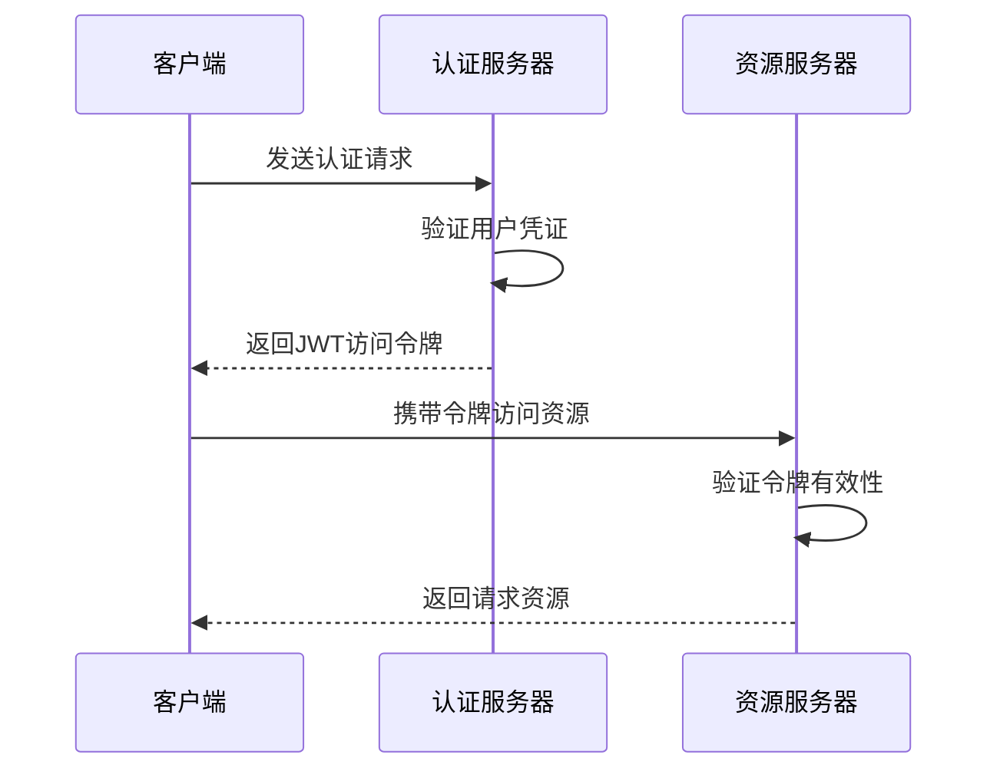
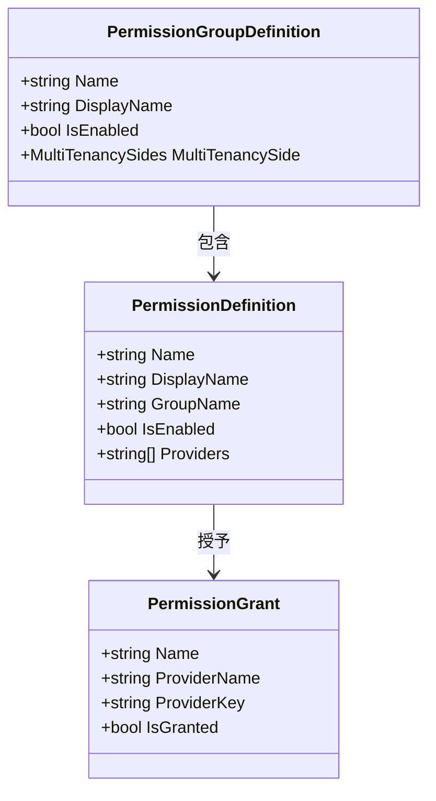
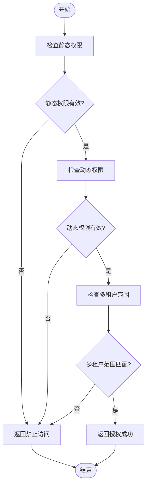
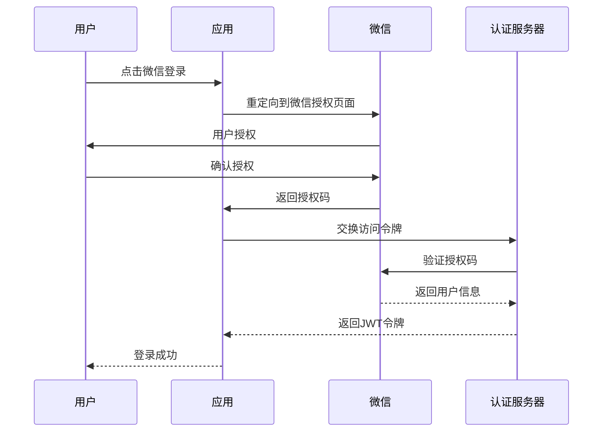

# 认证与授权

<cite>
**本文档引用的文件**  
- [AbpAuthenticationWeChatModule.cs](file://aspnet-core\framework\authentication\LINGYUN.Abp.Authentication.WeChat\LINGYUN\Abp\Authentication\WeChat\AbpAuthenticationWeChatModule.cs)
- [AbpAuthenticationQQModule.cs](file://aspnet-core\framework\authentication\LINGYUN.Abp.Authentication.QQ\LINGYUN\Abp\Authentication\QQ\AbpAuthenticationQQModule.cs)
- [AuthServerModule.Configure.cs](file://aspnet-core\services\LY.MicroService.AuthServer\AuthServerModule.Configure.cs)
- [appsettings.json](file://aspnet-core\services\LY.MicroService.AuthServer\appsettings.json)
- [appsettings.Development.json](file://aspnet-core\services\LY.MicroService.AuthServer\appsettings.Development.json)
- [AbpOpenIddictPermissionDefinitionProvider.cs](file://aspnet-core\modules\openIddict\LINGYUN.Abp.OpenIddict.Application.Contracts\LINGYUN\Abp\OpenIddict\Permissions\AbpOpenIddictPermissionDefinitionProvider.cs)
- [PermissionManagementPermissionDefinitionProvider.cs](file://aspnet-core\modules\permissions-management\LINGYUN.Abp.PermissionManagement.Application.Contracts\LINGYUN\Abp\PermissionManagement\Permissions\PermissionManagementPermissionDefinitionProvider.cs)
- [IdentityPermissionDefinitionProvider.cs](file://aspnet-core\modules\identity\LINGYUN.Abp.Identity.Application.Contracts\LINGYUN\Abp\Identity\IdentityPermissionDefinitionProvider.cs)
- [MultiplePermissionManager.cs](file://aspnet-core\modules\permissions-management\LINGYUN.Abp.PermissionManagement.Application\LINGYUN\Abp\PermissionManagement\MultiplePermissionManager.cs)
- [IdentitySessionManager.cs](file://aspnet-core\modules\identity\LINGYUN.Abp.Identity.Domain\LINGYUN\Abp\Identity\Session\IdentitySessionManager.cs)
- [IdentitySessionStore.cs](file://aspnet-core\modules\identity\LINGYUN.Abp.Identity.Domain\LINGYUN\Abp\Identity\Session\IdentitySessionStore.cs)
- [AbpOpenIddictWeChatModule.cs](file://aspnet-core\modules\openIddict\LINGYUN.Abp.OpenIddict.WeChat\LINGYUN\Abp\OpenIddict\WeChat\AbpOpenIddictWeChatModule.cs)
- [AbpOpenIddictSmsModule.cs](file://aspnet-core\modules\openIddict\LINGYUN.Abp.OpenIddict.Sms\LINGYUN\Abp\OpenIddict\Sms\AbpOpenIddictSmsModule.cs)
- [AbpOpenIddictQrCodeModule.cs](file://aspnet-core\modules\openIddict\LINGYUN.Abp.OpenIddict.QrCode\LINGYUN\Abp\OpenIddict\QrCode\AbpOpenIddictQrCodeModule.cs)
</cite>

## 目录
1. [简介](#简介)
2. [认证机制](#认证机制)
3. [授权机制](#授权机制)
4. [权限控制模型](#权限控制模型)
5. [外部登录集成](#外部登录集成)
6. [安全配置最佳实践](#安全配置最佳实践)
7. [总结](#总结)

## 简介

本项目基于ABP框架构建了完整的认证与授权体系，采用OpenIddict作为身份验证服务器，实现了现代化的认证流程。系统支持多种认证方式，包括JWT令牌、OAuth2.0/OpenID Connect协议，并集成了多因素认证功能。权限控制系统采用角色基础访问控制（RBAC）和基于策略的授权相结合的方式，提供了灵活的权限管理能力。本文档将详细介绍系统的认证与授权机制，为开发者提供全面的技术指导。

## 认证机制

### JWT令牌生成与验证

系统采用OpenIddict作为身份验证服务器，实现了完整的JWT令牌生成与验证流程。在`AuthServerModule.Configure.cs`文件中，通过配置`OpenIddictServerOptions`来设置各种令牌的生命周期：



**图示来源**
- [AuthServerModule.Configure.cs](file://aspnet-core\services\LY.MicroService.AuthServer\AuthServerModule.Configure.cs#L364-L418)

**本节来源**
- [AuthServerModule.Configure.cs](file://aspnet-core\services\LY.MicroService.AuthServer\AuthServerModule.Configure.cs#L364-L418)
- [appsettings.json](file://aspnet-core\services\LY.MicroService.AuthServer\appsettings.json)
- [appsettings.Development.json](file://aspnet-core\services\LY.MicroService.AuthServer\appsettings.Development.json)

### OAuth2.0/OpenID Connect集成

系统通过OpenIddict实现了完整的OAuth2.0和OpenID Connect协议支持。在开发环境配置文件中，定义了多个客户端应用：

```json
"OpenIddict": {
  "Applications": {
    "VueAdmin": {
      "ClientId": "vue-admin-client",
      "ClientSecret": "1q2w3e*",
      "RootUrl": "http://127.0.0.1:5666/"
    },
    "InternalService": {
      "ClientId": "InternalServiceClient",
      "ClientSecret": "1q2w3e*"
    }
  }
}
```

这些客户端支持多种授权类型，包括授权码模式、隐式模式、密码模式、刷新令牌模式等，满足不同应用场景的需求。

## 授权机制

### 角色基础访问控制（RBAC）

系统实现了基于角色的访问控制模型，通过`PermissionManagementPermissionDefinitionProvider`类定义了权限组和权限项：



**图示来源**
- [PermissionManagementPermissionDefinitionProvider.cs](file://aspnet-core\modules\permissions-management\LINGYUN.Abp.PermissionManagement.Application.Contracts\LINGYUN\Abp\PermissionManagement\Permissions\PermissionManagementPermissionDefinitionProvider.cs)
- [MultiplePermissionManager.cs](file://aspnet-core\modules\permissions-management\LINGYUN.Abp.PermissionManagement.Application\LINGYUN\Abp\PermissionManagement\MultiplePermissionManager.cs)

### 基于策略的授权

系统支持基于策略的授权机制，允许开发者定义复杂的授权规则。通过`MultiplePermissionManager`类实现了批量权限设置功能：

```csharp
public async virtual Task SetManyAsync(string providerName, string providerKey, IEnumerable<PermissionChangeState> permissions)
{
    // 验证权限状态
    var stateCheckResult = await SimpleStateCheckerManager.IsEnabledAsync(existsPermissionDefinitions);
    var invalidCheckPermissions = stateCheckResult.Where(x => !x.Value).Select(x => x.Key.Name);
    if (invalidCheckPermissions.Any())
    {
        throw new ApplicationException($"The permission named '{invalidCheckPermissions.JoinAsString(";")}' is disabled!");
    }
    
    // 检查权限提供者范围
    var invalidProviderPermissions = existsPermissions.Where(x => x.Definition.Providers.Any() && !x.Definition.Providers.Contains(providerName)).Select(x => x.Definition.Name);
    if (invalidProviderPermissions.Any())
    {
        throw new ApplicationException($"The permission named '{invalidProviderPermissions.JoinAsString(";")}' has not compatible with the provider named '{providerName}'");
    }
}
```

**本节来源**
- [MultiplePermissionManager.cs](file://aspnet-core\modules\permissions-management\LINGYUN.Abp.PermissionManagement.Application\LINGYUN\Abp\PermissionManagement\MultiplePermissionManager.cs)
- [PermissionManagementPermissionDefinitionProvider.cs](file://aspnet-core\modules\permissions-management\LINGYUN.Abp.PermissionManagement.Application.Contracts\LINGYUN\Abp\PermissionManagement\Permissions\PermissionManagementPermissionDefinitionProvider.cs)

## 权限控制模型

### 权限定义与管理

系统提供了完善的权限定义和管理功能，支持静态和动态权限配置。权限定义包括以下属性：

| 属性 | 描述 | 示例值 |
|------|------|--------|
| Name | 权限名称 | User.Create |
| DisplayName | 显示名称 | 创建用户 |
| GroupName | 所属权限组 | User |
| IsEnabled | 是否启用 | true |
| MultiTenancySide | 多租户支持 | Both |
| Providers | 支持的提供者 | Role,User |

权限管理服务提供了创建、更新、删除权限的API接口，支持权限的父子层级关系。

### 权限检查流程

权限检查流程如下：



**本节来源**
- [MultiplePermissionManager.cs](file://aspnet-core\modules\permissions-management\LINGYUN.Abp.PermissionManagement.Application\LINGYUN\Abp\PermissionManagement\MultiplePermissionManager.cs)
- [PermissionAppService.cs](file://aspnet-core\modules\permissions-management\LINGYUN.Abp.PermissionManagement.Application\LINGYUN\Abp\PermissionManagement\PermissionAppService.cs)

## 外部登录集成

### IdentityServer与OpenIddict集成

系统采用OpenIddict作为身份验证服务器，替代了传统的IdentityServer。在模块配置中，通过以下代码启用OpenIddict：

```csharp
private void ConfigureAuthServer(IConfiguration configuration)
{
    Configure<OpenIddictServerAspNetCoreBuilder>(builder =>
    {
        builder.DisableTransportSecurityRequirement();
    });

    Configure<OpenIddictServerOptions>(options =>
    {
        var lifetime = configuration.GetSection("OpenIddict:Lifetime");
        options.AuthorizationCodeLifetime = lifetime.GetValue("AuthorizationCode", options.AuthorizationCodeLifetime);
        options.AccessTokenLifetime = lifetime.GetValue("AccessToken", options.AccessTokenLifetime);
        options.RefreshTokenLifetime = lifetime.GetValue("RefreshToken", options.RefreshTokenLifetime);
    });
}
```

### 微信、QQ等外部登录提供商

系统集成了微信和QQ等外部登录提供商，通过专门的认证模块实现：



**图示来源**
- [AbpAuthenticationWeChatModule.cs](file://aspnet-core\framework\authentication\LINGYUN.Abp.Authentication.WeChat\LINGYUN\Abp\Authentication\WeChat\AbpAuthenticationWeChatModule.cs)
- [AbpAuthenticationQQModule.cs](file://aspnet-core\framework\authentication\LINGYUN.Abp.Authentication.QQ\LINGYUN\Abp\Authentication\QQ\AbpAuthenticationQQModule.cs)

**本节来源**
- [AbpAuthenticationWeChatModule.cs](file://aspnet-core\framework\authentication\LINGYUN.Abp.Authentication.WeChat\LINGYUN\Abp\Authentication\WeChat\AbpAuthenticationWeChatModule.cs)
- [AbpAuthenticationQQModule.cs](file://aspnet-core\framework\authentication\LINGYUN.Abp.Authentication.QQ\LINGYUN\Abp\Authentication\QQ\AbpAuthenticationQQModule.cs)
- [AbpOpenIddictWeChatModule.cs](file://aspnet-core\modules\openIddict\LINGYUN.Abp.OpenIddict.WeChat\LINGYUN\Abp\OpenIddict\WeChat\AbpOpenIddictWeChatModule.cs)

## 安全配置最佳实践

### 令牌有效期设置

在`appsettings.Development.json`文件中，配置了各种令牌的有效期：

```json
"OpenIddict": {
  "Lifetime": {
    "AuthorizationCode": "00:05:00",
    "AccessToken": "1.00:00:00",
    "RefreshToken": "15.00:00:00",
    "IdentityToken": "1.00:00:00"
  }
}
```

建议的安全配置：
- 授权码有效期：5-10分钟
- 访问令牌有效期：1小时
- 刷新令牌有效期：15天
- 身份令牌有效期：1小时

### 刷新令牌策略

系统实现了刷新令牌的重用宽限期（Reuse Leeway），防止令牌被重复使用：

```csharp
options.Refresh