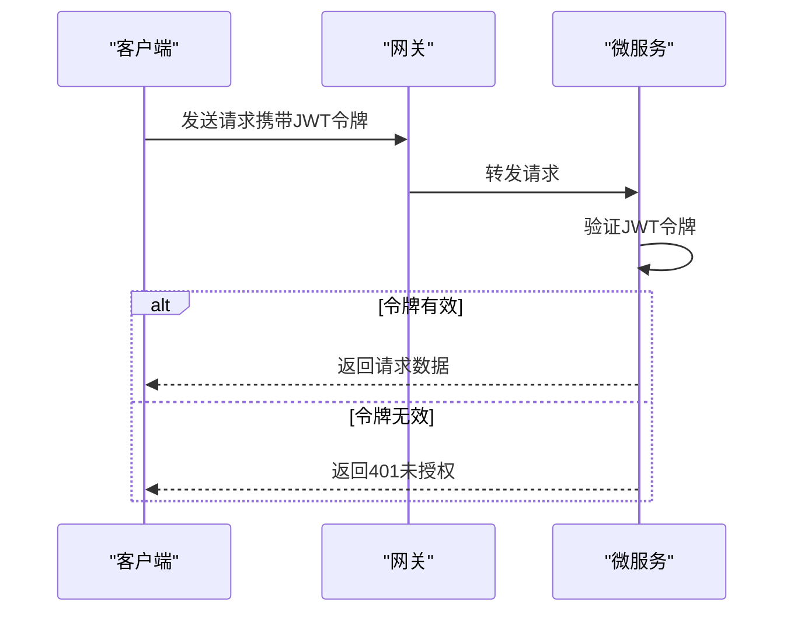
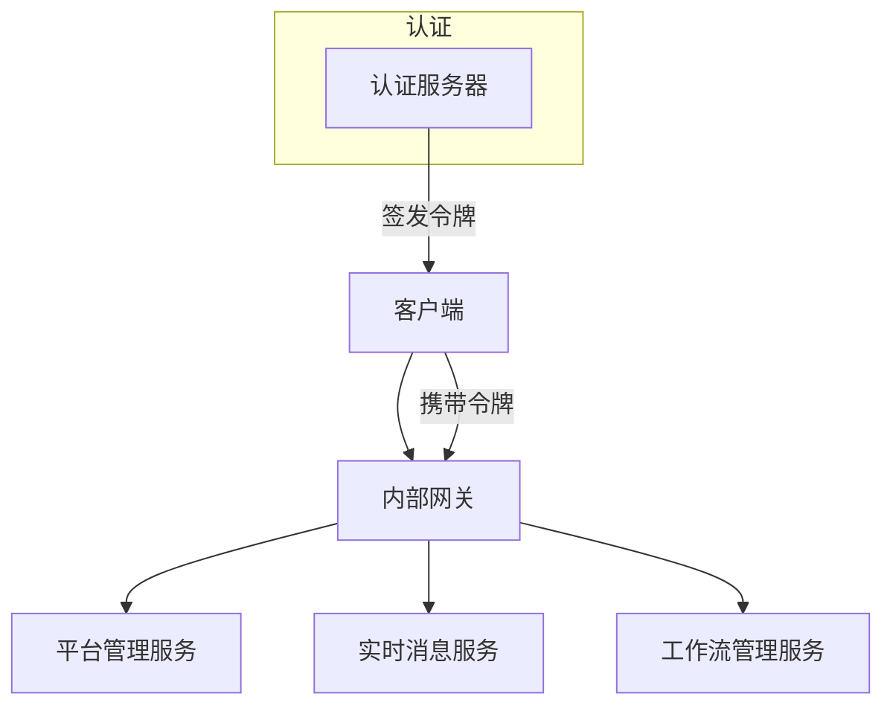

# JWT令牌管理

<cite>
**本文档引用的文件**  
- [AuthServerModule.Configure.cs](file://aspnet-core/services/LY.MicroService.AuthServer/AuthServerModule.Configure.cs)
- [PlatformManagementHttpApiHostModule.Configure.cs](file://aspnet-core/services/LY.MicroService.PlatformManagement.HttpApi.Host/PlatformManagementHttpApiHostModule.Configure.cs)
- [RealtimeMessageHttpApiHostModule.Configure.cs](file://aspnet-core/services/LY.MicroService.RealtimeMessage.HttpApi.Host/RealtimeMessageHttpApiHostModule.Configure.cs)
- [WorkflowManagementHttpApiHostModule.Configure.cs](file://aspnet-core/services/LY.MicroService.WorkflowManagement.HttpApi.Host/WorkflowManagementHttpApiHostModule.Configure.cs)
- [WebhooksManagementHttpApiHostModule.Configure.cs](file://aspnet-core/services/LY.MicroService.WebhooksManagement.HttpApi.Host/WebhooksManagementHttpApiHostModule.Configure.cs)
- [WechatManagementHttpApiHostModule.Configure.cs](file://aspnet-core/services/LY.MicroService.WechatManagement.HttpApi.Host/WechatManagementHttpApiHostModule.Configure.cs)
- [BackendAdminHttpApiHostModule.Configure.cs](file://aspnet-core/services/LY.MicroService.BackendAdmin.HttpApi.Host\BackendAdminHttpApiHostModule.Configure.cs)
- [InternalApiGatewayModule.Configure.cs](file://gateways/internal/LINGYUN.MicroService.Internal.ApiGateway/src/LINGYUN.MicroService.Internal.ApiGateway/InternalApiGatewayModule.Configure.cs)
- [appsettings.json](file://aspnet-core/services/LY.MicroService.AuthServer/appsettings.json)
- [OpenIddictApplicationExtensions.cs](file://aspnet-core/modules/openIddict/LINGYUN.Abp.OpenIddict.Application/LINGYUN/Abp/OpenIddict/Applications/OpenIddictApplicationExtensions.cs)
</cite>

## 目录
1. [简介](#简介)
2. [JWT令牌结构与声明](#jwt令牌结构与声明)
3. [ABP框架中的JWT认证配置](#abp框架中的jwt认证配置)
4. [令牌有效期与刷新机制](#令牌有效期与刷新机制)
5. [加密算法与密钥管理](#加密算法与密钥管理)
6. [微服务架构中的集成](#微服务架构中的集成)
7. [性能优化建议](#性能优化建议)
8. [安全问题与解决方案](#安全问题与解决方案)

## 简介
本文档详细阐述了在ABP框架中JWT令牌的管理机制，包括令牌的生成、签名、验证和解析流程。文档深入分析了如何配置JWT认证中间件、自定义令牌有效期、加密算法和密钥管理，并提供了在微服务架构中集成JWT的实践指导。同时，文档还包含了性能优化建议和常见安全问题的解决方案。

## JWT令牌结构与声明
JWT（JSON Web Token）是一种开放标准（RFC 7519），用于在各方之间安全地传输信息作为JSON对象。在本项目中，JWT令牌由三部分组成：头部（Header）、载荷（Payload）和签名（Signature）。载荷部分包含用户身份信息和其他声明（claims），如iss（签发者）、exp（过期时间）、sub（主题）等。这些声明用于在客户端和服务器之间传递用户信息和权限数据。

**Section sources**
- [AuthServerModule.Configure.cs](file://aspnet-core/services/LY.MicroService.AuthServer/AuthServerModule.Configure.cs#L391-L418)

## ABP框架中的JWT认证配置
在ABP框架中，JWT认证通过`AddAbpJwtBearer`方法进行配置。该方法在多个服务模块中被调用，如`AuthServerModule`、`PlatformManagementHttpApiHostModule`等。配置过程中，从`appsettings.json`文件中读取`AuthServer`节的配置，并绑定到JWT选项。此外，还配置了有效的签发者（ValidIssuers）和受众（ValidAudiences），以确保令牌的安全性。

**Diagram sources**
- [AuthServerModule.Configure.cs](file://aspnet-core/services/LY.MicroService.AuthServer/AuthServerModule.Configure.cs#L391-L418)
- [PlatformManagementHttpApiHostModule.Configure.cs](file://aspnet-core/services/LY.MicroService.PlatformManagement.HttpApi.Host/PlatformManagementHttpApiHostModule.Configure.cs#L419-L446)

## 令牌有效期与刷新机制
令牌的有效期通过配置文件中的`TokenLifetime`设置进行管理。在`OpenIddictApplicationExtensions.cs`文件中，可以看到对各种令牌类型（如访问令牌、刷新令牌、身份令牌等）的生命周期进行了配置。刷新机制允许用户在访问令牌过期后，使用刷新令牌获取新的访问令牌，从而延长会话时间，同时保持安全性。

**Section sources**
- [OpenIddictApplicationExtensions.cs](file://aspnet-core/modules/openIddict/LINGYUN.Abp.OpenIddict.Application/LINGYUN/Abp/OpenIddict/Applications/OpenIddictApplicationExtensions.cs#L235-L240)

## 加密算法与密钥管理
JWT令牌的签名使用HMAC SHA-256算法，确保令牌的完整性和防篡改性。密钥管理通过配置文件中的`StringEncryption`节进行，其中包含默认的密码短语、初始化向量字节和盐值。这些密钥材料用于生成和验证令牌的签名，确保只有授权方能够签发和验证令牌。

**Section sources**
- [appsettings.json](file://aspnet-core/services/LY.MicroService.AuthServer/appsettings.json#L0-L94)

## 微服务架构中的集成
在微服务架构中，JWT令牌被用于跨服务的身份验证和授权。每个微服务在接收到请求时，都会验证JWT令牌的有效性。网关服务（如`InternalApiGatewayModule`）负责转发请求，并确保令牌在服务间传递时保持完整。通过统一的JWT配置，实现了服务间的无缝身份验证。

**Diagram sources**
- [InternalApiGatewayModule.Configure.cs](file://gateways/internal/LINGYUN.MicroService.Internal.ApiGateway/src/LINGYUN.MicroService.Internal.ApiGateway/InternalApiGatewayModule.Configure.cs#L220-L241)

## 性能优化建议
为了提高JWT令牌验证的性能，建议使用Redis缓存已验证的令牌信息，避免每次请求都进行完整的签名验证。此外，合理设置令牌的有效期，平衡安全性和用户体验。在高并发场景下，可以考虑使用异步验证机制，减少请求处理时间。

## 安全问题与解决方案
常见的JWT安全问题包括令牌泄露、重放攻击和签名密钥泄露。解决方案包括：使用HTTPS传输令牌、设置合理的令牌有效期、实施刷新令牌机制、定期轮换签名密钥。此外，通过配置`ValidIssuers`和`ValidAudiences`，可以防止令牌被用于未经授权的服务。

**Section sources**
- [AuthServerModule.Configure.cs](file://aspnet-core/services/LY.MicroService.AuthServer/AuthServerModule.Configure.cs#L391-L418)
- [PlatformManagementHttpApiHostModule.Configure.cs](file://aspnet-core/services/LY.MicroService.PlatformManagement.HttpApi.Host/PlatformManagementHttpApiHostModule.Configure.cs#L419-L446)