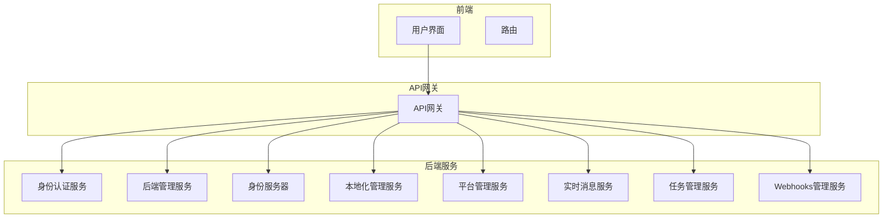

# 令牌刷新机制

<cite>
**本文档引用的文件**   
- [AuthServerModule.Configure.cs](file://aspnet-core/services/LY.MicroService.AuthServer/AuthServerModule.Configure.cs)
- [DefaultIdentitySessionChecker.cs](file://aspnet-core/modules/identity/LINGYUN.Abp.Identity.Session/LINGYUN/Abp/Identity/Session/DefaultIdentitySessionChecker.cs)
- [LinkUserTokenExtensionGrant.cs](file://aspnet-core/modules/openIddict/LINGYUN.Abp.OpenIddict.LinkUser/LINGYUN/Abp/OpenIddict/LinkUser/LinkUserTokenExtensionGrant.cs)
- [MicroServiceApplicationsSingleModule.Configure.cs](file://aspnet-core/services/LY.AIO.Applications.Single/MicroServiceApplicationsSingleModule.Configure.cs)
- [OpenIddictApplicationTokenLifetimeConsts.cs](file://aspnet-core/modules/openIddict/LINGYUN.Abp.OpenIddict.Application.Contracts/LINGYUN/Abp/OpenIddict/Applications/OpenIddictApplicationTokenLifetimeConsts.cs)
- [SecurityTokenCacheItem.cs](file://aspnet-core/modules/identity/LINGYUN.Abp.Identity.Domain/LINGYUN/Abp/Identity/SecurityTokenCacheItem.cs)
- [SingleMigrationsDbContextModelSnapshot.cs](file://aspnet-core/migrations/LY.MicroService.Applications.Single.EntityFrameworkCore.PostgreSql/Migrations/SingleMigrationsDbContextModelSnapshot.cs)
</cite>

## 目录
1. [引言](#引言)
2. [项目结构分析](#项目结构分析)
3. [核心组件分析](#核心组件分析)
4. [令牌刷新机制详解](#令牌刷新机制详解)
5. [ABP框架中的实现流程](#abp框架中的实现流程)
6. [API端点与安全令牌获取](#api端点与安全令牌获取)
7. [刷新令牌的撤销与过期处理](#刷新令牌的撤销与过期处理)
8. [客户端与服务端交互逻辑](#客户端与服务端交互逻辑)
9. [重放攻击与令牌滥用防护](#重放攻击与令牌滥用防护)
10. [错误处理策略](#错误处理策略)
11. [最佳实践建议](#最佳实践建议)
12. [结论](#结论)

## 引言
在现代Web应用中，令牌刷新机制是保障用户会话安全性和连续性的关键组成部分。本文档旨在深入探讨ABP框架中访问令牌（Access Token）和刷新令牌（Refresh Token）的工作原理，涵盖它们的生命周期、存储策略和使用场景。我们将详细描述在ABP框架中实现令牌刷新的具体流程，包括如何通过API端点安全地获取新令牌，以及如何处理刷新令牌的撤销和过期情况。此外，文档还将提供实际代码示例来展示客户端和服务端的交互逻辑，并说明如何防止重放攻击和令牌滥用。最后，我们将讨论错误处理策略和最佳实践建议，以帮助开发者构建更加安全可靠的应用程序。

## 项目结构分析
本项目采用微服务架构设计，主要由多个模块和服务组成，这些模块和服务通过API网关进行通信。项目的核心部分位于`aspnet-core`目录下，其中包含了框架、迁移、模块、服务等子目录。`framework`目录包含了各种认证、授权、日志记录等功能的实现；`migrations`目录负责数据库迁移脚本的管理；`modules`目录则包含了业务相关的模块，如账户管理、审计日志、缓存管理等；`services`目录包含了各个微服务的实现，例如身份认证服务、后端管理服务等。这种模块化的设计使得每个服务都可以独立开发、测试和部署，提高了系统的可维护性和扩展性。



**图源**
- [AuthServerModule.Configure.cs](file://aspnet-core/services/LY.MicroService.AuthServer/AuthServerModule.Configure.cs)
- [MicroServiceApplicationsSingleModule.Configure.cs](file://aspnet-core/services/LY.AIO.Applications.Single/MicroServiceApplicationsSingleModule.Configure.cs)

**本节来源**
- [AuthServerModule.Configure.cs](file://aspnet-core/services/LY.MicroService.AuthServer/AuthServerModule.Configure.cs)
- [MicroServiceApplicationsSingleModule.Configure.cs](file://aspnet-core/services/LY.AIO.Applications.Single/MicroServiceApplicationsSingleModule.Configure.cs)

## 核心组件分析
在ABP框架中，令牌刷新机制涉及多个核心组件，包括身份认证服务、会话管理、令牌管理等。这些组件协同工作，确保用户能够安全地访问受保护的资源。

### 身份认证服务
身份认证服务是整个系统的第一道防线，负责验证用户的身份并发放访问令牌。在本项目中，身份认证服务由`LY.MicroService.AuthServer`模块实现，该模块使用OpenIddict作为OAuth 2.0和OpenID Connect协议的实现。通过配置`OpenIddictServerOptions`，可以设置访问令牌和刷新令牌的有效期、刷新令牌的重用宽限期等参数。

### 会话管理
会话管理组件负责维护用户的登录状态，确保用户在一定时间内无需重新登录即可访问受保护的资源。`DefaultIdentitySessionChecker`类实现了会话检查逻辑，当用户请求受保护的资源时，该类会检查用户的会话是否仍然有效。如果会话有效，则更新会话的最后访问时间；如果会话无效，则返回401未授权响应。

### 令牌管理
令牌管理组件负责生成、验证和刷新访问令牌。在ABP框架中，令牌管理主要通过`OpenIddict`库实现。`OpenIddictServerOptions`类提供了丰富的配置选项，允许开发者自定义令牌的生命周期、刷新策略等。此外，`LinkUserTokenExtensionGrant`类实现了自定义的令牌扩展授权类型，允许第三方应用通过特定的授权流程获取访问令牌。

#### 类图
```mermaid
classDiagram
    class DefaultIdentitySessionChecker {
        +IClock Clock
        +ICurrentTenant CurrentTenant
        +IDeviceInfoProvider DeviceInfoProvider
        +IDistributedEventBus DistributedEventBus
        +IIdentitySessionCache IdentitySessionCache
        +IdentitySessionCheckOptions SessionCheckOptions
        +ValidateSessionAsync(ClaimsPrincipal, CancellationToken) bool
   