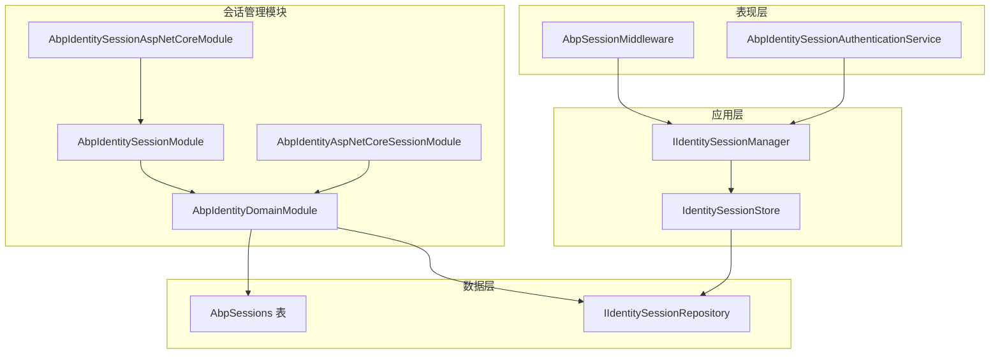
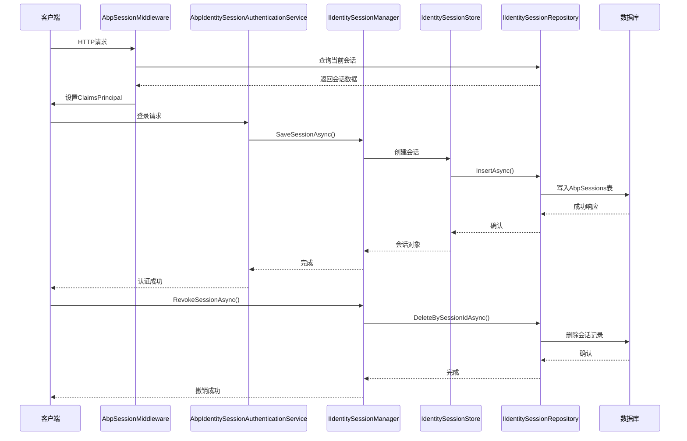
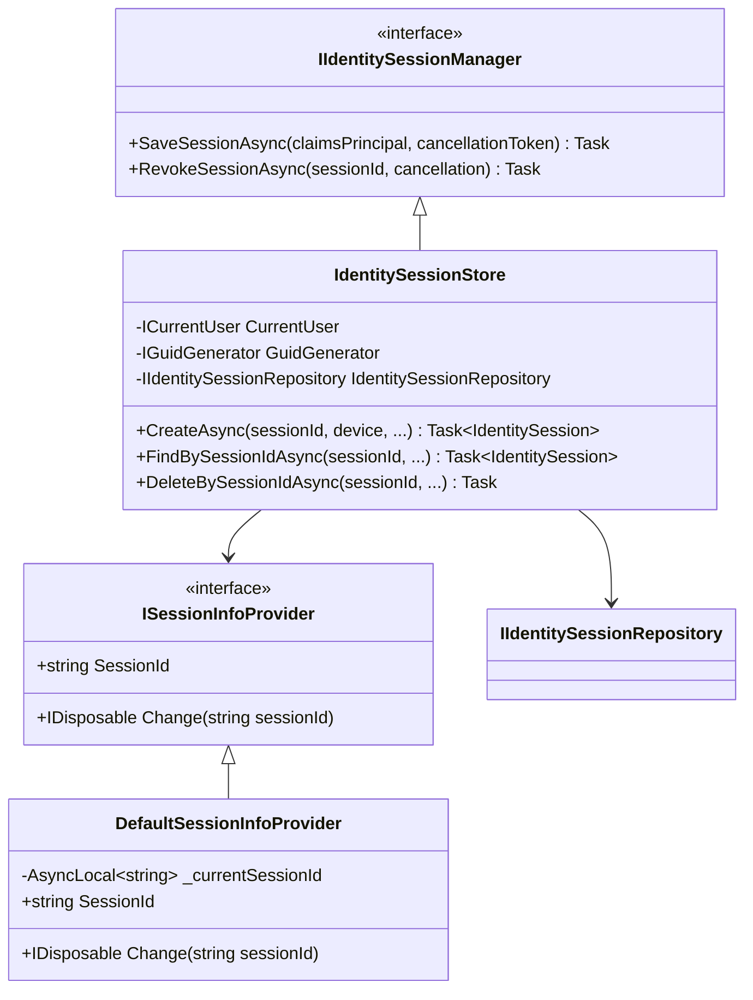
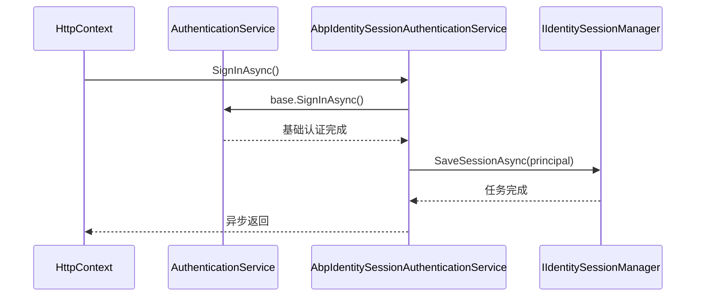
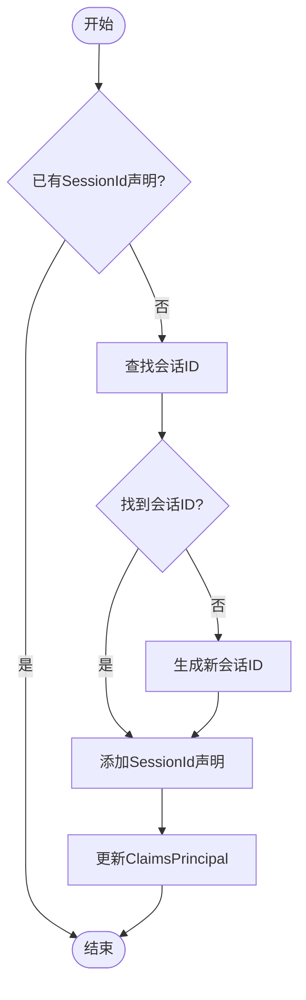
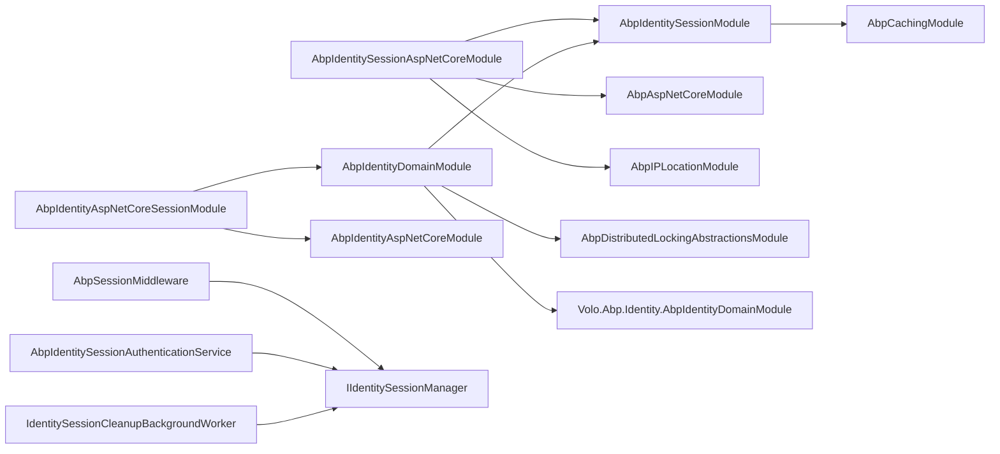

# 会话管理

<cite>
**本文档中引用的文件**  
- [AbpIdentitySessionModule.cs](file://aspnet-core/modules/identity/LINGYUN.Abp.Identity.Session/LINGYUN/Abp/Identity/Session/AbpIdentitySessionModule.cs)
- [AbpSessionApplicationBuilderExtensions.cs](file://aspnet-core/modules/identity/LINGYUN.Abp.Identity.Session.AspNetCore/LINGYUN/Abp/Identity/Session/AspNetCore/AbpSessionApplicationBuilderExtensions.cs)
- [AbpIdentityDomainModule.cs](file://aspnet-core/modules/identity/LINGYUN.Abp.Identity.Domain/LINGYUN/Abp/Identity/AbpIdentityDomainModule.cs)
- [IIdentitySessionManager.cs](file://aspnet-core/modules/identity/LINGYUN.Abp.Identity.Domain/LINGYUN/Abp/Identity/Session/IIdentitySessionManager.cs)
- [IdentitySessionStore.cs](file://aspnet-core/modules/identity/LINGYUN.Abp.Identity.Domain/LINGYUN/Abp/Identity/Session/IdentitySessionStore.cs)
- [IdentitySessionClaimsPrincipalContributor.cs](file://aspnet-core/modules/identity/LINGYUN.Abp.Identity.Domain/LINGYUN/Abp/Identity/Session/IdentitySessionClaimsPrincipalContributor.cs)
- [AbpIdentitySessionAuthenticationService.cs](file://aspnet-core/modules/identity/LINGYUN.Abp.Identity.AspNetCore.Session/LINGYUN/Abp/Identity/AspNetCore/Session/AbpIdentitySessionAuthenticationService.cs)
- [IdentitySettingNames.cs](file://aspnet-core/modules/identity/LINGYUN.Abp.Identity.Domain.Shared/LINGYUN/Abp/Identity/Settings/IdentitySettingNames.cs)
- [20250409030245_Initial-Single-Project-MSSQL.cs](file://aspnet-core/migrations/LY.MicroService.Applications.Single.EntityFrameworkCore.SqlServer/Migrations/20250409030245_Initial-Single-Project-MSSQL.cs)
</cite>

## 目录
1. [简介](#简介)
2. [项目结构](#项目结构)
3. [核心组件](#核心组件)
4. [架构概述](#架构概述)
5. [详细组件分析](#详细组件分析)
6. [依赖关系分析](#依赖关系分析)
7. [性能考虑](#性能考虑)
8. [故障排除指南](#故障排除指南)
9. [结论](#结论)

## 简介
本文档深入探讨基于ABP框架的用户会话管理机制，涵盖会话的创建、维护和销毁流程。文档详细描述了在分布式环境中如何管理用户会话状态，支持单点登录（SSO）和跨服务会话同步。同时说明了会话数据的存储方式（如Redis）、超时策略和安全性保障措施，并提供实际代码示例展示会话中间件的配置与使用方法及其与身份验证流程的集成。此外，还为开发者提供了高并发场景下的性能优化建议和常见问题排查指南。

## 项目结构
本项目的会话管理功能主要分布在`aspnet-core/modules/identity`目录下，涉及多个模块协同工作以实现完整的会话生命周期管理。关键模块包括：
- `LINGYUN.Abp.Identity.Session`: 提供基础会话接口和默认实现
- `LINGYUN.Abp.Identity.Session.AspNetCore`: ASP.NET Core环境下的会话中间件支持
- `LINGYUN.Abp.Identity.Domain`: 包含会话实体、仓储及业务逻辑
- `LINGYUN.Abp.Identity.AspNetCore.Session`: 扩展ASP.NET Core Identity的身份认证服务

数据库迁移脚本表明系统通过`AbpSessions`表持久化会话信息，包含会话ID、设备信息、IP地址、登录时间等字段。

**图源**
- [AbpIdentitySessionModule.cs](file://aspnet-core/modules/identity/LINGYUN.Abp.Identity.Session/LINGYUN/Abp/Identity/Session/AbpIdentitySessionModule.cs)
- [AbpIdentityDomainModule.cs](file://aspnet-core/modules/identity/LINGYUN.Abp.Identity.Domain/LINGYUN/Abp/Identity/AbpIdentityDomainModule.cs)
- [20250409030245_Initial-Single-Project-MSSQL.cs](file://aspnet-core/migrations/LY.MicroService.Applications.Single.EntityFrameworkCore.SqlServer/Migrations/20250409030245_Initial-Single-Project-MSSQL.cs)

**节源**
- [AbpIdentitySessionModule.cs](file://aspnet-core/modules/identity/LINGYUN.Abp.Identity.Session/LINGYUN/Abp/Identity/Session/AbpIdentitySessionModule.cs)
- [AbpIdentityDomainModule.cs](file://aspnet-core/modules/identity/LINGYUN.Abp.Identity.Domain/LINGYUN/Abp/Identity/AbpIdentityDomainModule.cs)

## 核心组件
会话管理系统的核心组件包括会话管理器、会话存储、会话中间件和自定义身份认证服务。这些组件共同协作完成从用户登录到会话维护再到登出的完整生命周期管理。

**节源**
- [IIdentitySessionManager.cs](file://aspnet-core/modules/identity/LINGYUN.Abp.Identity.Domain/LINGYUN/Abp/Identity/Session/IIdentitySessionManager.cs)
- [IdentitySessionStore.cs](file://aspnet-core/modules/identity/LINGYUN.Abp.Identity.Domain/LINGYUN/Abp/Identity/Session/IdentitySessionStore.cs)
- [AbpSessionApplicationBuilderExtensions.cs](file://aspnet-core/modules/identity/LINGYUN.Abp.Identity.Session.AspNetCore/LINGYUN/Abp/Identity/Session/AspNetCore/AbpSessionApplicationBuilderExtensions.cs)

## 架构概述
系统采用分层架构设计，各层职责分明：
- **表现层**：通过`AbpSessionMiddleware`拦截HTTP请求，提取并设置会话上下文
- **应用服务层**：`IIdentitySessionManager`提供高层会话操作接口
- **领域层**：`IdentitySessionStore`实现具体业务逻辑，协调仓储操作
- **数据访问层**：`IIdentitySessionRepository`负责与数据库交互

整个流程始于用户成功认证后触发`SignInAsync`事件，由`AbpIdentitySessionAuthenticationService`捕获并调用会话管理器保存新会话；后续请求通过中间件恢复会话上下文；登出时则调用`RevokeSessionAsync`清除会话记录。

**图源**
- [AbpSessionApplicationBuilderExtensions.cs](file://aspnet-core/modules/identity/LINGYUN.Abp.Identity.Session.AspNetCore/LINGYUN/Abp/Identity/Session/AspNetCore/AbpSessionApplicationBuilderExtensions.cs)
- [AbpIdentitySessionAuthenticationService.cs](file://aspnet-core/modules/identity/LINGYUN.Abp.Identity.AspNetCore.Session/LINGYUN/Abp/Identity/AspNetCore/Session/AbpIdentitySessionAuthenticationService.cs)
- [IIdentitySessionManager.cs](file://aspnet-core/modules/identity/LINGYUN.Abp.Identity.Domain/LINGYUN/Abp/Identity/Session/IIdentitySessionManager.cs)

## 详细组件分析

### 会话管理器分析
`IIdentitySessionManager`是会话管理的核心接口，定义了保存和撤销会话的基本操作。其实现类通过组合模式协调多个服务完成复杂业务逻辑。

#### 对象导向组件：

**图源**
- [IIdentitySessionManager.cs](file://aspnet-core/modules/identity/LINGYUN.Abp.Identity.Domain/LINGYUN/Abp/Identity/Session/IIdentitySessionManager.cs)
- [IdentitySessionStore.cs](file://aspnet-core/modules/identity/LINGYUN.Abp.Identity.Domain/LINGYUN/Abp/Identity/Session/IdentitySessionStore.cs)
- [DefaultSessionInfoProvider.cs](file://aspnet-core/modules/identity/LINGYUN.Abp.Identity.Session/LINGYUN/Abp/Identity/Session/DefaultSessionInfoProvider.cs)

### 身份认证服务分析
`AbpIdentitySessionAuthenticationService`继承自ASP.NET Core的`AuthenticationService`，重写了`SignInAsync`方法，在标准认证流程基础上增加会话持久化逻辑。

#### API/服务组件：

**图源**
- [AbpIdentitySessionAuthenticationService.cs](file://aspnet-core/modules/identity/LINGYUN.Abp.Identity.AspNetCore.Session/LINGYUN/Abp/Identity/AspNetCore/Session/AbpIdentitySessionAuthenticationService.cs)

### 会话声明贡献者分析
`IdentitySessionClaimsPrincipalContributor`负责将会话ID注入到ClaimsPrincipal中，确保每次请求都能携带正确的会话标识。

#### 复杂逻辑组件：

**图源**
- [IdentitySessionClaimsPrincipalContributor.cs](file://aspnet-core/modules/identity/LINGYUN.Abp.Identity.Domain/LINGYUN/Abp/Identity/Session/IdentitySessionClaimsPrincipalContributor.cs)

**节源**
- [IdentitySessionClaimsPrincipalContributor.cs](file://aspnet-core/modules/identity/LINGYUN.Abp.Identity.Domain/LINGYUN/Abp/Identity/Session/IdentitySessionClaimsPrincipalContributor.cs)
- [AbpIdentitySessionAuthenticationService.cs](file://aspnet-core/modules/identity/LINGYUN.Abp.Identity.AspNetCore.Session/LINGYUN/Abp/Identity/AspNetCore/Session/AbpIdentitySessionAuthenticationService.cs)

## 依赖关系分析
会话管理系统与其他模块存在紧密依赖关系，形成完整的安全控制链路。

**图源**
- [AbpIdentitySessionModule.cs](file://aspnet-core/modules/identity/LINGYUN.Abp.Identity.Session/LINGYUN/Abp/Identity/Session/AbpIdentitySessionModule.cs)
- [AbpIdentitySessionAspNetCoreModule.cs](file://aspnet-core/modules/identity/LINGYUN.Abp.Identity.Session.AspNetCore/LINGYUN/Abp/Identity/Session/AspNetCore/AbpIdentitySessionAspNetCoreModule.cs)
- [AbpIdentityDomainModule.cs](file://aspnet-core/modules/identity/LINGYUN.Abp.Identity.Domain/LINGYUN/Abp/Identity/AbpIdentityDomainModule.cs)

**节源**
- [AbpIdentitySessionModule.cs](file://aspnet-core/modules/identity/LINGYUN.Abp.Identity.Session/LINGYUN/Abp/Identity/Session/AbpIdentitySessionModule.cs)
- [AbpIdentityDomainModule.cs](file://aspnet-core/modules/identity/LINGYUN.Abp.Identity.Domain/LINGYUN/Abp/Identity/AbpIdentityDomainModule.cs)

## 性能考虑
系统通过以下方式优化会话管理性能：
1. 使用分布式缓存减少数据库查询频率
2. 后台工作者定期清理过期会话避免表膨胀
3. 异步非阻塞IO操作提升吞吐量
4. 利用ABP框架的依赖注入和对象映射机制降低内存开销

配置选项允许管理员根据实际负载调整会话清理频率和并发策略，平衡安全性与资源消耗。

## 故障排除指南
常见问题及解决方案：

| 问题现象 | 可能原因 | 解决方案 |
|--------|--------|--------|
| 会话无法持久化 | 数据库连接失败或权限不足 | 检查数据库连接字符串和用户权限 |
| 多设备登录受限 | 并发登录策略配置不当 | 调整`IdentitySettingNames.ConcurrentLoginStrategy`设置 |
| 会话超时不准确 | 服务器时间不同步 | 确保所有节点使用NTP同步时间 |
| 中间件顺序错误 | UseAbpSession调用时机不正确 | 确保在UseAuthentication之后、UseAuthorization之前调用 |

**节源**
- [IdentitySettingNames.cs](file://aspnet-core/modules/identity/LINGYUN.Abp.Identity.Domain.Shared/LINGYUN/Abp/Identity/Settings/IdentitySettingNames.cs)

## 结论
ABP框架下的会话管理系统提供了完整且灵活的解决方案，支持分布式环境中的用户会话管理。通过模块化设计实现了关注点分离，便于扩展和维护。系统充分利用了ABP框架的基础设施，如依赖注入、对象映射、分布式事件等特性，构建了一个高效可靠的会话管理体系。对于需要支持单点登录和跨服务会话同步的企业级应用而言，该方案具有很高的实用价值。