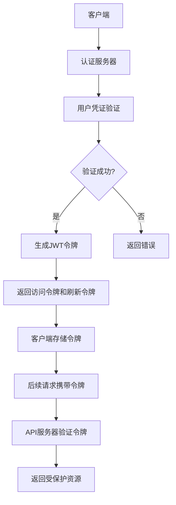
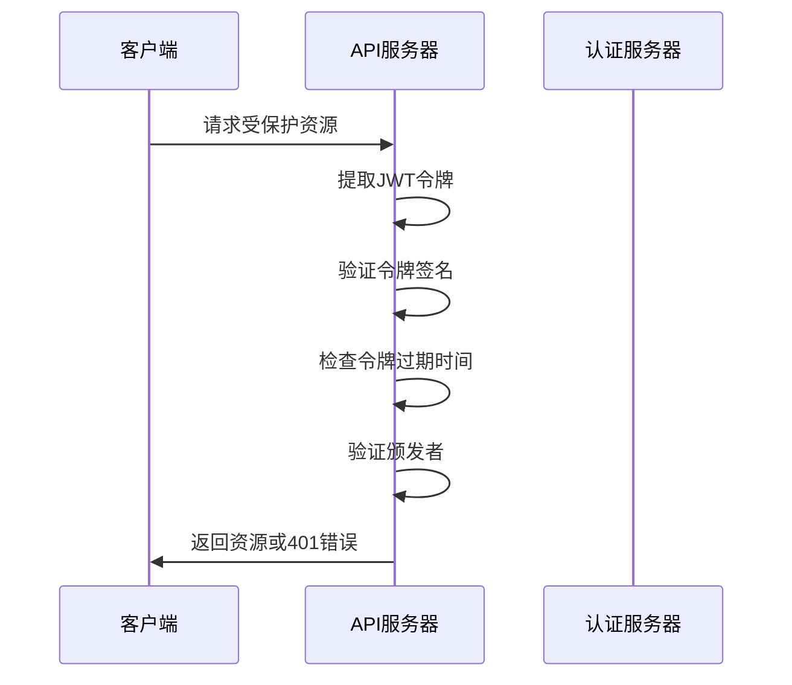
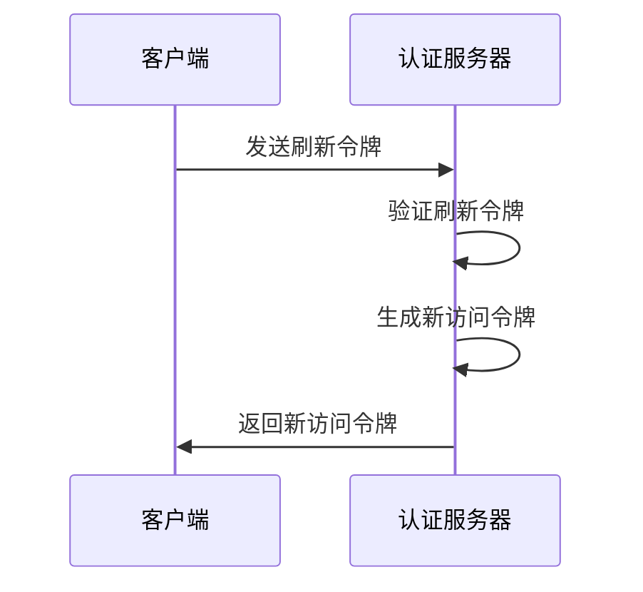
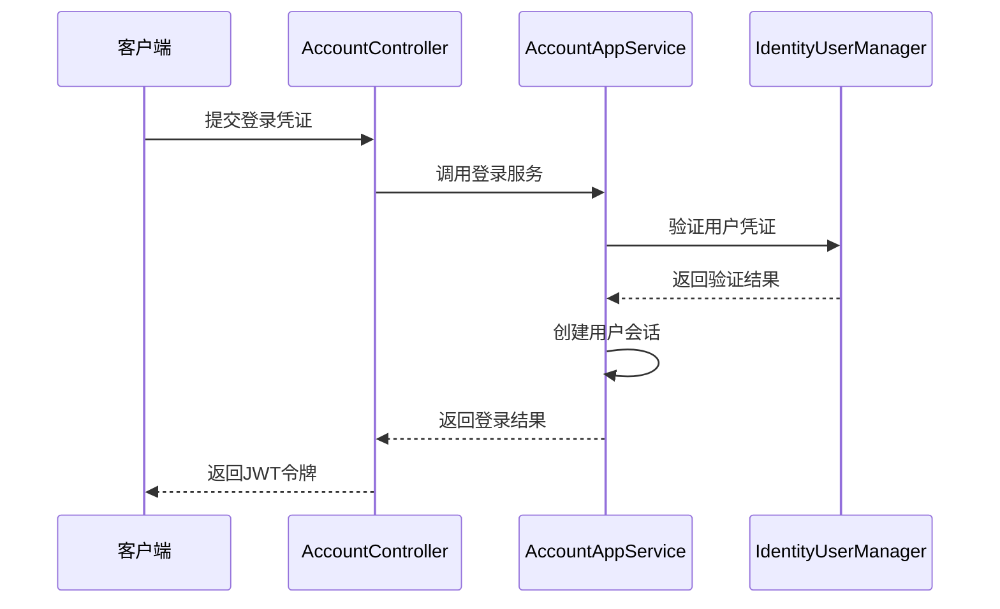
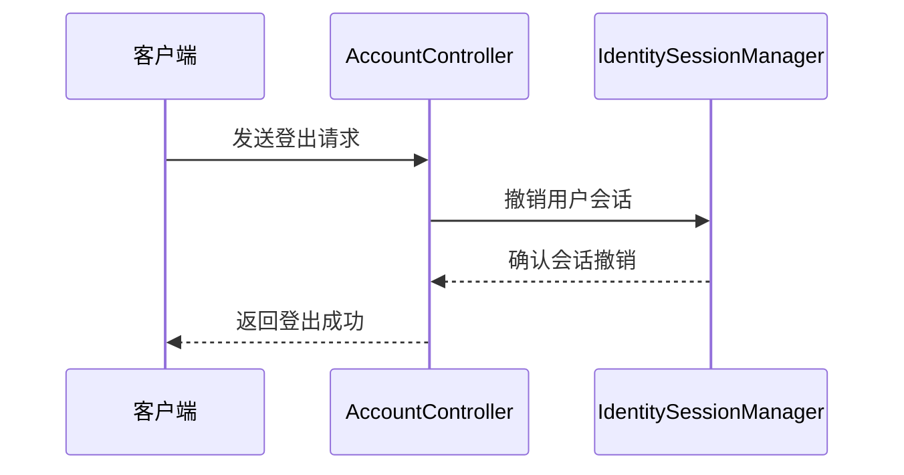
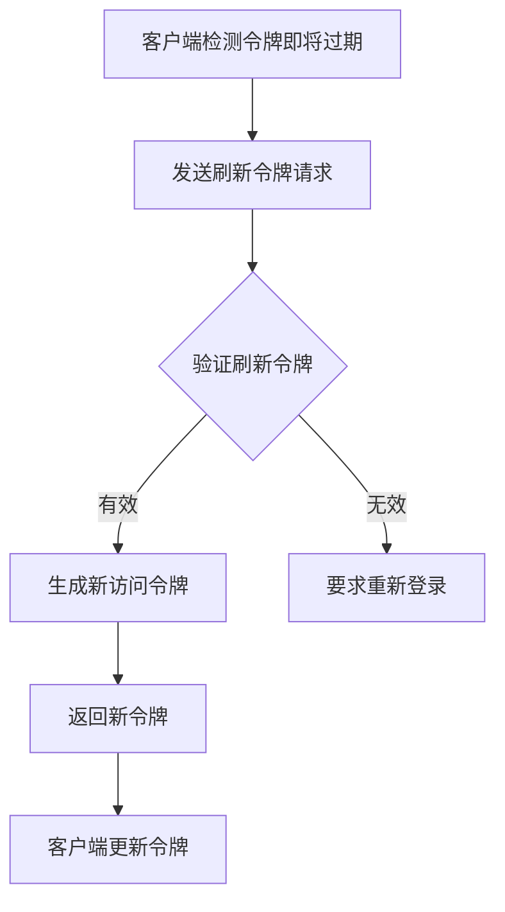
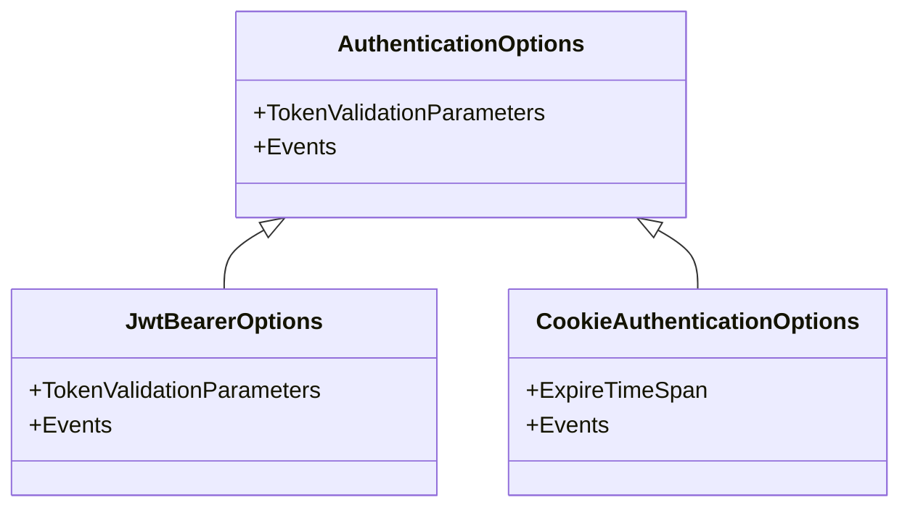
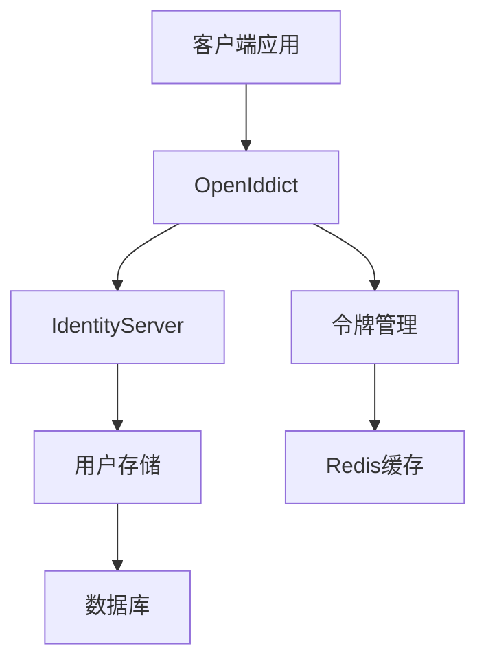
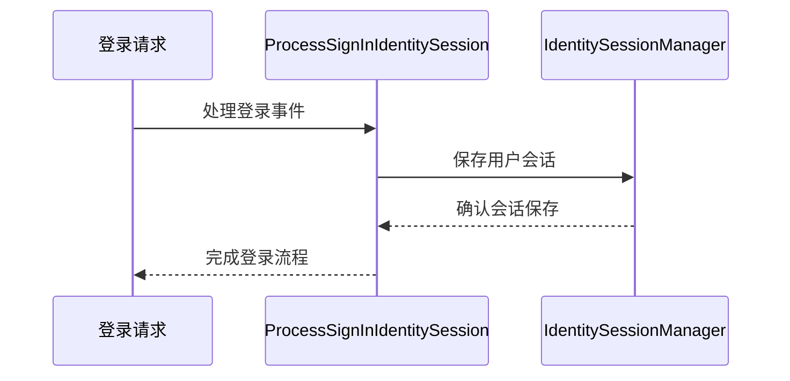

# 身份验证流程

<cite>
**本文档中引用的文件**  
- [AbpOpenIddictAspNetCoreSessionModule.cs](file://aspnet-core/modules/openIddict/LINGYUN.Abp.OpenIddict.AspNetCore.Session/LINGYUN/Abp/OpenIddict/AspNetCore/Session/AbpOpenIddictAspNetCoreSessionModule.cs)
- [ProcessSignInIdentitySession.cs](file://aspnet-core/modules/openIddict/LINGYUN.Abp.OpenIddict.AspNetCore.Session/LINGYUN/Abp/OpenIddict/AspNetCore/Session/ProcessSignInIdentitySession.cs)
- [ProcessSignOutIdentitySession.cs](file://aspnet-core/modules/openIddict/LINGYUN.Abp.OpenIddict.AspNetCore.Session/LINGYUN/Abp/OpenIddict/AspNetCore/Session/ProcessSignOutIdentitySession.cs)
- [UserinfoIdentitySession.cs](file://aspnet-core/modules/openIddict/LINGYUN.Abp.OpenIddict.AspNetCore.Session/LINGYUN/Abp/OpenIddict/AspNetCore/Session/UserinfoIdentitySession.cs)
- [AbpIdentitySessionDynamicClaimsPrincipalContributor.cs](file://aspnet-core/modules/identity/LINGYUN.Abp.Identity.Session.AspNetCore/LINGYUN/Abp/Identity/Session/AspNetCore/AbpIdentitySessionDynamicClaimsPrincipalContributor.cs)
- [AuthServerModule.Configure.cs](file://aspnet-core/services/LY.MicroService.AuthServer/AuthServerModule.Configure.cs)
- [AbpCookieAuthenticationHandler.cs](file://aspnet-core/services/LY.MicroService.IdentityServer/Authentication/AbpCookieAuthenticationHandler.cs)
- [AccountController.cs](file://aspnet-core/modules/account/LINGYUN.Abp.Account.Web/Areas/Account/Controllers/AccountController.cs)
- [AccountAppService.cs](file://aspnet-core/modules/account/LINGYUN.Abp.Account.Application/LINGYUN/Abp/Account/AccountAppService.cs)
</cite>

## 目录
1. [简介](#简介)
2. [认证机制概述](#认证机制概述)
3. [JWT令牌管理](#jwt令牌管理)
4. [核心操作实现](#核心操作实现)
5. [认证中间件配置](#认证中间件配置)
6. [与IdentityServer和OpenIddict集成](#与identityserver和openiddict集成)
7. [会话管理](#会话管理)
8. [安全上下文建立](#安全上下文建立)
9. [性能优化建议](#性能优化建议)
10. [常见问题解决方案](#常见问题解决方案)

## 简介
本文档详细介绍了基于ABP框架的身份验证流程，重点阐述了JWT令牌的生成、验证和刷新机制。文档涵盖了登录、登出、令牌续期等核心操作的实现细节，并提供了认证中间件的配置和使用示例。同时，文档还说明了与IdentityServer和OpenIddict的集成方式，以及如何处理令牌过期和安全上下文建立等关键问题。

## 认证机制概述
ABP框架的身份验证系统基于OpenIddict实现，提供了完整的OAuth 2.0和OpenID Connect支持。系统通过JWT令牌进行身份验证，支持多种授权类型，包括密码模式、短信验证码、微信登录等。

**图示来源**
- [AuthServerModule.Configure.cs](file://aspnet-core/services/LY.MicroService.AuthServer/AuthServerModule.Configure.cs#L391-L418)

## JWT令牌管理
### 令牌生成
JWT令牌在用户成功登录后生成，包含用户身份信息和权限声明。令牌的生成由OpenIddict框架自动处理。

### 令牌验证
系统通过JWT Bearer认证方案验证令牌的有效性，包括签名验证、过期时间检查和颁发者验证。

**图示来源**
- [AuthServerModule.Configure.cs](file://aspnet-core/services/LY.MicroService.AuthServer/AuthServerModule.Configure.cs#L391-L418)

### 令牌刷新
系统支持刷新令牌机制，允许在访问令牌过期后获取新的访问令牌而无需重新登录。

**图示来源**
- [AuthServerModule.Configure.cs](file://aspnet-core/services/LY.MicroService.AuthServer/AuthServerModule.Configure.cs#L410-L418)

## 核心操作实现

### 登录流程
登录操作通过AccountController实现，处理用户凭证验证和会话创建。

**图示来源**
- [AccountController.cs](file://aspnet-core/modules/account/LINGYUN.Abp.Account.Web/Areas/Account/Controllers/AccountController.cs)
- [AccountAppService.cs](file://aspnet-core/modules/account/LINGYUN.Abp.Account.Application/LINGYUN/Abp/Account/AccountAppService.cs)

### 登出流程
登出操作终止用户会话并撤销相关令牌。

**图示来源**
- [ProcessSignOutIdentitySession.cs](file://aspnet-core/modules/openIddict/LINGYUN.Abp.OpenIddict.AspNetCore.Session/LINGYUN/Abp/OpenIddict/AspNetCore/Session/ProcessSignOutIdentitySession.cs)

### 令牌续期
令牌续期通过刷新令牌实现，确保用户会话的持续性。

**图示来源**
- [AuthServerModule.Configure.cs](file://aspnet-core/services/LY.MicroService.AuthServer/AuthServerModule.Configure.cs#L410-L418)

## 认证中间件配置
认证中间件的配置在AuthServerModule中完成，包括JWT Bearer认证和Cookie认证的设置。

**图示来源**
- [AuthServerModule.Configure.cs](file://aspnet-core/services/LY.MicroService.AuthServer/AuthServerModule.Configure.cs#L391-L418)

## 与IdentityServer和OpenIddict集成
系统通过OpenIddict模块与IdentityServer集成，提供了完整的身份验证服务。

**图示来源**
- [AbpOpenIddictAspNetCoreSessionModule.cs](file://aspnet-core/modules/openIddict/LINGYUN.Abp.OpenIddict.AspNetCore.Session/LINGYUN/Abp/OpenIddict/AspNetCore/Session/AbpOpenIddictAspNetCoreSessionModule.cs)

## 会话管理
系统实现了基于数据库的会话管理，确保用户会话的安全性和持久性。

### 会话创建
用户登录成功后，系统创建持久化会话。

**图示来源**
- [ProcessSignInIdentitySession.cs](file://aspnet-core/modules/openIddict/LINGYUN.Abp.OpenIddict.AspNetCore.Session/LINGYUN/Abp/OpenIddict/AspNetCore/Session/ProcessSignInIdentitySession.cs)

