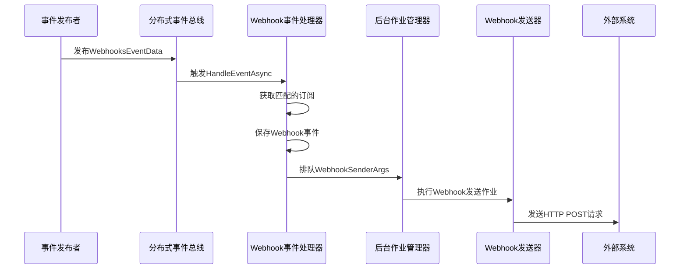
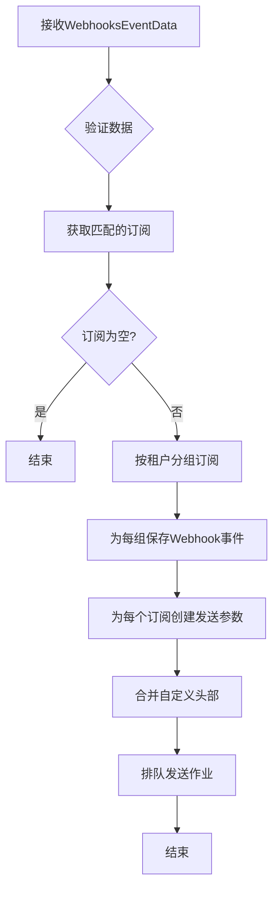
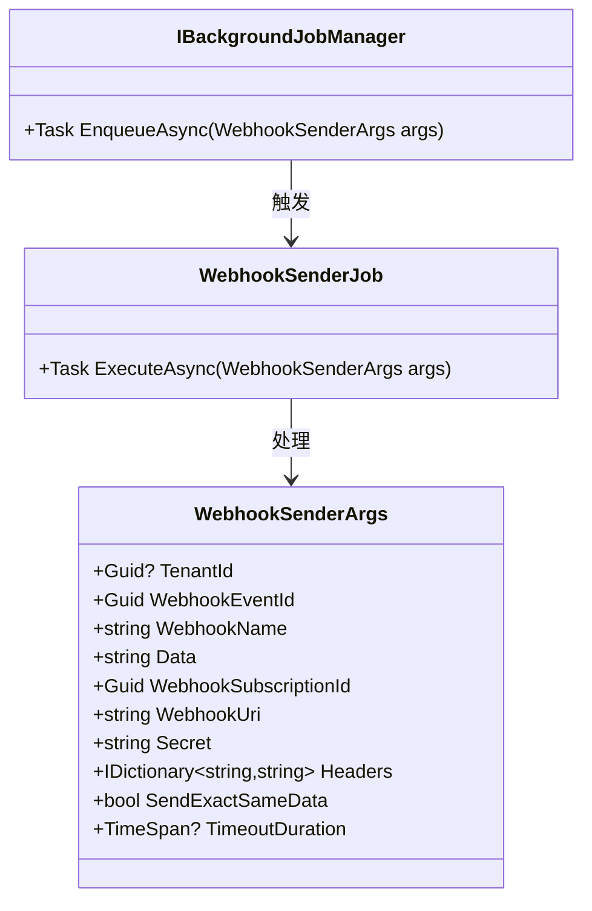
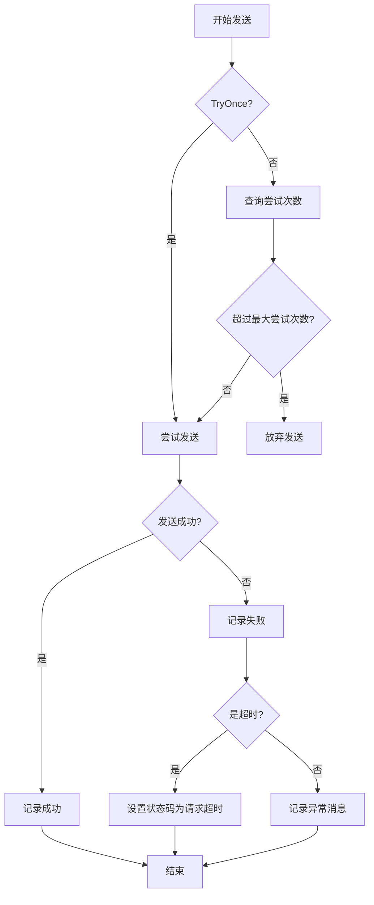
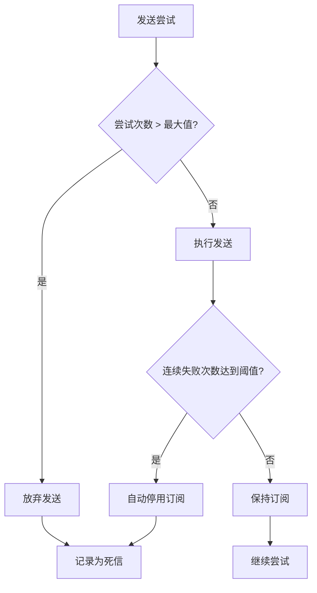
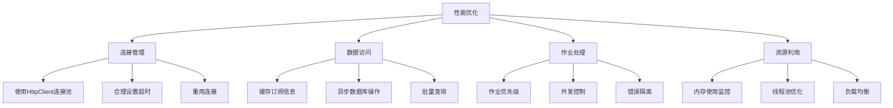

# Webhook事件处理

<cite>
**本文档中引用的文件**  
- [DefaultWebhookSender.cs](file://aspnet-core/modules/webhooks/LINGYUN.Abp.Webhooks/LINGYUN/Abp/Webhooks/DefaultWebhookSender.cs)
- [WebhooksEventHandler.cs](file://aspnet-core/services/LY.MicroService.WebhooksManagement.HttpApi.Host/EventBus/Handlers/WebhooksEventHandler.cs)
- [WebhookSenderJob.cs](file://aspnet-core/modules/webhooks/LINGYUN.Abp.Webhooks/LINGYUN/Abp/Webhooks/BackgroundJobs/WebhookSenderJob.cs)
- [WebhookSendAttemptStore.cs](file://aspnet-core/modules/webhooks/LINGYUN.Abp.WebhooksManagement.Domain/LINGYUN/Abp/WebhooksManagement/WebhookSendAttemptStore.cs)
- [AbpWebhooksOptions.cs](file://aspnet-core/modules/webhooks/LINGYUN.Abp.Webhooks.Core/LINGYUN/Abp/Webhooks/AbpWebhooksOptions.cs)
- [WebhooksEventData.cs](file://aspnet-core/modules/webhooks/LINGYUN.Abp.Webhooks.EventBus/LINGYUN/Abp/Webhooks/EventBus/WebhooksEventData.cs)
- [AbpWebhooksModule.cs](file://aspnet-core/modules/webhooks/LINGYUN.Abp.Webhooks/LINGYUN/Abp/Webhooks/AbpWebhooksModule.cs)
- [AbpWebhooksCoreModule.cs](file://aspnet-core/modules/webhooks/LINGYUN.Abp.Webhooks.Core/LINGYUN/Abp/Webhooks/AbpWebhooksCoreModule.cs)
</cite>

## 目录
1. [简介](#简介)
2. [事件接收与分发流程](#事件接收与分发流程)
3. [事件处理器实现机制](#事件处理器实现机制)
4. [事件队列与处理策略](#事件队列与处理策略)
5. [重试机制与失败处理](#重试机制与失败处理)
6. [死信队列实现](#死信队列实现)
7. [性能优化建议](#性能优化建议)
8. [监控指标](#监控指标)
9. [自定义事件处理器](#自定义事件处理器)
10. [总结](#总结)

## 简介
本项目实现了完整的Webhook事件处理系统，支持多租户环境下的事件发布、订阅、分发和监控。系统基于ABP框架构建，采用分布式事件总线进行事件传递，通过后台作业进行异步发送，确保了系统的可靠性和可扩展性。

## 事件接收与分发流程

Webhook事件处理流程始于事件的接收，通过分布式事件总线触发，然后进行订阅匹配、事件存储和异步分发。整个流程确保了事件的可靠传递和处理。



**图示来源**
- [WebhooksEventData.cs](file://aspnet-core/modules/webhooks/LINGYUN.Abp.Webhooks.EventBus/LINGYUN/Abp/Webhooks/EventBus/WebhooksEventData.cs#L0-L38)
- [WebhooksEventHandler.cs](file://aspnet-core/services/LY.MicroService.WebhooksManagement.HttpApi.Host/EventBus/Handlers/WebhooksEventHandler.cs#L0-L116)
- [WebhookSenderJob.cs](file://aspnet-core/modules/webhooks/LINGYUN.Abp.Webhooks/LINGYUN/Abp/Webhooks/BackgroundJobs/WebhookSenderJob.cs#L0-L34)

**本节来源**
- [WebhooksEventData.cs](file://aspnet-core/modules/webhooks/LINGYUN.Abp.Webhooks.EventBus/LINGYUN/Abp/Webhooks/EventBus/WebhooksEventData.cs#L0-L38)
- [WebhooksEventHandler.cs](file://aspnet-core/services/LY.MicroService.WebhooksManagement.HttpApi.Host/EventBus/Handlers/WebhooksEventHandler.cs#L0-L116)

## 事件处理器实现机制

Webhook事件处理器实现了`IDistributedEventHandler<WebhooksEventData>`接口，负责处理来自分布式事件总线的Webhook事件。处理器首先根据事件名称和租户ID查找匹配的订阅，然后为每个订阅创建并排队Webhook发送任务。

事件过滤通过`IWebhookSubscriptionManager.GetAllSubscriptionsOfTenantsIfFeaturesGrantedAsync`方法实现，该方法不仅匹配租户和事件名称，还检查功能权限，确保只有授权的订阅才会被触发。

事件转换发生在`PublishAsync`方法中，原始数据被包装成`WebhookEvent`对象并存储到数据库中。事件路由则通过为每个匹配的订阅创建独立的`WebhookSenderArgs`实例来实现，这些实例包含了目标URL、密钥、头部信息等路由所需的所有信息。



**图示来源**
- [WebhooksEventHandler.cs](file://aspnet-core/services/LY.MicroService.WebhooksManagement.HttpApi.Host/EventBus/Handlers/WebhooksEventHandler.cs#L0-L116)

**本节来源**
- [WebhooksEventHandler.cs](file://aspnet-core/services/LY.MicroService.WebhooksManagement.HttpApi.Host/EventBus/Handlers/WebhooksEventHandler.cs#L0-L116)

## 事件队列与处理策略

系统使用ABP框架的后台作业系统作为事件队列，通过`IBackgroundJobManager.EnqueueAsync`方法将`WebhookSenderArgs`对象排队。这种设计实现了生产者-消费者模式，发布者可以快速返回，而实际的HTTP调用在后台异步执行。

队列处理策略包括：
- **异步处理**：所有Webhook发送都在后台作业中执行，不阻塞主线程
- **租户分组**：订阅按租户ID分组，减少数据库操作次数
- **批量处理**：同一事件的多个订阅可以并行处理
- **事务性**：事件存储和作业排队在同一个事务上下文中

队列的持久化由后台作业框架保证，即使系统重启，未完成的作业也会被重新处理。



**图示来源**
- [WebhookSenderArgs.cs](file://aspnet-core/modules/webhooks/LINGYUN.Abp.Webhooks/LINGYUN/Abp/Webhooks/WebhookSenderArgs.cs#L0-L48)
- [WebhookSenderJob.cs](file://aspnet-core/modules/webhooks/LINGYUN.Abp.Webhooks/LINGYUN/Abp/Webhooks/BackgroundJobs/WebhookSenderJob.cs#L0-L34)
- [WebhooksEventHandler.cs](file://aspnet-core/services/LY.MicroService.WebhooksManagement.HttpApi.Host/EventBus/Handlers/WebhooksEventHandler.cs#L0-L116)

**本节来源**
- [WebhookSenderArgs.cs](file://aspnet-core/modules/webhooks/LINGYUN.Abp.Webhooks/LINGYUN/Abp/Webhooks/WebhookSenderArgs.cs#L0-L48)
- [WebhookSenderJob.cs](file://aspnet-core/modules/webhooks/LINGYUN.Abp.Webhooks/LINGYUN/Abp/Webhooks/BackgroundJobs/WebhookSenderJob.cs#L0-L34)

## 重试机制与失败处理

系统实现了完善的重试机制和失败处理策略。`WebhookSenderJob`负责执行发送任务，并根据配置进行重试。

重试逻辑如下：
1. 检查是否为一次性尝试（`TryOnce`）
2. 如果不是一次性尝试，查询已有的发送尝试次数
3. 如果尝试次数超过配置的最大值（`MaxSendAttemptCount`），则放弃发送
4. 否则，执行发送操作

失败处理包括：
- **异常捕获**：捕获`TaskCanceledException`（超时）和`HttpRequestException`（HTTP错误）
- **状态记录**：无论成功或失败，都记录响应状态码和内容
- **日志记录**：详细记录发送过程中的错误信息



**图示来源**
- [WebhookSenderJob.cs](file://aspnet-core/modules/webhooks/LINGYUN.Abp.Webhooks/LINGYUN/Abp/Webhooks/BackgroundJobs/WebhookSenderJob.cs#L30-L79)
- [AbpWebhooksOptions.cs](file://aspnet-core/modules/webhooks/LINGYUN.Abp.Webhooks.Core/LINGYUN/Abp/Webhooks/AbpWebhooksOptions.cs#L0-L42)

**本节来源**
- [WebhookSenderJob.cs](file://aspnet-core/modules/webhooks/LINGYUN.Abp.Webhooks/LINGYUN/Abp/Webhooks/BackgroundJobs/WebhookSenderJob.cs#L30-L79)
- [AbpWebhooksOptions.cs](file://aspnet-core/modules/webhooks/LINGYUN.Abp.Webhooks.Core/LINGYUN/Abp/Webhooks/AbpWebhooksOptions.cs#L0-L42)

## 死信队列实现

虽然系统没有显式的死信队列实现，但通过`NullWebhookSendAttemptStore`和最大尝试次数限制实现了类似功能。当发送尝试次数超过配置的`MaxSendAttemptCount`时，后续的发送尝试将被自动放弃。

此外，系统提供了`IWebhookSendAttemptStore`接口，允许查询特定订阅的连续失败次数（`HasXConsecutiveFailAsync`）。结合配置选项`IsAutomaticSubscriptionDeactivationEnabled`和`MaxConsecutiveFailCountBeforeDeactivateSubscription`，可以实现自动停用频繁失败的订阅，这相当于一种基于策略的死信处理。



**图示来源**
- [WebhookSenderJob.cs](file://aspnet-core/modules/webhooks/LINGYUN.Abp.Webhooks/LINGYUN/Abp/Webhooks/BackgroundJobs/WebhookSenderJob.cs#L30-L79)
- [WebhookSendAttemptStore.cs](file://aspnet-core/modules/webhooks/LINGYUN.Abp.WebhooksManagement.Domain/LINGYUN/Abp/WebhooksManagement/WebhookSendAttemptStore.cs#L0-L138)
- [AbpWebhooksOptions.cs](file://aspnet-core/modules/webhooks/LINGYUN.Abp.Webhooks.Core/LINGYUN/Abp/Webhooks/AbpWebhooksOptions.cs#L0-L42)

**本节来源**
- [WebhookSendAttemptStore.cs](file://aspnet-core/modules/webhooks/LINGYUN.Abp.WebhooksManagement.Domain/LINGYUN/Abp/WebhooksManagement/WebhookSendAttemptStore.cs#L0-L138)
- [AbpWebhooksOptions.cs](file://aspnet-core/modules/webhooks/LINGYUN.Abp.Webhooks.Core/LINGYUN/Abp/Webhooks/AbpWebhooksOptions.cs#L0-L42)

## 性能优化建议

基于系统架构，以下是性能优化建议：

1. **批量发送**：对于同一目标系统的多个Webhook，考虑实现批量发送接口，减少HTTP连接开销
2. **连接池优化**：通过`AbpWebhooksModule`配置的HttpClient已经使用了连接池，确保`TimeoutDuration`设置合理
3. **缓存订阅**：频繁查询订阅信息，建议实现订阅信息的内存缓存，减少数据库访问
4. **异步数据库操作**：确保所有数据库操作都使用异步方法，避免阻塞线程
5. **作业优先级**：为不同重要性的Webhook设置不同的作业优先级
6. **并发控制**：合理配置后台作业的并发数，避免对目标系统造成过大压力



**图示来源**
- [AbpWebhooksModule.cs](file://aspnet-core/modules/webhooks/LINGYUN.Abp.Webhooks/LINGYUN/Abp/Webhooks/AbpWebhooksModule.cs#L0-L26)
- [WebhookSendAttemptStore.cs](file://aspnet-core/modules/webhooks/LINGYUN.Abp.WebhooksManagement.Domain/LINGYUN/Abp/WebhooksManagement/WebhookSendAttemptStore.cs#L0-L138)
- [WebhooksEventHandler.cs](file://aspnet-core/services/LY.MicroService.WebhooksManagement.HttpApi.Host/EventBus/Handlers/WebhooksEventHandler.cs#L0-L116)

**本节来源**
- [AbpWebhooksModule.cs](file://aspnet-core/modules/webhooks/LINGYUN.Abp.Webhooks/LINGYUN/Abp/Webhooks/AbpWebhooksModule.cs#L0-L26)
- [WebhookSendAttemptStore.cs](file://aspnet-core/modules/webhooks/LINGYUN.Abp.WebhooksManagement.Domain/LINGYUN/Abp/WebhooksManagement/WebhookSendAttemptStore.cs#L0-L138)

## 监控指标

系统提供了丰富的监控指标，主要通过`WebhookSendAttempt`记录来实现：

1. **发送成功率**：成功发送次数 / 总发送尝试次数
2. **平均响应时间**：所有成功响应的平均耗时
3. **失败率**：失败发送次数 / 总发送尝试次数
4. **重试次数分布**：不同重试次数的事件数量
5. **端点健康度**：各订阅端点的成功率和响应时间
6. **事件处理延迟**：从事件产生到首次发送的时间差

这些指标可以通过查询`IWebhookSendAttemptStore`接口获取，特别是`GetAllSendAttemptsBySubscriptionAsPagedListAsync`和`GetAllSendAttemptsByWebhookEventIdAsync`方法提供了详细的发送历史数据。

```mermaid
erDiagram
WEBHOOK_EVENT ||--o{ WEBHOOK_SEND_ATTEMPT : "包含"
WEBHOOK_SUBSCRIPTION ||--o{ WEBHOOK_SEND_ATTEMPT : "关联"
WEBHOOK_EVENT {
guid Id PK
string WebhookName
string Data
datetime CreationTime
guid? TenantId
}
WEBHOOK_SUBSCRIPTION {
guid Id PK
string WebhookUri
string Secret
guid? TenantId
string Headers
}
WEBHOOK_SEND_ATTEMPT {
guid Id PK
guid WebhookEventId FK
guid WebhookSubscriptionId FK
datetime CreationTime
guid? TenantId
int? ResponseStatusCode
string Response
string RequestHeaders
string ResponseHeaders
bool SendExactSameData
}
WEBHOOK_EVENT ||--o{ WEBHOOK_SEND_ATTEMPT : "1对多"
WEBHOOK_SUBSCRIPTION ||--o{ WEBHOOK_SEND_ATTEMPT : "1对多"
```

**图示来源**
- [WebhookEvent.cs](file://aspnet-core/modules/webhooks/LINGYUN.Abp.Webhooks.Core/LINGYUN/Abp/Webhooks/WebhookEvent.cs#L0-L25)
- [WebhookSendAttemptStore.cs](file://aspnet-core/modules/webhooks/LINGYUN.Abp.WebhooksManagement.Domain/LINGYUN/Abp/WebhooksManagement/WebhookSendAttemptStore.cs#L0-L138)
- [WebhookSenderArgs.cs](file://aspnet-core/modules/webhooks/LINGYUN.Abp.Webhooks/LINGYUN/Abp/Webhooks/WebhookSenderArgs.cs#L0-L48)

**本节来源**
- [WebhookEvent.cs](file://aspnet-core/modules/webhooks/LINGYUN.Abp.Webhooks.Core/LINGYUN/Abp/Webhooks/WebhookEvent.cs#L0-L25)
- [WebhookSendAttemptStore.cs](file://aspnet-core/modules/webhooks/LINGYUN.Abp.WebhooksManagement.Domain/LINGYUN/Abp/WebhooksManagement/WebhookSendAttemptStore.cs#L0-L138)

## 自定义事件处理器

要自定义事件处理器以处理特定业务场景，可以通过以下方式扩展系统：

1. **自定义Webhook定义提供者**：实现`IWebhookDefinitionProvider`接口，定义特定于业务的Webhook
2. **扩展Webhook发送器**：继承`DefaultWebhookSender`，重写`CreateWebhookRequestMessage`或`SendHttpRequest`方法
3. **自定义事件处理器**：实现自己的`IDistributedEventHandler<WebhooksEventData>`，替换默认的`WebhooksEventHandler`
4. **扩展发送参数**：继承`WebhookSenderArgs`，添加业务特定的属性
5. **自定义存储**：实现`IWebhookEventStore`和`IWebhookSendAttemptStore`接口，使用不同的存储后端

例如，要实现一个支持签名的Webhook发送器，可以重写`SignWebhookRequest`方法：

```csharp
protected override void SignWebhookRequest(HttpRequestMessage request, string serializedBody, string secret)
{
    // 使用HMAC-SHA256签名
    var signature