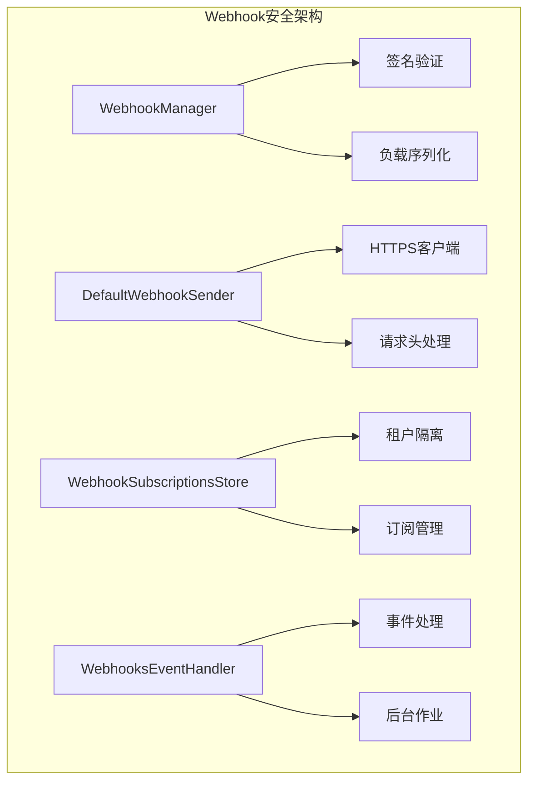
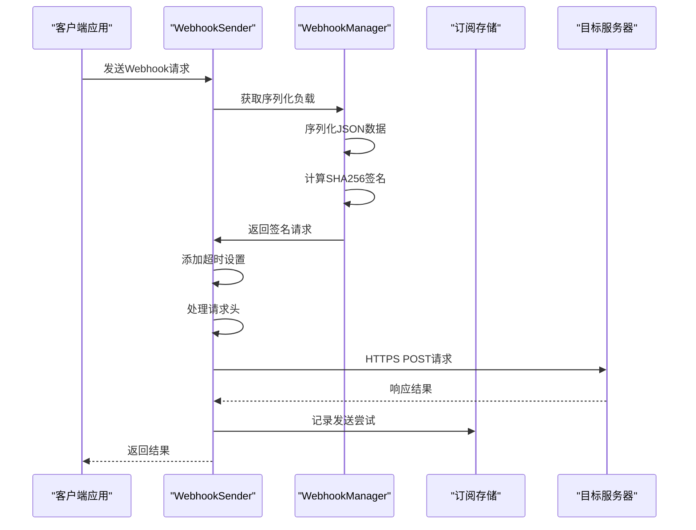
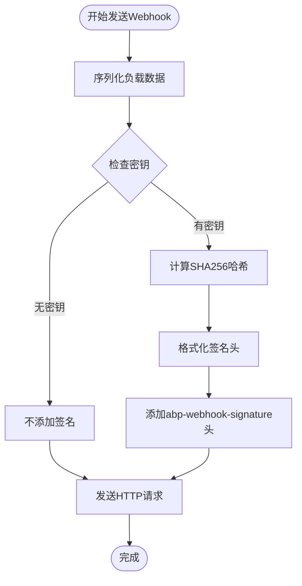
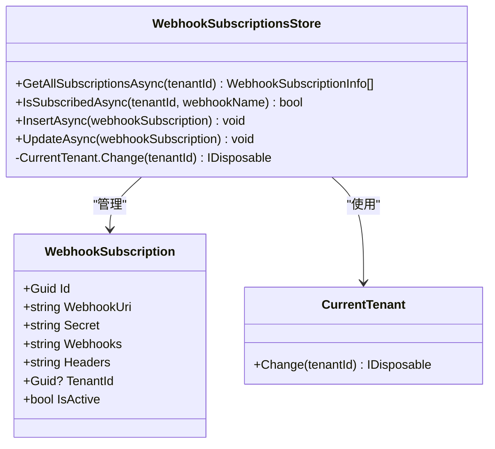
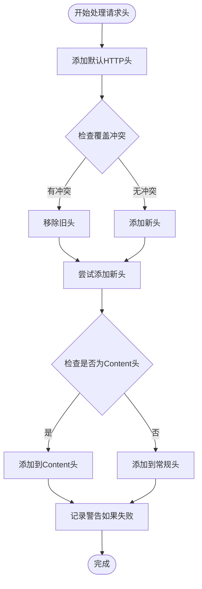
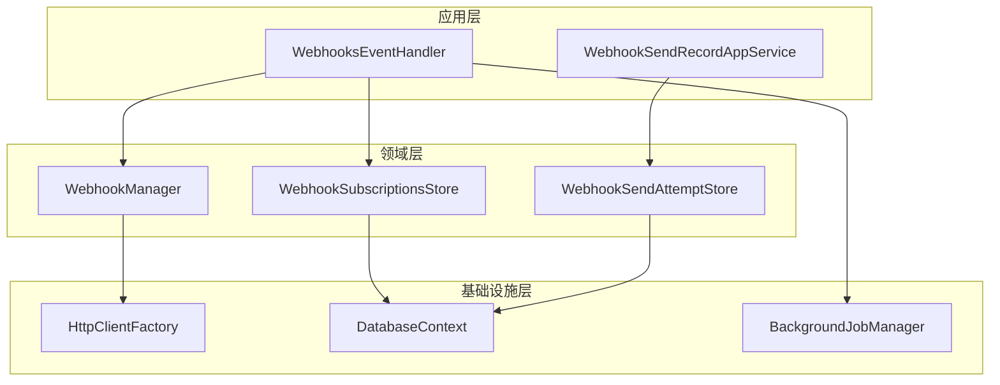

# Webhook安全性

<cite>
**本文档中引用的文件**
- [WebhookManager.cs](file://aspnet-core/modules/webhooks/LINGYUN.Abp.Webhooks/LINGYUN/Abp/Webhooks/WebhookManager.cs)
- [DefaultWebhookSender.cs](file://aspnet-core/modules/webhooks/LINGYUN.Abp.Webhooks/LINGYUN/Abp/Webhooks/DefaultWebhookSender.cs)
- [WebhookSubscriptionsStore.cs](file://aspnet-core/modules/webhooks/LINGYUN.Abp.WebhooksManagement.Domain/LINGYUN/Abp/WebhooksManagement/WebhookSubscriptionsStore.cs)
- [IWebhookManager.cs](file://aspnet-core/modules/webhooks/LINGYUN.Abp.Webhooks/LINGYUN/Abp/Webhooks/IWebhookManager.cs)
- [WebhooksDefinitionConsts.cs](file://aspnet-core/modules/webhooks/LINGYUN.Abp.Webhooks.Core/LINGYUN/Abp/Webhooks/WebhooksDefinitionConsts.cs)
- [WebhookSubscriptionConsts.cs](file://aspnet-core/modules/webhooks/LINGYUN.Abp.WebhooksManagement.Domain.Shared/LINGYUN/Abp/WebhooksManagement/WebhookSubscriptionConsts.cs)
- [WebhookHttpClientExtensions.cs](file://aspnet-core/framework/pushplus/LINGYUN.Abp.PushPlus/LINGYUN/Abp/PushPlus/Channel/Webhook/WebhookHttpClientExtensions.cs)
- [WebhooksEventHandler.cs](file://aspnet-core/services/LY.MicroService.WebhooksManagement.HttpApi.Host/EventBus/Handlers/WebhooksEventHandler.cs)
</cite>

## 目录
1. [简介](#简介)
2. [项目结构](#项目结构)
3. [核心组件](#核心组件)
4. [架构概览](#架构概览)
5. [详细组件分析](#详细组件分析)
6. [依赖关系分析](#依赖关系分析)
7. [性能考虑](#性能考虑)
8. [故障排除指南](#故障排除指南)
9. [结论](#结论)

## 简介

Webhook安全性是现代微服务架构中的关键组成部分，特别是在ABP框架的Webhooks模块中。该系统提供了全面的安全机制，包括HTTPS强制、签名验证、令牌认证、租户隔离以及多种防护措施来防止重放攻击和DDoS攻击。

本文档详细描述了Webhook通信的安全机制，包括：
- HTTPS强制执行和证书验证
- 基于SHA256的签名验证机制
- 租户隔离的实现方式
- 请求头参数的安全处理
- 防止重放攻击和DDoS攻击的策略
- 敏感数据保护和日志安全
- 安全配置的最佳实践

## 项目结构

Webhook安全模块采用分层架构设计，主要包含以下核心组件：



**图表来源**
- [WebhookManager.cs](file://aspnet-core/modules/webhooks/LINGYUN.Abp.Webhooks/LINGYUN/Abp/Webhooks/WebhookManager.cs#L1-L86)
- [DefaultWebhookSender.cs](file://aspnet-core/modules/webhooks/LINGYUN.Abp.Webhooks/LINGYUN/Abp/Webhooks/DefaultWebhookSender.cs#L1-L208)

**章节来源**
- [WebhookManager.cs](file://aspnet-core/modules/webhooks/LINGYUN.Abp.Webhooks/LINGYUN/Abp/Webhooks/WebhookManager.cs#L1-L86)
- [DefaultWebhookSender.cs](file://aspnet-core/modules/webhooks/LINGYUN.Abp.Webhooks/LINGYUN/Abp/Webhooks/DefaultWebhookSender.cs#L1-L208)

## 核心组件

### WebhookManager - 安全核心

WebhookManager是整个安全系统的核心，负责处理签名验证和负载序列化：

```csharp
public virtual void SignWebhookRequest(HttpRequestMessage request, string serializedBody, string secret)
{
    Check.NotNull(request, nameof(request));
    Check.NotNullOrWhiteSpace(serializedBody, nameof(serializedBody));

    request.Content = new StringContent(serializedBody, Encoding.UTF8, MimeTypes.Application.Json);

    if (!secret.IsNullOrWhiteSpace())
    {
        var secretBytes = Encoding.UTF8.GetBytes(secret);
        var headerValue = string.Format(CultureInfo.InvariantCulture, SignatureHeaderValueTemplate, serializedBody.Sha256(secretBytes));
        request.Headers.Add(SignatureHeaderName, headerValue);
    }
}
```

### DefaultWebhookSender - 发送器安全

DefaultWebhookSender实现了HTTPS强制和请求头安全处理：

```csharp
protected virtual HttpClient CreateWebhookClient(WebhookSenderArgs webhookSenderArgs)
{
    var client = _httpClientFactory.CreateClient(AbpWebhooksModule.WebhooksClient);
    if (webhookSenderArgs.TimeoutDuration.HasValue && 
        (webhookSenderArgs.TimeoutDuration >= WebhooksDefinitionConsts.MinimumTimeoutDuration && 
         webhookSenderArgs.TimeoutDuration <= WebhooksDefinitionConsts.MaximumTimeoutDuration))
    {
        client.Timeout = TimeSpan.FromSeconds(webhookSenderArgs.TimeoutDuration.Value);
    }
    return client;
}
```

**章节来源**
- [WebhookManager.cs](file://aspnet-core/modules/webhooks/LINGYUN.Abp.Webhooks/LINGYUN/Abp/Webhooks/WebhookManager.cs#L34-L48)
- [DefaultWebhookSender.cs](file://aspnet-core/modules/webhooks/LINGYUN.Abp.Webhooks/LINGYUN/Abp/Webhooks/DefaultWebhookSender.cs#L72-L82)

## 架构概览

Webhook安全架构采用多层防护机制，确保通信的完整性和机密性：



**图表来源**
- [DefaultWebhookSender.cs](file://aspnet-core/modules/webhooks/LINGYUN.Abp.Webhooks/LINGYUN/Abp/Webhooks/DefaultWebhookSender.cs#L37-L82)
- [WebhookManager.cs](file://aspnet-core/modules/webhooks/LINGYUN.Abp.Webhooks/LINGYUN/Abp/Webhooks/WebhookManager.cs#L34-L48)

## 详细组件分析

### 签名验证机制

Webhook系统使用基于SHA256的签名验证机制来确保消息完整性：



**图表来源**
- [WebhookManager.cs](file://aspnet-core/modules/webhooks/LINGYUN.Abp.Webhooks/LINGYUN/Abp/Webhooks/WebhookManager.cs#L34-L48)

签名验证的关键实现：

```csharp
private const string SignatureHeaderKey = "sha256";
private const string SignatureHeaderValueTemplate = SignatureHeaderKey + "={0}";
private const string SignatureHeaderName = "abp-webhook-signature";

public virtual void SignWebhookRequest(HttpRequestMessage request, string serializedBody, string secret)
{
    if (!secret.IsNullOrWhiteSpace())
    {
        var secretBytes = Encoding.UTF8.GetBytes(secret);
        var headerValue = string.Format(CultureInfo.InvariantCulture, SignatureHeaderValueTemplate, serializedBody.Sha256(secretBytes));
        request.Headers.Add(SignatureHeaderName, headerValue);
    }
}
```

### 租户隔离实现

租户隔离通过数据库层面的多租户模式实现：



**图表来源**
- [WebhookSubscriptionsStore.cs](file://aspnet-core/modules/webhooks/LINGYUN.Abp.WebhooksManagement.Domain/LINGYUN/Abp/WebhooksManagement/WebhookSubscriptionsStore.cs#L20-L153)

租户隔离的核心实现：

```csharp
[UnitOfWork]
public async virtual Task<List<WebhookSubscriptionInfo>> GetAllSubscriptionsAsync(Guid? tenantId, string webhookName)
{
    using (CurrentTenant.Change(null))
    {
        var queryable = await SubscriptionRepository.GetQueryableAsync();
        queryable = queryable.Where(x =>
                x.TenantId == tenantId &&
                x.IsActive &&
                x.Webhooks.Contains("\"" + webhookName + "\""));
        // ...
    }
}
```

### 请求头参数处理

请求头处理确保敏感信息的安全传输：



**图表来源**
- [DefaultWebhookSender.cs](file://aspnet-core/modules/webhooks/LINGYUN.Abp.Webhooks/LINGYUN/Abp/Webhooks/DefaultWebhookSender.cs#L94-L132)

### 超时和重试机制

系统实现了严格的超时控制来防止DDoS攻击：

```csharp
// 超时配置常量
public static int MinimumTimeoutDuration { get; set; } = 10;
public static int MaximumTimeoutDuration { get; set; } = 300;

// 在客户端创建时应用超时限制
if (webhookSenderArgs.TimeoutDuration.HasValue && 
    (webhookSenderArgs.TimeoutDuration >= WebhooksDefinitionConsts.MinimumTimeoutDuration && 
     webhookSenderArgs.TimeoutDuration <= WebhooksDefinitionConsts.MaximumTimeoutDuration))
{
    client.Timeout = TimeSpan.FromSeconds(webhookSenderArgs.TimeoutDuration.Value);
}
```

**章节来源**
- [WebhookManager.cs](file://aspnet-core/modules/webhooks/LINGYUN.Abp.Webhooks/LINGYUN/Abp/Webhooks/WebhookManager.cs#L34-L48)
- [WebhookSubscriptionsStore.cs](file://aspnet-core/modules/webhooks/LINGYUN.Abp.WebhooksManagement.Domain/LINGYUN/Abp/WebhooksManagement/WebhookSubscriptionsStore.cs#L41-L77)
- [DefaultWebhookSender.cs](file://aspnet-core/modules/webhooks/LINGYUN.Abp.Webhooks/LINGYUN/Abp/Webhooks/DefaultWebhookSender.cs#L72-L82)

## 依赖关系分析

Webhook安全系统的依赖关系展现了清晰的分层架构：



**图表来源**
- [WebhookManager.cs](file://aspnet-core/modules/webhooks/LINGYUN.Abp.Webhooks/LINGYUN/Abp/Webhooks/WebhookManager.cs#L1-L86)
- [WebhookSubscriptionsStore.cs](file://aspnet-core/modules/webhooks/LINGYUN.Abp.WebhooksManagement.Domain/LINGYUN/Abp/WebhooksManagement/WebhookSubscriptionsStore.cs#L1-L154)

**章节来源**
- [WebhookManager.cs](file://aspnet-core/modules/webhooks/LINGYUN.Abp.Webhooks/LINGYUN/Abp/Webhooks/WebhookManager.cs#L1-L86)
- [WebhookSubscriptionsStore.cs](file://aspnet-core/modules/webhooks/LINGYUN.Abp.WebhooksManagement.Domain/LINGYUN/Abp/WebhooksManagement/WebhookSubscriptionsStore.cs#L1-L154)

## 性能考虑

### 连接池优化

系统使用HttpClientFactory来管理连接池，提高性能：

```csharp
protected virtual HttpClient CreateWebhookClient(WebhookSenderArgs webhookSenderArgs)
{
    var client = _httpClientFactory.CreateClient(AbpWebhooksModule.WebhooksClient);
    // 应用超时设置
    if (webhookSenderArgs.TimeoutDuration.HasValue)
    {
        client.Timeout = TimeSpan.FromSeconds(webhookSenderArgs.TimeoutDuration.Value);
    }
    return client;
}
```

### 内存管理

- 使用对象池减少GC压力
- 及时释放HTTP资源
- 合理设置超时时间避免连接泄漏

### 并发处理

- 支持异步操作
- 使用并发安全的数据结构
- 实现背压机制防止过载

## 故障排除指南

### 常见安全问题

1. **签名验证失败**
   - 检查密钥是否正确配置
   - 验证请求体是否被修改
   - 确认签名算法一致性

2. **租户隔离问题**
   - 验证CurrentTenant上下文
   - 检查数据库查询条件
   - 确认租户ID传递正确

3. **超时问题**
   - 调整超时配置
   - 检查网络连接
   - 监控目标服务器响应

### 日志分析

系统记录详细的发送尝试日志：

```csharp
await _webhookManager.StoreResponseOnWebhookSendAttemptAsync(
    webhookSendAttemptId, 
    webhookSenderArgs.TenantId, 
    statusCode,
    content,
    reqHeaders,
    resHeaders);
```

### 安全配置最佳实践

1. **密钥管理**
   - 使用强随机数生成器
   - 定期轮换密钥
   - 限制密钥访问权限

2. **网络配置**
   - 强制使用HTTPS
   - 配置防火墙规则
   - 实施IP白名单

3. **监控和告警**
   - 监控异常响应
   - 设置成功率阈值
   - 实施行为分析

**章节来源**
- [DefaultWebhookSender.cs](file://aspnet-core/modules/webhooks/LINGYUN.Abp.Webhooks/LINGYUN/Abp/Webhooks/DefaultWebhookSender.cs#L37-L82)
- [WebhooksDefinitionConsts.cs](file://aspnet-core/modules/webhooks/LINGYUN.Abp.Webhooks.Core/LINGYUN/Abp/Webhooks/WebhooksDefinitionConsts.cs#L1-L8)

## 结论

ABP框架的Webhook安全模块提供了一个全面而强大的安全解决方案。通过HTTPS强制、基于SHA256的签名验证、租户隔离和严格的安全配置，该系统能够有效保护Webhook通信免受各种安全威胁。

关键特性总结：

1. **多重安全层**：从传输层到应用层的全方位保护
2. **灵活的配置**：支持自定义超时和头部设置
3. **完善的监控**：详细的日志记录和审计功能
4. **高性能设计**：优化的连接管理和并发处理
5. **易于扩展**：模块化架构便于功能扩展

建议在生产环境中部署时，根据具体需求调整安全配置，并定期进行安全审计和更新。