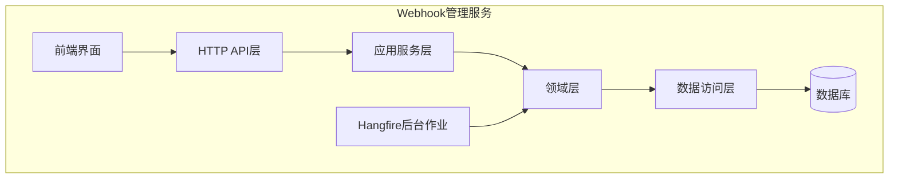
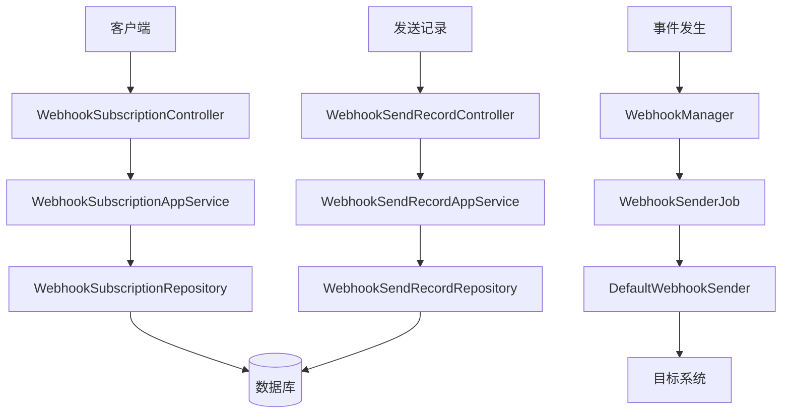
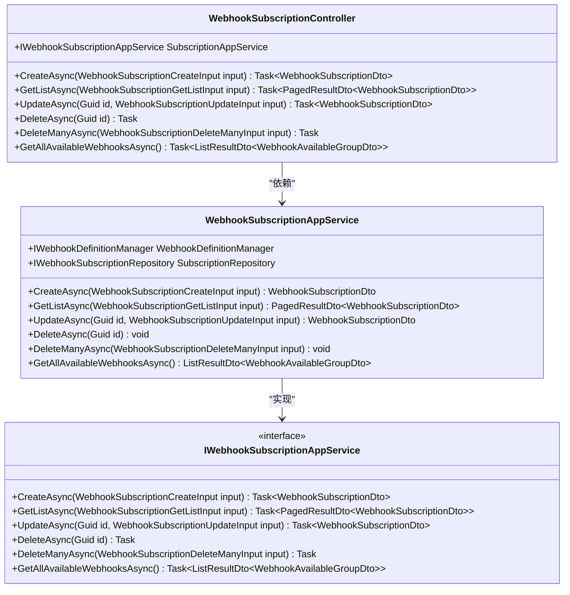
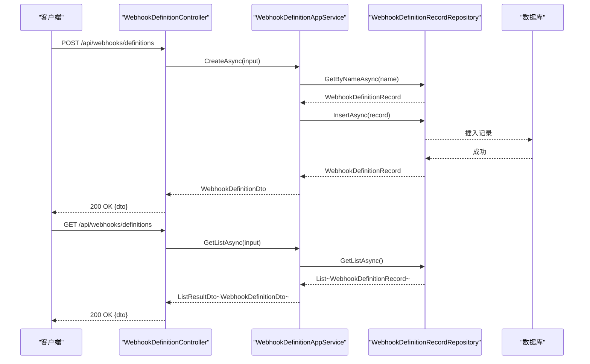
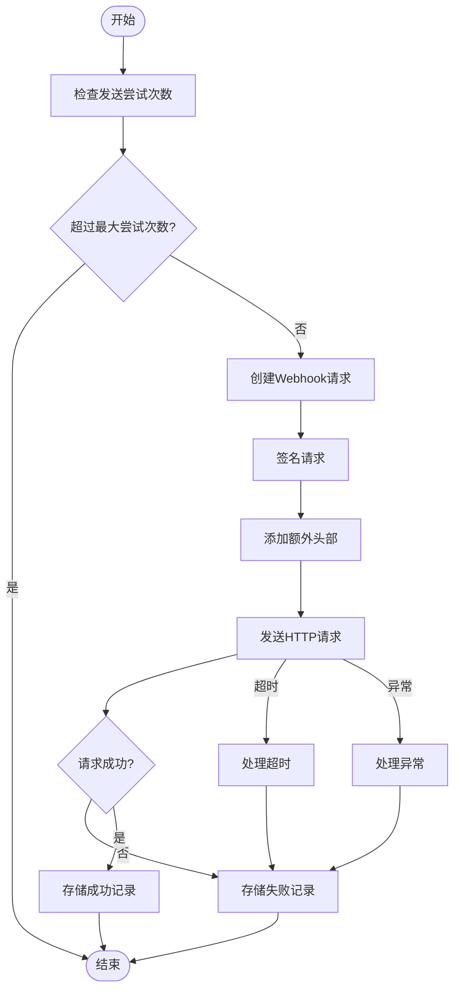
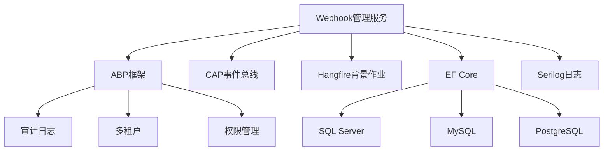

# Webhook管理服务

<cite>
**本文档中引用的文件**  
- [WebhookDefinitionController.cs](file://aspnet-core/modules/webhooks/LINGYUN.Abp.WebhooksManagement.HttpApi/LINGYUN/Abp/WebhooksManagement/Definitions/WebhookDefinitionController.cs)
- [WebhooksManagementPermissions.cs](file://aspnet-core/modules/webhooks/LINGYUN.Abp.WebhooksManagement.Application.Contracts/LINGYUN/Abp/WebhooksManagement/Authorization/WebhooksManagementPermissions.cs)
- [WebhookSubscriptionAppService.cs](file://aspnet-core/modules/webhooks/LINGYUN.Abp.WebhooksManagement.Application/LINGYUN/Abp/WebhooksManagement/WebhookSubscriptionAppService.cs)
- [WebhookSubscriptionController.cs](file://aspnet-core/modules/webhooks/LINGYUN.Abp.WebhooksManagement.HttpApi/LINGYUN/Abp/WebhooksManagement/WebhookSubscriptionController.cs)
- [WebhookSendAttemptStore.cs](file://aspnet-core/modules/webhooks/LINGYUN.Abp.WebhooksManagement.Domain/LINGYUN/Abp/WebhooksManagement/WebhookSendAttemptStore.cs)
- [DefaultWebhookSender.cs](file://aspnet-core/modules/webhooks/LINGYUN.Abp.Webhooks/LINGYUN/Abp/Webhooks/DefaultWebhookSender.cs)
- [WebhookSenderJob.cs](file://aspnet-core/modules/webhooks/LINGYUN.Abp.Webhooks/LINGYUN/Abp/Webhooks/BackgroundJobs/WebhookSenderJob.cs)
- [WebhooksManagementDomainModule.cs](file://aspnet-core/modules/webhooks/LINGYUN.Abp.WebhooksManagement.Domain/LINGYUN/Abp/WebhooksManagement/WebhooksManagementDomainModule.cs)
- [WebhookDefinitionRecord.cs](file://aspnet-core/modules/webhooks/LINGYUN.Abp.WebhooksManagement.Domain/LINGYUN/Abp/WebhooksManagement/WebhookDefinitionRecord.cs)
- [WebhookEventRecord.cs](file://aspnet-core/modules/webhooks/LINGYUN.Abp.WebhooksManagement.Domain/LINGYUN/Abp/WebhooksManagement/WebhookEventRecord.cs)
- [WebhookSendRecord.cs](file://aspnet-core/modules/webhooks/LINGYUN.Abp.WebhooksManagement.Domain/LINGYUN/Abp/WebhooksManagement/WebhookSendRecord.cs)
- [WebhookSubscription.cs](file://aspnet-core/modules/webhooks/LINGYUN.Abp.WebhooksManagement.Domain/LINGYUN/Abp/WebhooksManagement/WebhookSubscription.cs)
- [AbpUINavigationVueVbenAdminNavigationDefinitionProvider.cs](file://aspnet-core/modules/platform/LINGYUN.Abp.UI.Navigation.VueVbenAdmin/LINGYUN/Abp/UI/Navigation/VueVbenAdmin/AbpUINavigationVueVbenAdminNavigationDefinitionProvider.cs)
- [WebhookSendRecordController.cs](file://aspnet-core/modules/webhooks/LINGYUN.Abp.WebhooksManagement.HttpApi/LINGYUN/Abp/WebhooksManagement/WebhookSendRecordController.cs)
</cite>

## 目录
1. [简介](#简介)
2. [项目结构](#项目结构)
3. [核心组件](#核心组件)
4. [架构概述](#架构概述)
5. [详细组件分析](#详细组件分析)
6. [依赖分析](#依赖分析)
7. [性能考虑](#性能考虑)
8. [故障排除指南](#故障排除指南)
9. [结论](#结论)

## 简介
Webhook管理服务是一个基于ABP框架构建的微服务，旨在提供完整的Webhook订阅、事件推送和回调处理功能。该服务实现了事件驱动架构，支持系统间的松耦合集成，通过定义、订阅和管理Webhook来实现跨系统通信。服务包含完整的安全性考虑、重试策略、监控和调试工具，为开发者提供了创建和管理Webhook的完整解决方案。

## 项目结构
Webhook管理服务采用模块化设计，分为多个层次：应用层、领域层、HTTP API层和数据访问层。服务通过EF Core实现数据持久化，并集成Hangfire进行后台任务处理。前端界面通过Vue Vben Admin集成，提供了直观的管理界面。

**图示来源**
- [WebhooksManagementHttpApiModule.cs](file://aspnet-core/modules/webhooks/LINGYUN.Abp.WebhooksManagement.HttpApi/LINGYUN/Abp/WebhooksManagement/WebhooksManagementHttpApiModule.cs)
- [WebhooksManagementDomainModule.cs](file://aspnet-core/modules/webhooks/LINGYUN.Abp.WebhooksManagement.Domain/LINGYUN/Abp/WebhooksManagement/WebhooksManagementDomainModule.cs)

**节来源**
- [WebhooksManagementHttpApiModule.cs](file://aspnet-core/modules/webhooks/LINGYUN.Abp.WebhooksManagement.HttpApi/LINGYUN/Abp/WebhooksManagement/WebhooksManagementHttpApiModule.cs)
- [WebhooksManagementDomainModule.cs](file://aspnet-core/modules/webhooks/LINGYUN.Abp.WebhooksManagement.Domain/LINGYUN/Abp/WebhooksManagement/WebhooksManagementDomainModule.cs)

## 核心组件
Webhook管理服务的核心组件包括Webhook定义、订阅管理、事件推送和发送记录。服务通过`IWebhookSubscriptionAppService`接口提供订阅管理功能，通过`IWebhookDefinitionAppService`接口提供Webhook定义管理功能。事件推送由`DefaultWebhookSender`实现，发送记录通过`WebhookSendAttemptStore`进行存储和查询。

**节来源**
- [IWebhookSubscriptionAppService.cs](file://aspnet-core/modules/webhooks/LINGYUN.Abp.WebhooksManagement.Application.Contracts/LINGYUN/Abp/WebhooksManagement/IWebhookSubscriptionAppService.cs)
- [IWebhookDefinitionAppService.cs](file://aspnet-core/modules/webhooks/LINGYUN.Abp.WebhooksManagement.Application.Contracts/LINGYUN/Abp/WebhooksManagement/Definitions/IWebhookDefinitionAppService.cs)

## 架构概述
Webhook管理服务采用典型的分层架构，包括表现层、应用层、领域层和基础设施层。服务通过事件总线实现事件驱动架构，当系统事件发生时，会触发Webhook推送。服务支持多租户，每个租户可以独立管理自己的Webhook订阅。

**图示来源**
- [WebhookSubscriptionController.cs](file://aspnet-core/modules/webhooks/LINGYUN.Abp.WebhooksManagement.HttpApi/LINGYUN/Abp/WebhooksManagement/WebhookSubscriptionController.cs)
- [WebhookSubscriptionAppService.cs](file://aspnet-core/modules/webhooks/LINGYUN.Abp.WebhooksManagement.Application/LINGYUN/Abp/WebhooksManagement/WebhookSubscriptionAppService.cs)
- [WebhookSenderJob.cs](file://aspnet-core/modules/webhooks/LINGYUN.Abp.Webhooks/LINGYUN/Abp/Webhooks/BackgroundJobs/WebhookSenderJob.cs)
- [DefaultWebhookSender.cs](file://aspnet-core/modules/webhooks/LINGYUN.Abp.Webhooks/LINGYUN/Abp/Webhooks/DefaultWebhookSender.cs)

## 详细组件分析

### Webhook订阅管理分析
Webhook订阅管理组件负责处理Webhook订阅的创建、查询、更新和删除操作。组件通过`WebhookSubscriptionAppService`实现业务逻辑，通过`WebhookSubscriptionController`暴露HTTP API。

#### 对于面向对象组件：

**图示来源**
- [WebhookSubscriptionAppService.cs](file://aspnet-core/modules/webhooks/LINGYUN.Abp.WebhooksManagement.Application/LINGYUN/Abp/WebhooksManagement/WebhookSubscriptionAppService.cs)
- [WebhookSubscriptionController.cs](file://aspnet-core/modules/webhooks/LINGYUN.Abp.WebhooksManagement.HttpApi/LINGYUN/Abp/WebhooksManagement/WebhookSubscriptionController.cs)

### Webhook定义管理分析
Webhook定义管理组件负责管理Webhook的定义，包括创建、查询、更新和删除操作。组件通过`WebhookDefinitionAppService`实现业务逻辑，通过`WebhookDefinitionController`暴露HTTP API。

#### 对于API/服务组件：

**图示来源**
- [WebhookDefinitionController.cs](file://aspnet-core/modules/webhooks/LINGYUN.Abp.WebhooksManagement.HttpApi/LINGYUN/Abp/WebhooksManagement/Definitions/WebhookDefinitionController.cs)
- [WebhookDefinitionAppService.cs](file://aspnet-core/modules/webhooks/LINGYUN.Abp.WebhooksManagement.Application/LINGYUN/Abp/WebhooksManagement/Definitions/WebhookDefinitionAppService.cs)

### Webhook事件推送分析
Webhook事件推送组件负责将事件推送到订阅的端点。组件通过Hangfire后台作业`WebhookSenderJob`触发，使用`DefaultWebhookSender`执行实际的HTTP请求。

#### 对于复杂逻辑组件：

**图示来源**
- [WebhookSenderJob.cs](file://aspnet-core/modules/webhooks/LINGYUN.Abp.Webhooks/LINGYUN/Abp/Webhooks/BackgroundJobs/WebhookSenderJob.cs)
- [DefaultWebhookSender.cs](file://aspnet-core/modules/webhooks/LINGYUN.Abp.Webhooks/LINGYUN/Abp/Webhooks/DefaultWebhookSender.cs)

**节来源**
- [WebhookSenderJob.cs](file://aspnet-core/modules/webhooks/LINGYUN.Abp.Webhooks/LINGYUN/Abp/Webhooks/BackgroundJobs/WebhookSenderJob.cs)
- [DefaultWebhookSender.cs](file://aspnet-core/modules/webhooks/LINGYUN.Abp.Webhooks/LINGYUN/Abp/Webhooks/DefaultWebhookSender.cs)

## 依赖分析
Webhook管理服务依赖于多个ABP框架模块，包括审计日志、背景作业、实体框架核心等。服务通过CAP实现事件总线，与系统其他部分进行通信。数据库依赖于EF Core，支持多种数据库提供程序。

**图示来源**
- [WebhooksManagementDomainModule.cs](file://aspnet-core/modules/webhooks/LINGYUN.Abp.WebhooksManagement.Domain/LINGYUN/Abp/WebhooksManagement/WebhooksManagementDomainModule.cs)
- [go.mod](file://go.mod)

**节来源**
- [WebhooksManagementDomainModule.cs](file://aspnet-core/modules/webhooks/LINGYUN.Abp.WebhooksManagement.Domain/LINGYUN/Abp/WebhooksManagement/WebhooksManagementDomainModule.cs)

## 性能考虑
Webhook管理服务在设计时考虑了性能优化。服务使用Hangfire进行异步处理，避免阻塞主线程。数据库查询使用EF Core的异步方法，提高I/O效率。服务实现了缓存机制，减少对数据库的频繁访问。重试策略采用指数退避算法，避免对目标系统造成过大压力。

## 故障排除指南
当Webhook推送失败时，可以通过发送记录界面查看详细的错误信息。服务记录了HTTP状态码、响应内容和异常信息，帮助开发者定位问题。对于频繁失败的推送，服务会自动停止尝试，避免对系统造成影响。开发者可以通过重新发送功能手动重试失败的推送。

**节来源**
- [WebhookSendRecordController.cs](file://aspnet-core/modules/webhooks/LINGYUN.Abp.WebhooksManagement.HttpApi/LINGYUN/Abp/WebhooksManagement/WebhookSendRecordController.cs)
- [WebhookSendAttemptStore.cs](file://aspnet-core/modules/webhooks/LINGYUN.Abp.WebhooksManagement.Domain/LINGYUN/Abp/WebhooksManagement/WebhookSendAttemptStore.cs)

## 结论
Webhook管理服务提供了一个完整、可靠和可扩展的Webhook管理解决方案。服务通过清晰的分层架构和模块化设计，实现了Webhook订阅、事件推送和回调处理的核心功能。事件驱动架构的实现使得系统间能够松耦合集成，提高了系统的灵活性和可维护性。完善的安全性考虑、重试策略和监控工具确保了服务的稳定运行。通过直观的前端界面，开发者可以轻松地创建和管理Webhook，实现系统间的实时通信。