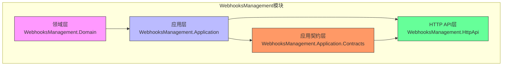
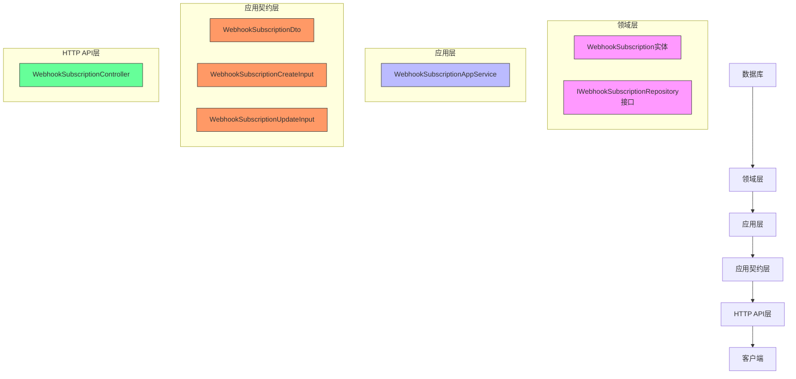
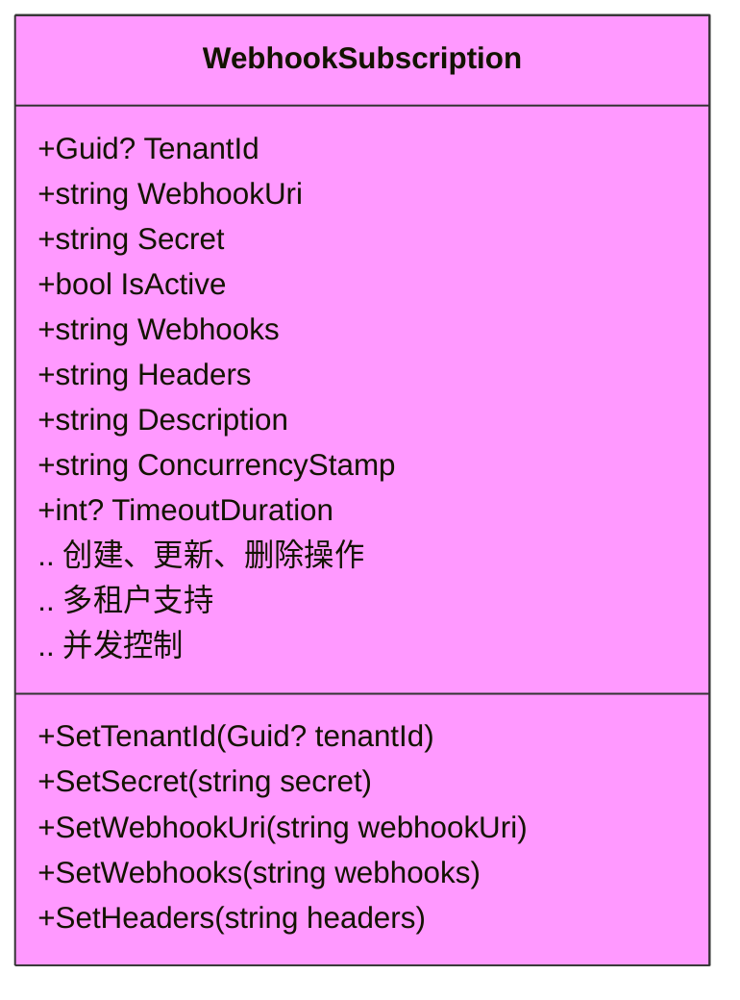
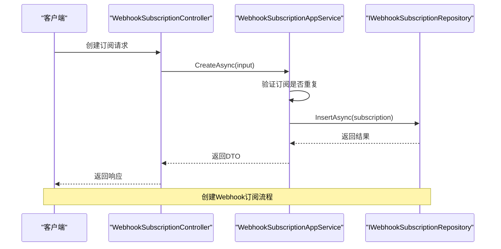
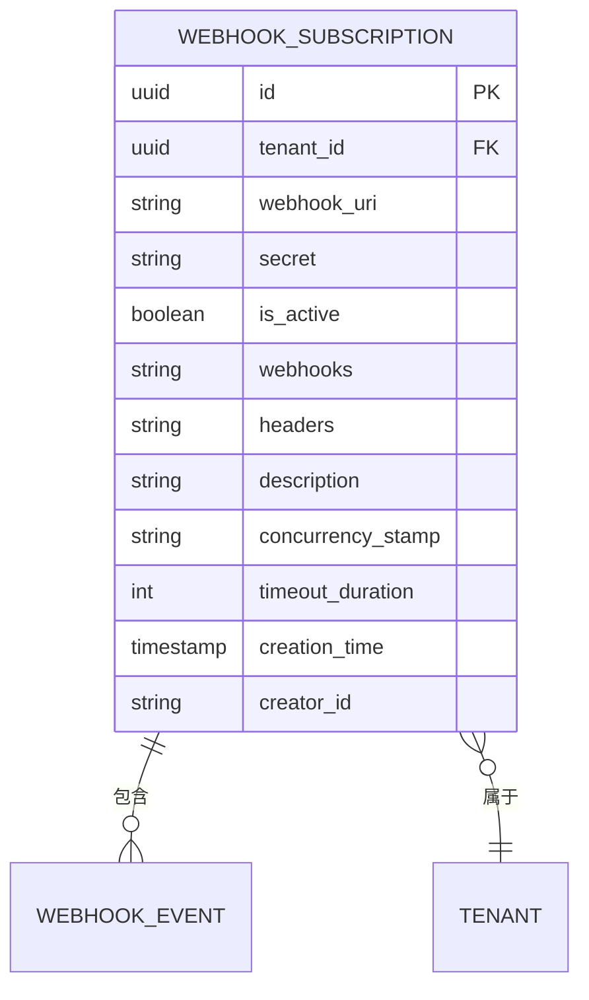
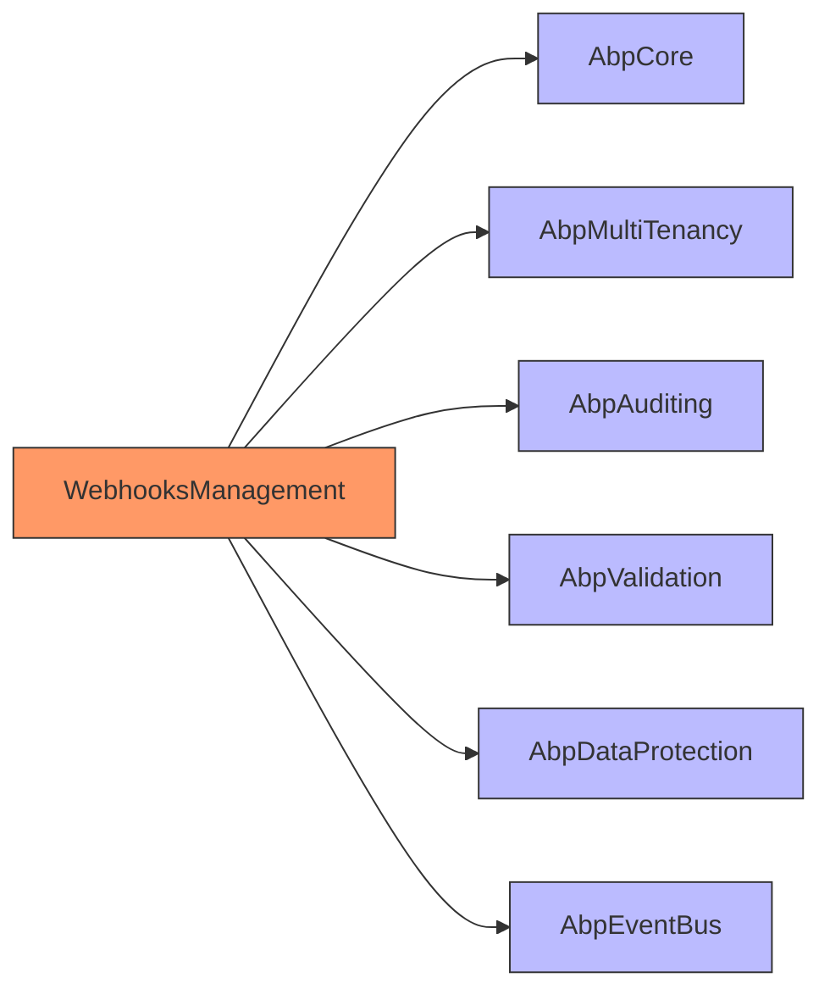

# Webhook订阅管理

<cite>
**本文档中引用的文件**  
- [WebhookSubscription.cs](file://aspnet-core/modules/webhooks/LINGYUN.Abp.WebhooksManagement.Domain/LINGYUN/Abp/WebhooksManagement/WebhookSubscription.cs)
- [WebhookSubscriptionAppService.cs](file://aspnet-core/modules/webhooks/LINGYUN.Abp.WebhooksManagement.Application/LINGYUN/Abp/WebhooksManagement/WebhookSubscriptionAppService.cs)
- [WebhookSubscriptionDto.cs](file://aspnet-core/modules/webhooks/LINGYUN.Abp.WebhooksManagement.Application.Contracts/LINGYUN/Abp/WebhooksManagement/WebhookSubscriptionDto.cs)
- [WebhookSubscriptionCreateOrUpdateInput.cs](file://aspnet-core/modules/webhooks/LINGYUN.Abp.WebhooksManagement.Application.Contracts/LINGYUN/Abp/WebhooksManagement/WebhookSubscriptionCreateOrUpdateInput.cs)
- [WebhookSubscriptionConsts.cs](file://aspnet-core/modules/webhooks/LINGYUN.Abp.WebhooksManagement.Domain.Shared/LINGYUN/Abp/WebhooksManagement/WebhookSubscriptionConsts.cs)
- [IWebhookSubscriptionRepository.cs](file://aspnet-core/modules/webhooks/LINGYUN.Abp.WebhooksManagement.Domain/LINGYUN/Abp/WebhooksManagement/IWebhookSubscriptionRepository.cs)
- [WebhookSubscriptionController.cs](file://aspnet-core/modules/webhooks/LINGYUN.Abp.WebhooksManagement.HttpApi/LINGYUN/Abp/WebhooksManagement/WebhookSubscriptionController.cs)
- [WebhooksManagementPermissions.cs](file://aspnet-core/modules/webhooks/LINGYUN.Abp.WebhooksManagement.Domain.Shared/LINGYUN/Abp/WebhooksManagement/WebhooksManagementPermissions.cs)
</cite>

## 目录
1. [简介](#简介)
2. [项目结构](#项目结构)
3. [核心组件](#核心组件)
4. [架构概述](#架构概述)
5. [详细组件分析](#详细组件分析)
6. [依赖分析](#依赖分析)
7. [性能考虑](#性能考虑)
8. [故障排除指南](#故障排除指南)
9. [结论](#结论)

## 简介
本文档详细介绍了ABP Next Admin项目中的Webhook订阅管理系统。该系统提供了一套完整的机制，用于创建、更新、删除和查询Webhook订阅，支持多租户环境下的订阅隔离，具备完善的权限控制和状态管理功能。系统通过分层架构设计，将数据模型、业务逻辑和API接口清晰分离，确保了系统的可维护性和可扩展性。

## 项目结构
Webhook订阅管理功能分布在多个模块中，遵循ABP框架的分层架构原则。主要模块包括领域层、应用层、应用契约层和HTTP API层，每个模块负责不同的职责，共同构成了完整的Webhook订阅管理功能。

**图源**  
- [WebhookSubscription.cs](file://aspnet-core/modules/webhooks/LINGYUN.Abp.WebhooksManagement.Domain/LINGYUN/Abp/WebhooksManagement/WebhookSubscription.cs)
- [WebhookSubscriptionAppService.cs](file://aspnet-core/modules/webhooks/LINGYUN.Abp.WebhooksManagement.Application/LINGYUN/Abp/WebhooksManagement/WebhookSubscriptionAppService.cs)
- [WebhookSubscriptionDto.cs](file://aspnet-core/modules/webhooks/LINGYUN.Abp.WebhooksManagement.Application.Contracts/LINGYUN/Abp/WebhooksManagement/WebhookSubscriptionDto.cs)
- [WebhookSubscriptionController.cs](file://aspnet-core/modules/webhooks/LINGYUN.Abp.WebhooksManagement.HttpApi/LINGYUN/Abp/WebhooksManagement/WebhookSubscriptionController.cs)

**本节来源**  
- [WebhookSubscription.cs](file://aspnet-core/modules/webhooks/LINGYUN.Abp.WebhooksManagement.Domain/LINGYUN/Abp/WebhooksManagement/WebhookSubscription.cs)
- [WebhookSubscriptionAppService.cs](file://aspnet-core/modules/webhooks/LINGYUN.Abp.WebhooksManagement.Application/LINGYUN/Abp/WebhooksManagement/WebhookSubscriptionAppService.cs)

## 核心组件
Webhook订阅管理系统的核心组件包括订阅实体、应用服务、数据传输对象和存储库接口。这些组件协同工作，实现了Webhook订阅的全生命周期管理。

**本节来源**  
- [WebhookSubscription.cs](file://aspnet-core/modules/webhooks/LINGYUN.Abp.WebhooksManagement.Domain/LINGYUN/Abp/WebhooksManagement/WebhookSubscription.cs)
- [WebhookSubscriptionAppService.cs](file://aspnet-core/modules/webhooks/LINGYUN.Abp.WebhooksManagement.Application/LINGYUN/Abp/WebhooksManagement/WebhookSubscriptionAppService.cs)
- [WebhookSubscriptionDto.cs](file://aspnet-core/modules/webhooks/LINGYUN.Abp.WebhooksManagement.Application.Contracts/LINGYUN/Abp/WebhooksManagement/WebhookSubscriptionDto.cs)
- [IWebhookSubscriptionRepository.cs](file://aspnet-core/modules/webhooks/LINGYUN.Abp.WebhooksManagement.Domain/LINGYUN/Abp/WebhooksManagement/IWebhookSubscriptionRepository.cs)

## 架构概述
Webhook订阅管理系统采用典型的分层架构，从下到上依次为领域层、应用层、应用契约层和HTTP API层。这种分层设计确保了关注点分离，提高了代码的可维护性和可测试性。

**图源**  
- [WebhookSubscription.cs](file://aspnet-core/modules/webhooks/LINGYUN.Abp.WebhooksManagement.Domain/LINGYUN/Abp/WebhooksManagement/WebhookSubscription.cs)
- [IWebhookSubscriptionRepository.cs](file://aspnet-core/modules/webhooks/LINGYUN.Abp.WebhooksManagement.Domain/LINGYUN/Abp/WebhooksManagement/IWebhookSubscriptionRepository.cs)
- [WebhookSubscriptionAppService.cs](file://aspnet-core/modules/webhooks/LINGYUN.Abp.WebhooksManagement.Application/LINGYUN/Abp/WebhooksManagement/WebhookSubscriptionAppService.cs)
- [WebhookSubscriptionDto.cs](file://aspnet-core/modules/webhooks/LINGYUN.Abp.WebhooksManagement.Application.Contracts/LINGYUN/Abp/WebhooksManagement/WebhookSubscriptionDto.cs)
- [WebhookSubscriptionCreateOrUpdateInput.cs](file://aspnet-core/modules/webhooks/LINGYUN.Abp.WebhooksManagement.Application.Contracts/LINGYUN/Abp/WebhooksManagement/WebhookSubscriptionCreateOrUpdateInput.cs)
- [WebhookSubscriptionController.cs](file://aspnet-core/modules/webhooks/LINGYUN.Abp.WebhooksManagement.HttpApi/LINGYUN/Abp/WebhooksManagement/WebhookSubscriptionController.cs)

## 详细组件分析

### 订阅实体分析
Webhook订阅实体是系统的核心数据模型，定义了订阅的所有属性和行为。实体采用保护性编程原则，所有属性的修改都通过专门的方法进行，确保数据的一致性和完整性。

**图源**  
- [WebhookSubscription.cs](file://aspnet-core/modules/webhooks/LINGYUN.Abp.WebhooksManagement.Domain/LINGYUN/Abp/WebhooksManagement/WebhookSubscription.cs)
- [WebhookSubscriptionConsts.cs](file://aspnet-core/modules/webhooks/LINGYUN.Abp.WebhooksManagement.Domain.Shared/LINGYUN/Abp/WebhooksManagement/WebhookSubscriptionConsts.cs)

### 应用服务分析
Webhook订阅应用服务是业务逻辑的核心，负责处理所有与订阅相关的操作。服务通过依赖注入获取所需的组件，并在事务上下文中执行操作，确保数据的一致性。

**图源**  
- [WebhookSubscriptionAppService.cs](file://aspnet-core/modules/webhooks/LINGYUN.Abp.WebhooksManagement.Application/LINGYUN/Abp/WebhooksManagement/WebhookSubscriptionAppService.cs)
- [WebhookSubscriptionController.cs](file://aspnet-core/modules/webhooks/LINGYUN.Abp.WebhooksManagement.HttpApi/LINGYUN/Abp/WebhooksManagement/WebhookSubscriptionController.cs)
- [IWebhookSubscriptionRepository.cs](file://aspnet-core/modules/webhooks/LINGYUN.Abp.WebhooksManagement.Domain/LINGYUN/Abp/WebhooksManagement/IWebhookSubscriptionRepository.cs)

### 数据模型分析
Webhook订阅的数据模型设计考虑了灵活性和可扩展性。订阅可以关联多个Webhook事件，支持自定义HTTP头信息，并提供了描述字段用于记录订阅的用途。

**图源**  
- [WebhookSubscription.cs](file://aspnet-core/modules/webhooks/LINGYUN.Abp.WebhooksManagement.Domain/LINGYUN/Abp/WebhooksManagement/WebhookSubscription.cs)
- [WebhookSubscriptionDto.cs](file://aspnet-core/modules/webhooks/LINGYUN.Abp.WebhooksManagement.Application.Contracts/LINGYUN/Abp/WebhooksManagement/WebhookSubscriptionDto.cs)

**本节来源**  
- [WebhookSubscription.cs](file://aspnet-core/modules/webhooks/LINGYUN.Abp.WebhooksManagement.Domain/LINGYUN/Abp/WebhooksManagement/WebhookSubscription.cs)
- [WebhookSubscriptionAppService.cs](file://aspnet-core/modules/webhooks/LINGYUN.Abp.WebhooksManagement.Application/LINGYUN/Abp/WebhooksManagement/WebhookSubscriptionAppService.cs)
- [WebhookSubscriptionDto.cs](file://aspnet-core/modules/webhooks/LINGYUN.Abp.WebhooksManagement.Application.Contracts/LINGYUN/Abp/WebhooksManagement/WebhookSubscriptionDto.cs)
- [WebhookSubscriptionCreateOrUpdateInput.cs](file://aspnet-core/modules/webhooks/LINGYUN.Abp.WebhooksManagement.Application.Contracts/LINGYUN/Abp/WebhooksManagement/WebhookSubscriptionCreateOrUpdateInput.cs)

## 依赖分析
Webhook订阅管理系统依赖于ABP框架的核心组件和其他相关模块，形成了一个完整的生态系统。

**图源**  
- [WebhookSubscription.cs](file://aspnet-core/modules/webhooks/LINGYUN.Abp.WebhooksManagement.Domain/LINGYUN/Abp/WebhooksManagement/WebhookSubscription.cs)
- [WebhookSubscriptionAppService.cs](file://aspnet-core/modules/webhooks/LINGYUN.Abp.WebhooksManagement.Application/LINGYUN/Abp/WebhooksManagement/WebhookSubscriptionAppService.cs)

**本节来源**  
- [WebhookSubscription.cs](file://aspnet-core/modules/webhooks/LINGYUN.Abp.WebhooksManagement.Domain/LINGYUN/Abp/WebhooksManagement/WebhookSubscription.cs)
- [WebhookSubscriptionAppService.cs](file://aspnet-core/modules/webhooks/LINGYUN.Abp.WebhooksManagement.Application/LINGYUN/Abp/WebhooksManagement/WebhookSubscriptionAppService.cs)

## 性能考虑
Webhook订阅管理系统在设计时考虑了性能优化，通过以下方式确保系统的高效运行：
- 使用规范模式（Specification Pattern）优化查询性能
- 在关键操作上使用单元工作模式（Unit of Work）确保事务一致性
- 通过并发戳（Concurrency Stamp）机制防止并发更新冲突
- 对频繁查询的字段建立适当的数据库索引

## 故障排除指南
在使用Webhook订阅管理系统时，可能会遇到以下常见问题：

| 问题 | 可能原因 | 解决方案 |
|------|---------|---------|
| 创建订阅失败 | 订阅已存在 | 检查是否已存在相同URI和Webhook事件的订阅 |
| 更新订阅失败 | 并发冲突 | 获取最新的并发戳后重试操作 |
| 查询性能低下 | 数据量过大 | 使用分页参数限制返回结果数量 |
| 权限不足 | 未授权 | 检查用户是否具有相应的权限 |

**本节来源**  
- [WebhookSubscriptionAppService.cs](file://aspnet-core/modules/webhooks/LINGYUN.Abp.WebhooksManagement.Application/LINGYUN/Abp/WebhooksManagement/WebhookSubscriptionAppService.cs)
- [WebhooksManagementPermissions.cs](file://aspnet-core/modules/webhooks/LINGYUN.Abp.WebhooksManagement.Domain.Shared/LINGYUN/Abp/WebhooksManagement/WebhooksManagementPermissions.cs)

## 结论
Webhook订阅管理系统提供了一套完整、安全、可扩展的解决方案，用于管理Webhook订阅的全生命周期。系统通过清晰的分层架构、完善的权限控制和多租户支持，满足了复杂企业应用的需求。通过遵循ABP框架的最佳实践，系统具有良好的可维护性和可扩展性，为未来的功能扩展奠定了坚实的基础。