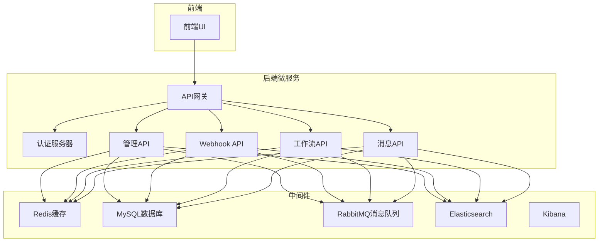
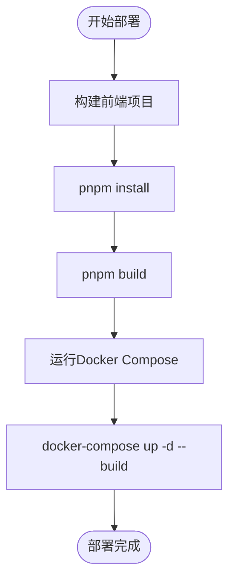

# 部署与配置

<cite>
**本文档中引用的文件**  
- [docker-compose.yml](file://docker-compose.yml)
- [docker-compose.override.yml](file://docker-compose.override.yml)
- [docker-compose.override.configuration.yml](file://docker-compose.override.configuration.yml)
- [docker-compose.middleware.yml](file://docker-compose.middleware.yml)
- [deploy.ps1](file://deploy/deploy.ps1)
- [tye.yaml](file://tye.yaml)
- [aspnet-core/framework/dapr/LINGYUN.Abp.Dapr.Client/LINGYUN/Abp/Dapr/Client/DaprRemoteServiceConfigurationExtensions.cs](file://aspnet-core/framework/dapr/LINGYUN.Abp.Dapr.Client/LINGYUN/Abp/Dapr/Client/DaprRemoteServiceConfigurationExtensions.cs)
</cite>

## 目录
1. [简介](#简介)
2. [项目结构](#项目结构)
3. [Docker容器化部署](#docker容器化部署)
4. [Dapr集成实现](#dapr集成实现)
5. [多环境配置差异](#多环境配置差异)
6. [性能调优与资源限制](#性能调优与资源限制)
7. [健康检查配置](#健康检查配置)
8. [部署检查清单](#部署检查清单)
9. [故障排查指南](#故障排查指南)

## 简介
本文档详细说明了ABP Next Admin项目的部署与配置方案，重点涵盖Docker容器化部署的最佳实践、Dapr集成的实现方式、不同环境的配置差异、性能调优参数、资源限制和健康检查配置。通过本指南，开发者可以快速部署和配置Webhook服务，并确保系统在不同环境下的稳定运行。

## 项目结构
该项目采用微服务架构，包含多个独立的服务模块，通过Docker Compose进行容器化部署。主要服务包括认证服务器、API网关、前端UI、数据库、缓存、消息队列等。项目使用Docker Compose文件定义服务依赖关系和网络配置，确保各服务能够正确通信。



**Diagram sources**
- [docker-compose.yml](file://docker-compose.yml)
- [docker-compose.override.yml](file://docker-compose.override.yml)
- [docker-compose.middleware.yml](file://docker-compose.middleware.yml)

**Section sources**
- [docker-compose.yml](file://docker-compose.yml)
- [docker-compose.override.yml](file://docker-compose.override.yml)
- [docker-compose.middleware.yml](file://docker-compose.middleware.yml)

## Docker容器化部署
项目使用Docker Compose进行容器化部署，通过多个YAML文件组合配置。主配置文件`docker-compose.yml`定义了所有服务的基本配置，包括端口映射、环境变量和网络设置。`docker-compose.override.yml`文件用于覆盖默认配置，添加构建上下文和卷挂载。`docker-compose.middleware.yml`文件定义了中间件服务，如数据库、缓存和消息队列。

部署脚本`deploy.ps1`自动化了前端构建和Docker Compose启动过程。该脚本首先复制Dockerfile，然后进入前端目录执行pnpm安装和构建命令，最后运行Docker Compose命令启动所有服务。



**Diagram sources**
- [deploy.ps1](file://deploy/deploy.ps1)
- [docker-compose.yml](file://docker-compose.yml)
- [docker-compose.override.yml](file://docker-compose.override.yml)

**Section sources**
- [deploy.ps1](file://deploy/deploy.ps1)
- [docker-compose.yml](file://docker-compose.yml)
- [docker-compose.override.yml](file://docker-compose.override.yml)

## Dapr集成实现
项目通过Dapr（Distributed Application Runtime）实现微服务间的通信和分布式应用模式。Dapr客户端集成在`LINGYUN.Abp.Dapr.Client`模块中，提供了远程服务配置扩展方法。`DaprRemoteServiceConfigurationExtensions`类定义了`AppId`常量，用于设置和获取远程服务的应用ID。

Dapr客户端工厂`DefaultDaprClientFactory`负责创建和管理Dapr客户端实例。该工厂使用`IOptionsMonitor<DaprClientFactoryOptions>`监控配置变化，并通过`ConcurrentDictionary`缓存客户端实例以提高性能。`DaprClientBuilderExtensions`提供了配置Dapr客户端的扩展方法，支持直接配置客户端或配置构建器。

```mermaid
classDiagram
    class DaprRemoteServiceConfigurationExtensions {
        +string AppId
        +string GetAppId(RemoteServiceConfiguration configuration