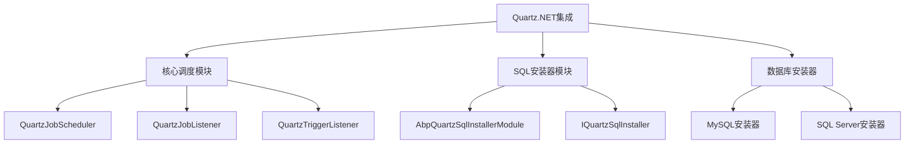
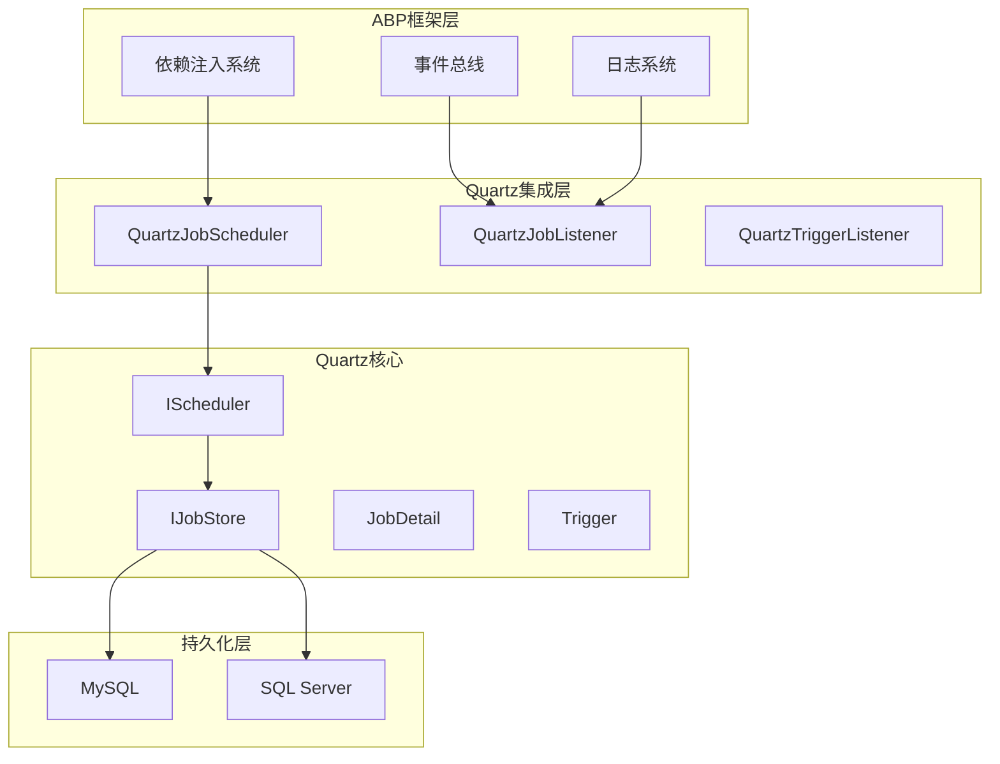
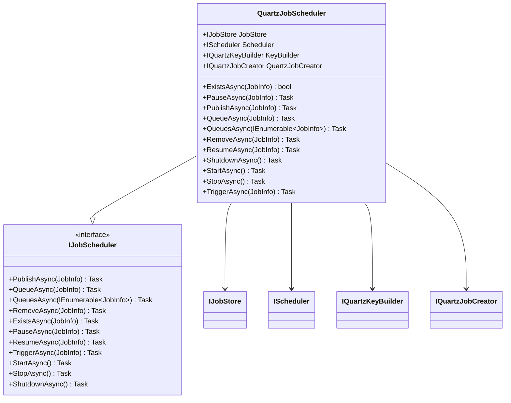
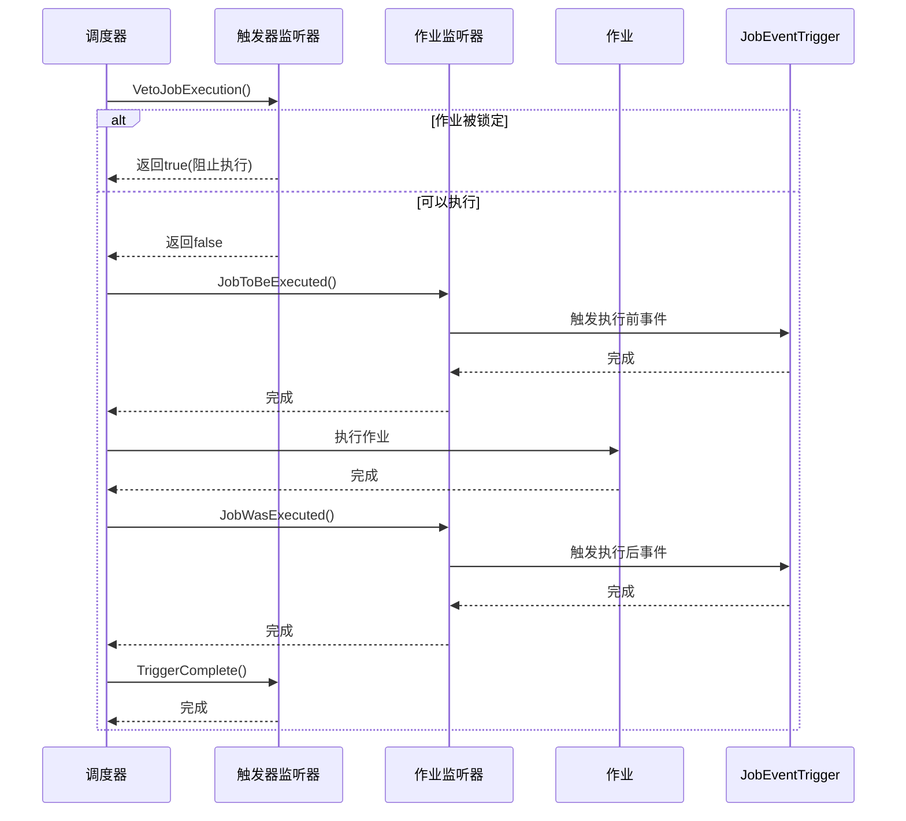
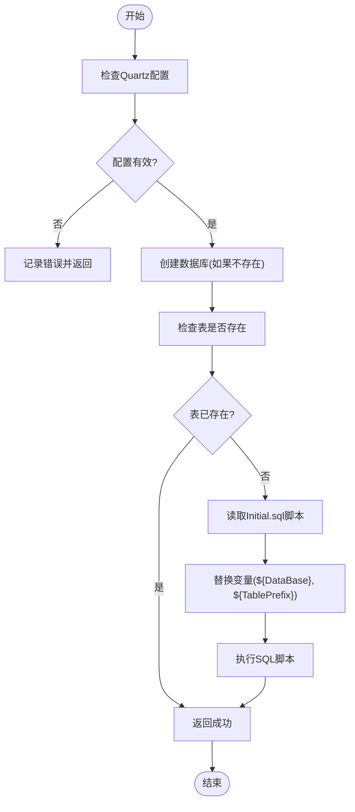

# Quartz.NET集成

<cite>
**本文档引用的文件**  
- [AbpBackgroundTasksQuartzModule.cs](file://aspnet-core/modules/task-management/LINGYUN.Abp.BackgroundTasks.Quartz/LINGYUN/Abp/BackgroundTasks/Quartz/AbpBackgroundTasksQuartzModule.cs)
- [AbpQuartzSqlInstallerModule.cs](file://aspnet-core/modules/task-management/LINGYUN.Abp.Quartz.SqlInstaller/LINGYUN/Abp/Quartz/SqlInstaller/AbpQuartzSqlInstallerModule.cs)
- [IQuartzSqlInstaller.cs](file://aspnet-core/modules/task-management/LINGYUN.Abp.Quartz.SqlInstaller/LINGYUN/Abp/Quartz/SqlInstaller/IQuartzSqlInstaller.cs)
- [MySqlQuartzSqlInstaller.cs](file://aspnet-core/modules/task-management/LINGYUN.Abp.Quartz.MySqlInstaller/LINGYUN/Abp/Quartz/MySqlInstaller/MySqlQuartzSqlInstaller.cs)
- [SqlServerQuartzSqlInstaller.cs](file://aspnet-core/modules/task-management/LINGYUN.Abp.Quartz.SqlServerInstaller/LINGYUN/Abp/Quartz/SqlServerInstaller/SqlServerQuartzSqlInstaller.cs)
- [QuartzJobScheduler.cs](file://aspnet-core/modules/task-management/LINGYUN.Abp.BackgroundTasks.Quartz/LINGYUN/Abp/BackgroundTasks/Quartz/QuartzJobScheduler.cs)
- [QuartzJobListener.cs](file://aspnet-core/modules/task-management/LINGYUN.Abp.BackgroundTasks.Quartz/LINGYUN/Abp/BackgroundTasks/Quartz/QuartzJobListener.cs)
- [QuartzTriggerListener.cs](file://aspnet-core/modules/task-management/LINGYUN.Abp.BackgroundTasks.Quartz/LINGYUN/Abp/BackgroundTasks/Quartz/QuartzTriggerListener.cs)
- [AbpQuartzSqlInstallerOptions.cs](file://aspnet-core/modules/task-management/LINGYUN.Abp.Quartz.SqlInstaller/LINGYUN/Abp/Quartz/SqlInstaller/AbpQuartzSqlInstallerOptions.cs)
- [appsettings.Development.json](file://aspnet-core/services/LY.MicroService.TaskManagement.HttpApi.Host/appsettings.Development.json)
</cite>

## 目录
1. [引言](#引言)
2. [项目结构](#项目结构)
3. [核心组件](#核心组件)
4. [架构概述](#架构概述)
5. [详细组件分析](#详细组件分析)
6. [依赖分析](#依赖分析)
7. [性能考虑](#性能考虑)
8. [故障排除指南](#故障排除指南)
9. [结论](#结论)

## 引言
本文档详细阐述了Quartz.NET在ABP框架中的集成机制，重点介绍作业调度、持久化存储、集群模式配置以及与ABP依赖注入系统的整合。文档涵盖从数据库初始化到作业生命周期管理的完整流程，并提供实际应用示例。

## 项目结构
Quartz.NET集成主要分布在`task-management`模块中，包含核心调度器、SQL安装器和数据库特定实现。结构如下：



**图示来源**  
- [AbpBackgroundTasksQuartzModule.cs](file://aspnet-core/modules/task-management/LINGYUN.Abp.BackgroundTasks.Quartz/LINGYUN/Abp/BackgroundTasks/Quartz/AbpBackgroundTasksQuartzModule.cs)
- [AbpQuartzSqlInstallerModule.cs](file://aspnet-core/modules/task-management/LINGYUN.Abp.Quartz.SqlInstaller/LINGYUN/Abp/Quartz/SqlInstaller/AbpQuartzSqlInstallerModule.cs)
- [IQuartzSqlInstaller.cs](file://aspnet-core/modules/task-management/LINGYUN.Abp.Quartz.SqlInstaller/LINGYUN/Abp/Quartz/SqlInstaller/IQuartzSqlInstaller.cs)

**本节来源**  
- [AbpBackgroundTasksQuartzModule.cs](file://aspnet-core/modules/task-management/LINGYUN.Abp.BackgroundTasks.Quartz/LINGYUN/Abp/BackgroundTasks/Quartz/AbpBackgroundTasksQuartzModule.cs)
- [AbpQuartzSqlInstallerModule.cs](file://aspnet-core/modules/task-management/LINGYUN.Abp.Quartz.SqlInstaller/LINGYUN/Abp/Quartz/SqlInstaller/AbpQuartzSqlInstallerModule.cs)

## 核心组件
系统通过`QuartzJobScheduler`实现ABP的`IJobScheduler`接口，提供完整的作业调度功能。`QuartzJobListener`和`QuartzTriggerListener`用于监听作业执行生命周期。`IQuartzSqlInstaller`接口及其实现负责数据库初始化。

**本节来源**  
- [QuartzJobScheduler.cs](file://aspnet-core/modules/task-management/LINGYUN.Abp.BackgroundTasks.Quartz/LINGYUN/Abp/BackgroundTasks/Quartz/QuartzJobScheduler.cs)
- [QuartzJobListener.cs](file://aspnet-core/modules/task-management/LINGYUN.Abp.BackgroundTasks.Quartz/LINGYUN/Abp/BackgroundTasks/Quartz/QuartzJobListener.cs)
- [QuartzTriggerListener.cs](file://aspnet-core/modules/task-management/LINGYUN.Abp.BackgroundTasks.Quartz/LINGYUN/Abp/BackgroundTasks/Quartz/QuartzTriggerListener.cs)

## 架构概述
系统采用分层架构，将Quartz调度器与ABP框架深度集成。配置层通过`AbpQuartzOptions`管理Quartz属性，持久化层通过`JobStore`实现数据存储，调度层通过`IScheduler`提供作业管理功能。



**图示来源**  
- [QuartzJobScheduler.cs](file://aspnet-core/modules/task-management/LINGYUN.Abp.BackgroundTasks.Quartz/LINGYUN/Abp/BackgroundTasks/Quartz/QuartzJobScheduler.cs)
- [QuartzJobListener.cs](file://aspnet-core/modules/task-management/LINGYUN.Abp.BackgroundTasks.Quartz/LINGYUN/Abp/BackgroundTasks/Quartz/QuartzJobListener.cs)
- [QuartzTriggerListener.cs](file://aspnet-core/modules/task-management/LINGYUN.Abp.BackgroundTasks.Quartz/LINGYUN/Abp/BackgroundTasks/Quartz/QuartzTriggerListener.cs)

## 详细组件分析

### 核心调度器分析
`QuartzJobScheduler`作为核心调度组件，实现了`IJobScheduler`接口，提供作业的创建、删除、暂停、恢复等操作。



**图示来源**  
- [QuartzJobScheduler.cs](file://aspnet-core/modules/task-management/LINGYUN.Abp.BackgroundTasks.Quartz/LINGYUN/Abp/BackgroundTasks/Quartz/QuartzJobScheduler.cs)

**本节来源**  
- [QuartzJobScheduler.cs](file://aspnet-core/modules/task-management/LINGYUN.Abp.BackgroundTasks.Quartz/LINGYUN/Abp/BackgroundTasks/Quartz/QuartzJobScheduler.cs)

### 作业监听器分析
`QuartzJobListener`和`QuartzTriggerListener`分别监听作业执行和触发器事件，实现作业执行前后的业务逻辑处理。



**图示来源**  
- [QuartzJobListener.cs](file://aspnet-core/modules/task-management/LINGYUN.Abp.BackgroundTasks.Quartz/LINGYUN/Abp/BackgroundTasks/Quartz/QuartzJobListener.cs)
- [QuartzTriggerListener.cs](file://aspnet-core/modules/task-management/LINGYUN.Abp.BackgroundTasks.Quartz/LINGYUN/Abp/BackgroundTasks/Quartz/QuartzTriggerListener.cs)

**本节来源**  
- [QuartzJobListener.cs](file://aspnet-core/modules/task-management/LINGYUN.Abp.BackgroundTasks.Quartz/LINGYUN/Abp/BackgroundTasks/Quartz/QuartzJobListener.cs)
- [QuartzTriggerListener.cs](file://aspnet-core/modules/task-management/LINGYUN.Abp.BackgroundTasks.Quartz/LINGYUN/Abp/BackgroundTasks/Quartz/QuartzTriggerListener.cs)

### 数据库初始化分析
系统通过`IQuartzSqlInstaller`接口实现数据库初始化，支持MySQL和SQL Server两种数据库。



**图示来源**  
- [MySqlQuartzSqlInstaller.cs](file://aspnet-core/modules/task-management/LINGYUN.Abp.Quartz.MySqlInstaller/LINGYUN/Abp/Quartz/MySqlInstaller/MySqlQuartzSqlInstaller.cs)
- [SqlServerQuartzSqlInstaller.cs](file://aspnet-core/modules/task-management/LINGYUN.Abp.Quartz.SqlServerInstaller/LINGYUN/Abp/Quartz/SqlServerInstaller/SqlServerQuartzSqlInstaller.cs)

**本节来源**  
- [MySqlQuartzSqlInstaller.cs](file://aspnet-core/modules/task-management/LINGYUN.Abp.Quartz.MySqlInstaller/LINGYUN/Abp/Quartz/MySqlInstaller/MySqlQuartzSqlInstaller.cs)
- [SqlServerQuartzSqlInstaller.cs](file://aspnet-core/modules/task-management/LINGYUN.Abp.Quartz.SqlServerInstaller/LINGYUN/Abp/Quartz/SqlServerInstaller/SqlServerQuartzSqlInstaller.cs)

## 依赖分析
系统依赖关系清晰，各组件职责分明。核心依赖包括Quartz.NET库、ABP框架、数据库驱动和虚拟文件系统。

```mermaid
graph TD
    A[QuartzJobScheduler] --> B[Quartz