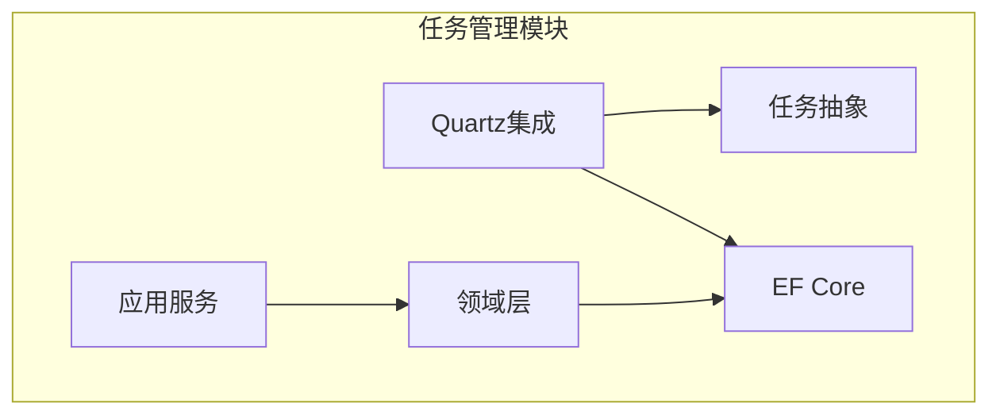
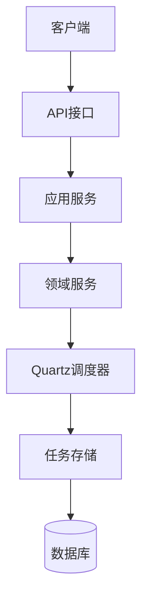
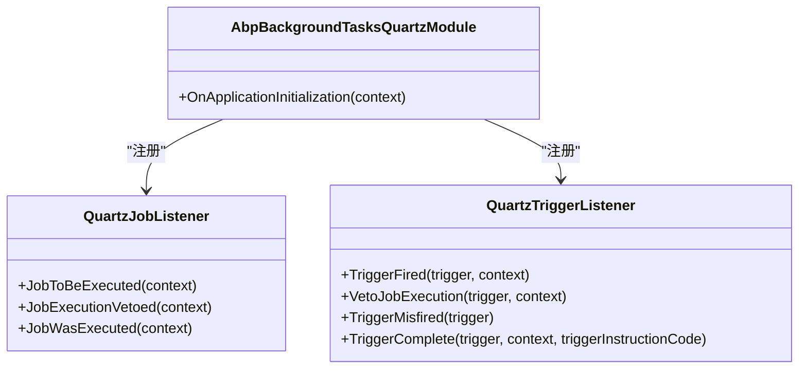
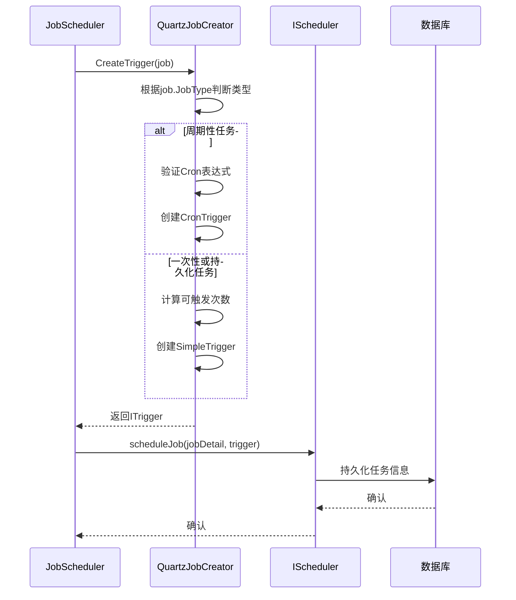
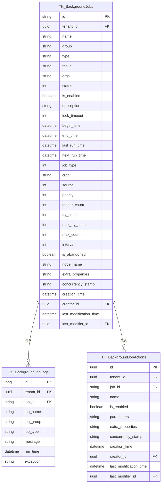
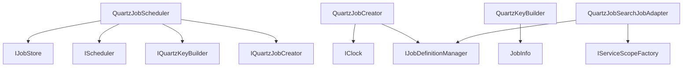

# 任务持久化

<cite>
**本文档引用的文件**
- [QuartzJobScheduler.cs](file://aspnet-core/modules/task-management/LINGYUN.Abp.BackgroundTasks.Quartz/LINGYUN/Abp/BackgroundTasks/Quartz/QuartzJobScheduler.cs)
- [QuartzJobCreator.cs](file://aspnet-core/modules/task-management/LINGYUN.Abp.BackgroundTasks.Quartz/LINGYUN/Abp/BackgroundTasks/Quartz/QuartzJobCreator.cs)
- [JobInfo.cs](file://aspnet-core/modules/task-management/LINGYUN.Abp.BackgroundTasks.Abstractions/LINGYUN/Abp/BackgroundTasks/JobInfo.cs)
- [AbpBackgroundTasksQuartzModule.cs](file://aspnet-core/modules/task-management/LINGYUN.Abp.BackgroundTasks.Quartz/LINGYUN/Abp/BackgroundTasks/Quartz/AbpBackgroundTasksQuartzModule.cs)
- [Initial-Task-Management.cs](file://aspnet-core/migrations/LY.MicroService.TaskManagement.EntityFrameworkCore/Migrations/20230112021621_Initial-Task-Management.cs)
- [QuartzKeyBuilder.cs](file://aspnet-core/modules/task-management/LINGYUN.Abp.BackgroundTasks.Quartz/LINGYUN/Abp/BackgroundTasks/Quartz/QuartzKeyBuilder.cs)
- [QuartzJobSearchJobAdapter.cs](file://aspnet-core/modules/task-management/LINGYUN.Abp.BackgroundTasks.Quartz/LINGYUN/Abp/BackgroundTasks/Quartz/QuartzJobSearchJobAdapter.cs)
</cite>

## 目录
1. [简介](#简介)
2. [项目结构](#项目结构)
3. [核心组件](#核心组件)
4. [架构概述](#架构概述)
5. [详细组件分析](#详细组件分析)
6. [依赖分析](#依赖分析)
7. [性能考虑](#性能考虑)
8. [故障排除指南](#故障排除指南)
9. [结论](#结论)

## 简介
本文档详细介绍了ABP Next Admin项目中基于Quartz的任务持久化机制。文档深入探讨了如何通过AdoJobStore实现任务的持久化存储，包括数据库表结构设计、连接字符串配置以及在服务重启后保持任务状态一致性的实现机制。同时，文档还涵盖了不同数据库的支持情况、数据访问优化和故障恢复策略。

## 项目结构
任务持久化功能主要分布在任务管理模块中，涉及多个子模块的协同工作。核心功能由Quartz集成模块实现，而任务数据的持久化则通过Entity Framework Core与数据库交互。

**图表来源**
- [QuartzJobScheduler.cs](file://aspnet-core/modules/task-management/LINGYUN.Abp.BackgroundTasks.Quartz/LINGYUN/Abp/BackgroundTasks/Quartz/QuartzJobScheduler.cs)
- [JobInfo.cs](file://aspnet-core/modules/task-management/LINGYUN.Abp.BackgroundTasks.Abstractions/LINGYUN/Abp/BackgroundTasks/JobInfo.cs)

**节来源**
- [QuartzJobScheduler.cs](file://aspnet-core/modules/task-management/LINGYUN.Abp.BackgroundTasks.Quartz/LINGYUN/Abp/BackgroundTasks/Quartz/QuartzJobScheduler.cs)
- [JobInfo.cs](file://aspnet-core/modules/task-management/LINGYUN.Abp.BackgroundTasks.Abstractions/LINGYUN/Abp/BackgroundTasks/JobInfo.cs)

## 核心组件
任务持久化的核心组件包括Quartz调度器、任务存储接口、任务信息模型和数据库迁移。QuartzJobScheduler实现了IJobScheduler和IJobPublisher接口，负责任务的调度和发布。JobInfo类定义了任务的所有属性，包括状态、触发条件和执行参数。

**节来源**
- [QuartzJobScheduler.cs](file://aspnet-core/modules/task-management/LINGYUN.Abp.BackgroundTasks.Quartz/LINGYUN/Abp/BackgroundTasks/Quartz/QuartzJobScheduler.cs)
- [JobInfo.cs](file://aspnet-core/modules/task-management/LINGYUN.Abp.BackgroundTasks.Abstractions/LINGYUN/Abp/BackgroundTasks/JobInfo.cs)

## 架构概述
系统采用分层架构，将任务调度、任务定义和数据持久化分离。Quartz作为底层调度引擎，通过AdoJobStore将任务信息持久化到数据库。ABP框架提供了模块化支持，使得任务管理功能可以独立部署和维护。

**图表来源**
- [AbpBackgroundTasksQuartzModule.cs](file://aspnet-core/modules/task-management/LINGYUN.Abp.BackgroundTasks.Quartz/LINGYUN/Abp/BackgroundTasks/Quartz/AbpBackgroundTasksQuartzModule.cs)
- [QuartzJobScheduler.cs](file://aspnet-core/modules/task-management/LINGYUN.Abp.BackgroundTasks.Quartz/LINGYUN/Abp/BackgroundTasks/Quartz/QuartzJobScheduler.cs)

## 详细组件分析

### Quartz集成分析
Quartz集成模块通过AbpBackgroundTasksQuartzModule初始化，注册了任务监听器和触发器监听器，确保任务执行过程中的事件能够被捕获和处理。

#### 类图

**图表来源**
- [AbpBackgroundTasksQuartzModule.cs](file://aspnet-core/modules/task-management/LINGYUN.Abp.BackgroundTasks.Quartz/LINGYUN/Abp/BackgroundTasks/Quartz/AbpBackgroundTasksQuartzModule.cs)
- [QuartzJobListener.cs](file://aspnet-core/modules/task-management/LINGYUN.Abp.BackgroundTasks.Quartz/LINGYUN/Abp/BackgroundTasks/Quartz/QuartzJobListener.cs)
- [QuartzTriggerListener.cs](file://aspnet-core/modules/task-management/LINGYUN.Abp.BackgroundTasks.Quartz/LINGYUN/Abp/BackgroundTasks/Quartz/QuartzTriggerListener.cs)

**节来源**
- [AbpBackgroundTasksQuartzModule.cs](file://aspnet-core/modules/task-management/LINGYUN.Abp.BackgroundTasks.Quartz/LINGYUN/Abp/BackgroundTasks/Quartz/AbpBackgroundTasksQuartzModule.cs)

### 任务创建分析
QuartzJobCreator负责将JobInfo转换为Quartz的IJobDetail和ITrigger对象。根据任务类型（周期性、一次性、持久化）创建相应的触发器。

#### 序列图

**图表来源**
- [QuartzJobCreator.cs](file://aspnet-core/modules/task-management/LINGYUN.Abp.BackgroundTasks.Quartz/LINGYUN/Abp/BackgroundTasks/Quartz/QuartzJobCreator.cs)
- [QuartzJobScheduler.cs](file://aspnet-core/modules/task-management/LINGYUN.Abp.BackgroundTasks.Quartz/LINGYUN/Abp/BackgroundTasks/Quartz/QuartzJobScheduler.cs)

**节来源**
- [QuartzJobCreator.cs](file://aspnet-core/modules/task-management/LINGYUN.Abp.BackgroundTasks.Quartz/LINGYUN/Abp/BackgroundTasks/Quartz/QuartzJobCreator.cs)

### 任务信息模型分析
JobInfo类定义了任务的所有属性，包括标识、名称、分组、类型、状态、触发条件等。这些属性被序列化后存储在数据库中，确保任务在服务重启后能够恢复。

#### 实体关系图

**图表来源**
- [Initial-Task-Management.cs](file://aspnet-core/migrations/LY.MicroService.TaskManagement.EntityFrameworkCore/Migrations/20230112021621_Initial-Task-Management.cs)
- [JobInfo.cs](file://aspnet-core/modules/task-management/LINGYUN.Abp.BackgroundTasks.Abstractions/LINGYUN/Abp/BackgroundTasks/JobInfo.cs)

**节来源**
- [Initial-Task-Management.cs](file://aspnet-core/migrations/LY.MicroService.TaskManagement.EntityFrameworkCore/Migrations/20230112021621_Initial-Task-Management.cs)

## 依赖分析
任务持久化功能依赖于多个ABP框架模块和第三方库。核心依赖包括Quartz调度引擎、Entity Framework Core数据访问框架和ABP基础模块。

**图表来源**
- [QuartzJobScheduler.cs](file://aspnet-core/modules/task-management/LINGYUN.Abp.BackgroundTasks.Quartz/LINGYUN/Abp/BackgroundTasks/Quartz/QuartzJobScheduler.cs)
- [QuartzJobCreator.cs](file://aspnet-core/modules/task-management/LINGYUN.Abp.BackgroundTasks.Quartz/LINGYUN/Abp/BackgroundTasks/Quartz/QuartzJobCreator.cs)
- [QuartzKeyBuilder.cs](file://aspnet-core/modules/task-management/LINGYUN.Abp.BackgroundTasks.Quartz/LINGYUN/Abp/BackgroundTasks/Quartz/QuartzKeyBuilder.cs)

**节来源**
- [QuartzJobScheduler.cs](file://aspnet-core/modules/task-management/LINGYUN.Abp.BackgroundTasks.Quartz/LINGYUN/Abp/BackgroundTasks/Quartz/QuartzJobScheduler.cs)
- [QuartzJobCreator.cs](file://aspnet-core/modules/task-management/LINGYUN.Abp.BackgroundTasks.Quartz/LINGYUN/Abp/BackgroundTasks/Quartz/QuartzJobCreator.cs)

## 性能考虑
为确保任务调度的高性能，系统采用了多种优化策略。任务键的生成使用了租户ID和任务分组的组合，避免了键冲突。数据库查询通过索引优化，确保任务查找的高效性。同时，任务参数的序列化和反序列化采用了高效的JSON格式。

## 故障排除指南
当任务持久化出现问题时，可以检查以下几个方面：数据库连接是否正常、任务表结构是否正确、Quartz配置是否正确。日志表TK_BackgroundJobLogs记录了所有任务的执行情况，是排查问题的重要依据。

**节来源**
- [Initial-Task-Management.cs](file://aspnet-core/migrations/LY.MicroService.TaskManagement.EntityFrameworkCore/Migrations/20230112021621_Initial-Task-Management.cs)
- [QuartzJobScheduler.cs](file://aspnet-core/modules/task-management/LINGYUN.Abp.BackgroundTasks.Quartz/LINGYUN/Abp/BackgroundTasks/Quartz/QuartzJobScheduler.cs)

## 结论
ABP Next Admin项目通过Quartz和Entity Framework Core实现了强大的任务持久化功能。系统设计考虑了多租户、高可用性和性能优化，能够满足企业级应用的需求。通过合理的数据库设计和配置，确保了任务状态在服务重启后的一致性。