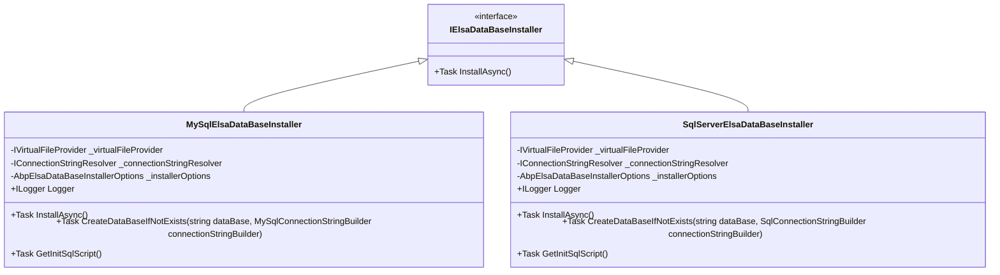

# 数据库初始化

<cite>
**本文档中引用的文件**   
- [MySqlElsaDataBaseInstaller.cs](file://aspnet-core/modules/elsa/LINGYUN.Abp.Elsa.EntityFrameworkCore.MySql/LINGYUN/Abp/Elsa/EntityFrameworkCore/MySql/Migrations/MySqlElsaDataBaseInstaller.cs)
- [SqlServerElsaDataBaseInstaller.cs](file://aspnet-core/modules/elsa/LINGYUN.Abp.Elsa.EntityFrameworkCore.SqlServer/LINGYUN/Abp/Elsa/EntityFrameworkCore/SqlServer/Migrations/SqlServerElsaDataBaseInstaller.cs)
- [AbpElsaDataBaseInstallerOptions.cs](file://aspnet-core/modules/elsa/LINGYUN.Abp.Elsa.EntityFrameworkCore/LINGYUN/Abp/Elsa/EntityFrameworkCore/Migrations/AbpElsaDataBaseInstallerOptions.cs)
- [SingleDbMigrationService.cs](file://aspnet-core/migrations/LY.MicroService.Applications.Single.EntityFrameworkCore/SingleDbMigrationService.cs)
- [SingleDbMigratorHostedService.cs](file://aspnet-core/migrations/LY.MicroService.Applications.Single.DbMigrator/SingleDbMigratorHostedService.cs)
- [Migrate.ps1](file://aspnet-core/migrations/Migrate.ps1)
</cite>

## 目录
1. [引言](#引言)
2. [项目结构](#项目结构)
3. [核心组件](#核心组件)
4. [架构概述](#架构概述)
5. [详细组件分析](#详细组件分析)
6. [依赖分析](#依赖分析)
7. [性能考虑](#性能考虑)
8. [故障排除指南](#故障排除指南)
9. [结论](#结论)

## 引言
本文档深入探讨了Quartz数据库初始化过程，重点分析了MySqlInstaller和SqlServerInstaller的实现原理。文档详细描述了数据库脚本生成、表结构创建和索引优化的过程，以及如何通过ABP模块系统自动执行数据库迁移。同时涵盖了不同数据库版本的兼容性支持、实际代码示例、自定义配置选项、错误处理机制、升级路径和数据迁移策略。

## 项目结构
本项目的数据库初始化功能主要分布在`aspnet-core`目录下的多个子模块中，特别是`modules/elsa`和`migrations`目录。`modules/elsa`包含针对不同数据库的具体安装器实现，而`migrations`目录则包含了数据库迁移的核心服务和宿主服务。

**Diagram sources**
- [MySqlElsaDataBaseInstaller.cs](file://aspnet-core/modules/elsa/LINGYUN.Abp.Elsa.EntityFrameworkCore.MySql/LINGYUN/Abp/Elsa/EntityFrameworkCore/MySql/Migrations/MySqlElsaDataBaseInstaller.cs)
- [SqlServerElsaDataBaseInstaller.cs](file://aspnet-core/modules/elsa/LINGYUN.Abp.Elsa.EntityFrameworkCore.SqlServer/LINGYUN/Abp/Elsa/EntityFrameworkCore/SqlServer/Migrations/SqlServerElsaDataBaseInstaller.cs)
- [SingleDbMigrationService.cs](file://aspnet-core/migrations/LY.MicroService.Applications.Single.EntityFrameworkCore/SingleDbMigrationService.cs)
- [SingleDbMigratorHostedService.cs](file://aspnet-core/migrations/LY.MicroService.Applications.Single.DbMigrator/SingleDbMigratorHostedService.cs)

**Section sources**
- [MySqlElsaDataBaseInstaller.cs](file://aspnet-core/modules/elsa/LINGYUN.Abp.Elsa.EntityFrameworkCore.MySql/LINGYUN/Abp/Elsa/EntityFrameworkCore/MySql/Migrations/MySqlElsaDataBaseInstaller.cs)
- [SqlServerElsaDataBaseInstaller.cs](file://aspnet-core/modules/elsa/LINGYUN.Abp.Elsa.EntityFrameworkCore.SqlServer/LINGYUN/Abp/Elsa/EntityFrameworkCore/SqlServer/Migrations/SqlServerElsaDataBaseInstaller.cs)
- [SingleDbMigrationService.cs](file://aspnet-core/migrations/LY.MicroService.Applications.Single.EntityFrameworkCore/SingleDbMigrationService.cs)
- [SingleDbMigratorHostedService.cs](file://aspnet-core/migrations/LY.MicroService.Applications.Single.DbMigrator/SingleDbMigratorHostedService.cs)

## 核心组件
数据库初始化的核心组件包括`MySqlElsaDataBaseInstaller`和`SqlServerElsaDataBaseInstaller`，它们实现了`IElsaDataBaseInstaller`接口，负责具体的数据库安装和初始化工作。这些组件通过读取虚拟文件系统中的SQL脚本文件，并结合连接字符串解析器来完成数据库的创建和表结构的初始化。

**Section sources**
- [MySqlElsaDataBaseInstaller.cs](file://aspnet-core/modules/elsa/LINGYUN.Abp.Elsa.EntityFrameworkCore.MySql/LINGYUN/Abp/Elsa/EntityFrameworkCore/MySql/Migrations/MySqlElsaDataBaseInstaller.cs)
- [SqlServerElsaDataBaseInstaller.cs](file://aspnet-core/modules/elsa/LINGYUN.Abp.Elsa.EntityFrameworkCore.SqlServer/LINGYUN/Abp/Elsa/EntityFrameworkCore/SqlServer/Migrations/SqlServerElsaDataBaseInstaller.cs)

## 架构概述
整个数据库初始化流程由ABP框架的模块化系统驱动，通过宿主服务启动迁移任务，调用具体的数据库迁移服务，最终由特定数据库的安装器完成初始化工作。该架构支持多租户环境下的分布式锁机制，确保在高并发场景下数据库迁移的安全性。

**Diagram sources**
- [SingleDbMigratorHostedService.cs](file://aspnet-core/migrations/LY.MicroService.Applications.Single.DbMigrator/SingleDbMigratorHostedService.cs)
- [SingleDbMigrationService.cs](file://aspnet-core/migrations/LY.MicroService.Applications.Single.EntityFrameworkCore/SingleDbMigrationService.cs)
- [MySqlElsaDataBaseInstaller.cs](file://aspnet-core/modules/elsa/LINGYUN.Abp.Elsa.EntityFrameworkCore.MySql/LINGYUN/Abp/Elsa/EntityFrameworkCore/MySql/Migrations/MySqlElsaDataBaseInstaller.cs)

## 详细组件分析
### MySqlInstaller 分析
`MySqlElsaDataBaseInstaller`类负责MySQL数据库的初始化工作。它首先检查"Workflow"数据库连接字符串是否存在，然后使用`MySqlConnectionStringBuilder`解析连接信息。如果目标数据库不存在，则会先创建数据库，再检查必要的表是否已存在。最后，从虚拟文件系统读取`Initial.sql`脚本并执行，完成数据库的初始化。

#### 实现细节

**Diagram sources**
- [MySqlElsaDataBaseInstaller.cs](file://aspnet-core/modules/elsa/LINGYUN.Abp.Elsa.EntityFrameworkCore.MySql/LINGYUN/Abp/Elsa/EntityFrameworkCore/MySql/Migrations/MySqlElsaDataBaseInstaller.cs)

**Section sources**
- [MySqlElsaDataBaseInstaller.cs](file://aspnet-core/modules/elsa/LINGYUN.Abp.Elsa.EntityFrameworkCore.MySql/LINGYUN/Abp/Elsa/EntityFrameworkCore/MySql/Migrations/MySqlElsaDataBaseInstaller.cs)

### SqlServerInstaller 分析
`SqlServerElsaDataBaseInstaller`类与MySql版本类似，但针对SQL Server进行了适配。它使用`SqlConnectionStringBuilder`解析连接字符串，并在master数据库中检查目标数据库是否存在。对于表存在的检查，它查询`[sys].[objects]`系统视图而不是information_schema，这是SQL Server特有的系统表。

#### 实现差异

**Diagram sources**
- [SqlServerElsaDataBaseInstaller.cs](file://aspnet-core/modules/elsa/LINGYUN.Abp.Elsa.EntityFrameworkCore.SqlServer/LINGYUN/Abp/Elsa/EntityFrameworkCore/SqlServer/Migrations/SqlServerElsaDataBaseInstaller.cs)
- [MySqlElsaDataBaseInstaller.cs](file://aspnet-core/modules/elsa/LINGYUN.Abp.Elsa.EntityFrameworkCore.MySql/LINGYUN/Abp/Elsa/EntityFrameworkCore/MySql/Migrations/MySqlElsaDataBaseInstaller.cs)

**Section sources**
- [SqlServerElsaDataBaseInstaller.cs](file://aspnet-core/modules/elsa/LINGYUN.Abp.Elsa.EntityFrameworkCore.SqlServer/LINGYUN/Abp/Elsa/EntityFrameworkCore/SqlServer/Migrations/SqlServerElsaDataBaseInstaller.cs)

### 配置选项分析
`AbpElsaDataBaseInstallerOptions`类定义了安装器的配置选项，其中最重要的属性是`InstallTables`，它指定了需要检查的表名列表。这个设计允许系统在执行完整的初始化脚本之前，先检查关键表是否存在，从而避免重复初始化。

**Diagram sources**
- [AbpElsaDataBaseInstallerOptions.cs](file://aspnet-core/modules/elsa/LINGYUN.Abp.Elsa.EntityFrameworkCore/LINGYUN/Abp/Elsa/EntityFrameworkCore/Migrations/AbpElsaDataBaseInstallerOptions.cs)

**Section sources**
- [AbpElsaDataBaseInstallerOptions.cs](file://aspnet-core/modules/elsa/LINGYUN.Abp.Elsa.EntityFrameworkCore/LINGYUN/Abp/Elsa/EntityFrameworkCore/Migrations/AbpElsaDataBaseInstallerOptions.cs)

## 依赖分析
数据库初始化系统依赖于ABP框架的多个核心组件，包括虚拟文件系统、连接字符串解析器和日志服务。同时，它还依赖于特定数据库的客户端库，如MySqlConnector和Microsoft.Data.SqlClient。

**Diagram sources**
- [MySqlElsaDataBaseInstaller.cs](file://aspnet-core/modules/elsa/LINGYUN.Abp.Elsa.EntityFrameworkCore.MySql/LINGYUN/Abp/Elsa/EntityFrameworkCore/MySql/Migrations/MySqlElsaDataBaseInstaller.cs)
- [SqlServerElsaDataBaseInstaller.cs](file://aspnet-core/modules/elsa/LINGYUN.Abp.Elsa.EntityFrameworkCore.SqlServer/LINGYUN/Abp/Elsa/EntityFrameworkCore/SqlServer/Migrations/SqlServerElsaDataBaseInstaller.cs)
- [SingleDbMigrationService.cs](file://aspnet-core/migrations/LY.MicroService.Applications.Single.EntityFrameworkCore/SingleDbMigrationService.cs)

**Section sources**
- [MySqlElsaDataBaseInstaller.cs](file://aspnet-core/modules/elsa/LINGYUN.Abp.Elsa.EntityFrameworkCore.MySql/LINGYUN/Abp/Elsa/EntityFrameworkCore/MySql/Migrations/MySqlElsaDataBaseInstaller.cs)
- [SqlServerElsaDataBaseInstaller.cs](file://aspnet-core/modules/elsa/LINGYUN.Abp.Elsa.EntityFrameworkCore.SqlServer/LINGYUN/Abp/Elsa/EntityFrameworkCore/SqlServer/Migrations/SqlServerElsaDataBaseInstaller.cs)
- [SingleDbMigrationService.cs](file://aspnet-core/migrations/LY.MicroService.Applications.Single.EntityFrameworkCore/SingleDbMigrationService.cs)

## 性能考虑
数据库初始化过程中有几个关键的性能考虑点。首先，使用分布式锁可以防止多个实例同时进行数据库迁移，避免资源竞争。其次，在执行大规模数据迁移时，建议分批处理以减少内存占用和事务锁定时间。最后，对于生产环境，应该在低峰期执行数据库迁移操作。

## 故障排除指南
当数据库初始化失败时，应首先检查连接字符串配置是否正确，特别是"Workflow"连接字符串。其次，确认虚拟文件系统中是否存在`Initial.sql`脚本文件。如果遇到权限问题，请确保数据库用户具有创建数据库和表的权限。

**Section sources**
- [MySqlElsaDataBaseInstaller.cs](file://aspnet-core/modules/elsa/LINGYUN.Abp.Elsa.EntityFrameworkCore.MySql/LINGYUN/Abp/Elsa/EntityFrameworkCore/MySql/Migrations/MySqlElsaDataBaseInstaller.cs)
- [SqlServerElsaDataBaseInstaller.cs](file://aspnet-core/modules/elsa/LINGYUN.Abp.Elsa.EntityFrameworkCore.SqlServer/LINGYUN/Abp/Elsa/EntityFrameworkCore/SqlServer/Migrations/SqlServerElsaDataBaseInstaller.cs)

## 结论
本文档详细介绍了Quartz数据库初始化的实现机制，展示了如何通过ABP模块系统实现跨数据库平台的自动化迁移。通过合理的架构设计和错误处理机制，该系统能够安全可靠地完成数据库初始化任务，为应用程序的稳定运行提供了坚实的基础。