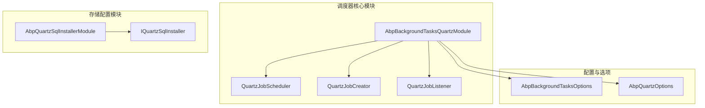
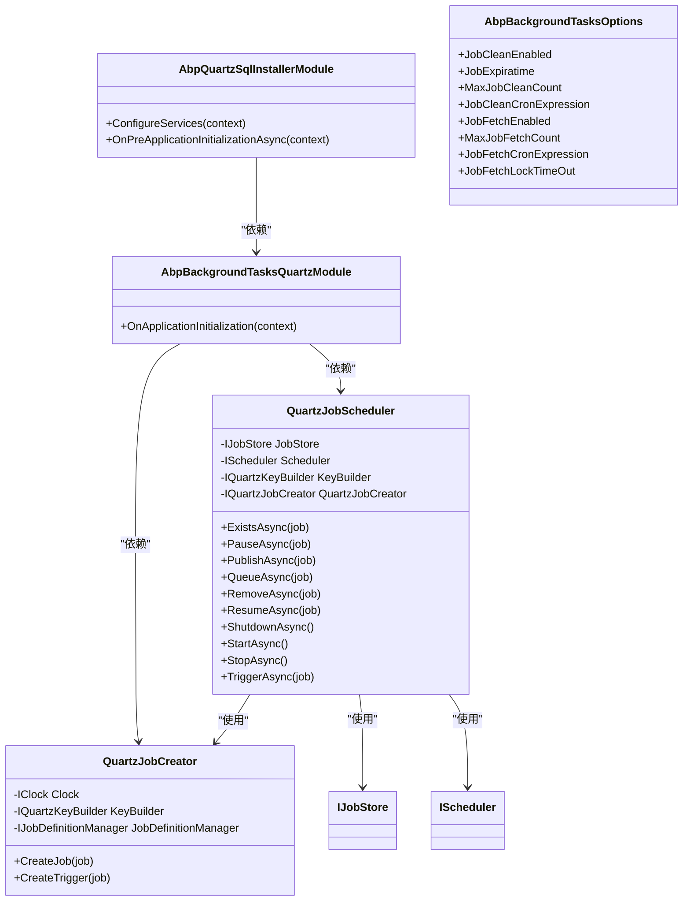
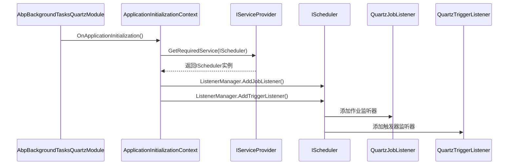
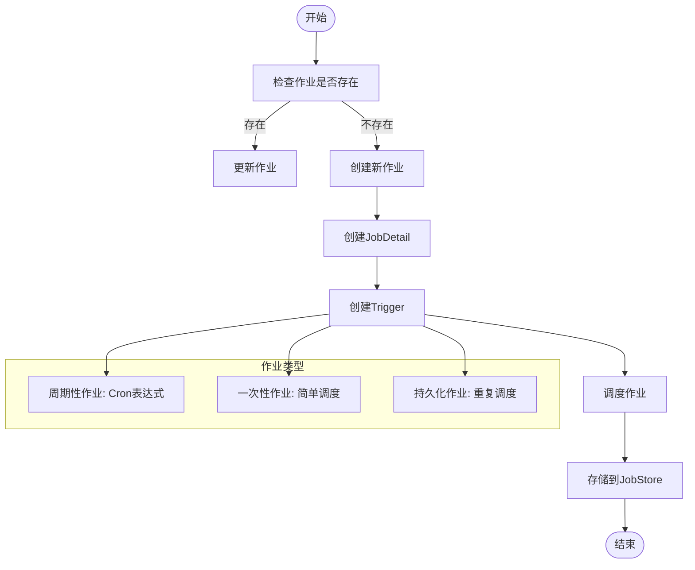
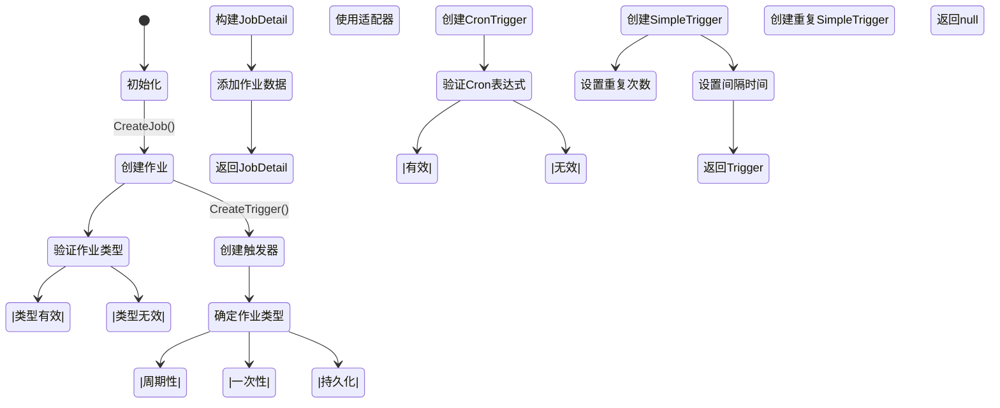

# 调度器配置

<cite>
**本文档中引用的文件**  
- [AbpBackgroundTasksQuartzModule.cs](file://aspnet-core/modules/task-management/LINGYUN.Abp.BackgroundTasks.Quartz/LINGYUN/Abp/BackgroundTasks/Quartz/AbpBackgroundTasksQuartzModule.cs)
- [QuartzJobScheduler.cs](file://aspnet-core/modules/task-management/LINGYUN.Abp.BackgroundTasks.Quartz/LINGYUN/Abp/BackgroundTasks/Quartz/QuartzJobScheduler.cs)
- [QuartzJobCreator.cs](file://aspnet-core/modules/task-management/LINGYUN.Abp.BackgroundTasks.Quartz/LINGYUN/Abp/BackgroundTasks/Quartz/QuartzJobCreator.cs)
- [AbpQuartzSqlInstallerModule.cs](file://aspnet-core/modules/task-management/LINGYUN.Abp.Quartz.SqlInstaller/LINGYUN/Abp/Quartz/SqlInstaller/AbpQuartzSqlInstallerModule.cs)
- [AbpBackgroundTasksOptions.cs](file://aspnet-core/modules/task-management/LINGYUN.Abp.BackgroundTasks.Abstractions/LINGYUN/Abp/BackgroundTasks/AbpBackgroundTasksOptions.cs)
</cite>

## 目录
1. [引言](#引言)
2. [项目结构](#项目结构)
3. [核心组件](#核心组件)
4. [架构概述](#架构概述)
5. [详细组件分析](#详细组件分析)
6. [依赖分析](#依赖分析)
7. [性能考虑](#性能考虑)
8. [故障排除指南](#故障排除指南)
9. [结论](#结论)

## 引言
本文档详细介绍了在ABP框架中如何配置和使用Quartz调度器。重点涵盖Quartz调度器的模块化集成、作业创建与触发机制、持久化存储配置、与ABP依赖注入系统的整合，以及调度器生命周期管理。文档还提供了在不同环境下的配置策略和最佳实践。

## 项目结构
ABP框架中的Quartz调度器功能主要分布在task-management模块中，通过多个专用模块实现调度功能的分离和扩展。



**图示来源**  
- [AbpBackgroundTasksQuartzModule.cs](file://aspnet-core/modules/task-management/LINGYUN.Abp.BackgroundTasks.Quartz/LINGYUN/Abp/BackgroundTasks/Quartz/AbpBackgroundTasksQuartzModule.cs)
- [QuartzJobScheduler.cs](file://aspnet-core/modules/task-management/LINGYUN.Abp.BackgroundTasks.Quartz/LINGYUN/Abp/BackgroundTasks/Quartz/QuartzJobScheduler.cs)
- [QuartzJobCreator.cs](file://aspnet-core/modules/task-management/LINGYUN.Abp.BackgroundTasks.Quartz/LINGYUN/Abp/BackgroundTasks/Quartz/QuartzJobCreator.cs)
- [AbpQuartzSqlInstallerModule.cs](file://aspnet-core/modules/task-management/LINGYUN.Abp.Quartz.SqlInstaller/LINGYUN/Abp/Quartz/SqlInstaller/AbpQuartzSqlInstallerModule.cs)

**本节来源**  
- [AbpBackgroundTasksQuartzModule.cs](file://aspnet-core/modules/task-management/LINGYUN.Abp.BackgroundTasks.Quartz/LINGYUN/Abp/BackgroundTasks/Quartz/AbpBackgroundTasksQuartzModule.cs)
- [AbpQuartzSqlInstallerModule.cs](file://aspnet-core/modules/task-management/LINGYUN.Abp.Quartz.SqlInstaller/LINGYUN/Abp/Quartz/SqlInstaller/AbpQuartzSqlInstallerModule.cs)

## 核心组件
Quartz调度器在ABP框架中的核心组件包括调度器实现、作业创建器、触发器管理器和监听器。这些组件通过ABP的依赖注入系统进行注册和管理，实现了灵活的调度功能。

**本节来源**  
- [QuartzJobScheduler.cs](file://aspnet-core/modules/task-management/LINGYUN.Abp.BackgroundTasks.Quartz/LINGYUN/Abp/BackgroundTasks/Quartz/QuartzJobScheduler.cs#L1-L20)
- [QuartzJobCreator.cs](file://aspnet-core/modules/task-management/LINGYUN.Abp.BackgroundTasks.Quartz/LINGYUN/Abp/BackgroundTasks/Quartz/QuartzJobCreator.cs#L1-L30)

## 架构概述
Quartz调度器在ABP框架中的架构设计遵循模块化原则，通过依赖注入实现组件间的松耦合。调度器核心功能与存储配置、作业定义管理等功能分离，便于扩展和维护。



**图示来源**  
- [AbpBackgroundTasksQuartzModule.cs](file://aspnet-core/modules/task-management/LINGYUN.Abp.BackgroundTasks.Quartz/LINGYUN/Abp/BackgroundTasks/Quartz/AbpBackgroundTasksQuartzModule.cs)
- [QuartzJobScheduler.cs](file://aspnet-core/modules/task-management/LINGYUN.Abp.BackgroundTasks.Quartz/LINGYUN/Abp/BackgroundTasks/Quartz/QuartzJobScheduler.cs)
- [QuartzJobCreator.cs](file://aspnet-core/modules/task-management/LINGYUN.Abp.BackgroundTasks.Quartz/LINGYUN/Abp/BackgroundTasks/Quartz/QuartzJobCreator.cs)
- [AbpQuartzSqlInstallerModule.cs](file://aspnet-core/modules/task-management/LINGYUN.Abp.Quartz.SqlInstaller/LINGYUN/Abp/Quartz/SqlInstaller/AbpQuartzSqlInstallerModule.cs)
- [AbpBackgroundTasksOptions.cs](file://aspnet-core/modules/task-management/LINGYUN.Abp.BackgroundTasks.Abstractions/LINGYUN/Abp/BackgroundTasks/AbpBackgroundTasksOptions.cs)

## 详细组件分析
### Quartz调度器模块分析
Quartz调度器模块是ABP框架中调度功能的核心，负责注册和初始化调度器相关的服务和监听器。



**图示来源**  
- [AbpBackgroundTasksQuartzModule.cs](file://aspnet-core/modules/task-management/LINGYUN.Abp.BackgroundTasks.Quartz/LINGYUN/Abp/BackgroundTasks/Quartz/AbpBackgroundTasksQuartzModule.cs#L10-L20)

**本节来源**  
- [AbpBackgroundTasksQuartzModule.cs](file://aspnet-core/modules/task-management/LINGYUN.Abp.BackgroundTasks.Quartz/LINGYUN/Abp/BackgroundTasks/Quartz/AbpBackgroundTasksQuartzModule.cs#L1-L21)

### 调度器实现分析
QuartzJobScheduler类实现了IJobScheduler和IJobPublisher接口，提供了完整的作业调度功能，包括作业的创建、暂停、恢复、删除和触发。



**图示来源**  
- [QuartzJobScheduler.cs](file://aspnet-core/modules/task-management/LINGYUN.Abp.BackgroundTasks.Quartz/LINGYUN/Abp/BackgroundTasks/Quartz/QuartzJobScheduler.cs#L50-L150)
- [QuartzJobCreator.cs](file://aspnet-core/modules/task-management/LINGYUN.Abp.BackgroundTasks.Quartz/LINGYUN/Abp/BackgroundTasks/Quartz/QuartzJobCreator.cs#L80-L130)

**本节来源**  
- [QuartzJobScheduler.cs](file://aspnet-core/modules/task-management/LINGYUN.Abp.BackgroundTasks.Quartz/LINGYUN/Abp/BackgroundTasks/Quartz/QuartzJobScheduler.cs#L1-L188)
- [QuartzJobCreator.cs](file://aspnet-core/modules/task-management/LINGYUN.Abp.BackgroundTasks.Quartz/LINGYUN/Abp/BackgroundTasks/Quartz/QuartzJobCreator.cs#L30-L70)

### 作业创建器分析
QuartzJobCreator负责根据作业信息创建Quartz的JobDetail和Trigger对象，是连接ABP作业模型与Quartz调度器的桥梁。



**图示来源**  
- [QuartzJobCreator.cs](file://aspnet-core/modules/task-management/LINGYUN.Abp.BackgroundTasks.Quartz/LINGYUN/Abp/BackgroundTasks/Quartz/QuartzJobCreator.cs#L30-L160)

**本节来源**  
- [QuartzJobCreator.cs](file://aspnet-core/modules/task-management/LINGYUN.Abp.BackgroundTasks.Quartz/LINGYUN/Abp/BackgroundTasks/Quartz/QuartzJobCreator.cs#L1-L162)

### 持久化存储配置分析
AbpQuartzSqlInstallerModule模块负责配置Quartz的持久化存储，包括数据库初始化和配置设置。

```mermaid
sequenceDiagram
    participant Module as AbpQuartzSqlInstallerModule
    participant Context as ServiceConfigurationContext
    participant Options as AbpQuartzOptions
    participant QuartzOptions as QuartzOptions
    participant Config as IConfiguration
    participant Installer as IQuartzSqlInstaller
    
    Module->>Context: ConfigureServices()
    Context->>Options: ExecutePreConfiguredActions()
    Options->>QuartzOptions: 配置属性
    QuartzOptions->>QuartzOptions: 设置默认JobStore
    
    Module->>Context: OnPreApplicationInitializationAsync()
    Context->>Config: GetRequiredService(IConfiguration)
    Config->>Config: GetValue("Quartz:UsePersistentStore")
    Config->>Config: Get JobStoreType
    alt