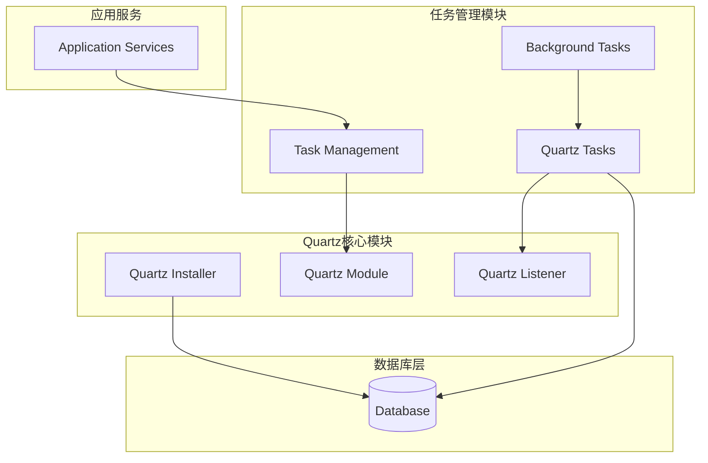
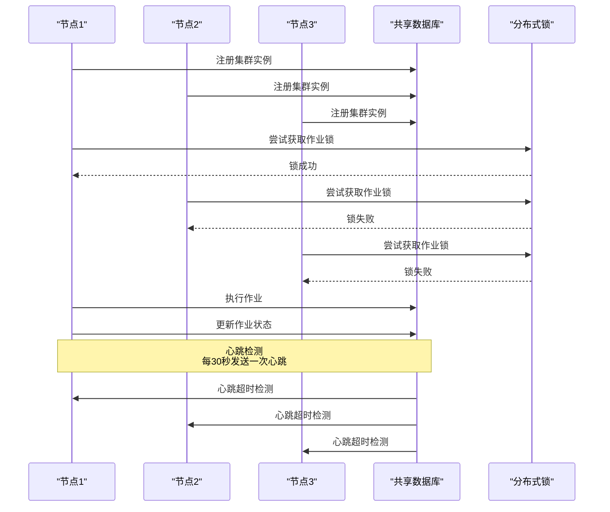
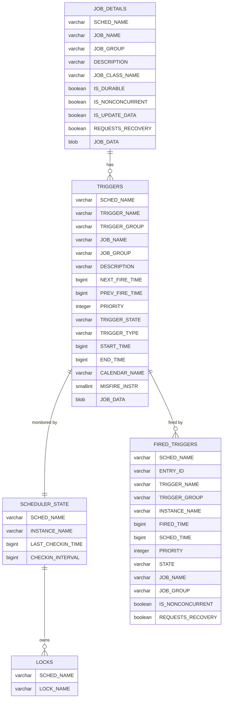
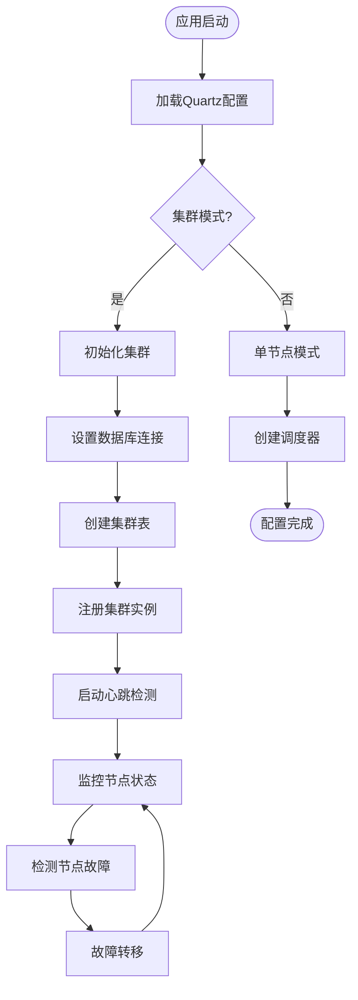
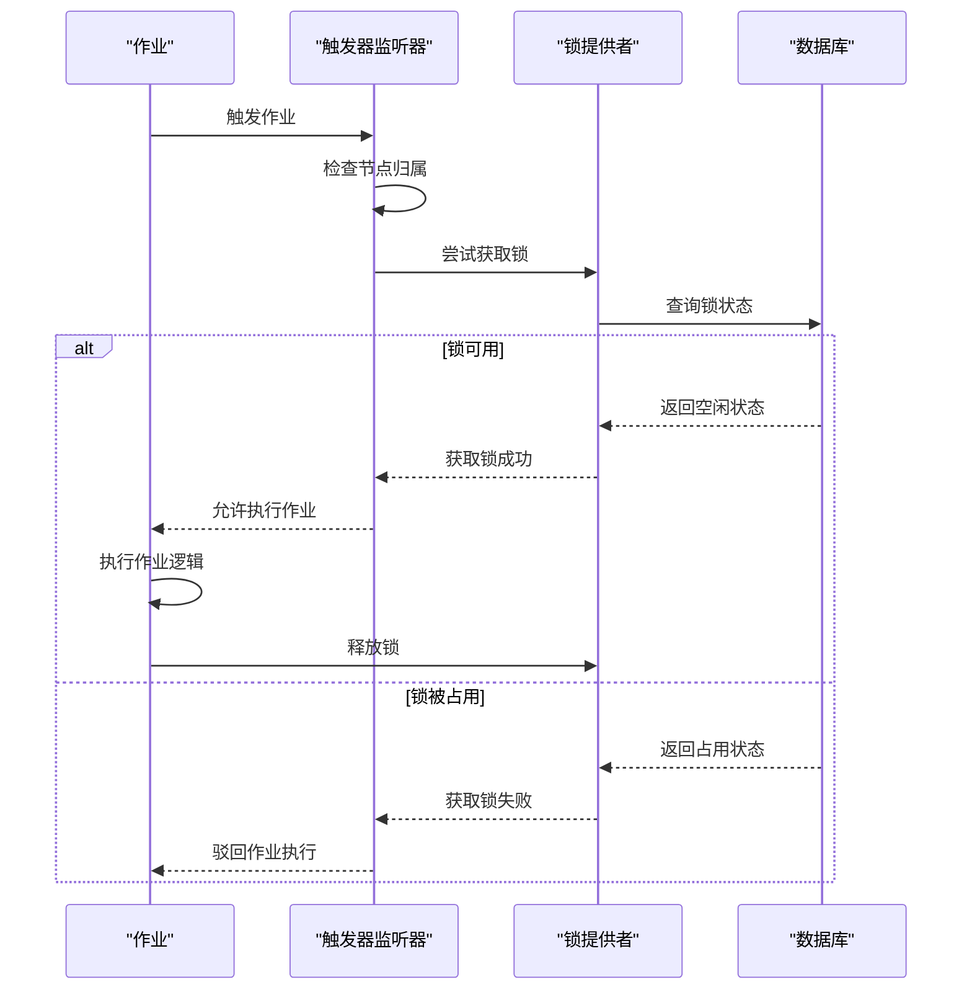
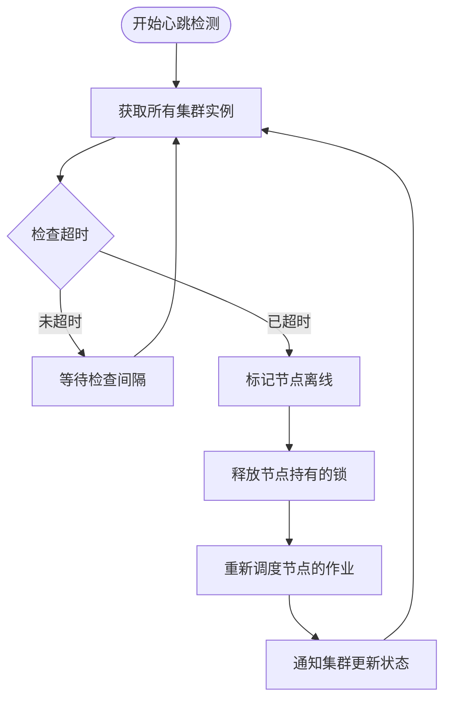
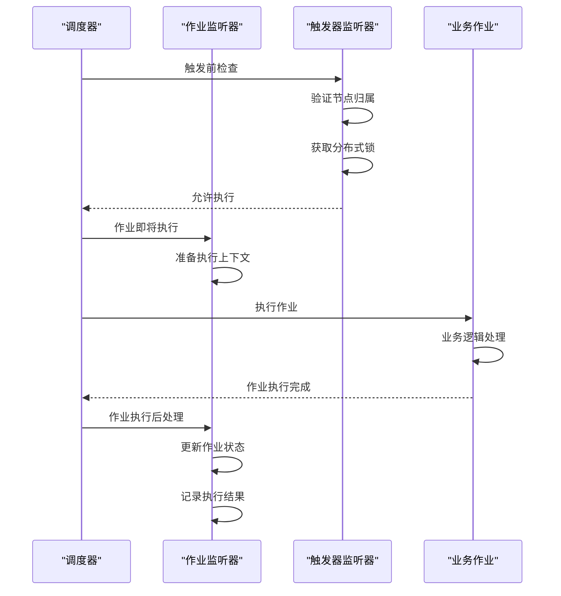
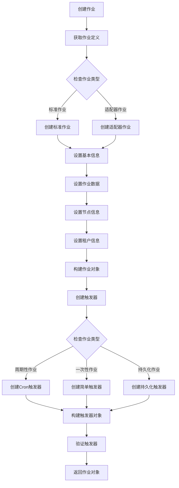
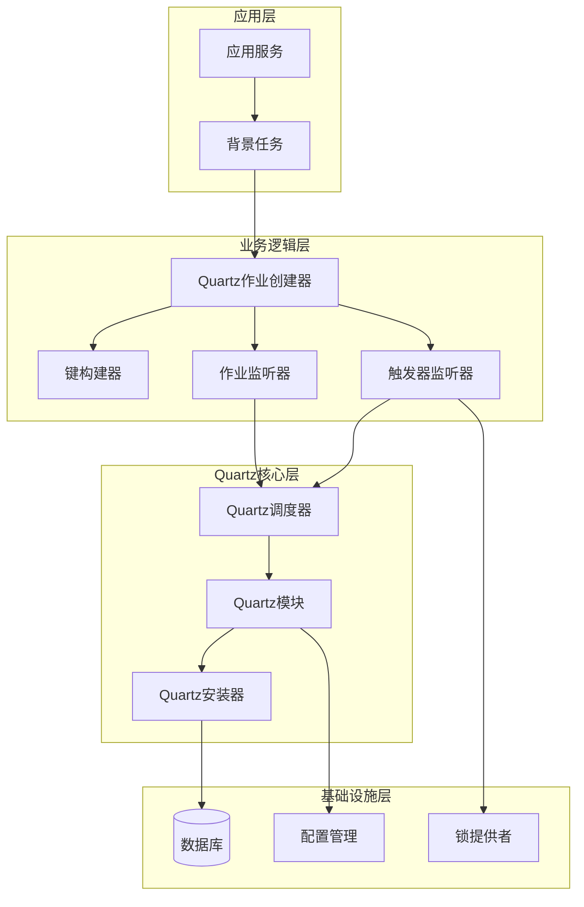

# Quartz集群模式详细文档

<cite>
**本文档引用的文件**
- [Initial.sql](file://aspnet-core/modules/task-management/LINGYUN.Abp.Quartz.MySqlInstaller/LINGYUN/Abp/Quartz/MySqlInstaller/Scripts/Initial.sql)
- [AbpQuartzSqlInstallerModule.cs](file://aspnet-core/modules/task-management/LINGYUN.Abp.Quartz.SqlInstaller/LINGYUN/Abp/Quartz/SqlInstaller/AbpQuartzSqlInstallerModule.cs)
- [AbpQuartzSqlInstallerOptions.cs](file://aspnet-core/modules/task-management/LINGYUN.Abp.Quartz.SqlInstaller/LINGYUN/Abp/Quartz/SqlInstaller/AbpQuartzSqlInstallerOptions.cs)
- [AbpBackgroundTasksOptions.cs](file://aspnet-core/modules/task-management/LINGYUN.Abp.BackgroundTasks.Abstractions/LINGYUN/Abp/BackgroundTasks/AbpBackgroundTasksOptions.cs)
- [appsettings.SqlServer.json](file://aspnet-core/services/LY.MicroService.Applications.Single/appsettings.SqlServer.json)
- [QuartzJobListener.cs](file://aspnet-core/modules/task-management/LINGYUN.Abp.BackgroundTasks.Quartz/LINGYUN/Abp/BackgroundTasks/Quartz/QuartzJobListener.cs)
- [QuartzTriggerListener.cs](file://aspnet-core/modules/task-management/LINGYUN.Abp.BackgroundTasks.Quartz/LINGYUN/Abp/BackgroundTasks/Quartz/QuartzTriggerListener.cs)
- [QuartzJobCreator.cs](file://aspnet-core/modules/task-management/LINGYUN.Abp.BackgroundTasks.Quartz/LINGYUN/Abp/BackgroundTasks/Quartz/QuartzJobCreator.cs)
- [QuartzKeyBuilder.cs](file://aspnet-core/modules/task-management/LINGYUN.Abp.BackgroundTasks.Quartz/LINGYUN/Abp/BackgroundTasks/Quartz/QuartzKeyBuilder.cs)
- [AbpBackgroundTasksQuartzModule.cs](file://aspnet-core/modules/task-management/LINGYUN.Abp.BackgroundTasks.Quartz/LINGYUN/Abp/BackgroundTasks/Quartz/AbpBackgroundTasksQuartzModule.cs)
</cite>

## 目录
1. [简介](#简介)
2. [项目结构](#项目结构)
3. [核心组件](#核心组件)
4. [架构概览](#架构概览)
5. [详细组件分析](#详细组件分析)
6. [依赖关系分析](#依赖关系分析)
7. [性能考虑](#性能考虑)
8. [故障排除指南](#故障排除指南)
9. [结论](#结论)

## 简介

本文档深入解释了在分布式环境下如何配置Quartz实现高可用的调度集群。Quartz是一个功能强大的作业调度框架，通过集群模式可以在多个节点之间实现负载均衡和故障转移，确保作业调度的高可用性和可靠性。

该系统基于Abp框架的扩展模块，提供了完整的Quartz集群配置解决方案，包括数据库表结构设计、集群节点配置、负载均衡策略和故障转移机制。

## 项目结构

Quartz集群模式的项目结构围绕任务管理和调度功能组织，主要包含以下核心模块：



**图表来源**
- [AbpBackgroundTasksQuartzModule.cs](file://aspnet-core/modules/task-management/LINGYUN.Abp.BackgroundTasks.Quartz/LINGYUN/Abp/BackgroundTasks/Quartz/AbpBackgroundTasksQuartzModule.cs#L1-L21)
- [AbpQuartzSqlInstallerModule.cs](file://aspnet-core/modules/task-management/LINGYUN.Abp.Quartz.SqlInstaller/LINGYUN/Abp/Quartz/SqlInstaller/AbpQuartzSqlInstallerModule.cs#L1-L50)

**章节来源**
- [AbpBackgroundTasksQuartzModule.cs](file://aspnet-core/modules/task-management/LINGYUN.Abp.BackgroundTasks.Quartz/LINGYUN/Abp/BackgroundTasks/Quartz/AbpBackgroundTasksQuartzModule.cs#L1-L21)
- [AbpQuartzSqlInstallerModule.cs](file://aspnet-core/modules/task-management/LINGYUN.Abp.Quartz.SqlInstaller/LINGYUN/Abp/Quartz/SqlInstaller/AbpQuartzSqlInstallerModule.cs#L1-L50)

## 核心组件

### Quartz集群配置核心组件

Quartz集群模式的核心组件包括以下几个关键部分：

1. **数据库表结构** - 提供集群状态共享和作业数据存储
2. **集群节点管理** - 实现节点发现和状态同步
3. **锁机制** - 确保作业的唯一执行
4. **心跳检测** - 监控节点健康状态
5. **监听器系统** - 处理作业执行生命周期事件

**章节来源**
- [Initial.sql](file://aspnet-core/modules/task-management/LINGYUN.Abp.Quartz.MySqlInstaller/LINGYUN/Abp/Quartz/MySqlInstaller/Scripts/Initial.sql#L1-L181)
- [AbpQuartzSqlInstallerOptions.cs](file://aspnet-core/modules/task-management/LINGYUN.Abp.Quartz.SqlInstaller/LINGYUN/Abp/Quartz/SqlInstaller/AbpQuartzSqlInstallerOptions.cs#L1-L26)

## 架构概览

Quartz集群模式采用分布式架构设计，通过数据库共享状态信息实现节点间的协调：



**图表来源**
- [Initial.sql](file://aspnet-core/modules/task-management/LINGYUN.Abp.Quartz.MySqlInstaller/LINGYUN/Abp/Quartz/MySqlInstaller/Scripts/Initial.sql#L141-L167)
- [QuartzTriggerListener.cs](file://aspnet-core/modules/task-management/LINGYUN.Abp.BackgroundTasks.Quartz/LINGYUN/Abp/BackgroundTasks/Quartz/QuartzTriggerListener.cs#L1-L79)

## 详细组件分析

### 数据库表结构设计

Quartz集群模式使用标准化的数据库表结构来支持集群操作：



**图表来源**
- [Initial.sql](file://aspnet-core/modules/task-management/LINGYUN.Abp.Quartz.MySqlInstaller/LINGYUN/Abp/Quartz/MySqlInstaller/Scripts/Initial.sql#L15-L140)

#### 关键表说明

1. **JOB_DETAILS**: 存储作业的基本信息和配置
2. **TRIGGERS**: 定义触发器规则和状态
3. **SCHEDULER_STATE**: 记录集群节点的心跳状态
4. **LOCKS**: 实现分布式锁机制
5. **FIRED_TRIGGERS**: 记录已触发的作业信息

**章节来源**
- [Initial.sql](file://aspnet-core/modules/task-management/LINGYUN.Abp.Quartz.MySqlInstaller/LINGYUN/Abp/Quartz/MySqlInstaller/Scripts/Initial.sql#L15-L140)

### 集群节点配置

集群节点通过配置文件进行初始化，主要配置项包括：



**图表来源**
- [AbpQuartzSqlInstallerModule.cs](file://aspnet-core/modules/task-management/LINGYUN.Abp.Quartz.SqlInstaller/LINGYUN/Abp/Quartz/SqlInstaller/AbpQuartzSqlInstallerModule.cs#L25-L45)
- [appsettings.SqlServer.json](file://aspnet-core/services/LY.MicroService.Applications.Single/appsettings.SqlServer.json#L10-L20)

#### 配置示例

```json
{
  "Quartz": {
    "Properties": {
      "quartz.jobStore.dataSource": "tkm",
      "quartz.jobStore.type": "Quartz.Impl.AdoJobStore.JobStoreTX,Quartz",
      "quartz.jobStore.driverDelegateType": "Quartz.Impl.AdoJobStore.SqlServerDelegate,Quartz",
      "quartz.dataSource.tkm.connectionString": "Server=127.0.0.1;Database=Platform-V70;User Id=sa;Password=P@ssw@rd!;Encrypt=false",
      "quartz.dataSource.tkm.provider": "SqlServer",
      "quartz.jobStore.clustered": true,
      "quartz.checkConfiguration": "false",
      "quartz.serializer.type": "json"
    }
  }
}
```

**章节来源**
- [appsettings.SqlServer.json](file://aspnet-core/services/LY.MicroService.Applications.Single/appsettings.SqlServer.json#L10-L20)

### 分布式锁机制

分布式锁机制确保同一作业在同一时间只能由一个节点执行：



**图表来源**
- [QuartzTriggerListener.cs](file://aspnet-core/modules/task-management/LINGYUN.Abp.BackgroundTasks.Quartz/LINGYUN/Abp/BackgroundTasks/Quartz/QuartzTriggerListener.cs#L30-L50)

#### 锁机制实现

```csharp
public override async Task<bool> VetoJobExecution(
    ITrigger trigger,
    IJobExecutionContext context,
    CancellationToken cancellationToken = default)
{
    // 检查作业是否属于当前节点
    context.MergedJobDataMap.TryGetValue(nameof(JobInfo.NodeName), out var jobNode);
    if (!Equals(Options.NodeName, jobNode))
    {
        Logger.LogDebug("作业不属于当前节点，忽略调度");
        return true;
    }

    // 获取作业ID和锁超时时间
    context.MergedJobDataMap.TryGetValue(nameof(JobInfo.Id), out var jobId);
    context.MergedJobDataMap.TryGetValue(nameof(JobInfo.LockTimeOut), out var lockTime);
    
    if (jobId != null && lockTime != null && 
        int.TryParse(lockTime.ToString(), out var time) && time > 0)
    {
        // 尝试获取分布式锁
        if (!await JobLockProvider.TryLockAsync(NormalizeKey(context, jobId), time))
        {
            context.Put("JobLocked", time);
            Logger.LogDebug("独占作业已被其他调度器使用，忽略本次调度");
            return true;
        }
    }
    
    return false;
}
```

**章节来源**
- [QuartzTriggerListener.cs](file://aspnet-core/modules/task-management/LINGYUN.Abp.BackgroundTasks.Quartz/LINGYUN/Abp/BackgroundTasks/Quartz/QuartzTriggerListener.cs#L30-L55)

### 心跳检测机制

心跳检测机制监控集群节点的健康状态，及时发现和处理节点故障：



**图表来源**
- [Initial.sql](file://aspnet-core/modules/task-management/LINGYUN.Abp.Quartz.MySqlInstaller/LINGYUN/Abp/Quartz/MySqlInstaller/Scripts/Initial.sql#L141-L150)

### 作业监听器系统

作业监听器系统处理作业执行的完整生命周期：



**图表来源**
- [QuartzJobListener.cs](file://aspnet-core/modules/task-management/LINGYUN.Abp.BackgroundTasks.Quartz/LINGYUN/Abp/BackgroundTasks/Quartz/QuartzJobListener.cs#L40-L80)
- [QuartzTriggerListener.cs](file://aspnet-core/modules/task-management/LINGYUN.Abp.BackgroundTasks.Quartz/LINGYUN/Abp/BackgroundTasks/Quartz/QuartzTriggerListener.cs#L30-L50)

**章节来源**
- [QuartzJobListener.cs](file://aspnet-core/modules/task-management/LINGYUN.Abp.BackgroundTasks.Quartz/LINGYUN/Abp/BackgroundTasks/Quartz/QuartzJobListener.cs#L40-L120)
- [QuartzTriggerListener.cs](file://aspnet-core/modules/task-management/LINGYUN.Abp.BackgroundTasks.Quartz/LINGYUN/Abp/BackgroundTasks/Quartz/QuartzTriggerListener.cs#L30-L79)

### 作业创建和管理

作业创建器负责根据业务需求创建Quartz作业和触发器：



**图表来源**
- [QuartzJobCreator.cs](file://aspnet-core/modules/task-management/LINGYUN.Abp.BackgroundTasks.Quartz/LINGYUN/Abp/BackgroundTasks/Quartz/QuartzJobCreator.cs#L20-L100)

**章节来源**
- [QuartzJobCreator.cs](file://aspnet-core/modules/task-management/LINGYUN.Abp.BackgroundTasks.Quartz/LINGYUN/Abp/BackgroundTasks/Quartz/QuartzJobCreator.cs#L20-L161)

## 依赖关系分析

Quartz集群模式的依赖关系体现了清晰的分层架构：



**图表来源**
- [AbpBackgroundTasksQuartzModule.cs](file://aspnet-core/modules/task-management/LINGYUN.Abp.BackgroundTasks.Quartz/LINGYUN/Abp/BackgroundTasks/Quartz/AbpBackgroundTasksQuartzModule.cs#L1-L21)
- [AbpQuartzSqlInstallerModule.cs](file://aspnet-core/modules/task-management/LINGYUN.Abp.Quartz.SqlInstaller/LINGYUN/Abp/Quartz/SqlInstaller/AbpQuartzSqlInstallerModule.cs#L1-L50)

**章节来源**
- [AbpBackgroundTasksQuartzModule.cs](file://aspnet-core/modules/task-management/LINGYUN.Abp.BackgroundTasks.Quartz/LINGYUN/Abp/BackgroundTasks/Quartz/AbpBackgroundTasksQuartzModule.cs#L1-L21)
- [AbpQuartzSqlInstallerModule.cs](file://aspnet-core/modules/task-management/LINGYUN.Abp.Quartz.SqlInstaller/LINGYUN/Abp/Quartz/SqlInstaller/AbpQuartzSqlInstallerModule.cs#L1-L50)

## 性能考虑

### 集群性能优化

1. **数据库连接池优化**: 合理配置连接池大小以支持多节点并发访问
2. **索引优化**: 在关键字段上建立适当的索引提高查询性能
3. **心跳间隔调整**: 根据网络状况调整心跳检测间隔
4. **锁超时设置**: 合理设置锁超时时间避免死锁

### 内存使用优化

1. **作业数据压缩**: 对大型作业数据进行压缩存储
2. **定期清理**: 定期清理过期的作业历史记录
3. **批量处理**: 使用批量操作减少数据库交互次数

### 网络延迟处理

1. **本地缓存**: 缓存常用配置和作业定义
2. **异步处理**: 使用异步操作减少阻塞
3. **重试机制**: 实现智能重试避免网络抖动影响

## 故障排除指南

### 常见问题及解决方案

#### 1. 集群节点无法正常启动

**症状**: 节点启动时出现数据库连接错误或表结构不匹配

**解决方案**:
```csharp
// 检查数据库连接字符串
var connectionString = _quartzOptions.Properties["quartz.jobStore.dataSource.connectionString"];

// 确保数据库表结构已正确创建
await context.ServiceProvider.GetService<IQuartzSqlInstaller>()?.InstallAsync();

// 验证集群配置
var clustered = _quartzOptions.Properties["quartz.jobStore.clustered"] == "true";
```

#### 2. 作业执行冲突

**症状**: 同一作业在多个节点同时执行

**解决方案**:
- 检查分布式锁配置
- 验证节点归属设置
- 查看作业锁超时配置

#### 3. 心跳检测异常

**症状**: 节点频繁被标记为离线

**解决方案**:
- 调整心跳间隔配置
- 检查网络稳定性
- 优化数据库性能

**章节来源**
- [AbpQuartzSqlInstallerModule.cs](file://aspnet-core/modules/task-management/LINGYUN.Abp.Quartz.SqlInstaller/LINGYUN/Abp/Quartz/SqlInstaller/AbpQuartzSqlInstallerModule.cs#L30-L50)
- [QuartzTriggerListener.cs](file://aspnet-core/modules/task-management/LINGYUN.Abp.BackgroundTasks.Quartz/LINGYUN/Abp/BackgroundTasks/Quartz/QuartzTriggerListener.cs#L30-L55)

## 结论

Quartz集群模式为分布式环境下的作业调度提供了完整的解决方案。通过标准化的数据库表结构、完善的锁机制、智能的心跳检测和灵活的监听器系统，实现了高可用、高性能的作业调度集群。

### 主要优势

1. **高可用性**: 多节点部署确保系统持续可用
2. **负载均衡**: 自动分配作业到可用节点
3. **故障转移**: 节点故障时自动重新调度
4. **数据一致性**: 通过数据库保证集群状态一致
5. **可扩展性**: 支持动态添加和移除节点

### 最佳实践建议

1. **合理配置集群参数**: 根据实际需求调整心跳间隔和锁超时时间
2. **监控集群状态**: 建立完善的监控体系及时发现问题
3. **定期维护**: 定期清理过期数据和优化数据库性能
4. **备份策略**: 制定完善的数据备份和恢复策略
5. **安全考虑**: 确保数据库连接的安全性和访问控制

通过遵循本文档的指导和最佳实践，可以成功部署和运维一个稳定可靠的Quartz集群调度系统。