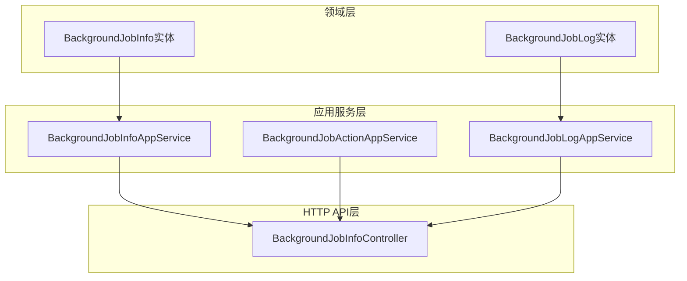
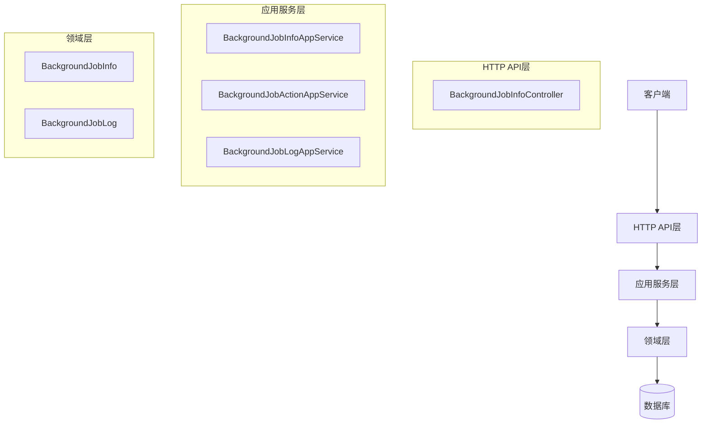
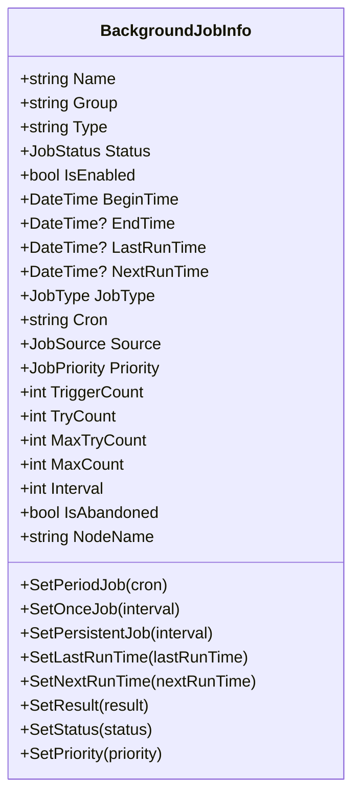
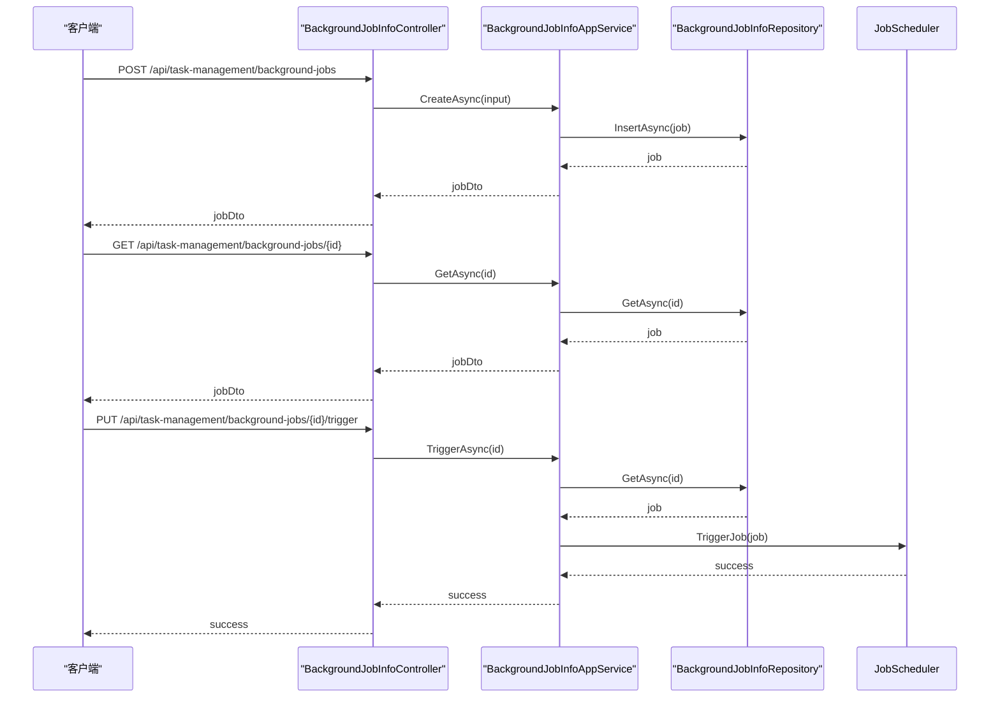
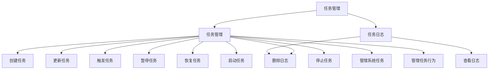
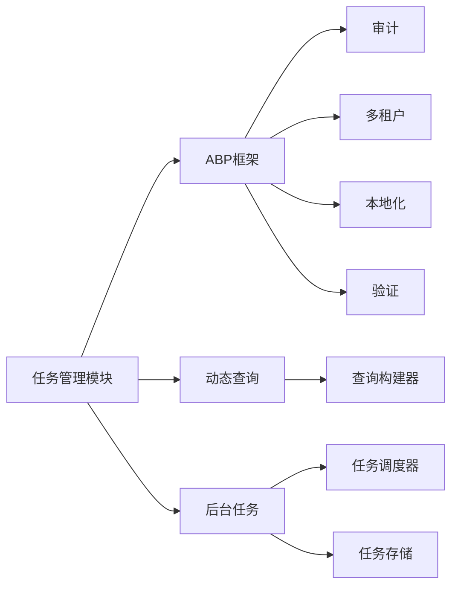

# 任务监控与管理

<cite>
**本文档引用的文件**
- [BackgroundJobInfo.cs](file://aspnet-core/modules/task-management/LINGYUN.Abp.TaskManagement.Domain/LINGYUN/Abp/TaskManagement/BackgroundJobInfo.cs)
- [BackgroundJobInfoController.cs](file://aspnet-core/modules/task-management/LINGYUN.Abp.TaskManagement.HttpApi/LINGYUN/Abp/TaskManagement/BackgroundJobInfoController.cs)
- [BackgroundJobActionAppService.cs](file://aspnet-core/modules/task-management/LINGYUN.Abp.TaskManagement.Application/LINGYUN/Abp/TaskManagement/BackgroundJobActionAppService.cs)
- [BackgroundJobLogAppService.cs](file://aspnet-core/modules/task-management/LINGYUN.Abp.TaskManagement.Application/LINGYUN/Abp/TaskManagement/BackgroundJobLogAppService.cs)
- [TaskManagementPermissions.cs](file://aspnet-core/modules/task-management/LINGYUN.Abp.TaskManagement.Application.Contracts/LINGYUN/Abp/TaskManagement/Permissions/TaskManagementPermissions.cs)
- [TaskManagementPermissionDefinitionProvider.cs](file://aspnet-core/modules/task-management/LINGYUN.Abp.TaskManagement.Application.Contracts/LINGYUN/Abp/TaskManagement/Permissions/TaskManagementPermissionDefinitionProvider.cs)
</cite>

## 目录
1. [简介](#简介)
2. [项目结构](#项目结构)
3. [核心组件](#核心组件)
4. [架构概述](#架构概述)
5. [详细组件分析](#详细组件分析)
6. [依赖分析](#依赖分析)
7. [性能考虑](#性能考虑)
8. [故障排除指南](#故障排除指南)
9. [结论](#结论)

## 简介
本项目是一个基于ABP框架的任务监控与管理系统，提供全面的任务状态跟踪、执行日志记录和性能指标收集功能。系统通过Application层提供任务查询、启停控制和手动触发等管理功能，并通过HttpApi层暴露RESTful接口，支持任务列表获取、状态更新和执行历史查询等操作。系统实现了完善的权限控制、分页查询和条件过滤特性，确保任务管理的安全性和灵活性。

## 项目结构
任务管理模块采用分层架构设计，包含领域层、应用服务层和HTTP API层。领域层定义了任务的核心实体和业务规则，应用服务层实现具体的业务逻辑，HTTP API层暴露RESTful接口供外部调用。

**图示来源**
- [BackgroundJobInfo.cs](file://aspnet-core/modules/task-management/LINGYUN.Abp.TaskManagement.Domain/LINGYUN/Abp/TaskManagement/BackgroundJobInfo.cs)
- [BackgroundJobInfoController.cs](file://aspnet-core/modules/task-management/LINGYUN.Abp.TaskManagement.HttpApi/LINGYUN/Abp/TaskManagement/BackgroundJobInfoController.cs)
- [BackgroundJobActionAppService.cs](file://aspnet-core/modules/task-management/LINGYUN.Abp.TaskManagement.Application/LINGYUN/Abp/TaskManagement/BackgroundJobActionAppService.cs)
- [BackgroundJobLogAppService.cs](file://aspnet-core/modules/task-management/LINGYUN.Abp.TaskManagement.Application/LINGYUN/Abp/TaskManagement/BackgroundJobLogAppService.cs)

**本节来源**
- [BackgroundJobInfo.cs](file://aspnet-core/modules/task-management/LINGYUN.Abp.TaskManagement.Domain/LINGYUN/Abp/TaskManagement/BackgroundJobInfo.cs)
- [BackgroundJobInfoController.cs](file://aspnet-core/modules/task-management/LINGYUN.Abp.TaskManagement.HttpApi/LINGYUN/Abp/TaskManagement/BackgroundJobInfoController.cs)

## 核心组件
任务管理模块的核心组件包括任务信息实体（BackgroundJobInfo）、任务日志实体（BackgroundJobLog）、任务操作服务（BackgroundJobActionAppService）和任务日志服务（BackgroundJobLogAppService）。这些组件共同实现了任务的全生命周期管理功能。

**本节来源**
- [BackgroundJobInfo.cs](file://aspnet-core/modules/task-management/LINGYUN.Abp.TaskManagement.Domain/LINGYUN/Abp/TaskManagement/BackgroundJobInfo.cs)
- [BackgroundJobActionAppService.cs](file://aspnet-core/modules/task-management/LINGYUN.Abp.TaskManagement.Application/LINGYUN/Abp/TaskManagement/BackgroundJobActionAppService.cs)
- [BackgroundJobLogAppService.cs](file://aspnet-core/modules/task-management/LINGYUN.Abp.TaskManagement.Application/LINGYUN/Abp/TaskManagement/BackgroundJobLogAppService.cs)

## 架构概述
任务管理模块采用典型的分层架构，包括领域层、应用服务层和HTTP API层。领域层负责定义任务的核心实体和业务规则，应用服务层实现具体的业务逻辑，HTTP API层暴露RESTful接口供外部调用。各层之间通过清晰的接口进行通信，确保系统的可维护性和可扩展性。

**图示来源**
- [BackgroundJobInfoController.cs](file://aspnet-core/modules/task-management/LINGYUN.Abp.TaskManagement.HttpApi/LINGYUN/Abp/TaskManagement/BackgroundJobInfoController.cs)
- [BackgroundJobInfoAppService.cs](file://aspnet-core/modules/task-management/LINGYUN.Abp.TaskManagement.Application/LINGYUN/Abp/TaskManagement/BackgroundJobInfoAppService.cs)
- [BackgroundJobActionAppService.cs](file://aspnet-core/modules/task-management/LINGYUN.Abp.TaskManagement.Application/LINGYUN/Abp/TaskManagement/BackgroundJobActionAppService.cs)
- [BackgroundJobLogAppService.cs](file://aspnet-core/modules/task-management/LINGYUN.Abp.TaskManagement.Application/LINGYUN/Abp/TaskManagement/BackgroundJobLogAppService.cs)

## 详细组件分析
### 任务信息实体分析
任务信息实体（BackgroundJobInfo）是任务管理模块的核心数据结构，包含任务的名称、分组、类型、状态、执行计划等关键属性。实体通过属性保护机制确保数据完整性，并提供一系列方法来管理任务的状态和执行计划。

**图示来源**
- [BackgroundJobInfo.cs](file://aspnet-core/modules/task-management/LINGYUN.Abp.TaskManagement.Domain/LINGYUN/Abp/TaskManagement/BackgroundJobInfo.cs)

**本节来源**
- [BackgroundJobInfo.cs](file://aspnet-core/modules/task-management/LINGYUN.Abp.TaskManagement.Domain/LINGYUN/Abp/TaskManagement/BackgroundJobInfo.cs)

### 任务管理控制器分析
任务管理控制器（BackgroundJobInfoController）是HTTP API层的核心组件，负责暴露RESTful接口供外部调用。控制器实现了任务的创建、删除、查询、启停、触发等管理功能，并通过权限验证确保操作的安全性。

**图示来源**
- [BackgroundJobInfoController.cs](file://aspnet-core/modules/task-management/LINGYUN.Abp.TaskManagement.HttpApi/LINGYUN/Abp/TaskManagement/BackgroundJobInfoController.cs)
- [BackgroundJobInfoAppService.cs](file://aspnet-core/modules/task-management/LINGYUN.Abp.TaskManagement.Application/LINGYUN/Abp/TaskManagement/BackgroundJobInfoAppService.cs)

**本节来源**
- [BackgroundJobInfoController.cs](file://aspnet-core/modules/task-management/LINGYUN.Abp.TaskManagement.HttpApi/LINGYUN/Abp/TaskManagement/BackgroundJobInfoController.cs)

### 任务权限管理分析
任务管理模块实现了细粒度的权限控制机制，通过权限定义提供者（TaskManagementPermissionDefinitionProvider）定义了任务管理相关的权限体系。权限体系包括任务的基本操作权限（创建、更新、删除）和高级管理权限（启停、触发、暂停）。

**图示来源**
- [TaskManagementPermissions.cs](file://aspnet-core/modules/task-management/LINGYUN.Abp.TaskManagement.Application.Contracts/LINGYUN/Abp/TaskManagement/Permissions/TaskManagementPermissions.cs)
- [TaskManagementPermissionDefinitionProvider.cs](file://aspnet-core/modules/task-management/LINGYUN.Abp.TaskManagement.Application.Contracts/LINGYUN/Abp/TaskManagement/Permissions/TaskManagementPermissionDefinitionProvider.cs)

**本节来源**
- [TaskManagementPermissions.cs](file://aspnet-core/modules/task-management/LINGYUN.Abp.TaskManagement.Application.Contracts/LINGYUN/Abp/TaskManagement/Permissions/TaskManagementPermissions.cs)
- [TaskManagementPermissionDefinitionProvider.cs](file://aspnet-core/modules/task-management/LINGYUN.Abp.TaskManagement.Application.Contracts/LINGYUN/Abp/TaskManagement/Permissions/TaskManagementPermissionDefinitionProvider.cs)

## 依赖分析
任务管理模块依赖于ABP框架的核心组件，包括领域实体、应用服务、权限管理和本地化支持。模块通过依赖注入机制获取所需的仓储和服务实例，确保组件之间的松耦合。

**图示来源**
- [TaskManagementHttpApiModule.cs](file://aspnet-core/modules/task-management/LINGYUN.Abp.TaskManagement.HttpApi/LINGYUN/Abp/TaskManagement/TaskManagementHttpApiModule.cs)
- [TaskManagementApplicationModule.cs](file://aspnet-core/modules/task-management/LINGYUN.Abp.TaskManagement.Application/LINGYUN/Abp/TaskManagement/TaskManagementApplicationModule.cs)

**本节来源**
- [TaskManagementHttpApiModule.cs](file://aspnet-core/modules/task-management/LINGYUN.Abp.TaskManagement.HttpApi/LINGYUN/Abp/TaskManagement/TaskManagementHttpApiModule.cs)
- [TaskManagementApplicationModule.cs](file://aspnet-core/modules/task-management/LINGYUN.Abp.TaskManagement.Application/LINGYUN/Abp/TaskManagement/TaskManagementApplicationModule.cs)

## 性能考虑
任务管理模块在设计时充分考虑了性能因素。通过分页查询和条件过滤机制，避免了大规模数据查询对系统性能的影响。任务状态更新采用异步处理方式，确保高并发场景下的响应性能。日志查询通过规范模式（Specification Pattern）优化数据库查询效率。

## 故障排除指南
当任务管理功能出现异常时，可按照以下步骤进行排查：
1. 检查权限配置，确保用户具有执行相应操作的权限
2. 查看任务日志，分析任务执行失败的具体原因
3. 检查任务调度器状态，确保调度服务正常运行
4. 验证数据库连接，确保任务数据存储正常

**本节来源**
- [BackgroundJobLogAppService.cs](file://aspnet-core/modules/task-management/LINGYUN.Abp.TaskManagement.Application/LINGYUN/Abp/TaskManagement/BackgroundJobLogAppService.cs)
- [BackgroundJobInfoController.cs](file://aspnet-core/modules/task-management/LINGYUN.Abp.TaskManagement.HttpApi/LINGYUN/Abp/TaskManagement/BackgroundJobInfoController.cs)

## 结论
任务监控与管理模块提供了一套完整的任务管理解决方案，涵盖了任务的创建、配置、执行、监控和日志记录等全生命周期管理功能。通过清晰的分层架构和细粒度的权限控制，系统既保证了功能的完整性，又确保了使用的安全性和灵活性。模块的设计充分考虑了性能和可扩展性，能够满足企业级应用的需求。