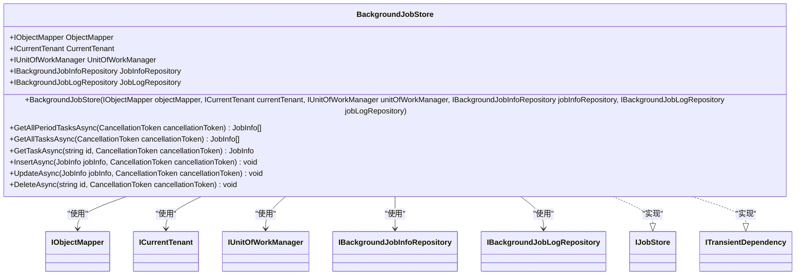

# 任务管理服务

<cite>
**本文档引用的文件**  
- [BackgroundJobInfo.cs](file://aspnet-core\modules\task-management\LINGYUN.Abp.TaskManagement.Domain\LINGYUN\Abp\TaskManagement\BackgroundJobInfo.cs)
- [BackgroundJobManager.cs](file://aspnet-core\modules\task-management\LINGYUN.Abp.TaskManagement.Domain\LINGYUN\Abp\TaskManagement\BackgroundJobManager.cs)
- [BackgroundJobStore.cs](file://aspnet-core\modules\task-management\LINGYUN.Abp.TaskManagement.Domain\LINGYUN\Abp\TaskManagement\BackgroundJobStore.cs)
- [BackgroundJobInfoAppService.cs](file://aspnet-core\modules\task-management\LINGYUN.Abp.TaskManagement.Application\LINGYUN\Abp\TaskManagement\BackgroundJobInfoAppService.cs)
- [BackgroundJobInfoController.cs](file://aspnet-core\modules\task-management\LINGYUN.Abp.TaskManagement.HttpApi\LINGYUN\Abp\TaskManagement\BackgroundJobInfoController.cs)
- [AbpBackgroundTasksQuartzModule.cs](file://aspnet-core\modules\task-management\LINGYUN.Abp.BackgroundTasks.Quartz\LINGYUN\Abp\BackgroundTasks\Quartz\AbpBackgroundTasksQuartzModule.cs)
- [QuartzJobListener.cs](file://aspnet-core\modules\task-management\LINGYUN.Abp.BackgroundTasks.Quartz\LINGYUN\Abp\BackgroundTasks\Quartz\QuartzJobListener.cs)
- [QuartzTriggerListener.cs](file://aspnet-core\modules\task-management\LINGYUN.Abp.BackgroundTasks.Quartz\LINGYUN\Abp\BackgroundTasks\Quartz\QuartzTriggerListener.cs)
- [TaskManagementPermissions.cs](file://aspnet-core\modules\task-management\LINGYUN.Abp.TaskManagement.Application.Contracts\LINGYUN\Abp\TaskManagement\Permissions\TaskManagementPermissions.cs)
- [TaskManagementPermissionDefinitionProvider.cs](file://aspnet-core\modules\task-management\LINGYUN.Abp.TaskManagement.Application.Contracts\LINGYUN\Abp\TaskManagement\Permissions\TaskManagementPermissionDefinitionProvider.cs)
- [IBackgroundJobInfoRepository.cs](file://aspnet-core\modules\task-management\LINGYUN.Abp.TaskManagement.Domain\LINGYUN\Abp\TaskManagement\IBackgroundJobInfoRepository.cs)
- [BackgroundJobEto.cs](file://aspnet-core\modules\task-management\LINGYUN.Abp.TaskManagement.Domain.Shared\LINGYUN\Abp\TaskManagement\BackgroundJobEto.cs)
</cite>

## 目录
1. [简介](#简介)
2. [项目结构](#项目结构)
3. [核心组件](#核心组件)
4. [架构概述](#架构概述)
5. [详细组件分析](#详细组件分析)
6. [依赖分析](#依赖分析)
7. [性能考虑](#性能考虑)
8. [故障排除指南](#故障排除指南)
9. [结论](#结论)

## 简介
任务管理服务是ABP框架中的一个核心模块，提供强大的后台任务、定时任务和工作流调度功能。该服务基于Quartz.NET实现，支持分布式环境下的任务调度，确保任务执行的可靠性和一致性。服务提供了完整的任务生命周期管理，包括任务创建、启动、暂停、恢复、触发和删除等操作。通过集成分布式锁机制，确保在集群环境下任务不会被重复执行。同时，服务还提供了完善的监控、错误处理和重试机制，确保关键业务任务的可靠执行。

## 项目结构
任务管理服务采用模块化设计，分为多个独立的组件，每个组件负责特定的功能。服务的核心功能分布在领域层、应用层和HTTP API层，遵循分层架构原则。

**图示来源**
- [BackgroundJobInfo.cs](file://aspnet-core\modules\task-management\LINGYUN.Abp.TaskManagement.Domain\LINGYUN\Abp\TaskManagement\BackgroundJobInfo.cs)
- [BackgroundJobManager.cs](file://aspnet-core\modules\task-management\LINGYUN.Abp.TaskManagement.Domain\LINGYUN\Abp\TaskManagement\BackgroundJobManager.cs)
- [BackgroundJobStore.cs](file://aspnet-core\modules\task-management\LINGYUN.Abp.TaskManagement.Domain\LINGYUN\Abp\TaskManagement\BackgroundJobStore.cs)
- [BackgroundJobInfoAppService.cs](file://aspnet-core\modules\task-management\LINGYUN.Abp.TaskManagement.Application\LINGYUN\Abp\TaskManagement\BackgroundJobInfoAppService.cs)
- [BackgroundJobInfoController.cs](file://aspnet-core\modules\task-management\LINGYUN.Abp.TaskManagement.HttpApi\LINGYUN\Abp\TaskManagement\BackgroundJobInfoController.cs)
- [AbpBackgroundTasksQuartzModule.cs](file://aspnet-core\modules\task-management\LINGYUN.Abp.BackgroundTasks.Quartz\LINGYUN\Abp\BackgroundTasks\Quartz\AbpBackgroundTasksQuartzModule.cs)

## 核心组件
任务管理服务的核心组件包括任务信息实体、任务管理器、任务存储、应用服务和HTTP API控制器。这些组件协同工作，提供完整的任务管理功能。

**组件来源**
- [BackgroundJobInfo.cs](file://aspnet-core\modules\task-management\LINGYUN.Abp.TaskManagement.Domain\LINGYUN\Abp\TaskManagement\BackgroundJobInfo.cs)
- [BackgroundJobManager.cs](file://aspnet-core\modules\task-management\LINGYUN.Abp.TaskManagement.Domain\LINGYUN\Abp\TaskManagement\BackgroundJobManager.cs)
- [BackgroundJobStore.cs](file://aspnet-core\modules\task-management\LINGYUN.Abp.TaskManagement.Domain\LINGYUN\Abp\TaskManagement\BackgroundJobStore.cs)

## 架构概述
任务管理服务采用分层架构设计，分为领域层、应用层和表现层。领域层负责核心业务逻辑和数据持久化，应用层提供业务服务接口，表现层提供RESTful API接口。

**图示来源**
- [BackgroundJobInfoController.cs](file://aspnet-core\modules\task-management\LINGYUN.Abp.TaskManagement.HttpApi\LINGYUN\Abp\TaskManagement\BackgroundJobInfoController.cs)
- [BackgroundJobInfoAppService.cs](file://aspnet-core\modules\task-management\LINGYUN.Abp.TaskManagement.Application\LINGYUN\Abp\TaskManagement\BackgroundJobInfoAppService.cs)
- [BackgroundJobManager.cs](file://aspnet-core\modules\task-management\LINGYUN.Abp.TaskManagement.Domain\LINGYUN\Abp\TaskManagement\BackgroundJobManager.cs)
- [IBackgroundJobInfoRepository.cs](file://aspnet-core\modules\task-management\LINGYUN.Abp.TaskManagement.Domain\LINGYUN\Abp\TaskManagement\IBackgroundJobInfoRepository.cs)

## 详细组件分析
### 任务信息实体分析
任务信息实体（BackgroundJobInfo）是任务管理服务的核心数据模型，包含任务的所有属性和行为。

**图示来源**
- [BackgroundJobInfo.cs](file://aspnet-core\modules\task-management\LINGYUN.Abp.TaskManagement.Domain\LINGYUN\Abp\TaskManagement\BackgroundJobInfo.cs)

### 任务管理器分析
任务管理器（BackgroundJobManager）负责任务的创建、更新、删除等核心业务逻辑。

**图示来源**
- [BackgroundJobManager.cs](file://aspnet-core\modules\task-management\LINGYUN.Abp.TaskManagement.Domain\LINGYUN\Abp\TaskManagement\BackgroundJobManager.cs)

### 任务存储分析
任务存储（BackgroundJobStore）实现了IJobStore接口，负责与Quartz调度器交互的任务持久化。

**图示来源**
- [BackgroundJobStore.cs](file://aspnet-core\modules\task-management\LINGYUN.Abp.TaskManagement.Domain\LINGYUN\Abp\TaskManagement\BackgroundJobStore.cs)

### 应用服务分析
应用服务（BackgroundJobInfoAppService）提供任务管理的业务接口，是领域层和表现层之间的桥梁。

**图示来源**
- [BackgroundJobInfoAppService.cs](file://aspnet-core\modules\task-management\LINGYUN.Abp.TaskManagement.Application\LINGYUN\Abp\TaskManagement\BackgroundJobInfoAppService.cs)

### HTTP API控制器分析
HTTP API控制器（BackgroundJobInfoController）提供RESTful接口，供前端或其他服务调用。

**图示来源**
- [BackgroundJobInfoController.cs](file://aspnet-core\modules\task-management\LINGYUN.Abp.TaskManagement.HttpApi\LINGYUN\Abp\TaskManagement\BackgroundJobInfoController.cs)
- [BackgroundJobInfoAppService.cs](file://aspnet-core\modules\task-management\LINGYUN.Abp.TaskManagement.Application\LINGYUN\Abp\TaskManagement\BackgroundJobInfoAppService.cs)
- [BackgroundJobManager.cs](file://aspnet-core\modules\task-management\LINGYUN.Abp.TaskManagement.Domain\LINGYUN\Abp\TaskManagement\BackgroundJobManager.cs)
- [IBackgroundJobInfoRepository.cs](file://aspnet-core\modules\task-management\LINGYUN.Abp.TaskManagement.Domain\LINGYUN\Abp\TaskManagement\IBackgroundJobInfoRepository.cs)

### Quartz集成分析
Quartz集成模块实现了Quartz.NET调度器的监听器，用于监控任务执行状态并触发相应事件。

**图示来源**
- [AbpBackgroundTasksQuartzModule.cs](file://aspnet-core\modules\task-management\LINGYUN.Abp.BackgroundTasks.Quartz\LINGYUN\Abp\BackgroundTasks\Quartz\AbpBackgroundTasksQuartzModule.cs)
- [QuartzJobListener.cs](file://aspnet-core\modules\task-management\LINGYUN.Abp.BackgroundTasks.Quartz\LINGYUN\Abp\BackgroundTasks\Quartz\QuartzJobListener.cs)
- [QuartzTriggerListener.cs](file://aspnet-core\modules\task-management\LINGYUN.Abp.BackgroundTasks.Quartz\LINGYUN\Abp\BackgroundTasks\Quartz\QuartzTriggerListener.cs)

## 依赖分析
任务管理服务依赖于多个核心模块和第三方库，形成了复杂的依赖关系网络。

**图示来源**
- [BackgroundJobInfo.cs](file://aspnet-core\modules\task-management\LINGYUN.Abp.TaskManagement.Domain\LINGYUN\Abp\TaskManagement\BackgroundJobInfo.cs)
- [BackgroundJobManager.cs](file://aspnet-core\modules\task-management\LINGYUN.Abp.TaskManagement.Domain\LINGYUN\Abp\TaskManagement\BackgroundJobManager.cs)
- [BackgroundJobStore.cs](file://aspnet-core\modules\task-management\LINGYUN.Abp.TaskManagement.Domain\LINGYUN\Abp\TaskManagement\BackgroundJobStore.cs)
- [AbpBackgroundTasksQuartzModule.cs](file://aspnet-core\modules\task-management\LINGYUN.Abp.BackgroundTasks.Quartz\LINGYUN\Abp\BackgroundTasks\Quartz\AbpBackgroundTasksQuartzModule.cs)

## 性能考虑
任务管理服务在设计时充分考虑了性能因素，通过多种机制确保在高并发场景下的稳定运行。

1. **数据库优化**：任务信息实体采用聚合根模式，减少数据库查询次数。关键字段如Name、Group等都建立了索引，提高查询效率。

2. **缓存策略**：对于频繁访问但不经常变化的数据，如任务定义信息，采用内存缓存机制，减少数据库压力。

3. **异步处理**：所有任务操作都采用异步编程模型，避免阻塞主线程，提高系统吞吐量。

4. **批量操作**：提供批量启动、停止、暂停等操作接口，减少网络往返次数，提高操作效率。

5. **连接池**：数据库连接采用连接池管理，避免频繁创建和销毁连接的开销。

6. **分页查询**：任务列表查询支持分页，避免一次性加载大量数据导致内存溢出。

7. **参数验证**：在服务入口处进行严格的参数验证，避免无效请求进入核心处理逻辑。

8. **日志级别控制**：根据操作的重要程度设置不同的日志级别，避免产生过多的日志文件。

## 故障排除指南
### 任务无法启动
1. 检查任务的`IsEnabled`属性是否为`true`
2. 检查任务的`BeginTime`是否已到达
3. 检查任务的`Status`是否为`Queuing`状态
4. 查看Quartz调度器日志，确认是否有调度异常

### 任务重复执行
1. 检查`LockTimeOut`配置是否合理
2. 确认分布式锁服务是否正常工作
3. 检查