# 分布式锁机制

<cite>
**本文档中引用的文件**
- [IJobLockProvider.cs](file://aspnet-core/modules/task-management/LINGYUN.Abp.BackgroundTasks/LINGYUN/Abp/BackgroundTasks/IJobLockProvider.cs)
- [DefaultJobLockProvider.cs](file://aspnet-core/modules/task-management/LINGYUN.Abp.BackgroundTasks/LINGYUN/Abp/BackgroundTasks/DefaultJobLockProvider.cs)
- [JobDistributedLockingProvider.cs](file://aspnet-core/modules/task-management/LINGYUN.Abp.BackgroundTasks.DistributedLocking/LINGYUN/Abp/BackgroundTasks/DistributedLocking/JobDistributedLockingProvider.cs)
- [AbpDistributedLockingDaprModule.cs](file://aspnet-core/framework/dapr/LINGYUN.Abp.DistributedLocking.Dapr/LINGYUN/Abp/DistributedLocking/Dapr/AbpDistributedLockingDaprModule.cs)
- [DaprAbpDistributedLock.cs](file://aspnet-core/framework/dapr/LINGYUN.Abp.DistributedLocking.Dapr/LINGYUN/Abp/DistributedLocking/Dapr/DaprAbpDistributedLock.cs)
- [AbpDistributedLockingDaprOptions.cs](file://aspnet-core/framework/dapr/LINGYUN.Abp.DistributedLocking.Dapr/LINGYUN/Abp/DistributedLocking/Dapr/AbpDistributedLockingDaprOptions.cs)
- [DaprAbpDistributedLockHandle.cs](file://aspnet-core/framework/dapr/LINGYUN.Abp.DistributedLocking.Dapr/LINGYUN/Abp/DistributedLocking/Dapr/DaprAbpDistributedLockHandle.cs)
- [QuartzTriggerListener.cs](file://aspnet-core/modules/task-management/LINGYUN.Abp.BackgroundTasks.Quartz/LINGYUN/Abp/BackgroundTasks/Quartz/QuartzTriggerListener.cs)
- [appsettings.json](file://aspnet-core/templates/micro/content/migrations/PackageName.CompanyName.ProjectName.DbMigrator/appsettings.json)
</cite>

## 目录
1. [简介](#简介)
2. [项目结构](#项目结构)
3. [核心组件](#核心组件)
4. [架构概览](#架构概览)
5. [详细组件分析](#详细组件分析)
6. [依赖关系分析](#依赖关系分析)
7. [性能考虑](#性能考虑)
8. [故障排除指南](#故障排除指南)
9. [结论](#结论)

## 简介

分布式锁机制是现代微服务架构中的关键组件，用于在分布式环境下协调任务执行，防止多个节点同时访问共享资源导致的数据不一致问题。本文档深入分析了ABP框架中实现的分布式锁机制，重点关注DefaultJobLockProvider的实现原理和锁竞争处理策略。

分布式锁的核心目标是在集群环境中确保任务执行的原子性和一致性，避免重复执行和竞态条件。通过基于数据库的分布式锁实现方式，系统能够在高并发环境下提供可靠的同步控制机制。

## 项目结构

分布式锁机制在ABP框架中的实现主要分布在以下几个模块中：

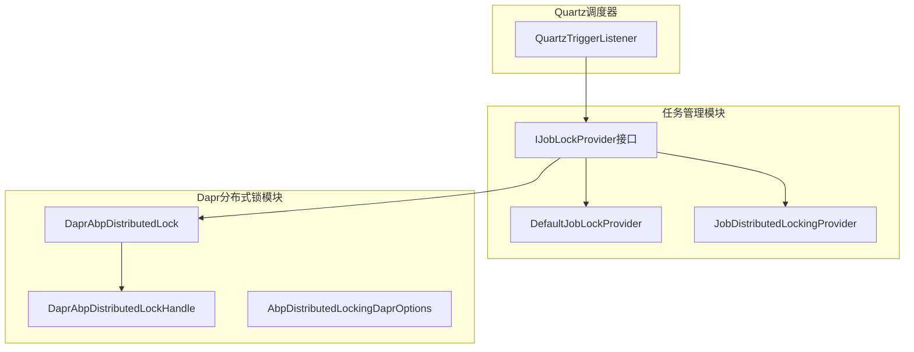

**图表来源**
- [IJobLockProvider.cs](file://aspnet-core/modules/task-management/LINGYUN.Abp.BackgroundTasks/LINGYUN/Abp/BackgroundTasks/IJobLockProvider.cs#L1-L17)
- [DefaultJobLockProvider.cs](file://aspnet-core/modules/task-management/LINGYUN.Abp.BackgroundTasks/LINGYUN/Abp/BackgroundTasks/DefaultJobLockProvider.cs#L1-L57)
- [JobDistributedLockingProvider.cs](file://aspnet-core/modules/task-management/LINGYUN.Abp.BackgroundTasks.DistributedLocking/LINGYUN/Abp/BackgroundTasks/DistributedLocking/JobDistributedLockingProvider.cs#L1-L61)

**章节来源**
- [IJobLockProvider.cs](file://aspnet-core/modules/task-management/LINGYUN.Abp.BackgroundTasks/LINGYUN/Abp/BackgroundTasks/IJobLockProvider.cs#L1-L17)
- [DefaultJobLockProvider.cs](file://aspnet-core/modules/task-management/LINGYUN.Abp.BackgroundTasks/LINGYUN/Abp/BackgroundTasks/DefaultJobLockProvider.cs#L1-L57)

## 核心组件

### IJobLockProvider接口

分布式锁的核心抽象接口，定义了任务锁定的基本操作：

```csharp
public interface IJobLockProvider
{
    Task<bool> TryLockAsync(string jobKey, int lockSeconds);
    Task<bool> TryReleaseAsync(string jobKey);
}
```

该接口提供了两个核心方法：
- `TryLockAsync`: 尝试获取指定键的任务锁
- `TryReleaseAsync`: 释放指定键的任务锁

### DefaultJobLockProvider实现

本地内存级别的分布式锁实现，适用于单机环境或小型集群：

```csharp
[Dependency(TryRegister = true)]
public class DefaultJobLockProvider : IJobLockProvider, ISingletonDependency
{
    private readonly ConcurrentDictionary<string, JobLock> _localSyncObjects = new();
    
    public virtual Task<bool> TryLockAsync(string jobKey, int lockSeconds)
    {
        // 实现本地锁逻辑
    }
}
```

### JobDistributedLockingProvider实现

基于ABP分布式锁抽象的实现，支持多种后端存储：

```csharp
[Dependency(ReplaceServices = true)]
public class JobDistributedLockingProvider : IJobLockProvider, ISingletonDependency
{
    protected IMemoryCache LockCache { get; }
    protected IAbpDistributedLock DistributedLock { get; }
    
    public async virtual Task<bool> TryLockAsync(string jobKey, int lockSeconds)
    {
        var handle = await DistributedLock.TryAcquireAsync(jobKey);
        // 实现分布式锁逻辑
    }
}
```

**章节来源**
- [DefaultJobLockProvider.cs](file://aspnet-core/modules/task-management/LINGYUN.Abp.BackgroundTasks/LINGYUN/Abp/BackgroundTasks/DefaultJobLockProvider.cs#L8-L57)
- [JobDistributedLockingProvider.cs](file://aspnet-core/modules/task-management/LINGYUN.Abp.BackgroundTasks.DistributedLocking/LINGYUN/Abp/BackgroundTasks/DistributedLocking/JobDistributedLockingProvider.cs#L9-L61)

## 架构概览

分布式锁机制的整体架构采用分层设计，支持多种实现策略：

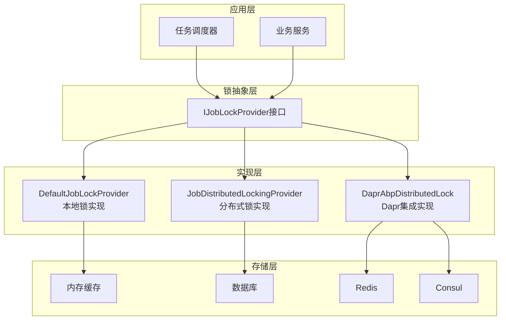

**图表来源**
- [DefaultJobLockProvider.cs](file://aspnet-core/modules/task-management/LINGYUN.Abp.BackgroundTasks/LINGYUN/Abp/BackgroundTasks/DefaultJobLockProvider.cs#L8-L10)
- [JobDistributedLockingProvider.cs](file://aspnet-core/modules/task-management/LINGYUN.Abp.BackgroundTasks.DistributedLocking/LINGYUN/Abp/BackgroundTasks/DistributedLocking/JobDistributedLockingProvider.cs#L9-L12)
- [DaprAbpDistributedLock.cs](file://aspnet-core/framework/dapr/LINGYUN.Abp.DistributedLocking.Dapr/LINGYUN/Abp/DistributedLocking/Dapr/DaprAbpDistributedLock.cs#L13-L20)

## 详细组件分析

### DefaultJobLockProvider详细分析

DefaultJobLockProvider是一个基于本地内存的分布式锁实现，适用于单机或多节点集群环境：

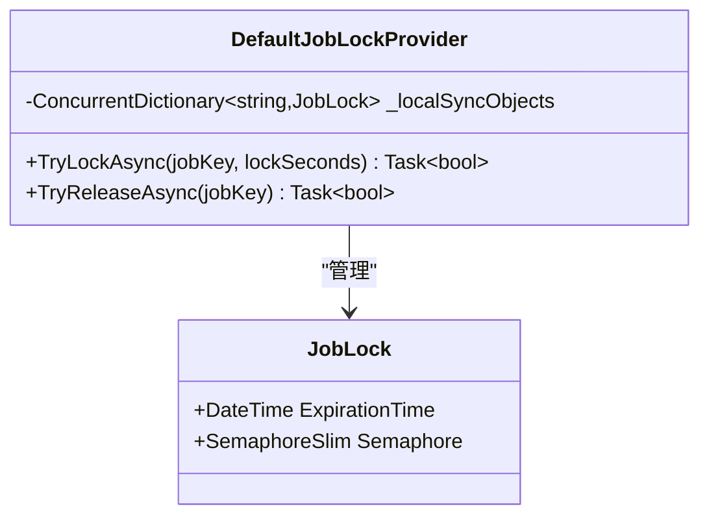

**图表来源**
- [DefaultJobLockProvider.cs](file://aspnet-core/modules/task-management/LINGYUN.Abp.BackgroundTasks/LINGYUN/Abp/BackgroundTasks/DefaultJobLockProvider.cs#L8-L57)

#### 锁获取流程

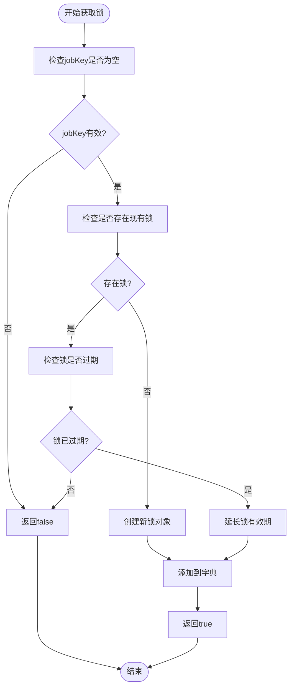

**图表来源**
- [DefaultJobLockProvider.cs](file://aspnet-core/modules/task-management/LINGYUN.Abp.BackgroundTasks/LINGYUN/Abp/BackgroundTasks/DefaultJobLockProvider.cs#L12-L32)

#### 锁释放流程

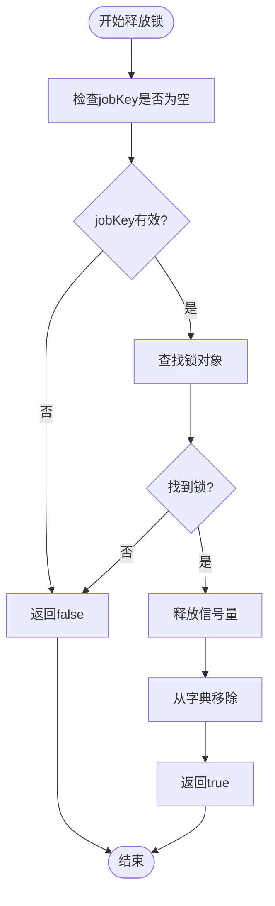

**图表来源**
- [DefaultJobLockProvider.cs](file://aspnet-core/modules/task-management/LINGYUN.Abp.BackgroundTasks/LINGYUN/Abp/BackgroundTasks/DefaultJobLockProvider.cs#L34-L50)

**章节来源**
- [DefaultJobLockProvider.cs](file://aspnet-core/modules/task-management/LINGYUN.Abp.BackgroundTasks/LINGYUN/Abp/BackgroundTasks/DefaultJobLockProvider.cs#L12-L57)

### JobDistributedLockingProvider详细分析

JobDistributedLockingProvider基于ABP分布式锁抽象，支持多种后端存储：

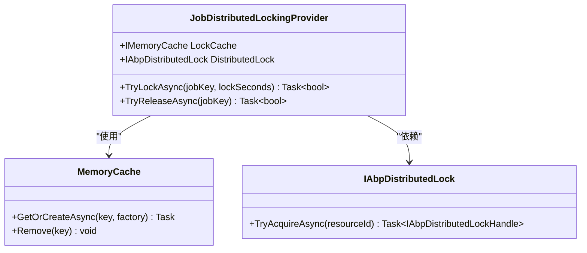

**图表来源**
- [JobDistributedLockingProvider.cs](file://aspnet-core/modules/task-management/LINGYUN.Abp.BackgroundTasks.DistributedLocking/LINGYUN/Abp/BackgroundTasks/DistributedLocking/JobDistributedLockingProvider.cs#L9-L15)

#### 分布式锁获取流程

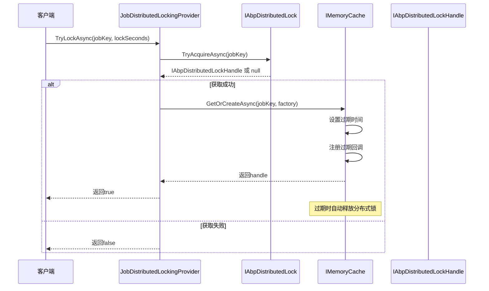

**图表来源**
- [JobDistributedLockingProvider.cs](file://aspnet-core/modules/task-management/LINGYUN.Abp.BackgroundTasks.DistributedLocking/LINGYUN/Abp/BackgroundTasks/DistributedLocking/JobDistributedLockingProvider.cs#L17-L42)

**章节来源**
- [JobDistributedLockingProvider.cs](file://aspnet-core/modules/task-management/LINGYUN.Abp.BackgroundTasks.DistributedLocking/LINGYUN/Abp/BackgroundTasks/DistributedLocking/JobDistributedLockingProvider.cs#L17-L61)

### Dapr分布式锁实现分析

Dapr分布式锁实现提供了与Dapr分布式锁服务的无缝集成：

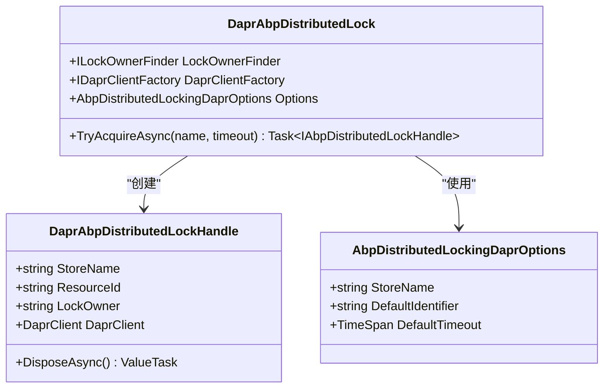

**图表来源**
- [DaprAbpDistributedLock.cs](file://aspnet-core/framework/dapr/LINGYUN.Abp.DistributedLocking.Dapr/LINGYUN/Abp/DistributedLocking/Dapr/DaprAbpDistributedLock.cs#L13-L20)
- [DaprAbpDistributedLockHandle.cs](file://aspnet-core/framework/dapr/LINGYUN.Abp.DistributedLocking.Dapr/LINGYUN/Abp/DistributedLocking/Dapr/DaprAbpDistributedLockHandle.cs#L7-L27)
- [AbpDistributedLockingDaprOptions.cs](file://aspnet-core/framework/dapr/LINGYUN.Abp.DistributedLocking.Dapr/LINGYUN/Abp/DistributedLocking/Dapr/AbpDistributedLockingDaprOptions.cs#L5-L34)

#### Dapr锁获取流程

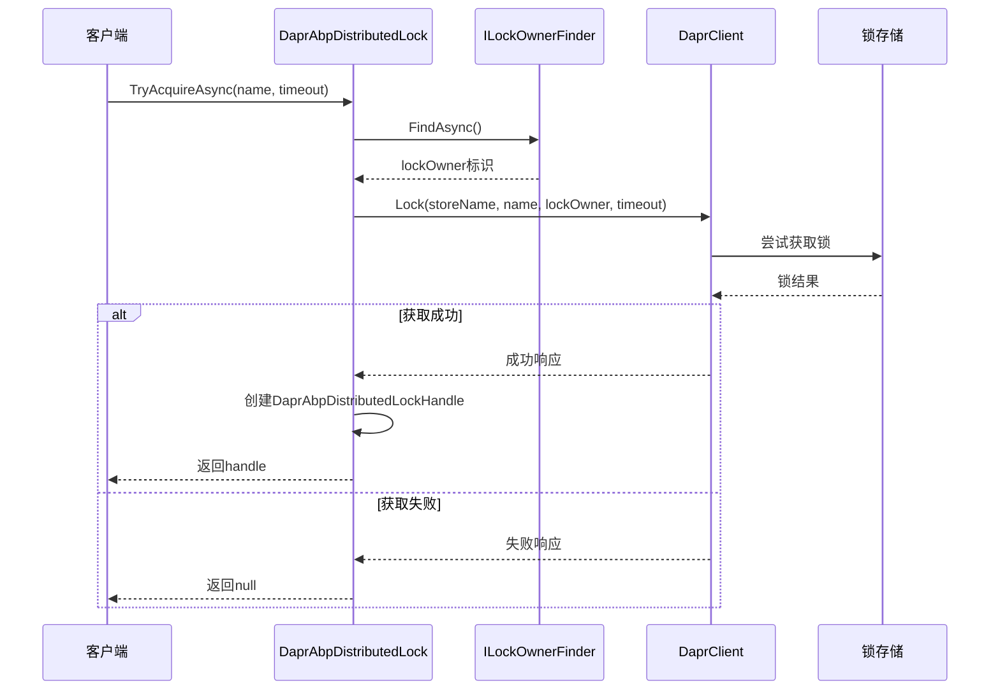

**图表来源**
- [DaprAbpDistributedLock.cs](file://aspnet-core/framework/dapr/LINGYUN.Abp.DistributedLocking.Dapr/LINGYUN/Abp/DistributedLocking/Dapr/DaprAbpDistributedLock.cs#L32-L59)

**章节来源**
- [DaprAbpDistributedLock.cs](file://aspnet-core/framework/dapr/LINGYUN.Abp.DistributedLocking.Dapr/LINGYUN/Abp/DistributedLocking/Dapr/DaprAbpDistributedLock.cs#L32-L59)
- [AbpDistributedLockingDaprOptions.cs](file://aspnet-core/framework/dapr/LINGYUN.Abp.DistributedLocking.Dapr/LINGYUN/Abp/DistributedLocking/Dapr/AbpDistributedLockingDaprOptions.cs#L5-L34)

### Quartz触发器监听器分析

QuartzTriggerListener集成了分布式锁机制，确保任务在集群环境中的唯一性：

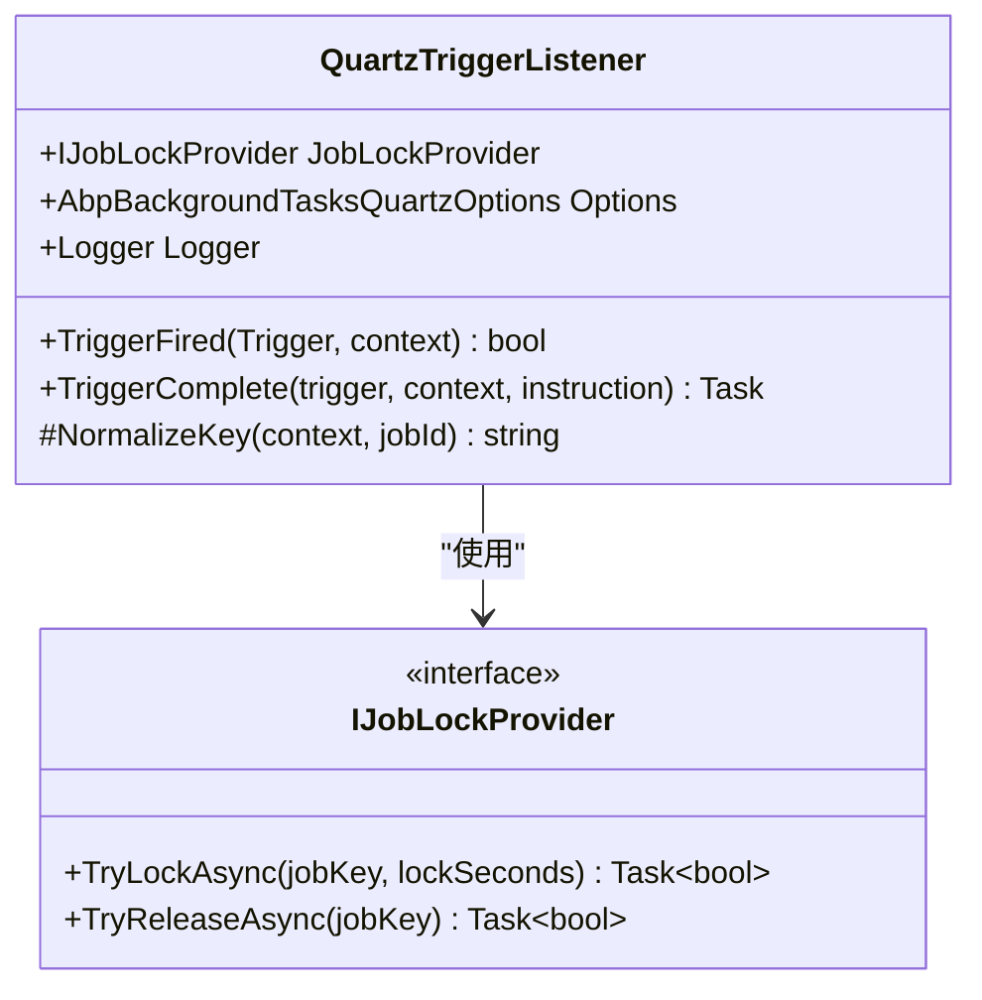

**图表来源**
- [QuartzTriggerListener.cs](file://aspnet-core/modules/task-management/LINGYUN.Abp.BackgroundTasks.Quartz/LINGYUN/Abp/BackgroundTasks/Quartz/QuartzTriggerListener.cs#L38-L77)

#### 触发器监听器工作流程

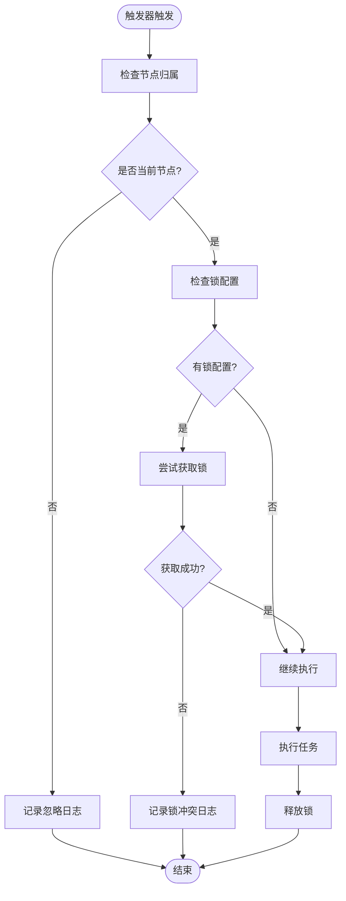

**图表来源**
- [QuartzTriggerListener.cs](file://aspnet-core/modules/task-management/LINGYUN.Abp.BackgroundTasks.Quartz/LINGYUN/Abp/BackgroundTasks/Quartz/QuartzTriggerListener.cs#L38-L77)

**章节来源**
- [QuartzTriggerListener.cs](file://aspnet-core/modules/task-management/LINGYUN.Abp.BackgroundTasks.Quartz/LINGYUN/Abp/BackgroundTasks/Quartz/QuartzTriggerListener.cs#L38-L77)

## 依赖关系分析

分布式锁机制的依赖关系展现了清晰的分层架构：

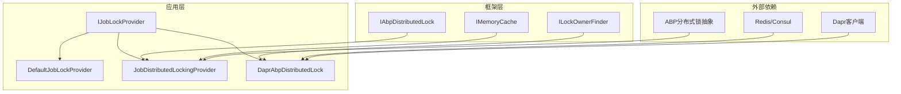

**图表来源**
- [JobDistributedLockingProvider.cs](file://aspnet-core/modules/task-management/LINGYUN.Abp.BackgroundTasks.DistributedLocking/LINGYUN/Abp/BackgroundTasks/DistributedLocking/JobDistributedLockingProvider.cs#L9-L15)
- [DaprAbpDistributedLock.cs](file://aspnet-core/framework/dapr/LINGYUN.Abp.DistributedLocking.Dapr/LINGYUN/Abp/DistributedLocking/Dapr/DaprAbpDistributedLock.cs#L13-L20)

**章节来源**
- [JobDistributedLockingProvider.cs](file://aspnet-core/modules/task-management/LINGYUN.Abp.BackgroundTasks.DistributedLocking/LINGYUN/Abp/BackgroundTasks/DistributedLocking/JobDistributedLockingProvider.cs#L9-L15)
- [DaprAbpDistributedLock.cs](file://aspnet-core/framework/dapr/LINGYUN.Abp.DistributedLocking.Dapr/LINGYUN/Abp/DistributedLocking/Dapr/DaprAbpDistributedLock.cs#L13-L20)

## 性能考虑

### 锁粒度控制

分布式锁的性能很大程度上取决于锁粒度的设计：

1. **细粒度锁**: 提供更高的并发性能，但增加了锁管理的复杂性
2. **粗粒度锁**: 简化了锁管理，但可能降低并发性能

### 死锁预防

系统采用了多种策略预防死锁：

1. **超时机制**: 所有锁都设置了合理的超时时间
2. **自动释放**: 过期的锁会自动释放
3. **资源隔离**: 不同类型的资源使用不同的锁键

### 性能优化建议

1. **合理设置超时时间**: 根据业务需求调整锁的超时时间
2. **选择合适的存储后端**: Redis适合高并发场景，Consul适合强一致性场景
3. **监控锁争用情况**: 通过日志和指标监控锁的使用情况

## 故障排除指南

### 常见问题及解决方案

#### 1. 锁获取失败

**症状**: 任务无法获取锁，返回false
**原因**: 
- 锁已被其他节点持有
- 锁超时时间设置过短
- 存储后端不可用

**解决方案**:
```csharp
// 调整超时时间
var lockOptions = new DistributedLockOptions
{
    Timeout = TimeSpan.FromSeconds(30),
    RetryDelay = TimeSpan.FromMilliseconds(100)
};

// 检查存储后端连接
```

#### 2. 锁泄漏

**症状**: 锁长时间未释放
**原因**:
- 异常情况下未正确释放锁
- 超时机制失效

**解决方案**:
```csharp
// 使用using语句确保锁的正确释放
using (var handle = await lockProvider.TryAcquireAsync("resource"))
{
    if (handle != null)
    {
        // 执行业务逻辑
    }
}
// 锁会在using语句结束时自动释放
```

#### 3. 集群环境下的锁竞争

**症状**: 在集群环境中出现重复执行
**原因**:
- 节点间时钟不同步
- 锁的键值设计不合理

**解决方案**:
```csharp
// 使用包含节点信息的键值
var jobKey = $"node-{Environment.MachineName}:{jobId}";
```

**章节来源**
- [DaprAbpDistributedLock.cs](file://aspnet-core/framework/dapr/LINGYUN.Abp.DistributedLocking.Dapr/LINGYUN/Abp/DistributedLocking/Dapr/DaprAbpDistributedLock.cs#L32-L59)
- [QuartzTriggerListener.cs](file://aspnet-core/modules/task-management/LINGYUN.Abp.BackgroundTasks.Quartz/LINGYUN/Abp/BackgroundTasks/Quartz/QuartzTriggerListener.cs#L38-L77)

## 结论

ABP框架中的分布式锁机制提供了一个完整而灵活的解决方案，能够满足不同规模和复杂度的分布式应用场景。通过DefaultJobLockProvider、JobDistributedLockingProvider和Dapr集成等多种实现方式，开发者可以根据具体需求选择最适合的方案。

### 主要优势

1. **多层抽象**: 从本地内存到分布式存储的完整支持
2. **灵活配置**: 支持多种存储后端和自定义配置
3. **易于使用**: 简洁的接口设计和丰富的示例
4. **高性能**: 优化的锁获取和释放机制

### 最佳实践建议

1. **根据场景选择实现**: 单机环境使用DefaultJobLockProvider，集群环境使用分布式实现
2. **合理设置超时**: 平衡性能和可靠性
3. **监控和告警**: 建立完善的监控体系
4. **定期维护**: 清理过期的锁资源

分布式锁机制是构建可靠分布式系统的重要基石，通过本文档的详细分析，开发者可以更好地理解和应用这一关键技术。