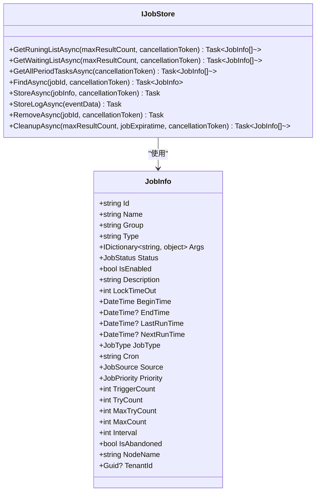
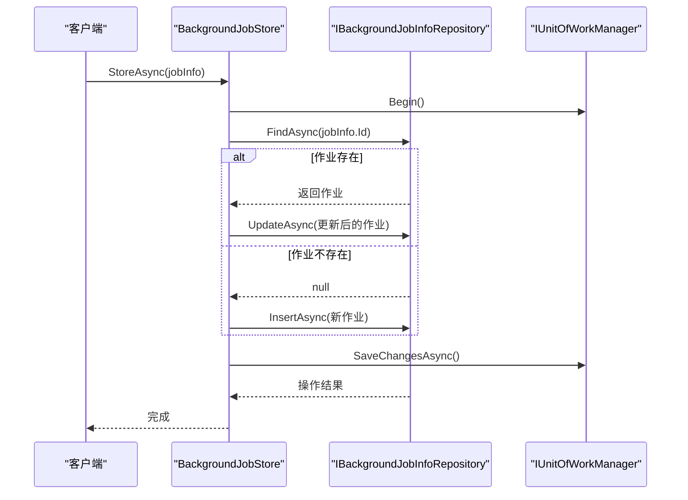
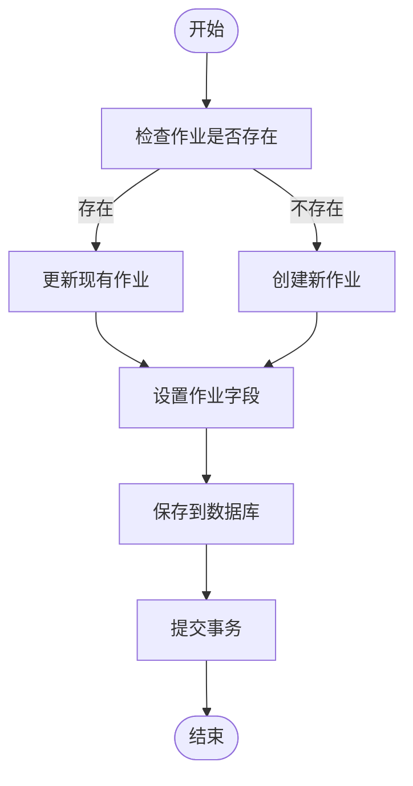
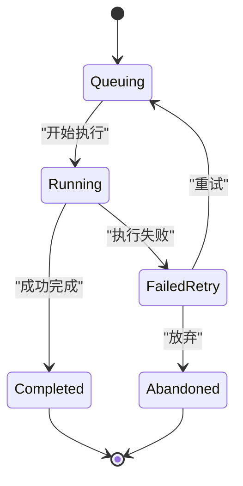
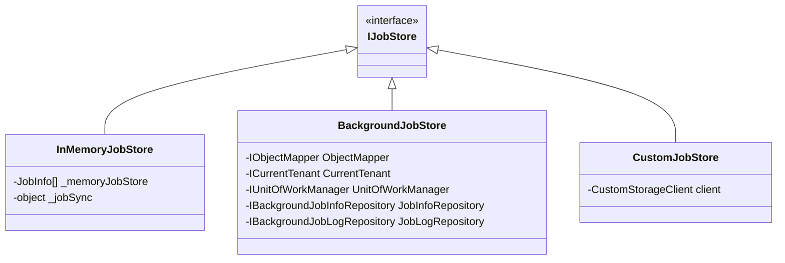

# 作业存储

<cite>
**本文档引用的文件**
- [IJobStore.cs](file://aspnet-core/modules/task-management/LINGYUN.Abp.BackgroundTasks/LINGYUN/Abp/BackgroundTasks/IJobStore.cs)
- [InMemoryJobStore.cs](file://aspnet-core/modules/task-management/LINGYUN.Abp.BackgroundTasks/LINGYUN/Abp/BackgroundTasks/Internal/InMemoryJobStore.cs)
- [BackgroundJobStore.cs](file://aspnet-core/modules/task-management/LINGYUN.Abp.TaskManagement.Domain/LINGYUN/Abp/TaskManagement/BackgroundJobStore.cs)
- [BackgroundJobInfo.cs](file://aspnet-core/modules/task-management/LINGYUN.Abp.TaskManagement.Domain/LINGYUN/Abp/TaskManagement/BackgroundJobInfo.cs)
- [BackgroundJobInfoConsts.cs](file://aspnet-core/modules/task-management/LINGYUN.Abp.TaskManagement.Domain.Shared/LINGYUN/Abp/TaskManagement/BackgroundJobInfoConsts.cs)
</cite>

## 目录
1. [简介](#简介)
2. [IJobStore接口设计原理](#ijobstore接口设计原理)
3. [基于Entity Framework Core的作业存储实现](#基于entity-framework-core的作业存储实现)
4. [作业信息表结构设计](#作业信息表结构设计)
5. [作业增删改查操作实现](#作业增删改查操作实现)
6. [作业状态实时更新机制](#作业状态实时更新机制)
7. [作业存储扩展功能](#作业存储扩展功能)

## 简介
本文档详细阐述了作业存储系统的设计与实现，重点分析了IJobStore接口的设计原理和基于Entity Framework Core的具体实现。文档涵盖了作业元数据的持久化、状态管理、查询功能以及作业信息表的结构设计、索引优化和数据访问模式。同时，文档还说明了如何实现作业的增删改查操作和作业状态的实时更新机制，并提供了代码示例展示如何扩展作业存储功能以支持多种数据库后端和分布式存储方案。

## IJobStore接口设计原理
IJobStore接口是作业存储系统的核心抽象，定义了作业信息的存储、查询和管理操作。该接口通过异步方法提供高性能的数据访问能力，支持作业的运行中列表、等待中列表、周期性任务列表的获取，以及单个作业的查找、存储、删除和日志记录等功能。



**图源**
- [IJobStore.cs](file://aspnet-core/modules/task-management/LINGYUN.Abp.BackgroundTasks/LINGYUN/Abp/BackgroundTasks/IJobStore.cs#L0-L38)
- [BackgroundJobInfo.cs](file://aspnet-core/modules/task-management/LINGYUN.Abp.TaskManagement.Domain/LINGYUN/Abp/TaskManagement/BackgroundJobInfo.cs#L0-L199)

**节源**
- [IJobStore.cs](file://aspnet-core/modules/task-management/LINGYUN.Abp.BackgroundTasks/LINGYUN/Abp/BackgroundTasks/IJobStore.cs#L0-L38)

## 基于Entity Framework Core的作业存储实现
基于Entity Framework Core的作业存储实现通过BackgroundJobStore类完成，该类实现了IJobStore接口并利用ABP框架的仓储模式进行数据访问。实现采用了依赖注入和工作单元模式，确保了数据操作的一致性和事务性。



**图源**
- [BackgroundJobStore.cs](file://aspnet-core/modules/task-management/LINGYUN.Abp.TaskManagement.Domain/LINGYUN/Abp/TaskManagement/BackgroundJobStore.cs#L0-L200)
- [BackgroundJobInfo.cs](file://aspnet-core/modules/task-management/LINGYUN.Abp.TaskManagement.Domain/LINGYUN/Abp/TaskManagement/BackgroundJobInfo.cs#L0-L199)

**节源**
- [BackgroundJobStore.cs](file://aspnet-core/modules/task-management/LINGYUN.Abp.TaskManagement.Domain/LINGYUN/Abp/TaskManagement/BackgroundJobStore.cs#L0-L200)

## 作业信息表结构设计
作业信息表（BackgroundJobInfo）的设计充分考虑了作业调度的各种需求，包含了作业的基本信息、调度参数、执行状态和审计字段。表结构设计遵循了ABP框架的实体基类规范，支持多租户和软删除。

```mermaid
erDiagram
BACKGROUND_JOB_INFO {
string Id PK
Guid? TenantId FK
string Name
string Group
string Type
string Result
ExtraPropertyDictionary Args
JobStatus Status
bool IsEnabled
string Description
int LockTimeOut
DateTime BeginTime
DateTime? EndTime
DateTime? LastRunTime
DateTime? NextRunTime
JobType JobType
string Cron
JobSource Source
JobPriority Priority
int TriggerCount
int TryCount
int MaxTryCount
int MaxCount
int Interval
bool IsAbandoned
string NodeName
DateTime CreationTime
Guid? CreatorId
DateTime? LastModificationTime
Guid? LastModifierId
string ExtraProperties
}
TENANTS ||--o{ BACKGROUND_JOB_INFO : "拥有"
```

**图源**
- [BackgroundJobInfo.cs](file://aspnet-core/modules/task-management/LINGYUN.Abp.TaskManagement.Domain/LINGYUN/Abp/TaskManagement/BackgroundJobInfo.cs#L0-L199)
- [BackgroundJobInfoConsts.cs](file://aspnet-core/modules/task-management/LINGYUN.Abp.TaskManagement.Domain.Shared/LINGYUN/Abp/TaskManagement/BackgroundJobInfoConsts.cs#L0-L12)

**节源**
- [BackgroundJobInfo.cs](file://aspnet-core/modules/task-management/LINGYUN.Abp.TaskManagement.Domain/LINGYUN/Abp/TaskManagement/BackgroundJobInfo.cs#L0-L199)

## 作业增删改查操作实现
作业的增删改查操作通过BackgroundJobStore类的具体方法实现，每个操作都封装在工作单元中以确保事务性。创建和更新操作会根据作业ID是否存在来决定是插入还是更新数据库记录。



**图源**
- [BackgroundJobStore.cs](file://aspnet-core/modules/task-management/LINGYUN.Abp.TaskManagement.Domain/LINGYUN/Abp/TaskManagement/BackgroundJobStore.cs#L64-L95)
- [BackgroundJobInfo.cs](file://aspnet-core/modules/task-management/LINGYUN.Abp.TaskManagement.Domain/LINGYUN/Abp/TaskManagement/BackgroundJobInfo.cs#L0-L199)

**节源**
- [BackgroundJobStore.cs](file://aspnet-core/modules/task-management/LINGYUN.Abp.TaskManagement.Domain/LINGYUN/Abp/TaskManagement/BackgroundJobStore.cs#L64-L95)

## 作业状态实时更新机制
作业状态的实时更新机制通过StoreAsync方法实现，该方法会根据作业的当前状态和执行情况更新数据库中的相应字段。状态更新包括下次执行时间、上次执行时间、触发次数、尝试次数等关键指标。



**图源**
- [BackgroundJobStore.cs](file://aspnet-core/modules/task-management/LINGYUN.Abp.TaskManagement.Domain/LINGYUN/Abp/TaskManagement/BackgroundJobStore.cs#L64-L95)
- [BackgroundJobInfo.cs](file://aspnet-core/modules/task-management/LINGYUN.Abp.TaskManagement.Domain/LINGYUN/Abp/TaskManagement/BackgroundJobInfo.cs#L0-L199)

**节源**
- [BackgroundJobStore.cs](file://aspnet-core/modules/task-management/LINGYUN.Abp.TaskManagement.Domain/LINGYUN/Abp/TaskManagement/BackgroundJobStore.cs#L64-L95)

## 作业存储扩展功能
作业存储系统设计具有良好的扩展性，可以通过实现IJobStore接口来支持不同的存储后端。系统已经提供了内存存储和数据库存储两种实现，开发者可以根据需要添加Redis、MongoDB等其他存储方案。



**图源**
- [IJobStore.cs](file://aspnet-core/modules/task-management/LINGYUN.Abp.BackgroundTasks/LINGYUN/Abp/BackgroundTasks/IJobStore.cs#L0-L38)
- [InMemoryJobStore.cs](file://aspnet-core/modules/task-management/LINGYUN.Abp.BackgroundTasks/LINGYUN/Abp/BackgroundTasks/Internal/InMemoryJobStore.cs#L0-L154)
- [BackgroundJobStore.cs](file://aspnet-core/modules/task-management/LINGYUN.Abp.TaskManagement.Domain/LINGYUN/Abp/TaskManagement/BackgroundJobStore.cs#L0-L200)

**节源**
- [InMemoryJobStore.cs](file://aspnet-core/modules/task-management/LINGYUN.Abp.BackgroundTasks/LINGYUN/Abp/BackgroundTasks/Internal/InMemoryJobStore.cs#L0-L154)
- [BackgroundJobStore.cs](file://aspnet-core/modules/task-management/LINGYUN.Abp.TaskManagement.Domain/LINGYUN/Abp/TaskManagement/BackgroundJobStore.cs#L0-L200)