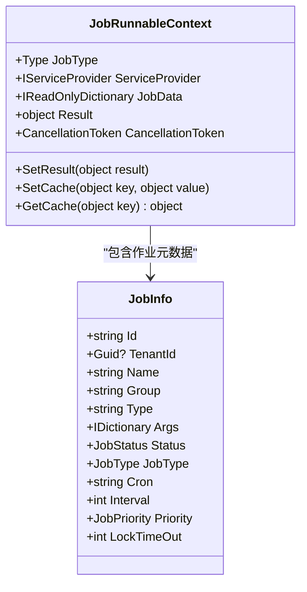
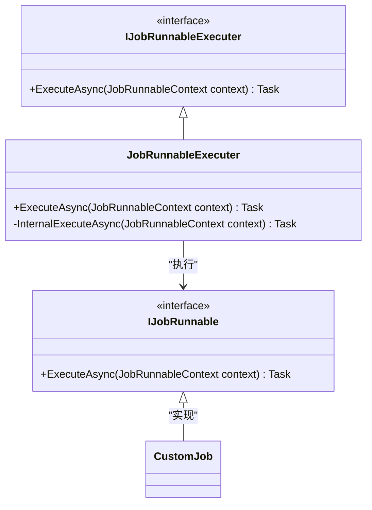

# 作业执行

<cite>
**本文档引用的文件**  
- [IJobRunnableExecuter.cs](file://aspnet-core/modules/task-management/LINGYUN.Abp.BackgroundTasks/LINGYUN/Abp/BackgroundTasks/IJobRunnableExecuter.cs)
- [JobRunnableExecuter.cs](file://aspnet-core/modules/task-management/LINGYUN.Abp.BackgroundTasks/LINGYUN/Abp/BackgroundTasks/JobRunnableExecuter.cs)
- [JobInfo.cs](file://aspnet-core/modules/task-management/LINGYUN.Abp.BackgroundTasks.Abstractions/LINGYUN/Abp/BackgroundTasks/JobInfo.cs)
- [JobRunnableContext.cs](file://aspnet-core/modules/task-management/LINGYUN.Abp.BackgroundTasks.Abstractions/LINGYUN/Abp/BackgroundTasks/JobRunnableContext.cs)
- [IJobScheduler.cs](file://aspnet-core/modules/task-management/LINGYUN.Abp.BackgroundTasks/LINGYUN/Abp/BackgroundTasks/IJobScheduler.cs)
- [QuartzJobScheduler.cs](file://aspnet-core/modules/task-management/LINGYUN.Abp.BackgroundTasks.Quartz/LINGYUN/Abp/BackgroundTasks/Quartz/QuartzJobScheduler.cs)
- [QuartzJobSearchJobAdapter.cs](file://aspnet-core/modules/task-management/LINGYUN.Abp.BackgroundTasks.Quartz/LINGYUN/Abp/BackgroundTasks/Quartz/QuartzJobSearchJobAdapter.cs)
- [IJobStore.cs](file://aspnet-core/modules/task-management/LINGYUN.Abp.BackgroundTasks/LINGYUN/Abp/BackgroundTasks/IJobStore.cs)
- [JobStatus.cs](file://aspnet-core/modules/task-management/LINGYUN.Abp.BackgroundTasks.Abstractions/LINGYUN/Abp/BackgroundTasks/JobStatus.cs)
- [JobType.cs](file://aspnet-core/modules/task-management/LINGYUN.Abp.BackgroundTasks.Abstractions/LINGYUN/Abp/BackgroundTasks/JobType.cs)
- [JobPriority.cs](file://aspnet-core/modules/task-management/LINGYUN.Abp.BackgroundTasks.Abstractions/LINGYUN/Abp/BackgroundTasks/JobPriority.cs)
- [JobSource.cs](file://aspnet-core/modules/task-management/LINGYUN.Abp.BackgroundTasks.Abstractions/LINGYUN/Abp/BackgroundTasks/JobSource.cs)
- [JobEventData.cs](file://aspnet-core/modules/task-management/LINGYUN.Abp.BackgroundTasks.EventBus/LINGYUN/Abp/BackgroundTasks/EventBus/JobEventData.cs)
- [BackgroundJobManager.cs](file://aspnet-core/modules/task-management/LINGYUN.Abp.TaskManagement.Domain/LINGYUN/Abp/TaskManagement/BackgroundJobManager.cs)
- [BackgroundJobSynchronizer.cs](file://aspnet-core/modules/task-management/LINGYUN.Abp.TaskManagement.Domain/LINGYUN/Abp/TaskManagement/BackgroundJobSynchronizer.cs)
</cite>

## 目录
1. [引言](#引言)
2. [核心组件](#核心组件)
3. [作业执行上下文与参数传递](#作业执行上下文与参数传递)
4. [作业执行器的设计与实现](#作业执行器的设计与实现)
5. [作业调度器与执行流程](#作业调度器与执行流程)
6. [作业执行模式](#作业执行模式)
7. [异常处理与重试机制](#异常处理与重试机制)
8. [分布式锁与幂等性保障](#分布式锁与幂等性保障)
9. [自定义作业执行器示例](#自定义作业执行器示例)
10. [结论](#结论)

## 引言
本文档全面阐述了ABP框架中作业执行系统的设计与实现。重点分析了IJobExecutor接口的设计理念、作业执行上下文、参数传递机制以及结果返回方式。文档详细描述了作业执行器的选择策略和执行流程，涵盖同步、异步和并行执行等模式。同时，说明了作业执行过程中异常情况的处理机制，包括重试策略、错误日志记录和告警通知。最后，通过代码示例展示了如何实现自定义作业执行器，并集成分布式锁以确保作业的幂等性。

## 核心组件

[SPEC SYMBOL](file://aspnet-core/modules/task-management/LINGYUN.Abp.BackgroundTasks/LINGYUN/Abp/BackgroundTasks/IJobRunnableExecuter.cs#L1-L11) 定义了作业执行者的核心接口，是整个作业执行系统的基础。[SPEC SYMBOL](file://aspnet-core/modules/task-management/LINGYUN.Abp.BackgroundTasks.Abstractions/LINGYUN/Abp/BackgroundTasks/JobInfo.cs#L1-L161) 类封装了作业的所有元数据，包括作业ID、名称、分组、类型、参数、状态和调度信息。[SPEC SYMBOL](file://aspnet-core/modules/task-management/LINGYUN.Abp.BackgroundTasks.Abstractions/LINGYUN/Abp/BackgroundTasks/JobRunnableContext.cs#L1-L63) 类为作业执行提供了运行时上下文，包含了服务提供者、作业数据和取消令牌等关键信息。

**本节来源**
- [IJobRunnableExecuter.cs](file://aspnet-core/modules/task-management/LINGYUN.Abp.BackgroundTasks/LINGYUN/Abp/BackgroundTasks/IJobRunnableExecuter.cs#L1-L11)
- [JobInfo.cs](file://aspnet-core/modules/task-management/LINGYUN.Abp.BackgroundTasks.Abstractions/LINGYUN/Abp/BackgroundTasks/JobInfo.cs#L1-L161)
- [JobRunnableContext.cs](file://aspnet-core/modules/task-management/LINGYUN.Abp.BackgroundTasks.Abstractions/LINGYUN/Abp/BackgroundTasks/JobRunnableContext.cs#L1-L63)

## 作业执行上下文与参数传递

作业执行上下文（JobRunnableContext）是作业执行过程中的核心数据结构，它为作业提供了执行所需的所有环境信息。上下文通过构造函数注入，确保了依赖关系的明确性和可测试性。



**图示来源**
- [JobRunnableContext.cs](file://aspnet-core/modules/task-management/LINGYUN.Abp.BackgroundTasks.Abstractions/LINGYUN/Abp/BackgroundTasks/JobRunnableContext.cs#L1-L63)
- [JobInfo.cs](file://aspnet-core/modules/task-management/LINGYUN.Abp.BackgroundTasks.Abstractions/LINGYUN/Abp/BackgroundTasks/JobInfo.cs#L1-L161)

作业的参数通过 `JobInfo` 类中的 `Args` 字典进行传递，该字典允许存储任意类型的键值对。在作业执行时，这些参数会通过 `JobRunnableContext` 的 `JobData` 属性提供给作业实现。框架提供了丰富的扩展方法来简化参数的获取：

- `GetString(key)`：获取字符串类型的参数
- `GetJobData<T>(key)`：获取指定类型的参数
- `TryGetJobData(key, out value)`：安全地尝试获取参数
- `GetOrDefaultString(key, defaultValue)`：获取参数或返回默认值

这种设计使得作业可以灵活地接收和处理各种类型的输入参数，而无需关心底层的序列化和反序列化细节。

**本节来源**
- [JobRunnableContext.cs](file://aspnet-core/modules/task-management/LINGYUN.Abp.BackgroundTasks.Abstractions/LINGYUN/Abp/BackgroundTasks/JobRunnableContext.cs#L1-L63)
- [JobInfo.cs](file://aspnet-core/modules/task-management/LINGYUN.Abp.BackgroundTasks.Abstractions/LINGYUN/Abp/BackgroundTasks/JobInfo.cs#L1-L161)
- [JobRunnableContextExtensions.cs](file://aspnet-core/modules/task-management/LINGYUN.Abp.BackgroundTasks.Abstractions/LINGYUN/Abp/BackgroundTasks/JobRunnableContextExtensions.cs#L1-L121)

## 作业执行器的设计与实现

作业执行器（Job Executor）是负责实际执行作业逻辑的组件。系统通过 `IJobRunnableExecuter` 接口定义了作业执行的标准契约。



**图示来源**
- [IJobRunnableExecuter.cs](file://aspnet-core/modules/task-management/LINGYUN.Abp.BackgroundTasks/LINGYUN/Abp/BackgroundTasks/IJobRunnableExecuter.cs#L1-L11)
- [JobRunnableExecuter.cs](file://aspnet-core/modules/task-management/LINGYUN.Abp.BackgroundTasks/LINGYUN/Abp/BackgroundTasks/JobRunnableExecuter.cs#L1-L33)
- [IJobRunnable.cs](file://aspnet-core/modules/task-management/LINGYUN.Abp.BackgroundTasks.Abstractions/LINGYUN/Abp/BackgroundTasks/IJobRunnable.cs#L1-L10)

`JobRunnableExecuter` 是 `IJobRunnableExecuter` 接口的默认实现，其核心职责是：
1. 从服务提供者（IServiceProvider）中解析出具体的作业实现
2. 在正确的租户上下文中执行作业
3. 调用作业的 `ExecuteAsync` 方法

作业的具体逻辑由实现了 `IJobRunnable` 接口的类来定义。当作业被触发时，执行器会创建一个服务作用域，然后在该作用域内解析并执行对应的作业实例。这种设计充分利用了依赖注入容器的能力，使得作业可以方便地获取所需的任何服务。

**本节来源**
- [IJobRunnableExecuter.cs](file://aspnet-core/modules/task-management/LINGYUN.Abp.BackgroundTasks/LINGYUN/Abp/BackgroundTasks/IJobRunnableExecuter.cs#L1-L11)
- [JobRunnableExecuter.cs](file://aspnet-core/modules/task-management/LINGYUN.Abp.BackgroundTasks/LINGYUN/Abp/BackgroundTasks/JobRunnableExecuter.cs#L1-L33)
- [IJobRunnable.cs](file://aspnet-core/modules/task-management/LINGYUN.Abp.BackgroundTasks.Abstractions/LINGYUN/Abp/BackgroundTasks/IJobRunnable.cs#L1-L10)

## 作业调度器与执行流程

作业调度器（Job Scheduler）负责管理作业的生命周期，包括作业的创建、调度、暂停、恢复和删除。`IJobScheduler` 接口定义了调度器的核心功能。

```mermaid
classDiagram
    class IJobScheduler {
        <<interface>>
        +QueueAsync(JobInfo job) Task<bool>
        +QueuesAsync(IEnumerable<JobInfo> jobs) Task
        +ExistsAsync(JobInfo job) Task<bool>
        +TriggerAsync(JobInfo