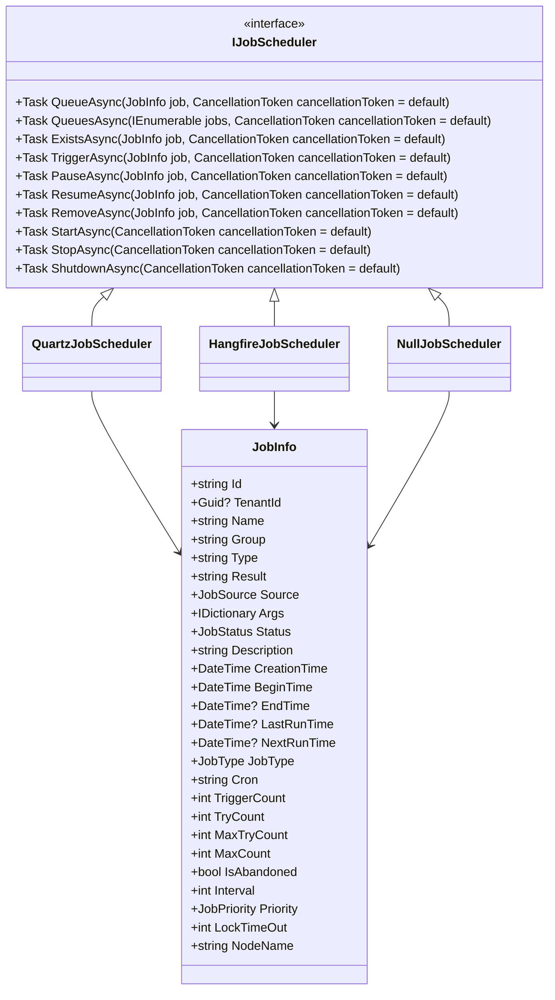
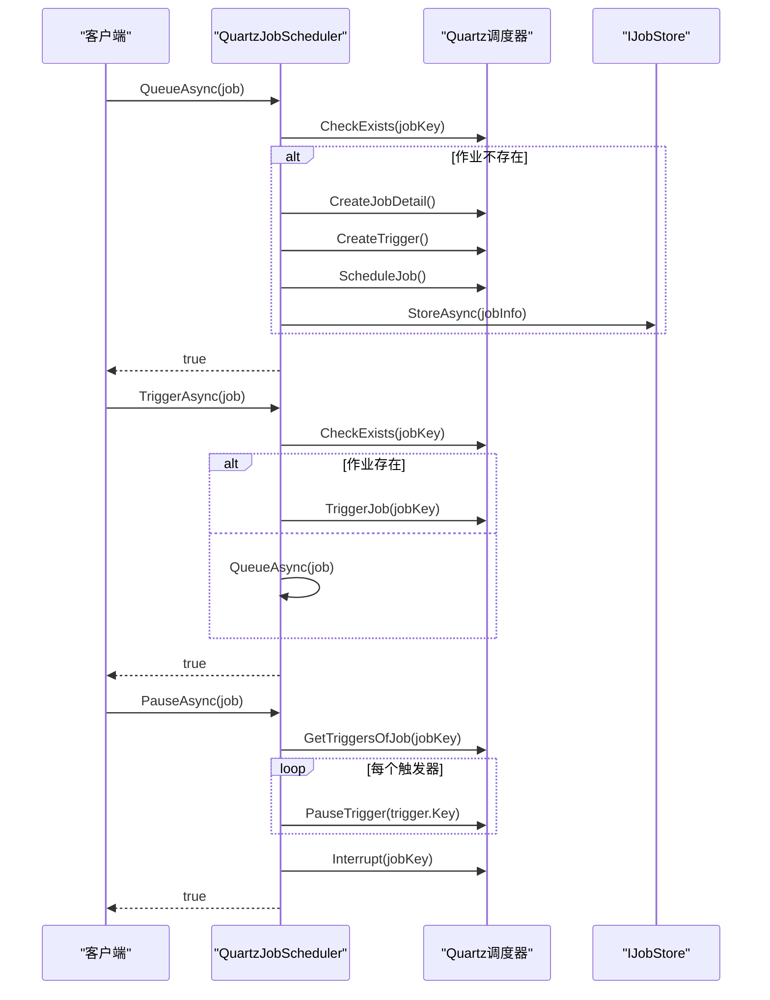
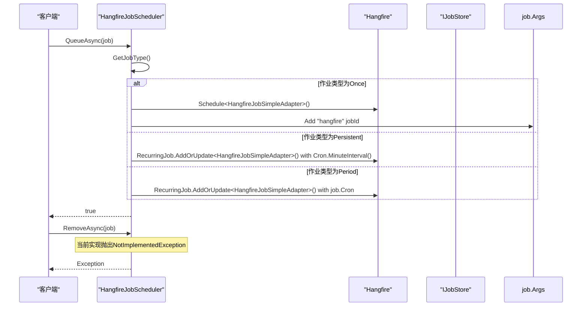
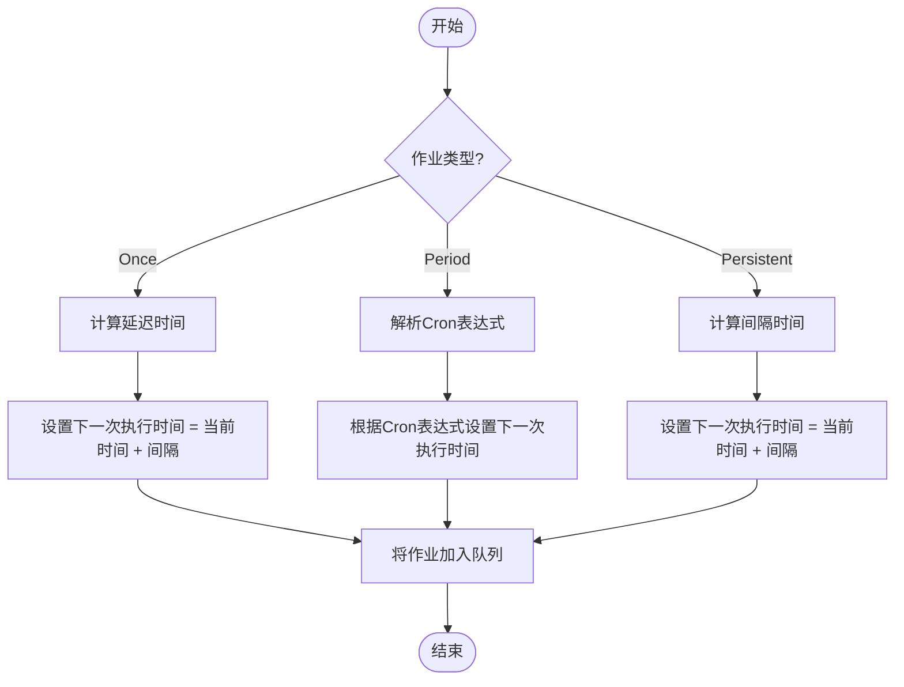

# 作业调度

<cite>
**本文档中引用的文件**  
- [IJobScheduler.cs](file://aspnet-core/modules/task-management/LINGYUN.Abp.BackgroundTasks/LINGYUN/Abp/BackgroundTasks/IJobScheduler.cs)
- [HangfireJobScheduler.cs](file://aspnet-core/modules/task-management/LINGYUN.Abp.BackgroundTasks.Hangfire/LINGYUN/Abp/BackgroundTasks/Hangfire/HangfireJobScheduler.cs)
- [QuartzJobScheduler.cs](file://aspnet-core/modules/task-management/LINGYUN.Abp.BackgroundTasks.Quartz/LINGYUN/Abp/BackgroundTasks/Quartz/QuartzJobScheduler.cs)
- [JobInfo.cs](file://aspnet-core/modules/task-management/LINGYUN.Abp.BackgroundTasks.Abstractions/LINGYUN/Abp/BackgroundTasks/JobInfo.cs)
- [JobType.cs](file://aspnet-core/modules/task-management/LINGYUN.Abp.BackgroundTasks.Abstractions/LINGYUN/Abp/BackgroundTasks/JobType.cs)
- [IJobStore.cs](file://aspnet-core/modules/task-management/LINGYUN.Abp.BackgroundTasks/LINGYUN/Abp/BackgroundTasks/IJobStore.cs)
</cite>

## 目录
1. [引言](#引言)
2. [核心组件](#核心组件)
3. [IJobScheduler接口设计原理](#ijobscheduler接口设计原理)
4. [Quartz.NET调度器实现](#quartznet调度器实现)
5. [Hangfire调度器实现](#hangfire调度器实现)
6. [调度策略与执行时间计算](#调度策略与执行时间计算)
7. [Cron表达式与执行间隔配置](#cron表达式与执行间隔配置)
8. [作业注册与管理](#作业注册与管理)
9. [持久化机制与故障恢复](#持久化机制与故障恢复)
10. [对比分析与适用场景](#对比分析与适用场景)

## 引言
本文档深入探讨了作业调度系统的设计与实现，重点分析了IJobScheduler接口的设计原理和两种主要调度器实现：基于Quartz.NET和Hangfire的调度器。文档详细说明了作业触发条件、执行时间计算、调度策略、Cron表达式配置、执行间隔设置、重试策略以及作业的注册与管理。同时，文档还解释了作业调度的持久化机制和故障恢复策略，为开发者提供了全面的技术参考。

## 核心组件
作业调度系统的核心组件包括IJobScheduler接口、JobInfo类、IJobStore接口以及具体的调度器实现。这些组件共同构成了一个灵活、可扩展的作业调度框架，支持一次性、周期性和持续性任务的调度与管理。

**本文档中引用的文件**  
- [IJobScheduler.cs](file://aspnet-core/modules/task-management/LINGYUN.Abp.BackgroundTasks/LINGYUN/Abp/BackgroundTasks/IJobScheduler.cs)
- [JobInfo.cs](file://aspnet-core/modules/task-management/LINGYUN.Abp.BackgroundTasks.Abstractions/LINGYUN/Abp/BackgroundTasks/JobInfo.cs)
- [IJobStore.cs](file://aspnet-core/modules/task-management/LINGYUN.Abp.BackgroundTasks/LINGYUN/Abp/BackgroundTasks/IJobStore.cs)

## IJobScheduler接口设计原理
IJobScheduler接口是作业调度系统的核心，定义了作业调度的基本操作。接口设计遵循了单一职责原则，提供了任务入队、触发、暂停、恢复、移除等基本操作，同时支持批量操作和异步执行。



**图表来源**  
- [IJobScheduler.cs](file://aspnet-core/modules/task-management/LINGYUN.Abp.BackgroundTasks/LINGYUN/Abp/BackgroundTasks/IJobScheduler.cs)
- [JobInfo.cs](file://aspnet-core/modules/task-management/LINGYUN.Abp.BackgroundTasks.Abstractions/LINGYUN/Abp/BackgroundTasks/JobInfo.cs)

**本节来源**  
- [IJobScheduler.cs](file://aspnet-core/modules/task-management/LINGYUN.Abp.BackgroundTasks/LINGYUN/Abp/BackgroundTasks/IJobScheduler.cs)

## Quartz.NET调度器实现
Quartz.NET调度器实现通过Quartz框架提供了强大的作业调度功能。它支持Cron表达式、复杂的触发器配置以及集群环境下的作业调度。QuartzJobScheduler类实现了IJobScheduler接口，利用Quartz的调度器进行作业的创建、触发、暂停和恢复。



**图表来源**  
- [QuartzJobScheduler.cs](file://aspnet-core/modules/task-management/LINGYUN.Abp.BackgroundTasks.Quartz/LINGYUN/Abp/BackgroundTasks/Quartz/QuartzJobScheduler.cs)
- [IJobStore.cs](file://aspnet-core/modules/task-management/LINGYUN.Abp.BackgroundTasks/LINGYUN/Abp/BackgroundTasks/IJobStore.cs)

**本节来源**  
- [QuartzJobScheduler.cs](file://aspnet-core/modules/task-management/LINGYUN.Abp.BackgroundTasks.Quartz/LINGYUN/Abp/BackgroundTasks/Quartz/QuartzJobScheduler.cs)

## Hangfire调度器实现
Hangfire调度器实现利用Hangfire框架提供了简单而强大的作业调度功能。HangfireJobScheduler类实现了IJobScheduler接口，通过Hangfire的BackgroundJob和RecurringJob API进行作业的调度。Hangfire的特点是配置简单，支持持久化存储，并提供了丰富的管理界面。



**图表来源**  
- [HangfireJobScheduler.cs](file://aspnet-core/modules/task-management/LINGYUN.Abp.BackgroundTasks.Hangfire/LINGYUN/Abp/BackgroundTasks/Hangfire/HangfireJobScheduler.cs)
- [IJobStore.cs](file://aspnet-core/modules/task-management/LINGYUN.Abp.BackgroundTasks/LINGYUN/Abp/BackgroundTasks/IJobStore.cs)

**本节来源**  
- [HangfireJobScheduler.cs](file://aspnet-core/modules/task-management/LINGYUN.Abp.BackgroundTasks.Hangfire/LINGYUN/Abp/BackgroundTasks/Hangfire/HangfireJobScheduler.cs)

## 调度策略与执行时间计算
作业调度系统支持多种调度策略，包括立即执行、延迟执行和周期性执行。执行时间的计算基于作业的类型和配置参数。对于周期性作业，系统使用Cron表达式来确定下一次执行时间；对于延迟执行的作业，系统根据指定的间隔时间计算执行时间。



**图表来源**  
- [JobInfo.cs](file://aspnet-core/modules/task-management/LINGYUN.Abp.BackgroundTasks.Abstractions/LINGYUN/Abp/BackgroundTasks/JobInfo.cs)
- [QuartzJobScheduler.cs](file://aspnet-core/modules/task-management/LINGYUN.Abp.BackgroundTasks.Quartz/LINGYUN/Abp/BackgroundTasks/Quartz/QuartzJobScheduler.cs)
- [HangfireJobScheduler.cs](file://aspnet-core/modules/task-management/LINGYUN.Abp.BackgroundTasks.Hangfire/LINGYUN/Abp/BackgroundTasks/Hangfire/HangfireJobScheduler.cs)

**本节来源**  
- [JobInfo.cs](file://aspnet-core/modules/task-management/LINGYUN.Abp.BackgroundTasks.Abstractions/LINGYUN/Abp/BackgroundTasks/JobInfo.cs)

## Cron表达式与执行间隔配置
作业调度系统支持通过Cron表达式和执行间隔两种方式配置作业的执行时间。Cron表达式用于周期性作业，提供了灵活的时间调度能力；执行间隔用于一次性或持续性作业，指定了作业的延迟时间或重复间隔。

| 配置项 | 说明 | 示例 |
|--------|------|------|
| **Cron表达式** | 用于周期性作业的时间调度 | `0 0 12 * * ?` (每天中午12点执行) |
| **执行间隔** | 用于一次性或持续性作业的延迟时间 | `300` (5分钟后执行) |
| **重试策略** | 失败后重试的次数和间隔 | MaxTryCount=5, Interval=60 |
| **优先级** | 作业的执行优先级 | Normal, High, Low |
| **独占超时** | 任务独占执行的超时时长 | LockTimeOut=300 |

**本节来源**  
- [JobInfo.cs](file://aspnet-core/modules/task-management/LINGYUN.Abp.BackgroundTasks.Abstractions/LINGYUN/Abp/BackgroundTasks/JobInfo.cs)

## 作业注册与管理
作业的注册与管理通过IJobScheduler接口提供的方法实现。系统支持立即执行、延迟执行和周期性执行等多种模式。作业的注册过程包括创建JobInfo对象、配置作业参数、调用QueueAsync方法将作业加入调度队列。

```mermaid
sequenceDiagram
    participant User as "用户"
    participant Manager as "作业管理器"
    participant Scheduler