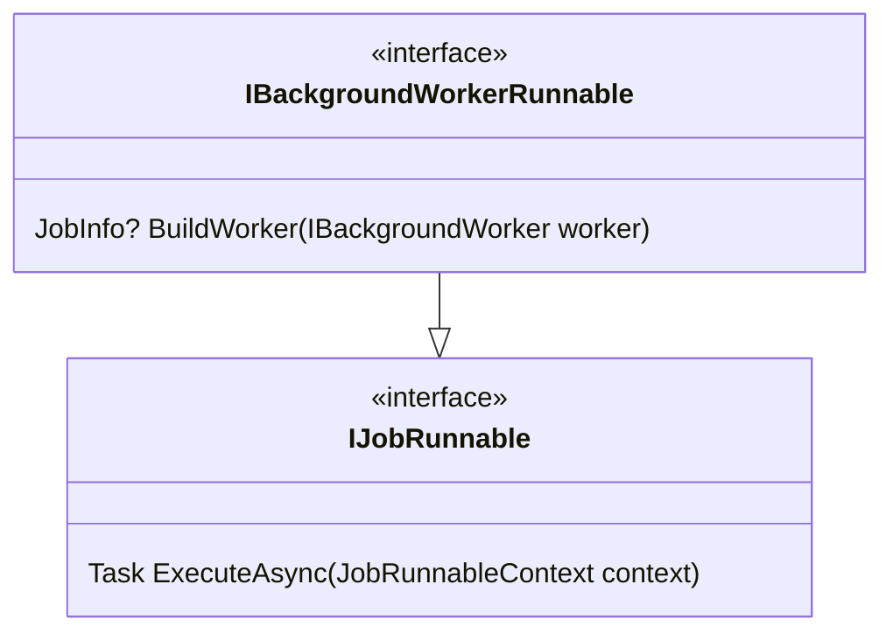
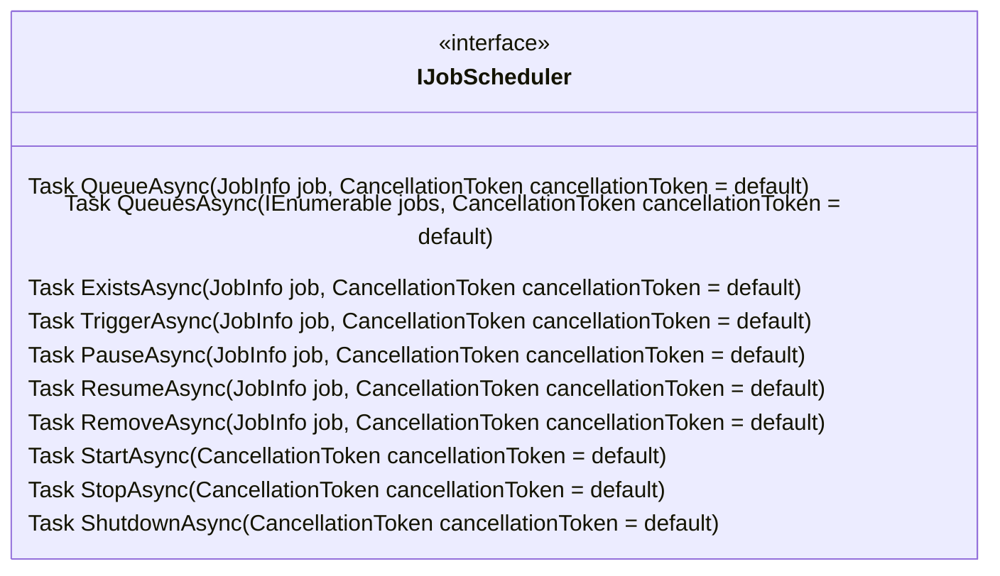
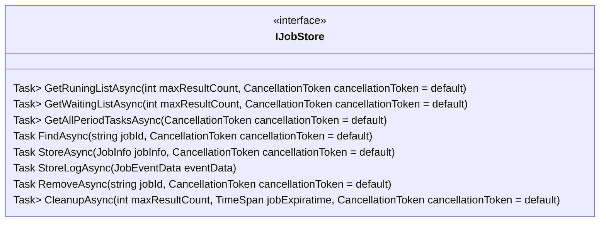
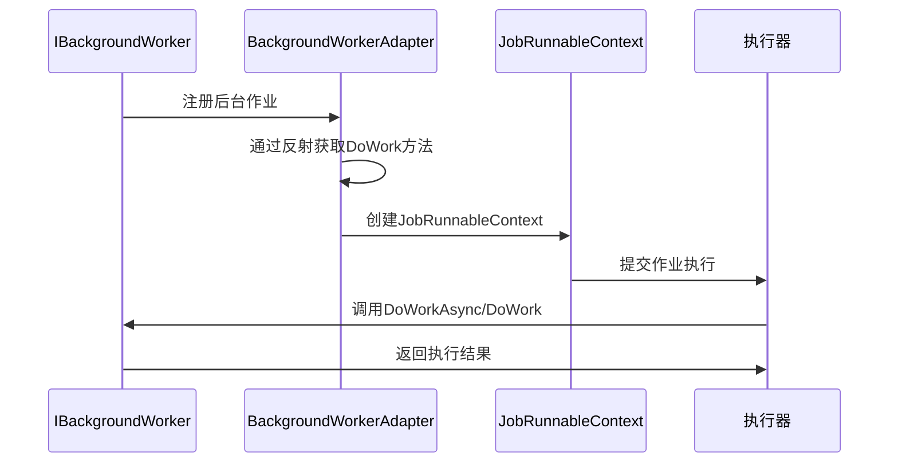
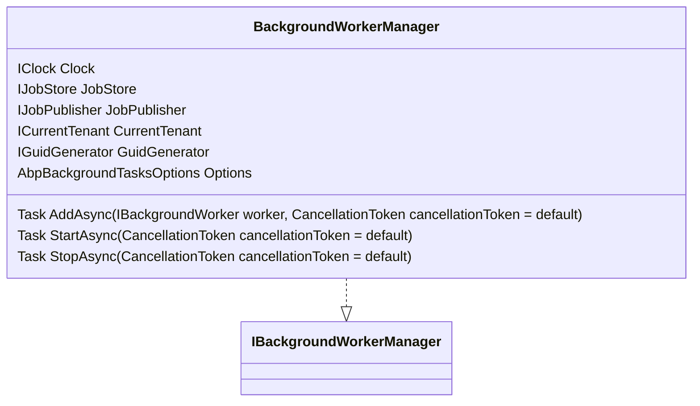
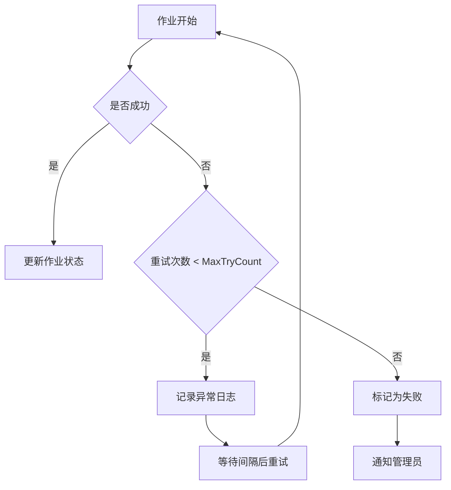

# 后台作业管理

<cite>
**本文档中引用的文件**  
- [BackgroundWorkerManager.cs](file://aspnet-core/modules/task-management/LINGYUN.Abp.BackgroundTasks/LINGYUN/Abp/BackgroundTasks/BackgroundWorkerManager.cs)
- [IBackgroundWorkerRunnable.cs](file://aspnet-core/modules/task-management/LINGYUN.Abp.BackgroundTasks/LINGYUN/Abp/BackgroundTasks/IBackgroundWorkerRunnable.cs)
- [IJobScheduler.cs](file://aspnet-core/modules/task-management/LINGYUN.Abp.BackgroundTasks/LINGYUN/Abp/BackgroundTasks/IJobScheduler.cs)
- [IJobStore.cs](file://aspnet-core/modules/task-management/LINGYUN.Abp.BackgroundTasks/LINGYUN/Abp/BackgroundTasks/IJobStore.cs)
- [BackgroundWorkerAdapter.cs](file://aspnet-core/modules/task-management/LINGYUN.Abp.BackgroundTasks/LINGYUN/Abp/BackgroundTasks/BackgroundWorkerAdapter.cs)
</cite>

## 目录
1. [引言](#引言)
2. [核心接口设计](#核心接口设计)
3. [后台作业执行流程](#后台作业执行流程)
4. [周期性任务管理](#周期性任务管理)
5. [自定义后台作业实现](#自定义后台作业实现)
6. [作业状态监控与异常处理](#作业状态监控与异常处理)

## 引言
本系统提供了一套完整的后台作业管理机制，通过IBackgroundWorkerRunnable、IJobScheduler和IJobStore等核心接口实现作业的调度、执行和存储。该机制支持周期性任务的注册与管理，能够有效处理后台作业的分发、执行器选择和运行时上下文管理。

## 核心接口设计

### IBackgroundWorkerRunnable接口
该接口继承自IJobRunnable，定义了将IBackgroundWorker转换为JobInfo的能力。其核心方法BuildWorker用于构建作业信息。



**图源**
- [IBackgroundWorkerRunnable.cs](file://aspnet-core/modules/task-management/LINGYUN.Abp.BackgroundTasks/LINGYUN/Abp/BackgroundTasks/IBackgroundWorkerRunnable.cs#L0-L11)

**节源**
- [IBackgroundWorkerRunnable.cs](file://aspnet-core/modules/task-management/LINGYUN.Abp.BackgroundTasks/LINGYUN/Abp/BackgroundTasks/IBackgroundWorkerRunnable.cs#L0-L11)

### IJobScheduler接口
作为作业调度器的核心接口，提供了任务入队、触发、暂停、恢复和移除等操作。



**图源**
- [IJobScheduler.cs](file://aspnet-core/modules/task-management/LINGYUN.Abp.BackgroundTasks/LINGYUN/Abp/BackgroundTasks/IJobScheduler.cs#L0-L73)

**节源**
- [IJobScheduler.cs](file://aspnet-core/modules/task-management/LINGYUN.Abp.BackgroundTasks/LINGYUN/Abp/BackgroundTasks/IJobScheduler.cs#L0-L73)

### IJobStore接口
负责作业信息的持久化存储和查询，提供运行中、等待中作业列表的获取以及作业的增删改查功能。



**图源**
- [IJobStore.cs](file://aspnet-core/modules/task-management/LINGYUN.Abp.BackgroundTasks/LINGYUN/Abp/BackgroundTasks/IJobStore.cs#L0-L39)

**节源**
- [IJobStore.cs](file://aspnet-core/modules/task-management/LINGYUN.Abp.BackgroundTasks/LINGYUN/Abp/BackgroundTasks/IJobStore.cs#L0-L39)

## 后台作业执行流程

### 作业分发与执行器选择
系统通过BackgroundWorkerAdapter实现IBackgroundWorker到JobInfo的转换。适配器利用反射获取目标Worker的DoWorkAsync或DoWork方法，并在ExecuteAsync时调用相应方法。



**图源**
- [BackgroundWorkerAdapter.cs](file://aspnet-core/modules/task-management/LINGYUN.Abp.BackgroundTasks/LINGYUN/Abp/BackgroundTasks/BackgroundWorkerAdapter.cs#L0-L110)
- [BackgroundWorkerManager.cs](file://aspnet-core/modules/task-management/LINGYUN.Abp.BackgroundTasks/LINGYUN/Abp/BackgroundTasks/BackgroundWorkerManager.cs#L0-L103)

**节源**
- [BackgroundWorkerAdapter.cs](file://aspnet-core/modules/task-management/LINGYUN.Abp.BackgroundTasks/LINGYUN/Abp/BackgroundTasks/BackgroundWorkerAdapter.cs#L0-L110)
- [BackgroundWorkerManager.cs](file://aspnet-core/modules/task-management/LINGYUN.Abp.BackgroundTasks/LINGYUN/Abp/BackgroundTasks/BackgroundWorkerManager.cs#L0-L103)

### 运行时上下文管理
系统通过JobRunnableContext提供作业执行所需的上下文信息，包括服务提供器和取消令牌，确保作业能够在正确的依赖注入环境中执行。

## 周期性任务管理

### BackgroundWorkerManager实现
BackgroundWorkerManager是周期性任务注册与管理的核心组件，实现了IBackgroundWorkerManager接口。



**图源**
- [BackgroundWorkerManager.cs](file://aspnet-core/modules/task-management/LINGYUN.Abp.BackgroundTasks/LINGYUN/Abp/BackgroundTasks/BackgroundWorkerManager.cs#L0-L103)

**节源**
- [BackgroundWorkerManager.cs](file://aspnet-core/modules/task-management/LINGYUN.Abp.BackgroundTasks/LINGYUN/Abp/BackgroundTasks/BackgroundWorkerManager.cs#L0-L103)

### 任务注册流程
1. 创建BackgroundWorkerAdapter实例
2. 调用BuildWorker方法构建JobInfo
3. 设置作业ID、名称、节点名等元数据
4. 根据JobDispatcherSelectors配置作业参数
5. 通过JobStore存储作业信息
6. 通过JobPublisher发布作业

## 自定义后台作业实现

### 实现步骤
1. 继承PeriodicBackgroundWorkerBase或AsyncPeriodicBackgroundWorkerBase
2. 实现DoWork或DoWorkAsync方法
3. 配置作业执行间隔
4. 注册到BackgroundWorkerManager

### 代码示例
```csharp
public class CustomBackgroundWorker : AsyncPeriodicBackgroundWorkerBase
{
    public CustomBackgroundWorker(AbpAsyncTimer timer, IServiceScopeFactory serviceScopeFactory) 
        : base(timer, serviceScopeFactory)
    {
    }

    protected async override Task DoWorkAsync(PeriodicBackgroundWorkerContext workerContext)
    {
        // 自定义作业逻辑
        await Task.Delay(1000);
    }
}
```

**节源**
- [BackgroundWorkerAdapter.cs](file://aspnet-core/modules/task-management/LINGYUN.Abp.BackgroundTasks/LINGYUN/Abp/BackgroundTasks/BackgroundWorkerAdapter.cs#L0-L110)

## 作业状态监控与异常处理

### 状态监控
通过IJobStore提供的接口可以获取运行中和等待中的作业列表，实现作业状态的实时监控。

### 执行间隔配置
作业的执行间隔可以通过以下方式配置：
- 默认间隔：从PeriodicBackgroundWorkerBase的Timer获取
- 覆盖配置：通过AbpBackgroundTasksOptions的JobDispatcherSelectors进行覆盖

### 异常处理策略
系统内置了完善的异常处理机制：
- 最大重试次数：通过MaxTryCount属性控制
- 锁超时：通过LockTimeOut属性设置
- 优先级控制：通过Priority属性管理作业执行顺序



**图源**
- [IJobStore.cs](file://aspnet-core/modules/task-management/LINGYUN.Abp.BackgroundTasks/LINGYUN/Abp/BackgroundTasks/IJobStore.cs#L0-L39)
- [BackgroundWorkerManager.cs](file://aspnet-core/modules/task-management/LINGYUN.Abp.BackgroundTasks/LINGYUN/Abp/BackgroundTasks/BackgroundWorkerManager.cs#L0-L103)

**节源**
- [IJobStore.cs](file://aspnet-core/modules/task-management/LINGYUN.Abp.BackgroundTasks/LINGYUN/Abp/BackgroundTasks/IJobStore.cs#L0-L39)
- [BackgroundWorkerManager.cs](file://aspnet-core/modules/task-management/LINGYUN.Abp.BackgroundTasks/LINGYUN/Abp/BackgroundTasks/BackgroundWorkerManager.cs#L0-L103)