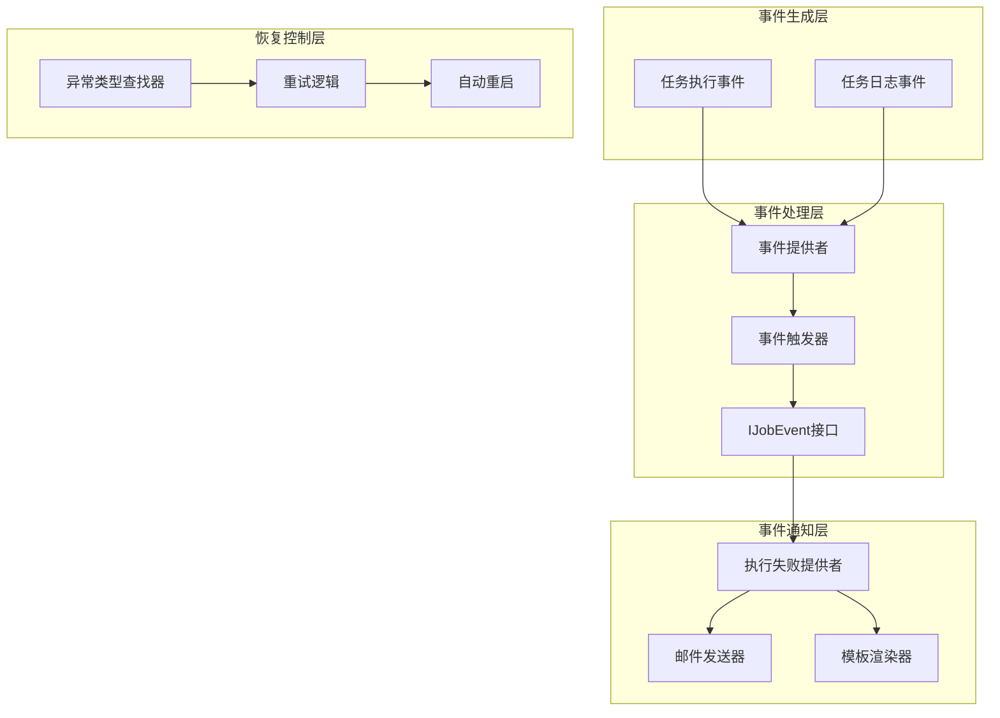
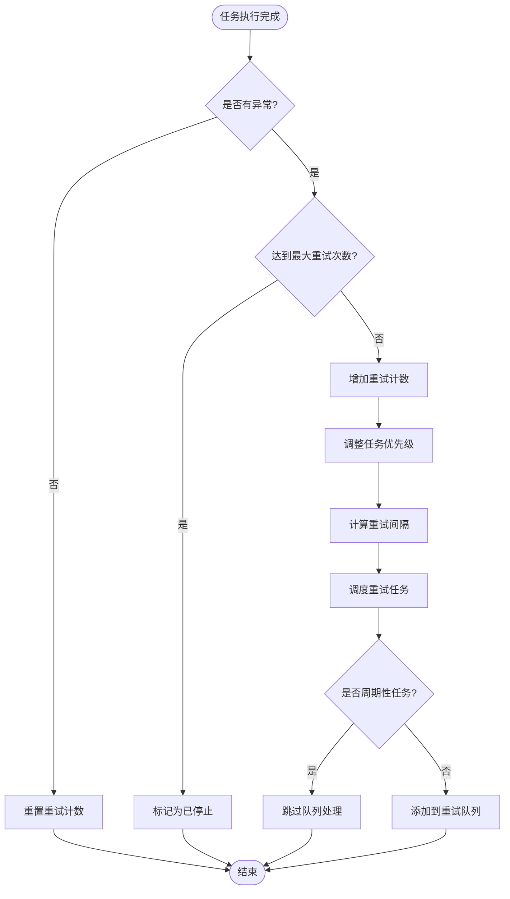
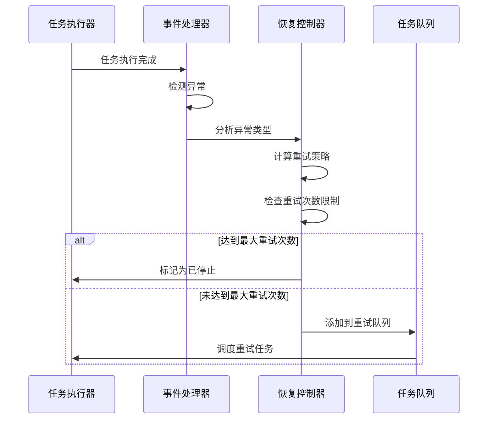
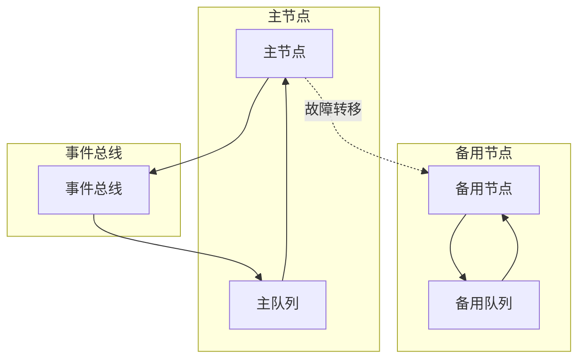

# 事件通知与恢复

<cite>
**本文档引用的文件**
- [IJobEventProvider.cs](file://aspnet-core/modules/task-management/LINGYUN.Abp.BackgroundTasks/IJobEventProvider.cs)
- [IJobEventTrigger.cs](file://aspnet-core/modules/task-management/LINGYUN.Abp.BackgroundTasks/IJobEventTrigger.cs)
- [IJobEvent.cs](file://aspnet-core/modules/task-management/LINGYUN.Abp.BackgroundTasks.Abstractions/IJobEvent.cs)
- [JobEventData.cs](file://aspnet-core/modules/task-management/LINGYUN.Abp.BackgroundTasks.Abstractions/JobEventData.cs)
- [JobEventContext.cs](file://aspnet-core/modules/task-management/LINGYUN.Abp.BackgroundTasks.Abstractions/JobEventContext.cs)
- [JobEventTrigger.cs](file://aspnet-core/modules/task-management/LINGYUN.Abp.BackgroundTasks/JobEventTrigger.cs)
- [JobExecutedEvent.cs](file://aspnet-core/modules/task-management/LINGYUN.Abp.BackgroundTasks/Internal/JobExecutedEvent.cs)
- [JobExecutedFailedProvider.cs](file://aspnet-core/modules/task-management/LINGYUN.Abp.BackgroundTasks.ExceptionHandling/JobExecutedFailedProvider.cs)
- [JobExceptionType.cs](file://aspnet-core/modules/task-management/LINGYUN.Abp.BackgroundTasks.Abstractions/JobExceptionType.cs)
- [IJobExceptionTypeFinder.cs](file://aspnet-core/modules/task-management/LINGYUN.Abp.BackgroundTasks.Abstractions/IJobExceptionTypeFinder.cs)
- [JobStatus.cs](file://aspnet-core/modules/task-management/LINGYUN.Abp.BackgroundTasks.Abstractions/JobStatus.cs)
- [JobPriority.cs](file://aspnet-core/modules/task-management/LINGYUN.Abp.BackgroundTasks.Abstractions/JobPriority.cs)
- [AbpBackgroundTasksModule.cs](file://aspnet-core/modules/task-management/LINGYUN.Abp.BackgroundTasks/AbpBackgroundTasksModule.cs)
</cite>

## 目录
1. [简介](#简介)
2. [事件通知架构概述](#事件通知架构概述)
3. [核心组件分析](#核心组件分析)
4. [事件数据结构](#事件数据结构)
5. [事件通知机制](#事件通知机制)
6. [异常处理与恢复策略](#异常处理与恢复策略)
7. [自定义事件处理器](#自定义事件处理器)
8. [自动恢复逻辑](#自动恢复逻辑)
9. [可靠性保证与故障转移](#可靠性保证与故障转移)
10. [配置与最佳实践](#配置与最佳实践)
11. [总结](#总结)

## 简介

事件通知与恢复系统是ABP框架中任务管理系统的核心组成部分，负责在任务执行过程中捕获异常、生成事件通知，并提供自动恢复机制。该系统通过事件驱动的方式实现了任务失败时的智能响应，包括发送告警通知、更新监控指标、触发人工干预流程以及自动重试等能力。

系统采用插件化设计，支持多种事件处理器，能够灵活地集成邮件通知、短信告警、企业微信推送等多种通知方式。同时提供了完善的异常分类机制，可以根据不同类型的异常采取不同的处理策略。

## 事件通知架构概述

事件通知与恢复系统基于观察者模式构建，主要包含以下核心组件：



**图表来源**
- [JobEventProvider.cs](file://aspnet-core/modules/task-management/LINGYUN.Abp.BackgroundTasks/Internal/JobEventProvider.cs#L1-L40)
- [JobEventTrigger.cs](file://aspnet-core/modules/task-management/LINGYUN.Abp.BackgroundTasks/JobEventTrigger.cs#L1-L52)
- [JobExecutedFailedProvider.cs](file://aspnet-core/modules/task-management/LINGYUN.Abp.BackgroundTasks.ExceptionHandling/JobExecutedFailedProvider.cs#L1-L146)

## 核心组件分析

### IJobEventProvider - 事件提供者接口

`IJobEventProvider` 是事件系统的核心接口，负责管理所有任务事件的注册和提供：

```csharp
public interface IJobEventProvider
{
    /// <summary>
    /// 返回所有任务事件注册接口
    /// </summary>
    /// <returns></returns>
    IReadOnlyCollection<IJobEvent> GetAll();
}
```

事件提供者采用延迟加载策略，在首次访问时动态创建事件实例，确保系统的高效运行。

### IJobEventTrigger - 事件触发器接口

`IJobEventTrigger` 负责协调事件的触发过程，支持异步并发处理多个事件：

```csharp
public interface IJobEventTrigger
{
    Task OnJobBeforeExecuted(JobEventContext context);
    Task OnJobAfterExecuted(JobEventContext context);
}
```

触发器采用并行处理机制，当有多个事件监听器时，会同时触发所有事件以提高响应速度。

### IJobEvent - 事件监听接口

`IJobEvent` 定义了任务生命周期中的两个关键事件点：

```csharp
public interface IJobEvent
{
    Task OnJobBeforeExecuted(JobEventContext context);
    Task OnJobAfterExecuted(JobEventContext context);
}
```

这两个事件分别在任务执行前后触发，允许开发者在任务生命周期的关键时刻插入自定义逻辑。

**章节来源**
- [IJobEventProvider.cs](file://aspnet-core/modules/task-management/LINGYUN.Abp.BackgroundTasks/IJobEventProvider.cs#L1-L14)
- [IJobEventTrigger.cs](file://aspnet-core/modules/task-management/LINGYUN.Abp.BackgroundTasks/IJobEventTrigger.cs#L1-L9)
- [IJobEvent.cs](file://aspnet-core/modules/task-management/LINGYUN.Abp.BackgroundTasks.Abstractions/IJobEvent.cs#L1-L21)

## 事件数据结构

### JobEventData - 任务事件数据

`JobEventData` 是事件系统的核心数据结构，包含了任务执行过程中的所有关键信息：

```csharp
public class JobEventData
{
    /// <summary>
    /// 任务类别
    /// </summary>
    public Type Type { get; }
    
    /// <summary>
    /// 任务参数
    /// </summary>
    public IReadOnlyDictionary<string, object> Args { get; }
    
    /// <summary>
    /// 任务组别
    /// </summary>
    public string Group { get; }
    
    /// <summary>
    /// 任务名称
    /// </summary>
    public string Name { get; }
    
    /// <summary>
    /// 任务标识
    /// </summary>
    public string Key { get; }
    
    /// <summary>
    /// 任务状态
    /// </summary>
    public JobStatus Status { get; set; }
    
    /// <summary>
    /// 执行者租户
    /// </summary>
    public Guid? TenantId { get; set; }
    
    /// <summary>
    /// 错误明细
    /// </summary>
    public Exception Exception { get; }
    
    /// <summary>
    /// 任务描述
    /// </summary>
    public string Description { get; set; }
    
    /// <summary>
    /// 返回参数
    /// </summary>
    public string Result { get; set; }
    
    /// <summary>
    /// 触发次数
    /// </summary>
    public int Triggered { get; set; }
    
    /// <summary>
    /// 最大可执行次数
    /// </summary>
    public int RepeatCount { get; set; }
    
    /// <summary>
    /// 运行时间
    /// </summary>
    public DateTime RunTime { get; set; }
    
    /// <summary>
    /// 执行时间(ms)
    /// </summary>
    public int? ExecutionDuration { get; set; }
    
    /// <summary>
    /// 上次运行时间
    /// </summary>
    public DateTime? LastRunTime { get; set; }
    
    /// <summary>
    /// 下次运行时间
    /// </summary>
    public DateTime? NextRunTime { get; set; }
    
    /// <summary>
    /// 作业取消令牌
    /// </summary>
    public CancellationToken CancellationToken { get; }
}
```

### JobEventContext - 事件上下文

`JobEventContext` 提供了事件处理所需的上下文信息：

```csharp
public class JobEventContext
{
    public IServiceProvider ServiceProvider { get; }
    public JobEventData EventData { get; }

    public JobEventContext(
        IServiceProvider serviceProvider,
        JobEventData jobEventData)
    {
        ServiceProvider = serviceProvider;
        EventData = jobEventData;
    }
}
```

**章节来源**
- [JobEventData.cs](file://aspnet-core/modules/task-management/LINGYUN.Abp.BackgroundTasks.Abstractions/JobEventData.cs#L1-L95)
- [JobEventContext.cs](file://aspnet-core/modules/task-management/LINGYUN.Abp.BackgroundTasks.Abstractions/JobEventContext.cs#L1-L18)

## 事件通知机制

### 异常类型分类系统

系统提供了完善的异常分类机制，通过 `JobExceptionType` 枚举定义了四种基本异常类型：

```csharp
[Flags]
public enum JobExceptionType
{
    Business = 0,      // 业务异常
    Application = 2,   // 应用程序异常
    Network = 4,       // 网络异常
    System = 8,        // 系统异常
    All = Business | Application | Network | System,
}
```

### 异常类型查找器

`IJobExceptionTypeFinder` 接口负责根据异常对象确定其所属类型：

```csharp
public interface IJobExceptionTypeFinder
{
    JobExceptionType GetExceptionType(JobEventContext eventContext, Exception exception);
}
```

### 任务执行事件处理

`JobExecutedEvent` 类实现了任务执行完成后的事件处理逻辑，包括异常检测和自动重试：



**图表来源**
- [JobExecutedEvent.cs](file://aspnet-core/modules/task-management/LINGYUN.Abp.BackgroundTasks/Internal/JobExecutedEvent.cs#L62-L101)

**章节来源**
- [JobExceptionType.cs](file://aspnet-core/modules/task-management/LINGYUN.Abp.BackgroundTasks.Abstractions/JobExceptionType.cs#L1-L14)
- [IJobExceptionTypeFinder.cs](file://aspnet-core/modules/task-management/LINGYUN.Abp.BackgroundTasks.Abstractions/IJobExceptionTypeFinder.cs#L1-L8)
- [JobExecutedEvent.cs](file://aspnet-core/modules/task-management/LINGYUN.Abp.BackgroundTasks/Internal/JobExecutedEvent.cs#L62-L101)

## 异常处理与恢复策略

### 任务状态管理

系统定义了完整的任务状态枚举，支持从失败到恢复的完整状态流转：

```csharp
public enum JobStatus
{
    None = -1,          // 未知状态
    Completed = 0,      // 已完成
    Queuing = 5,        // 队列中
    Running = 10,       // 运行中
    FailedRetry = 15,   // 失败重试
    Paused = 20,        // 已暂停
    Stopped = 30        // 已停止
}
```

### 优先级调整机制

系统根据重试次数动态调整任务优先级，确保重要任务得到及时处理：

```csharp
// 多次异常后需要重新计算优先级
if (job.TryCount <= (job.MaxTryCount / 2) &&
    job.TryCount > (job.MaxTryCount / 3))
{
    job.Priority = JobPriority.BelowNormal;
}
else if (job.TryCount > (job.MaxTryCount / 1.5))
{
    job.Priority = JobPriority.Low;
}
```

### 重试间隔计算

系统采用指数退避算法计算重试间隔，避免频繁重试对系统造成压力：

```csharp
var retryInterval = job.Interval * 1.5;
job.Interval = Convert.ToInt32(retryInterval);
```

**章节来源**
- [JobStatus.cs](file://aspnet-core/modules/task-management/LINGYUN.Abp.BackgroundTasks.Abstractions/JobStatus.cs#L1-L33)
- [JobPriority.cs](file://aspnet-core/modules/task-management/LINGYUN.Abp.BackgroundTasks.Abstractions/JobPriority.cs#L1-L15)
- [JobExecutedEvent.cs](file://aspnet-core/modules/task-management/LINGYUN.Abp.BackgroundTasks/Internal/JobExecutedEvent.cs#L62-L101)

## 自定义事件处理器

### 邮件通知处理器

`JobExecutedFailedProvider` 是一个典型的事件处理器实现，负责在任务失败时发送邮件通知：

```csharp
public class JobExecutedFailedProvider : JobExecutedProvider, ITransientDependency
{
    public const string Name = "JobExecutedFailedProvider";
    
    public readonly static IList<JobActionParamter> Paramters = new List<JobActionParamter>
    {
        new JobActionParamter(PropertyTo, L("DisplayName:To"), L("Description:To"), true),
        new JobActionParamter(PropertySubject, L("DisplayName:Subject"), L("Description:PropertySubject")),
        new JobActionParamter(PropertyFrom, L("DisplayName:From"), L("Description:From")),
        new JobActionParamter(PropertyBody, L("DisplayName:Body"), L("Description:Body")),
        new JobActionParamter(PropertyTemplate, L("DisplayName:Template"), L("Description:Template")),
        new JobActionParamter(PropertyContext, L("DisplayName:Context"), L("Description:Context")),
        new JobActionParamter(PropertyCulture, L("DisplayName:Culture"), L("Description:Culture")),
    };
}
```

### 模板渲染与国际化

处理器支持模板渲染和多语言国际化：

```csharp
var model = new
{
    Title = subject,
    Id = context.Event.EventData.Key,
    Group = context.Event.EventData.Args.GetOrDefault(nameof(JobInfo.Group)) ?? context.Event.EventData.Group,
    Name = context.Event.EventData.Args.GetOrDefault(nameof(JobInfo.Name)) ?? context.Event.EventData.Name,
    Type = context.Event.EventData.Args.GetOrDefault(nameof(JobInfo.Type)) ?? context.Event.EventData.Type.Name,
    Triggertime = context.Event.EventData.RunTime.ToString("yyyy-MM-dd HH:mm:ss"),
    Message = errorMessage,
    Tenantname = context.Event.EventData.Args.GetOrDefault(nameof(IMultiTenant.TenantId)),
    Footer = footer,
};

var culture = context.Action.Paramters.GetOrDefault(PropertyCulture)?.ToString() ?? CultureInfo.CurrentCulture.Name;

var content = await TemplateRenderer.RenderAsync(
    templateName: template,
    model: model,
    cultureName: culture,
    globalContext: globalContext);
```

### 事件处理器注册

系统通过模块配置自动注册事件处理器：

```csharp
Configure<AbpBackgroundTasksOptions>(options =>
{
    options.JobMonitors.AddIfNotContains(typeof(JobExecutedEvent));
    options.JobMonitors.AddIfNotContains(typeof(JobLogEvent));
});
```

**章节来源**
- [JobExecutedFailedProvider.cs](file://aspnet-core/modules/task-management/LINGYUN.Abp.BackgroundTasks.ExceptionHandling/JobExecutedFailedProvider.cs#L1-L146)
- [AbpBackgroundTasksModule.cs](file://aspnet-core/modules/task-management/LINGYUN.Abp.BackgroundTasks/AbpBackgroundTasksModule.cs#L40-L50)

## 自动恢复逻辑

### 条件触发的自动重启

系统支持基于条件的自动重启机制，可以在满足特定条件时自动重新启动失败的任务：



**图表来源**
- [JobExecutedEvent.cs](file://aspnet-core/modules/task-management/LINGYUN.Abp.BackgroundTasks/Internal/JobExecutedEvent.cs#L62-L101)

### 重试策略配置

系统提供了灵活的重试策略配置选项：

1. **基础重试间隔**：默认50毫秒
2. **指数退避**：每次重试间隔乘以1.5倍
3. **优先级调整**：根据重试次数动态调整任务优先级
4. **最大重试次数**：可配置的最大重试次数限制

### 周期性任务特殊处理

对于周期性任务，系统采用不同的处理策略：

```csharp
// 周期性作业已经在队列中, 需要忽略
if (job.JobType != JobType.Period)
{
    // 失败的作业需要由当前节点来调度
    await ScheduleJobAsync(context, job, context.EventData.CancellationToken);
}
```

**章节来源**
- [JobExecutedEvent.cs](file://aspnet-core/modules/task-management/LINGYUN.Abp.BackgroundTasks/Internal/JobExecutedEvent.cs#L62-L101)

## 可靠性保证与故障转移

### 事件持久化

系统通过事件总线机制确保事件的可靠传递，即使在服务重启的情况下也能保证事件不丢失。

### 故障转移机制

当主节点发生故障时，系统支持故障转移机制：



### 重试超时控制

系统实现了完善的超时控制机制，防止无限重试导致资源耗尽：

```csharp
// 当未设置最大重试次数时不会标记停止
if (job.MaxTryCount > 0 && job.TryCount >= job.MaxTryCount)
{
    job.Status = JobStatus.Stopped;
    job.IsAbandoned = true;
    job.NextRunTime = null;
    await RemoveJobQueueAsync(context, job, context.EventData.CancellationToken);
}
```

## 配置与最佳实践

### 事件处理器配置

推荐的事件处理器配置方式：

```csharp
// 注册自定义事件处理器
services.AddScoped<IJobEvent, CustomJobEventHandler>();

// 配置事件触发器
services.Configure<AbpBackgroundTasksOptions>(options =>
{
    options.JobMonitors.Add(typeof(CustomJobEventHandler));
});
```

### 异常类型过滤

通过异常类型过滤器可以精确控制哪些异常需要触发通知：

```csharp
// 在事件处理器中检查异常类型
var exceptionTypeFinder = context.ServiceProvider.GetRequiredService<IJobExceptionTypeFinder>();
var findExceptionType = exceptionTypeFinder.GetExceptionType(context, context.EventData.Exception);
if (!exceptionType.Value.HasFlag(findExceptionType))
{
    Logger.LogInformation($"It is not defined in the Acceptable Exception Range, no failed action will be triggered.");
    return;
}
```

### 性能优化建议

1. **异步处理**：所有事件处理器都应使用异步方法，避免阻塞主线程
2. **批量处理**：对于大量事件，考虑使用批量处理机制
3. **资源池化**：对于邮件发送等外部服务调用，使用连接池
4. **监控告警**：建立完善的监控体系，及时发现异常情况

### 安全考虑

1. **敏感信息过滤**：在事件数据中过滤敏感信息
2. **权限验证**：确保事件处理器具有适当的权限
3. **输入验证**：对所有输入参数进行严格验证
4. **审计日志**：记录所有事件处理操作

## 总结

事件通知与恢复系统是ABP框架任务管理的重要组成部分，通过精心设计的架构实现了任务失败时的智能响应。系统的主要特点包括：

1. **模块化设计**：采用插件化架构，支持灵活扩展
2. **事件驱动**：基于观察者模式，实现松耦合的事件处理
3. **智能恢复**：提供完善的自动重试和恢复机制
4. **多样化通知**：支持邮件、短信、企业微信等多种通知方式
5. **高可靠性**：通过事件持久化和故障转移确保系统稳定性

通过合理配置和使用这些功能，可以构建一个健壮、可靠的后台任务处理系统，有效应对各种异常情况，确保业务流程的连续性和稳定性。