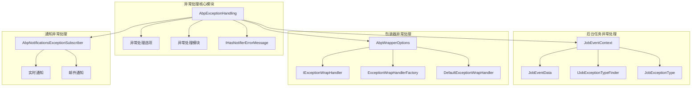
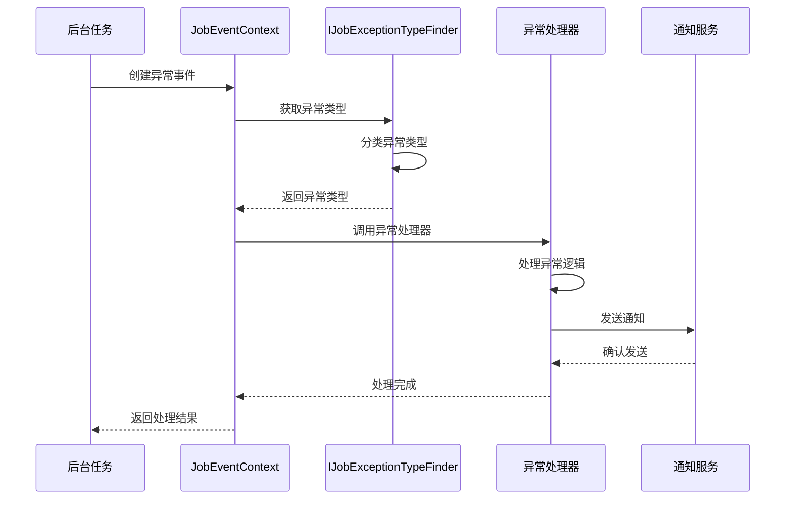
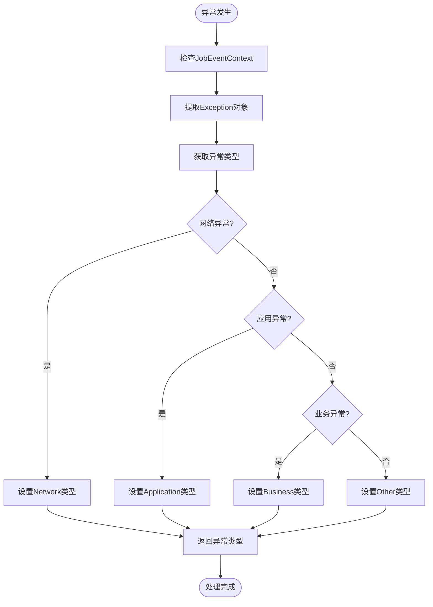
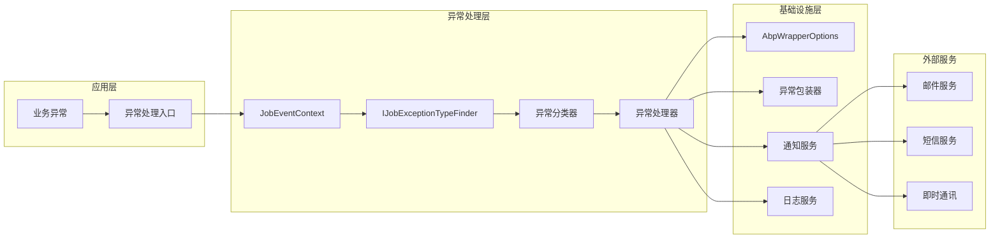

# 异常处理机制

<cite>
**本文档引用的文件**
- [JobEventContext.cs](file://aspnet-core/modules/task-management/LINGYUN.Abp.BackgroundTasks.Abstractions/LINGYUN/Abp/BackgroundTasks/JobEventContext.cs)
- [JobEventData.cs](file://aspnet-core/modules/task-management/LINGYUN.Abp.BackgroundTasks.Abstractions/LINGYUN/Abp/BackgroundTasks/JobEventData.cs)
- [AbpExceptionHandlingOptions.cs](file://aspnet-core/framework/common/LINGYUN.Abp.ExceptionHandling/LINGYUN/Abp/ExceptionHandling/AbpExceptionHandlingOptions.cs)
- [AbpExceptionHandlingModule.cs](file://aspnet-core/framework/common/LINGYUN.Abp.ExceptionHandling/LINGYUN/Abp/ExceptionHandling/AbpExceptionHandlingModule.cs)
- [AbpNotificationsExceptionSubscriber.cs](file://aspnet-core/modules/realtime-notifications/LINGYUN.Abp.ExceptionHandling.Notifications/LINGYUN/Abp/ExceptionHandling/Notifications/AbpNotificationsExceptionSubscriber.cs)
- [DefaultExceptionWrapHandler.cs](file://aspnet-core/framework/common/LINGYUN.Abp.Wrapper/LINGYUN/Abp/Wrapper/DefaultExceptionWrapHandler.cs)
- [ExceptionWrapHandlerFactory.cs](file://aspnet-core/framework/common/LINGYUN.Abp.Wrapper/LINGYUN/Abp/Wrapper/ExceptionWrapHandlerFactory.cs)
- [AbpWrapperOptions.cs](file://aspnet-core/framework/common/LINGYUN.Abp.Wrapper/LINGYUN/Abp/Wrapper/AbpWrapperOptions.cs)
- [IJobExceptionTypeFinder.cs](file://aspnet-core/modules/task-management/LINGYUN.Abp.BackgroundTasks.Abstractions/LINGYUN/Abp/BackgroundTasks/IJobExceptionTypeFinder.cs)
- [JobExceptionTypeFinder_Tests.cs](file://aspnet-core/tests/LINGYUN.Abp.BackgroundTasks.Activities.Tests/LINGYUN/Abp/BackgroundTasks/Activities/JobExceptionTypeFinder_Tests.cs)
</cite>

## 目录
1. [简介](#简介)
2. [项目结构](#项目结构)
3. [核心组件](#核心组件)
4. [架构概览](#架构概览)
5. [详细组件分析](#详细组件分析)
6. [依赖关系分析](#依赖关系分析)
7. [性能考虑](#性能考虑)
8. [故障排除指南](#故障排除指南)
9. [结论](#结论)

## 简介

异常处理机制是现代应用程序架构中的关键组成部分，特别是在后台任务执行过程中。本文档深入分析了ABP框架中异常处理系统的实现，重点关注后台任务执行过程中的异常捕获、分类和处理流程。

该系统通过IJobExceptionProvider接口收集异常信息，并实现了异常处理器链的执行顺序管理。异常上下文（JobExceptionContext）提供了完整的数据结构和用途说明，包括任务信息、异常堆栈和重试状态等关键属性。

## 项目结构

异常处理机制在ABP框架中的组织结构如下：



**图表来源**
- [AbpExceptionHandlingOptions.cs](file://aspnet-core/framework/common/LINGYUN.Abp.ExceptionHandling/LINGYUN/Abp/ExceptionHandling/AbpExceptionHandlingOptions.cs#L1-L24)
- [JobEventContext.cs](file://aspnet-core/modules/task-management/LINGYUN.Abp.BackgroundTasks.Abstractions/LINGYUN/Abp/BackgroundTasks/JobEventContext.cs#L1-L18)

## 核心组件

### 异常处理选项配置

AbpExceptionHandlingOptions类提供了异常处理的核心配置功能：

```csharp
public class AbpExceptionHandlingOptions
{
    public ITypeList<Exception> Handlers { get; }
    
    public bool HasNotifierError(Exception ex)
    {
        if (typeof(IHasNotifierErrorMessage).IsAssignableFrom(ex.GetType()))
        {
            return true;
        }
        return Handlers.Any(x => x.IsAssignableFrom(ex.GetType()));
    }
}
```

该类的主要功能：
- **异常处理器列表**：维护一个支持的异常类型列表
- **通知错误检测**：判断异常是否需要发送通知
- **扩展性设计**：支持自定义异常类型的注册

**章节来源**
- [AbpExceptionHandlingOptions.cs](file://aspnet-core/framework/common/LINGYUN.Abp.ExceptionHandling/LINGYUN/Abp/ExceptionHandling/AbpExceptionHandlingOptions.cs#L1-L24)

### 后台任务异常上下文

JobEventContext作为后台任务异常处理的核心上下文对象：

```csharp
public class JobEventContext
{
    public IServiceProvider ServiceProvider { get; }
    public JobEventData EventData { get; }
    
    public JobEventContext(
        IServiceProvider serviceProvider,
        JobEventData jobEventData)
    {
        ServiceProvider = serviceProvider;
        EventData = jobEventData;
    }
}
```

JobEventData包含了完整的任务执行信息：

```csharp
public class JobEventData
{
    public Type Type { get; }
    public IReadOnlyDictionary<string, object> Args { get; }
    public string Group { get; }
    public string Name { get; }
    public string Key { get; }
    public JobStatus Status { get; set; }
    public Guid? TenantId { get; set; }
    public Exception Exception { get; }
    public string Description { get; set; }
    public string Result { get; set; }
    public int Triggered { get; set; }
    public int RepeatCount { get; set; }
    public DateTime RunTime { get; set; }
    public int? ExecutionDuration { get; set; }
    public DateTime? LastRunTime { get; set; }
    public DateTime? NextRunTime { get; set; }
    public CancellationToken CancellationToken { get; }
}
```

**章节来源**
- [JobEventContext.cs](file://aspnet-core/modules/task-management/LINGYUN.Abp.BackgroundTasks.Abstractions/LINGYUN/Abp/BackgroundTasks/JobEventContext.cs#L1-L18)
- [JobEventData.cs](file://aspnet-core/modules/task-management/LINGYUN.Abp.BackgroundTasks.Abstractions/LINGYUN/Abp/BackgroundTasks/JobEventData.cs#L1-L95)

## 架构概览

异常处理机制的整体架构采用分层设计，确保了系统的可扩展性和维护性：



**图表来源**
- [JobEventContext.cs](file://aspnet-core/modules/task-management/LINGYUN.Abp.BackgroundTasks.Abstractions/LINGYUN/Abp/BackgroundTasks/JobEventContext.cs#L1-L18)
- [IJobExceptionTypeFinder.cs](file://aspnet-core/modules/task-management/LINGYUN.Abp.BackgroundTasks.Abstractions/LINGYUN/Abp/BackgroundTasks/IJobExceptionTypeFinder.cs#L1-L7)

## 详细组件分析

### 异常类型识别器

IJobExceptionTypeFinder接口负责根据异常上下文和具体异常对象确定异常类型：

```csharp
public interface IJobExceptionTypeFinder
{
    JobExceptionType GetExceptionType(JobEventContext eventContext, Exception exception);
}
```

该接口的实现遵循以下原则：
- **类型映射**：将具体的异常对象映射到预定义的异常类型枚举
- **上下文感知**：利用JobEventContext提供的上下文信息进行智能分类
- **扩展性**：支持自定义异常类型的识别规则



**图表来源**
- [JobExceptionTypeFinder_Tests.cs](file://aspnet-core/tests/LINGYUN.Abp.BackgroundTasks.Activities.Tests/LINGYUN/Abp/BackgroundTasks/Activities/JobExceptionTypeFinder_Tests.cs#L1-L64)

**章节来源**
- [IJobExceptionTypeFinder.cs](file://aspnet-core/modules/task-management/LINGYUN.Abp.BackgroundTasks.Abstractions/LINGYUN/Abp/BackgroundTasks/IJobExceptionTypeFinder.cs#L1-L7)
- [JobExceptionTypeFinder_Tests.cs](file://aspnet-core/tests/LINGYUN.Abp.BackgroundTasks.Activities.Tests/LINGYUN/Abp/BackgroundTasks/Activities/JobExceptionTypeFinder_Tests.cs#L1-L64)

### 异常包装处理器

异常包装处理器负责将原始异常转换为标准化的响应格式：

```csharp
public class DefaultExceptionWrapHandler : IExceptionWrapHandler
{
    public void Wrap(ExceptionWrapContext context)
    {
        if (context.Exception is IHasErrorCode exceptionWithErrorCode)
        {
            string errorCode;
            if (!exceptionWithErrorCode.Code.IsNullOrWhiteSpace() &&
                exceptionWithErrorCode.Code.Contains(":"))
            {
                errorCode = exceptionWithErrorCode.Code.Split(':')[1];
            }
            else
            {
                errorCode = exceptionWithErrorCode.Code;
            }
            context.WithCode(errorCode);
        }

        if (context.ErrorInfo.Code.IsNullOrWhiteSpace())
        {
            if (context.StatusCode.HasValue)
            {
                context.WithCode(((int)context.StatusCode).ToString());
                return;
            }
            var wrapperOptions = context.ServiceProvider.GetRequiredService<IOptions<AbpWrapperOptions>>().Value;
            context.WithCode(wrapperOptions.CodeWithUnhandled);
        }
    }
}
```

该处理器的核心功能：
- **错误码提取**：从异常对象中提取标准化的错误码
- **格式标准化**：将异常信息转换为统一的响应格式
- **默认处理**：为未处理的异常提供默认的错误码

**章节来源**
- [DefaultExceptionWrapHandler.cs](file://aspnet-core/framework/common/LINGYUN.Abp.Wrapper/LINGYUN/Abp/Wrapper/DefaultExceptionWrapHandler.cs#L1-L39)

### 异常通知订阅器

AbpNotificationsExceptionSubscriber实现了异常事件的通知功能：

```csharp
public class AbpNotificationsExceptionSubscriber : AbpExceptionSubscriberBase
{
    public override async Task HandleAsync(ExceptionHandlerContext context)
    {
        await base.HandleAsync(context);
        
        await _notificationPublisher.PublishAsync(
            notificationName: BackgroundTasksNotificationNames.ExceptionOccurred,
            notificationData: new EmbeddedNotificationData(
                templateName: "ExceptionOccurred",
                templateSource: "ExceptionOccurred",
                templateParameters: new Dictionary<string, object>
                {
                    { "header", "An application exception has occurred" },
                    { "footer", $"Copyright to LY Colin © {DateTime.Now.Year}" },
                    { "loglevel", context.LogLevel.ToString() },
                    { "stackTrace", context.Exception.ToString() },
                }),
            user: null,
            CurrentTenant.Id,
            NotificationSeverity.Error);
    }
}
```

该订阅器的特点：
- **模板化通知**：使用嵌入式模板生成通知内容
- **多级通知**：支持用户级别和系统级别的通知
- **实时推送**：通过实时通知通道快速传递异常信息

**章节来源**
- [AbpNotificationsExceptionSubscriber.cs](file://aspnet-core/modules/realtime-notifications/LINGYUN.Abp.ExceptionHandling.Notifications/LINGYUN/Abp/ExceptionHandling/Notifications/AbpNotificationsExceptionSubscriber.cs#L1-L42)

## 依赖关系分析

异常处理机制的依赖关系展现了清晰的分层架构：



**图表来源**
- [AbpExceptionHandlingOptions.cs](file://aspnet-core/framework/common/LINGYUN.Abp.ExceptionHandling/LINGYUN/Abp/ExceptionHandling/AbpExceptionHandlingOptions.cs#L1-L24)
- [AbpWrapperOptions.cs](file://aspnet-core/framework/common/LINGYUN.Abp.Wrapper/LINGYUN/Abp/Wrapper/AbpWrapperOptions.cs#L1-L116)

**章节来源**
- [AbpExceptionHandlingOptions.cs](file://aspnet-core/framework/common/LINGYUN.Abp.ExceptionHandling/LINGYUN/Abp/ExceptionHandling/AbpExceptionHandlingOptions.cs#L1-L24)
- [AbpWrapperOptions.cs](file://aspnet-core/framework/common/LINGYUN.Abp.Wrapper/LINGYUN/Abp/Wrapper/AbpWrapperOptions.cs#L1-L116)

## 性能考虑

### 异常处理性能优化

1. **延迟加载**：异常处理器采用工厂模式，在需要时才创建实例
2. **缓存机制**：异常类型映射结果可以被缓存以提高查询效率
3. **异步处理**：通知发送采用异步方式，避免阻塞主线程
4. **批量处理**：多个异常可以批量处理以减少系统调用开销

### 内存管理

- **弱引用**：异常上下文使用弱引用避免内存泄漏
- **及时释放**：异常对象在处理完成后及时释放
- **资源池**：复用异常处理相关的对象池

### 最佳实践建议

1. **异常分类**：合理划分异常类型，避免过度细分
2. **错误码设计**：使用有意义的错误码便于问题定位
3. **日志记录**：只记录必要的异常信息，避免敏感信息泄露
4. **监控告警**：建立完善的异常监控和告警机制

## 故障排除指南

### 常见异常处理问题

1. **异常丢失**：确保所有异常都被正确捕获和处理
2. **循环引用**：避免异常处理链中的循环依赖
3. **性能瓶颈**：监控异常处理的性能指标
4. **配置错误**：检查异常处理配置的正确性

### 调试技巧

- **日志分析**：通过详细的日志追踪异常处理流程
- **断点调试**：在关键节点设置断点观察异常状态
- **单元测试**：编写针对异常处理的单元测试
- **集成测试**：验证整个异常处理链的正确性

**章节来源**
- [AbpNotificationsExceptionSubscriber.cs](file://aspnet-core/modules/realtime-notifications/LINGYUN.Abp.ExceptionHandling.Notifications/LINGYUN/Abp/ExceptionHandling/Notifications/AbpNotificationsExceptionSubscriber.cs#L1-L42)

## 结论

ABP框架的异常处理机制通过精心设计的架构和组件，提供了强大而灵活的异常管理能力。该系统不仅能够有效捕获和处理各种类型的异常，还支持自定义扩展和性能优化。

主要优势包括：
- **模块化设计**：各组件职责明确，易于维护和扩展
- **类型安全**：强类型接口确保编译时的类型检查
- **性能优化**：采用多种优化策略保证处理效率
- **可扩展性**：支持自定义异常处理器和通知方式

通过深入理解这些机制，开发者可以更好地构建健壮的应用程序，并在遇到异常情况时做出正确的处理决策。