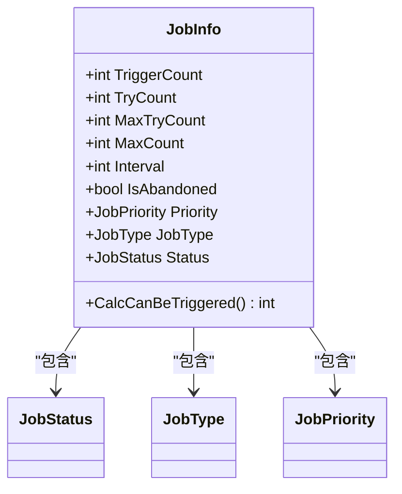
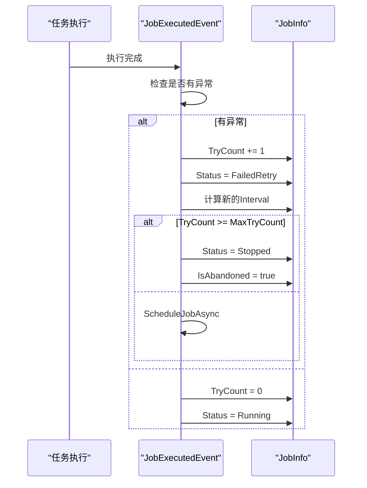
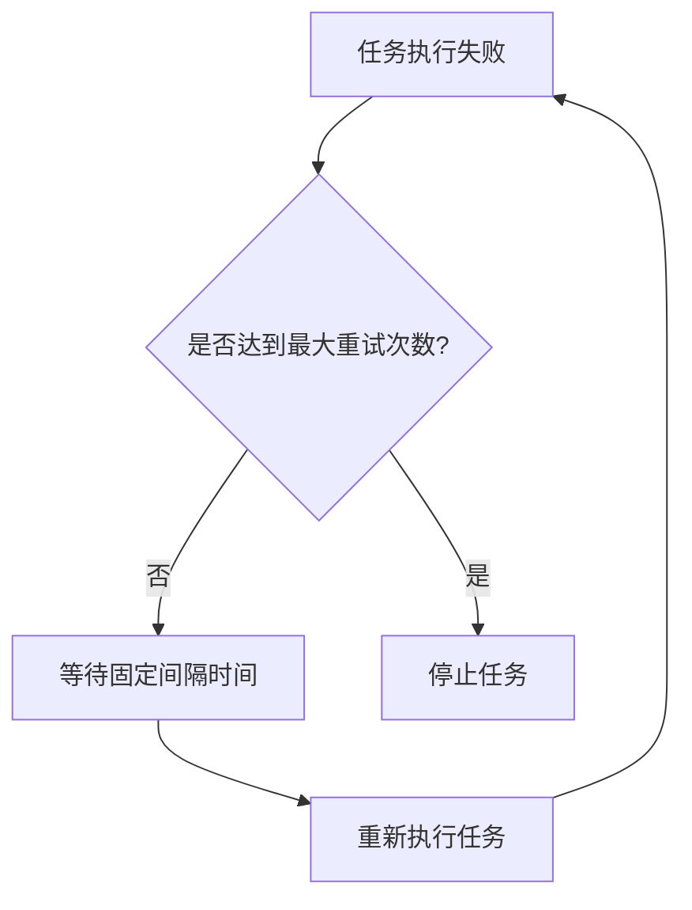
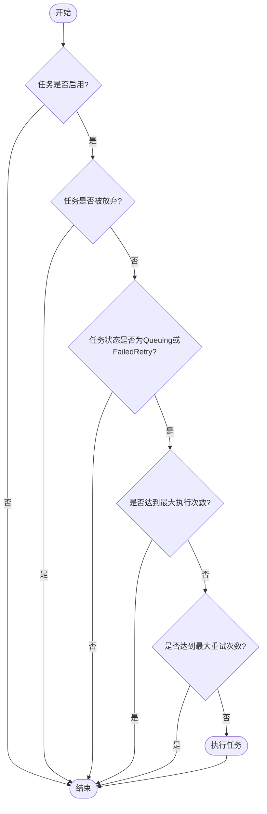

# 重试策略配置

<cite>
**本文档中引用的文件**  
- [JobInfo.cs](file://aspnet-core/modules/task-management/LINGYUN.Abp.BackgroundTasks.Abstractions/LINGYUN/Abp/BackgroundTasks/JobInfo.cs)
- [JobExecutedEvent.cs](file://aspnet-core/modules/task-management/LINGYUN.Abp.BackgroundTasks/LINGYUN/Abp/BackgroundTasks/Internal/JobExecutedEvent.cs)
- [BackgroundJobInfo.cs](file://aspnet-core/modules/task-management/LINGYUN.Abp.TaskManagement.Domain/LINGYUN/Abp/TaskManagement/BackgroundJobInfo.cs)
- [BackgroundJobInfoWaitingPeriodSpecification.cs](file://aspnet-core/modules/task-management/LINGYUN.Abp.TaskManagement.Domain/LINGYUN/Abp/TaskManagement/BackgroundJobInfoWaitingPeriodSpecification.cs)
- [AbpBackgroundTasksOptions.cs](file://aspnet-core/modules/task-management/LINGYUN.Abp.BackgroundTasks.Abstractions/LINGYUN/Abp/BackgroundTasks/AbpBackgroundTasksOptions.cs)
</cite>

## 目录
1. [引言](#引言)
2. [重试机制概述](#重试机制概述)
3. [核心重试配置属性](#核心重试配置属性)
4. [重试策略实现原理](#重试策略实现原理)
5. [重试模式详解](#重试模式详解)
6. [基于异常类型的重试逻辑](#基于异常类型的重试逻辑)
7. [系统资源影响与优化建议](#系统资源影响与优化建议)
8. [结论](#结论)

## 引言

后台任务的可靠执行是现代分布式系统的关键组成部分。当任务执行失败时，合理的重试机制能够提高系统的容错能力和稳定性。本文档详细介绍了后台任务的重试策略配置，涵盖固定间隔重试、指数退避重试和条件重试三种模式的实现原理和配置方法。通过分析`JobRetryConfiguration`类的各个属性和`IJobRetryPolicy`接口的设计，本文将为开发者提供全面的重试策略配置指导。

## 重试机制概述

后台任务的重试机制旨在处理任务执行过程中可能出现的各种异常情况，如网络波动、服务暂时不可用或资源竞争等。该机制通过自动重新执行失败的任务，提高了系统的整体可靠性和用户体验。在本系统中，重试机制主要通过`JobInfo`类和`JobExecutedEvent`类协同工作来实现。

重试机制的核心是根据任务的执行状态和配置参数，决定是否进行重试以及下次重试的时间。当任务执行失败时，系统会检查任务的重试配置，如最大重试次数、当前重试次数和重试间隔等，然后根据这些参数决定后续操作。对于周期性任务和一次性任务，系统的处理方式有所不同，以确保不同类型的任务都能得到适当的重试处理。

**Section sources**
- [JobInfo.cs](file://aspnet-core/modules/task-management/LINGYUN.Abp.BackgroundTasks.Abstractions/LINGYUN/Abp/BackgroundTasks/JobInfo.cs)
- [JobExecutedEvent.cs](file://aspnet-core/modules/task-management/LINGYUN.Abp.BackgroundTasks/LINGYUN/Abp/BackgroundTasks/Internal/JobExecutedEvent.cs)

## 核心重试配置属性

后台任务的重试行为由多个核心配置属性控制，这些属性定义在`JobInfo`类中，共同决定了任务的重试策略。

**Diagram sources**
- [JobInfo.cs](file://aspnet-core/modules/task-management/LINGYUN.Abp.BackgroundTasks.Abstractions/LINGYUN/Abp/BackgroundTasks/JobInfo.cs)
- [BackgroundJobInfo.cs](file://aspnet-core/modules/task-management/LINGYUN.Abp.TaskManagement.Domain/LINGYUN/Abp/TaskManagement/BackgroundJobInfo.cs)

### 最大重试次数 (MaxTryCount)

`MaxTryCount`属性定义了任务失败后允许的最大重试次数。默认值为50次，表示任务最多可以重试50次。当任务的`TryCount`（实际重试次数）达到`MaxTryCount`时，任务将被标记为停止状态，不再进行重试。这个属性对于防止无限重试导致的资源浪费至关重要。

### 初始重试间隔 (Interval)

`Interval`属性定义了任务重试的初始间隔时间，单位为秒。默认值为300秒（5分钟）。这个间隔时间在固定间隔重试模式下保持不变，在指数退避重试模式下会随着重试次数的增加而递增。对于新创建的任务，如果未显式设置此值，系统会使用默认值。

### 重试间隔倍增因子

虽然代码中没有直接定义"重试间隔倍增因子"的属性，但通过分析`JobExecutedEvent`类的实现，可以发现系统实际上使用了1.5倍的倍增因子。当任务需要重试时，系统会将当前的`Interval`值乘以1.5，从而实现指数退避的重试策略。

### 其他相关属性

- `TryCount`：记录任务当前的重试次数，每次任务执行失败时递增。
- `IsAbandoned`：标记任务是否已被放弃，当任务达到最大重试次数或被手动停止时设置为true。
- `Status`：任务的当前状态，包括Queuing、Running、FailedRetry、Stopped等。
- `JobType`：任务类型，区分周期性任务(Period)和一次性任务(Once)，不同类型的任务有不同的重试处理逻辑。

**Section sources**
- [JobInfo.cs](file://aspnet-core/modules/task-management/LINGYUN.Abp.BackgroundTasks.Abstractions/LINGYUN/Abp/BackgroundTasks/JobInfo.cs)
- [BackgroundJobInfo.cs](file://aspnet-core/modules/task-management/LINGYUN.Abp.TaskManagement.Domain/LINGYUN/Abp/TaskManagement/BackgroundJobInfo.cs)

## 重试策略实现原理

重试策略的实现主要依赖于`JobExecutedEvent`类中的事件处理逻辑。当任务执行完成后，系统会触发`JobExecutedEvent`事件，根据任务的执行结果决定后续操作。

**Diagram sources**
- [JobExecutedEvent.cs](file://aspnet-core/modules/task-management/LINGYUN.Abp.BackgroundTasks/LINGYUN/Abp/BackgroundTasks/Internal/JobExecutedEvent.cs)
- [JobInfo.cs](file://aspnet-core/modules/task-management/LINGYUN.Abp.BackgroundTasks.Abstractions/LINGYUN/Abp/BackgroundTasks/JobInfo.cs)

### 任务异常处理流程

当任务执行出现异常时，系统会执行以下流程：

1. **递增重试计数**：将`TryCount`属性加1，记录本次重试。
2. **更新任务状态**：将任务状态设置为`FailedRetry`，表示任务失败并需要重试。
3. **调整任务优先级**：根据重试次数动态调整任务优先级。当重试次数超过最大重试次数的1/3但不超过1/2时，优先级降为`BelowNormal`；当重试次数超过最大重试次数的2/3时，优先级降为`Low`。
4. **计算重试间隔**：采用指数退避策略，将当前`Interval`值乘以1.5作为新的重试间隔。
5. **决定后续操作**：检查是否达到最大重试次数，如果达到则停止任务，否则安排下一次执行。

### 周期性任务的特殊处理

对于周期性任务（`JobType.Period`），系统采用了不同的重试策略。周期性任务的重试不会改变其原有的调度计划，而是继续按照Cron表达式定义的时间间隔执行。这种设计确保了周期性任务的执行频率不会因为重试而改变，避免了可能的执行频率失控问题。

**Section sources**
- [JobExecutedEvent.cs](file://aspnet-core/modules/task-management/LINGYUN.Abp.BackgroundTasks/LINGYUN/Abp/BackgroundTasks/Internal/JobExecutedEvent.cs)
- [BackgroundJobInfoWaitingPeriodSpecification.cs](file://aspnet-core/modules/task-management/LINGYUN.Abp.TaskManagement.Domain/LINGYUN/Abp/TaskManagement/BackgroundJobInfoWaitingPeriodSpecification.cs)

## 重试模式详解

系统支持多种重试模式，每种模式适用于不同的应用场景和需求。

### 固定间隔重试

固定间隔重试是最简单的重试模式，任务在失败后按照固定的间隔时间进行重试。这种模式适用于那些预期短时间内就能恢复的服务调用。在本系统中，可以通过设置`Interval`属性来实现固定间隔重试。

**Diagram sources**
- [JobInfo.cs](file://aspnet-core/modules/task-management/LINGYUN.Abp.BackgroundTasks.Abstractions/LINGYUN/Abp/BackgroundTasks/JobInfo.cs)

### 指数退避重试

指数退避重试是一种更智能的重试策略，它会随着重试次数的增加而延长重试间隔。本系统通过将`Interval`值乘以1.5的倍增因子来实现这一策略。这种模式可以有效避免在服务长时间不可用时产生大量的重试请求，从而减轻系统压力。

### 条件重试

条件重试允许根据特定条件决定是否进行重试。在本系统中，这主要通过`BackgroundJobInfoWaitingSpecification`类实现。该类定义了复杂的LINQ表达式，用于判断哪些任务应该被调度执行。例如，只有当任务处于启用状态、未被放弃且满足最大执行次数或最大重试次数条件时，才会被考虑执行。

**Diagram sources**
- [BackgroundJobInfoWaitingPeriodSpecification.cs](file://aspnet-core/modules/task-management/LINGYUN.Abp.TaskManagement.Domain/LINGYUN/Abp/TaskManagement/BackgroundJobInfoWaitingPeriodSpecification.cs)

**Section sources**
- [BackgroundJobInfoWaitingPeriodSpecification.cs](file://aspnet-core/modules/task-management/LINGYUN.Abp.TaskManagement.Domain/LINGYUN/Abp/TaskManagement/BackgroundJobInfoWaitingPeriodSpecification.cs)

## 基于异常类型的重试逻辑

系统支持基于异常类型的差异化重试策略，这通过`JobExceptionType`枚举和相关的异常类型映射机制