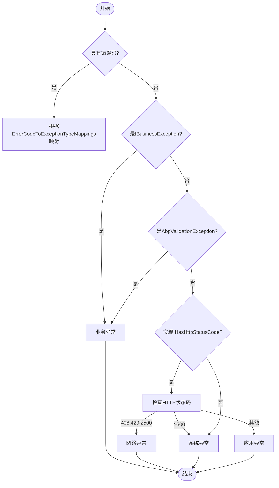
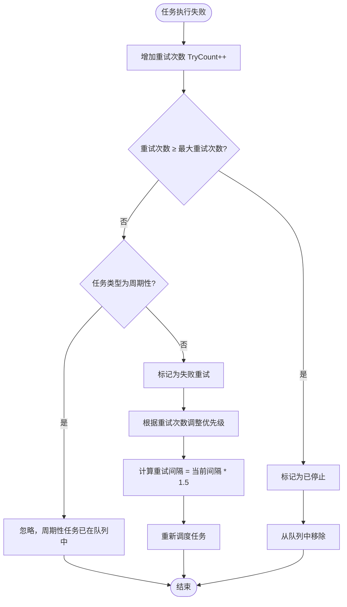
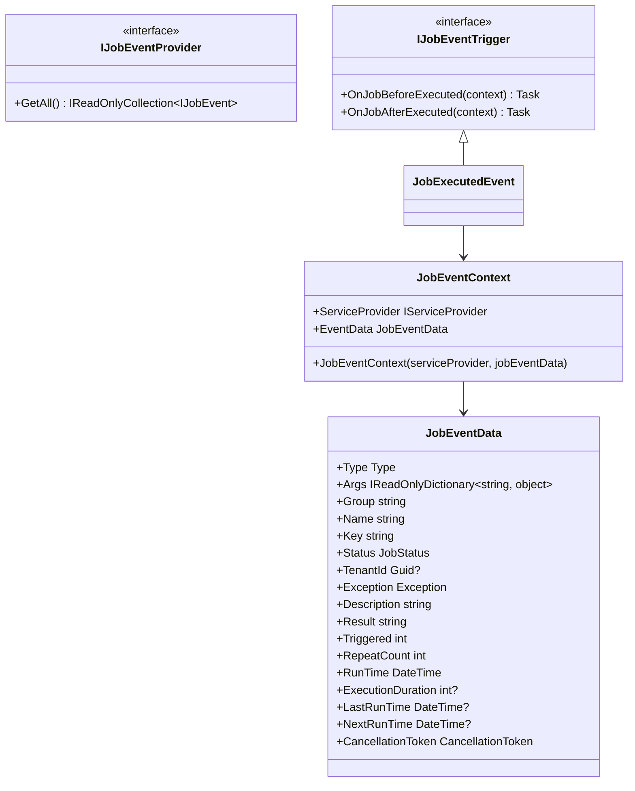
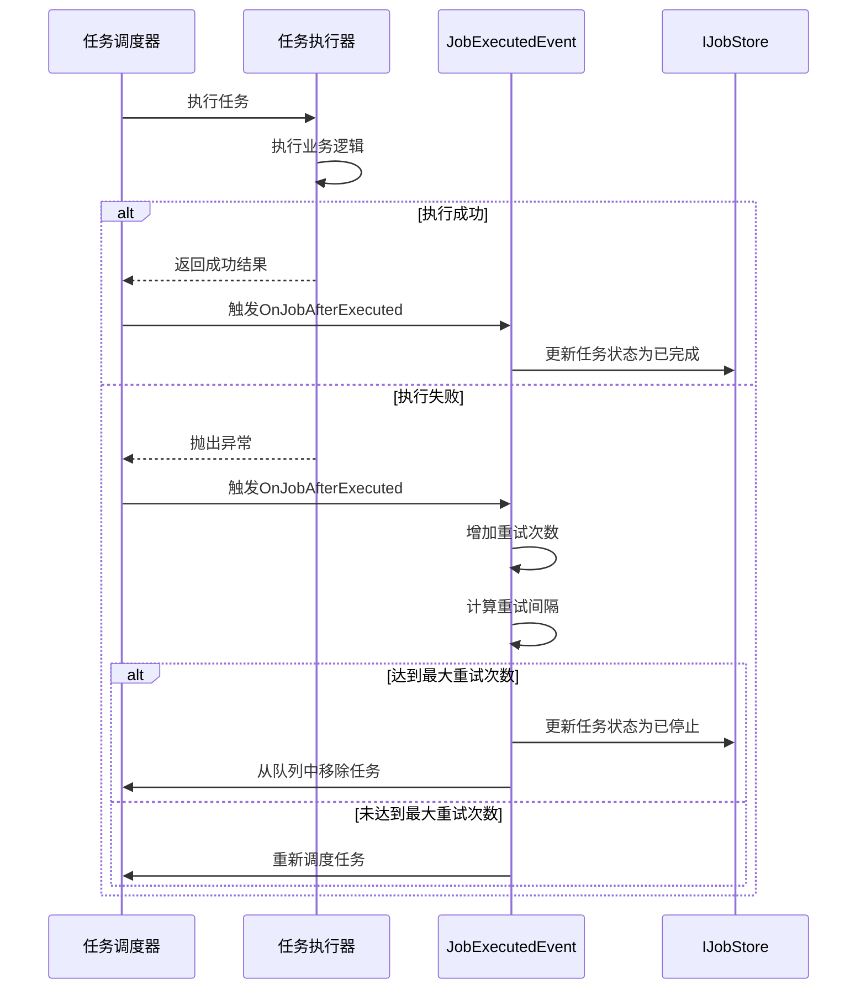

# 错误处理与重试机制

<cite>
**本文档引用的文件**  
- [AbpExceptionHandlingOptions.cs](file://aspnet-core/framework/common/LINGYUN.Abp.ExceptionHandling/LINGYUN/Abp/ExceptionHandling/AbpExceptionHandlingOptions.cs)
- [DefaultJobExceptionTypeFinder.cs](file://aspnet-core/modules/task-management/LINGYUN.Abp.BackgroundTasks.Abstractions/LINGYUN/Abp/BackgroundTasks/DefaultJobExceptionTypeFinder.cs)
- [JobExecutedEvent.cs](file://aspnet-core/modules/task-management/LINGYUN.Abp.BackgroundTasks/Internal/JobExecutedEvent.cs)
- [IJobEventProvider.cs](file://aspnet-core/modules/task-management/LINGYUN.Abp.BackgroundTasks/IJobEventProvider.cs)
- [IJobEventTrigger.cs](file://aspnet-core/modules/task-management/LINGYUN.Abp.BackgroundTasks/IJobEventTrigger.cs)
- [JobEventData.cs](file://aspnet-core/modules/task-management/LINGYUN.Abp.BackgroundTasks.Abstractions/LINGYUN/Abp/BackgroundTasks/JobEventData.cs)
- [JobEventContext.cs](file://aspnet-core/modules/task-management/LINGYUN.Abp.BackgroundTasks.Abstractions/LINGYUN/Abp/BackgroundTasks/JobEventContext.cs)
- [JobExceptionType.cs](file://aspnet-core/modules/task-management/LINGYUN.Abp.BackgroundTasks/JobExceptionType.cs)
- [AbpExceptionHandlingModule.cs](file://aspnet-core/framework/common/LINGYUN.Abp.ExceptionHandling/LINGYUN/Abp/ExceptionHandling/AbpExceptionHandlingModule.cs)
</cite>

## 目录
1. [简介](#简介)
2. [异常捕获与分类](#异常捕获与分类)
3. [重试策略配置](#重试策略配置)
4. [事件通知与自动恢复](#事件通知与自动恢复)
5. [自定义异常处理器实现](#自定义异常处理器实现)
6. [总结](#总结)

## 简介
本项目实现了完善的后台任务错误处理与重试机制，通过异常分类、智能重试、事件通知等机制确保任务的可靠执行。系统采用分层设计，将异常处理、重试策略和事件触发分离，提供了灵活的配置选项和扩展点。

## 异常捕获与分类

系统通过 `DefaultJobExceptionTypeFinder` 类实现异常分类，根据异常类型和HTTP状态码对异常进行分类，便于后续差异化处理。

异常分类规则如下：
- 具有错误码的异常：根据配置的错误码映射确定异常类型
- 业务异常（IBusinessException）和验证异常（AbpValidationException）：归类为业务异常
- HTTP状态码为408、429或500及以上：归类为网络异常
- HTTP状态码500及以上：归类为系统异常
- 其他情况：归类为系统异常

**Diagram sources**
- [DefaultJobExceptionTypeFinder.cs](file://aspnet-core/modules/task-management/LINGYUN.Abp.BackgroundTasks.Abstractions/LINGYUN/Abp/BackgroundTasks/DefaultJobExceptionTypeFinder.cs#L25-L60)

**Section sources**
- [DefaultJobExceptionTypeFinder.cs](file://aspnet-core/modules/task-management/LINGYUN.Abp.BackgroundTasks.Abstractions/LINGYUN/Abp/BackgroundTasks/DefaultJobExceptionTypeFinder.cs#L1-L62)
- [JobExceptionType.cs](file://aspnet-core/modules/task-management/LINGYUN.Abp.BackgroundTasks/JobExceptionType.cs#L1-L15)

## 重试策略配置

系统提供了灵活的重试策略配置，支持多种重试模式：

### 固定间隔重试
默认情况下，任务失败后会按照固定的时间间隔进行重试。初始间隔为50毫秒，每次重试间隔会增加50%。

### 指数退避重试
系统实现了指数退避算法，通过乘以1.5的系数逐步增加重试间隔，避免对系统造成过大压力。

### 条件重试
系统根据任务的重试次数动态调整重试策略：
- 当重试次数超过最大重试次数的1/3但不超过1/2时，优先级调整为低于正常
- 当重试次数超过最大重试次数的2/3时，优先级调整为低

重试逻辑在 `JobExecutedEvent` 类中实现，当任务执行失败时会更新任务状态为"失败重试"，并根据配置调整重试间隔和优先级。

**Diagram sources**
- [JobExecutedEvent.cs](file://aspnet-core/modules/task-management/LINGYUN.Abp.BackgroundTasks/Internal/JobExecutedEvent.cs#L62-L101)

**Section sources**
- [JobExecutedEvent.cs](file://aspnet-core/modules/task-management/LINGYUN.Abp.BackgroundTasks/Internal/JobExecutedEvent.cs#L1-L149)
- [JobStatus.cs](file://aspnet-core/modules/task-management/LINGYUN.Abp.BackgroundTasks/JobStatus.cs#L1-L34)

## 事件通知与自动恢复

系统通过 `IJobEventProvider` 和 `IJobEventTrigger` 接口实现事件驱动的错误处理机制，支持失败任务的事件通知和自动恢复。

### IJobEventProvider
提供任务事件的注册和管理功能，返回所有任务事件的只读集合。

### IJobEventTrigger
定义任务执行前后触发的事件处理接口，包含 `OnJobBeforeExecuted` 和 `OnJobAfterExecuted` 两个方法。

当任务执行失败时，系统会触发相应的事件，通知注册的事件处理器。事件上下文 `JobEventContext` 包含服务提供者和事件数据，便于在事件处理中获取所需的服务和信息。

**Diagram sources**
- [IJobEventProvider.cs](file://aspnet-core/modules/task-management/LINGYUN.Abp.BackgroundTasks/IJobEventProvider.cs#L1-L16)
- [IJobEventTrigger.cs](file://aspnet-core/modules/task-management/LINGYUN.Abp.BackgroundTasks/IJobEventTrigger.cs#L1-L11)
- [JobEventContext.cs](file://aspnet-core/modules/task-management/LINGYUN.Abp.BackgroundTasks.Abstractions/LINGYUN/Abp/BackgroundTasks/JobEventContext.cs#L1-L18)
- [JobEventData.cs](file://aspnet-core/modules/task-management/LINGYUN.Abp.BackgroundTasks.Abstractions/LINGYUN/Abp/BackgroundTasks/JobEventData.cs#L1-L95)

**Section sources**
- [IJobEventProvider.cs](file://aspnet-core/modules/task-management/LINGYUN.Abp.BackgroundTasks/IJobEventProvider.cs#L1-L16)
- [IJobEventTrigger.cs](file://aspnet-core/modules/task-management/LINGYUN.Abp.BackgroundTasks/IJobEventTrigger.cs#L1-L11)
- [JobEventContext.cs](file://aspnet-core/modules/task-management/LINGYUN.Abp.BackgroundTasks.Abstractions/LINGYUN/Abp/BackgroundTasks/JobEventContext.cs#L1-L18)
- [JobEventData.cs](file://aspnet-core/modules/task-management/LINGYUN.Abp.BackgroundTasks.Abstractions/LINGYUN/Abp/BackgroundTasks/JobEventData.cs#L1-L95)

## 自定义异常处理器实现

开发者可以通过实现自定义异常处理器来扩展系统的错误处理能力。以下是实现自定义异常处理器的关键步骤：

### 错误分类扩展
通过实现 `IJobExceptionTypeFinder` 接口，可以自定义异常分类逻辑。系统默认使用 `DefaultJobExceptionTypeFinder`，开发者可以注册自己的实现来覆盖默认行为。

### 重试次数限制
在 `JobInfo` 对象中，`MaxTryCount` 属性控制最大重试次数。当重试次数达到此限制时，任务状态将被标记为"已停止"，并从队列中移除。

### 最终失败处理
当任务最终失败时，系统会：
1. 标记任务为"已停止"
2. 设置 `IsAbandoned` 为 true
3. 清除 `NextRunTime`
4. 从调度队列中移除任务

开发者可以通过监听 `OnJobAfterExecuted` 事件来实现自定义的最终失败处理逻辑，如发送通知、记录日志或触发补偿事务。

**Diagram sources**
- [JobExecutedEvent.cs](file://aspnet-core/modules/task-management/LINGYUN.Abp.BackgroundTasks/Internal/JobExecutedEvent.cs#L1-L149)
- [IJobScheduler.cs](file://aspnet-core/modules/task-management/LINGYUN.Abp.BackgroundTasks/IJobScheduler.cs)
- [IJobStore.cs](file://aspnet-core/modules/task-management/LINGYUN.Abp.BackgroundTasks/IJobStore.cs)

**Section sources**
- [JobExecutedEvent.cs](file://aspnet-core/modules/task-management/LINGYUN.Abp.BackgroundTasks/Internal/JobExecutedEvent.cs#L1-L149)
- [AbpExceptionHandlingOptions.cs](file://aspnet-core/framework/common/LINGYUN.Abp.ExceptionHandling/LINGYUN/Abp/ExceptionHandling/AbpExceptionHandlingOptions.cs#L1-L24)

## 总结
本项目的错误处理与重试机制设计完善，具有以下特点：
1. **分层架构**：异常处理、重试策略和事件通知分离，便于维护和扩展
2. **智能分类**：基于异常类型和HTTP状态码进行智能分类，支持自定义映射
3. **灵活重试**：支持固定间隔、指数退避等多种重试策略，可根据重试次数动态调整
4. **事件驱动**：通过事件机制实现解耦，支持自定义事件处理器
5. **可配置性**：提供丰富的配置选项，满足不同场景的需求

开发者可以根据具体业务需求，通过实现相应的接口和扩展点来定制错误处理行为，确保系统的稳定性和可靠性。