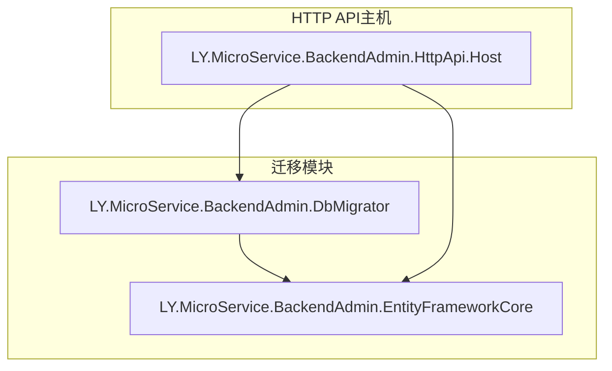
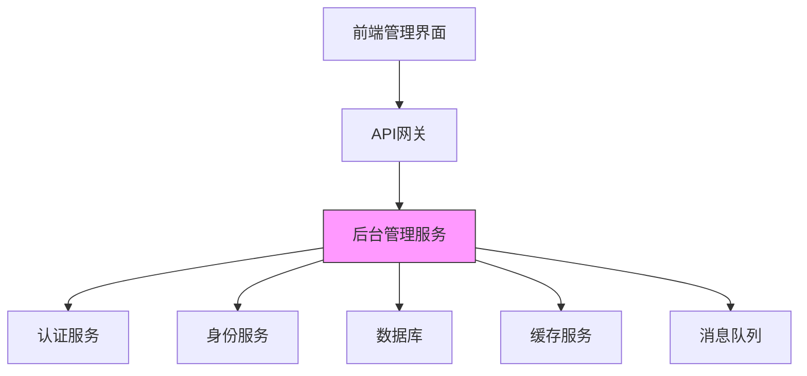
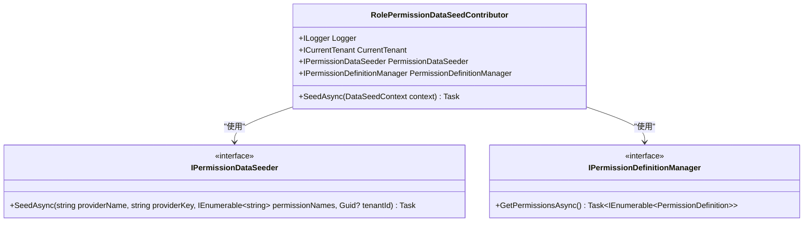
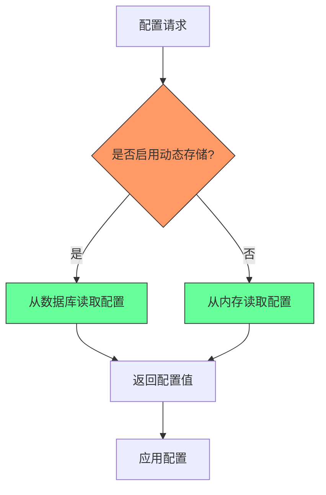
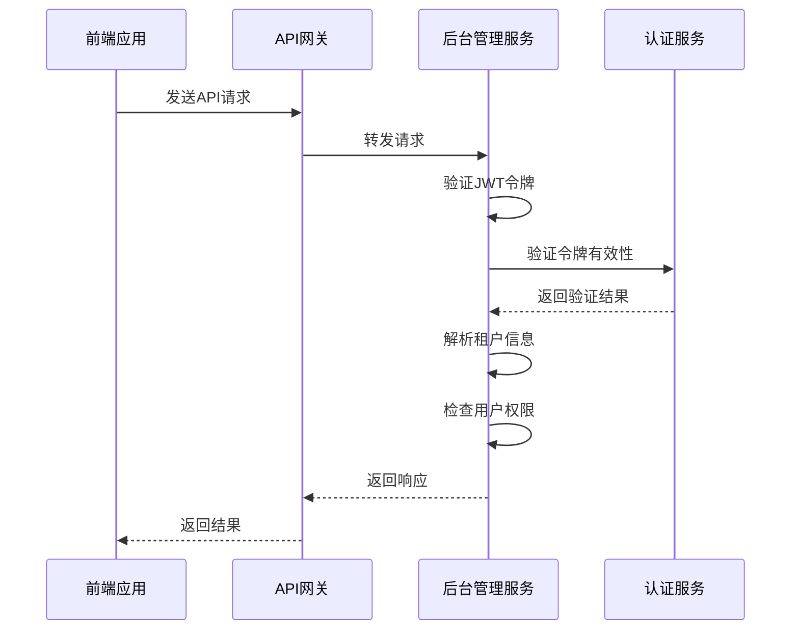
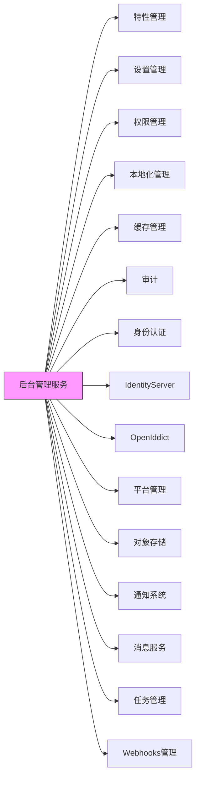

# 后台管理服务

<cite>
**本文档中引用的文件**  
- [BackendAdminHttpApiHostModule.cs](file://aspnet-core/services/LY.MicroService.BackendAdmin.HttpApi.Host/BackendAdminHttpApiHostModule.cs)
- [BackendAdminHttpApiHostModule.Configure.cs](file://aspnet-core/services/LY.MicroService.BackendAdmin.HttpApi.Host/BackendAdminHttpApiHostModule.Configure.cs)
- [BackendAdminMigrationsEntityFrameworkCoreModule.cs](file://aspnet-core/migrations/LY.MicroService.BackendAdmin.EntityFrameworkCore/BackendAdminMigrationsEntityFrameworkCoreModule.cs)
- [BackendAdminMigrationsDbContext.cs](file://aspnet-core/migrations/LY.MicroService.BackendAdmin.EntityFrameworkCore/BackendAdminMigrationsDbContext.cs)
- [BackendAdminDbMigrationService.cs](file://aspnet-core/migrations/LY.MicroService.BackendAdmin.EntityFrameworkCore/BackendAdminDbMigrationService.cs)
- [BackendAdminDbMigrationEventHandler.cs](file://aspnet-core/migrations/LY.MicroService.BackendAdmin.EntityFrameworkCore/BackendAdminDbMigrationEventHandler.cs)
- [RolePermissionDataSeedContributor.cs](file://aspnet-core/migrations/LY.MicroService.BackendAdmin.EntityFrameworkCore/RolePermissionDataSeedContributor.cs)
- [BackendAdminDbMigratorModule.cs](file://aspnet-core/migrations/LY.MicroService.BackendAdmin.DbMigrator/BackendAdminDbMigratorModule.cs)
- [BackendAdminHttpApiHostModule.Seeder.cs](file://aspnet-core/services/LY.MicroService.BackendAdmin.HttpApi.Host/BackendAdminHttpApiHostModule.Seeder.cs)
</cite>

## 目录
1. [简介](#简介)
2. [项目结构](#项目结构)
3. [核心组件](#核心组件)
4. [架构概述](#架构概述)
5. [详细组件分析](#详细组件分析)
6. [依赖分析](#依赖分析)
7. [性能考虑](#性能考虑)
8. [故障排除指南](#故障排除指南)
9. [结论](#结论)

## 简介
后台管理服务是基于ABP框架构建的微服务系统，为前端管理界面提供数据支持和业务逻辑处理。该服务集成了用户管理、角色权限、系统配置等核心功能，通过模块化设计实现了高内聚低耦合的架构。服务采用多租户架构，支持分布式部署，并与认证服务、身份服务等其他微服务紧密集成，形成完整的后台管理系统生态。

## 项目结构
后台管理服务的项目结构遵循ABP框架的模块化设计原则，主要分为迁移模块和HTTP API主机模块。迁移模块负责数据库迁移和种子数据初始化，而HTTP API主机模块则提供RESTful API接口供前端调用。

**图示来源**  
- [BackendAdminHttpApiHostModule.cs](file://aspnet-core/services/LY.MicroService.BackendAdmin.HttpApi.Host/BackendAdminHttpApiHostModule.cs)
- [BackendAdminMigrationsEntityFrameworkCoreModule.cs](file://aspnet-core/migrations/LY.MicroService.BackendAdmin.EntityFrameworkCore/BackendAdminMigrationsEntityFrameworkCoreModule.cs)

**本节来源**  
- [BackendAdminHttpApiHostModule.cs](file://aspnet-core/services/LY.MicroService.BackendAdmin.HttpApi.Host/BackendAdminHttpApiHostModule.cs)
- [BackendAdminMigrationsEntityFrameworkCoreModule.cs](file://aspnet-core/migrations/LY.MicroService.BackendAdmin.EntityFrameworkCore/BackendAdminMigrationsEntityFrameworkCoreModule.cs)

## 核心组件
后台管理服务的核心组件包括API主机模块、数据库迁移服务和数据种子贡献者。这些组件协同工作，确保服务的稳定运行和数据的一致性。API主机模块负责处理HTTP请求，实现业务逻辑；数据库迁移服务确保数据库结构的同步更新；数据种子贡献者则负责初始化系统所需的默认数据。

**本节来源**  
- [BackendAdminHttpApiHostModule.cs](file://aspnet-core/services/LY.MicroService.BackendAdmin.HttpApi.Host/BackendAdminHttpApiHostModule.cs)
- [BackendAdminDbMigrationService.cs](file://aspnet-core/migrations/LY.MicroService.BackendAdmin.EntityFrameworkCore/BackendAdminDbMigrationService.cs)
- [RolePermissionDataSeedContributor.cs](file://aspnet-core/migrations/LY.MicroService.BackendAdmin.EntityFrameworkCore/RolePermissionDataSeedContributor.cs)

## 架构概述
后台管理服务采用分层架构设计，包括表现层、应用层、领域层和基础设施层。服务通过依赖注入容器管理组件间的依赖关系，使用领域驱动设计原则组织业务逻辑。整体架构支持水平扩展，可通过配置实现多实例部署。

**图示来源**  
- [BackendAdminHttpApiHostModule.cs](file://aspnet-core/services/LY.MicroService.BackendAdmin.HttpApi.Host/BackendAdminHttpApiHostModule.cs)
- [BackendAdminHttpApiHostModule.Configure.cs](file://aspnet-core/services/LY.MicroService.BackendAdmin.HttpApi.Host/BackendAdminHttpApiHostModule.Configure.cs)

## 详细组件分析

### 用户管理与角色权限分析
后台管理服务通过集成ABP框架的权限管理模块实现用户和角色的权限控制。系统采用基于角色的访问控制（RBAC）模型，支持细粒度的权限分配。权限定义在启动时注册，并通过数据种子贡献者为新租户初始化管理员角色权限。

**图示来源**  
- [RolePermissionDataSeedContributor.cs](file://aspnet-core/migrations/LY.MicroService.BackendAdmin.EntityFrameworkCore/RolePermissionDataSeedContributor.cs)

**本节来源**  
- [RolePermissionDataSeedContributor.cs](file://aspnet-core/migrations/LY.MicroService.BackendAdmin.EntityFrameworkCore/RolePermissionDataSeedContributor.cs)

### 系统配置管理分析
系统配置管理功能通过集成ABP框架的设置管理模块实现。服务支持动态设置存储，允许在运行时修改配置项。配置数据存储在数据库中，支持多租户隔离，确保不同租户的配置独立。

**图示来源**  
- [BackendAdminHttpApiHostModule.Configure.cs](file://aspnet-core/services/LY.MicroService.BackendAdmin.HttpApi.Host/BackendAdminHttpApiHostModule.Configure.cs)

**本节来源**  
- [BackendAdminHttpApiHostModule.Configure.cs](file://aspnet-core/services/LY.MicroService.BackendAdmin.HttpApi.Host/BackendAdminHttpApiHostModule.Configure.cs)

### 认证与身份服务集成分析
后台管理服务通过JWT认证与身份服务集成，实现安全的API访问控制。服务支持多签发者和多受众配置，增强了系统的安全性和灵活性。认证流程包括令牌验证、租户解析和权限检查，确保只有授权用户才能访问受保护的资源。

**图示来源**  
- [BackendAdminHttpApiHostModule.Configure.cs](file://aspnet-core/services/LY.MicroService.BackendAdmin.HttpApi.Host/BackendAdminHttpApiHostModule.Configure.cs)

**本节来源**  
- [BackendAdminHttpApiHostModule.Configure.cs](file://aspnet-core/services/LY.MicroService.BackendAdmin.HttpApi.Host/BackendAdminHttpApiHostModule.Configure.cs)

## 依赖分析
后台管理服务依赖于多个ABP框架模块和其他微服务，形成了复杂的依赖网络。这些依赖关系通过模块化设计进行管理，确保了系统的可维护性和可扩展性。

**图示来源**  
- [BackendAdminHttpApiHostModule.cs](file://aspnet-core/services/LY.MicroService.BackendAdmin.HttpApi.Host/BackendAdminHttpApiHostModule.cs)
- [BackendAdminDbMigratorModule.cs](file://aspnet-core/migrations/LY.MicroService.BackendAdmin.DbMigrator/BackendAdminDbMigratorModule.cs)

**本节来源**  
- [BackendAdminHttpApiHostModule.cs](file://aspnet-core/services/LY.MicroService.BackendAdmin.HttpApi.Host/BackendAdminHttpApiHostModule.cs)
- [BackendAdminDbMigratorModule.cs](file://aspnet-core/migrations/LY.MicroService.BackendAdmin.DbMigrator/BackendAdminDbMigratorModule.cs)

## 性能考虑
后台管理服务在设计时充分考虑了性能优化，采用了多种策略来提高系统响应速度和吞吐量。服务使用Redis作为分布式缓存，减少数据库访问频率；通过CAP消息队列实现异步处理，提高系统并发能力；采用数据库连接池和查询优化技术，提升数据访问效率。

## 故障排除指南
当后台管理服务出现故障时，应首先检查日志文件和监控指标。常见的故障包括数据库连接失败、缓存服务不可用和认证令牌失效。对于数据库问题，可尝试重启迁移服务；对于缓存问题，可检查Redis连接配置；对于认证问题，应验证JWT令牌的有效性和配置的正确性。

**本节来源**  
- [BackendAdminHttpApiHostModule.Configure.cs](file://aspnet-core/services/LY.MicroService.BackendAdmin.HttpApi.Host/BackendAdminHttpApiHostModule.Configure.cs)
- [BackendAdminDbMigrationService.cs](file://aspnet-core/migrations/LY.MicroService.BackendAdmin.EntityFrameworkCore/BackendAdminDbMigrationService.cs)

## 结论
后台管理服务是一个功能完善、架构合理的微服务系统，为前端管理界面提供了强大的数据支持和业务逻辑处理能力。通过模块化设计和丰富的功能集成，服务能够满足复杂的后台管理需求。未来可进一步优化性能，增强安全性，并扩展更多管理功能。