# 安全审计与告警系统

<cite>
**本文档中引用的文件**
- [AuditLog.cs](file://aspnet-core/framework/auditing/LINGYUN.Abp.AuditLogging/LINGYUN/Abp/AuditLogging/AuditLog.cs)
- [DefaultSecurityLogManager.cs](file://aspnet-core/framework/auditing/LINGYUN.Abp.AuditLogging/LINGYUN/Abp/AuditLogging/DefaultSecurityLogManager.cs)
- [DefaultEntityChangeStore.cs](file://aspnet-core/framework/auditing/LINGYUN.Abp.AuditLogging/LINGYUN/Abp/AuditLogging/DefaultEntityChangeStore.cs)
- [AuditLogManager.cs](file://aspnet-core/framework/auditing/LINGYUN.Abp.AuditLogging.EntityFrameworkCore/LINGYUN/Abp/AuditLogging/EntityFrameworkCore/AuditLogManager.cs)
- [SecurityLog.cs](file://aspnet-core/framework/auditing/LINGYUN.Abp.AuditLogging/LINGYUN/Abp/AuditLogging/SecurityLog.cs)
- [ElasticsearchSecurityLogManager.cs](file://aspnet-core/framework/auditing/LINGYUN.Abp.AuditLogging.Elasticsearch/LINGYUN/Abp/AuditLogging/Elasticsearch/ElasticsearchSecurityLogManager.cs)
- [SecurityLogAppService.cs](file://aspnet-core/modules/auditing/LINGYUN.Abp.Auditing.Application/LINGYUN/Abp/Auditing/SecurityLogs/SecurityLogAppService.cs)
- [NotificationProviderNames.cs](file://aspnet-core/modules/realtime-notifications/LINGYUN.Abp.Notifications.Core/LINGYUN/Abp/Notifications/NotificationProviderNames.cs)
- [EmailingNotificationPublishProvider.cs](file://aspnet-core/modules/realtime-notifications/LINGYUN.Abp.Notifications.Emailing/LINGYUN/Abp/Notifications/Emailing/EmailingNotificationPublishProvider.cs)
- [QrCodeTokenExtensionGrant.cs](file://aspnet-core/modules/openIddict/LINGYUN.Abp.OpenIddict.QrCode/LINGYUN/Abp/OpenIddict/QrCode/QrCodeTokenExtensionGrant.cs)
- [PortalTokenExtensionGrant.cs](file://aspnet-core/modules/openIddict/LINGYUN.Abp.OpenIddict.Portal/LINGYUN/Abp/OpenIddict/Portal/PortalTokenExtensionGrant.cs)
- [ConcurrentLoginStrategy.cs](file://aspnet-core/modules/identity/LINGYUN.Abp.Identity.Domain.Shared/LINGYUN/Abp/Identity/ConcurrentLoginStrategy.cs)
</cite>

## 目录
1. [简介](#简介)
2. [项目架构概览](#项目架构概览)
3. [核心组件分析](#核心组件分析)
4. [安全审计功能](#安全审计功能)
5. [告警系统实现](#告警系统实现)
6. [异常行为检测](#异常行为检测)
7. [日志完整性保护](#日志完整性保护)
8. [实际案例分析](#实际案例分析)
9. [性能考虑](#性能考虑)
10. [故障排除指南](#故障排除指南)
11. [结论](#结论)

## 简介

安全审计与告警系统是ABP Next Admin框架中的重要组成部分，提供了全面的安全监控、事件检测和告警通知功能。该系统基于审计日志机制，能够实时捕获和分析安全相关事件，包括频繁登录失败、异常时间段访问、权限提升等安全威胁，并通过多种通知渠道及时告警。

系统采用模块化设计，支持多种存储后端（Entity Framework Core、Elasticsearch），并集成了丰富的通知提供商（邮件、短信、微信等），为企业级应用提供了强大的安全保障能力。

## 项目架构概览

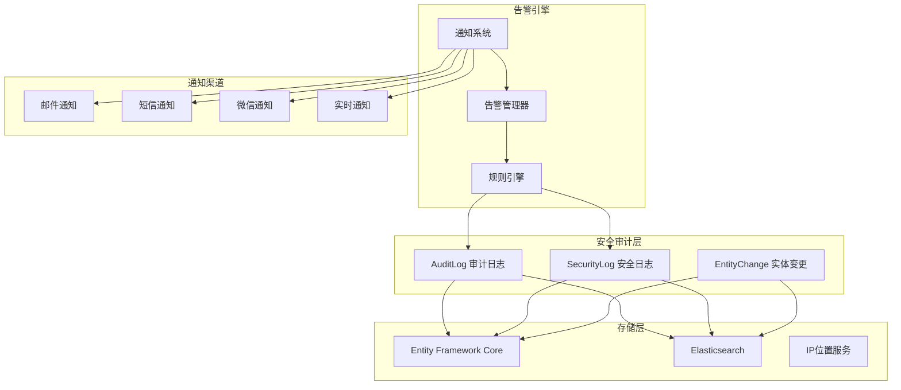

**图表来源**
- [AuditLog.cs](file://aspnet-core/framework/auditing/LINGYUN.Abp.AuditLogging/LINGYUN/Abp/AuditLogging/AuditLog.cs#L1-L121)
- [DefaultSecurityLogManager.cs](file://aspnet-core/framework/auditing/LINGYUN.Abp.AuditLogging/LINGYUN/Abp/AuditLogging/DefaultSecurityLogManager.cs#L1-L93)

## 核心组件分析

### 审计日志核心类

系统的核心是`AuditLog`类，它包含了完整的请求执行信息：

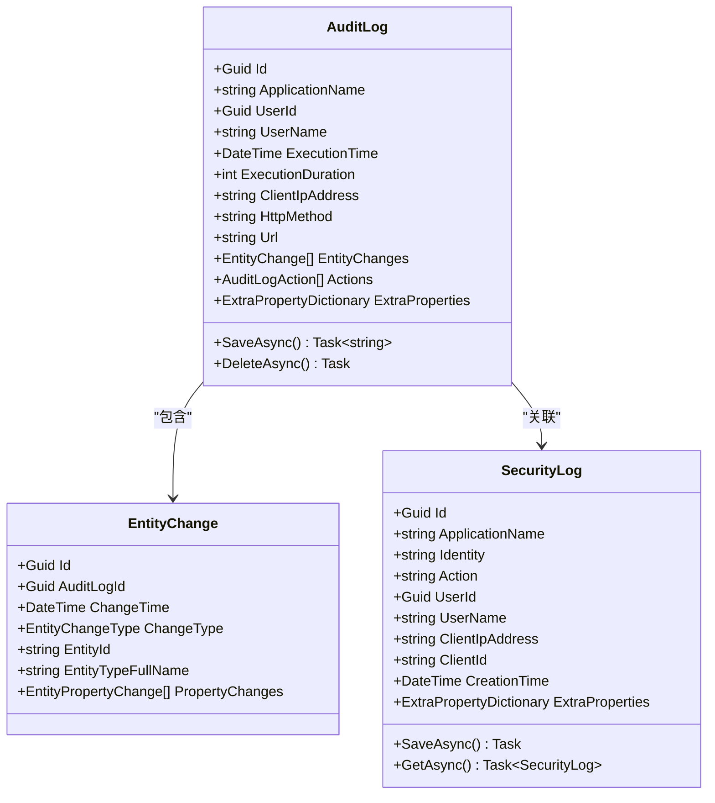

**图表来源**
- [AuditLog.cs](file://aspnet-core/framework/auditing/LINGYUN.Abp.AuditLogging/LINGYUN/Abp/AuditLogging/AuditLog.cs#L7-L121)
- [SecurityLog.cs](file://aspnet-core/framework/auditing/LINGYUN.Abp.AuditLogging/LINGYUN/Abp/AuditLogging/SecurityLog.cs#L1-L70)

### 存储管理器架构

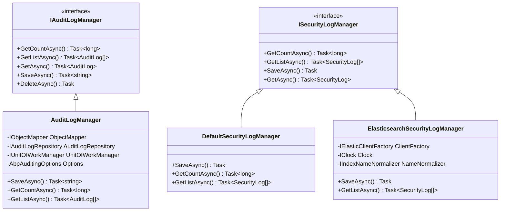

**图表来源**
- [AuditLogManager.cs](file://aspnet-core/framework/auditing/LINGYUN.Abp.AuditLogging.EntityFrameworkCore/LINGYUN/Abp/AuditLogging/EntityFrameworkCore/AuditLogManager.cs#L1-L190)
- [DefaultSecurityLogManager.cs](file://aspnet-core/framework/auditing/LINGYUN.Abp.AuditLogging/LINGYUN/Abp/AuditLogging/DefaultSecurityLogManager.cs#L1-L93)
- [ElasticsearchSecurityLogManager.cs](file://aspnet-core/framework/auditing/LINGYUN.Abp.AuditLogging.Elasticsearch/LINGYUN/Abp/AuditLogging/Elasticsearch/ElasticsearchSecurityLogManager.cs#L1-L254)

**章节来源**
- [AuditLog.cs](file://aspnet-core/framework/auditing/LINGYUN.Abp.AuditLogging/LINGYUN/Abp/AuditLogging/AuditLog.cs#L1-L121)
- [AuditLogManager.cs](file://aspnet-core/framework/auditing/LINGYUN.Abp.AuditLogging.EntityFrameworkCore/LINGYUN/Abp/AuditLogging/EntityFrameworkCore/AuditLogManager.cs#L1-L190)
- [DefaultSecurityLogManager.cs](file://aspnet-core/framework/auditing/LINGYUN.Abp.AuditLogging/LINGYUN/Abp/AuditLogging/DefaultSecurityLogManager.cs#L1-L93)

## 安全审计功能

### 审计日志记录机制

系统在每个HTTP请求的生命周期中自动记录详细的审计信息：

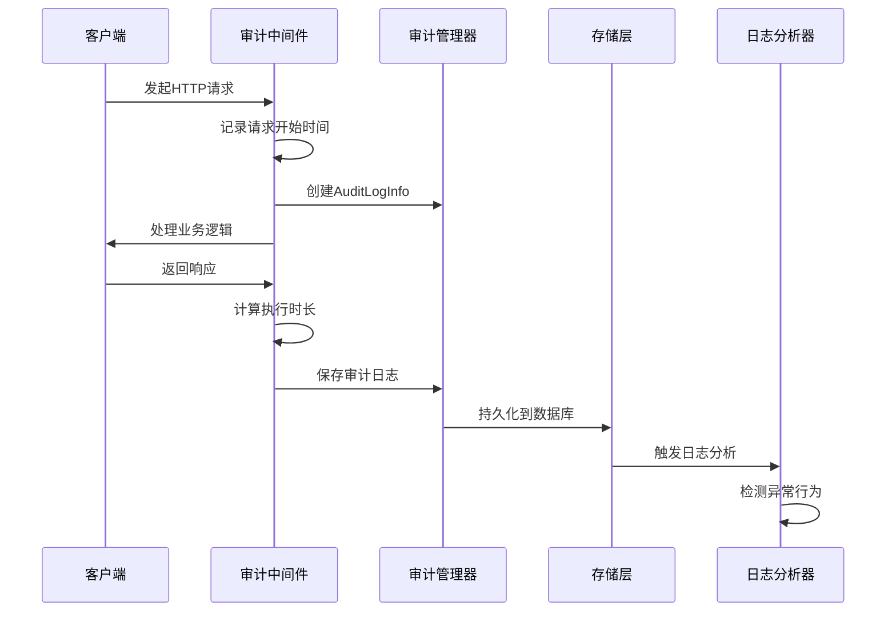

**图表来源**
- [AuditLogManager.cs](file://aspnet-core/framework/auditing/LINGYUN.Abp.AuditLogging.EntityFrameworkCore/LINGYUN/Abp/AuditLogging/EntityFrameworkCore/AuditLogManager.cs#L120-L189)

### 安全日志记录

系统专门记录安全相关事件，包括认证失败、权限变更等：

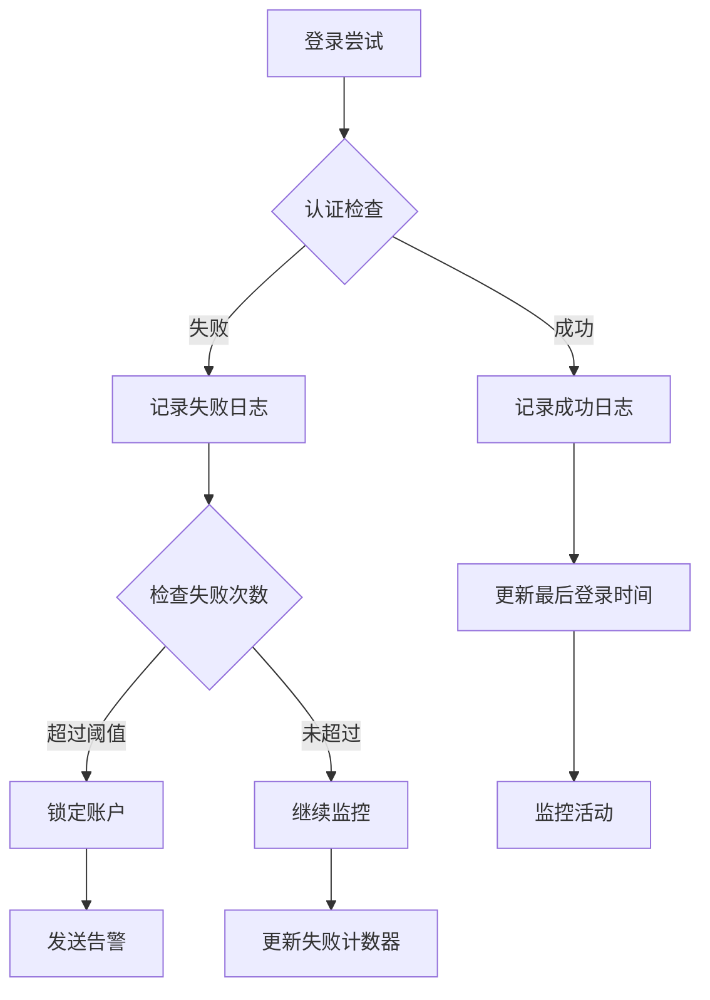

**图表来源**
- [QrCodeTokenExtensionGrant.cs](file://aspnet-core/modules/openIddict/LINGYUN.Abp.OpenIddict.QrCode/LINGYUN/Abp/OpenIddict/QrCode/QrCodeTokenExtensionGrant.cs#L89-L110)
- [PortalTokenExtensionGrant.cs](file://aspnet-core/modules/openIddict/LINGYUN.Abp.OpenIddict.Portal/LINGYUN/Abp/OpenIddict/Portal/PortalTokenExtensionGrant.cs#L151-L177)

**章节来源**
- [SecurityLog.cs](file://aspnet-core/framework/auditing/LINGYUN.Abp.AuditLogging/LINGYUN/Abp/AuditLogging/SecurityLog.cs#L1-L70)
- [DefaultSecurityLogManager.cs](file://aspnet-core/framework/auditing/LINGYUN.Abp.AuditLogging/LINGYUN/Abp/AuditLogging/DefaultSecurityLogManager.cs#L39-L79)

## 告警系统实现

### 通知提供商架构

系统支持多种通知渠道，通过统一的通知接口实现：

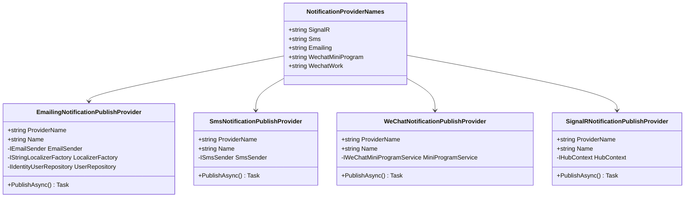

**图表来源**
- [NotificationProviderNames.cs](file://aspnet-core/modules/realtime-notifications/LINGYUN.Abp.Notifications.Core/LINGYUN/Abp/Notifications/NotificationProviderNames.cs#L1-L27)
- [EmailingNotificationPublishProvider.cs](file://aspnet-core/modules/realtime-notifications/LINGYUN.Abp.Notifications.Emailing/LINGYUN/Abp/Notifications/Emailing/EmailingNotificationPublishProvider.cs#L1-L42)

### 告警规则配置

系统通过规则引擎实现灵活的告警规则配置：

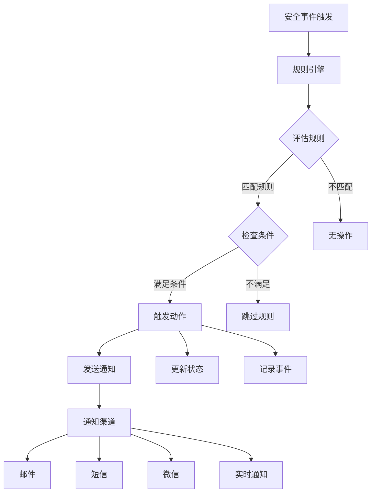

**章节来源**
- [NotificationProviderNames.cs](file://aspnet-core/modules/realtime-notifications/LINGYUN.Abp.Notifications.Core/LINGYUN/Abp/Notifications/NotificationProviderNames.cs#L1-L27)
- [EmailingNotificationPublishProvider.cs](file://aspnet-core/modules/realtime-notifications/LINGYUN.Abp.Notifications.Emailing/LINGYUN/Abp/Notifications/Emailing/EmailingNotificationPublishProvider.cs#L1-L42)

## 异常行为检测

### 频繁登录失败检测

系统实现了智能的登录失败检测机制：

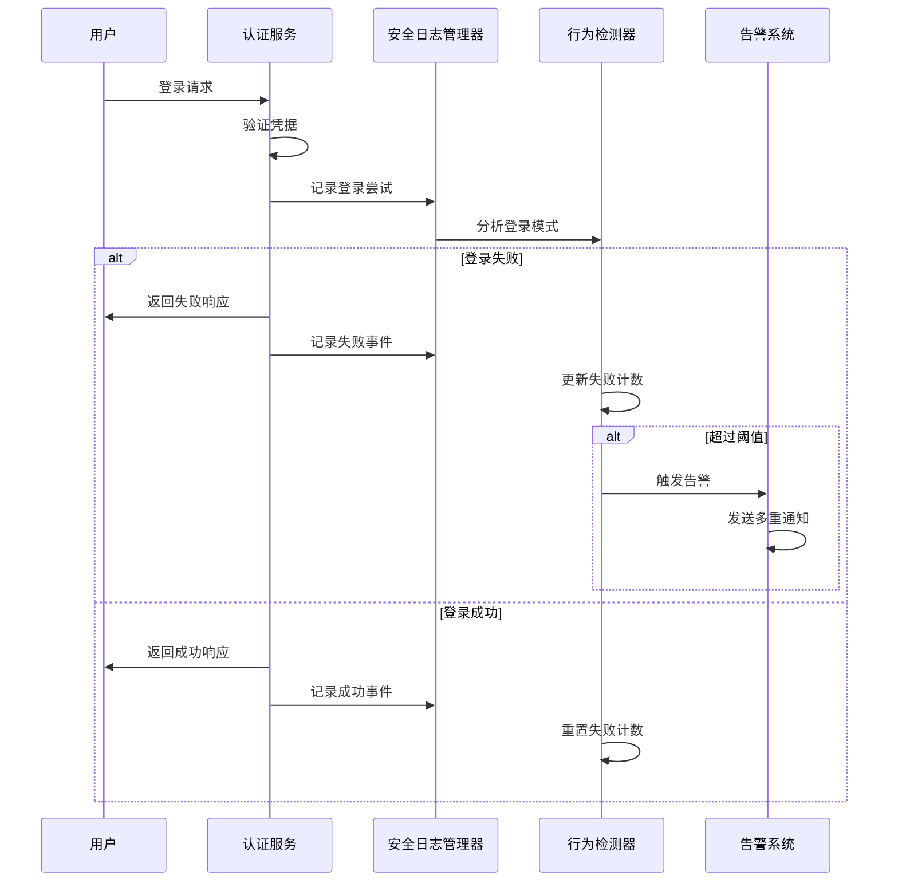

**图表来源**
- [QrCodeTokenExtensionGrant.cs](file://aspnet-core/modules/openIddict/LINGYUN.Abp.OpenIddict.QrCode/LINGYUN/Abp/OpenIddict/QrCode/QrCodeTokenExtensionGrant.cs#L89-L110)
- [ConcurrentLoginStrategy.cs](file://aspnet-core/modules/identity/LINGYUN.Abp.Identity.Domain.Shared/LINGYUN/Abp/Identity/ConcurrentLoginStrategy.cs#L1-L22)

### 异常时间段访问检测

系统能够识别非正常时间段的访问行为：

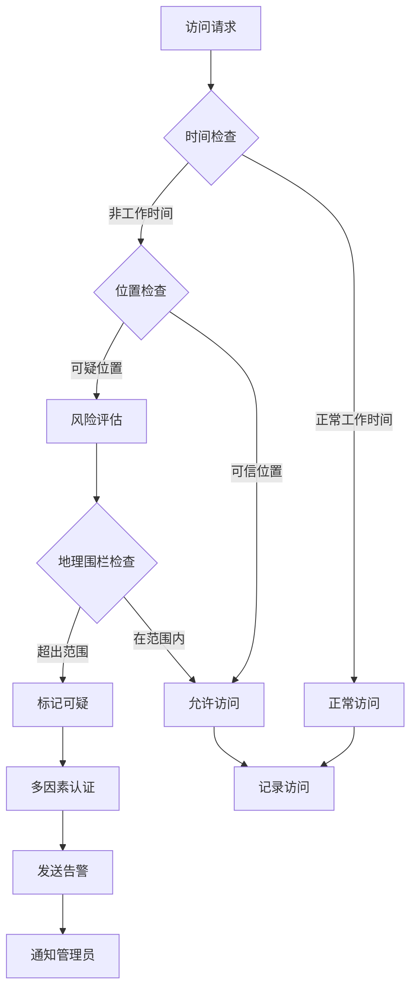

### 权限提升检测

系统监控权限变更过程，防止非法权限提升：

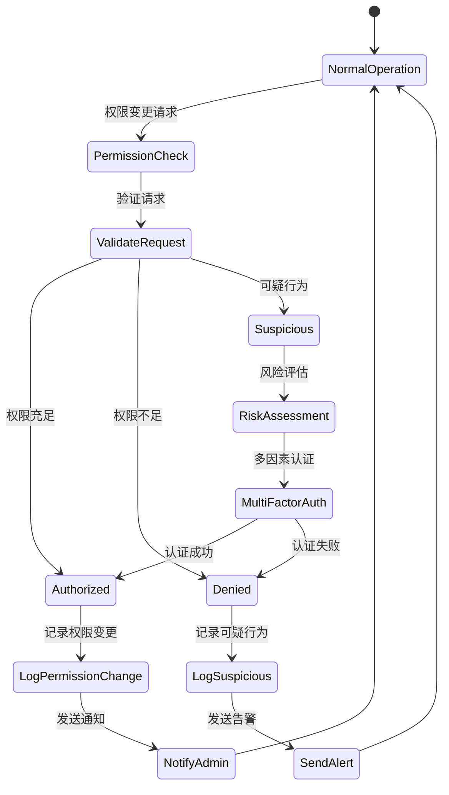

**章节来源**
- [QrCodeTokenExtensionGrant.cs](file://aspnet-core/modules/openIddict/LINGYUN.Abp.OpenIddict.QrCode/LINGYUN/Abp/OpenIddict/QrCode/QrCodeTokenExtensionGrant.cs#L89-L110)
- [ConcurrentLoginStrategy.cs](file://aspnet-core/modules/identity/LINGYUN.Abp.Identity.Domain.Shared/LINGYUN/Abp/Identity/ConcurrentLoginStrategy.cs#L1-L22)

## 日志完整性保护

### 数据库层面保护

系统通过Entity Framework Core拦截器实现数据保护：

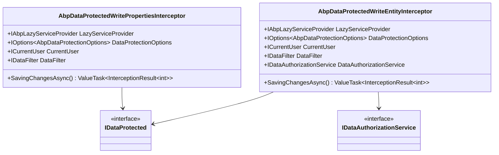

### 日志防篡改机制

系统通过多种技术手段确保日志完整性：

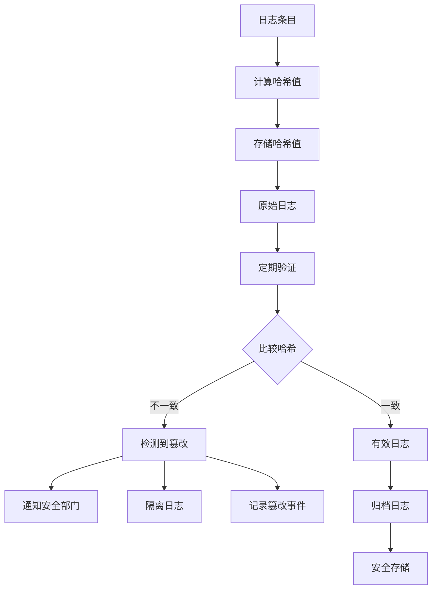

**章节来源**
- [AbpDataProtectedWritePropertiesInterceptor.cs](file://aspnet-core/framework/data-protection/LINGYUN.Abp.DataProtection.EntityFrameworkCore/LINGYUN/Abp/DataProtection/EntityFrameworkCore/AbpDataProtectedWritePropertiesInterceptor.cs#L1-L50)
- [AbpDataProtectedWriteEntityInterceptor.cs](file://aspnet-core/framework/data-protection/LINGYUN.Abp.DataProtection.EntityFrameworkCore/LINGYUN/Abp/DataProtection/EntityFrameworkCore/AbpDataProtectedWriteEntityInterceptor.cs#L1-L29)

## 实际案例分析

### 案例一：频繁登录失败攻击检测

**场景描述**：
某用户账户在短时间内连续遭受多次登录失败攻击，系统自动检测并阻止恶意访问。

**检测流程**：
1. 系统记录每次登录尝试
2. 统计同一IP地址的登录失败次数
3. 当失败次数超过预设阈值时触发告警
4. 自动锁定账户并发送多重通知

**响应措施**：
- 立即锁定账户
- 发送邮件告警给系统管理员
- 发送短信通知给账户所有者
- 在管理界面显示告警信息

### 案例二：异常地理位置访问

**场景描述**：
系统检测到用户从从未访问过的地理位置登录，触发安全检查。

**检测机制**：
1. 记录每次登录的IP地址和地理位置
2. 建立用户正常访问模式
3. 检测异常地理位置访问
4. 实施额外的身份验证要求

**处理流程**：
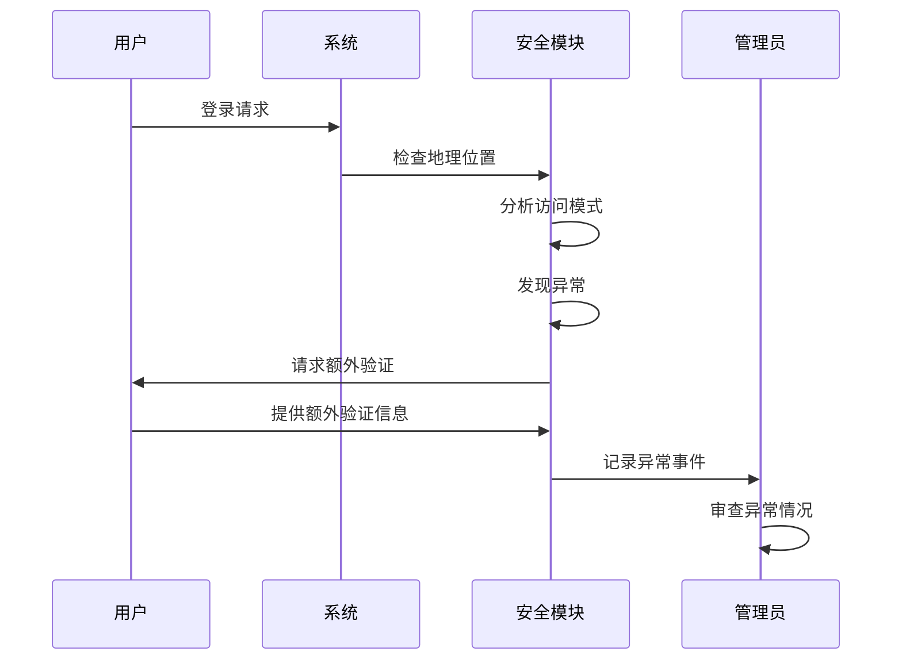

### 案例三：权限提升尝试

**场景描述**：
管理员尝试越权访问其他用户的敏感数据，系统检测并阻止。

**检测方法**：
1. 监控权限变更请求
2. 验证请求者的权限级别
3. 检查是否有适当的授权
4. 记录所有权限变更尝试

**防护措施**：
- 拒绝越权请求
- 记录尝试事件
- 发送告警通知
- 更新安全策略

## 性能考虑

### 查询优化策略

系统采用多种策略优化查询性能：

1. **索引优化**：在关键字段上建立适当索引
2. **分页查询**：对大量数据实施分页处理
3. **缓存机制**：缓存常用查询结果
4. **异步处理**：使用异步操作避免阻塞

### 存储优化

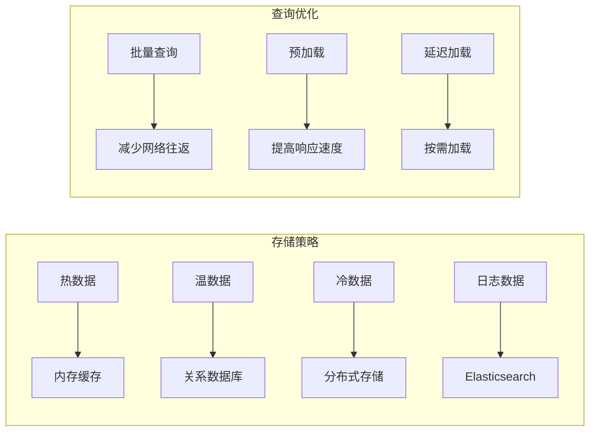

## 故障排除指南

### 常见问题及解决方案

**问题1：审计日志丢失**
- 检查数据库连接状态
- 验证存储权限设置
- 查看应用程序日志
- 确认磁盘空间充足

**问题2：告警通知失败**
- 检查通知服务配置
- 验证网络连接
- 确认接收方地址有效
- 查看通知服务状态

**问题3：性能下降**
- 分析慢查询日志
- 检查索引使用情况
- 优化查询语句
- 考虑数据归档策略

### 监控和维护

系统提供完善的监控功能：

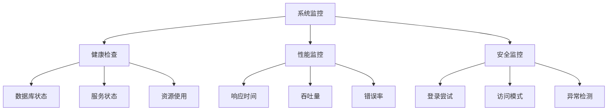

**章节来源**
- [SecurityLogAppService.cs](file://aspnet-core/modules/auditing/LINGYUN.Abp.Auditing.Application/LINGYUN/Abp/Auditing/SecurityLogs/SecurityLogAppService.cs#L1-L35)

## 结论

ABP Next Admin的安全审计与告警系统提供了全面的安全保障能力。通过多层次的审计机制、智能的行为检测算法、灵活的告警配置和强大的日志保护功能，系统能够有效识别和应对各种安全威胁。

系统的主要优势包括：

1. **全面覆盖**：涵盖所有关键安全事件
2. **实时响应**：快速检测和响应安全威胁
3. **灵活配置**：支持自定义告警规则和通知渠道
4. **高性能**：优化的存储和查询机制
5. **高可用性**：多存储后端支持和容错机制

通过持续的监控和优化，该系统能够为企业提供可靠的安全保障，确保业务系统的稳定运行和数据安全。