# 审计日志

<cite>
**本文档中引用的文件**  
- [AuditLog.cs](file://aspnet-core/framework/auditing/LINGYUN.Abp.AuditLogging/LINGYUN/Abp/AuditLogging/AuditLog.cs)
- [IAuditLogAppService.cs](file://aspnet-core/modules/auditing/LINGYUN.Abp.Auditing.Application.Contracts/LINGYUN/Abp/Auditing/AuditLogs/IAuditLogAppService.cs)
- [AuditLogDto.cs](file://aspnet-core/modules/auditing/LINGYUN.Abp.Auditing.Application.Contracts/LINGYUN/Abp/Auditing/AuditLogs/AuditLogDto.cs)
- [AuditLogGetByPagedDto.cs](file://aspnet-core/modules/auditing/LINGYUN.Abp.Auditing.Application.Contracts/LINGYUN/Abp/Auditing/AuditLogs/AuditLogGetByPagedDto.cs)
- [AuditLogAppService.cs](file://aspnet-core/modules/auditing/LINGYUN.Abp.Auditing.Application/LINGYUN/Abp/Auditing/AuditLogs/AuditLogAppService.cs)
- [IAuditLogManager.cs](file://aspnet-core/framework/auditing/LINGYUN.Abp.AuditLogging/LINGYUN/Abp/AuditLogging/IAuditLogManager.cs)
- [AuditingFeatureNames.cs](file://aspnet-core/modules/auditing/LINGYUN.Abp.Auditing.Application.Contracts/LINGYUN/Abp/Auditing/Features/AuditingFeatureNames.cs)
- [AuditingFeatureDefinitionProvider.cs](file://aspnet-core/modules/auditing/LINGYUN.Abp.Auditing.Application.Contracts/LINGYUN/Abp/Auditing/Features/AuditingFeatureDefinitionProvider.cs)
</cite>

## 目录
1. [简介](#简介)
2. [核心组件](#核心组件)
3. [日志记录机制](#日志记录机制)
4. [日志存储与查询](#日志存储与查询)
5. [日志导出与归档](#日志导出与归档)
6. [异常检测与安全审计](#异常检测与安全审计)
7. [日志可视化与告警](#日志可视化与告警)
8. [API接口文档](#api接口文档)
9. [使用示例](#使用示例)
10. [结论](#结论)

## 简介
本系统实现了完整的审计日志功能，用于记录用户操作日志和系统事件日志。审计日志模块提供了日志级别控制、日志格式定义、敏感信息处理等机制，支持多种存储后端（包括数据库和Elasticsearch），并提供丰富的查询、导出、可视化和告警功能。

**审计日志模块的主要特性包括：**
- 用户操作日志记录
- 系统事件日志记录
- 可配置的日志级别和格式
- 敏感信息脱敏策略
- 多种存储和查询支持
- 异常检测和安全审计功能
- 数据可视化和告警机制

## 核心组件

审计日志模块由多个核心组件构成，包括日志实体、应用服务、管理器接口和功能特性定义。

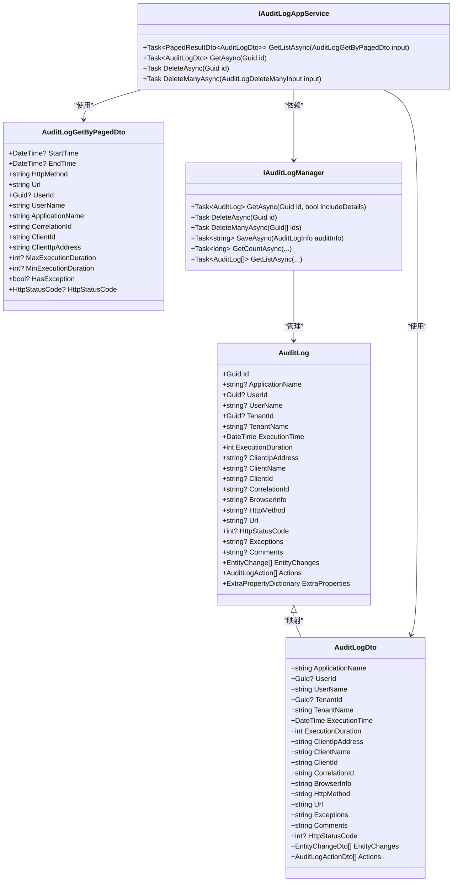

**图表来源**  
- [AuditLog.cs](file://aspnet-core/framework/auditing/LINGYUN.Abp.AuditLogging/LINGYUN/Abp/AuditLogging/AuditLog.cs)
- [AuditLogDto.cs](file://aspnet-core/modules/auditing/LINGYUN.Abp.Auditing.Application.Contracts/LINGYUN/Abp/Auditing/AuditLogs/AuditLogDto.cs)
- [AuditLogGetByPagedDto.cs](file://aspnet-core/modules/auditing/LINGYUN.Abp.Auditing.Application.Contracts/LINGYUN/Abp/Auditing/AuditLogs/AuditLogGetByPagedDto.cs)
- [IAuditLogAppService.cs](file://aspnet-core/modules/auditing/LINGYUN.Abp.Auditing.Application.Contracts/LINGYUN/Abp/Auditing/AuditLogs/IAuditLogAppService.cs)
- [IAuditLogManager.cs](file://aspnet-core/framework/auditing/LINGYUN.Abp.AuditLogging/LINGYUN/Abp/AuditLogging/IAuditLogManager.cs)

**章节来源**  
- [AuditLog.cs](file://aspnet-core/framework/auditing/LINGYUN.Abp.AuditLogging/LINGYUN/Abp/AuditLogging/AuditLog.cs)
- [AuditLogDto.cs](file://aspnet-core/modules/auditing/LINGYUN.Abp.Auditing.Application.Contracts/LINGYUN/Abp/Auditing/AuditLogs/AuditLogDto.cs)
- [AuditLogGetByPagedDto.cs](file://aspnet-core/modules/auditing/LINGYUN.Abp.Auditing.Application.Contracts/LINGYUN/Abp/Auditing/AuditLogs/AuditLogGetByPagedDto.cs)
- [IAuditLogAppService.cs](file://aspnet-core/modules/auditing/LINGYUN.Abp.Auditing.Application.Contracts/LINGYUN/Abp/Auditing/AuditLogs/IAuditLogAppService.cs)
- [IAuditLogManager.cs](file://aspnet-core/framework/auditing/LINGYUN.Abp.AuditLogging/LINGYUN/Abp/AuditLogging/IAuditLogManager.cs)

## 日志记录机制

### 用户操作日志记录
系统自动记录所有用户的关键操作，包括登录、登出、数据修改等操作。每个操作日志包含完整的上下文信息。

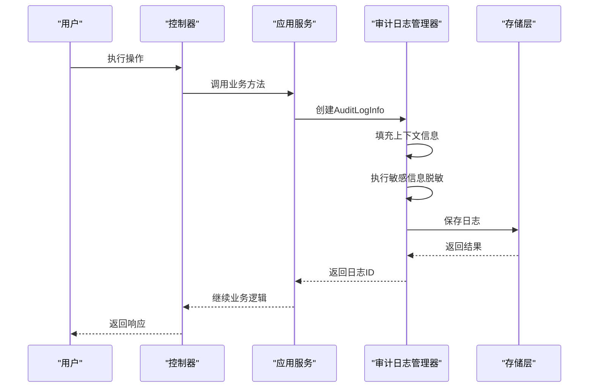

**图表来源**  
- [IAuditLogManager.cs](file://aspnet-core/framework/auditing/LINGYUN.Abp.AuditLogging/LINGYUN/Abp/AuditLogging/IAuditLogManager.cs)

### 系统事件日志记录
系统事件日志记录系统级别的事件，如服务启动、停止、配置变更等。

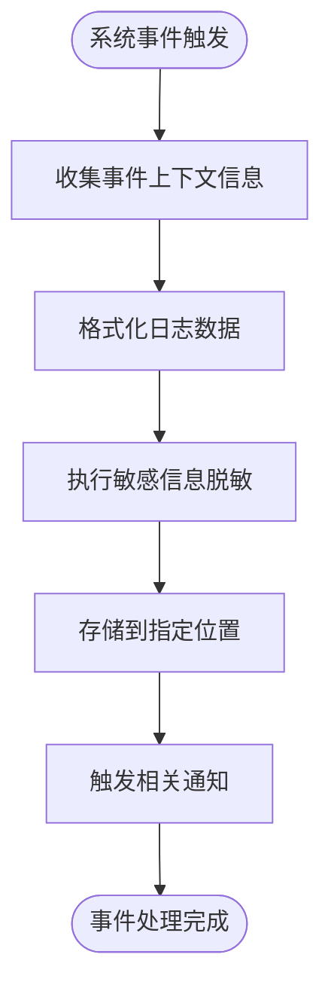

### 日志级别与格式
系统支持多种日志级别，并定义了统一的日志格式。

| 日志级别 | 描述 | 使用场景 |
|---------|------|---------|
| 信息 | 常规操作记录 | 用户登录、数据查询 |
| 警告 | 潜在问题 | 权限不足、性能警告 |
| 错误 | 操作失败 | 系统错误、业务异常 |
| 严重 | 重大故障 | 系统崩溃、数据丢失 |

**章节来源**  
- [AuditingFeatureNames.cs](file://aspnet-core/modules/auditing/LINGYUN.Abp.Auditing.Application.Contracts/LINGYUN/Abp/Auditing/Features/AuditingFeatureNames.cs)
- [AuditingFeatureDefinitionProvider.cs](file://aspnet-core/modules/auditing/LINGYUN.Abp.Auditing.Application.Contracts/LINGYUN/Abp/Auditing/Features/AuditingFeatureDefinitionProvider.cs)

### 敏感信息脱敏策略
系统实现了敏感信息脱敏机制，保护用户隐私和系统安全。

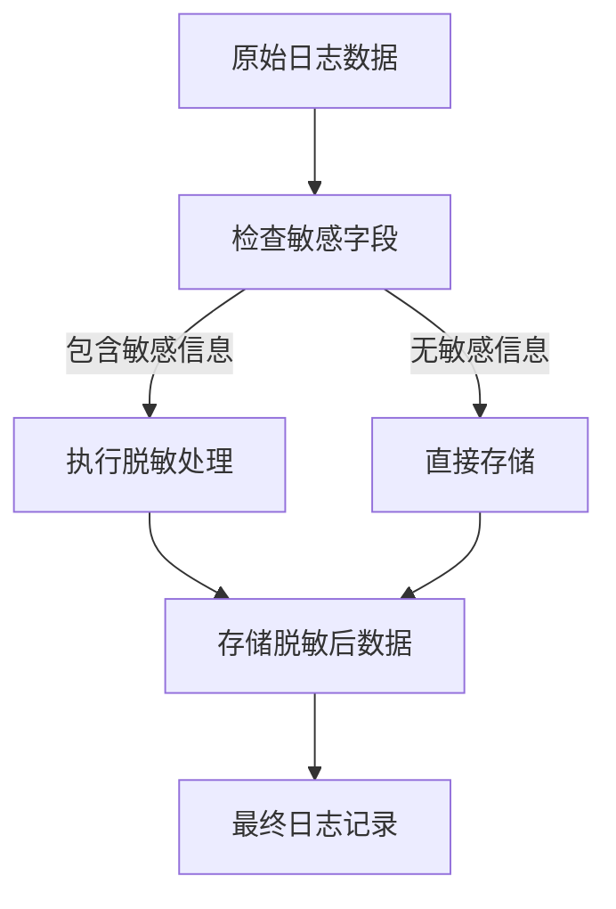

## 日志存储与查询

### 存储架构
系统支持多种存储后端，包括关系型数据库和Elasticsearch。

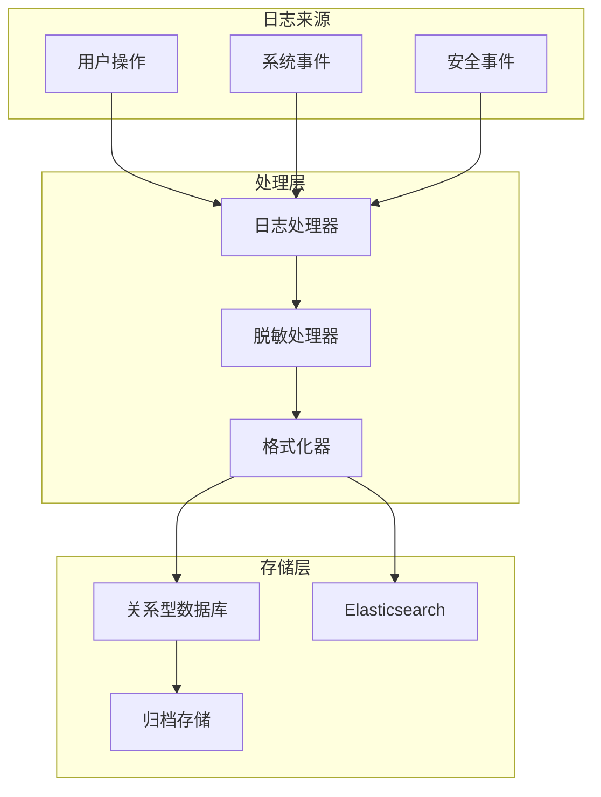

**图表来源**  
- [IAuditLogManager.cs](file://aspnet-core/framework/auditing/LINGYUN.Abp.AuditLogging/LINGYUN/Abp/AuditLogging/IAuditLogManager.cs)
- [AuditLog.cs](file://aspnet-core/framework/auditing/LINGYUN.Abp.AuditLogging/LINGYUN/Abp/AuditLogging/AuditLog.cs)

### 查询功能
系统提供强大的日志查询功能，支持多维度过滤和分页。

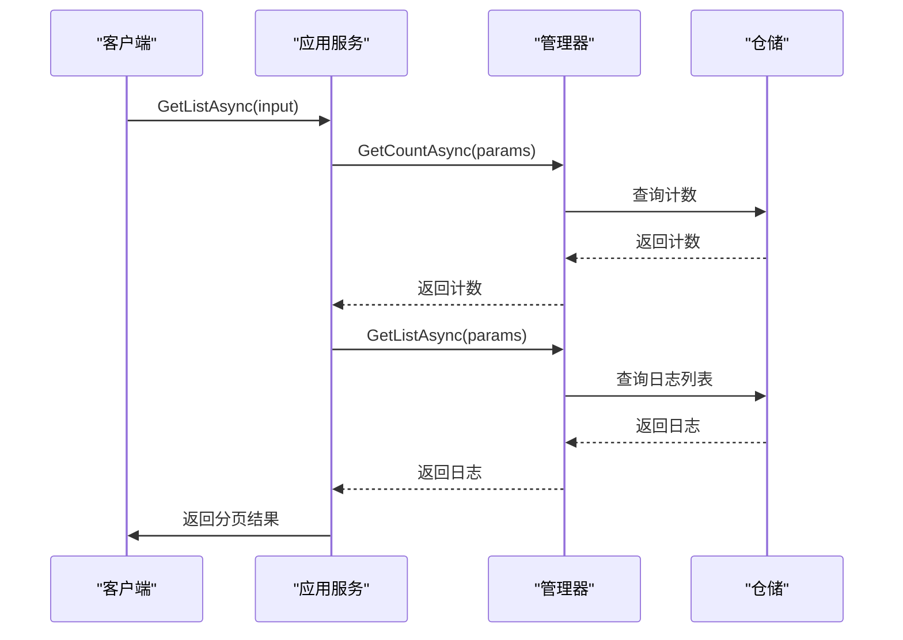

**图表来源**  
- [IAuditLogAppService.cs](file://aspnet-core/modules/auditing/LINGYUN.Abp.Auditing.Application.Contracts/LINGYUN/Abp/Auditing/AuditLogs/IAuditLogAppService.cs)
- [AuditLogAppService.cs](file://aspnet-core/modules/auditing/LINGYUN.Abp.Auditing.Application/LINGYUN/Abp/Auditing/AuditLogs/AuditLogAppService.cs)
- [IAuditLogManager.cs](file://aspnet-core/framework/auditing/LINGYUN.Abp.AuditLogging/LINGYUN/Abp/AuditLogging/IAuditLogManager.cs)

## 日志导出与归档

### 导出功能
系统支持将审计日志导出为多种格式，便于离线分析和审计。

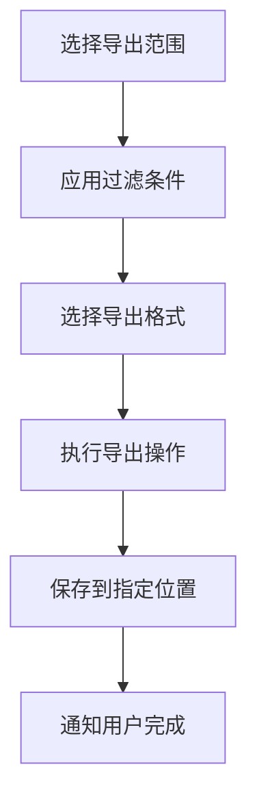

### 归档策略
系统实现了自动归档机制，确保日志数据的长期保存和高效管理。

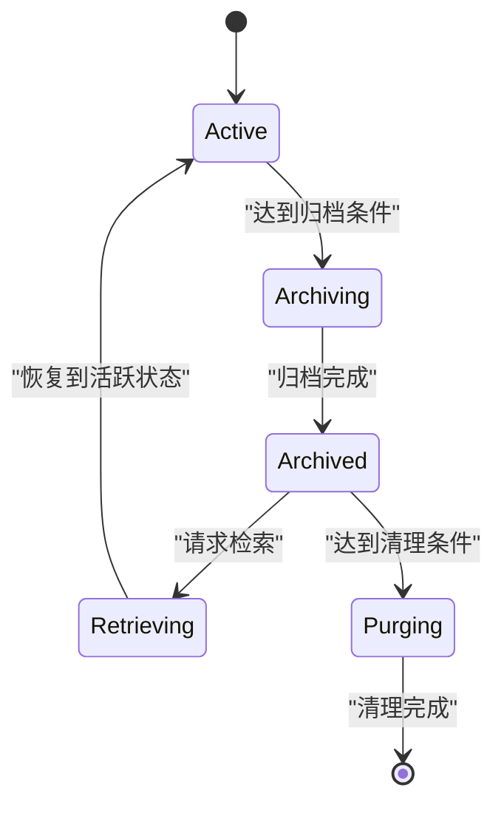

## 异常检测与安全审计

### 异常检测机制
系统通过分析日志模式来检测潜在的异常行为。

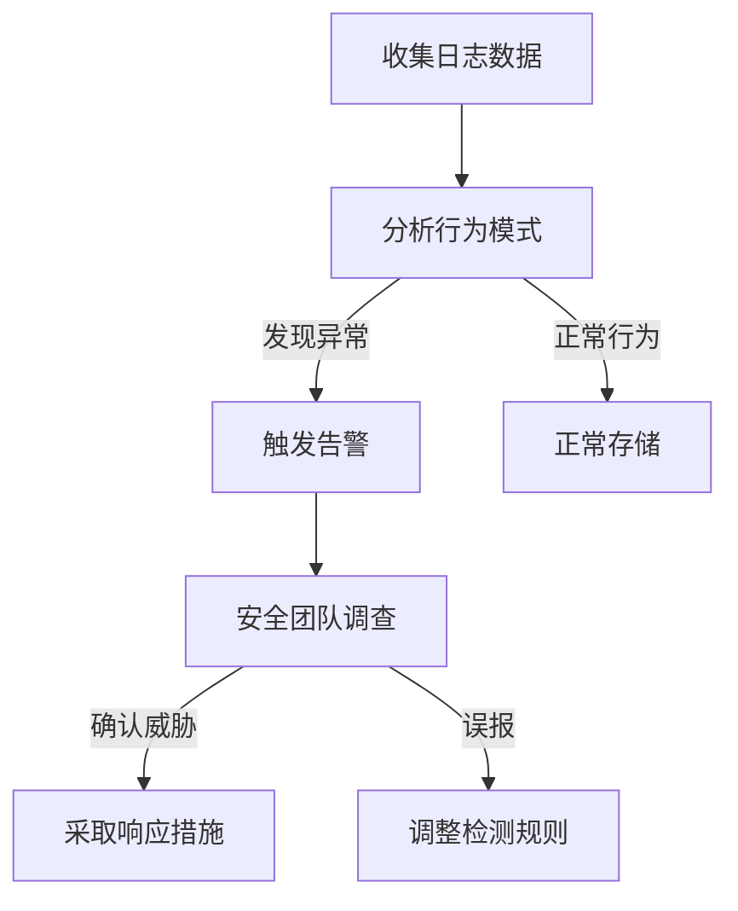

### 安全审计功能
提供全面的安全审计功能，支持合规性检查和安全分析。

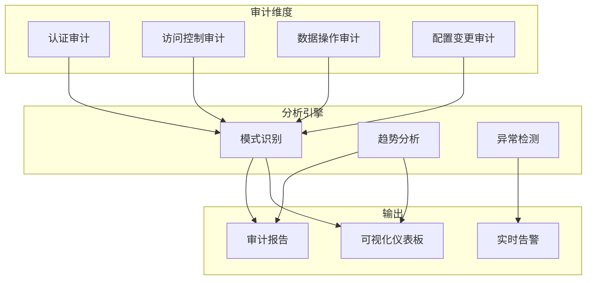

## 日志可视化与告警

### 可视化展示
系统提供丰富的日志数据可视化方式。

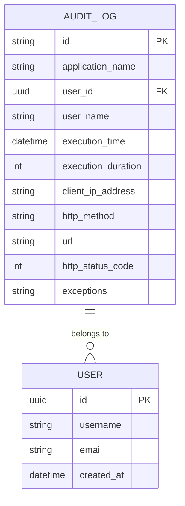

### 告警机制
实现灵活的告警机制，及时发现和响应安全事件。

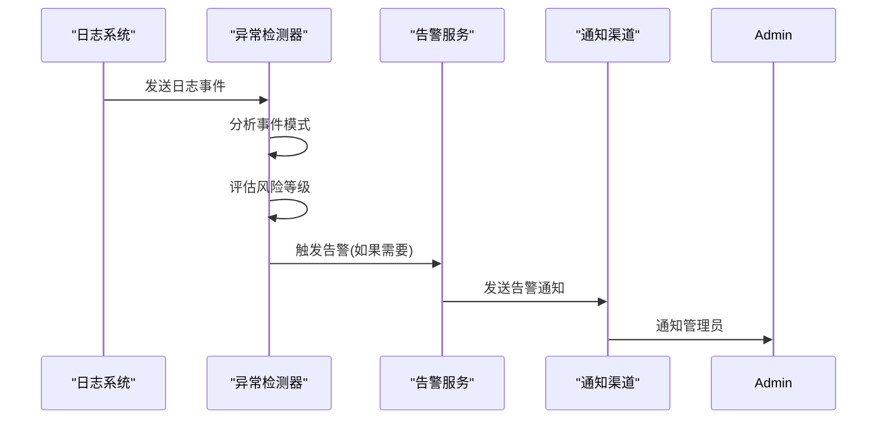

## API接口文档

### 审计日志API
提供RESTful API接口用于审计日志的管理和查询。

| 端点 | 方法 | 描述 | 认证要求 |
|------|------|------|----------|
| /api/audit-logs | GET | 获取审计日志列表 | 需要权限 |
| /api/audit-logs/{id} | GET | 获取单个审计日志 | 需要权限 |
| /api/audit-logs/{id} | DELETE | 删除审计日志 | 需要删除权限 |
| /api/