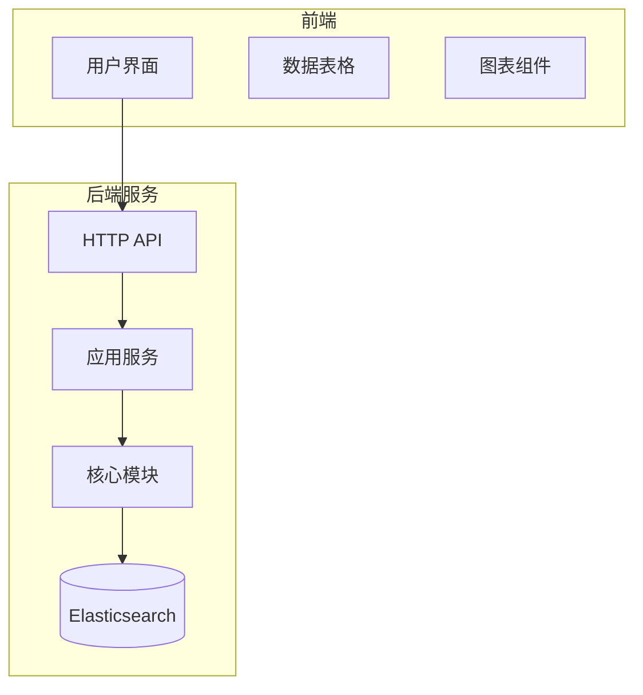
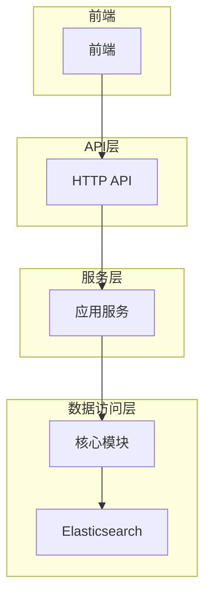
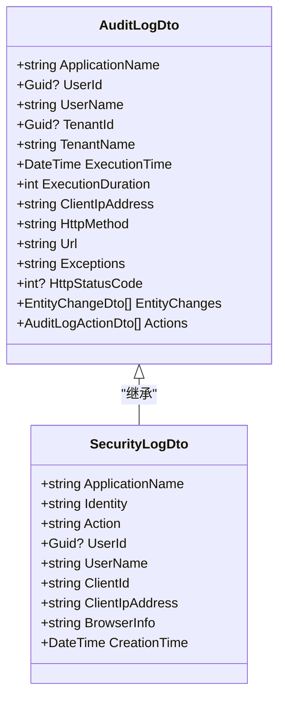
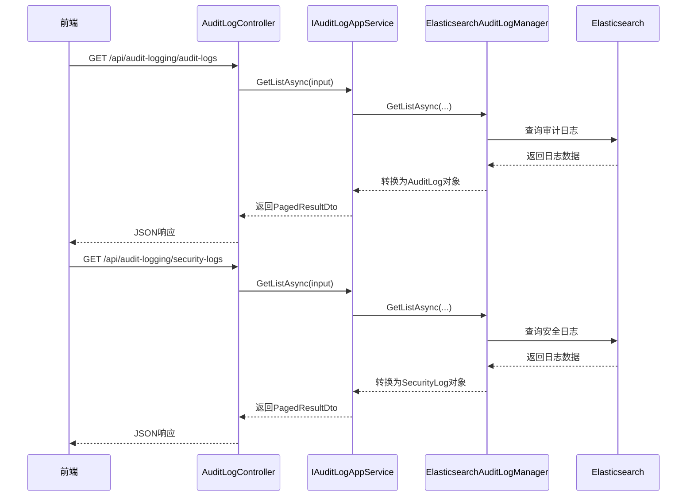
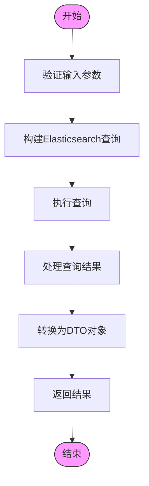
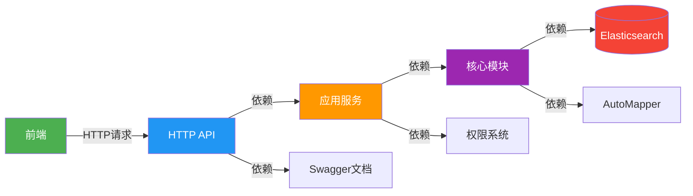

# 日志可视化分析

<cite>
**本文档引用的文件**
- [AuditLogDto.cs](file://aspnet-core/modules/auditing/LINGYUN.Abp.Auditing.Application.Contracts/LINGYUN/Abp/Auditing/AuditLogs/AuditLogDto.cs)
- [SecurityLogDto.cs](file://aspnet-core/modules/auditing/LINGYUN.Abp.Auditing.Application.Contracts/LINGYUN/Abp/Auditing/SecurityLogs/SecurityLogDto.cs)
- [AuditLogController.cs](file://aspnet-core/modules/auditing/LINGYUN.Abp.Auditing.HttpApi/LINGYUN/Abp/Auditing/AuditLogs/AuditLogController.cs)
- [SecurityLogController.cs](file://aspnet-core/modules/auditing/LINGYUN.Abp.Auditing.HttpApi/LINGYUN/Abp/Auditing/SecurityLogs/SecurityLogController.cs)
- [ElasticsearchAuditLogManager.cs](file://aspnet-core/framework/auditing/LINGYUN.Abp.AuditLogging.Elasticsearch/LINGYUN/Abp/AuditLogging/Elasticsearch/ElasticsearchAuditLogManager.cs)
- [Index.js](file://aspnet-core/modules/account/LINGYUN.Abp.Account.Web/Pages/Account/Components/ProfileManagementGroup/SecurityLog/Index.js)
- [AbpAuditLogging.Elasticsearch](file://aspnet-core/framework/auditing/LINGYUN.Abp.AuditLogging.Elasticsearch)
- [AbpAuditing.Application.Contracts](file://aspnet-core/modules/auditing/LINGYUN.Abp.Auditing.Application.Contracts)
</cite>

## 目录
1. [简介](#简介)
2. [项目结构](#项目结构)
3. [核心组件](#核心组件)
4. [架构概述](#架构概述)
5. [详细组件分析](#详细组件分析)
6. [依赖分析](#依赖分析)
7. [性能考虑](#性能考虑)
8. [故障排除指南](#故障排除指南)
9. [结论](#结论)

## 简介
本系统提供全面的审计日志可视化分析功能，通过集成Elasticsearch实现高性能的日志存储与查询。系统支持操作统计图表、用户行为热力图和系统性能趋势图等多种可视化展示方式。前端通过API接口动态获取日志分析数据，并将用户操作、系统事件和异常日志进行关联展示，帮助管理员全面了解系统运行状况。

## 项目结构
该审计日志系统采用模块化设计，分为核心框架层和应用服务层。核心框架包含审计日志的基础功能和Elasticsearch集成，应用服务层提供HTTP API接口供前端调用。

**图表来源**
- [AbpAuditLogging.Elasticsearch](file://aspnet-core/framework/auditing/LINGYUN.Abp.AuditLogging.Elasticsearch)
- [AbpAuditing.Application.Contracts](file://aspnet-core/modules/auditing/LINGYUN.Abp.Auditing.Application.Contracts)

**章节来源**
- [AbpAuditLogging.Elasticsearch](file://aspnet-core/framework/auditing/LINGYUN.Abp.AuditLogging.Elasticsearch)
- [AbpAuditing.Application.Contracts](file://aspnet-core/modules/auditing/LINGYUN.Abp.Auditing.Application.Contracts)

## 核心组件
系统的核心组件包括审计日志DTO、安全日志DTO、API控制器和Elasticsearch管理器。这些组件共同实现了日志数据的定义、传输、存储和查询功能。

**章节来源**
- [AuditLogDto.cs](file://aspnet-core/modules/auditing/LINGYUN.Abp.Auditing.Application.Contracts/LINGYUN/Abp/Auditing/AuditLogs/AuditLogDto.cs)
- [SecurityLogDto.cs](file://aspnet-core/modules/auditing/LINGYUN.Abp.Auditing.Application.Contracts/LINGYUN/Abp/Auditing/SecurityLogs/SecurityLogDto.cs)

## 架构概述
系统采用分层架构设计，从前端到后端各层职责分明。前端负责数据可视化展示，后端提供RESTful API接口，中间层处理业务逻辑，底层使用Elasticsearch进行高效的数据存储和检索。

**图表来源**
- [AuditLogController.cs](file://aspnet-core/modules/auditing/LINGYUN.Abp.Auditing.HttpApi/LINGYUN/Abp/Auditing/AuditLogs/AuditLogController.cs)
- [SecurityLogController.cs](file://aspnet-core/modules/auditing/LINGYUN.Abp.Auditing.HttpApi/LINGYUN/Abp/Auditing/SecurityLogs/SecurityLogController.cs)

## 详细组件分析
### 审计日志组件分析
审计日志组件提供了完整的日志记录和查询功能，支持多种过滤条件和分页查询。

#### 数据传输对象

**图表来源**
- [AuditLogDto.cs](file://aspnet-core/modules/auditing/LINGYUN.Abp.Auditing.Application.Contracts/LINGYUN/Abp/Auditing/AuditLogs/AuditLogDto.cs)
- [SecurityLogDto.cs](file://aspnet-core/modules/auditing/LINGYUN.Abp.Auditing.Application.Contracts/LINGYUN/Abp/Auditing/SecurityLogs/SecurityLogDto.cs)

#### API请求流程

**图表来源**
- [AuditLogController.cs](file://aspnet-core/modules/auditing/LINGYUN.Abp.Auditing.HttpApi/LINGYUN/Abp/Auditing/AuditLogs/AuditLogController.cs)
- [SecurityLogController.cs](file://aspnet-core/modules/auditing/LINGYUN.Abp.Auditing.HttpApi/LINGYUN/Abp/Auditing/SecurityLogs/SecurityLogController.cs)

#### 数据查询流程

**图表来源**
- [ElasticsearchAuditLogManager.cs](file://aspnet-core/framework/auditing/LINGYUN.Abp.AuditLogging.Elasticsearch/LINGYUN/Abp/AuditLogging/Elasticsearch/ElasticsearchAuditLogManager.cs)

**章节来源**
- [AuditLogDto.cs](file://aspnet-core/modules/auditing/LINGYUN.Abp.Auditing.Application.Contracts/LINGYUN/Abp/Auditing/AuditLogs/AuditLogDto.cs)
- [SecurityLogDto.cs](file://aspnet-core/modules/auditing/LINGYUN.Abp.Auditing.Application.Contracts/LINGYUN/Abp/Auditing/SecurityLogs/SecurityLogDto.cs)
- [AuditLogController.cs](file://aspnet-core/modules/auditing/LINGYUN.Abp.Auditing.HttpApi/LINGYUN/Abp/Auditing/AuditLogs/AuditLogController.cs)
- [SecurityLogController.cs](file://aspnet-core/modules/auditing/LINGYUN.Abp.Auditing.HttpApi/LINGYUN/Abp/Auditing/SecurityLogs/SecurityLogController.cs)

## 依赖分析
系统依赖于多个核心组件和服务，形成了完整的日志可视化分析链路。

**图表来源**
- [AbpAuditLogging.Elasticsearch](file://aspnet-core/framework/auditing/LINGYUN.Abp.AuditLogging.Elasticsearch)
- [AbpAuditing.Application.Contracts](file://aspnet-core/modules/auditing/LINGYUN.Abp.Auditing.Application.Contracts)

**章节来源**
- [AbpAuditLogging.Elasticsearch](file://aspnet-core/framework/auditing/LINGYUN.Abp.AuditLogging.Elasticsearch)
- [AbpAuditing.Application.Contracts](file://aspnet-core/modules/auditing/LINGYUN.Abp.Auditing.Application.Contracts)

## 性能考虑
系统在设计时充分考虑了性能因素，特别是在处理大量日志数据时的表现。通过Elasticsearch的分布式搜索能力，系统能够快速响应复杂的查询请求。建议定期对Elasticsearch索引进行优化，并根据实际使用情况调整分片和副本数量。

## 故障排除指南
当遇到日志查询缓慢或无法显示的问题时，请检查以下方面：
1. 确认Elasticsearch服务是否正常运行
2. 检查网络连接是否稳定
3. 验证API密钥和权限配置
4. 查看系统日志是否有错误信息
5. 确认查询参数是否正确

**章节来源**
- [ElasticsearchAuditLogManager.cs](file://aspnet-core/framework/auditing/LINGYUN.Abp.AuditLogging.Elasticsearch/LINGYUN/Abp/AuditLogging/Elasticsearch/ElasticsearchAuditLogManager.cs)
- [Index.js](file://aspnet-core/modules/account/LINGYUN.Abp.Account.Web/Pages/Account/Components/ProfileManagementGroup/SecurityLog/Index.js)

## 结论
本系统提供了一套完整的审计日志可视化解决方案，通过前后端分离架构和Elasticsearch集成，实现了高效、灵活的日志分析功能。系统支持多种可视化展示方式，能够满足不同场景下的监控需求。