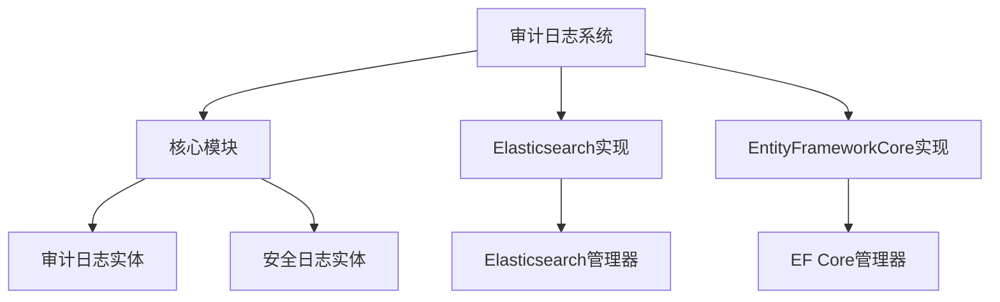
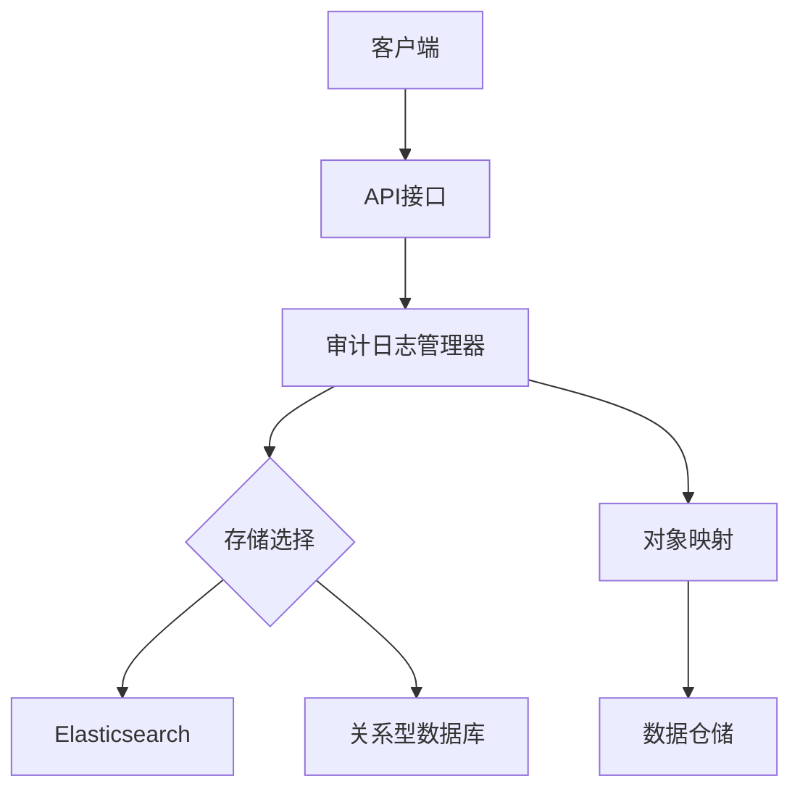
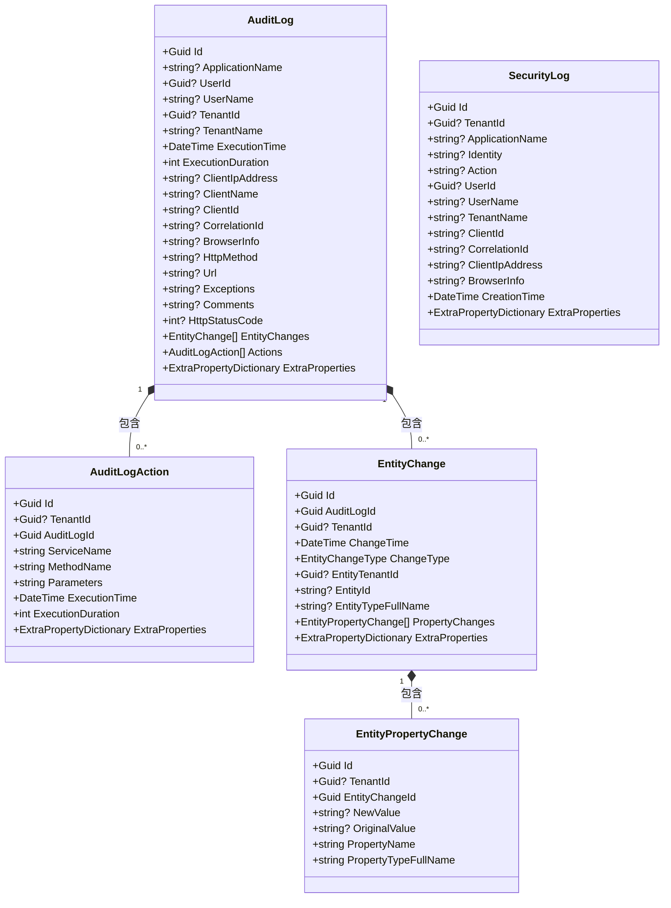
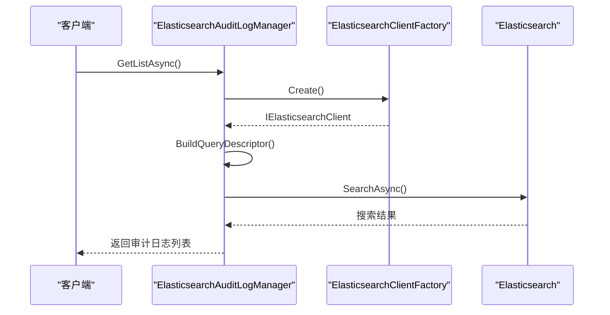
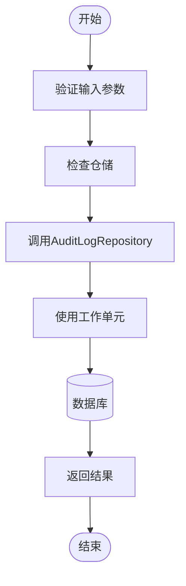
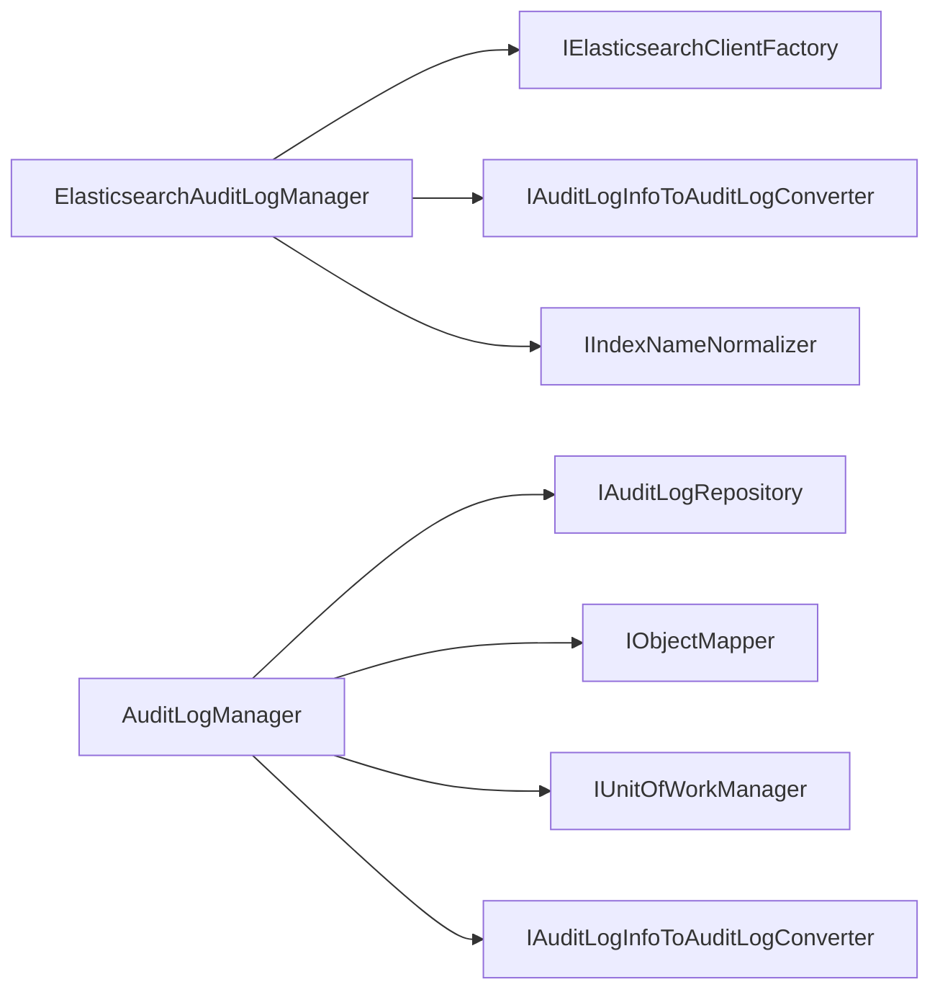

# 日志存储与查询

<cite>
**本文档引用的文件**
- [AuditLog.cs](file://aspnet-core/framework/auditing/LINGYUN.Abp.AuditLogging/LINGYUN/Abp/AuditLogging/AuditLog.cs)
- [AuditLogAction.cs](file://aspnet-core/framework/auditing/LINGYUN.Abp.AuditLogging/LINGYUN/Abp/AuditLogging/AuditLogAction.cs)
- [EntityChange.cs](file://aspnet-core/framework/auditing/LINGYUN.Abp.AuditLogging/LINGYUN/Abp/AuditLogging/EntityChange.cs)
- [EntityPropertyChange.cs](file://aspnet-core/framework/auditing/LINGYUN.Abp.AuditLogging/LINGYUN/Abp/AuditLogging/EntityPropertyChange.cs)
- [SecurityLog.cs](file://aspnet-core/framework/auditing/LINGYUN.Abp.AuditLogging/LINGYUN/Abp/AuditLogging/SecurityLog.cs)
- [ElasticsearchAuditLogManager.cs](file://aspnet-core/framework/auditing/LINGYUN.Abp.AuditLogging.Elasticsearch/LINGYUN/Abp/AuditLogging/Elasticsearch/ElasticsearchAuditLogManager.cs)
- [AbpAuditLoggingElasticsearchOptions.cs](file://aspnet-core/framework/auditing/LINGYUN.Abp.AuditLogging.Elasticsearch/LINGYUN/Abp/AuditLogging/Elasticsearch/AbpAuditLoggingElasticsearchOptions.cs)
- [AuditLogManager.cs](file://aspnet-core/framework/auditing/LINGYUN.Abp.AuditLogging.EntityFrameworkCore/LINGYUN/Abp/AuditLogging/EntityFrameworkCore/AuditLogManager.cs)
- [README.md](file://aspnet-core/framework/auditing/LINGYUN.Abp.AuditLogging/README.md)
- [LINGYUN.Abp.AuditLogging.Elasticsearch\README.md](file://aspnet-core/framework/auditing/LINGYUN.Abp.AuditLogging.Elasticsearch/README.md)
- [LINGYUN.Abp.AuditLogging.EntityFrameworkCore\README.md](file://aspnet-core/framework/auditing/LINGYUN.Abp.AuditLogging.EntityFrameworkCore/README.md)
</cite>

## 目录
1. [简介](#简介)
2. [项目结构](#项目结构)
3. [核心组件](#核心组件)
4. [架构概述](#架构概述)
5. [详细组件分析](#详细组件分析)
6. [依赖关系分析](#依赖关系分析)
7. [性能考虑](#性能考虑)
8. [故障排除指南](#故障排除指南)
9. [结论](#结论)

## 简介
本项目实现了审计日志的存储与查询功能，支持将日志数据存储在关系型数据库（如SQL Server、MySQL）和Elasticsearch中。系统提供了灵活的多数据库支持机制，允许根据性能需求选择合适的存储方案。通过LINQ和Elasticsearch查询语言实现高效的日志检索，并支持将日志导出为CSV、Excel等格式。

## 项目结构
该项目采用模块化设计，主要包含审计日志的核心模块、Elasticsearch实现模块和Entity Framework Core实现模块。每个模块都有明确的职责划分，便于维护和扩展。

**图示来源**
- [AuditLog.cs](file://aspnet-core/framework/auditing/LINGYUN.Abp.AuditLogging/LINGYUN/Abp/AuditLogging/AuditLog.cs)
- [ElasticsearchAuditLogManager.cs](file://aspnet-core/framework/auditing/LINGYUN.Abp.AuditLogging.Elasticsearch/LINGYUN/Abp/AuditLogging/Elasticsearch/ElasticsearchAuditLogManager.cs)
- [AuditLogManager.cs](file://aspnet-core/framework/auditing/LINGYUN.Abp.AuditLogging.EntityFrameworkCore/LINGYUN/Abp/AuditLogging/EntityFrameworkCore/AuditLogManager.cs)

**章节来源**
- [README.md](file://aspnet-core/framework/auditing/LINGYUN.Abp.AuditLogging/README.md)

## 核心组件

审计日志系统的核心组件包括审计日志实体、操作记录实体、实体变更记录实体以及属性变更记录实体。这些实体共同构成了完整的审计日志数据模型。

**章节来源**
- [AuditLog.cs](file://aspnet-core/framework/auditing/LINGYUN.Abp.AuditLogging/LINGYUN/Abp/AuditLogging/AuditLog.cs)
- [AuditLogAction.cs](file://aspnet-core/framework/auditing/LINGYUN.Abp.AuditLogging/LINGYUN/Abp/AuditLogging/AuditLogAction.cs)
- [EntityChange.cs](file://aspnet-core/framework/auditing/LINGYUN.Abp.AuditLogging/LINGYUN/Abp/AuditLogging/EntityChange.cs)
- [EntityPropertyChange.cs](file://aspnet-core/framework/auditing/LINGYUN.Abp.AuditLogging/LINGYUN/Abp/AuditLogging/EntityPropertyChange.cs)

## 架构概述

该系统的架构设计采用了分层模式，主要包括数据访问层、业务逻辑层和接口层。通过依赖注入机制实现了各层之间的松耦合。

**图示来源**
- [ElasticsearchAuditLogManager.cs](file://aspnet-core/framework/auditing/LINGYUN.Abp.AuditLogging.Elasticsearch/LINGYUN/Abp/AuditLogging/Elasticsearch/ElasticsearchAuditLogManager.cs)
- [AuditLogManager.cs](file://aspnet-core/framework/auditing/LINGYUN.Abp.AuditLogging.EntityFrameworkCore/LINGYUN/Abp/AuditLogging/EntityFrameworkCore/AuditLogManager.cs)

## 详细组件分析

### 审计日志实体分析
审计日志实体是整个系统的基础，包含了所有必要的审计信息字段。

#### 类图

**图示来源**
- [AuditLog.cs](file://aspnet-core/framework/auditing/LINGYUN.Abp.AuditLogging/LINGYUN/Abp/AuditLogging/AuditLog.cs)
- [AuditLogAction.cs](file://aspnet-core/framework/auditing/LINGYUN.Abp.AuditLogging/LINGYUN/Abp/AuditLogging/AuditLogAction.cs)
- [EntityChange.cs](file://aspnet-core/framework/auditing/LINGYUN.Abp.AuditLogging/LINGYUN/Abp/AuditLogging/EntityChange.cs)
- [EntityPropertyChange.cs](file://aspnet-core/framework/auditing/LINGYUN.Abp.AuditLogging/LINGYUN/Abp/AuditLogging/EntityPropertyChange.cs)
- [SecurityLog.cs](file://aspnet-core/framework/auditing/LINGYUN.Abp.AuditLogging/LINGYUN/Abp/AuditLogging/SecurityLog.cs)

**章节来源**
- [AuditLog.cs](file://aspnet-core/framework/auditing/LINGYUN.Abp.AuditLogging/LINGYUN/Abp/AuditLogging/AuditLog.cs)

### Elasticsearch实现分析
Elasticsearch实现提供了高性能的日志存储和查询能力。

#### 查询流程序列图

**图示来源**
- [ElasticsearchAuditLogManager.cs](file://aspnet-core/framework/auditing/LINGYUN.Abp.AuditLogging.Elasticsearch/LINGYUN/Abp/AuditLogging/Elasticsearch/ElasticsearchAuditLogManager.cs)

**章节来源**
- [ElasticsearchAuditLogManager.cs](file://aspnet-core/framework/auditing/LINGYUN.Abp.AuditLogging.Elasticsearch/LINGYUN/Abp/AuditLogging/Elasticsearch/ElasticsearchAuditLogManager.cs)

### 关系型数据库实现分析
关系型数据库实现基于Entity Framework Core，提供了事务安全的数据存储。

#### 数据访问流程

**图示来源**
- [AuditLogManager.cs](file://aspnet-core/framework/auditing/LINGYUN.Abp.AuditLogging.EntityFrameworkCore/LINGYUN/Abp/AuditLogging/EntityFrameworkCore/AuditLogManager.cs)

**章节来源**
- [AuditLogManager.cs](file://aspnet-core/framework/auditing/LINGYUN.Abp.AuditLogging.EntityFrameworkCore/LINGYUN/Abp/AuditLogging/EntityFrameworkCore/AuditLogManager.cs)

## 依赖关系分析

系统各组件之间的依赖关系清晰，通过接口抽象实现了良好的解耦。

**图示来源**
- [ElasticsearchAuditLogManager.cs](file://aspnet-core/framework/auditing/LINGYUN.Abp.AuditLogging.Elasticsearch/LINGYUN/Abp/AuditLogging/Elasticsearch/ElasticsearchAuditLogManager.cs)
- [AuditLogManager.cs](file://aspnet-core/framework/auditing/LINGYUN.Abp.AuditLogging.EntityFrameworkCore/LINGYUN/Abp/AuditLogging/EntityFrameworkCore/AuditLogManager.cs)

**章节来源**
- [ElasticsearchAuditLogManager.cs](file://aspnet-core/framework/auditing/LINGYUN.Abp.AuditLogging.Elasticsearch/LINGYUN/Abp/AuditLogging/Elasticsearch/ElasticsearchAuditLogManager.cs)
- [AuditLogManager.cs](file://aspnet-core/framework/auditing/LINGYUN.Abp.AuditLogging.EntityFrameworkCore/LINGYUN/Abp/AuditLogging/EntityFrameworkCore/AuditLogManager.cs)

## 性能考虑

系统在设计时充分考虑了性能因素，针对不同的存储后端采用了优化策略：

1. **Elasticsearch存储**：使用Bulk操作批量写入日志，提高写入性能
2. **关系型数据库存储**：使用工作单元模式确保事务完整性
3. **查询优化**：对常用查询字段建立索引，支持分页和排序
4. **缓存机制**：可配置的缓存策略减少重复查询

对于大规模日志数据，建议使用Elasticsearch作为主要存储，以获得更好的查询性能。对于需要强一致性和事务支持的场景，可以选择关系型数据库。

## 故障排除指南

常见问题及解决方案：

1. **日志无法保存**：检查数据库连接字符串或Elasticsearch连接配置
2. **查询性能低下**：确认相关字段已建立适当索引
3. **数据不一致**：检查工作单元的使用是否正确
4. **内存溢出**：调整批量处理的大小限制

**章节来源**
- [ElasticsearchAuditLogManager.cs](file://aspnet-core/framework/auditing/LINGYUN.Abp.AuditLogging.Elasticsearch/LINGYUN/Abp/AuditLogging/Elasticsearch/ElasticsearchAuditLogManager.cs)
- [AuditLogManager.cs](file://aspnet-core/framework/auditing/LINGYUN.Abp.AuditLogging.EntityFrameworkCore/LINGYUN/Abp/AuditLogging/EntityFrameworkCore/AuditLogManager.cs)

## 结论

该审计日志系统提供了灵活的多数据库支持，能够满足不同场景下的性能需求。通过合理的架构设计和组件划分，系统具有良好的可维护性和扩展性。开发者可以根据具体需求选择合适的存储方案，并利用提供的API接口实现高效的日志查询和管理功能。