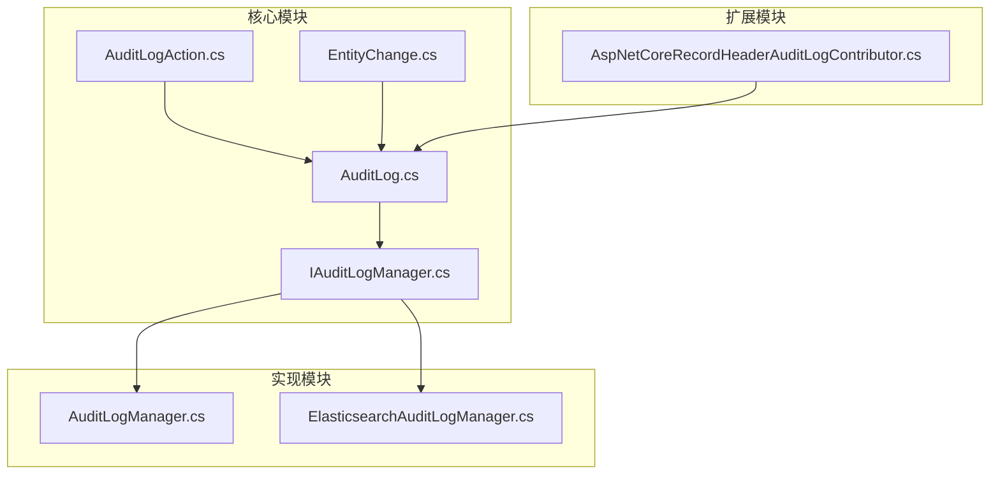
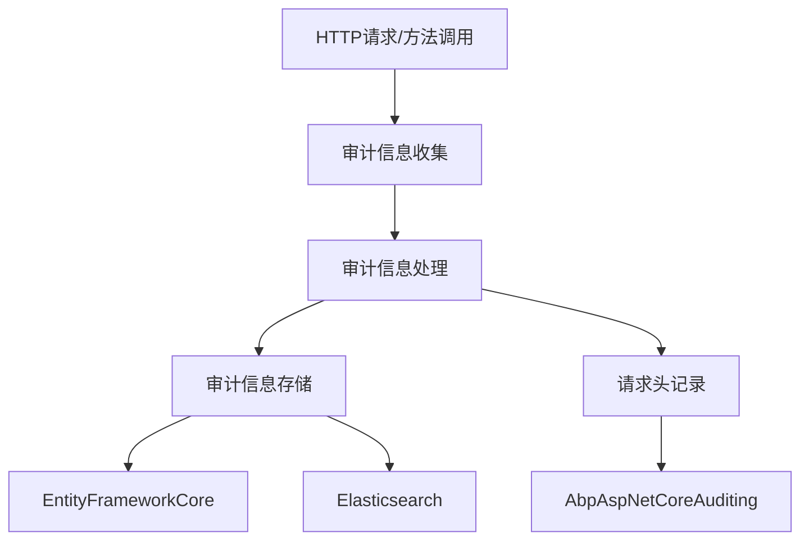
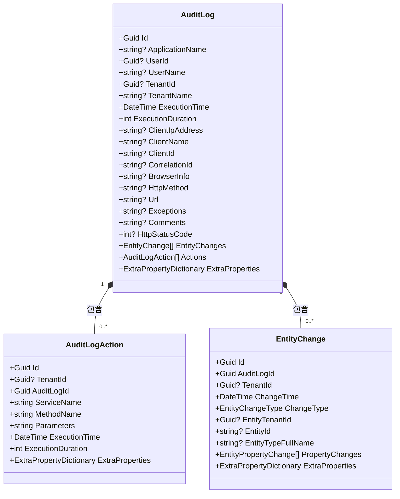
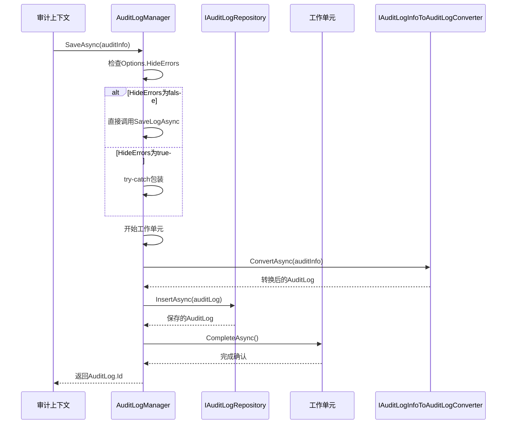

# 日志记录机制

<cite>
**本文档中引用的文件**  
- [AuditLog.cs](file://aspnet-core/framework/auditing/LINGYUN.Abp.AuditLogging/LINGYUN/Abp/AuditLogging/AuditLog.cs)
- [AuditLogAction.cs](file://aspnet-core/framework/auditing/LINGYUN.Abp.AuditLogging/LINGYUN/Abp/AuditLogging/AuditLogAction.cs)
- [EntityChange.cs](file://aspnet-core/framework/auditing/LINGYUN.Abp.AuditLogging/LINGYUN/Abp/AuditLogging/EntityChange.cs)
- [DefaultAuditLogManager.cs](file://aspnet-core/framework/auditing/LINGYUN.Abp.AuditLogging/LINGYUN/Abp/AuditLogging/DefaultAuditLogManager.cs)
- [IAuditLogManager.cs](file://aspnet-core/framework/auditing/LINGYUN.Abp.AuditLogging/LINGYUN/Abp/AuditLogging/IAuditLogManager.cs)
- [AbpAuditLoggingModule.cs](file://aspnet-core/framework/auditing/LINGYUN.Abp.AuditLogging/LINGYUN/Abp/AuditLogging/AbpAuditLoggingModule.cs)
- [AuditLogManager.cs](file://aspnet-core/framework/auditing/LINGYUN.Abp.AuditLogging.EntityFrameworkCore/LINGYUN/Abp/AuditLogging/EntityFrameworkCore/AuditLogManager.cs)
- [AbpAspNetCoreAuditingModule.cs](file://aspnet-core/framework/auditing/LINGYUN.Abp.AspNetCore.Auditing/LINGYUN/Abp/AspNetCore/Auditing/AbpAspNetCoreAuditingModule.cs)
- [AspNetCoreRecordHeaderAuditLogContributor.cs](file://aspnet-core/framework/auditing/LINGYUN.Abp.AspNetCore.Auditing/LINGYUN/Abp/AspNetCore/Auditing/AspNetCoreRecordHeaderAuditLogContributor.cs)
- [AbpAuditLoggingElasticsearchModule.cs](file://aspnet-core/framework/auditing/LINGYUN.Abp.AuditLogging.Elasticsearch/LINGYUN/Abp/AuditLogging/Elasticsearch/AbpAuditLoggingElasticsearchModule.cs)
</cite>

## 目录
1. [简介](#简介)
2. [项目结构](#项目结构)
3. [核心组件](#核心组件)
4. [架构概述](#架构概述)
5. [详细组件分析](#详细组件分析)
6. [依赖分析](#依赖分析)
7. [性能考虑](#性能考虑)
8. [故障排除指南](#故障排除指南)
9. [结论](#结论)

## 简介
本项目基于ABP框架构建了一套完整的审计日志记录机制，用于跟踪用户操作和系统事件。该机制能够自动捕获HTTP请求、方法调用等关键信息，并支持多种存储后端（如Entity Framework Core和Elasticsearch）。系统提供了灵活的配置选项，包括日志级别控制、敏感信息脱敏策略以及自定义审计日志行为的能力。通过模块化设计，开发者可以轻松扩展和定制审计功能以满足特定业务需求。

## 项目结构
审计日志功能分布在多个模块中，形成了清晰的分层架构。核心定义位于`LINGYUN.Abp.AuditLogging`模块，而具体的实现则由`LINGYUN.Abp.AuditLogging.EntityFrameworkCore`和`LINGYUN.Abp.AuditLogging.Elasticsearch`提供。`LINGYUN.Abp.AspNetCore.Auditing`模块扩展了HTTP请求头的记录能力。这种分离的设计使得接口定义与具体实现解耦，便于维护和替换存储策略。



**图示来源**
- [AuditLog.cs](file://aspnet-core/framework/auditing/LINGYUN.Abp.AuditLogging/LINGYUN/Abp/AuditLogging/AuditLog.cs)
- [AuditLogAction.cs](file://aspnet-core/framework/auditing/LINGYUN.Abp.AuditLogging/LINGYUN/Abp/AuditLogging/AuditLogAction.cs)
- [EntityChange.cs](file://aspnet-core/framework/auditing/LINGYUN.Abp.AuditLogging/LINGYUN/Abp/AuditLogging/EntityChange.cs)
- [IAuditLogManager.cs](file://aspnet-core/framework/auditing/LINGYUN.Abp.AuditLogging/LINGYUN/Abp/AuditLogging/IAuditLogManager.cs)
- [AuditLogManager.cs](file://aspnet-core/framework/auditing/LINGYUN.Abp.AuditLogging.EntityFrameworkCore/LINGYUN/Abp/AuditLogging/EntityFrameworkCore/AuditLogManager.cs)
- [AspNetCoreRecordHeaderAuditLogContributor.cs](file://aspnet-core/framework/auditing/LINGYUN.Abp.AspNetCore.Auditing/LINGYUN/Abp/AspNetCore/Auditing/AspNetCoreRecordHeaderAuditLogContributor.cs)

**节来源**
- [AuditLog.cs](file://aspnet-core/framework/auditing/LINGYUN.Abp.AuditLogging/LINGYUN/Abp/AuditLogging/AuditLog.cs)
- [AuditLogAction.cs](file://aspnet-core/framework/auditing/LINGYUN.Abp.AuditLogging/LINGYUN/Abp/AuditLogging/AuditLogAction.cs)
- [EntityChange.cs](file://aspnet-core/framework/auditing/LINGYUN.Abp.AuditLogging/LINGYUN/Abp/AuditLogging/EntityChange.cs)

## 核心组件
审计日志机制的核心由几个关键类组成：`AuditLog`代表一次完整的审计记录，包含用户信息、IP地址、浏览器信息等上下文数据；`AuditLogAction`记录具体的服务方法调用详情；`EntityChange`追踪实体变更历史。`IAuditLogManager`接口定义了审计日志的管理契约，而`DefaultAuditLogManager`提供了默认实现。这些组件共同构成了一个完整的审计信息收集和存储体系。

**节来源**
- [AuditLog.cs](file://aspnet-core/framework/auditing/LINGYUN.Abp.AuditLogging/LINGYUN/Abp/AuditLogging/AuditLog.cs)
- [AuditLogAction.cs](file://aspnet-core/framework/auditing/LINGYUN.Abp.AuditLogging/LINGYUN/Abp/AuditLogging/AuditLogAction.cs)
- [EntityChange.cs](file://aspnet-core/framework/auditing/LINGYUN.Abp.AuditLogging/LINGYUN/Abp/AuditLogging/EntityChange.cs)
- [IAuditLogManager.cs](file://aspnet-core/framework/auditing/LINGYUN.Abp.AuditLogging/LINGYUN/Abp/AuditLogging/IAuditLogManager.cs)
- [DefaultAuditLogManager.cs](file://aspnet-core/framework/auditing/LINGYUN.Abp.AuditLogging/LINGYUN/Abp/AuditLogging/DefaultAuditLogManager.cs)

## 架构概述
ABP框架的审计日志机制采用分层架构设计，从上到下分别为：审计信息收集层、处理层和存储层。收集层通过拦截器自动捕获HTTP请求和方法调用；处理层负责格式化和丰富审计数据；存储层则将最终的审计记录持久化到数据库或搜索引擎。这种分层设计确保了系统的可扩展性和灵活性，允许开发者在不影响其他层的情况下替换或增强特定功能。



**图示来源**
- [AbpAspNetCoreAuditingModule.cs](file://aspnet-core/framework/auditing/LINGYUN.Abp.AspNetCore.Auditing/LINGYUN/Abp/AspNetCore/Auditing/AbpAspNetCoreAuditingModule.cs)
- [AspNetCoreRecordHeaderAuditLogContributor.cs](file://aspnet-core/framework/auditing/LINGYUN.Abp.AspNetCore.Auditing/LINGYUN/Abp/AspNetCore/Auditing/AspNetCoreRecordHeaderAuditLogContributor.cs)
- [AuditLogManager.cs](file://aspnet-core/framework/auditing/LINGYUN.Abp.AuditLogging.EntityFrameworkCore/LINGYUN/Abp/AuditLogging/EntityFrameworkCore/AuditLogManager.cs)

## 详细组件分析
### 审计日志实体分析
审计日志实体类定义了审计信息的数据结构和关系。`AuditLog`作为根实体，聚合了用户操作的所有相关信息，包括执行时间、持续时间、客户端信息等。它通过集合属性关联多个`AuditLogAction`和`EntityChange`实例，形成完整的审计轨迹。

#### 类图


**图示来源**
- [AuditLog.cs](file://aspnet-core/framework/auditing/LINGYUN.Abp.AuditLogging/LINGYUN/Abp/AuditLogging/AuditLog.cs)
- [AuditLogAction.cs](file://aspnet-core/framework/auditing/LINGYUN.Abp.AuditLogging/LINGYUN/Abp/AuditLogging/AuditLogAction.cs)
- [EntityChange.cs](file://aspnet-core/framework/auditing/LINGYUN.Abp.AuditLogging/LINGYUN/Abp/AuditLogging/EntityChange.cs)

**节来源**
- [AuditLog.cs](file://aspnet-core/framework/auditing/LINGYUN.Abp.AuditLogging/LINGYUN/Abp/AuditLogging/AuditLog.cs)
- [AuditLogAction.cs](file://aspnet-core/framework/auditing/LINGYUN.Abp.AuditLogging/LINGYUN/Abp/AuditLogging/AuditLogAction.cs)
- [EntityChange.cs](file://aspnet-core/framework/auditing/LINGYUN.Abp.AuditLogging/LINGYUN/Abp/AuditLogging/EntityChange.cs)

### 审计日志管理器分析
`IAuditLogManager`接口定义了审计日志的核心管理操作，包括保存、查询和删除审计记录。`AuditLogManager`类实现了该接口，利用ABP框架的对象映射和工作单元模式，将审计信息持久化到配置的存储中。当启用错误隐藏时，系统会在异常情况下记录警告日志而非中断流程。

#### 序列图


**图示来源**
- [IAuditLogManager.cs](file://aspnet-core/framework/auditing/LINGYUN.Abp.AuditLogging/LINGYUN/Abp/AuditLogging/IAuditLogManager.cs)
- [AuditLogManager.cs](file://aspnet-core/framework/auditing/LINGYUN.Abp.AuditLogging.EntityFrameworkCore/LINGYUN/Abp/AuditLogging/EntityFrameworkCore/AuditLogManager.cs)
- [AbpAuditLoggingModule.cs](file://aspnet-core/framework/auditing/LINGYUN.Abp.AuditLogging/LINGYUN/Abp/AuditLogging/AbpAuditLoggingModule.cs)

**节来源**
- [IAuditLogManager.cs](file://aspnet-core/framework/auditing/LINGYUN.Abp.AuditLogging/LINGYUN/Abp/AuditLogging/IAuditLogManager.cs)
- [AuditLogManager.cs](file://aspnet-core/framework/auditing/LINGYUN.Abp.AuditLogging.EntityFrameworkCore/LINGYUN/Abp/AuditLogging/EntityFrameworkCore/AuditLogManager.cs)

### HTTP请求头记录分析
`AspNetCoreRecordHeaderAuditLogContributor`类实现了对特定HTTP请求头的记录功能。它作为审计日志贡献者，在审计信息生成前检查配置的请求头列表，并将匹配的头信息添加到审计记录中。这一机制允许开发者选择性地记录重要的请求头，如认证令牌或跟踪ID。

#### 流程图
```mermaid
flowchart TD
    Start([开始]) --> CheckEnabled["检查AbpAspNetCoreAuditingHeaderOptions.IsEnabled"]
    CheckEnabled -->|False| End([结束])
    CheckEnabled -->|True| GetHttpContext["获取HttpContext"]
    GetHttpContext --> CheckContext["HttpContext是否为空?"]
    CheckContext -->|是| End
    CheckContext -->|否| CheckProperty["审计信息是否已有HttpHeaders属性?"]
    CheckProperty -->|是| End
    CheckProperty -->|否| GetHeaders["获取请求头字典"]
    GetHeaders --> LoopStart["遍历HttpHeaders配置列表"]
    LoopStart --> GetHeader["尝试获取指定请求头"]
    GetHeader --> HasHeader{"是否存在?"}
    HasHeader -->|是| AddRecord["添加到headerRcords字典"]
    HasHeader -->|否| ContinueLoop["继续循环"]
    AddRecord -->