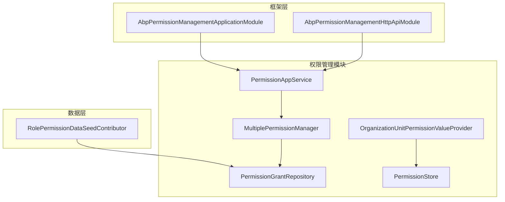
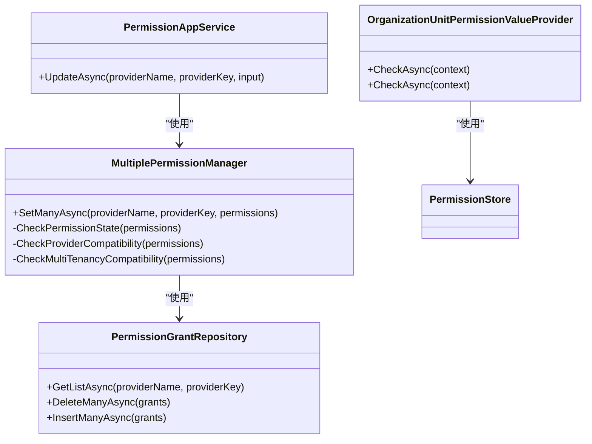
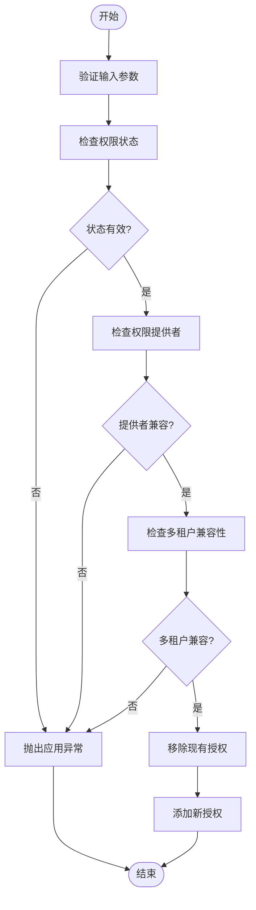
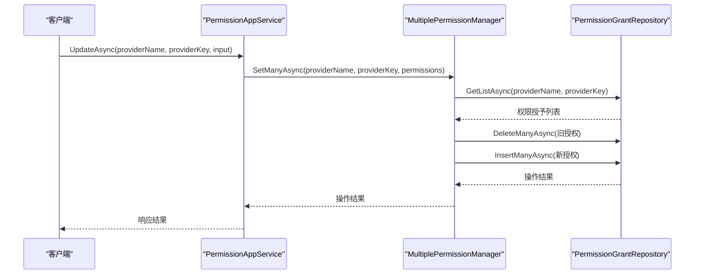
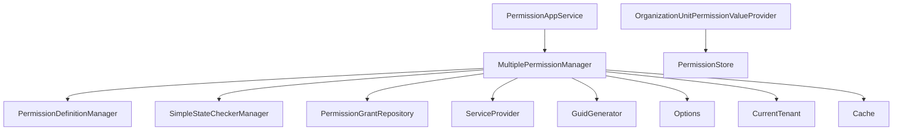

# 权限控制

<cite>
**本文档中引用的文件**
- [MultiplePermissionManager.cs](file://aspnet-core\modules\permissions-management\LINGYUN.Abp.PermissionManagement.Application\LINGYUN\Abp\PermissionManagement\MultiplePermissionManager.cs)
- [PermissionAppService.cs](file://aspnet-core\modules\permissions-management\LINGYUN.Abp.PermissionManagement.Application\LINGYUN\Abp\PermissionManagement\PermissionAppService.cs)
- [OrganizationUnitPermissionValueProvider.cs](file://aspnet-core\framework\authorization\LINGYUN.Abp.Authorization.OrganizationUnits\LINGYUN\Abp\Authorization\Permissions\OrganizationUnitPermissionValueProvider.cs)
- [AbpPermissionManagementApplicationModule.cs](file://aspnet-core\modules\permissions-management\LINGYUN.Abp.PermissionManagement.Application\LINGYUN\Abp\PermissionManagement\AbpPermissionManagementApplicationModule.cs)
- [AbpPermissionManagementHttpApiModule.cs](file://aspnet-core\modules\permissions-management\LINGYUN.Abp.PermissionManagement.HttpApi\LINGYUN\Abp\PermissionManagement\HttpApi\AbpPermissionManagementHttpApiModule.cs)
- [PermissionManagementControllerBase.cs](file://aspnet-core\modules\permissions-management\LINGYUN.Abp.PermissionManagement.HttpApi\LINGYUN\Abp\PermissionManagement\HttpApi\PermissionManagementControllerBase.cs)
- [RolePermissionDataSeedContributor.cs](file://aspnet-core\migrations\LY.MicroService.Applications.Single.EntityFrameworkCore\DataSeeder\RolePermissionDataSeedContributor.cs)
</cite>

## 目录
1. [简介](#简介)
2. [项目结构](#项目结构)
3. [核心组件](#核心组件)
4. [架构概述](#架构概述)
5. [详细组件分析](#详细组件分析)
6. [依赖分析](#依赖分析)
7. [性能考虑](#性能考虑)
8. [故障排除指南](#故障排除指南)
9. [结论](#结论)

## 简介
本项目实现了一个基于角色的访问控制（RBAC）和基于功能的权限管理系统。系统提供了灵活的权限定义、分配、继承和验证机制，支持多租户环境下的权限管理。权限系统通过模块化设计，实现了权限的集中管理和分布式验证，确保了系统的安全性和可扩展性。

## 项目结构
权限控制系统主要由以下几个模块组成：
- 权限管理应用层（Application）
- 权限管理HTTP API层（HttpApi）
- 授权框架（Authorization）
- 数据迁移（Migrations）

**图示来源**
- [MultiplePermissionManager.cs](file://aspnet-core\modules\permissions-management\LINGYUN.Abp.PermissionManagement.Application\LINGYUN\Abp\PermissionManagement\MultiplePermissionManager.cs)
- [PermissionAppService.cs](file://aspnet-core\modules\permissions-management\LINGYUN.Abp.PermissionManagement.Application\LINGYUN\Abp\PermissionManagement\PermissionAppService.cs)
- [OrganizationUnitPermissionValueProvider.cs](file://aspnet-core\framework\authorization\LINGYUN.Abp.Authorization.OrganizationUnits\LINGYUN\Abp\Authorization\Permissions\OrganizationUnitPermissionValueProvider.cs)

**章节来源**
- [MultiplePermissionManager.cs](file://aspnet-core\modules\permissions-management\LINGYUN.Abp.PermissionManagement.Application\LINGYUN\Abp\PermissionManagement\MultiplePermissionManager.cs)
- [PermissionAppService.cs](file://aspnet-core\modules\permissions-management\LINGYUN.Abp.PermissionManagement.Application\LINGYUN\Abp\PermissionManagement\PermissionAppService.cs)

## 核心组件
权限控制系统的核心组件包括：
- **MultiplePermissionManager**: 多权限管理器，负责权限的批量设置和验证
- **PermissionAppService**: 权限应用服务，提供权限管理的API接口
- **OrganizationUnitPermissionValueProvider**: 组织单元权限值提供者，实现基于组织单元的权限验证
- **PermissionGrantRepository**: 权限授予存储库，管理权限授予记录

**章节来源**
- [MultiplePermissionManager.cs](file://aspnet-core\modules\permissions-management\LINGYUN.Abp.PermissionManagement.Application\LINGYUN\Abp\PermissionManagement\MultiplePermissionManager.cs)
- [PermissionAppService.cs](file://aspnet-core\modules\permissions-management\LINGYUN.Abp.PermissionManagement.Application\LINGYUN\Abp\PermissionManagement\PermissionAppService.cs)

## 架构概述
权限控制系统采用分层架构设计，主要包括应用层、领域层和基础设施层。系统通过依赖注入实现组件间的解耦，使用缓存提高权限验证的性能。

**图示来源**
- [MultiplePermissionManager.cs](file://aspnet-core\modules\permissions-management\LINGYUN.Abp.PermissionManagement.Application\LINGYUN\Abp\PermissionManagement\MultiplePermissionManager.cs)
- [PermissionAppService.cs](file://aspnet-core\modules\permissions-management\LINGYUN.Abp.PermissionManagement.Application\LINGYUN\Abp\PermissionManagement\PermissionAppService.cs)
- [OrganizationUnitPermissionValueProvider.cs](file://aspnet-core\framework\authorization\LINGYUN.Abp.Authorization.OrganizationUnits\LINGYUN\Abp\Authorization\Permissions\OrganizationUnitPermissionValueProvider.cs)

## 详细组件分析

### MultiplePermissionManager 分析
MultiplePermissionManager 是权限管理系统的核心服务，负责权限的批量设置和验证。它继承自 ABP 框架的 PermissionManager，并实现了 IMultiplePermissionManager 接口。

**图示来源**
- [MultiplePermissionManager.cs](file://aspnet-core\modules\permissions-management\LINGYUN.Abp.PermissionManagement.Application\LINGYUN\Abp\PermissionManagement\MultiplePermissionManager.cs)

**章节来源**
- [MultiplePermissionManager.cs](file://aspnet-core\modules\permissions-management\LINGYUN.Abp.PermissionManagement.Application\LINGYUN\Abp\PermissionManagement\MultiplePermissionManager.cs)

### PermissionAppService 分析
PermissionAppService 是权限管理的应用服务，提供了权限管理的API接口。它通过依赖注入使用 MultiplePermissionManager 服务来实现权限的批量更新。

**图示来源**
- [PermissionAppService.cs](file://aspnet-core\modules\permissions-management\LINGYUN.Abp.PermissionManagement.Application\LINGYUN\Abp\PermissionManagement\PermissionAppService.cs)
- [MultiplePermissionManager.cs](file://aspnet-core\modules\permissions-management\LINGYUN.Abp.PermissionManagement.Application\LINGYUN\Abp\PermissionManagement\MultiplePermissionManager.cs)

**章节来源**
- [PermissionAppService.cs](file://aspnet-core\modules\permissions-management\LINGYUN.Abp.PermissionManagement.Application\LINGYUN\Abp\PermissionManagement\PermissionAppService.cs)

## 依赖分析
权限控制系统依赖于 ABP 框架的核心组件，包括权限管理、缓存、依赖注入等。系统通过模块化设计，实现了与其他模块的松耦合。

**图示来源**
- [MultiplePermissionManager.cs](file://aspnet-core\modules\permissions-management\LINGYUN.Abp.PermissionManagement.Application\LINGYUN\Abp\PermissionManagement\MultiplePermissionManager.cs)
- [OrganizationUnitPermissionValueProvider.cs](file://aspnet-core\framework\authorization\LINGYUN.Abp.Authorization.OrganizationUnits\LINGYUN\Abp\Authorization\Permissions\OrganizationUnitPermissionValueProvider.cs)

**章节来源**
- [MultiplePermissionManager.cs](file://aspnet-core\modules\permissions-management\LINGYUN.Abp.PermissionManagement.Application\LINGYUN\Abp\PermissionManagement\MultiplePermissionManager.cs)
- [OrganizationUnitPermissionValueProvider.cs](file://aspnet-core\framework\authorization\LINGYUN.Abp.Authorization.OrganizationUnits\LINGYUN\Abp\Authorization\Permissions\OrganizationUnitPermissionValueProvider.cs)

## 性能考虑
权限控制系统通过以下方式优化性能：
1. 使用分布式缓存存储权限授予信息，减少数据库查询
2. 批量处理权限设置操作，减少数据库事务开销
3. 实现权限状态检查的异步处理，提高响应速度
4. 使用连接查询优化权限验证过程

## 故障排除指南
常见问题及解决方案：
1. **权限更新后不生效**：检查缓存是否正确更新，确认权限授予记录已持久化
2. **权限验证失败**：检查权限定义、提供者和多租户兼容性
3. **性能问题**：检查缓存配置，确保分布式缓存正常工作
4. **权限继承问题**：确认组织单元层级结构正确，权限值提供者配置正确

**章节来源**
- [MultiplePermissionManager.cs](file://aspnet-core\modules\permissions-management\LINGYUN.Abp.PermissionManagement.Application\LINGYUN\Abp\PermissionManagement\MultiplePermissionManager.cs)
- [OrganizationUnitPermissionValueProvider.cs](file://aspnet-core\framework\authorization\LINGYUN.Abp.Authorization.OrganizationUnits\LINGYUN\Abp\Authorization\Permissions\OrganizationUnitPermissionValueProvider.cs)

## 结论
本权限控制系统实现了完整的基于角色和功能的权限管理机制。系统通过模块化设计和分层架构，提供了灵活、可扩展的权限管理解决方案。核心组件 MultiplePermissionManager 和 PermissionAppService 提供了强大的权限批量处理能力，而 OrganizationUnitPermissionValueProvider 则支持基于组织单元的复杂权限验证。系统还考虑了性能优化和多租户支持，适用于大型企业级应用。