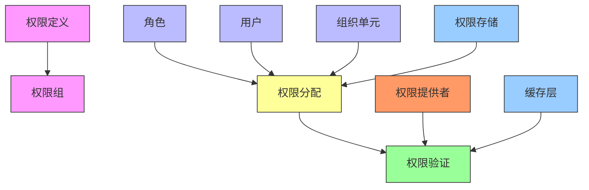
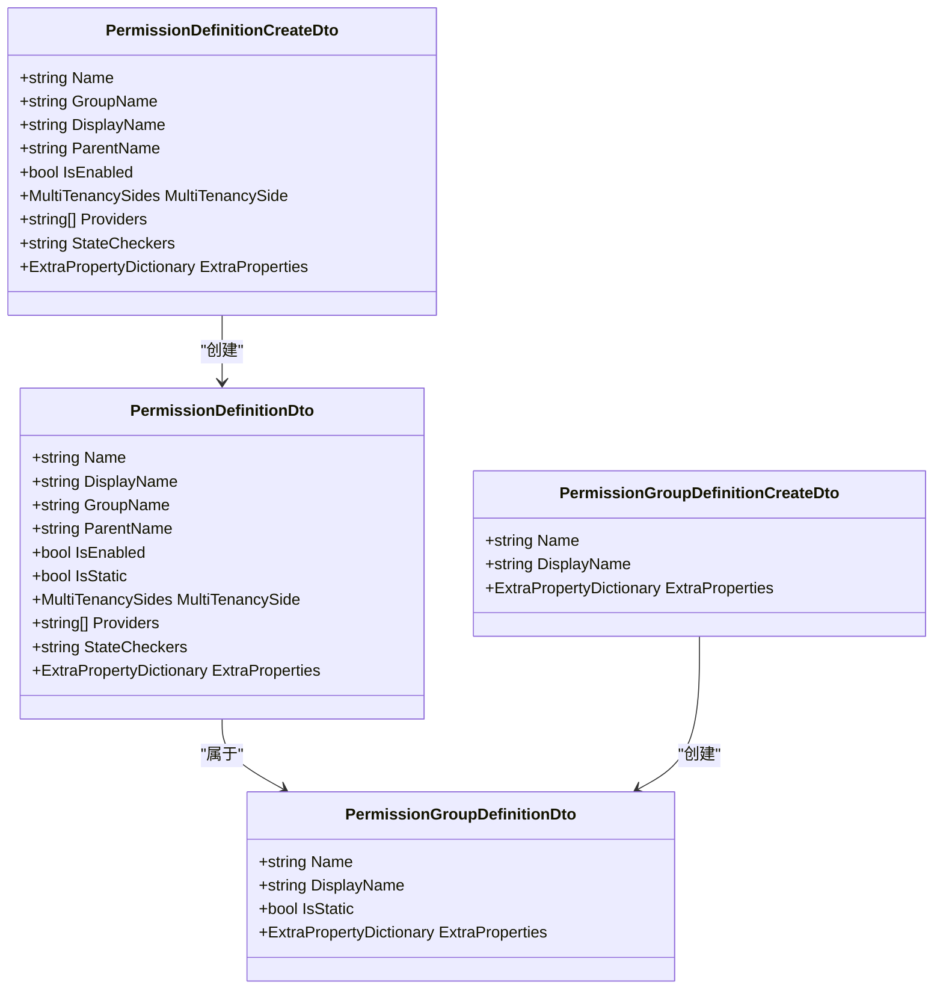
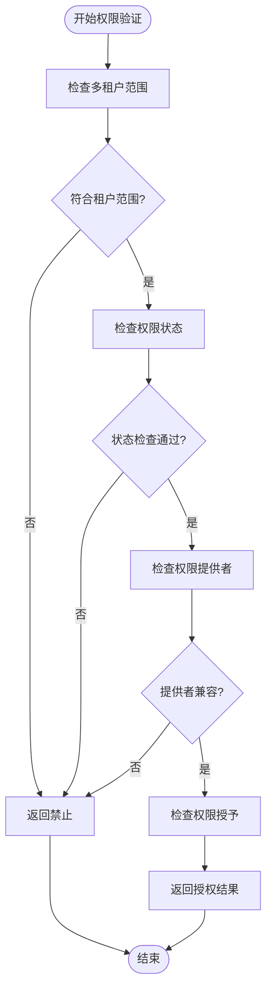
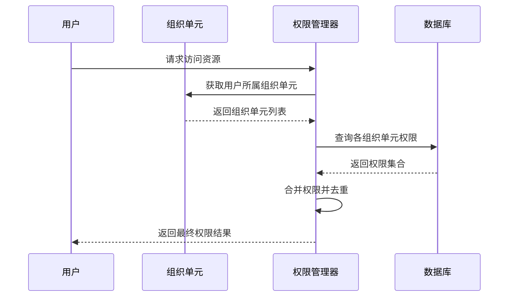

# 权限分配

<cite>
**本文档引用的文件**  
- [PermissionDefinitionAppService.cs](file://aspnet-core/modules/permissions-management/LINGYUN.Abp.PermissionManagement.Application/LINGYUN/Abp/PermissionManagement/Definitions/PermissionDefinitionAppService.cs)
- [PermissionGroupDefinitionAppService.cs](file://aspnet-core/modules/permissions-management/LINGYUN.Abp.PermissionManagement.Application/LINGYUN/Abp/PermissionManagement/Definitions/PermissionGroupDefinitionAppService.cs)
- [MultiplePermissionManager.cs](file://aspnet-core/modules/permissions-management/LINGYUN.Abp.PermissionManagement.Application/LINGYUN/Abp/PermissionManagement/MultiplePermissionManager.cs)
- [OrganizationUnitPermissionManagementProvider.cs](file://aspnet-core/modules/permissions-management/LINGYUN.Abp.PermissionManagement.Domain.OrganizationUnits/LINGYUN/Abp/PermissionManagement/OrganizationUnits/OrganizationUnitPermissionManagementProvider.cs)
- [PermissionDefinitionController.cs](file://aspnet-core/modules/permissions-management/LINGYUN.Abp.PermissionManagement.HttpApi/LINGYUN/Abp/PermissionManagement/HttpApi/Definitions/PermissionDefinitionController.cs)
- [PermissionGroupDefinitionController.cs](file://aspnet-core/modules/permissions-management/LINGYUN.Abp.PermissionManagement.HttpApi/LINGYUN/Abp/PermissionManagement/HttpApi/Definitions/PermissionGroupDefinitionController.cs)
- [PermissionManagementErrorCodes.cs](file://aspnet-core/modules/permissions-management/LINGYUN.Abp.PermissionManagement.Application.Contracts/LINGYUN/Abp/PermissionManagement/PermissionManagementErrorCodes.cs)
- [IdentityPermissionDefinitionProvider.cs](file://aspnet-core/modules/identity/LINGYUN.Abp.Identity.Application.Contracts/LINGYUN/Abp/Identity/IdentityPermissionDefinitionProvider.cs)
- [RolePermissionDataSeedContributor.cs](file://aspnet-core/migrations/LY.MicroService.BackendAdmin.EntityFrameworkCore/RolePermissionDataSeedContributor.cs)
</cite>

## 目录
1. [简介](#简介)
2. [权限体系架构](#权限体系架构)
3. [权限定义与分组](#权限定义与分组)
4. [权限控制策略](#权限控制策略)
5. [权限继承与覆盖机制](#权限继承与覆盖机制)
6. [API接口文档](#api接口文档)
7. [实际应用案例](#实际应用案例)
8. [错误代码说明](#错误代码说明)

## 简介

本系统实现了基于功能的精细化权限管理体系，支持动态权限定义、权限组划分和多级权限继承。权限管理模块提供了完整的权限配置API，支持将权限分配给角色、用户以及组织单元，并实现了细粒度的权限控制策略。

该权限体系遵循ABP框架的安全设计原则，通过权限提供者（Permission Provider）机制实现灵活的权限验证，同时支持静态权限和动态权限的混合管理，满足复杂业务场景下的权限需求。

**Section sources**
- [PermissionDefinitionAppService.cs](file://aspnet-core/modules/permissions-management/LINGYUN.Abp.PermissionManagement.Application/LINGYUN/Abp/PermissionManagement/Definitions/PermissionDefinitionAppService.cs#L0-L30)
- [PermissionGroupDefinitionAppService.cs](file://aspnet-core/modules/permissions-management/LINGYUN.Abp.PermissionManagement.Application/LINGYUN/Abp/PermissionManagement/Definitions/PermissionGroupDefinitionAppService.cs#L0-L29)

## 权限体系架构



**Diagram sources**
- [PermissionDefinitionAppService.cs](file://aspnet-core/modules/permissions-management/LINGYUN.Abp.PermissionManagement.Application/LINGYUN/Abp/PermissionManagement/Definitions/PermissionDefinitionAppService.cs#L30-L53)
- [MultiplePermissionManager.cs](file://aspnet-core/modules/permissions-management/LINGYUN.Abp.PermissionManagement.Application/LINGYUN/Abp/PermissionManagement/MultiplePermissionManager.cs#L35-L70)

**Section sources**
- [PermissionDefinitionAppService.cs](file://aspnet-core/modules/permissions-management/LINGYUN.Abp.PermissionManagement.Application/LINGYUN/Abp/PermissionManagement/Definitions/PermissionDefinitionAppService.cs#L30-L53)
- [MultiplePermissionManager.cs](file://aspnet-core/modules/permissions-management/LINGYUN.Abp.PermissionManagement.Application/LINGYUN/Abp/PermissionManagement/MultiplePermissionManager.cs#L35-L70)

## 权限定义与分组

### 权限定义

系统支持动态创建和管理权限定义，每个权限具有以下属性：

| 属性 | 说明 |
|------|------|
| Name | 权限名称，唯一标识符 |
| DisplayName | 显示名称，用于界面展示 |
| GroupName | 所属权限组 |
| ParentName | 父级权限名称 |
| IsEnabled | 是否启用 |
| IsStatic | 是否为静态权限 |
| MultiTenancySide | 多租户侧（租户端/主机端/两者） |
| Providers | 允许的权限提供者 |
| StateCheckers | 状态检查器 |

权限定义通过`IPermissionDefinitionAppService`接口进行管理，支持创建、更新、删除和查询操作。

### 权限分组

权限按功能模块进行分组管理，每个权限组包含一组相关的权限定义。权限组的主要特性包括：

- **分组管理**：将相关权限组织在一起，便于管理和查找
- **批量操作**：支持对整个权限组进行授权或取消授权
- **层级结构**：支持权限组的嵌套和继承

权限组通过`IPermissionGroupDefinitionAppService`接口进行管理，提供完整的CRUD操作。



**Diagram sources**
- [PermissionDefinitionDto.cs](file://aspnet-core/modules/permissions-management/LINGYUN.Abp.PermissionManagement.Application.Contracts/LINGYUN/Abp/PermissionManagement/Definitions/Dto/PermissionDefinitionDto.cs#L0-L27)
- [PermissionGroupDefinitionDto.cs](file://aspnet-core/modules/permissions-management/LINGYUN.Abp.PermissionManagement.Application.Contracts/LINGYUN/Abp/PermissionManagement/Definitions/Dto/PermissionGroupDefinitionDto.cs#L0-L13)

**Section sources**
- [PermissionDefinitionAppService.cs](file://aspnet-core/modules/permissions-management/LINGYUN.Abp.PermissionManagement.Application/LINGYUN/Abp/PermissionManagement/Definitions/PermissionDefinitionAppService.cs#L52-L80)
- [PermissionGroupDefinitionAppService.cs](file://aspnet-core/modules/permissions-management/LINGYUN.Abp.PermissionManagement.Application/LINGYUN/Abp/PermissionManagement/Definitions/PermissionGroupDefinitionAppService.cs#L50-L82)

## 权限控制策略

### 权限提供者

系统实现了多种权限提供者，用于不同的授权场景：

- **UserPermissionValueProvider**：用户级别权限提供者
- **RolePermissionValueProvider**：角色级别权限提供者
- **OrganizationUnitPermissionValueProvider**：组织单元级别权限提供者

每种权限提供者负责特定范围的权限验证，通过组合使用可以实现复杂的权限控制逻辑。

### 细粒度权限控制

系统支持细粒度的权限控制策略，包括：

- **多租户支持**：权限可指定适用于租户端、主机端或两者
- **状态检查**：支持自定义状态检查器，根据业务状态决定权限是否生效
- **权限范围限制**：通过Providers字段限制权限的适用范围



**Diagram sources**
- [MultiplePermissionManager.cs](file://aspnet-core/modules/permissions-management/LINGYUN.Abp.PermissionManagement.Application/LINGYUN/Abp/PermissionManagement/MultiplePermissionManager.cs#L35-L70)
- [PermissionDefinitionAppService.cs](file://aspnet-core/modules/permissions-management/LINGYUN.Abp.PermissionManagement.Application/LINGYUN/Abp/PermissionManagement/Definitions/PermissionDefinitionAppService.cs#L198-L231)

**Section sources**
- [MultiplePermissionManager.cs](file://aspnet-core/modules/permissions-management/LINGYUN.Abp.PermissionManagement.Application/LINGYUN/Abp/PermissionManagement/MultiplePermissionManager.cs#L35-L70)
- [PermissionDefinitionAppService.cs](file://aspnet-core/modules/permissions-management/LINGYUN.Abp.PermissionManagement.Application/LINGYUN/Abp/PermissionManagement/Definitions/PermissionDefinitionAppService.cs#L198-L231)

## 权限继承与覆盖机制

### 组织单元权限继承

系统支持基于组织单元的权限继承机制，当用户属于多个组织单元时，其权限为所有所属组织单元权限的并集。



**Diagram sources**
- [OrganizationUnitPermissionManagementProvider.cs](file://aspnet-core/modules/permissions-management/LINGYUN.Abp.PermissionManagement.Domain.OrganizationUnits/LINGYUN/Abp/PermissionManagement/OrganizationUnits/OrganizationUnitPermissionManagementProvider.cs#L59-L82)
- [OrganizationUnitPermissionValueProvider.cs](file://aspnet-core/framework/authorization/LINGYUN.Abp.Authorization.OrganizationUnits/LINGYUN/Abp/Authorization/Permissions/OrganizationUnitPermissionValueProvider.cs#L36-L81)

**Section sources**
- [OrganizationUnitPermissionManagementProvider.cs](file://aspnet-core/modules/permissions-management/LINGYUN.Abp.PermissionManagement.Domain.OrganizationUnits/LINGYUN/Abp/PermissionManagement/OrganizationUnits/OrganizationUnitPermissionManagementProvider.cs#L59-L82)
- [OrganizationUnitPermissionValueProvider.cs](file://aspnet-core/framework/authorization/LINGYUN.Abp.Authorization.OrganizationUnits/LINGYUN/Abp/Authorization/Permissions/OrganizationUnitPermissionValueProvider.cs#L36-L81)

### 多级权限覆盖

系统实现了多级权限覆盖机制，权限优先级从高到低依次为：

1. 用户级别权限
2. 角色级别权限
3. 组织单元级别权限

当同一权限在多个级别被设置时，高优先级的设置会覆盖低优先级的设置。

## API接口文档

### 权限定义API

#### 创建权限定义
- **URL**: `/api/permission-management/definitions`
- **方法**: POST
- **权限**: `PermissionManagement.Definitions.Create`
- **请求体**: `PermissionDefinitionCreateDto`
- **响应**: `PermissionDefinitionDto`

#### 更新权限定义
- **URL**: `/api/permission-management/definitions/{name}`
- **方法**: PUT
- **权限**: `PermissionManagement.Definitions.Update`
- **请求体**: `PermissionDefinitionUpdateDto`
- **响应**: `PermissionDefinitionDto`

#### 删除权限定义
- **URL**: `/api/permission-management/definitions/{name}`
- **方法**: DELETE
- **权限**: `PermissionManagement.GroupDefinitions.Delete`
- **响应**: 无

#### 查询权限定义列表
- **URL**: `/api/permission-management/definitions`
- **方法**: GET
- **权限**: `PermissionManagement.Definitions.Default`
- **参数**: `PermissionDefinitionGetListInput`
- **响应**: `ListResultDto<PermissionDefinitionDto>`

### 权限组API

#### 创建权限组
- **URL**: `/api/permission-management/definitions/groups`
- **方法**: POST
- **权限**: `PermissionManagement.GroupDefinitions.Create`
- **请求体**: `PermissionGroupDefinitionCreateDto`
- **响应**: `PermissionGroupDefinitionDto`

#### 更新权限组
- **URL**: `/api/permission-management/definitions/groups/{name}`
- **方法**: PUT
- **权限**: `PermissionManagement.GroupDefinitions.Update`
- **请求体**: `PermissionGroupDefinitionUpdateDto`
- **响应**: `PermissionGroupDefinitionDto`

#### 删除权限组
- **URL**: `/api/permission-management/definitions/groups/{name}`
- **方法**: DELETE
- **权限**: `PermissionManagement.GroupDefinitions.Delete`
- **响应**: 无

#### 查询权限组列表
- **URL**: `/api/permission-management/definitions/groups`
- **方法**: GET
- **权限**: `PermissionManagement.GroupDefinitions.Default`
- **参数**: `PermissionGroupDefinitionGetListInput`
- **响应**: `ListResultDto<PermissionGroupDefinitionDto>`

**Section sources**
- [PermissionDefinitionController.cs](file://aspnet-core/modules/permissions-management/LINGYUN.Abp.PermissionManagement.HttpApi/LINGYUN/Abp/PermissionManagement/HttpApi/Definitions/PermissionDefinitionController.cs#L34-L61)
- [PermissionGroupDefinitionController.cs](file://aspnet-core/modules/permissions-management/LINGYUN.Abp.PermissionManagement.HttpApi/LINGYUN/Abp/PermissionManagement/HttpApi/Definitions/PermissionGroupDefinitionController.cs#L0-L62)

## 实际应用案例

### 案例一：后台管理系统权限配置

在后台管理系统中，通过权限种子贡献者为新租户初始化管理员角色权限：

```csharp
public async virtual Task SeedAsync(DataSeedContext context)
{
    using (CurrentTenant.Change(context.TenantId))
    {
        Logger.LogInformation("Seeding the new tenant admin role permissions...");

        var definitionPermissions = await PermissionDefinitionManager.GetPermissionsAsync();
        await PermissionDataSeeder.SeedAsync(
            RolePermissionValueProvider.ProviderName,
            "admin",
            definitionPermissions.Select(x => x.Name),
            context.TenantId);

        await PermissionDataSeeder.SeedAsync(
            RolePermissionValueProvider.ProviderName,
            "Users",
            new string[] { "Platform.Feedback.Create" },
            context.TenantId);
    }
}
```

此案例展示了如何为"admin"角色分配所有可用权限，同时为"Users"角色仅分配反馈创建权限。

### 案例二：组织单元权限管理

通过扩展方法简化组织单元权限管理：

```csharp
public static class OrganizationUnitPermissionManagerExtensions
{
    public static Task<PermissionWithGrantedProviders> GetForOrganizationUnitAsync(
        [NotNull] this IPermissionManager permissionManager,
        string organizationUnitCode,
        string permissionName)
    {
        return permissionManager.GetAsync(permissionName, OrganizationUnitPermissionValueProvider.ProviderName, organizationUnitCode);
    }

    public static Task<List<PermissionWithGrantedProviders>> GetAllForOrganizationUnitAsync(
        [NotNull] this IPermissionManager permissionManager,
        string organizationUnitCode)
    {
        return permissionManager.GetAllAsync(OrganizationUnitPermissionValueProvider.ProviderName, organizationUnitCode);
    }

    public static Task SetForOrganizationUnitAsync(
        [NotNull] this IPermissionManager permissionManager,
        string organizationUnitCode,
        [NotNull] string permissionName,
        bool isGranted)
    {
        return permissionManager.SetAsync(permissionName, OrganizationUnitPermissionValueProvider.ProviderName, organizationUnitCode, isGranted);
    }
}
```

这些扩展方法提供了简洁的API来管理组织单元级别的权限。

### 案例三：身份模块权限定义

在身份模块中定义权限层次结构：

```csharp
var identityGroup = configuration.AddGroup(IdentityPermissions.GroupName, L("Permission:IdentityManagement"));

var userPermission = identityGroup.AddPermission(IdentityPermissions.Users.Default, L("Permission:UserManagement"));
userPermission.AddChild(IdentityPermissions.Users.Create, L("Permission:Create"));
userPermission.AddChild(IdentityPermissions.Users.Update, L("Permission:Edit"));
userPermission.AddChild(IdentityPermissions.Users.Delete, L("Permission:Delete"));
userPermission.AddChild(IdentityPermissions.Users.ManageRoles, L("Permission:ManageRoles"));
userPermission.AddChild(IdentityPermissions.Users.ManageOrganizationUnits, L("Permission:ManageOrganizationUnits"));
userPermission.AddChild(IdentityPermissions.Users.ManagePermissions, L("Permission:ChangePermissions"));
```

此案例展示了如何构建具有父子关系的权限树，实现模块化权限管理。

**Section sources**
- [RolePermissionDataSeedContributor.cs](file://aspnet-core/migrations/LY.MicroService.BackendAdmin.EntityFrameworkCore/RolePermissionDataSeedContributor.cs#L0-L36)
- [OrganizationUnitPermissionManagerExtensions.cs](file://aspnet-core/modules/permissions-management/LINGYUN.Abp.PermissionManagement.Domain.OrganizationUnits/Volo/Abp/PermissionManagement/OrganizationUnitPermissionManagerExtensions.cs#L0-L39)
- [IdentityPermissionDefinitionProvider.cs](file://aspnet-core/modules/identity/LINGYUN.Abp.Identity.Application.Contracts/LINGYUN/Abp/Identity/IdentityPermissionDefinitionProvider.cs#L24-L38)

## 错误代码说明

| 错误代码 | 说明 | 解决方案 |
|---------|------|----------|
| PermissionManagement:001010 | 静态权限组不允许修改 | 不要尝试修改系统预定义的静态权限组 |
| PermissionManagement:001100 | 权限组名称已存在 | 使用唯一的权限组名称 |
| PermissionManagement:001404 | 未找到指定名称的权限组 | 检查权限组名称是否正确 |
| PermissionManagement:002010 | 静态权限不允许修改 | 不要尝试修改系统预定义的静态权限 |
| PermissionManagement:002100 | 权限名称已存在 | 使用唯一的权限名称 |
| PermissionManagement:002404 | 未找到指定名称的权限 | 检查权限名称是否正确 |
| PermissionManagement:002400 | 状态检查器格式无效 | 检查状态检查器配置格式是否正确 |

**Section sources**
- [PermissionManagementErrorCodes.cs](file://aspnet-core/modules/permissions-management/LINGYUN.Abp.PermissionManagement.Application.Contracts/LINGYUN/Abp/PermissionManagement/PermissionManagementErrorCodes.cs#L0-L31)